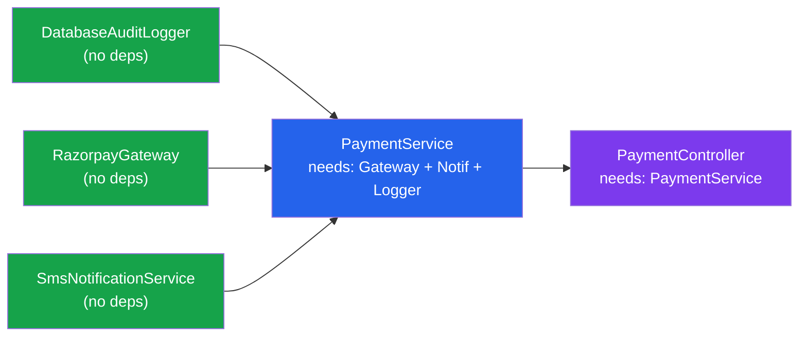
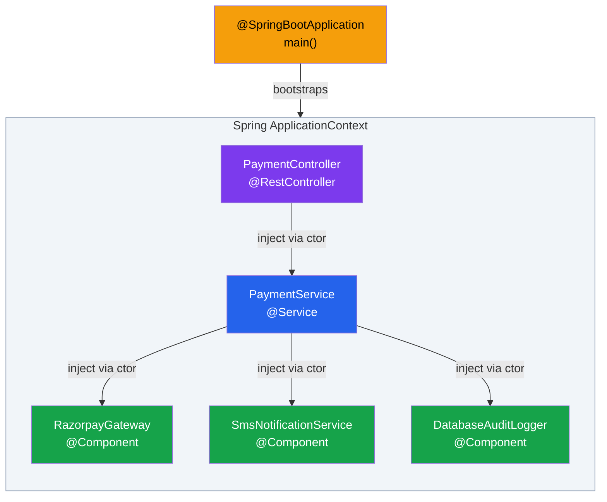
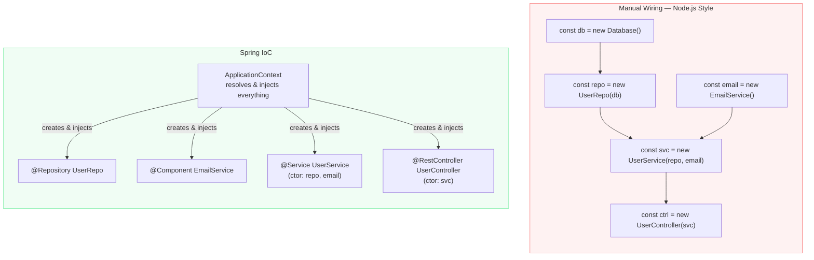

# IoC aur Dependency Injection — Spring ka Sabse Bada Magic

Seedha baat karte hain — agar tumne Spring Boot ka naam suna hai, toh IoC aur Dependency Injection bhi suna hoga. Aur agar tum Node.js/TypeScript se aa rahe ho, toh pehli reaction hoti hai: *"Yaar yeh sab kyun? Main toh simply `new UserService()` kar deta tha."*

Bilkul sahi soch raho. Lekin bhai, jab app chhoti hoti hai tab sab theek lagta hai. Jab Zomato jaisi app banate ho — hazaron services, repositories, external APIs, database connections — tab manually `new` karna ek nightmare ban jaata hai. Tab Spring ka IoC container hero ban ke aata hai.

Is file mein hum samjhenge:
- IoC kya hota hai aur kyun exist karta hai
- Dependency Injection kya hota hai (IoC achieve karne ka tarika)
- Node.js style se Spring style mein kya fark hai
- Practical code, gotchas, aur mental models

---

## Pehle Samjho: Problem Kya Thi?

Socho tum ek Swiggy jaisi food delivery app bana rahe ho Node.js/TypeScript mein. Shuru mein tum likhte ho:

```typescript
// Express/TypeScript — sab kuch haath se jodte ho
const db = new Database(process.env.DB_URL);
const userRepo = new UserRepository(db);
const restaurantRepo = new RestaurantRepository(db);
const emailService = new EmailService(process.env.SMTP_HOST);
const smsService = new SmsService(process.env.TWILIO_KEY);
const orderService = new OrderService(userRepo, restaurantRepo, emailService, smsService);
const paymentService = new PaymentService(process.env.RAZORPAY_KEY);
const orderController = new OrderController(orderService, paymentService);

app.post("/orders", (req, res) => orderController.placeOrder(req, res));
```

Shuru mein yeh theek lagta hai. Lekin jab app badi hoti hai:

**Problem 1 — Construction Order ka Darr:**
`orderService` se pehle `userRepo` banana padta hai, `userRepo` se pehle `db` banana padta hai. Ek bhi sequence galat hua — runtime crash. Yeh "topological sort by hand" hota hai, aur humans isme bahut bure hote hain.

**Problem 2 — Singleton ka Jhanjhat:**
`db` ek hi instance hona chahiye — baar baar naya connection nahi banaana. Toh tum module-level global banate ho. Phir testing mein woh global mock karna padta hai. Mess ho jaati hai.

**Problem 3 — Testing mein Tadap:**
Test likhte time real `EmailService` nahi use karna, mock use karna hai. Lekin `OrderService` ke andar `EmailService` hardcoded hai. Ya toh constructor mein optional parameter dalo, ya poora wiring code refactor karo. Dono options dard dete hain.

**Problem 4 — Jab Team Badi Ho:**
50 developers ki team hai. Har banda apni service ka `new` kar raha hai apne mann se. Koi configuration nahi, koi central place nahi, sab jaga scattered.

Yahi problem IoC solve karta hai.

---

## Inversion of Control (IoC) — Control Palat Do

**IoC ka matlab hai:** *Tumhara code dependencies create nahi karta. Container create karta hai aur tumhare haath mein thama deta hai.*

Normally control flow yeh hota hai:
> Tumhara code → `new UserService()` → `new UserRepository()` → ...

IoC mein control flow ulta ho jaata hai:
> Container → "Isko `UserService` chahiye" → Container khud banata hai → Tumhare paas de deta hai

> [!info] Hollywood Principle — IoC ka Mood
> *"Don't call us, we'll call you."*
> Tum Spring ko nahi bolte "mujhe yeh do." Tum declare karte ho "mujhe yeh chahiye," aur Spring apne time pe tumhe deta hai.

### Real Life Analogy — Zomato ka Kitchen Model

Socho tum ek Zomato customer ho. Tumhe burger chahiye.

**Without IoC (Manual wiring):**
Tum khud supermarket jaate ho, vegetables laate ho, bun laate ho, patty banate ho, assemble karte ho, phir khate ho. Sab kuch tumhara kaam.

**With IoC (Spring style):**
Tum Zomato pe order karte ho. Zomato internally restaurant dhundta hai, ingredients arrange karta hai, order banata hai, aur tumhe deliver karta hai. Tumhara kaam sirf "order declare karna" tha.

Spring ka IoC Container woh Zomato platform hai — tum sirf batao "mujhe `UserService` chahiye," baaki Spring handle karta hai.

---

## Dependency Injection (DI) — IoC ka Implementation

DI woh **technique** hai jis se IoC achieve hoti hai. Container tumhare object mein uski dependencies "inject" karta hai — bahar se thama deta hai — andar se nahi banata.

Teen tarike hote hain inject karne ke (detail [[05-Dependency-Injection-Types]] mein hai):

| Tarika | Kaise hota hai | Recommend? |
|--------|---------------|-----------|
| Constructor Injection | Constructor parameter mein | Haan, yahi best practice hai |
| Setter Injection | Setter method se | Kuch specific cases mein |
| Field Injection | `@Autowired` field pe directly | Avoid karo — hidden dependencies |

---

## Code Comparison — Node.js vs Spring

### Node.js/TypeScript Style (Manual)

```typescript
// TypeScript — haath se sab jodte hain
class EmailService {
  private smtpHost: string;
  
  constructor(smtpHost: string) {
    this.smtpHost = smtpHost;
  }
  
  send(to: string, msg: string): void {
    console.log(`EMAIL to ${to}: ${msg}`);
  }
}

class UserRepository {
  constructor(private db: Database) {}
  
  findById(id: string) { /* ... */ }
}

class UserService {
  // Haath se dependencies lo
  constructor(
    private userRepo: UserRepository,
    private emailService: EmailService
  ) {}
  
  signup(email: string) {
    // user save karo
    this.emailService.send(email, "Welcome to Swiggy!");
  }
}

// main.ts mein sab kuch haath se wire karo
const db = new Database(process.env.DB_URL!);
const userRepo = new UserRepository(db);
const emailService = new EmailService(process.env.SMTP_HOST!);
const userService = new UserService(userRepo, emailService); // tum kar rahe ho yeh kaam
```

### Spring Java Style (IoC + DI)

```java
// Interface define karo — implementation se alag
public interface NotificationSender {
    void send(String to, String message);
}

// @Component — Spring ko bolo "yeh bean manage karo"
@Component
public class EmailNotificationSender implements NotificationSender {
    
    @Override
    public void send(String to, String message) {
        // Real implementation mein JavaMailSender use karte
        System.out.println("EMAIL -> " + to + ": " + message);
    }
}

// @Service — Spring ko bolo "yeh bhi manage karo"
@Service
public class UserSignupService {
    
    private final NotificationSender sender; // interface pe depend karo, implementation pe nahi
    
    // Constructor injection — Spring yahan inject karega
    // "Mujhe ek NotificationSender chahiye" — yahi declaration hai
    public UserSignupService(NotificationSender sender) {
        this.sender = sender; // Spring EmailNotificationSender inject karega
    }
    
    public void signup(String email) {
        // ... database mein user save karo ...
        sender.send(email, "Welcome to Swiggy!");
    }
}

// Spring Boot entry point
@SpringBootApplication
public class SwiggyApp {
    public static void main(String[] args) {
        // ApplicationContext — Spring ka container, sab beans yahan hain
        var ctx = SpringApplication.run(SwiggyApp.class, args);
        
        // Sirf yahan getBean — composition root mein
        var signupService = ctx.getBean(UserSignupService.class);
        signupService.signup("siddesh@swiggy.com");
    }
}
```

**Kya hua idhar?**

1. `@SpringBootApplication` ne component scanning start ki (poore package mein scan kiya)
2. Spring ne `EmailNotificationSender` aur `UserSignupService` dono dhunde
3. `UserSignupService` ka constructor dekha — "isko `NotificationSender` chahiye"
4. Spring ne socha — "mere paas `EmailNotificationSender` hai jo `NotificationSender` implement karta hai, perfect match"
5. Pehle `EmailNotificationSender` banaya, phir `UserSignupService` mein inject kiya
6. Tum `ctx.getBean()` se ready-made, fully-wired object paate ho

Tumne kabhi `new` nahi kiya. Spring ne sab kiya.

---

## Complete Practical Example — UPI Payment Flow

Ek real-world jaisa example dekho. Socho Paytm jaisi app mein payment processing:

```java
// --- Interfaces (Contracts) ---

public interface PaymentGateway {
    PaymentResult process(PaymentRequest request);
}

public interface NotificationService {
    void notifyUser(String userId, String message);
}

public interface AuditLogger {
    void log(String event, Object data);
}

// --- Implementations ---

// Razorpay payment gateway
@Component("razorpayGateway")
public class RazorpayGateway implements PaymentGateway {
    
    // @Value — application.properties se value inject karo
    @Value("${razorpay.api.key}")
    private String apiKey;
    
    @Override
    public PaymentResult process(PaymentRequest request) {
        // Razorpay API call karo
        System.out.println("Processing via Razorpay: " + request.getAmount());
        return new PaymentResult("SUCCESS", "TXN_" + System.currentTimeMillis());
    }
}

// SMS notification
@Component
public class SmsNotificationService implements NotificationService {
    
    @Override
    public void notifyUser(String userId, String message) {
        System.out.println("SMS to user " + userId + ": " + message);
    }
}

// Database audit logger
@Component
public class DatabaseAuditLogger implements AuditLogger {
    
    @Override
    public void log(String event, Object data) {
        System.out.println("AUDIT: " + event + " | " + data.toString());
    }
}

// --- Main Service (sab dependencies inject hote hain) ---

@Service
public class PaymentService {
    
    private final PaymentGateway paymentGateway;
    private final NotificationService notificationService;
    private final AuditLogger auditLogger;
    
    // Spring in teeno ko dhundh ke inject karega automatically
    // Koi manual wiring nahi, koi "new" nahi
    public PaymentService(
            PaymentGateway paymentGateway,
            NotificationService notificationService,
            AuditLogger auditLogger) {
        this.paymentGateway = paymentGateway;
        this.notificationService = notificationService;
        this.auditLogger = auditLogger;
    }
    
    public PaymentResult processPayment(String userId, double amount, String purpose) {
        // Step 1: Audit log karo
        auditLogger.log("PAYMENT_INITIATED", "User: " + userId + ", Amount: " + amount);
        
        // Step 2: Payment process karo
        var request = new PaymentRequest(userId, amount, purpose);
        var result = paymentGateway.process(request);
        
        // Step 3: User ko notify karo
        if ("SUCCESS".equals(result.getStatus())) {
            notificationService.notifyUser(
                userId,
                "Payment of Rs." + amount + " successful! TxnId: " + result.getTransactionId()
            );
        }
        
        // Step 4: Result audit karo
        auditLogger.log("PAYMENT_COMPLETED", result);
        
        return result;
    }
}

// --- Controller ---

@RestController
@RequestMapping("/api/payments")
public class PaymentController {
    
    private final PaymentService paymentService; // inject hoga
    
    public PaymentController(PaymentService paymentService) {
        this.paymentService = paymentService;
    }
    
    @PostMapping
    public ResponseEntity<PaymentResult> pay(@RequestBody PaymentRequest request) {
        var result = paymentService.processPayment(
            request.getUserId(),
            request.getAmount(),
            request.getPurpose()
        );
        return ResponseEntity.ok(result);
    }
}
```

**Ab testing kitni easy hai dekho:**

```java
@ExtendWith(MockitoExtension.class)
class PaymentServiceTest {
    
    @Mock
    PaymentGateway paymentGateway; // Razorpay mock — real API call nahi hoga
    
    @Mock
    NotificationService notificationService; // SMS mock — asli SMS nahi jayega
    
    @Mock
    AuditLogger auditLogger; // DB mock — asli DB mein log nahi hoga
    
    @InjectMocks
    PaymentService paymentService; // In teeno mocks inject karo
    
    @Test
    void shouldNotifyOnSuccessfulPayment() {
        // Arrange — mock setup
        when(paymentGateway.process(any())).thenReturn(
            new PaymentResult("SUCCESS", "TXN_123")
        );
        
        // Act
        paymentService.processPayment("user_99", 500.0, "Food order");
        
        // Assert — kya SMS gaya?
        verify(notificationService).notifyUser(eq("user_99"), contains("500"));
    }
}
```

Node.js mein yeh karne ke liye `jest.mock()` aur complex module mocking karna padta. Spring mein `@Mock` aur `@InjectMocks` — done. Kyunki hum interfaces pe depend kar rahe the, implementation swap karna trivial hai.

---

## IoC Container Ka Mental Model

Spring ka ApplicationContext ek **graph resolver** hai. Woh saari beans ko ek directed graph mein rakhta hai aur startup pe resolve karta hai.





Startup pe Spring:
1. Poore classpath mein beans dhundta hai (`@Component`, `@Service`, `@Repository`, `@Controller`)
2. Har bean ki dependencies dekhta hai (constructor parameters)
3. Sahi order mein sab create karta hai (leaf nodes pehle, dependents baad mein)
4. Ek baar sab ready — application ready

---

## Manual vs Spring — Side by Side



---

## DI vs Service Locator — Ek Galti Jo Sabse Zyada Hoti Hai

Spring mein `ApplicationContext` available hota hai aur tum kisi bhi jagah se `ctx.getBean()` call kar sakte ho. Yeh **anti-pattern** hai — "Service Locator" pattern.

```java
@Service
public class OrderService {
    
    @Autowired
    private ApplicationContext ctx; // GALAT — container ko andar mat ghusao
    
    public void placeOrder(Order order) {
        // ANTI-PATTERN: Service Locator
        var paymentService = ctx.getBean(PaymentService.class); // Hidden dependency!
        paymentService.process(order);
    }
}
```

**Kyun bura hai yeh?**

1. **Hidden dependencies** — `OrderService` ka signature dekhke pata nahi chalta ki isko `PaymentService` chahiye. Constructor mein nahi dikh raha.
2. **Testability broken** — Test mein `ApplicationContext` mock karna padega, which is painful.
3. **Coupling to Spring** — Business logic Spring ke container pe depend kar raha hai.

**Sahi tarika:**

```java
@Service
public class OrderService {
    
    private final PaymentService paymentService; // Explicit dependency — seedha dikh raha hai
    
    // Spring inject karega — clean, testable, clear
    public OrderService(PaymentService paymentService) {
        this.paymentService = paymentService;
    }
    
    public void placeOrder(Order order) {
        paymentService.process(order); // dependency visible hai
    }
}
```

`getBean()` sirf ek jagah use karo — `main()` method mein (composition root). Baaki har jagah constructor injection.

---

## Benefits Jo Actually Matter Karte Hain

> [!tip] IoC/DI se kya milta hai practically
>
> **Decoupling — Interface pe depend karo:**
> `OrderService` ko pata nahi ki `RazorpayGateway` hai ya `PaytmGateway`. Bas `PaymentGateway` interface chahiye. Kal Razorpay ki jagah PhonePe use karna ho — sirf nayi implementation banao, `OrderService` touch mat karo.
>
> **Testability — Mocking trivial hai:**
> Constructor mein interfaces hain toh test mein mock thama do. Real Razorpay API, real SMS, real DB — kuch nahi chahiye testing ke liye.
>
> **Singleton Management — Container ka kaam:**
> `Database` connection ek baar banta hai, saari services mein share hota hai. Tum kuch nahi karte — Spring by default singleton scope mein banata hai beans ko. (Scopes ke baare mein [[06-Bean-Scopes-Lifecycle]] mein padho.)
>
> **Configuration-driven switching:**
> `@Profile("prod")` pe `RazorpayGateway` use karo, `@Profile("test")` pe `MockPaymentGateway`. Code touch kiye bina environment switch karo. ([[07-Profiles-and-Conditionals]] mein detail hai.)
>
> **Cross-cutting concerns — AOP:**
> Kyunki Spring tumhare objects ka lifecycle own karta hai, woh transactions, security, caching, logging bhi transparently add kar sakta hai — tumhara code touch kiye bina. ([[08-AOP-Basics]] mein padho.)

---

## Gotchas — Woh Galtiyan Jo Sab Karte Hain

> [!warning] Common Mistakes — Dhyan Se

**Gotcha 1: `new` karna beans ke andar**

```java
@Service
public class OrderService {
    
    // GALAT — Spring ko bypass kar rahe ho
    private final EmailService emailService = new EmailService(); // iska DI nahi hoga!
    
    // SAHI — inject karo
    // private final EmailService emailService; // constructor mein milega
}
```

Jab tum `new` karte ho, woh object Spring ke bahar hai. Uske andar koi `@Autowired` field inject nahi hogi, koi `@Transactional` kaam nahi karega, kuch nahi. Container ko pata hi nahi us object ka.

---

**Gotcha 2: Do beans ek hi interface implement karte hain**

```java
@Component
public class RazorpayGateway implements PaymentGateway { ... }

@Component
public class PaytmGateway implements PaymentGateway { ... }

@Service
public class OrderService {
    // CRASH — Spring confuse: "Kaunsa doon? Dono `PaymentGateway` hain!"
    public OrderService(PaymentGateway gateway) { ... }
}
```

Spring startup pe fail karega: `NoUniqueBeanDefinitionException`.

**Fix 1 — `@Primary` use karo:**

```java
@Component
@Primary // Yeh default hai jab ambiguity ho
public class RazorpayGateway implements PaymentGateway { ... }
```

**Fix 2 — `@Qualifier` use karo:**

```java
@Service
public class OrderService {
    
    public OrderService(@Qualifier("razorpayGateway") PaymentGateway gateway) {
        // Specifically Razorpay chahiye
    }
}
```

---

**Gotcha 3: Field Injection — Lagta Clean Hai, Hai Nahi**

```java
@Service
public class OrderService {
    
    @Autowired // Yeh kaam karta hai, lekin avoid karo
    private PaymentGateway paymentGateway;
    
    @Autowired
    private EmailService emailService;
}
```

Kya problem hai?

- Test likhne pe tum `new OrderService()` kar sakte ho — lekin fields `null` rahenge kyunki Spring inject nahi karega
- Dependencies "hidden" hain — class signature dekhke pata nahi chalega
- `final` nahi bana sakte field ko — immutability gai

**Hamesha constructor injection karo:**

```java
@Service
public class OrderService {
    
    private final PaymentGateway paymentGateway; // final — immutable
    private final EmailService emailService;
    
    // Saari dependencies visible hain — constructor dekhke sab pata chal jaata hai
    public OrderService(PaymentGateway paymentGateway, EmailService emailService) {
        this.paymentGateway = paymentGateway;
        this.emailService = emailService;
    }
}
```

---

**Gotcha 4: Bean Discoverable Nahi Hai**

```java
// @Component nahi hai — Spring isko nahi dekhega
public class PaymentValidator {
    public boolean validate(PaymentRequest request) { ... }
}

@Service
public class PaymentService {
    // CRASH — Spring ko PaymentValidator nahi mila
    public PaymentService(PaymentValidator validator) { ... }
}
```

Fix: Ya toh `@Component` lagao, ya `@Configuration` class mein `@Bean` method banao.

---

**Gotcha 5: Circular Dependency (Constructor Injection mein Fast Fail)**

```java
@Service
public class ServiceA {
    public ServiceA(ServiceB b) { ... } // A ko B chahiye
}

@Service
public class ServiceB {
    public ServiceB(ServiceA a) { ... } // B ko A chahiye — CIRCULAR!
}
```

Constructor injection ke saath Spring startup pe hi fail karega — yeh **good** hai. Warna runtime pe mysterious NullPointerException aate hain.

Fix: Design re-think karo. Kisi ek dependency ko extract karo ek teen class mein.

> [!info] Node.js se comparison
> Node.js mein circular `require()` silently kaam karta hai (partial module milti hai) — bug dhundhna nightmare hota hai. Spring mein constructor injection ke saath startup pe hi pata chal jaata hai.

---

## Node.js/TypeScript Equivalents

Agar tum `awilix`, `tsyringe`, ya `inversify` use kar chuke ho TypeScript mein, toh Spring ka IoC familiar lagega:

| Concept | TypeScript | Spring |
|---------|-----------|--------|
| Container | `awilix.createContainer()` | `ApplicationContext` |
| Bean registration | `container.register(...)` | `@Component` / `@Bean` |
| Inject dependency | `asClass(UserService)` | Constructor parameter |
| Singleton scope | `SINGLETON` | Default bean scope |
| Interface binding | TypeScript interface + register | `@Primary` / `@Qualifier` |

Bas Spring mein yeh sab **built-in** hai, koi extra library nahi. Aur annotations ki wajah se configuration bahut kam hai.

---

## Key Takeaways

- **IoC matlab:** Tum dependencies create nahi karte, Spring container karta hai. Control "inverted" hai.
- **DI matlab:** Container tumhare objects mein unki dependencies "inject" karta hai — constructor ke through (best practice), setter se, ya field pe.
- **`@Component`, `@Service`, `@Repository`, `@Controller`** — yeh annotations Spring ko batate hain "is class ka bean banao."
- **Constructor injection sabse best hai** — explicit dependencies, `final` fields, easy testing.
- **`@Autowired` on field — avoid karo.** Hidden dependencies, testing ke liye painful.
- **Interfaces pe depend karo, implementations pe nahi** — yahi DI ka asli fayda hai. Kal implementation badalni ho toh sirf nayi class banao.
- **`getBean()` sirf `main()` mein** — baaki har jagah constructor injection. Service Locator pattern = anti-pattern.
- **Circular dependency = design problem** — constructor injection se startup pe hi detect hoti hai, jo ache se bura nahi.
- **Testing aasaan ho jaati hai** — interfaces hain toh mocks thamo, done. Poora Razorpay/Twilio/DB mock karne ki zarurat nahi.

---

*Agle step mein: [[02-Beans-and-Application-Context]] — Beans kya hote hain, ApplicationContext kaisa kaam karta hai, aur lifecycle ke baare mein.*
