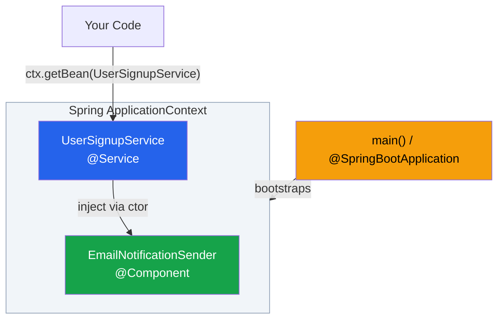
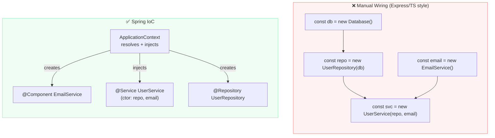

# IoC and Dependency Injection Concepts

> [!info] For the Express/TS dev
> In Express, you `new UserService(new UserRepo(db))` by hand at app startup. Wiring is **your** problem. In Spring, you declare *what* a class needs (via constructor params) and the framework hands you a fully-assembled object. It's the same pattern as `awilix` or `tsyringe` in Node — only it's the default.

## What is Inversion of Control?

**Inversion of Control (IoC)** flips the traditional control flow: instead of *your code* creating and managing dependencies, a **container** owns the lifecycle of objects and injects them where needed.

> [!note] The "Hollywood Principle"
> *"Don't call us, we'll call you."* You declare your needs; the container resolves them.

### Without IoC (manual, Express-style)

```typescript
// Express/TS — you wire it all
const db = new Database(process.env.DB_URL);
const userRepo = new UserRepository(db);
const emailService = new EmailService(process.env.SMTP);
const userService = new UserService(userRepo, emailService);
const userController = new UserController(userService);

app.get("/users/:id", (req, res) => userController.findById(req, res));
```

Problems as the app grows:
- Construction order matters (topological sort by hand).
- Sharing instances (singletons) requires module-level globals.
- Swapping for tests means refactoring `main.ts`.
- Configuration scatters everywhere.

### With IoC (Spring)

```java
@Service
public class UserService {
    private final UserRepository repo;
    private final EmailService email;

    // Spring sees this constructor and injects the dependencies
    public UserService(UserRepository repo, EmailService email) {
        this.repo = repo;
        this.email = email;
    }
}
```

You never call `new UserService(...)`. The **ApplicationContext** does.

## What is Dependency Injection?

**DI** is the *technique* by which IoC is achieved. The container "injects" collaborators into your object, rather than the object creating them.

Three flavors (covered in [[05-Dependency-Injection-Types]]):
1. Constructor injection (recommended)
2. Setter injection
3. Field injection (`@Autowired` on a field)

## Why bother? (Concrete benefits)

> [!tip] Benefits over manual wiring
> - **Decoupling** — code depends on interfaces, not concretes.
> - **Testability** — swap real `EmailService` with a mock in tests, no constructor-graph rewrite.
> - **Configuration-driven** — switch `MysqlUserRepository` to `PostgresUserRepository` via [[07-Profiles-and-Conditionals|@Profile]].
> - **Singleton management** — the container guarantees a single instance by default ([[06-Bean-Scopes-Lifecycle]]).
> - **Cross-cutting concerns** — transactions, security, caching plug in via [[08-AOP-Basics|AOP]] *because* the container owns your objects.

## Code example

A complete minimal Spring Core example:

```java
// 1. An interface
public interface NotificationSender {
    void send(String to, String msg);
}

// 2. An implementation marked as a Spring-managed bean
@Component
public class EmailNotificationSender implements NotificationSender {
    @Override
    public void send(String to, String msg) {
        System.out.println("EMAIL -> " + to + ": " + msg);
    }
}

// 3. A consumer that needs it — declares dependency in constructor
@Service
public class UserSignupService {
    private final NotificationSender sender;

    public UserSignupService(NotificationSender sender) {
        this.sender = sender;  // Spring injects EmailNotificationSender
    }

    public void signup(String email) {
        // ...persist user...
        sender.send(email, "Welcome!");
    }
}

// 4. Bootstrap (Spring Boot)
@SpringBootApplication
public class App {
    public static void main(String[] args) {
        var ctx = SpringApplication.run(App.class, args);
        var svc = ctx.getBean(UserSignupService.class);
        svc.signup("alice@example.com");
    }
}
```

> [!example] What just happened
> 1. `@SpringBootApplication` triggers [[03-Component-Scanning]].
> 2. Spring finds `EmailNotificationSender` and `UserSignupService`, registers them as [[02-Beans-and-Application-Context|beans]].
> 3. To create `UserSignupService`, it sees the constructor needs a `NotificationSender` — finds one bean implementing it, injects it.
> 4. You ask the [[02-Beans-and-Application-Context|ApplicationContext]] for `UserSignupService` and get a fully-wired object.

## DI vs Service Locator

> [!warning] Don't reach into the container at runtime
> ```java
> // ANTI-PATTERN — service locator
> var svc = ctx.getBean(UserService.class);
> ```
> Hides dependencies, breaks testability. Only use `getBean()` at the composition root (e.g. `main()`) or in framework code. Everywhere else, use constructor injection.

## Mental model: the container is a graph resolver

Think of the [[02-Beans-and-Application-Context|ApplicationContext]] as a topological sort engine:




If you add a circular dependency (`A` needs `B`, `B` needs `A`) with constructor injection, startup **fails fast** — which is good. See [[05-Dependency-Injection-Types#Circular dependencies]].

## Without IoC vs With IoC — side by side



## Gotchas

> [!warning] Common pitfalls
> - **`new` defeats the container.** If you `new UserService()` inside another bean, *its* dependencies aren't injected.
> - **Two beans implementing the same interface** → ambiguity error. Use `@Primary` or `@Qualifier`.
> - **Field injection looks clean but hides dependencies** — prefer constructor injection ([[05-Dependency-Injection-Types]]).
> - **Beans must be discoverable.** A class without `@Component`/`@Service`/etc., and not declared with `@Bean`, is invisible to Spring.

## Related
- [[02-Beans-and-Application-Context]]
- [[03-Component-Scanning]]
- [[04-Configuration-Classes]]
- [[05-Dependency-Injection-Types]]
- [[06-Bean-Scopes-Lifecycle]]
- [[08-AOP-Basics]]
- [[../05-Spring-Boot/06-SpringApplication-Bootstrap]]
