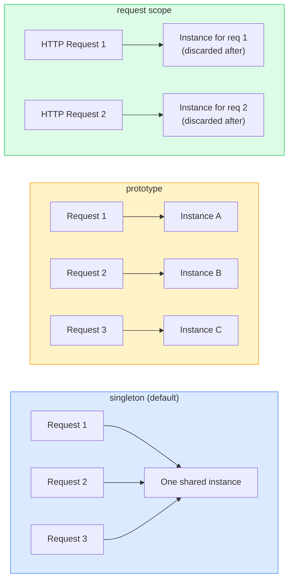
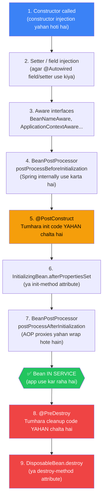

# Bean Scopes aur Lifecycle

Socho ek second — Zomato ka order tracking system. Ek cheez hoti hai jo **sabke saath share hoti hai** — jaise restaurant ka menu (ek hi menu, sab customers dekhte hain). Aur ek cheez hoti hai **har order ke liye alag** — jaise delivery bag (har order ka apna alag bag). Spring ka Bean Scope system exactly yahi decide karta hai: **ek bean ka ek hi instance banega, ya har baar naya?**

Agar tum Node.js/Express background se aaye ho, toh yeh suno — Node mein jab tum `require('./service')` karte ho, toh woh module ek baar load hota hai aur module cache mein reh jaata hai. Practically woh ek singleton hai. Spring mein yeh kaam **Application Context** karta hai, lekin Spring ke paas zyada flexibility hai — tum clearly bata sakte ho kaunsa bean kaise behave kare.

Yeh topic isliye important hai kyunki:
- Galat scope choose karo → **race conditions, data leak between users, ya memory waste**
- Lifecycle hooks na samjho → **resource leaks (open DB connections, file handles)**
- Aur production mein yeh bugs dhundhna ek nightmare hota hai

Chalo depth mein jaate hain.

---

## Scopes ka overview — pehle bada picture dekho

| Scope | Kya milta hai | Kab use karo |
|---|---|---|
| `singleton` (default) | Container mein ek hi instance | Stateless services, repositories — **95% cases yahi** |
| `prototype` | Har baar naya instance | Stateful helpers, builders, jobs |
| `request` (web) | Ek instance per HTTP request | Current user wrapper, request-level context |
| `session` (web) | Ek instance per HTTP session | User session data (shopping cart, preferences) |
| `application` (web) | Ek instance per `ServletContext` | Rare — practically singleton jaisa |
| `websocket` (web) | Ek instance per WebSocket session | WebSocket-bound state |



Scope declare karna simple hai:

```java
@Service
@Scope("prototype")           // string se declare karo
public class ReportBuilder { ... }

// Ya constants use karo — better practice, typo se bachoge
@Scope(ConfigurableBeanFactory.SCOPE_PROTOTYPE)
@Scope(WebApplicationContext.SCOPE_REQUEST)
@Scope(WebApplicationContext.SCOPE_SESSION)
```

---

## Singleton Scope — Zomato ka shared kitchen

**Analogy:** Zomato ke backend mein ek `PricingEngine` bean hai jo calculate karta hai delivery charges, surge pricing, discount — yeh sabke liye ek hi instance chahiye. Har request ke liye naya `PricingEngine` banana wasteful aur slow hoga. Yahi hai singleton ka use case.

**Default hai** — kuch nahi likha toh Spring automatically singleton banata hai.

```java
@Service
// @Scope("singleton") — yeh likhne ki zaroorat nahi, default hai
public class CounterService {

    // AtomicInteger isliye use kiya — multiple threads ek saath aayenge
    // synchronized ya volatile bhi use kar sakte ho, lekin AtomicInteger cleaner hai
    private final AtomicInteger n = new AtomicInteger();

    public int next() {
        return n.incrementAndGet();
    }
}

// Jahan bhi inject karo — SAME instance milega
@RestController
public class OrderController {
    private final CounterService counter;  // yahi instance

    // ...
}

@Service
public class InvoiceService {
    private final CounterService counter;  // SAME instance — shared hai
}
```

> [!warning] Singleton mein mutable state — sabse common production bug
> Multiple HTTP requests ek saath aayenge (concurrently) aur **same instance** hit karenge. Agar tumne `private int count = 0;` rakha aur plain `count++` kiya — race condition ho jayegi. Kabhi bhi plain mutable fields mat rakho singleton mein. Use karo:
> - `AtomicInteger`, `AtomicLong`, `AtomicReference`
> - `ConcurrentHashMap` instead of `HashMap`
> - Ya better — **state rakho hi mat** (stateless service banao)

> [!info] Node.js comparison
> Node mein `require('./service')` wala module singleton jaisa hai — ek hi instance. Lekin Node single-threaded hai, toh race conditions utni common nahi. Spring/Java **multi-threaded** hai — yahan zyada dhyan dena padta hai.

> [!note] "Singleton" matlab per-container, per-JVM nahi
> Agar test suite mein do alag `ApplicationContext` banaoge, toh do alag instances honge. Spring singleton JVM-wide nahi, **container-wide** hai.

---

## Prototype Scope — Har order ka alag delivery bag

**Analogy:** IRCTC pe ek `TicketBuilder` socho — har user apni ticket alag se book karta hai, alag passengers, alag seats. Agar ek shared `TicketBuilder` hota toh User A ki ticket mein User B ke passengers aa jaate. Yahan prototype scope perfect hai — **har baar fresh instance**.

```java
@Component
@Scope("prototype")
public class CsvExportJob {

    // Yeh state per-job hai — isliye prototype use kar rahe hain
    private final List<Row> rows = new ArrayList<>();

    public void add(Row r) {
        rows.add(r);
    }

    public byte[] write() {
        // CSV generate karo rows se
        StringBuilder sb = new StringBuilder();
        for (Row row : rows) {
            sb.append(row.toCsvLine()).append("\n");
        }
        return sb.toString().getBytes();
    }
}
```

### Prototype ko singleton mein inject karna — sabse bada gotcha

Dekho yeh problem:

```java
@Service
public class ExportService {

    // GALAT! Yeh ek baar inject hoga aur same instance use hota rahega
    // Prototype ka fayda khatam
    @Autowired
    private CsvExportJob job;  // BAD — singleton mein direct prototype inject

    public byte[] runExport(List<Row> rows) {
        rows.forEach(job::add);  // dono users ek hi job share kar rahe hain!
        return job.write();
    }
}
```

**Sahi tarika — `ObjectProvider<T>` use karo:**

```java
@Service
public class ExportService {

    // ObjectProvider ek lazy factory hai — har baar getObject() pe naya instance deta hai
    private final ObjectProvider<CsvExportJob> jobProvider;

    public ExportService(ObjectProvider<CsvExportJob> p) {
        this.jobProvider = p;
    }

    public byte[] runExport(List<Row> rows) {
        // Har call pe fresh CsvExportJob milega
        var job = jobProvider.getObject();
        rows.forEach(job::add);
        return job.write();
    }
}
```

> [!tip] Alternatives for prototype injection
> `ObjectProvider<T>` — Spring ka preferred way (cleaner API)
> `Provider<T>` — JSR-330 standard (portable across DI frameworks)
> `@Lookup` annotation — method injection, thoda verbose

> [!warning] Prototype ke liye `@PreDestroy` call NAHI hota
> Spring prototype instances ko track nahi karta. Agar tumhare prototype bean mein koi resource open hai (DB connection, file handle), tum khud cleanup karne ke zimmedaar ho. Spring woh kaam nahi karega.

---

## Request aur Session Scope — Swiggy delivery boy analogy

**Request Scope analogy:** Swiggy pe har order request ke saath ek context hota hai — delivery address, customer ID, timestamp. Yeh context sirf us request ke liye hota hai, complete hone ke baad discard ho jaata hai. Yahi request scope hai.

```java
@Component
@Scope(
    value = WebApplicationContext.SCOPE_REQUEST,
    proxyMode = ScopedProxyMode.TARGET_CLASS  // CRITICAL — yeh mat bhoolna
)
public class CurrentUser {

    private String userId;
    private String role;

    public void set(String id, String role) {
        this.userId = id;
        this.role = role;
    }

    public String getUserId() { return userId; }
    public String getRole()   { return role; }
}
```

```java
@Component
public class AuthFilter implements Filter {

    private final CurrentUser currentUser;  // Proxy inject hoga, not actual bean

    public AuthFilter(CurrentUser currentUser) {
        this.currentUser = currentUser;  // Yeh proxy hai
    }

    @Override
    public void doFilter(ServletRequest req, ServletResponse res, FilterChain chain)
            throws IOException, ServletException {
        // JWT se user nikalo
        String userId = extractUserIdFromJwt(req);
        currentUser.set(userId, "CUSTOMER");  // Actual per-request bean mein set hota hai
        chain.doFilter(req, res);
    }
}

@Service
public class OrderService {

    private final CurrentUser currentUser;  // Same proxy — per request alag bean resolve hoga

    public Order placeOrder(OrderRequest request) {
        String userId = currentUser.getUserId();  // Is request ka user milega
        // ... order logic
    }
}
```

### `proxyMode = TARGET_CLASS` kyun zaruri hai?

Yeh samajhna important hai. `OrderService` ek **singleton** hai — ek baar create hota hai. Lekin `CurrentUser` **per-request** hai. Agar Spring directly real `CurrentUser` inject kare toh kaun sa? Request toh abhi aayi bhi nahi.

Isliye Spring ek **proxy** inject karta hai. Yeh proxy singleton mein hota hai, lekin jab bhi koi method call hota hai, woh automatically current HTTP request ka actual `CurrentUser` bean resolve karta hai.

```
Singleton OrderService
    → has proxy CurrentUser (always same proxy object)
        → proxy resolves to → real CurrentUser for Request #1 (during req 1)
        → proxy resolves to → real CurrentUser for Request #2 (during req 2)
```

> [!warning] `proxyMode` bhool gaye?
> Agar `proxyMode` nahi diya toh Spring exception throw karega jab tum request-scoped bean ko singleton mein inject karoge:
> `Error creating bean: Scope 'request' is not active for the current thread`

**Session Scope** similar hai, but zyada time tak zinda rehta hai:

```java
@Component
@Scope(
    value = WebApplicationContext.SCOPE_SESSION,
    proxyMode = ScopedProxyMode.TARGET_CLASS
)
public class ShoppingCart {

    // Yeh OYO/MakeMyTrip jaisa hai — user ka cart session bhar yaad rahega
    private final List<Item> items = new ArrayList<>();

    public void addItem(Item item) { items.add(item); }
    public List<Item> getItems()   { return Collections.unmodifiableList(items); }
    public void clear()            { items.clear(); }
}
```

---

## Lifecycle Hooks — Bean ka janm aur mrityu

Bean banana ek simple `new ClassName()` nahi hai Spring mein. Ek puri journey hoti hai — dependencies inject hoti hain, configurations set hoti hain, phir tumhara initialization code chalta hai, phir bean service deta hai, aur finally app band hone pe cleanup hota hai.

### `@PostConstruct` — "Ready ho gaya, ab kaam shuru karo"

Yeh tab chalta hai jab **saari dependencies inject ho chuki hain** lekin bean abhi **service mein nahi aaya**. Perfect jagah initialization ke liye.

### `@PreDestroy` — "Ja raha hoon, cleanup kar leta hoon"

Yeh tab chalta hai jab **ApplicationContext close ho raha hota hai**. Resources release karo — DB connections, file handles, threads, Kafka consumers, etc.

```java
import jakarta.annotation.PostConstruct;
import jakarta.annotation.PreDestroy;

@Service
public class CacheService {

    private Map<String, Object> cache;

    @PostConstruct
    public void init() {
        // Constructor ke baad, inject hone ke baad, use hone se pehle chalta hai
        this.cache = new ConcurrentHashMap<>();
        System.out.println("Cache initialized — ready to serve!");
        // Yahan warm-up data load kar sakte ho
    }

    public Object get(String key) {
        return cache.get(key);
    }

    public void put(String key, Object value) {
        cache.put(key, value);
    }

    @PreDestroy
    public void shutdown() {
        // App band ho rahi hai — cleanup karo
        cache.clear();
        System.out.println("Cache cleared — goodbye!");
    }
}
```

> [!info] Node.js comparison
> Node mein tum `process.on('exit', callback)` ya `process.on('SIGTERM', callback)` use karte ho cleanup ke liye. Spring ka `@PreDestroy` wahi kaam karta hai — **graceful shutdown**.

---

## Full Lifecycle — Ek bean ki poori kahani

Yeh Spring bean ka complete journey hai — janm se mrityu tak:



**Tumhe practically sirf 2 steps important hain:**
- Step 1 — Constructor (dependency injection ke liye)
- Step 5 — `@PostConstruct` (tumhara initialization)
- Step 8 — `@PreDestroy` (tumhara cleanup)

Baaki Spring khud handle karta hai.

---

## Real-world example — FileWatcher service

Yeh ek realistic example hai — ek service jo background mein file changes watch karti hai (jaise Paytm ka payment proof upload folder monitor karna):

```java
@Component
public class FileWatcher {

    private WatchService ws;
    private Thread watcherThread;

    @PostConstruct
    public void start() throws IOException {
        // WatchService create karo
        ws = FileSystems.getDefault().newWatchService();

        // Yeh directory monitor karenge
        Paths.get("/tmp/uploads").register(
            ws,
            StandardWatchEventKinds.ENTRY_CREATE,
            StandardWatchEventKinds.ENTRY_MODIFY
        );

        // Background thread start karo
        watcherThread = new Thread(this::pollLoop, "file-watcher-thread");
        watcherThread.setDaemon(true);  // App band hone pe automatically stop ho
        watcherThread.start();

        System.out.println("FileWatcher started — monitoring /tmp/uploads");
    }

    @PreDestroy
    public void stop() throws IOException {
        System.out.println("FileWatcher stopping — cleaning up resources");
        watcherThread.interrupt();  // Thread ko signal do band hone ka
        ws.close();                 // WatchService release karo
    }

    private void pollLoop() {
        while (!Thread.currentThread().isInterrupted()) {
            try {
                WatchKey key = ws.take();  // Blocking — event ka wait karo
                for (WatchEvent<?> event : key.pollEvents()) {
                    System.out.println("File event: " + event.kind() + " — " + event.context());
                    // Processing logic yahan
                }
                key.reset();
            } catch (InterruptedException e) {
                Thread.currentThread().interrupt();  // Interrupt flag restore karo
                break;
            } catch (ClosedWatchServiceException e) {
                break;  // WatchService close ho gaya — normal shutdown
            }
        }
    }
}
```

---

## Ek aur important comparison — `@PostConstruct` vs `ApplicationRunner`

**Yeh galti bahut log karte hain:**

```java
@Service
public class DataLoader {

    @PostConstruct
    public void loadData() {
        // GALAT JAGAH agar heavy operation hai
        // Yeh Spring context startup ke beech mein chalta hai
        // Agar yeh slow hai ya fail ho, toh app start hi nahi hogi
        fetchAllProductsFromDatabase();  // 30 second ka operation
    }
}
```

**Sahi approach — `ApplicationRunner` use karo:**

```java
@Component
public class DataLoader implements ApplicationRunner {

    private final ProductRepository productRepo;

    public DataLoader(ProductRepository productRepo) {
        this.productRepo = productRepo;
    }

    @Override
    public void run(ApplicationArguments args) throws Exception {
        // Yeh Spring context fully ready hone ke BAAD chalta hai
        // Non-blocking startup ke liye better
        // Aur agar fail ho toh better error handling hota hai
        System.out.println("Loading initial data...");
        productRepo.loadInitialProducts();
    }
}
```

> [!tip] Rule of thumb
> `@PostConstruct` — **lightweight** initialization ke liye (objects create karo, config validate karo)
> `ApplicationRunner` / `CommandLineRunner` — **heavy** initialization ke liye (DB se data load, cache warm-up, external API calls)

---

## SmartLifecycle — Ordered startup/shutdown (Advanced)

Socho Zomato ke backend mein:
1. Pehle DB connection pool start hona chahiye
2. Phir Kafka consumer start ho
3. Phir HTTP server start ho aur traffic accept kare

Shutdown mein ulta:
1. Pehle HTTP server band ho (naye requests mat aane do)
2. Phir Kafka processing complete ho
3. Phir DB connections release ho

Yahi `SmartLifecycle` karta hai — ordered startup/shutdown:

```java
@Component
public class KafkaConsumerService implements SmartLifecycle {

    private volatile boolean running = false;

    @Override
    public void start() {
        System.out.println("Kafka consumer connecting...");
        // Kafka consumer initialize karo
        running = true;
        System.out.println("Kafka consumer ready");
    }

    @Override
    public void stop() {
        System.out.println("Kafka consumer shutting down...");
        // Ongoing messages process karne do, phir disconnect karo
        running = false;
    }

    @Override
    public boolean isRunning() {
        return running;
    }

    @Override
    public int getPhase() {
        // Higher phase = baad mein start, pehle stop
        // DB pool: phase 0, Kafka: phase 100, HTTP: phase 200
        return 100;
    }

    @Override
    public boolean isAutoStartup() {
        return true;  // App start hone pe automatically start karo
    }
}
```

---

## Gotchas — Common mistakes jo log karte hain

> [!warning] Gotcha #1 — Mutable singleton state
> Singleton mein `private int count = 0;` aur plain `count++` — **race condition guaranteed** jab concurrent requests aayein. Hamesha thread-safe alternatives use karo ya state avoid karo.

> [!warning] Gotcha #2 — Prototype directly singleton mein inject karna
> ```java
> @Service
> public class ReportService {
>     @Autowired
>     private ReportBuilder builder; // prototype bean
>     // GALAT — ek hi instance milega, prototype ka fayda nahi
> }
> ```
> `ObjectProvider<ReportBuilder>` use karo.

> [!warning] Gotcha #3 — `@PostConstruct` mein heavy work
> `@PostConstruct` Spring startup ke beech mein chalta hai. Heavy operations (DB queries, API calls) yahan rakho ge toh:
> - App slow start hogi
> - Agar fail ho, app start hi nahi hogi
> Use karo `ApplicationRunner` / `CommandLineRunner`.

> [!warning] Gotcha #4 — Request scope without `proxyMode`
> ```java
> @Scope(value = "request")  // proxyMode nahi diya
> public class CurrentUser { ... }
> // Singleton mein inject karoge toh runtime exception aayega
> ```
> Hamesha `proxyMode = ScopedProxyMode.TARGET_CLASS` add karo.

> [!warning] Gotcha #5 — `@PostConstruct` exception = app crash
> Agar `@PostConstruct` method mein unchecked exception throw ho toh **poora ApplicationContext fail ho jaata hai** — app start nahi hoti. Carefully handle karo exceptions.

> [!warning] Gotcha #6 — Prototype `@PreDestroy` nahi chalta
> Spring prototype instances ko track nahi karta — toh `@PreDestroy` unke liye **call nahi hota**. Agar prototype bean mein resources hain, manually cleanup karo.

> [!warning] Gotcha #7 — Parent-child `@PostConstruct` order
> Agar tumhara class kisi parent ko extend karta hai jisme `@PostConstruct` hai, toh **parent ka pehle, child ka baad mein** chalta hai. Order samjho varna bugs aayenge.

---

> [!tip] Quick decision guide — Kaunsa scope use karoon?
> - **Stateless service, repository, utility?** → `singleton` (always)
> - **Per-operation state chahiye (builder, job, generator)?** → `prototype` with `ObjectProvider`
> - **Current user, request ID, trace ID?** → `request` scope with `proxyMode`
> - **Shopping cart, user preferences session bhar?** → `session` scope with `proxyMode`
> - **Kuch clearly samajh nahi aa raha?** → `singleton` lo, 95% cases mein yahi sahi hai

---

## Key Takeaways

- **Singleton default hai** — Spring mein har bean ek hi instance hota hai per container, jab tak tum kuch aur specify naho karo
- **Singleton mein mutable state = race conditions** — thread-safe data structures use karo (`AtomicInteger`, `ConcurrentHashMap`) ya state avoid karo
- **Prototype** — har request pe naya instance; lekin singleton mein directly inject mat karo, `ObjectProvider<T>` use karo
- **Request/Session scope** — web beans ke liye; hamesha `proxyMode = ScopedProxyMode.TARGET_CLASS` lagao nahi toh runtime error
- **`@PostConstruct`** — dependencies inject hone ke baad, bean service mein aane se pehle chalta hai; lightweight init ke liye
- **`@PreDestroy`** — ApplicationContext close hone pe chalta hai; resources (threads, connections, streams) release karo
- **`@PostConstruct` mein heavy work mat karo** — `ApplicationRunner` better hai startup data loading ke liye
- **Prototype beans ke liye `@PreDestroy` nahi chalta** — manually cleanup karo
- **`SmartLifecycle`** — multiple components ka ordered startup/shutdown chahiye toh use karo
- **95% beans singleton hote hain** — jab tak clear reason na ho kuch aur use mat karo

## Related
- [[01-IoC-DI-Concepts]]
- [[02-Beans-and-Application-Context]]
- [[05-Dependency-Injection-Types]]
- [[07-Profiles-and-Conditionals]]
- [[../05-Spring-Boot/06-SpringApplication-Bootstrap]]
