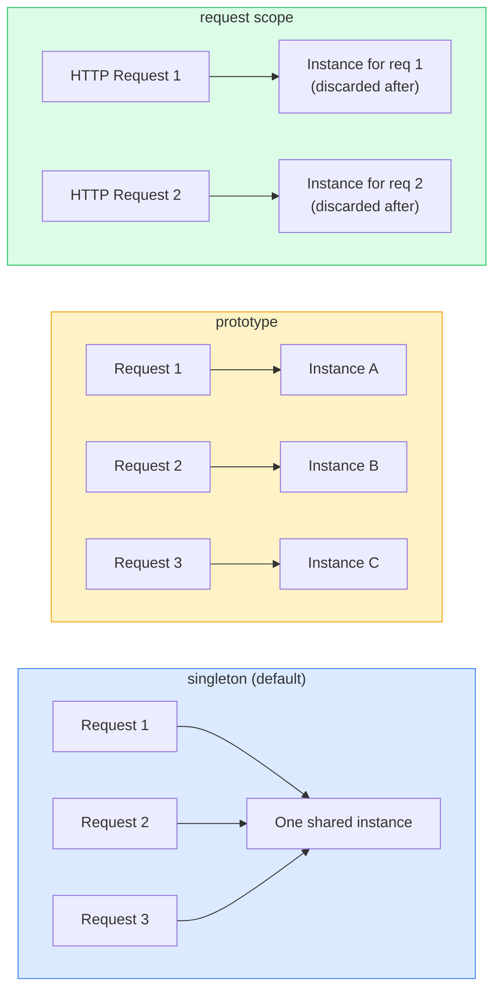
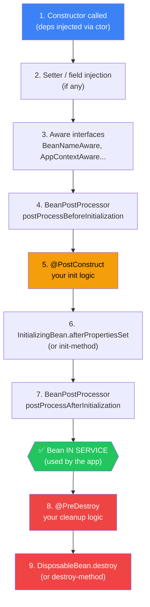

# Bean Scopes and Lifecycle

> [!info] For the Express/TS dev
> By default every Spring [[02-Beans-and-Application-Context|bean]] is a **singleton** — exactly one instance, shared across the whole app, like a module-level `const` in Node. Other scopes give you per-HTTP-request, per-session, or per-call instances. Lifecycle hooks (`@PostConstruct`, `@PreDestroy`) are the equivalent of running setup/teardown code in your DI container.

## The scopes

| Scope | What you get | Used for |
|---|---|---|
| `singleton` (default) | One instance per container | Stateless services, repositories |
| `prototype` | New instance every time it's requested | Stateful helpers, builders |
| `request` (web) | One per HTTP request | Per-request context, current user wrapper |
| `session` (web) | One per HTTP session | User session data |
| `application` (web) | One per `ServletContext` | Rare; usually same as singleton |
| `websocket` (web) | One per WebSocket session | WS-bound state |



```java
@Service
@Scope("prototype")
public class ReportBuilder { ... }

// Constants:
@Scope(ConfigurableBeanFactory.SCOPE_PROTOTYPE)
@Scope(WebApplicationContext.SCOPE_REQUEST)
```

## Singleton (default)

> [!note] "Singleton" means per-container
> It's not a JVM-wide singleton. If you start two `ApplicationContext`s in the same JVM (e.g., in a test suite), you get two instances. The container guarantees uniqueness *within itself*.

```java
@Service
public class CounterService {
    private final AtomicInteger n = new AtomicInteger();
    public int next() { return n.incrementAndGet(); }
}
// Same instance everywhere it's injected — be thread-safe!
```

> [!warning] Singletons must be thread-safe
> Multiple HTTP requests will hit the same instance concurrently. Avoid mutable instance state, or use thread-safe primitives (`AtomicInteger`, `ConcurrentHashMap`).

## Prototype

```java
@Component
@Scope("prototype")
public class CsvExportJob {
    private final List<Row> rows = new ArrayList<>();
    public void add(Row r) { rows.add(r); }
    public byte[] write() { ... }
}

@Service
public class ExportService {
    private final ObjectProvider<CsvExportJob> jobProvider;

    public ExportService(ObjectProvider<CsvExportJob> p) { this.jobProvider = p; }

    public byte[] runExport(List<Row> rows) {
        var job = jobProvider.getObject();   // new instance each call
        rows.forEach(job::add);
        return job.write();
    }
}
```

> [!warning] Injecting a prototype into a singleton
> A direct `@Autowired CsvExportJob job` in a singleton gives you **one** instance forever — defeating the scope. Use `ObjectProvider<T>` (or `Provider<T>`, or `@Lookup`) to get a fresh one per call.

## Request and Session scopes

```java
@Component
@Scope(value = WebApplicationContext.SCOPE_REQUEST, proxyMode = ScopedProxyMode.TARGET_CLASS)
public class CurrentUser {
    private String userId;
    public void set(String id) { this.userId = id; }
    public String get() { return userId; }
}
```

`proxyMode = TARGET_CLASS` is critical — it injects a **proxy** that resolves to the real per-request bean on each method call. Without it, you can't inject a request-scoped bean into a singleton service.

## Lifecycle hooks

```java
import jakarta.annotation.PostConstruct;
import jakarta.annotation.PreDestroy;

@Service
public class CacheService {
    private Map<String, Object> cache;

    @PostConstruct
    public void init() {
        // Called after dependencies are injected, before the bean is "in service"
        this.cache = new ConcurrentHashMap<>();
        System.out.println("Cache ready");
    }

    @PreDestroy
    public void shutdown() {
        // Called when the context closes
        cache.clear();
        System.out.println("Cache cleared");
    }
}
```

### Full lifecycle order



You'll typically only ever use #1 and #5/#8.

## Code example: external resource cleanup

```java
@Component
public class FileWatcher {
    private WatchService ws;
    private Thread thread;

    @PostConstruct
    public void start() throws IOException {
        ws = FileSystems.getDefault().newWatchService();
        Paths.get("/tmp/uploads").register(ws, StandardWatchEventKinds.ENTRY_CREATE);
        thread = new Thread(this::pollLoop);
        thread.setDaemon(true);
        thread.start();
    }

    @PreDestroy
    public void stop() throws IOException {
        thread.interrupt();
        ws.close();
    }

    private void pollLoop() { /* ... */ }
}
```

> [!tip] For prototypes, `@PreDestroy` is NOT called
> Spring doesn't track prototype instances. You're responsible for cleanup.

## SmartLifecycle (advanced)

For ordered startup/shutdown across many components (e.g., Kafka consumers, schedulers), implement `SmartLifecycle`:

```java
@Component
public class KafkaConsumer implements SmartLifecycle {
    private volatile boolean running;
    public void start()   { /* connect */ running = true; }
    public void stop()    { /* disconnect */ running = false; }
    public boolean isRunning() { return running; }
    public int getPhase() { return 100; }   // higher = started later, stopped earlier
}
```

## Gotchas

> [!warning] Common pitfalls
> - **Mutable singleton state** → race conditions. Most production bugs you'll hit early.
> - **`@PostConstruct` doing heavy work** delays application startup. Use `ApplicationRunner` / `CommandLineRunner` for non-blocking init.
> - **Prototype injected directly into singleton** → only created once. Use `ObjectProvider`.
> - **`@PostConstruct` on a class that extends a `@PostConstruct`-having parent** → both run; order matters.
> - **Throwing in `@PostConstruct`** kills the entire application context.

> [!example] Quick pick
> Use **singleton** unless you have a concrete reason not to. 95% of beans are singletons. Reach for `prototype` only when state can't be shared safely; reach for `request` only in web tier.

## Related
- [[01-IoC-DI-Concepts]]
- [[02-Beans-and-Application-Context]]
- [[05-Dependency-Injection-Types]]
- [[07-Profiles-and-Conditionals]]
- [[../05-Spring-Boot/06-SpringApplication-Bootstrap]]
