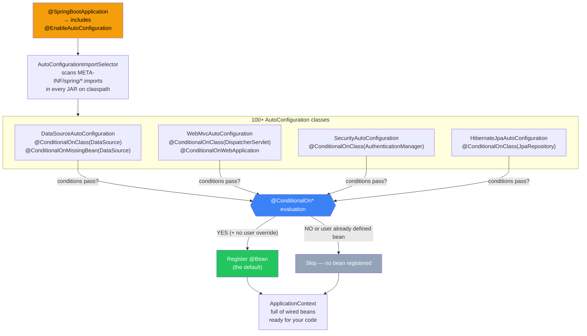

# Auto-Configuration — Spring Boot ka Asli Jadoo

Socho ek second ke liye — tu Node.js se aaya hai. Express mein kya hota hai? Tu `express()` call karta hai, phir manually `app.use(cors())`, `app.use(bodyParser.json())`, `app.use(morgan('dev'))` — ek-ek cheez haath se lagaani padti hai. Bhool gaya? App crash. Wrong order? Bug.

Spring Boot ne ek revolutionary kaam kiya — usne kaha: "Bhai, agar tu JDBC driver laya hai toh DataSource bhi chahiye hoga. Agar tu web starter laya hai toh JSON converter bhi chahiye hoga. Main khud setup kar leta hoon, tu bas overwrite karna agar kuch alag chahiye."

**Yahi hai Auto-Configuration.** Ye Spring Boot ka woh feature hai jo usse "opinionated" banata hai. Ye "magic" nahi hai — ye ek carefully designed system hai jo conditionally beans register karta hai based on kya tumhare classpath pe hai aur tumne already kya define kiya hai.

---

## Pehle Samjho — Problem Kya Thi?

Spring Framework (bina Boot ke) mein pure XML ya `@Configuration` classes se sab kuch manually wire karna padta tha. Ek simple web app ke liye:

- DataSource configure karo
- EntityManagerFactory banao
- TransactionManager set karo
- DispatcherServlet register karo
- MessageConverters add karo
- Jackson ke liye ObjectMapper banao
- ...aur bahut kuch

Ye boilerplate tha — har project mein same 300 lines. Spring Boot ne socha: "Iska ek sensible default hona chahiye."

> [!info] Node.js walo ke liye
> Auto-configuration bilkul waise hai jaise agar `express` khud detect kar le ki tumne `pg` package install kiya hai, aur automatically ek `db` middleware inject kar de — properly configured — bina tumhe kuch likhe. Aur agar tumhara apna `db` config hai toh woh step aside kar le. Exactly yahi karta hai Spring Boot.

---

## Kaise Kaam Karta Hai? (90% Explanation)

Jab tu apni Spring Boot app `@SpringBootApplication` ke saath likhta hai, usme teen annotations ek saath hoti hain:

```java
@SpringBootConfiguration   // @Configuration ka hi ek specialized form
@EnableAutoConfiguration   // <-- yahi Auto-Configuration on karta hai
@ComponentScan             // tumhare package mein components scan karta hai
public @interface SpringBootApplication {}
```

`@EnableAutoConfiguration` ek import selector trigger karta hai — `AutoConfigurationImportSelector`. Yeh selector har JAR file mein ek special file dhundta hai:

```
META-INF/spring/org.springframework.boot.autoconfigure.AutoConfiguration.imports
```

Spring Boot ke `spring-boot-autoconfigure` JAR mein 100+ aise class entries hain. Har entry ek `@AutoConfiguration` class hai. Phir kya hota hai? Har class apni conditions check karta hai — `@ConditionalOn*` annotations — aur agar conditions pass hon toh beans register ho jaate hain.



### Step-by-Step — Ek Baar Aur

1. **`@SpringBootApplication`** includes karta hai **`@EnableAutoConfiguration`**
2. Woh trigger karta hai **`AutoConfigurationImportSelector`** ko
3. Selector scan karta hai har JAR mein **`META-INF/spring/*.imports`** file
4. 100+ **`@AutoConfiguration`** classes ki list milti hai
5. Har class ke **`@ConditionalOn*`** guards evaluate hote hain
6. Jo pass karte hain **aur** jo user ne already define nahi kiya — woh beans register karte hain
7. **`@ConditionalOnMissingBean`** ensure karta hai ki tumhara bean always win kare

---

## Ek Concrete Example — JacksonAutoConfiguration

Zomato ka backend sochlo — JSON response dena hai. Jackson chahiye. Spring Boot ka `JacksonAutoConfiguration` kuch aisa dikhta hai:

```java
// Spring Boot ke source mein ye aisa kuch hota hai
@AutoConfiguration
@ConditionalOnClass(ObjectMapper.class)  // Jackson JAR classpath pe hai?
public class JacksonAutoConfiguration {

    @Bean
    @ConditionalOnMissingBean  // <-- sirf tab register karo jab user ka apna ObjectMapper na ho
    public ObjectMapper objectMapper() {
        // Sensible defaults ke saath ObjectMapper
        return new ObjectMapper()
            .registerModule(new JavaTimeModule())  // Java 8 dates support
            .disable(SerializationFeature.WRITE_DATES_AS_TIMESTAMPS);
    }
}
```

**Translation in plain Hinglish:** "Agar Jackson ka JAR classpath pe hai AND user ne apna `ObjectMapper` bean nahi banaya, toh main ek default wala de deta hoon — Java Time support ke saath."

Yahi pattern hai saari auto-configuration ka. Simple, predictable, overridable.

---

## Kya Milta Hai Free Mein?

### `spring-boot-starter-web` add karne par

| Auto-config Class | Kya deta hai |
|---|---|
| `WebMvcAutoConfiguration` | `DispatcherServlet`, message converters, view resolvers |
| `ServletWebServerFactoryAutoConfiguration` | Embedded Tomcat (koi alag server deploy nahi karna) |
| `JacksonAutoConfiguration` | `ObjectMapper` for JSON — ready to go |
| `HttpEncodingAutoConfiguration` | UTF-8 encoding — Indians ke liye zaroori (Hindi text!) |
| `ErrorMvcAutoConfiguration` | `/error` page — default error handling |
| `ValidationAutoConfiguration` | Bean Validation hooks — `@Valid`, `@NotNull` etc. |

### `spring-boot-starter-data-jpa` add karne par

| Auto-config Class | Kya deta hai |
|---|---|
| `DataSourceAutoConfiguration` | HikariCP connection pool — `spring.datasource.*` properties se |
| `HibernateJpaAutoConfiguration` | EntityManager, TransactionManager — khud se |
| `JpaRepositoriesAutoConfiguration` | Saare `@Repository` interfaces scan karta hai |

> [!tip] Socho kitna time bacha
> Node mein tu manually Sequelize setup karta, connection pool configure karta, transaction management likhta. JPA starter ke saath — bas `application.properties` mein DB URL daal aur ready.

---

## Default Override Karna — "Replace Pieces" Pattern

Auto-configuration ka beauty yeh hai ki tu puri system ko nahi todna — sirf woh piece replace kar jo tujhe alag chahiye.

### Method 1: Apna Bean Define Karo

Agar tujhe `snake_case` JSON response chahiye (jaise most Indian APIs use karte hain — UPI, NPCI style):

```java
@Configuration
public class JsonConfig {

    @Bean
    // @ConditionalOnMissingBean nahi likhna — ye tumhara bean hai, always register hoga
    public ObjectMapper objectMapper() {
        return new ObjectMapper()
            .findAndRegisterModules()
            // camelCase ki jagah snake_case — user_id, order_amount, etc.
            .setPropertyNamingStrategy(PropertyNamingStrategies.SNAKE_CASE);
    }
}
```

Ab Spring Boot ka `JacksonAutoConfiguration` ka `@ConditionalOnMissingBean` check karega — "Oye, `ObjectMapper` toh already hai!" — aur woh apna default register nahi karega. **Tumhara bean win karta hai.**

### Method 2: Customizer Use Karo (Replace Nahi, Tweak Karo)

Agar poora `ObjectMapper` replace nahi karna — sirf ek setting badalni hai — toh Customizer pattern use karo:

```java
@Bean
public Jackson2ObjectMapperBuilderCustomizer snakeCaseCustomizer() {
    // Lambda jo existing builder ko modify karta hai
    return builder -> builder.propertyNamingStrategy(PropertyNamingStrategies.SNAKE_CASE);
}
```

Yeh approach better hai jab tum Spring Boot ke baaki defaults rakhna chahte ho — sirf ek chiz tweak karni ho.

> [!tip] Kab kya use karo?
> - **Full replace** (`@Bean`): Jab tumhe completely alag implementation chahiye
> - **Customizer**: Jab default theek hai, bas ek-do settings badalni hain

---

## Auto-Config Disable Karna

Kabhi kabhi tujhe kisi specific auto-config ki zaroorat nahi hoti. For example — agar tu testing mein real DB nahi use karna chahta, ya kisi specific module ko off karna hai.

### Method 1: `@SpringBootApplication` exclude attribute

```java
@SpringBootApplication(exclude = {
    DataSourceAutoConfiguration.class,      // DB auto-config off
    SecurityAutoConfiguration.class          // Security off (testing ke liye)
})
public class App {
    public static void main(String[] args) {
        SpringApplication.run(App.class, args);
    }
}
```

### Method 2: `application.yaml` se (bina code change ke)

```yaml
spring:
  autoconfigure:
    exclude:
      - org.springframework.boot.autoconfigure.jdbc.DataSourceAutoConfiguration
      - org.springframework.boot.autoconfigure.security.servlet.SecurityAutoConfiguration
```

> [!warning] Exclude karne se pehle soch lo
> Ek auto-config disable karne se related features toot sakti hain. `DataSourceAutoConfiguration` disable kiya toh JPA bhi kaam nahi karega. Pehle `--debug` se dekho kya ho raha hai, phir exclude karo.

---

## Debug Karna — "Kya Chal Raha Hai" Jaanna

Jab auto-configuration behave nahi kare as expected — aur tu soch raha ho "ye bean kahan se aaya?" — ye tools use kar:

### Method 1: `--debug` flag

```bash
java -jar myapp.jar --debug
```

Ya IDE mein VM arguments mein: `--debug`

App start hote waqt terminal mein **CONDITIONS EVALUATION REPORT** print hoti hai:

```
============================
CONDITIONS EVALUATION REPORT
============================

Positive matches:    ← yeh register hue
-----------------
   JacksonAutoConfiguration matched:
      - @ConditionalOnClass found required class 'com.fasterxml.jackson.databind.ObjectMapper'

   DataSourceAutoConfiguration matched:
      - @ConditionalOnClass found required class 'javax.sql.DataSource'

Negative matches:    ← yeh skip hue aur kyun
-----------------
   MongoAutoConfiguration:
      - @ConditionalOnClass did not find required class 'com.mongodb.MongoClient'
```

Ye report padh — jadoo khatam ho jaayegi, sab kuch samajh aayega.

### Method 2: Actuator `/actuator/conditions` endpoint

Pehle Actuator dependency add karo (`pom.xml` mein `spring-boot-starter-actuator`), phir:

```yaml
# application.yaml
management:
  endpoints:
    web:
      exposure:
        include: conditions, beans
```

Phir curl se ya browser se:

```bash
curl localhost:8080/actuator/conditions
```

JSON response milega — running app mein live dekh sakte ho kya loaded hai, kya nahi.

```bash
# Saare beans dekhe jo registered hain
curl localhost:8080/actuator/beans
```

> [!tip] Actuator — Production Debugging ka Hathiyaar
> Zomato jaise production system mein bina restart kiye live beans dekh sakte ho. Bahut powerful hai.

---

## Apni Khud Ki Auto-Configuration Likhna

Socho tu ek common library bana raha hai — jaise sab teams ke liye ek "audit logging" library. Tum chahte ho ki jo bhi is library ko use kare, unhe automatically `AuditLogger` bean mil jaaye — bina kuch configure kiye.

### Step 1: Auto-Configuration Class Banao

```java
// src/main/java/com/mycompany/audit/AuditAutoConfiguration.java

@AutoConfiguration
@ConditionalOnClass(AuditLogger.class)  // sirf tab activate ho jab library classpath pe ho
public class AuditAutoConfiguration {

    // Default AuditLogger bean — sirf tab jab user ka apna na ho
    @Bean
    @ConditionalOnMissingBean
    @ConditionalOnProperty(
        name = "audit.enabled",
        havingValue = "true",
        matchIfMissing = true  // agar property nahi likhi toh bhi enable
    )
    public AuditLogger auditLogger(
        @Value("${audit.level:INFO}") String level  // default INFO level
    ) {
        return new AuditLogger(level);
    }
}
```

### Step 2: Register Karo Imports File Mein

```
# src/main/resources/META-INF/spring/org.springframework.boot.autoconfigure.AutoConfiguration.imports
com.mycompany.audit.AuditAutoConfiguration
```

**Bas!** Ab jo bhi is JAR ko dependency mein add karega, unhe automatically `AuditLogger` bean milega. Agar unhe custom chahiye toh apna `@Bean` define karein — tumhara auto-config step aside karega.

### Step 3: Order Control Karna

Agar tumhare auto-config ko kisi aur ke bean ki zaroorat hai:

```java
@AutoConfiguration(after = DataSourceAutoConfiguration.class)
// ya
@AutoConfigureBefore(SecurityAutoConfiguration.class)
public class MyAutoConfiguration {
    // DataSource available hoga yahan
}
```

---

## Clock Example — Complete Working Code

Ek simple lekin complete example — `Clock` bean auto-configure karna:

```java
// src/main/java/com/example/clock/ClockAutoConfiguration.java

@AutoConfiguration
@ConditionalOnClass(Clock.class)  // java.time.Clock classpath pe hai? (always true for Java 8+)
public class ClockAutoConfiguration {

    // Agar user ne app.clock.zone property set ki hai — zone-specific clock do
    @Bean
    @ConditionalOnMissingBean          // user ka apna Clock nahi hai
    @ConditionalOnProperty(name = "app.clock.zone")  // property set hai
    public Clock zonedClock(@Value("${app.clock.zone}") String zone) {
        // "Asia/Kolkata" set karo aur IST mein time milega
        return Clock.system(ZoneId.of(zone));
    }

    // Default fallback — UTC clock
    @Bean
    @ConditionalOnMissingBean  // sirf tab jab koi Clock bean nahi hai
    public Clock systemClock() {
        return Clock.systemUTC();
    }
}
```

`application.yaml` mein:

```yaml
app:
  clock:
    zone: Asia/Kolkata  # ab IST mein time milega
```

Register karo:

```
# META-INF/spring/org.springframework.boot.autoconfigure.AutoConfiguration.imports
com.example.clock.ClockAutoConfiguration
```

---

## Auto-Configuration aur Conditionals ka Rishta

Auto-configuration basically `@ConditionalOn*` annotations ka **idiomatic use** hai. Ye annotations Spring Core mein hain — Spring Boot ne inhe standardize kiya auto-configuration ke liye.

Common conditionals jo auto-config use karte hain:

| Annotation | Kab true hota hai |
|---|---|
| `@ConditionalOnClass(Foo.class)` | `Foo` class classpath pe ho |
| `@ConditionalOnMissingBean` | Uss type ka koi bean context mein na ho |
| `@ConditionalOnProperty("x.y")` | `x.y` property set ho |
| `@ConditionalOnWebApplication` | Ye ek web application ho |
| `@ConditionalOnNotWebApplication` | Ye web app NA ho |
| `@ConditionalOnMissingClass("Foo")` | `Foo` class classpath pe NA ho |
| `@ConditionalOnExpression("#{...}")` | SpEL expression true return kare |

---

## Gotchas — Common Mistakes Jo Beginners Karte Hain

> [!warning] Ye mistakes mat karna

**1. Multiple DataSources classpath pe**

Agar tune `H2` (in-memory) aur `PostgreSQL` dono dependency mein daale hain bina explicit `spring.datasource.url` set kiye — Boot confuse ho jaata hai. Fix:

```yaml
spring:
  datasource:
    url: jdbc:postgresql://localhost:5432/mydb  # explicit set karo
    username: user
    password: pass
```

**2. Wrong Type ka Bean Define Karna**

`@ConditionalOnMissingBean` exact type match karta hai. Agar auto-config check karta hai `ObjectMapper` ke liye aur tune `MyCustomMapper extends ObjectMapper` define kiya — woh override nahi hoga! Same type use karo:

```java
// WRONG — auto-config override nahi hoga
@Bean
public MyCustomMapper objectMapper() { ... }

// CORRECT — ObjectMapper type ka bean = override hoga
@Bean
public ObjectMapper objectMapper() { ... }
```

**3. Spring 2 vs Spring 3 file path confusion**

```
# Spring Boot 2 (old way)
src/main/resources/META-INF/spring.factories

# Spring Boot 3 (new way) — DIFFERENT FILE!
src/main/resources/META-INF/spring/org.springframework.boot.autoconfigure.AutoConfiguration.imports
```

Dono mix mat karo. Spring 3 mein `spring.factories` ka auto-config wala part deprecated hai.

**4. Auto-Config ka Order Ignore Karna**

Tera auto-config kisi aur bean pe depend karta hai? `@AutoConfigureAfter` use karo warna NullPointerException ya BeanCreationException milega:

```java
@AutoConfiguration(after = DataSourceAutoConfiguration.class)
public class MyJdbcAutoConfig {
    // Ab DataSource bean available hai
}
```

**5. Blindly Exclude Karna**

`DataSourceAutoConfiguration.class` exclude kiya? Ab JPA, Transactions — sab toot sakta hai. Pehle `--debug` se CONDITIONS REPORT dekho, samjho kya depend kar raha hai, phir exclude karo.

---

## Node.js se Comparison — Mental Model

| Express/Node.js | Spring Boot Auto-Config |
|---|---|
| `app.use(bodyParser.json())` manually | `JacksonAutoConfiguration` auto-detect karta hai |
| `const pool = new Pool({...})` manually | `DataSourceAutoConfiguration` Hikari setup karta hai |
| `.env` se manually read karna | `@Value`, `@ConfigurationProperties` auto-bind |
| `npm install` + manual setup | `starter` dependency + zero config |
| Koi override chahiye? Middleware replace karo | `@Bean` define karo — auto-config steps aside |

---

## Key Takeaways

- Auto-Configuration **magic nahi hai** — yeh `@ConditionalOn*` annotations ka systematic use hai
- Spring Boot starts hote waqt **100+ auto-config classes** evaluate hoti hain — sirf relevant wali register hoti hain
- **`@ConditionalOnMissingBean`** guarantee karta hai ki tumhara custom bean always auto-config ko override kare
- Default override karna easy hai — bas **apna `@Bean` define karo** aur auto-config step aside kar lega
- Apni library ke liye khud auto-config likh sakte ho — **`META-INF/spring/*.imports`** file mein register karo
- `--debug` flag aur **CONDITIONS EVALUATION REPORT** tumhara best debugging tool hai — jadoo samjhna ho toh pehle yeh padho
- `@AutoConfigureBefore`/`@AutoConfigureAfter` se order control karo jab dependencies hain
- Spring Boot 3 mein `spring.factories` ki jagah `.imports` file use hoti hai — mix mat karo

> [!info] Aage Kya?
> Auto-configuration samajh liya toh ab **Starters** padho — woh basically "auto-config + dependencies ka bundle" hain. Aur `@ConditionalOn*` annotations ke poore list ke liye Profiles and Conditionals topic dekho.

---

## Related Topics
- [[01-What-is-Spring-Boot]]
- [[04-Starters]]
- [[05-Application-Properties]]
- [[06-SpringApplication-Bootstrap]]
- [[../04-Spring-Core/04-Configuration-Classes]]
- [[../04-Spring-Core/07-Profiles-and-Conditionals]]
- [[../12-Observability/Actuator]]
