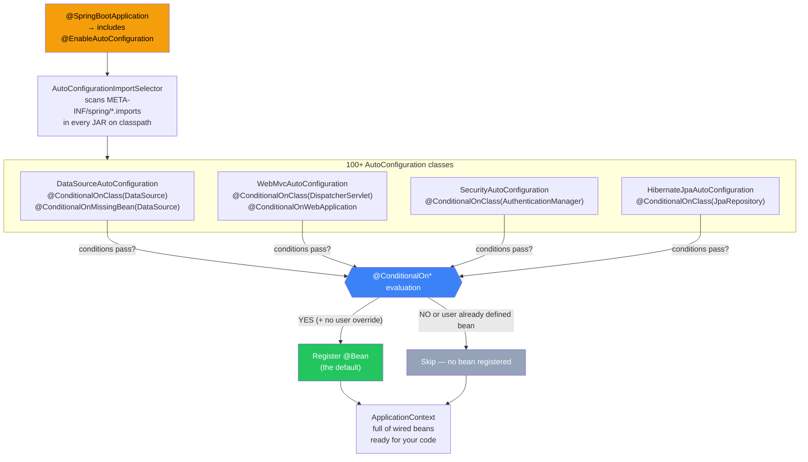

---
tags:
  - spring-boot
  - auto-configuration
  - magic
aliases:
  - Auto-Configuration
  - "@EnableAutoConfiguration"
stage: intermediate
---

# Auto-Configuration

> [!info] For the Express/TS dev
> Auto-configuration is the "magic" in Spring Boot. It's not actually magic — it's a giant pile of `@Configuration` classes guarded by `@ConditionalOn*` annotations. When Spring Boot starts, it looks at what's on your classpath and what beans you've already defined, then conditionally registers default beans for the gaps. Think of it like running every plausible setup function from `node_modules`, but each one checks "is the user expecting this?" before running.

## How it works (the 90% explanation)

1. `@SpringBootApplication` includes `@EnableAutoConfiguration`.
2. That triggers `AutoConfigurationImportSelector`, which scans every JAR for `META-INF/spring/org.springframework.boot.autoconfigure.AutoConfiguration.imports`.
3. Each listed `@AutoConfiguration` class has [[../04-Spring-Core/07-Profiles-and-Conditionals|@ConditionalOn*]] guards.
4. Those that pass register their `@Bean` methods.
5. **`@ConditionalOnMissingBean`** ensures user-defined beans always win.



> [!example] Concrete example
> The `JacksonAutoConfiguration` says, in essence:
> ```java
> @AutoConfiguration
> @ConditionalOnClass(ObjectMapper.class)
> public class JacksonAutoConfiguration {
>
>     @Bean
>     @ConditionalOnMissingBean
>     public ObjectMapper objectMapper() {
>         return new ObjectMapper().registerModule(new JavaTimeModule());
>     }
> }
> ```
> Translation: "If Jackson is on the classpath AND the user hasn't defined their own `ObjectMapper`, give them a sensible default."

## What you get for free

When you add `spring-boot-starter-web`:

| Auto-config class | Provides |
|---|---|
| `WebMvcAutoConfiguration` | `DispatcherServlet`, message converters, view resolvers |
| `ServletWebServerFactoryAutoConfiguration` | Embedded Tomcat |
| `JacksonAutoConfiguration` | `ObjectMapper` for JSON |
| `HttpEncodingAutoConfiguration` | UTF-8 encoding |
| `ErrorMvcAutoConfiguration` | The `/error` page |
| `ValidationAutoConfiguration` | Bean Validation hooks |

When you add `spring-boot-starter-data-jpa`:

| Auto-config class | Provides |
|---|---|
| `DataSourceAutoConfiguration` | Hikari connection pool from `spring.datasource.*` |
| `HibernateJpaAutoConfiguration` | EntityManager, transaction manager |
| `JpaRepositoriesAutoConfiguration` | Scans for `@Repository` interfaces |

## The "override defaults" pattern

> [!tip] Don't fight auto-config — replace pieces of it
> Just define your own `@Bean` and the auto-config's `@ConditionalOnMissingBean` steps aside.
>
> ```java
> @Configuration
> public class JsonConfig {
>     @Bean
>     public ObjectMapper objectMapper() {
>         return new ObjectMapper()
>             .findAndRegisterModules()
>             .setPropertyNamingStrategy(PropertyNamingStrategies.SNAKE_CASE);
>     }
> }
> ```

Or *customize* without replacing:

```java
@Bean
public Jackson2ObjectMapperBuilderCustomizer snakeCase() {
    return b -> b.propertyNamingStrategy(PropertyNamingStrategies.SNAKE_CASE);
}
```

## Disabling auto-config

```java
@SpringBootApplication(exclude = { DataSourceAutoConfiguration.class })
public class App {}
```

Or via property:

```yaml
spring:
  autoconfigure:
    exclude:
      - org.springframework.boot.autoconfigure.jdbc.DataSourceAutoConfiguration
```

## Inspecting what's active

The most useful diagnostic in your toolbelt:

```bash
java -jar app.jar --debug
```

Boots the app and prints a **CONDITIONS EVALUATION REPORT** showing every auto-config class and why it matched or didn't. Read this before believing in magic.

You can also enable Actuator's `/actuator/conditions`:

```yaml
management:
  endpoints:
    web:
      exposure:
        include: conditions, beans
```

```bash
curl localhost:8080/actuator/conditions
```

## Code example: writing your own auto-config

```java
// src/main/java/com/example/clock/ClockAutoConfiguration.java
@AutoConfiguration
@ConditionalOnClass(Clock.class)
public class ClockAutoConfiguration {

    @Bean
    @ConditionalOnMissingBean
    @ConditionalOnProperty(name = "app.clock.zone")
    public Clock zonedClock(@Value("${app.clock.zone}") String zone) {
        return Clock.system(ZoneId.of(zone));
    }

    @Bean
    @ConditionalOnMissingBean
    public Clock systemClock() {
        return Clock.systemUTC();
    }
}
```

Register it in `src/main/resources/META-INF/spring/org.springframework.boot.autoconfigure.AutoConfiguration.imports`:

```
com.example.clock.ClockAutoConfiguration
```

Now any consumer of your library auto-receives a `Clock` bean — replaceable by their own.

## How it relates to "conditionals"

Auto-config is just **idiomatic use of `@ConditionalOn*`**. See [[../04-Spring-Core/07-Profiles-and-Conditionals]] for the full annotation list. Once you've read that, auto-configuration stops feeling magical.

## Gotchas

> [!warning] Common pitfalls
> - **Multiple `DataSource`s on the classpath** (e.g., H2 + PostgreSQL) without explicit `spring.datasource.url` → Boot picks one and you get surprises. Set the URL.
> - **Excluding the wrong auto-config** can break unrelated features (transactions, JSON). Use `--debug` first to confirm what you're disabling.
> - **Defining a bean that "doesn't override"** — happens when your bean's *type* doesn't match the auto-config's `@ConditionalOnMissingBean` exact type. Use the same supertype.
> - **Auto-config class invisible** — your `META-INF/spring/...` file path or filename is wrong. Spring 3 uses `.imports`, Spring 2 used `spring.factories`. Don't mix.
> - **Order matters** — use `@AutoConfigureBefore` / `@AutoConfigureAfter` when your config depends on another's beans.

## Related
- [[01-What-is-Spring-Boot]]
- [[04-Starters]]
- [[05-Application-Properties]]
- [[06-SpringApplication-Bootstrap]]
- [[../04-Spring-Core/04-Configuration-Classes]]
- [[../04-Spring-Core/07-Profiles-and-Conditionals]]
- [[../12-Observability/Actuator]]
