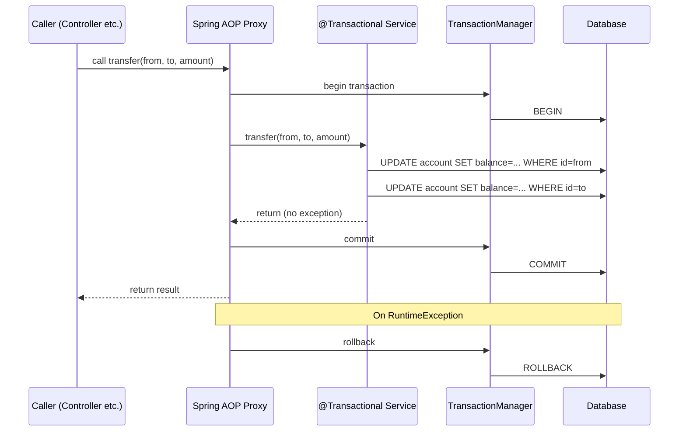
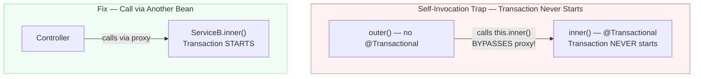

# Transactions — Ek Bhi Galti, Pura Kaam Radd

Socho ek second ke liye — tum UPI se 500 rupaye transfer kar rahe ho. App tumhara account debit karta hai. Phir achanak server crash ho jaata hai. Recipient ka account credit nahi hua. Tumhara paisa gaya, unhe mila nahi. Kya yeh acceptable hai?

Bilkul nahi. Aur yahi problem solve karta hai **Transaction**.

Transaction ek aisi guarantee hai: ya toh kaam **poora** hoga, ya **bilkul nahi** hoga. Beech mein kuch adha-adhoora state nahi rahega. Database ki duniya mein ise **ACID** kehte hain:

- **Atomicity** — Ya saari operations complete hongi, ya ek bhi nahi
- **Consistency** — Database hamesha valid state mein rahega
- **Isolation** — Ek transaction doosre ko disturb nahi karega
- **Durability** — Commit ho gaya toh data permanently save hai

Node/TypeScript mein tum explicitly transaction likhte the — Prisma mein `$transaction()`, node-pg mein `BEGIN/COMMIT/ROLLBACK`. Spring mein yeh kaam ek simple annotation karta hai: **`@Transactional`**. Lagaao annotation, baaki Spring sambhal leta hai. But — aur yeh "but" bahut important hai — yeh "invisible magic" hai, aur invisible cheezein kabhi kabhi tumhe dhoka deti hain. Is file mein sab kuch samjhenge.

---

## Spring Transactions Kaise Kaam Karti Hain — AOP Proxy Ka Jadoo

Yeh samajhna zaroori hai, warna gotchas mein fail hoge.

Jab tum kisi Service class par `@Transactional` lagate ho, Spring us class ka ek **proxy** banata hai. Actual class nahi — ek wrapper. Jab controller us service ka method call karta hai, woh call seedha class par nahi jaata — **pehle proxy intercepte karta hai**.

Proxy yeh steps follow karta hai:

1. Transaction shuru karo (propagation rule ke hisaab se)
2. Actual service method call karo
3. Method normally return kare → **COMMIT**
4. `RuntimeException` ya `Error` aaye → **ROLLBACK**
5. Checked exception aaye → **COMMIT** (default behavior — yeh ek classic trap hai!)



Aur yeh raha sabse bada trap — **self-invocation**:



Agar tum same class ke andar `this.inner()` call karte ho, toh proxy bypass ho jaata hai. Transaction start hi nahi hota. Yeh sabko ek baar zaroor dhoka deta hai — experienced developers ko bhi!

---

## Basic Usage — Pehle Simplest Example Dekho

### UPI Transfer Example

```java
@Service
public class TransferService {

    private final AccountRepository repo;

    // Constructor injection — Spring Boot recommend karta hai
    public TransferService(AccountRepository repo) {
        this.repo = repo;
    }

    // @Transactional lagate hi Spring proxy bana deta hai
    // Agar koi bhi exception aaye, dono updates rollback honge
    @Transactional
    public void transfer(Long from, Long to, BigDecimal amount) {
        // Dono accounts fetch karo — managed entities hain ab
        Account sender = repo.findById(from)
            .orElseThrow(() -> new RuntimeException("Sender account not found"));
        Account receiver = repo.findById(to)
            .orElseThrow(() -> new RuntimeException("Receiver account not found"));

        // Balance check — insufficient funds pe exception throw karega
        sender.debit(amount);    // internally checks balance, throws if insufficient
        receiver.credit(amount);

        // DHYAN DO: Explicit repo.save() nahi chahiye!
        // Hibernate managed entities ko track karta hai
        // Transaction commit hote waqt automatically flush karta hai
        // Yeh "dirty checking" hai — Node/Prisma mein yeh nahi hota
    }

    // readOnly = true — read-only operations ke liye hamesha lagao
    // Performance boost milta hai — Hibernate dirty checking skip karta hai
    // Kuch databases read-only replica use karte hain is hint par
    @Transactional(readOnly = true)
    public AccountSummary getSummary(Long id) {
        return repo.findById(id)
            .map(this::toSummary)
            .orElseThrow(() -> new RuntimeException("Account not found"));
    }
}
```

> [!tip] `repo.save()` mat bhulo — actually bhool jaao!
> Node/Prisma mein tumhe explicit `update()` call karni padti thi. Spring JPA mein agar entity managed hai (yani `findById()` se fetch ki hai), toh transaction commit hote waqt Hibernate automatically changes detect karta hai aur database update karta hai. No `save()` needed for updates on managed entities.

---

## Propagation — Transaction Ka Kya Karna Hai Agar Pehle Se Ek Chal Rahi Ho?

Yeh concept Node mein nahi hota — kyunki Node async hai aur transaction context pass karna padta hai explicitly. Spring mein transaction **thread-bound** hota hai, isliye propagation ka concept possible hai.

Socho ek real scenario: Zomato par order place ho raha hai. `OrderService.createOrder()` chal raha hai ek transaction mein. Andar se `AuditService.logEvent()` call hota hai. Kya audit log **same** transaction mein jaaye ya **alag** transaction mein?

### Propagation Types

```java
// REQUIRED (Default) — Existing transaction join karo, warna nayi shuru karo
// 99% cases mein yahi use hota hai
@Transactional(propagation = Propagation.REQUIRED)
public void doSomething() { ... }

// REQUIRES_NEW — Outer transaction suspend karo, nayi transaction shuru karo
// Use case: Audit logging — order fail ho, audit committed rahe
@Transactional(propagation = Propagation.REQUIRES_NEW)
public void logAuditEvent(AuditEvent event) { ... }

// SUPPORTS — Transaction hai toh join karo, nahi hai toh bina transaction ke chalo
// Use case: Methods jo transaction ke saath ya bina dono kaam kar sakti hain
@Transactional(propagation = Propagation.SUPPORTS)
public void optionalTxMethod() { ... }

// NOT_SUPPORTED — Outer transaction suspend karo, bina transaction ke chalo
// Use case: Operations jo explicitly NO transaction chahte hain
@Transactional(propagation = Propagation.NOT_SUPPORTED)
public void noTxOperation() { ... }

// NEVER — Agar transaction chal rahi ho toh exception throw karo
// Use case: Methods jo guarantee karni hain that they never run in a tx
@Transactional(propagation = Propagation.NEVER)
public void mustRunWithoutTx() { ... }

// MANDATORY — Transaction ZAROOR honi chahiye, warna exception
// Use case: Internal methods jo sirf existing tx mein call honni chahiye
@Transactional(propagation = Propagation.MANDATORY)
public void internalHelper() { ... }

// NESTED — Savepoint banao existing transaction ke andar (DB dependent)
// MySQL/PostgreSQL support karte hain, but rarely used
@Transactional(propagation = Propagation.NESTED)
public void nestedOp() { ... }
```

### Real Example — Audit Log Jo Hamesha Commit Ho

```java
@Service
public class AuditService {

    private final AuditRepository auditRepo;

    public AuditService(AuditRepository auditRepo) {
        this.auditRepo = auditRepo;
    }

    // REQUIRES_NEW — apni alag transaction chalata hai
    // Outer transaction fail ho jaaye, fir bhi audit log save hoga
    @Transactional(propagation = Propagation.REQUIRES_NEW)
    public void log(String eventType, String details) {
        AuditEvent event = new AuditEvent(eventType, details, LocalDateTime.now());
        auditRepo.save(event);
        // Yeh apni transaction commit karega, outer ke saath nahi
    }
}

@Service
public class OrderService {

    private final OrderRepository orderRepo;
    private final AuditService auditService;  // Alag bean — proxy se call hoga

    public OrderService(OrderRepository orderRepo, AuditService auditService) {
        this.orderRepo = orderRepo;
        this.auditService = auditService;
    }

    @Transactional
    public Order createOrder(CreateOrderRequest req) {
        Order order = new Order(req);
        orderRepo.save(order);

        // Audit log — REQUIRES_NEW se apni transaction mein commit hoga
        // Agar neeche exception aaye aur order rollback ho,
        // audit log phir bhi database mein rahega
        auditService.log("ORDER_CREATED", "Order ID: " + order.getId());

        // Maan lo kuch fail ho gaya
        if (req.isSomethingWrong()) {
            throw new RuntimeException("Order creation failed!");
            // Order rollback hoga, but audit log committed hai
        }

        return order;
    }
}
```

> [!info] REQUIRES_NEW ka ek panga
> Agar outer transaction mein lock liya hua hai kisi row par, aur REQUIRES_NEW wali method wahi row access karne ki koshish kare, toh **deadlock** ho sakta hai! Dhyan se use karo.

---

## Isolation Levels — Concurrent Transactions Ka Traffic Management

Multiple users ek saath system use kar rahe hain. Swiggy par 10,000 log ek saath order kar rahe hain — kya ho agar dono ek hi restaurant ka last item le rahe hain? Isolation level decide karta hai ki ek transaction doosre transaction ke "in-progress" data ko kitna dekh sakta hai.

### Isolation Types

```java
// READ_UNCOMMITTED — Sabse loose, almost never use karo
// Dirty reads possible — doosri uncommitted transaction ka data dikh sakta hai
@Transactional(isolation = Isolation.READ_UNCOMMITTED)

// READ_COMMITTED — PostgreSQL ka default
// Sirf committed data dikhta hai
// Non-repeatable reads possible (same row baar baar read karo, alag data mile)
@Transactional(isolation = Isolation.READ_COMMITTED)

// REPEATABLE_READ — MySQL/InnoDB ka default
// Ek transaction mein same query hamesha same result deti hai
// Phantom reads possible (new rows aa sakti hain)
@Transactional(isolation = Isolation.REPEATABLE_READ)

// SERIALIZABLE — Sabse strict, sabse slow
// Transactions aise behave karte hain jaise ek ke baad ek chal rahe hoon
// Performance hit significant hai
@Transactional(isolation = Isolation.SERIALIZABLE)
```

### Anomalies — Kya Kya Gadbad Ho Sakti Hai?

| Anomaly | READ_UNCOMMITTED | READ_COMMITTED | REPEATABLE_READ | SERIALIZABLE |
|---|---|---|---|---|
| Dirty read (uncommitted data padhna) | Ho sakta hai | Rokta hai | Rokta hai | Rokta hai |
| Non-repeatable read (same row, alag result) | Ho sakta hai | Ho sakta hai | Rokta hai | Rokta hai |
| Phantom read (nayi rows appear honaa) | Ho sakta hai | Ho sakta hai | Ho sakta hai* | Rokta hai |
| Lost update (concurrent writes) | Ho sakta hai | Ho sakta hai | Ho sakta hai | Rokta hai |

*PostgreSQL ka REPEATABLE_READ phantoms bhi rokta hai. MySQL gap locks se bhi rokta hai.

> [!tip] Practical Rule
> Zyada tar applications `READ_COMMITTED` (PostgreSQL default) ya `REPEATABLE_READ` (MySQL default) se hi kaam chal jaata hai. `SERIALIZABLE` sirf financial critical operations ke liye sochna.

---

## Rollback Rules — Kab Rollback, Kab Nahi?

Yeh ek bahut common confusion hai jab Node developers Spring sikhte hain.

### Default Behavior

Spring ka default:
- **`RuntimeException` aaya → ROLLBACK**
- **`Error` aaya → ROLLBACK**
- **Checked Exception aaya → COMMIT** (yes, yeh counterintuitive hai!)

```java
// Checked exceptions ke saath dhoka ho sakta hai
@Transactional
public void processPayment(Long orderId) throws PaymentException {
    // PaymentException agar checked hai (extends Exception, not RuntimeException)
    // Toh Spring isse COMMIT karega by default!
    // Order save ho jaayega even though payment fail hua!
    orderRepo.save(new Order(orderId));
    throw new PaymentException("Payment gateway timeout"); // COMMITS!
}
```

### Fix Karo

```java
// Sabse safe option — sab exceptions par rollback
@Transactional(rollbackFor = Exception.class)
public void processPayment(Long orderId) throws PaymentException {
    orderRepo.save(new Order(orderId));
    throw new PaymentException("Payment gateway timeout"); // Ab ROLLBACK hoga
}

// Specific checked exception par rollback
@Transactional(rollbackFor = {PaymentException.class, IOException.class})
public void doSomething() throws PaymentException, IOException { ... }

// RuntimeException hai but rollback nahi chahiye (rare case)
// Example: NotFoundException — valid business case, data consistent hai
@Transactional(noRollbackFor = NotFoundException.class)
public void findAndProcess(Long id) {
    try {
        Entity e = repo.findById(id).orElseThrow(NotFoundException::new);
        // process...
    } catch (NotFoundException e) {
        // Transaction still commits — data consistent tha
        log.warn("Entity not found: {}", id);
    }
}
```

> [!warning] Checked Exceptions Trap
> Agar tumhara service method koi checked exception throw karta hai, default mein Spring rollback NAHI karega. Yeh Java ke design se aata hai — Spring mana karta hai ki checked exceptions "expected" scenarios hain. Apne critical methods par hamesha `rollbackFor = Exception.class` lagao.

---

## Optimistic Locking — "Aas Rakho, Conflict Rare Hoga"

Jab concurrency low ho, aur conflicts rarely honge — optimistic locking best approach hai. IRCTC ticket booking sochlo — zyada tar log different seats book karte hain, conflicts rare hain.

Optimistic locking mein database lock nahi lagti. Instead, har entity mein ek `@Version` field hoti hai. Jab tum update karte ho, Hibernate check karta hai ki version change toh nahi hua. Agar kisi aur ne beech mein update kar diya, exception aata hai.

```java
@Entity
@Table(name = "accounts")
public class Account {

    @Id
    @GeneratedValue(strategy = GenerationType.IDENTITY)
    private Long id;

    private String ownerName;
    private BigDecimal balance;

    // Hibernate automatically yeh field increment karta hai har update par
    // Aur WHERE clause mein check karta hai: WHERE id=? AND version=?
    // Agar version match nahi hua — conflict! Exception!
    @Version
    private Long version;

    public void debit(BigDecimal amount) {
        if (balance.compareTo(amount) < 0) {
            throw new InsufficientFundsException("Insufficient balance");
        }
        this.balance = this.balance.subtract(amount);
    }

    public void credit(BigDecimal amount) {
        this.balance = this.balance.add(amount);
    }
}
```

Jab conflict hota hai, `ObjectOptimisticLockingFailureException` aata hai. Isse catch karke retry karo:

```java
@Service
public class TransferService {

    private final AccountRepository repo;
    private final TransferService self; // Retry ke liye self-injection (explained below)

    public TransferService(AccountRepository repo) {
        this.repo = repo;
    }

    // Retry logic ke saath transfer
    public void transferWithRetry(Long from, Long to, BigDecimal amount) {
        int maxRetries = 3;
        for (int attempt = 1; attempt <= maxRetries; attempt++) {
            try {
                doTransfer(from, to, amount);
                return; // Success!
            } catch (ObjectOptimisticLockingFailureException e) {
                if (attempt == maxRetries) {
                    throw new RuntimeException("Transfer failed after " + maxRetries + " attempts", e);
                }
                log.warn("Optimistic lock conflict, retrying attempt {}", attempt + 1);
                // Thoda wait karo before retry
                try { Thread.sleep(100L * attempt); } catch (InterruptedException ie) { Thread.currentThread().interrupt(); }
            }
        }
    }

    @Transactional
    public void doTransfer(Long from, Long to, BigDecimal amount) {
        Account sender = repo.findById(from).orElseThrow();
        Account receiver = repo.findById(to).orElseThrow();
        sender.debit(amount);
        receiver.credit(amount);
        // Flush at commit — agar version conflict hua toh exception yahaan aayega
    }
}
```

---

## Pessimistic Locking — "Lock Pahle, Kaam Baad Mein"

Jab conflicts common hoon — jaise flash sale pe Flipkart mein ek hi item ke liye 1000 log simultaneously try kar rahe hoon — optimistic locking bahut retries karaata hai. Pessimistic locking better hai.

Database level par actual row lock lagti hai. `SELECT ... FOR UPDATE` query.

```java
public interface AccountRepository extends JpaRepository<Account, Long> {

    // PESSIMISTIC_WRITE = SELECT ... FOR UPDATE
    // Koi aur transaction yeh row read ya write nahi kar sakta jab tak lock release na ho
    @Lock(LockModeType.PESSIMISTIC_WRITE)
    @Query("SELECT a FROM Account a WHERE a.id = :id")
    Optional<Account> findByIdForUpdate(@Param("id") Long id);

    // PESSIMISTIC_READ = SELECT ... FOR SHARE (ya FOR UPDATE depending on DB)
    // Multiple readers allowed, but writers wait
    @Lock(LockModeType.PESSIMISTIC_READ)
    @Query("SELECT a FROM Account a WHERE a.id = :id")
    Optional<Account> findByIdForRead(@Param("id") Long id);
}

@Service
public class FlashSaleService {

    private final ProductRepository productRepo;
    private final OrderRepository orderRepo;

    @Transactional
    public Order buyFlashSaleItem(Long productId, Long userId) {
        // Lock karo product row — doosra koi tab tak touch nahi kar sakta
        Product product = productRepo.findByIdForUpdate(productId)
            .orElseThrow(() -> new RuntimeException("Product not found"));

        if (product.getStock() <= 0) {
            throw new OutOfStockException("Sorry! Item sold out.");
        }

        // Safe hai — hum akele hain is row par
        product.decrementStock();

        Order order = new Order(userId, productId);
        orderRepo.save(order);

        return order;
        // Transaction commit hoga, lock release hoga
    }
}
```

> [!warning] Pessimistic Locking Ka Panga — Deadlocks
> Agar do transactions ek doosre ke resources ka wait kar rahi hoon toh deadlock! Always same order mein rows lock karo. Jaise agar transfer karte ho, hamesha lower ID wala account pehle lock karo.

---

## Programmatic Transactions — Jab Annotation Se Kaam Na Chale

Kabhi kabhi tumhe fine-grained control chahiye. Jaise batch processing mein har 100 records ke baad commit karna ho. Annotation se yeh possible nahi. `TransactionTemplate` use karo.

```java
@Service
public class BulkImportService {

    private final TransactionTemplate txTemplate;
    private final UserRepository userRepo;

    // TransactionTemplate ko PlatformTransactionManager chahiye
    public BulkImportService(PlatformTransactionManager tm, UserRepository userRepo) {
        this.txTemplate = new TransactionTemplate(tm);
        this.userRepo = userRepo;
    }

    public ImportResult importUsers(List<UserDto> users) {
        ImportResult result = new ImportResult();
        List<List<UserDto>> batches = partition(users, 100); // 100-100 ke groups

        for (List<UserDto> batch : batches) {
            try {
                // Har batch ki apni transaction
                txTemplate.executeWithoutResult(status -> {
                    for (UserDto dto : batch) {
                        try {
                            userRepo.save(new User(dto));
                            result.incrementSuccess();
                        } catch (Exception e) {
                            // Is specific record ke liye rollback — sirf yeh batch rollback hoga
                            status.setRollbackOnly();
                            result.addFailure(dto.getEmail(), e.getMessage());
                            log.error("Failed to import user: {}", dto.getEmail(), e);
                        }
                    }
                });
            } catch (Exception e) {
                log.error("Batch failed: {}", e.getMessage());
            }
        }

        return result;
    }

    // Return value ke saath programmatic transaction
    public User createUserProgrammatically(UserDto dto) {
        return txTemplate.execute(status -> {
            try {
                User user = new User(dto);
                return userRepo.save(user);
            } catch (Exception e) {
                status.setRollbackOnly();
                throw new RuntimeException("User creation failed", e);
            }
        });
    }

    private <T> List<List<T>> partition(List<T> list, int size) {
        List<List<T>> partitions = new ArrayList<>();
        for (int i = 0; i < list.size(); i += size) {
            partitions.add(list.subList(i, Math.min(i + size, list.size())));
        }
        return partitions;
    }
}
```

---

## Timeout — "Zyada Der Tak Mat Chalो"

Kya hota hai agar koi transaction atak jaaye — kisi slow query ya lock wait ki wajah se? Bina timeout ke, woh transaction hamesha ke liye connection pool ka ek connection hold karke baitha rahega, aur baaki requests bhookhe reh jaayenge. Ola/Uber jaisa scenario socho — agar ek ride-matching transaction hang ho jaaye, aur koi timeout na ho, toh poora connection pool jaam ho sakta hai.

```java
// timeout seconds mein hai
// Agar transaction 5 second mein commit/rollback nahi hoti, Spring exception throw karega
@Transactional(timeout = 5)
public void matchRideWithDrivers(Long rideRequestId) {
    // Agar yeh query slow ho jaaye — locked rows, busy DB, etc —
    // 5 second baad TransactionTimedOutException aayega, transaction rollback hogi
    List<Driver> nearbyDrivers = driverRepo.findNearbyForUpdate(rideRequestId);
    // ... matching logic
}
```

> [!tip] Default Timeout
> Agar `timeout` specify nahi karte, default value underlying transaction manager ka hota hai — usually "no timeout" (i.e. -1, forever wait). Production critical paths par explicit timeout lagao, especially jahan pessimistic locks involve hote hain.

---

## `@TransactionalEventListener` — "Pehle Commit Hone Do, Phir Batana"

Yeh ek bahut useful lekin kam-jaana concept hai. Socho: order place hone ke baad tumhe email bhejna hai. Normal `@EventListener` use karoge toh event turant fire hoga — **transaction commit hone se pehle bhi**. Agar transaction rollback ho jaaye baad mein, email toh bhej diya, lekin order database mein hai hi nahi! Bilkul Swiggy jaisa — restaurant ko notification chala gaya "order aaya hai", lekin payment fail hone se order actually create hi nahi hua.

`@TransactionalEventListener` isko fix karta hai — event tabhi fire hota hai jab transaction **safely commit** ho jaaye.

```java
// Event class — plain POJO
public class OrderPlacedEvent {
    private final Long orderId;
    private final String userEmail;

    public OrderPlacedEvent(Long orderId, String userEmail) {
        this.orderId = orderId;
        this.userEmail = userEmail;
    }
    // getters...
}

@Service
public class OrderService {

    private final ApplicationEventPublisher eventPublisher;
    private final OrderRepository orderRepo;

    public OrderService(ApplicationEventPublisher eventPublisher, OrderRepository orderRepo) {
        this.eventPublisher = eventPublisher;
        this.orderRepo = orderRepo;
    }

    @Transactional
    public Order placeOrder(PlaceOrderRequest req) {
        Order order = orderRepo.save(new Order(req));

        // Event publish ho gaya, lekin listener abhi trigger nahi hoga!
        // Woh wait karega jab tak yeh transaction commit na ho jaaye
        eventPublisher.publishEvent(new OrderPlacedEvent(order.getId(), req.getUserEmail()));

        return order;
        // Agar yahaan ke baad exception aa jaaye aur rollback ho jaaye,
        // toh listener CABHI trigger hi nahi hoga — safe!
    }
}

@Component
public class OrderNotificationListener {

    // AFTER_COMMIT — default phase, sabse zyada use hota hai
    // Sirf tab chalta hai jab transaction successfully commit ho
    @TransactionalEventListener(phase = TransactionPhase.AFTER_COMMIT)
    public void sendConfirmationEmail(OrderPlacedEvent event) {
        // Ab guaranteed hai ki order database mein safely save ho chuka hai
        emailService.send(event.getUserEmail(), "Order Confirmed! ID: " + event.getOrderId());
    }

    // AFTER_ROLLBACK — sirf tab chalta hai jab transaction fail ho jaaye
    @TransactionalEventListener(phase = TransactionPhase.AFTER_ROLLBACK)
    public void logFailedOrder(OrderPlacedEvent event) {
        log.warn("Order {} failed, rollback hua", event.getOrderId());
    }
}
```

> [!warning] Common Mistake
> Agar `placeOrder()` method mein hi koi transaction chal hi nahi rahi ho (jaise `@Transactional` lagaya hi nahi), toh `AFTER_COMMIT` listener **kabhi trigger nahi hoga** — kyunki commit karne ke liye transaction hona zaroori hai! Isliye event publish karne wala method transactional hona chahiye.

---

## Testing Transactional Code — `@Transactional` + `@Rollback`

Node/Jest mein tum har test ke baad database clean karne ke liye manually `DELETE FROM` chalate ho, ya test DB reset karte ho. Spring mein ek elegant tarika hai: test method par `@Transactional` lagao, aur Spring automatically **har test ke baad rollback** kar dega — database bilkul clean rahega, kuch bhi permanently save nahi hoga.

```java
@SpringBootTest
class TransferServiceTest {

    @Autowired
    private TransferService transferService;

    @Autowired
    private AccountRepository accountRepo;

    // Test class/method par @Transactional lagate hi
    // Spring test transaction shuru karta hai, aur test khatam hote hi
    // AUTOMATICALLY rollback kar deta hai — database untouched rehta hai!
    @Test
    @Transactional
    void transferShouldMoveMoneyBetweenAccounts() {
        Account sender = accountRepo.save(new Account("Rahul", BigDecimal.valueOf(1000)));
        Account receiver = accountRepo.save(new Account("Priya", BigDecimal.valueOf(500)));

        transferService.transfer(sender.getId(), receiver.getId(), BigDecimal.valueOf(200));

        Account updatedSender = accountRepo.findById(sender.getId()).orElseThrow();
        assertThat(updatedSender.getBalance()).isEqualByComparingTo(BigDecimal.valueOf(800));
        // Test khatam — data automatically rollback ho jaayega, next test ke liye clean slate
    }

    // Agar kabhi test data ko commit karna hi ho (rare case), toh:
    @Test
    @Transactional
    @Rollback(false) // Explicitly commit karo — sochke use karo!
    void thisTestActuallyPersistsData() {
        accountRepo.save(new Account("Permanent User", BigDecimal.ZERO));
    }
}
```

> [!info] Gotcha — Self-Invocation Yahaan Bhi Apply Hota Hai
> Test ke andar agar tum service ka koi aisa method call karte ho jo internally `REQUIRES_NEW` use karta hai (jaise humara `AuditService.log()`), toh woh apni **alag** transaction mein commit ho jaayega — test rollback usse touch nahi karega! Isiliye `REQUIRES_NEW` wale audit/log data ko integration tests mein manually clean karna padta hai.

---

## Node.js vs Spring — Side by Side Comparison

Tu Node/TypeScript se aa raha hai, toh direct comparison helpful rahega:

```typescript
// === NODE.JS / PRISMA WAY ===

// Explicit transaction — tx object pass karna padta hai har call mein
await prisma.$transaction(async (tx) => {
  const sender = await tx.account.update({
    where: { id: fromId },
    data: { balance: { decrement: amount } }
  });
  const receiver = await tx.account.update({
    where: { id: toId },
    data: { balance: { increment: amount } }
  });
  // Exception aaya toh automatically rollback
});

// node-pg ke saath manual approach
const client = await pool.connect();
try {
  await client.query('BEGIN');
  await client.query('UPDATE accounts SET balance = balance - $1 WHERE id = $2', [amount, fromId]);
  await client.query('UPDATE accounts SET balance = balance + $1 WHERE id = $2', [amount, toId]);
  await client.query('COMMIT');
} catch (e) {
  await client.query('ROLLBACK');
  throw e;
} finally {
  client.release();
}
```

```java
// === SPRING WAY ===

// Annotation — proxy sab handle karta hai
@Transactional
public void transfer(Long fromId, Long toId, BigDecimal amount) {
    Account sender = repo.findById(fromId).orElseThrow();
    Account receiver = repo.findById(toId).orElseThrow();
    sender.debit(amount);
    receiver.credit(amount);
    // No save() needed, no explicit commit — Spring handles everything
}
```

| Concept | Node.js/Prisma | Spring Boot |
|---|---|---|
| Transaction start | `prisma.$transaction(async tx => {})` | `@Transactional` annotation |
| Context passing | `tx` object explicitly pass karo | Implicit, thread-bound `EntityManager` |
| Rollback | Auto on exception | Auto on `RuntimeException`/`Error` |
| Checked exception | N/A (JS has no checked exceptions) | Default: COMMIT (gotcha!) |
| Isolation | Option object mein | `@Transactional(isolation=...)` |
| Propagation | Koi concept nahi | 7 propagation modes |
| Concurrent tx sharing | `await Promise.all` — separate transactions | Same thread ke saare calls share karte hain tx |
| Read optimization | Manual hints | `readOnly = true` — Hibernate skip karta hai dirty check |
| Locking | Raw SQL | `@Lock` annotation on repository methods |

---

## Gotchas — Yeh Mistakes Sabko Hoti Hain

> [!danger] Gotcha #1: Self-Invocation — Sabse Bada Trap
> ```java
> @Service
> public class OrderService {
>
>     // Yeh method NO @Transactional
>     public void processOrder(Long id) {
>         // this.validateAndSave() call kiya — proxy bypass!
>         // Transaction START HI NAHI HOGI!
>         this.validateAndSave(id); // WRONG!
>     }
>
>     @Transactional
>     public void validateAndSave(Long id) {
>         // Tum sochte ho transaction chal rahi hai — NAHI chal rahi!
>         orderRepo.save(new Order(id));
>     }
> }
> ```
> Fix karo — teen tarike:
> 1. `validateAndSave` ko alag service bean mein move karo
> 2. `AopContext.currentProxy()` use karo (hacky but works)
> 3. Service ko `@Autowired` karke khud inject karo (ugly self-injection)
>
> **Best fix: Logic alag bean mein nikalo.**

> [!danger] Gotcha #2: Checked Exceptions Rollback Nahi Karte
> ```java
> @Transactional
> // IOException checked exception hai — default mein COMMIT hoga!
> public void saveFile(Long id, MultipartFile file) throws IOException {
>     documentRepo.save(new Document(id)); // Saved ho jaayega
>     Files.write(path, file.getBytes());  // IOException aaye toh?
>     // Document database mein hai, file disk par nahi — INCONSISTENT STATE!
> }
>
> // Fix:
> @Transactional(rollbackFor = Exception.class) // Sab exceptions par rollback
> public void saveFile(Long id, MultipartFile file) throws IOException {
>     // Ab consistent rahega
> }
> ```

> [!warning] Gotcha #3: Private Methods Par @Transactional — Kaam Nahi Karta
> ```java
> @Service
> public class UserService {
>
>     @Transactional // Yeh IGNORED hai — private method par proxy kaam nahi karta!
>     private void saveUserInternal(User user) {
>         userRepo.save(user);
>     }
> }
> ```
> Fix: Method ko `public` banao.

> [!warning] Gotcha #4: @Async Aur @Transactional — Alag Thread, Alag Story
> ```java
> @Service
> public class NotificationService {
>
>     @Async
>     @Transactional // PROBLEM! Async method alag thread par chalta hai
>     public void sendNotification(Long orderId) {
>         // Calling thread ki transaction yahaan nahi milegi
>         // Effectively ek nayi transaction shuroo hogi (REQUIRED propagation se)
>         // Lekin calling thread ki transaction ka koi relation nahi
>     }
> }
> ```
> Fix: Ya toh async method mein apna transaction rakho (jo is case mein theek bhi hai), ya Outbox pattern use karo.

> [!warning] Gotcha #5: Long-Running Transactions — Database Ka Gala Daba Ke Baitha Rehna
> ```java
> @Transactional // GALAT — Transaction pure HTTP call tak open rahegi
> public OrderStatus checkPaymentStatus(Long orderId) {
>     Order order = orderRepo.findById(orderId).orElseThrow();
>
>     // GALAT: HTTP call transaction ke andar
>     PaymentStatus status = paymentGateway.checkStatus(order.getPaymentId());
>     // 2-3 second lag sakte hain yahaan — DB connection hold ho raha hai!
>
>     order.setStatus(status.toOrderStatus());
>     return order.getStatus();
> }
>
> // SAHI: Transaction scope minimize karo
> public OrderStatus checkPaymentStatus(Long orderId) {
>     // Pehle data fetch karo — transaction chhoti si
>     Order order = fetchOrder(orderId);
>
>     // Transaction ke bahar HTTP call
>     PaymentStatus status = paymentGateway.checkStatus(order.getPaymentId());
>
>     // Dobara transaction — update ke liye
>     return updateOrderStatus(orderId, status);
> }
>
> @Transactional(readOnly = true)
> private Order fetchOrder(Long id) { return orderRepo.findById(id).orElseThrow(); }
>
> @Transactional
> private OrderStatus updateOrderStatus(Long id, PaymentStatus status) {
>     Order order = orderRepo.findById(id).orElseThrow();
>     order.setStatus(status.toOrderStatus());
>     return order.getStatus();
> }
> ```

> [!warning] Gotcha #6: open-in-view — Chupke Se Connection Hold Karna
> Spring Boot ka default `spring.jpa.open-in-view=true` hai. Yeh transaction ko HTTP request ke poore duration tak open rakhta hai — template rendering tak bhi! Yeh Hibernate lazy loading enable karta hai views mein, lekin DB connection unnecessarily hold rehta hai.
>
> **Hamesha yeh set karo:**
> ```yaml
> # application.yml
> spring:
>   jpa:
>     open-in-view: false  # Default true hai — explicitly false karo
> ```

> [!warning] Gotcha #7: @Transactional Controller Par
> ```java
> @RestController
> @Transactional // GALAT — Controller par transaction mat lagao
> public class UserController {
>     // ...
> }
> ```
> Transaction boundary service layer mein honi chahiye, controller mein nahi. Controller mein business logic nahi hoti. Service layer mein raho.

---

## Complete Example — Zomato-Style Order Processing

Sab concepts ek saath:

```java
@Service
public class ZomatoOrderService {

    private final OrderRepository orderRepo;
    private final RestaurantRepository restaurantRepo;
    private final UserRepository userRepo;
    private final AuditService auditService;     // REQUIRES_NEW ke saath
    private final NotificationService notifService; // @Async

    // Constructor injection
    public ZomatoOrderService(
            OrderRepository orderRepo,
            RestaurantRepository restaurantRepo,
            UserRepository userRepo,
            AuditService auditService,
            NotificationService notifService) {
        this.orderRepo = orderRepo;
        this.restaurantRepo = restaurantRepo;
        this.userRepo = userRepo;
        this.auditService = auditService;
        this.notifService = notifService;
    }

    // Main order creation — full transaction
    @Transactional(rollbackFor = Exception.class)
    public Order placeOrder(PlaceOrderRequest req) {
        // 1. User validate karo
        User user = userRepo.findById(req.getUserId())
            .orElseThrow(() -> new UserNotFoundException("User not found: " + req.getUserId()));

        // 2. Restaurant aur items validate karo
        // Pessimistic lock — flash sale situation
        Restaurant restaurant = restaurantRepo.findByIdForUpdate(req.getRestaurantId())
            .orElseThrow(() -> new RestaurantNotFoundException("Restaurant not found"));

        if (!restaurant.isOpen()) {
            throw new RestaurantClosedException("Restaurant is closed right now!");
        }

        // 3. Order banao
        Order order = Order.builder()
            .user(user)
            .restaurant(restaurant)
            .items(req.getItems())
            .totalAmount(calculateTotal(req.getItems()))
            .status(OrderStatus.PENDING)
            .build();

        Order savedOrder = orderRepo.save(order);

        // 4. Audit log — REQUIRES_NEW mein, fail hone par bhi committed rahega
        auditService.log("ORDER_PLACED", "User: " + user.getId() + ", Order: " + savedOrder.getId());

        // 5. Notification — @Async, alag thread par, apni transaction mein
        // Is notification ka success/failure order transaction ko affect nahi karega
        notifService.sendOrderConfirmation(user.getEmail(), savedOrder);

        return savedOrder;
        // COMMIT — order, restaurant lock release, sab theek!
    }

    // Read-only summary — readOnly optimization
    @Transactional(readOnly = true)
    public OrderSummaryDto getOrderSummary(Long orderId) {
        Order order = orderRepo.findByIdWithItems(orderId) // Custom query with JOIN FETCH
            .orElseThrow(() -> new OrderNotFoundException("Order not found: " + orderId));
        return OrderSummaryDto.from(order);
    }

    // Bulk status update — programmatic transaction
    public BulkUpdateResult bulkUpdateStatus(List<Long> orderIds, OrderStatus newStatus) {
        // Yeh method manually transactions control karti hai
        // Har 50 orders ki alag transaction
        // Implementation in BatchOrderProcessor
        return batchProcessor.processBatch(orderIds, newStatus);
    }

    private BigDecimal calculateTotal(List<OrderItem> items) {
        return items.stream()
            .map(item -> item.getPrice().multiply(BigDecimal.valueOf(item.getQuantity())))
            .reduce(BigDecimal.ZERO, BigDecimal::add);
    }
}

// Audit service — REQUIRES_NEW
@Service
public class AuditService {

    private final AuditRepository auditRepo;

    public AuditService(AuditRepository auditRepo) {
        this.auditRepo = auditRepo;
    }

    @Transactional(propagation = Propagation.REQUIRES_NEW)
    public void log(String eventType, String details) {
        AuditEvent event = new AuditEvent(eventType, details, LocalDateTime.now());
        auditRepo.save(event);
        // Apni transaction commit — outer ke saath independent
    }
}
```

---

## Key Takeaways

- **`@Transactional` proxy magic hai** — method call OUTSIDE the bean se aaye tabhi kaam karta hai. Same class ke andar `this.method()` call kiya toh proxy bypass, transaction never starts.

- **Checked exceptions default mein COMMIT karti hain** — Yeh Java ka behavior hai, Spring isko follow karta hai. Critical methods par hamesha `rollbackFor = Exception.class` lagao.

- **`private` methods par `@Transactional` kaam nahi karta** — AOP proxy public methods hi intercept kar sakta hai.

- **`readOnly = true` free performance hai** — Read-only methods par hamesha lagao. Hibernate dirty checking skip karta hai, performance better hoti hai.

- **Transaction scope minimum rakho** — HTTP calls, file I/O, ya koi bhi slow operation transaction ke bahar karo. DB connection precious resource hai.

- **`spring.jpa.open-in-view=false` karo** — Default `true` silently connection hold rakhta hai. Explicitly disable karo.

- **`@Async` + `@Transactional` = no sharing** — Async method alag thread par hai, calling thread ki transaction propagate nahi hoti.

- **Propagation samjho** — `REQUIRED` (default, join or start), `REQUIRES_NEW` (audit logs ke liye), `MANDATORY` (internal helpers ke liye) — teen sabse zyada use hone wale.

- **Optimistic vs Pessimistic locking** — Low conflict scenarios mein `@Version` use karo. High conflict (flash sales) mein `@Lock(PESSIMISTIC_WRITE)`.

- **Transaction boundary service layer mein ho** — Controller par `@Transactional` mat lagao. Service layer hi sahi jagah hai.

- **`timeout` lagao critical paths par** — Warna atki hui transaction connection pool ko bhookha rakh degi.

- **`@TransactionalEventListener(phase = AFTER_COMMIT)`** — Jab bhi koi side-effect (email, notification, webhook) sirf tabhi chalna chahiye jab transaction safely commit ho chuki ho, isse use karo. Normal `@EventListener` commit se pehle hi fire ho jaata hai — risky hai.

- **Tests mein `@Transactional` + auto-rollback** — Har test ke baad Spring khud data rollback kar deta hai, manual cleanup ki zarurat nahi. Lekin `REQUIRES_NEW` wale calls is rollback se bach jaate hain — unhe manually clean karna padta hai.
