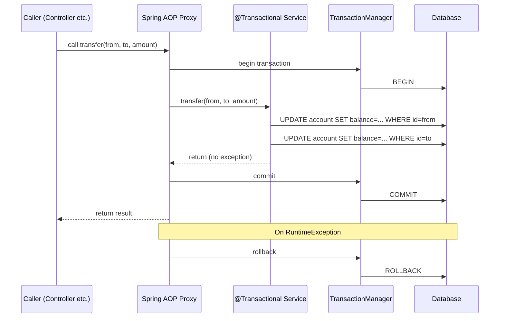
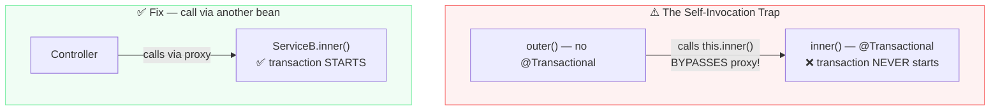

# Transactions

> [!info] For the Express/TS dev
> In Node, transactions are explicit: `prisma.$transaction(async tx => {...})`. In Spring you annotate the method `@Transactional` and Spring opens/commits/rolls back automatically — invisible AOP machinery. The catch: it's invisible. Calling a `@Transactional` method from within the same class **bypasses** the proxy and the transaction never starts. This bites everyone once.

## Concept / How it works

Spring wraps `@Transactional` beans with a proxy. When you invoke the method **from outside the bean**, the proxy:

1. Begins a transaction (if needed per propagation)
2. Invokes the target method
3. On normal return → commits
4. On `RuntimeException` / `Error` → rolls back
5. On checked exception → **commits** (unless `rollbackFor` says otherwise)





## Code example

### Basic usage

```java
@Service
public class TransferService {

    private final AccountRepository repo;

    public TransferService(AccountRepository repo) { this.repo = repo; }

    @Transactional
    public void transfer(Long from, Long to, BigDecimal amount) {
        Account a = repo.findById(from).orElseThrow();
        Account b = repo.findById(to).orElseThrow();
        a.debit(amount);
        b.credit(amount);
        // No save() needed — managed entities flush at commit time
    }

    @Transactional(readOnly = true)
    public AccountSummary summary(Long id) {
        return repo.findById(id).map(this::toSummary).orElseThrow();
    }
}
```

`readOnly = true` is a hint:
- Hibernate disables dirty-check / flush
- Some DBs use a read-only replica
- Always set on read-only methods

### Propagation

```java
@Transactional(propagation = Propagation.REQUIRED)         // default — join or start
@Transactional(propagation = Propagation.REQUIRES_NEW)     // suspend outer, start a new one
@Transactional(propagation = Propagation.SUPPORTS)         // join if exists, else no tx
@Transactional(propagation = Propagation.NOT_SUPPORTED)    // suspend outer, run without tx
@Transactional(propagation = Propagation.NEVER)            // throw if a tx exists
@Transactional(propagation = Propagation.MANDATORY)        // throw if no tx exists
@Transactional(propagation = Propagation.NESTED)           // savepoint (DB-dependent)
```

Common pattern: audit logging in a `REQUIRES_NEW` so it commits even if outer rolls back:

```java
@Service
public class AuditService {

    @Transactional(propagation = Propagation.REQUIRES_NEW)
    public void log(AuditEvent event) {
        auditRepo.save(event);
    }
}

@Service
public class OrderService {
    @Transactional
    public Order create(CreateOrderRequest req) {
        Order o = ...;
        auditService.log(new AuditEvent("ORDER_CREATED", o.getId()));
        if (somethingFails()) throw new RuntimeException(); // outer rolls back; audit committed
        return o;
    }
}
```

### Isolation levels

```java
@Transactional(isolation = Isolation.READ_COMMITTED)   // default in PostgreSQL
@Transactional(isolation = Isolation.REPEATABLE_READ)  // default in MySQL/InnoDB
@Transactional(isolation = Isolation.SERIALIZABLE)     // strictest, locking
@Transactional(isolation = Isolation.READ_UNCOMMITTED) // dirty reads — almost never useful
```

| Anomaly | READ_UNCOMMITTED | READ_COMMITTED | REPEATABLE_READ | SERIALIZABLE |
| --- | --- | --- | --- | --- |
| Dirty read | Possible | Prevented | Prevented | Prevented |
| Non-repeatable read | Possible | Possible | Prevented | Prevented |
| Phantom read | Possible | Possible | Possible* | Prevented |
| Lost update | Possible | Possible | Possible | Prevented |

*PostgreSQL's REPEATABLE READ also prevents phantoms; MySQL with gap locks also.

### Rollback rules

```java
// Default: rollback on RuntimeException; commit on checked
@Transactional(rollbackFor = Exception.class)         // ALL exceptions roll back
@Transactional(noRollbackFor = NotFoundException.class) // commit even on this RTE
```

### Optimistic locking with `@Version`

```java
@Entity
public class Account {
    @Id @GeneratedValue Long id;
    BigDecimal balance;
    @Version Long version;   // Hibernate auto-increments + checks
}
```

When two transactions update the same row, the second flush throws `ObjectOptimisticLockingFailureException`. Catch & retry.

### Pessimistic locking

```java
public interface AccountRepository extends JpaRepository<Account, Long> {

    @Lock(LockModeType.PESSIMISTIC_WRITE)
    Optional<Account> findById(Long id);   // SELECT ... FOR UPDATE

    @Lock(LockModeType.PESSIMISTIC_READ)
    @Query("SELECT a FROM Account a WHERE a.id = :id")
    Optional<Account> findForRead(@Param("id") Long id);
}
```

### Programmatic transactions

```java
@Service
public class BatchService {
    private final TransactionTemplate tx;

    public BatchService(PlatformTransactionManager tm) {
        this.tx = new TransactionTemplate(tm);
    }

    public void doBatch() {
        tx.executeWithoutResult(status -> {
            // ... work ...
            if (problem) status.setRollbackOnly();
        });
    }
}
```

## Express/TS comparison

```ts
// Prisma
await prisma.$transaction(async tx => {
  const a = await tx.account.update({ where: { id: from }, data: { balance: { decrement: amount }} });
  const b = await tx.account.update({ where: { id: to },   data: { balance: { increment: amount }} });
});

// node-pg
await client.query('BEGIN');
try {
  // ...
  await client.query('COMMIT');
} catch (e) {
  await client.query('ROLLBACK');
  throw e;
}
```

| Node | Spring |
| --- | --- |
| `prisma.$transaction(async tx => {})` | `@Transactional` method |
| Pass `tx` parameter explicitly | Implicit via thread-bound `EntityManager` |
| Try/catch + rollback | Auto rollback on `RuntimeException` |
| Isolation as option | `@Transactional(isolation=...)` |
| No equivalent | Propagation modes |
| `await Promise.all` does NOT share tx | All sync calls within `@Transactional` share tx |

## Gotchas

> [!danger] Self-invocation bypasses the proxy
> ```java
> @Service
> public class FooService {
>     public void outer() { inner(); }   // calls inner() through `this`, not proxy
>     @Transactional public void inner() { ... }   // never starts a tx!
> }
> ```
> Solutions: extract `inner` into another bean, or inject `self` (`@Lazy ApplicationContext` / `@Autowired FooService self`), or use `AopContext.currentProxy()`.

> [!danger] Checked exceptions don't roll back by default
> A method that throws `IOException` will COMMIT. Use `@Transactional(rollbackFor = Exception.class)`.

> [!warning] `@Transactional` on `private` methods does nothing
> AOP proxies only intercept public methods (CGLIB at least). Use public.

> [!warning] `@Async` and `@Transactional` interaction
> An `@Async` method runs on a different thread; the calling transaction is NOT propagated. Either start a new tx in the async method or coordinate via outbox patterns.

> [!warning] Long-running transactions = lock contention
> Don't do HTTP calls or sleeps inside `@Transactional`. Get in, mutate, commit, get out.

> [!warning] `open-in-view: true` keeps the tx open through the whole request
> Hides issues; can leave connections held. **Set `spring.jpa.open-in-view: false`**.

> [!tip] `@Transactional(readOnly = true)` everywhere on read methods
> Free performance — Hibernate skips dirty checking.

> [!tip] One method, one transaction boundary
> Don't mix `@Transactional` on the controller AND service; pick the service layer.

## Related

- [[04-Repositories]]
- [[06-N-Plus-One-and-Fetching]]
- [[06-Exception-Handling]]
- [[Spring-AOP]]
