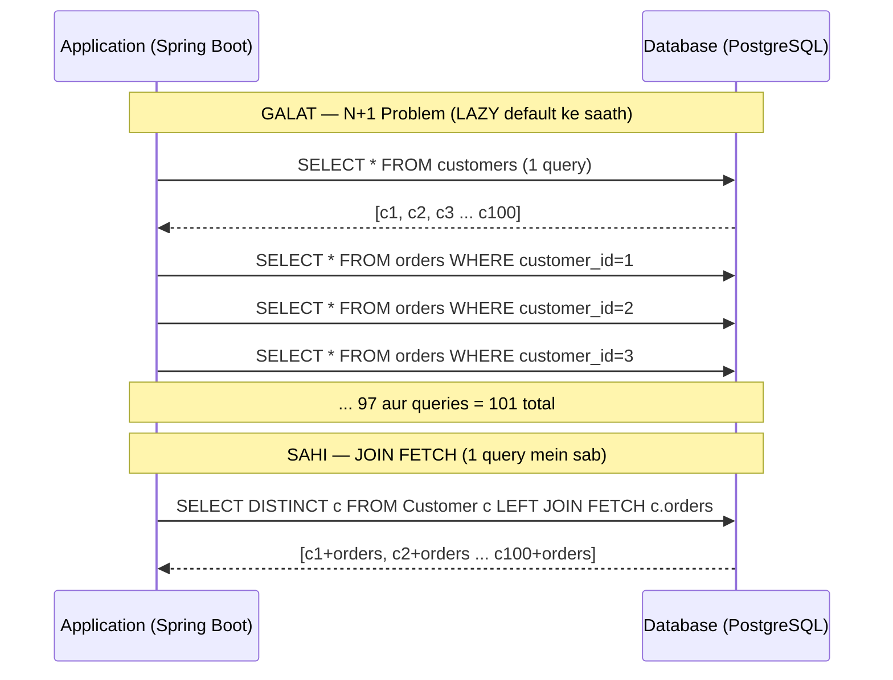

# N+1 Problem aur Fetching Strategies

> [!info] Node.js/TypeScript developer ke liye ek seedha comparison
> Agar tune Prisma use kiya hai, toh tu N+1 problem se already familiar hai — bas wahan tumhe **force** karna padta tha `include` likhna. Prisma mein lazy loading hoti hi nahi, jo tumse galti karne se bachata hai.
>
> JPA/Hibernate mein dono option hain — eager aur lazy — aur lazy **default** hai kaafi jagah. Matlab Hibernate chup-chaap N+1 queries fire karta rehta hai, aur tujhe pata bhi nahi chalta jab tak production mein log slow nahi hone lagte. Yeh ek aisi cheez hai jo "JPA use kar sakta hoon" aur "JPA production mein use kar sakta hoon" ke beech ka sabse bada fark hai.

---

## Problem Kya Hai? — Real World Analogy

Socho Zomato ka backend. Ek API hai jo 100 restaurants ki list dikhata hai, aur saath mein unke top 5 menu items bhi.

**Galat approach (N+1 waali):**
1. Pehle query — sab restaurants fetch karo (1 query)
2. Phir loop mein har restaurant ke liye alag query — uske menu items fetch karo (100 queries)
3. Total: **101 queries** database pe

Yeh tab theek lagta hai jab dev environment mein 5 restaurants hain. Production mein 10,000 restaurants ke saath? **10,001 queries per API call** — database ki band baj gayi.

**Sahi approach:**
Ek hi query mein restaurants aur unke menu items dono fetch karo using JOIN — **1 query, same result**.

Yahi N+1 problem hai. Aur JPA mein yeh silently hota hai — koi error nahi, koi warning nahi, bas slow response.

---

## JPA Mein Lazy Loading Kaise Kaam Karta Hai

Jab tu `@OneToMany` ya `@ManyToOne` relationship define karta hai, toh Hibernate ek **proxy object** create karta hai associated data ke liye. Actual database query tab fire hoti hai jab tu pehli baar us data ko **access** karta hai.

```java
// Customer entity
@Entity
public class Customer {
    @Id
    private Long id;
    private String name;

    // LAZY by default — Hibernate ek proxy banata hai
    // Jab tak getOrders() call nahi hota, koi query nahi
    @OneToMany(mappedBy = "customer", fetch = FetchType.LAZY)
    private List<Order> orders;
}
```

```java
// N+1 silently happen karta hai yahaan
List<Customer> customers = customerRepo.findAll();  // Query 1: SELECT * FROM customers

for (Customer c : customers) {
    // YAHAAN trigger hoti hai query — har customer ke liye alag
    // "SELECT * FROM orders WHERE customer_id = ?" — 100 baar
    System.out.println(c.getOrders().size());
}

// Total: 1 + 100 = 101 queries — aur tune kuch kiya nahi
```



---

## Node.js vs JPA — Fundamental Difference

Tu Prisma se aaya hai toh yeh comparison teri aankhein khol dega:

```typescript
// Prisma — tujhe explicitly batana padta hai kya fetch karna hai
// Lazy loading ka concept hi nahi hai Prisma mein
const customers = await prisma.customer.findMany({
  include: {
    orders: {
      include: {
        items: true   // nested include bhi explicit
      }
    }
  }
});
// Prisma internally ek efficient query banata hai — N+1 nahi hoti
```

```java
// JPA — proxy magic se kuch bhi access kar sakta hai
// Lekin iska matlab hai Hibernate queries fire kar raha hai tere peeche
List<Customer> customers = customerRepo.findAll();
// Yahaan orders fetch nahi hue

customers.get(0).getOrders();  // AB query fire hogi — tu dekh bhi nahi sakta
```

| Feature | Prisma (Node.js) | JPA/Hibernate (Spring) |
|---|---|---|
| Lazy loading | Nahi hoti | Default hai (OneToMany/ManyToMany) |
| N+1 by default | Nahi | Haan, agar dhyan nahi diya |
| Eager fetch syntax | `include: { orders: true }` | `JOIN FETCH` / `@EntityGraph` |
| DTO projection | `select: { id, name }` | Interface projection / record |
| Control level | Kam (safer) | Zyada (sharper, but dangerous) |

---

## LAZY vs EAGER — Kaun Kab Use Hota Hai?

JPA mein har association ka ek **default fetch type** hota hai. Yeh defaults bahut important hain kyunki yahi problem ki jad hai:

| Annotation | Default FetchType | Kya Karna Chahiye |
|---|---|---|
| `@ManyToOne` | **EAGER** | Override karke **LAZY** karo |
| `@OneToOne` | **EAGER** | Override karke **LAZY** karo |
| `@OneToMany` | LAZY | LAZY hi rakhna |
| `@ManyToMany` | LAZY | LAZY hi rakhna |
| `@ElementCollection` | LAZY | LAZY hi rakhna |

> [!warning] EAGER associations wala trap
> `@ManyToOne` aur `@OneToOne` default mein EAGER hain. Matlab jab bhi tu koi entity fetch karta hai, Hibernate automatically saari EAGER associations bhi load karta hai — chahe tune unhe use karna ho ya nahi.
>
> Ek `Customer` entity mein agar 5 EAGER associations hain, toh ek simple `findById()` bhi 5 extra queries fire karega. Production mein yeh killer hai.

**Golden Rule: Sab kuch LAZY rakho by default. Jab specific query mein chahiye, tab explicitly fetch karo.**

```java
// Sahi tarika — dono ko LAZY karo
@Entity
public class Customer {

    @ManyToOne(fetch = FetchType.LAZY)  // Default EAGER tha — override kiya
    @JoinColumn(name = "address_id")
    private Address address;

    @OneToOne(fetch = FetchType.LAZY)   // Default EAGER tha — override kiya
    @JoinColumn(name = "profile_id")
    private CustomerProfile profile;

    @OneToMany(mappedBy = "customer", fetch = FetchType.LAZY)  // Already LAZY
    private List<Order> orders;
}
```

---

## Fix 1 — JOIN FETCH in JPQL (Sabse Seedha Tarika)

JPQL query mein `JOIN FETCH` likho — Hibernate ek hi SQL query mein sab fetch kar lega.

```java
public interface CustomerRepository extends JpaRepository<Customer, Long> {

    // Simple JOIN FETCH — customer ke saath orders ek hi query mein
    @Query("SELECT DISTINCT c FROM Customer c LEFT JOIN FETCH c.orders")
    List<Customer> findAllWithOrders();

    // Deep nested fetch — orders ke andar items bhi chahiye
    @Query("""
        SELECT DISTINCT c FROM Customer c
        LEFT JOIN FETCH c.orders o
        LEFT JOIN FETCH o.items
        WHERE c.id = :id
        """)
    Optional<Customer> findByIdWithOrdersAndItems(@Param("id") Long id);

    // Condition ke saath — Zomato example: sirf active customers jinke orders hain
    @Query("""
        SELECT DISTINCT c FROM Customer c
        LEFT JOIN FETCH c.orders o
        WHERE c.status = :status
        AND o.createdAt >= :since
        """)
    List<Customer> findActiveCustomersWithRecentOrders(
        @Param("status") CustomerStatus status,
        @Param("since") LocalDateTime since
    );
}
```

> [!tip] `DISTINCT` kyun zaroori hai?
> Jab JOIN hoti hai, toh agar ek customer ke 3 orders hain, toh result mein woh customer **3 baar** aata hai (Cartesian product). `DISTINCT` yeh duplicates hata deta hai. JPQL mein `DISTINCT` result list se duplicates hatata hai, na SQL-level pe necessarily.

**Generated SQL kaisa dikhta hai:**
```sql
-- JOIN FETCH ke baad yeh ek query fire hogi
SELECT DISTINCT c.*, o.*
FROM customers c
LEFT OUTER JOIN orders o ON o.customer_id = c.id
```

---

## Fix 2 — `@EntityGraph` (Declarative aur Reusable)

`JOIN FETCH` JPQL mein likhna padta hai — har query mein alag se. `@EntityGraph` ek declarative tarika hai jo existing methods pe apply ho sakta hai bina query rewrite kiye.

```java
public interface CustomerRepository extends JpaRepository<Customer, Long> {

    // Base findById() ko override karo — ab orders bhi aayenge
    @EntityGraph(attributePaths = { "orders" })
    Optional<Customer> findById(Long id);

    // Nested associations — orders ke items bhi chahiye
    @EntityGraph(attributePaths = { "orders", "orders.items" })
    Optional<Customer> findWithFullDetailsById(Long id);

    // Named entity graph use karo (entity pe define kiya)
    @EntityGraph("Customer.withOrdersAndItems")
    List<Customer> findByStatus(CustomerStatus status);

    // Derived query + EntityGraph — super clean combination
    @EntityGraph(attributePaths = { "orders" })
    List<Customer> findByCity(String city);
}
```

**Named Entity Graph — Entity pe define karo:**

```java
@Entity
@NamedEntityGraph(
    name = "Customer.withOrdersAndItems",
    attributeNodes = {
        @NamedAttributeNode(
            value = "orders",
            subgraph = "orders-subgraph"  // nested association ke liye subgraph
        )
    },
    subgraphs = @NamedSubgraph(
        name = "orders-subgraph",
        attributeNodes = @NamedAttributeNode("items")  // orders ke andar items
    )
)
public class Customer {
    @Id
    private Long id;
    private String name;
    private String city;
    private CustomerStatus status;

    @OneToMany(mappedBy = "customer", fetch = FetchType.LAZY)
    private List<Order> orders;
}
```

**JOIN FETCH vs @EntityGraph — Kab Kaun Use Karein?**

| Situation | Prefer |
|---|---|
| Ek hi jagah specific query chahiye | `JOIN FETCH` |
| Same fetch pattern kaafi methods mein | `@EntityGraph` |
| Derived query (`findByCity`) pe apply karna | `@EntityGraph` (JOIN FETCH use nahi kar sakte derived methods mein) |
| Complex conditions wali JPQL | `JOIN FETCH` |

---

## Fix 3 — Batch Fetching (N+1 Ko Reduce Karo, Eliminate Nahi)

Kabhi kabhi lazy loading avoid nahi kar sakte — complicated business logic hai, ya entity graph bahut complex ho jaata. Batch fetching ek pragmatic fix hai jo N+1 ko `N/batch_size + 1` queries mein reduce karta hai.

**Global setting:**
```yaml
# application.yml
spring:
  jpa:
    properties:
      hibernate:
        default_batch_fetch_size: 50
```

**Yeh kaise kaam karta hai:**
```
Without batch fetch (100 customers ke liye):
  SELECT * FROM orders WHERE customer_id = 1
  SELECT * FROM orders WHERE customer_id = 2
  ... 100 queries

With batch_fetch_size = 50:
  SELECT * FROM orders WHERE customer_id IN (1,2,3,...,50)   -- 1 query
  SELECT * FROM orders WHERE customer_id IN (51,52,...,100)  -- 1 query
  Total: 2 queries instead of 100
```

**Per-collection setting (granular control):**
```java
@Entity
public class Customer {

    @OneToMany(mappedBy = "customer", fetch = FetchType.LAZY)
    @BatchSize(size = 50)  // Sirf is collection ke liye
    private List<Order> orders;

    @ManyToMany
    @BatchSize(size = 20)  // Alag collection ke liye alag size
    private Set<Tag> tags;
}
```

> [!info] Batch fetching kab use karein?
> - Jab legacy code hai aur refactor mushkil hai
> - Jab business logic itni complex hai ki entity graph banana messy lagta hai
> - Quick win chahiye production pe, detailed fix baad mein
>
> Best practice: Batch fetching ko permanent solution mat samjho. JOIN FETCH ya EntityGraph always better hai.

---

## Fix 4 — DTO Projection (Best for Read-Only APIs)

Agar tujhe entities ko modify nahi karna, sirf data read karke return karna hai — toh entities load karna hi kyon? Directly DTO ya projection fetch karo.

**Interface Projection:**
```java
// Interface define karo — Spring Data automatically implement karta hai
public interface CustomerSummary {
    Long getId();
    String getName();
    String getCity();
    Integer getOrderCount();  // computed field

    // Nested interface bhi support hoti hai
    AddressView getAddress();

    interface AddressView {
        String getStreet();
        String getPinCode();
    }
}

// Repository mein use karo
public interface CustomerRepository extends JpaRepository<Customer, Long> {

    @Query("""
        SELECT c.id AS id,
               c.name AS name,
               c.city AS city,
               SIZE(c.orders) AS orderCount
        FROM Customer c
        """)
    List<CustomerSummary> findAllSummaries();
}
```

**Record Projection (Java 16+ — Clean aur Type-Safe):**
```java
// Record — immutable, auto-generated equals/hashCode/toString
public record CustomerSummary(Long id, String name, long orderCount) {}

public interface CustomerRepository extends JpaRepository<Customer, Long> {

    @Query("""
        SELECT new com.example.dto.CustomerSummary(c.id, c.name, SIZE(c.orders))
        FROM Customer c
        WHERE c.status = :status
        """)
    List<CustomerSummary> findSummariesByStatus(@Param("status") CustomerStatus status);
}
```

**Zomato jaisa example — Restaurant API:**
```java
// Puri Restaurant entity load karna kyon? Sirf list ke liye naam aur rating chahiye
public record RestaurantListItem(
    Long id,
    String name,
    String cuisine,
    Double avgRating,
    Integer totalOrders,
    Boolean isOpen
) {}

@Query("""
    SELECT new com.zomato.dto.RestaurantListItem(
        r.id, r.name, r.cuisine,
        AVG(rev.rating),
        COUNT(o.id),
        r.isOpen
    )
    FROM Restaurant r
    LEFT JOIN r.reviews rev
    LEFT JOIN r.orders o
    WHERE r.city = :city
    GROUP BY r.id, r.name, r.cuisine, r.isOpen
    ORDER BY AVG(rev.rating) DESC
    """)
List<RestaurantListItem> findTopRestaurantsByCity(@Param("city") String city);
```

> [!tip] DTO Projections kab use karein?
> - Read-only API endpoints — list pages, search results, dashboards
> - Jab sirf kuch fields chahiye puri entity se
> - High-traffic endpoints jahan performance critical ho
>
> DTO projections persistence context ka overhead bilkul nahi lete — entities ko dirty checking, caching, proxy management karna nahi padta.

---

## Development Mein N+1 Detect Kaise Karein

Yeh problem tab pata chalti hai jab tu SQL logs ON karta hai. **Hamesha dev mein SQL logging on rakho.**

```yaml
# application.yml — dev profile ke liye
spring:
  jpa:
    show-sql: true
    properties:
      hibernate:
        format_sql: true         # Readable SQL formatting
        generate_statistics: true  # Session statistics — kitni queries, time, etc.

logging:
  level:
    org.hibernate.SQL: DEBUG
    org.hibernate.orm.jdbc.bind: TRACE    # Query parameters bhi dikhao (careful — PII!)
    org.hibernate.stat: DEBUG             # Statistics print karta hai session end pe
```

**Statistics output kaisa dikhta hai:**
```
Session Metrics {
  5438220 nanoseconds spent acquiring 1 JDBC connections;
  ...
  101 flushes as part of l2 cache puts;
  <-- Yahaan dekh 101 queries? Problem hai!
  ...
}
```

**p6spy — Cleaner SQL Logging:**

```xml
<!-- pom.xml -->
<dependency>
    <groupId>p6spy</groupId>
    <artifactId>p6spy</artifactId>
    <version>3.9.1</version>
    <scope>runtime</scope>
</dependency>
```

```yaml
# application.yml
spring:
  datasource:
    url: jdbc:p6spy:postgresql://localhost:5432/mydb
    driver-class-name: com.p6spy.engine.spy.P6SpyDriver
```

```properties
# spy.properties (src/main/resources mein)
modulelist=com.p6spy.engine.spy.appender.Slf4JLogger
logMessageFormat=com.p6spy.engine.spy.appender.CustomLineFormat
customLogMessageFormat=%(currentTime)|%(executionTime)ms|%(sql)
```

Ab har query ke saath **execution time** bhi dikhega — slow queries pakad lenge.

---

## Practical Scenario — Swiggy-Jaisi App

Socho ek scenario: Delivery partner ka dashboard — unke saare active deliveries aur har delivery ke order details.

```java
@Entity
public class DeliveryPartner {
    @Id
    private Long id;
    private String name;
    private String phone;

    @OneToMany(mappedBy = "partner", fetch = FetchType.LAZY)
    private List<Delivery> activeDeliveries;
}

@Entity
public class Delivery {
    @Id
    private Long id;
    private DeliveryStatus status;

    @ManyToOne(fetch = FetchType.LAZY)
    private DeliveryPartner partner;

    @ManyToOne(fetch = FetchType.LAZY)  // EAGER se LAZY override kiya
    private Order order;
}

@Entity
public class Order {
    @Id
    private Long id;
    private String restaurantName;
    private Double totalAmount;

    @OneToMany(mappedBy = "order", fetch = FetchType.LAZY)
    private List<OrderItem> items;
}
```

**Service layer — N+1 fix ke saath:**
```java
@Service
@Transactional(readOnly = true)  // Read-only transactions — performance better hoti hai
public class DeliveryDashboardService {

    private final DeliveryPartnerRepository partnerRepo;

    // GALAT — N+1 hoga
    public List<DeliveryPartnerDto> getDashboardBad(Long partnerId) {
        DeliveryPartner partner = partnerRepo.findById(partnerId).orElseThrow();
        // Yahaan activeDeliveries fetch hogi — 1 query
        // Phir loop mein har delivery ke liye order fetch — N queries
        return partner.getActiveDeliveries().stream()
            .map(this::toDto)
            .toList();
    }

    // SAHI — EntityGraph se ek query mein sab
    public List<DeliveryPartnerDto> getDashboardGood(Long partnerId) {
        // Repository mein EntityGraph define hai jo deliveries + orders ek saath laata hai
        DeliveryPartner partner = partnerRepo
            .findWithActiveDeliveriesAndOrders(partnerId)
            .orElseThrow();
        return partner.getActiveDeliveries().stream()
            .map(this::toDto)
            .toList();
    }

    // BEST for read-only — DTO projection seedha
    public List<DeliveryDashboardDto> getDashboardBest(Long partnerId) {
        return partnerRepo.findDashboardData(partnerId);
        // Ek query, sirf zaroori columns, no proxy overhead
    }
}
```

```java
public interface DeliveryPartnerRepository extends JpaRepository<DeliveryPartner, Long> {

    @EntityGraph(attributePaths = { "activeDeliveries", "activeDeliveries.order" })
    Optional<DeliveryPartner> findWithActiveDeliveriesAndOrders(Long id);

    @Query("""
        SELECT new com.swiggy.dto.DeliveryDashboardDto(
            d.id, d.status,
            o.id, o.restaurantName, o.totalAmount
        )
        FROM Delivery d
        JOIN d.order o
        WHERE d.partner.id = :partnerId
        AND d.status IN ('PICKED_UP', 'OUT_FOR_DELIVERY')
        ORDER BY d.createdAt DESC
        """)
    List<DeliveryDashboardDto> findDashboardData(@Param("partnerId") Long partnerId);
}
```

---

## Common Gotchas — Beginners Yahan Galti Karte Hain

> [!danger] `LazyInitializationException` — Sabse Common Error
> Yeh tab hota hai jab tu transaction band hone ke baad lazy collection access karta hai:
> ```
> org.hibernate.LazyInitializationException: failed to lazily initialize a collection
> of role: com.example.Customer.orders: could not initialize proxy - no Session
> ```
>
> **Kab hota hai:**
> ```java
> // Service layer mein transaction khatam ho gayi
> Customer customer = customerService.findById(1L);  // Transaction yahan khatam
>
> // Controller mein — ab koi session nahi
> customer.getOrders().size();  // BOOM — LazyInitializationException
> ```
>
> **Fix:** Transaction ke andar hi data fetch karo, ya DTO return karo service layer se.

> [!danger] `open-in-view: true` — Boot Ka Seedha Trap
> Spring Boot mein by default `open-in-view: true` hota hai. Yeh `OpenEntityManagerInViewFilter` naam ka filter Hibernate session ko poore HTTP request ke dauran khula rakhta hai — even controller aur view rendering tak.
>
> Matlab `LazyInitializationException` nahi aati — aur isliye tujhe pata nahi chalta ki N+1 ho raha hai. JSON serialization ke waqt quietly 50 extra queries fire ho sakti hain.
>
> **Hamesha production mein `false` karo:**
> ```yaml
> spring:
>   jpa:
>     open-in-view: false  # Default true hai — BAD
> ```
>
> Isse `LazyInitializationException` aane lagegi (achhi baat hai!) — ab tujhe pata chalega kahan fix karna hai.

> [!warning] `JOIN FETCH` + Pagination — Khatarnaak Combination
> ```java
> @Query("SELECT DISTINCT c FROM Customer c LEFT JOIN FETCH c.orders")
> Page<Customer> findAll(Pageable pageable);  // GALAT
> ```
>
> Hibernate yeh warning dega:
> ```
> HHH90003004: firstResult/maxResults specified with collection fetch;
> applying in memory!
> ```
>
> Matlab Hibernate **saara data** pehle load karega memory mein, phir wahan page karega. 1 million rows ke saath — OOM error pakki.
>
> **Sahi tarika — Two-step approach:**
> ```java
> // Step 1: Paginated IDs fetch karo (no JOIN FETCH)
> @Query("SELECT c.id FROM Customer c")
> Page<Long> findAllIds(Pageable pageable);
>
> // Step 2: Un IDs ke liye JOIN FETCH karo
> @Query("SELECT DISTINCT c FROM Customer c LEFT JOIN FETCH c.orders WHERE c.id IN :ids")
> List<Customer> findWithOrdersByIds(@Param("ids") List<Long> ids);
>
> // Service mein combine karo
> public Page<CustomerDto> getCustomers(Pageable pageable) {
>     Page<Long> idPage = customerRepo.findAllIds(pageable);
>     List<Customer> customers = customerRepo.findWithOrdersByIds(idPage.getContent());
>     return new PageImpl<>(customers.stream().map(this::toDto).toList(),
>                           pageable, idPage.getTotalElements());
> }
> ```

> [!warning] `MultipleBagFetchException` — Ek Saath Do Collections
> ```java
> // GALAT — Hibernate do List collections ek query mein JOIN FETCH nahi kar sakta
> @Query("""
>     SELECT DISTINCT c FROM Customer c
>     LEFT JOIN FETCH c.orders
>     LEFT JOIN FETCH c.tags
>     """)
> List<Customer> findAllWithOrdersAndTags();
> // Exception: MultipleBagFetchException: cannot simultaneously fetch multiple bags
> ```
>
> **Fix 1 — Set use karo List ki jagah:**
> ```java
> @OneToMany(mappedBy = "customer")
> private Set<Order> orders;  // List se Set
>
> @ManyToMany
> private Set<Tag> tags;  // List se Set
> ```
>
> **Fix 2 — Separate queries:**
> ```java
> // EntityGraph automatically separate selects use karta hai multiple collections ke liye
> @EntityGraph(attributePaths = { "orders", "tags" })
> Optional<Customer> findById(Long id);
> // Hibernate 2 separate queries karega internally — N+1 nahi, bas 2 queries
> ```

> [!warning] EAGER Associations on `findAll()` — Silent Killer
> ```java
> @Entity
> public class Product {
>     @ManyToOne  // EAGER by default!
>     private Category category;
>
>     @ManyToOne  // EAGER by default!
>     private Seller seller;
> }
>
> // Yeh ek line 3 queries fire karega:
> // 1. SELECT * FROM products
> // 2. SELECT * FROM categories WHERE id IN (...)  [distinct categories]
> // 3. SELECT * FROM sellers WHERE id IN (...)     [distinct sellers]
> // Phir bhi N+1 ban sakta hai agar batch fetch nahi hai
> List<Product> all = productRepo.findAll();
> ```
>
> **Fix: Override karo ManyToOne ko LAZY:**
> ```java
> @ManyToOne(fetch = FetchType.LAZY)
> private Category category;
> ```

---

## LazyInitializationException ko Sahi Tarike se Handle Karna

Yeh aata hai toh fix karne ke 3 tarike hain:

**Option 1 — JOIN FETCH ya EntityGraph (Best):**
```java
// Query ke andar hi fetch karo
@EntityGraph(attributePaths = { "orders" })
Optional<Customer> findById(Long id);
```

**Option 2 — Transaction Extend Karo (Service mein):**
```java
@Service
public class CustomerService {

    @Transactional  // Transaction yahan tak open rahega
    public CustomerDto getCustomerWithOrders(Long id) {
        Customer customer = customerRepo.findById(id).orElseThrow();
        // Ab orders access kar sakte hain — transaction open hai
        int orderCount = customer.getOrders().size();  // OK
        return new CustomerDto(customer.getName(), orderCount);
        // Method return pe transaction close hogi — iske baad access mat karna
    }
}
```

**Option 3 — DTO return karo (Cleanest for APIs):**
```java
@Transactional(readOnly = true)
public CustomerResponseDto getCustomer(Long id) {
    Customer customer = customerRepo.findById(id).orElseThrow();
    List<OrderDto> orderDtos = customer.getOrders().stream()
        .map(o -> new OrderDto(o.getId(), o.getTotal()))
        .toList();
    // Sab kuch transaction ke andar hi convert kar diya DTO mein
    return new CustomerResponseDto(customer.getId(), customer.getName(), orderDtos);
    // Ab controller mein koi entity access nahi hogi
}
```

---

## Key Takeaways

- **N+1 problem silently hota hai** — Hibernate koi error nahi deta, bas extra queries fire karta hai. SQL logging hamesha dev mein on rakho.

- **Sab kuch LAZY rakho by default** — `@ManyToOne` aur `@OneToOne` ko explicitly `LAZY` override karo kyunki unka default EAGER hai.

- **Specific queries ke liye explicit fetch** — `JOIN FETCH` ya `@EntityGraph` se wahi load karo jo actually chahiye. "Shayad baad mein kaam aaye" wala attitude performance killer hai.

- **`open-in-view: false` production mein** — Default `true` problems chhupaata hai. False karne se real issues surface hote hain.

- **JOIN FETCH + Pagination kabhi mat karo** — Two-step approach use karo: pehle paginated IDs, phir unke liye JOIN FETCH.

- **MultipleBagFetchException** — Do `List` collections ek saath JOIN FETCH nahi ho sakti. `Set` use karo ya `@EntityGraph` (jo internally split karta hai).

- **DTO projections read-only paths ke liye best hain** — Jab sirf data dikhana hai, entities load karne ki zaroorat nahi. Interface projections ya records use karo.

- **Batch fetching pragmatic fix hai** — `hibernate.default_batch_fetch_size: 50` set karne se N+1 dramatically reduce hota hai bina refactoring ke. Permanent solution nahi hai, lekin quick win hai.

- **Prisma se aaya hai toh yeh samajh** — Prisma ne tujhe explicit include likhne ke liye force kiya — JPA mein yeh responsibility teri hai manually. Koi guardrail nahi hai.

- **Statistics aur p6spy use karo** — `hibernate.generate_statistics: true` aur p6spy se real numbers milte hain. "Lagta hai sahi hai" se zyada important hai "logs mein dekha sahi hai."
