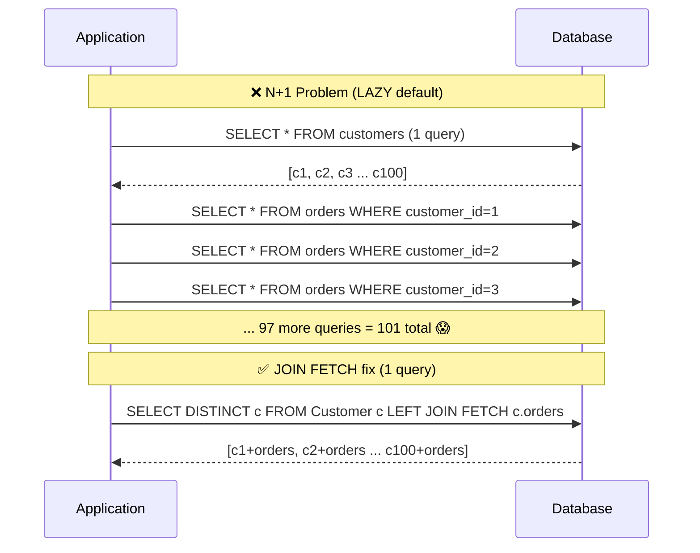

# N+1 Problem and Fetching

> [!info] For the Express/TS dev
> The N+1 problem is the equivalent of doing `await prisma.user.findMany()` and then for each user `await prisma.post.findMany({ where: { userId } })` in a loop — except in JPA it happens **silently** because of lazy proxies. Prisma forces you to use `include`; Hibernate happily fires N queries with no warning. Mastering this is the single biggest skill jump from "can use JPA" to "can use JPA in production."

## Concept / How it works

When you load a `Customer` and access `customer.getOrders()`, Hibernate may either:

1. **EAGER fetch** — load orders in a JOIN at the same time as the customer.
2. **LAZY fetch** — return a proxy. The first call to `getOrders().size()` triggers a separate `SELECT * FROM orders WHERE customer_id = ?`.

If you load 100 customers and access each `getOrders()`, that's **1 + 100 = 101 queries**. The N+1 problem.



Fixes:
1. `JOIN FETCH` in JPQL
2. `@EntityGraph`
3. Batch fetching (`@BatchSize` / `hibernate.default_batch_fetch_size`)
4. DTO projections (don't fetch entities at all)

## Code example

### The problem

```java
List<Customer> customers = customerRepo.findAll();   // 1 query
for (Customer c : customers) {
    System.out.println(c.getOrders().size());        // 1 query EACH → N more
}
// Total: 1 + N queries
```

### Fix 1 — JOIN FETCH in JPQL

```java
public interface CustomerRepository extends JpaRepository<Customer, Long> {

    @Query("SELECT DISTINCT c FROM Customer c LEFT JOIN FETCH c.orders")
    List<Customer> findAllWithOrders();

    @Query("""
        SELECT DISTINCT c FROM Customer c
        LEFT JOIN FETCH c.orders o
        LEFT JOIN FETCH o.items
        WHERE c.id = :id
        """)
    Optional<Customer> findByIdWithOrdersAndItems(@Param("id") Long id);
}
```

`DISTINCT` deduplicates Cartesian products from the JOIN.

### Fix 2 — `@EntityGraph` (declarative, reusable)

```java
public interface CustomerRepository extends JpaRepository<Customer, Long> {

    @EntityGraph(attributePaths = { "orders", "orders.items" })
    Optional<Customer> findById(Long id);   // overrides base method

    // Named version
    @EntityGraph("Customer.full")
    List<Customer> findByStatus(CustomerStatus s);
}

@Entity
@NamedEntityGraph(name = "Customer.full",
    attributeNodes = {
        @NamedAttributeNode(value = "orders", subgraph = "orders.items")
    },
    subgraphs = @NamedSubgraph(name = "orders.items",
                               attributeNodes = @NamedAttributeNode("items")))
public class Customer { ... }
```

### Fix 3 — Batch fetching

`application.yml`:

```yaml
spring:
  jpa:
    properties:
      hibernate:
        default_batch_fetch_size: 50
```

Now when accessing 100 lazy proxies, Hibernate fires 2 queries (`WHERE id IN (...)` chunked by 50) instead of 100. Doesn't eliminate N+1 but reduces severity dramatically.

Per-collection:

```java
@OneToMany(mappedBy = "customer", fetch = FetchType.LAZY)
@BatchSize(size = 50)
private List<Order> orders;
```

### Fix 4 — DTO projection (best for read-only views)

```java
public interface CustomerSummary {
    Long getId();
    String getName();
    Integer getOrderCount();   // computed
}

@Query("""
    SELECT c.id AS id, c.name AS name, SIZE(c.orders) AS orderCount
    FROM Customer c
    """)
List<CustomerSummary> summaries();
```

Or with a `record` constructor expression:

```java
public record CustomerSummary(Long id, String name, long orderCount) {}

@Query("""
    SELECT new com.example.CustomerSummary(c.id, c.name, SIZE(c.orders))
    FROM Customer c
    """)
List<CustomerSummary> summaries();
```

### Detecting N+1 in development

Enable SQL logging and Hibernate statistics:

```yaml
spring:
  jpa:
    show-sql: true
    properties:
      hibernate:
        format_sql: true
        generate_statistics: true
logging:
  level:
    org.hibernate.SQL: DEBUG
    org.hibernate.orm.jdbc.bind: TRACE   # parameter values
    org.hibernate.stat: DEBUG
```

Use [`p6spy`](https://github.com/p6spy/p6spy) or [`datasource-proxy`](https://github.com/jdbc-observations/datasource-proxy) for cleaner output.

## LAZY vs EAGER decision matrix

| Relation | Default | Recommendation |
| --- | --- | --- |
| `@ManyToOne` | EAGER | **LAZY** (override) |
| `@OneToOne` | EAGER | **LAZY** (override; needs `optional = false` for proxy) |
| `@OneToMany` | LAZY | Keep LAZY |
| `@ManyToMany` | LAZY | Keep LAZY |
| `@ElementCollection` | LAZY | Keep LAZY |

**Rule of thumb**: everything LAZY by default; explicitly fetch what you need per query.

## Express/TS comparison

```ts
// Prisma — must specify include
const customers = await prisma.customer.findMany({
  include: { orders: { include: { items: true } } }
});
```

Prisma does NOT have lazy loading — you fetch what you ask for, period. JPA gives you both, which is more flexible but sharper.

| Prisma | JPA |
| --- | --- |
| `include: { orders: true }` | `JOIN FETCH` / `@EntityGraph` |
| Default: don't fetch | Default: lazy proxy + fail at access time |
| `select: { id, name }` | DTO projection / `Tuple` query |
| No N+1 by default | N+1 if you're not careful |

## Gotchas

> [!danger] `LazyInitializationException`
> Accessing a lazy collection AFTER the transaction closed:
> ```
> failed to lazily initialize a collection of role: ... no Session
> ```
> Fix: fetch eagerly in the query (`JOIN FETCH`) OR keep transaction open OR map to DTO inside the tx.

> [!danger] `open-in-view: true` (Boot default!) hides this
> The `OpenEntityManagerInViewFilter` keeps the session open through the whole HTTP request, masking N+1 and `LazyInitializationException`. The session may fire dozens of queries during JSON serialization. **Set to `false`** in production.

> [!warning] `JOIN FETCH` + paging is bad
> ```
> firstResult/maxResults specified with collection fetch; applying in memory
> ```
> Hibernate fetches everything and pages in memory. Use a two-step approach: page IDs, then fetch with JOIN FETCH WHERE id IN (...).

> [!warning] Multiple `JOIN FETCH` collections at once
> `MultipleBagFetchException` — Hibernate can't fetch two unrelated `List` collections in one query. Use `Set` or split into separate queries / `@EntityGraph` (handles it via separate selects).

> [!warning] `findAll()` with EAGER associations on a cold cache
> A single `findAll()` may fire dozens of queries the first time. Audit logs in dev.

> [!tip] DTO projections are usually right for read paths
> If you don't need the full entity object graph, don't load it. Skip the persistence-context overhead entirely.

> [!tip] Use `EntityGraph` over `JOIN FETCH` when reusing
> Same effect, declarative, can be applied to derived queries without rewriting them.

## Related

- [[02-Entity-Basics]]
- [[03-Relationships]]
- [[04-Repositories]]
- [[05-Transactions]]
- [[10-Native-Queries-Projections]]
