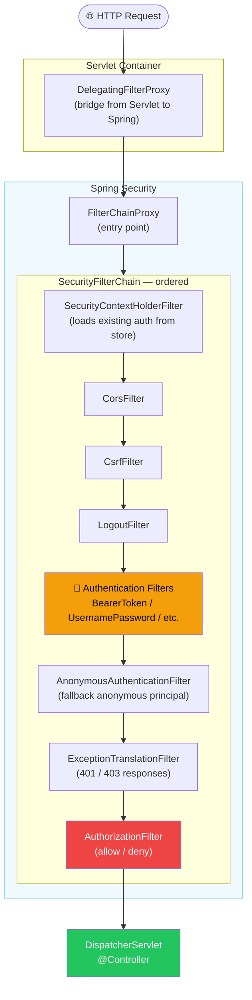
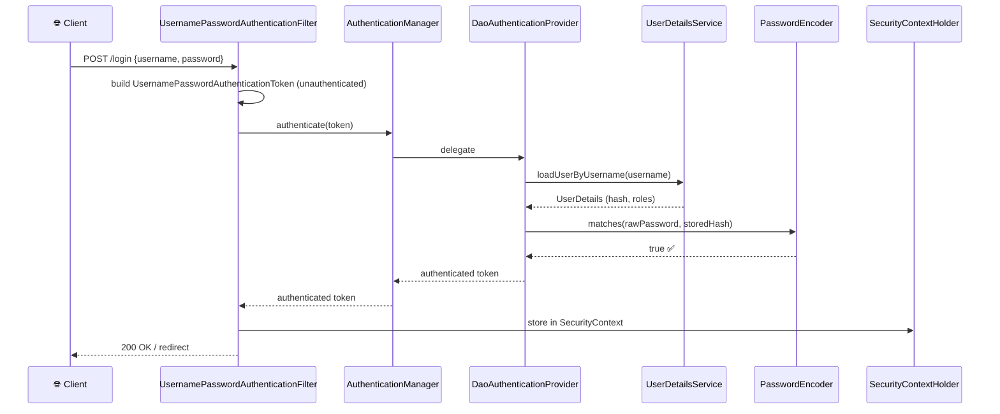

# Spring Security Concepts

> [!info] For the Express/TS dev
> In Express you compose auth from libraries: `passport`, `express-jwt`, `cors`, `helmet`, hand-rolled middleware. Spring Security gives you all of this as one cohesive **filter chain** that the framework wires up. The mental model is: a request enters a chain of `Filter`s, each one can authenticate, authorize, redirect, or short-circuit. Once you accept that "everything is a filter," it clicks.

## Concept / How it works



The two halves of security:

| Concern | What it answers | Where it lives |
| --- | --- | --- |
| **Authentication** | "Who are you?" | Authentication filters → `AuthenticationManager` → `AuthenticationProvider` → `UserDetailsService` |
| **Authorization** | "Are you allowed to do this?" | `AuthorizationFilter` + method security (`@PreAuthorize`) |

## Core types

| Type | Role |
| --- | --- |
| `SecurityFilterChain` | The bean you define to configure the chain (Spring Security 6+) |
| `Authentication` | Object representing the authenticated principal (or attempt) |
| `SecurityContext` | Holds the current `Authentication`; thread-local |
| `SecurityContextHolder.getContext().getAuthentication()` | Retrieve current user anywhere |
| `UserDetails` | Spring's view of a user (username, password, authorities) |
| `UserDetailsService` | `loadUserByUsername(String)` → `UserDetails` |
| `AuthenticationProvider` | Plug in a custom auth mechanism (LDAP, OAuth) |
| `GrantedAuthority` | A role/permission (`"ROLE_ADMIN"`, `"SCOPE_users:read"`) |
| `PasswordEncoder` | Hashes passwords (BCrypt, Argon2) |

## Code example — minimal setup

```xml
<dependency>
    <groupId>org.springframework.boot</groupId>
    <artifactId>spring-boot-starter-security</artifactId>
</dependency>
```

The moment this is on the classpath:
- All endpoints require authentication
- Boot logs a randomly generated password for `user`
- HTTP Basic auth is enabled
- CSRF is on for state-changing methods

```java
@Configuration
@EnableWebSecurity
public class SecurityConfig {

    @Bean
    public SecurityFilterChain filterChain(HttpSecurity http) throws Exception {
        http
            .authorizeHttpRequests(auth -> auth
                .requestMatchers("/api/v1/public/**").permitAll()
                .requestMatchers("/api/v1/admin/**").hasRole("ADMIN")
                .anyRequest().authenticated()
            )
            .httpBasic(Customizer.withDefaults());
        return http.build();
    }

    @Bean
    public PasswordEncoder passwordEncoder() {
        return new BCryptPasswordEncoder();
    }

    @Bean
    public UserDetailsService users() {
        UserDetails admin = User.builder()
                .username("admin")
                .password(passwordEncoder().encode("password"))
                .roles("ADMIN")
                .build();
        return new InMemoryUserDetailsManager(admin);
    }
}
```

## Accessing the current user

### From a controller (preferred)

```java
@GetMapping("/me")
public UserDto me(@AuthenticationPrincipal UserDetails user) {
    return new UserDto(user.getUsername(), user.getAuthorities());
}

// With a custom principal
@GetMapping("/me2")
public AppUser me2(@AuthenticationPrincipal AppUser user) { return user; }
```

### From anywhere

```java
SecurityContext ctx = SecurityContextHolder.getContext();
Authentication auth = ctx.getAuthentication();
String name = auth.getName();
boolean isAdmin = auth.getAuthorities().stream()
        .anyMatch(a -> a.getAuthority().equals("ROLE_ADMIN"));
```

## Authentication flow walkthrough (form login example)



For JWT, the steps differ ([[04-JWT-with-Spring-Security]]) — but the pattern is the same: a filter extracts credentials → AuthenticationManager → fills SecurityContext.

## Express/TS comparison

```ts
// Express + Passport
import passport from 'passport';
import { Strategy } from 'passport-jwt';

passport.use(new Strategy({ secretOrKey, jwtFromRequest }, (payload, done) => {
  done(null, payload);
}));

app.use(passport.initialize());

app.get('/api/me',
  passport.authenticate('jwt', { session: false }),
  requireRole('admin'),
  (req, res) => res.json(req.user));
```

| Express / Passport | Spring Security |
| --- | --- |
| `passport.use(strategy)` | `AuthenticationProvider` / configured `SecurityFilterChain` |
| `passport.authenticate('jwt')` middleware | JWT bearer filter (resource server) |
| `req.user` | `SecurityContextHolder.getContext().getAuthentication()` / `@AuthenticationPrincipal` |
| `req.isAuthenticated()` | `auth.isAuthenticated()` |
| Route-level `requireRole('admin')` | `.hasRole("ADMIN")` matcher / `@PreAuthorize` |
| `cookie-session` / `express-session` | `SecurityContextRepository` (`HttpSession`-backed) |
| Custom strategy | Custom `AuthenticationProvider` |

## Roles vs Authorities vs Scopes

- **Authority** = string. `"ROLE_ADMIN"`, `"users:read"`.
- **Role** = a special authority with the prefix `ROLE_`. `.hasRole("ADMIN")` checks for `ROLE_ADMIN`.
- **Scope** = OAuth2/JWT term. `.hasAuthority("SCOPE_users:read")` for a JWT scope.

```java
.requestMatchers("/admin/**").hasRole("ADMIN")              // ROLE_ADMIN
.requestMatchers("/api/users").hasAuthority("users:read")   // exact match
.requestMatchers("/api/v2").hasAuthority("SCOPE_api:read")  // OAuth scope
```

## Gotchas

> [!warning] `ROLE_` prefix
> `.hasRole("ADMIN")` checks `ROLE_ADMIN`. `.hasAuthority("ADMIN")` checks for the literal `ADMIN`. Easy to mix up.

> [!warning] CSRF on by default for non-GET
> POST/PUT/DELETE require a CSRF token. For stateless APIs (JWT), **disable CSRF** ([[07-CSRF-CORS-Security]]).

> [!warning] Adding the starter changes everything
> The moment `spring-boot-starter-security` is on the classpath, every endpoint becomes 401. Configure `SecurityFilterChain` immediately.

> [!warning] `SecurityContext` is `ThreadLocal`
> An `@Async` method runs on a different thread — context is empty unless you propagate it (`DelegatingSecurityContextExecutor`).

> [!tip] Logging
> ```yaml
> logging.level.org.springframework.security: DEBUG
> ```
> Shows you exactly which filter rejected your request and why.

> [!tip] Don't fight the framework
> If you find yourself overriding `Filter`s manually, you're probably solving a problem Security already solves. Read the reference for the pattern that fits.

## Related

- [[02-Configuration-and-SecurityFilterChain]]
- [[03-Authentication-Methods]]
- [[04-JWT-with-Spring-Security]]
- [[05-Method-Security]]
- [[06-Password-Encoding]]
- [[07-CSRF-CORS-Security]]
- [[07-Filters-Interceptors]]
