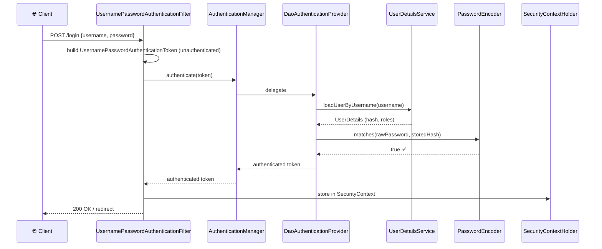

# Spring Security Concepts

> [!info] Express/TS wale dev ke liye
> Express mein tum auth ko alag-alag libraries se compose karte ho — `passport`, `express-jwt`, `cors`, `helmet`, aur kuch hand-rolled middleware. Spring Security tumhe yeh sab ek hi cohesive **filter chain** mein de deta hai jise framework khud wire karta hai. Mental model simple hai: request ek chain of `Filter`s se guzarti hai, aur har filter authenticate, authorize, redirect ya short-circuit kar sakta hai. Ek baar "everything is a filter" wali baat samajh mein aa jaye, sab click ho jayega.

## Concept / Yeh kaam kaise karta hai?


Security ke do hisse hote hain — jaise Zomato app mein pehle tumhara login check hota hai (kaun ho tum), phir yeh check hota hai ki tum restaurant-owner ho ya normal customer (kya kar sakte ho):

| Concern | Yeh kya answer karta hai | Kahan hota hai |
| --- | --- | --- |
| **Authentication** | "Tum ho kaun?" | Authentication filters → `AuthenticationManager` → `AuthenticationProvider` → `UserDetailsService` |
| **Authorization** | "Kya tumhe yeh karne ki permission hai?" | `AuthorizationFilter` + method security (`@PreAuthorize`) |

## Core types

Kyun zaruri hai inhe jaanna? Kyunki jab bhi tum Spring Security ka error dekhoge ya custom auth likhoge, yeh naam baar-baar saamne aayenge. Ek baar samajh liya, poora security module clear ho jayega.

| Type | Role |
| --- | --- |
| `SecurityFilterChain` | Jo bean tum define karte ho chain configure karne ke liye (Spring Security 6+) |
| `Authentication` | Authenticated principal (ya attempt) ko represent karne wala object |
| `SecurityContext` | Current `Authentication` ko hold karta hai; thread-local hota hai |
| `SecurityContextHolder.getContext().getAuthentication()` | Kahin bhi current user retrieve karne ka tareeka |
| `UserDetails` | Spring ka user dekhne ka apna tareeka (username, password, authorities) |
| `UserDetailsService` | `loadUserByUsername(String)` → `UserDetails` |
| `AuthenticationProvider` | Custom auth mechanism plug-in karne ke liye (LDAP, OAuth) |
| `GrantedAuthority` | Ek role/permission (`"ROLE_ADMIN"`, `"SCOPE_users:read"`) |
| `PasswordEncoder` | Passwords ko hash karta hai (BCrypt, Argon2) |

## Code example — minimal setup

```xml
<dependency>
    <groupId>org.springframework.boot</groupId>
    <artifactId>spring-boot-starter-security</artifactId>
</dependency>
```

Bas yeh dependency classpath pe aayi nahi ki turant yeh sab ho jaata hai:
- Saare endpoints ko authentication chahiye ho jaati hai
- Boot startup pe `user` ke liye ek random generated password log karta hai
- HTTP Basic auth enable ho jaata hai
- State-changing methods ke liye CSRF on ho jaata hai

> [!tip] Socho isko ek naya bouncer hire karne jaisa
> Jaise koi naya bouncer club ke gate pe laga do aur usse kuch mat batao — woh by default sabko bahar rok dega, chahe woh regular customer hi kyun na ho. Yehi hota hai jab tum `spring-boot-starter-security` add karte ho — pehle sab kuch lock ho jaata hai, phir tum rules batate ho ki kisko andar aane dena hai.

```java
@Configuration
@EnableWebSecurity
public class SecurityConfig {

    @Bean
    public SecurityFilterChain filterChain(HttpSecurity http) throws Exception {
        http
            .authorizeHttpRequests(auth -> auth
                .requestMatchers("/api/v1/public/**").permitAll()
                .requestMatchers("/api/v1/admin/**").hasRole("ADMIN")
                .anyRequest().authenticated()
            )
            .httpBasic(Customizer.withDefaults());
        return http.build();
    }

    @Bean
    public PasswordEncoder passwordEncoder() {
        return new BCryptPasswordEncoder();
    }

    @Bean
    public UserDetailsService users() {
        UserDetails admin = User.builder()
                .username("admin")
                .password(passwordEncoder().encode("password"))
                .roles("ADMIN")
                .build();
        return new InMemoryUserDetailsManager(admin);
    }
}
```

## Current user ko access kaise karein?

### Controller se (preferred tareeka)

```java
@GetMapping("/me")
public UserDto me(@AuthenticationPrincipal UserDetails user) {
    return new UserDto(user.getUsername(), user.getAuthorities());
}

// With a custom principal
@GetMapping("/me2")
public AppUser me2(@AuthenticationPrincipal AppUser user) { return user; }
```

### Kahin se bhi

```java
SecurityContext ctx = SecurityContextHolder.getContext();
Authentication auth = ctx.getAuthentication();
String name = auth.getName();
boolean isAdmin = auth.getAuthorities().stream()
        .anyMatch(a -> a.getAuthority().equals("ROLE_ADMIN"));
```

## Authentication flow walkthrough (form login example)

Kya hota hai jab koi user login karta hai? Neeche wala sequence diagram poori journey dikhata hai — bilkul jaise jab tum Zomato pe login karte ho toh backend mein username-password verify hota hai, phir session/token bante hai.



JWT ke liye steps thode alag hote hain ([[04-JWT-with-Spring-Security]]) — lekin pattern same rehta hai: ek filter credentials nikaalta hai → AuthenticationManager → SecurityContext fill hota hai.

## Express/TS comparison

```ts
// Express + Passport
import passport from 'passport';
import { Strategy } from 'passport-jwt';

passport.use(new Strategy({ secretOrKey, jwtFromRequest }, (payload, done) => {
  done(null, payload);
}));

app.use(passport.initialize());

app.get('/api/me',
  passport.authenticate('jwt', { session: false }),
  requireRole('admin'),
  (req, res) => res.json(req.user));
```

| Express / Passport | Spring Security |
| --- | --- |
| `passport.use(strategy)` | `AuthenticationProvider` / configured `SecurityFilterChain` |
| `passport.authenticate('jwt')` middleware | JWT bearer filter (resource server) |
| `req.user` | `SecurityContextHolder.getContext().getAuthentication()` / `@AuthenticationPrincipal` |
| `req.isAuthenticated()` | `auth.isAuthenticated()` |
| Route-level `requireRole('admin')` | `.hasRole("ADMIN")` matcher / `@PreAuthorize` |
| `cookie-session` / `express-session` | `SecurityContextRepository` (`HttpSession`-backed) |
| Custom strategy | Custom `AuthenticationProvider` |

## Roles vs Authorities vs Scopes

Yeh teeno terms confuse karte hain shuru mein, toh simple rakhte hain:

- **Authority** = ek string hai. Jaise `"ROLE_ADMIN"`, `"users:read"`.
- **Role** = ek special authority hai jispe `ROLE_` prefix laga hota hai. `.hasRole("ADMIN")` actually mein `ROLE_ADMIN` check karta hai.
- **Scope** = OAuth2/JWT ka term hai. `.hasAuthority("SCOPE_users:read")` se JWT scope check hota hai.

```java
.requestMatchers("/admin/**").hasRole("ADMIN")              // ROLE_ADMIN
.requestMatchers("/api/users").hasAuthority("users:read")   // exact match
.requestMatchers("/api/v2").hasAuthority("SCOPE_api:read")  // OAuth scope
```

## Gotchas

> [!warning] `ROLE_` prefix wala confusion
> `.hasRole("ADMIN")` asal mein `ROLE_ADMIN` check karta hai. Jabki `.hasAuthority("ADMIN")` literal `ADMIN` string check karta hai. Yeh mix-up bahut common hai — dhyaan rakhna.

> [!warning] CSRF by default on hota hai non-GET requests ke liye
> POST/PUT/DELETE ke liye CSRF token chahiye hota hai. Agar tum stateless API (JWT) bana rahe ho, toh **CSRF disable karna zaruri hai** ([[07-CSRF-CORS-Security]]).

> [!warning] Starter add karte hi sab kuch badal jaata hai
> Jaise hi `spring-boot-starter-security` classpath pe aata hai, har endpoint 401 dena shuru kar deta hai. Isliye `SecurityFilterChain` turant configure karo, warna production mein sabko lockout ho jayega.

> [!warning] `SecurityContext` ek `ThreadLocal` hai
> `@Async` method ek alag thread pe chalta hai — waha context empty milega, jab tak tum use explicitly propagate na karo (`DelegatingSecurityContextExecutor`).

> [!tip] Logging on kar lo debugging ke liye
> ```yaml
> logging.level.org.springframework.security: DEBUG
> ```
> Yeh exactly dikhata hai ki kaunse filter ne tumhari request reject ki aur kyun — bahut time bachta hai debugging mein.

> [!tip] Framework se mat lado
> Agar tum khud se `Filter`s override kar rahe ho, toh probably ek aisi problem solve kar rahe ho jo Security already solve kar chuka hai. Reference padho aur usi pattern ko follow karo jo fit baithta hai.

## Related

- [[02-Configuration-and-SecurityFilterChain]]
- [[03-Authentication-Methods]]
- [[04-JWT-with-Spring-Security]]
- [[05-Method-Security]]
- [[06-Password-Encoding]]
- [[07-CSRF-CORS-Security]]
- [[07-Filters-Interceptors]]
