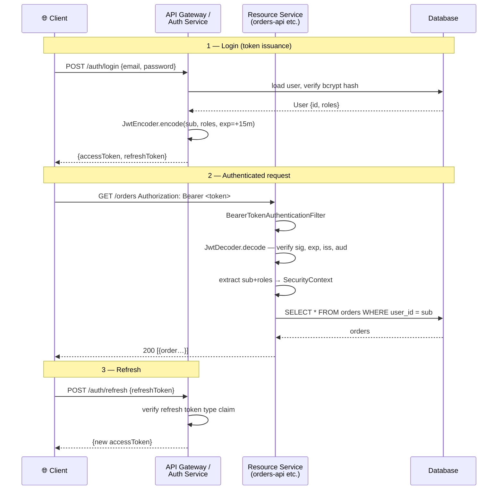

# JWT with Spring Security

> [!info] For the Express/TS dev
> The Node version is `jsonwebtoken` + custom Express middleware that pulls `Authorization`, verifies, and stuffs `req.user`. Spring Security has the **OAuth2 Resource Server** module which does all of this, including JWKS rotation, when your tokens come from an external IdP. For a self-issued JWT setup, you write a small auth controller and either reuse the resource-server filter (recommended) or write a custom filter. Below: both flavors.

## Concept / How it works

A JWT (JSON Web Token) is `header.payload.signature` — base64url-encoded, signed (typically HS256 with shared secret or RS256/ES256 with key pair).

Two distinct concerns:

1. **Issuing** the token — usually only on `/login`. Sign it. Set short expiry.
2. **Validating** every other request — extract from `Authorization: Bearer …`, verify signature + claims (`exp`, `aud`, `iss`).



Spring's `oauth2-resource-server` handles validation. For issuing in a self-contained app, you'll use Nimbus JOSE.

## Self-issued JWT (full example)

`pom.xml`:

```xml
<dependency>
    <groupId>org.springframework.boot</groupId>
    <artifactId>spring-boot-starter-security</artifactId>
</dependency>
<dependency>
    <groupId>org.springframework.boot</groupId>
    <artifactId>spring-boot-starter-oauth2-resource-server</artifactId>
</dependency>
```

`application.yml`:

```yaml
app:
  jwt:
    issuer: acme-api
    audience: acme-clients
    access-token-ttl: 15m
    refresh-token-ttl: 7d
    rsa:
      public-key:  classpath:keys/public.pem
      private-key: classpath:keys/private.pem
```

Generate keys (one-time):

```bash
openssl genrsa -out private.pem 2048
openssl rsa -in private.pem -pubout -out public.pem
```

### Config

```java
@Configuration
@EnableWebSecurity
@EnableMethodSecurity
public class SecurityConfig {

    @Value("classpath:keys/public.pem")  RSAPublicKey publicKey;
    @Value("classpath:keys/private.pem") RSAPrivateKey privateKey;

    @Bean
    public SecurityFilterChain chain(HttpSecurity http) throws Exception {
        return http
            .csrf(c -> c.disable())
            .sessionManagement(s -> s.sessionCreationPolicy(STATELESS))
            .authorizeHttpRequests(a -> a
                .requestMatchers("/api/v1/auth/**").permitAll()
                .anyRequest().authenticated())
            .oauth2ResourceServer(o -> o
                .jwt(jwt -> jwt.jwtAuthenticationConverter(jwtConverter())))
            .exceptionHandling(e -> e
                .authenticationEntryPoint((req, res, ex) -> {
                    res.setStatus(401);
                    res.setContentType("application/json");
                    res.getWriter().write("{\"error\":\"unauthorized\"}");
                }))
            .build();
    }

    @Bean
    public JwtDecoder jwtDecoder() {
        return NimbusJwtDecoder.withPublicKey(publicKey).build();
    }

    @Bean
    public JwtEncoder jwtEncoder() {
        JWK jwk = new RSAKey.Builder(publicKey).privateKey(privateKey).build();
        JWKSource<SecurityContext> source = new ImmutableJWKSet<>(new JWKSet(jwk));
        return new NimbusJwtEncoder(source);
    }

    @Bean
    public PasswordEncoder passwordEncoder() {
        return PasswordEncoderFactories.createDelegatingPasswordEncoder();
    }

    private JwtAuthenticationConverter jwtConverter() {
        JwtGrantedAuthoritiesConverter g = new JwtGrantedAuthoritiesConverter();
        g.setAuthoritiesClaimName("roles");
        g.setAuthorityPrefix("ROLE_");
        JwtAuthenticationConverter conv = new JwtAuthenticationConverter();
        conv.setJwtGrantedAuthoritiesConverter(g);
        return conv;
    }
}
```

### Token service (issuing)

```java
@Service
public class TokenService {

    private final JwtEncoder encoder;
    private final Duration accessTtl  = Duration.ofMinutes(15);
    private final Duration refreshTtl = Duration.ofDays(7);

    public TokenService(JwtEncoder encoder) { this.encoder = encoder; }

    public String issueAccessToken(User user) {
        Instant now = Instant.now();
        JwtClaimsSet claims = JwtClaimsSet.builder()
                .issuer("acme-api")
                .audience(List.of("acme-clients"))
                .subject(user.getId().toString())
                .issuedAt(now)
                .expiresAt(now.plus(accessTtl))
                .id(UUID.randomUUID().toString())
                .claim("roles", user.getRoles().stream()
                        .map(Role::getName).toList())
                .claim("email", user.getEmail())
                .build();
        return encoder.encode(JwtEncoderParameters.from(claims)).getTokenValue();
    }

    public String issueRefreshToken(User user) {
        Instant now = Instant.now();
        JwtClaimsSet claims = JwtClaimsSet.builder()
                .issuer("acme-api")
                .subject(user.getId().toString())
                .issuedAt(now)
                .expiresAt(now.plus(refreshTtl))
                .id(UUID.randomUUID().toString())
                .claim("type", "refresh")
                .build();
        return encoder.encode(JwtEncoderParameters.from(claims)).getTokenValue();
    }
}
```

### Auth controller

```java
@RestController
@RequestMapping("/api/v1/auth")
public class AuthController {

    private final AuthenticationManager authManager;
    private final TokenService tokenService;
    private final UserRepository userRepository;
    private final JwtDecoder jwtDecoder;

    public AuthController(AuthenticationManager am, TokenService ts,
                          UserRepository ur, JwtDecoder jd) {
        this.authManager = am; this.tokenService = ts;
        this.userRepository = ur; this.jwtDecoder = jd;
    }

    public record LoginRequest(@NotBlank String email, @NotBlank String password) {}
    public record TokenResponse(String accessToken, String refreshToken,
                                long expiresIn) {}

    @PostMapping("/login")
    public TokenResponse login(@RequestBody @Valid LoginRequest req) {
        Authentication auth = authManager.authenticate(
            new UsernamePasswordAuthenticationToken(req.email(), req.password()));
        User user = userRepository.findByEmail(auth.getName()).orElseThrow();
        return new TokenResponse(
                tokenService.issueAccessToken(user),
                tokenService.issueRefreshToken(user),
                Duration.ofMinutes(15).toSeconds());
    }

    @PostMapping("/refresh")
    public TokenResponse refresh(@RequestBody Map<String, String> body) {
        String refresh = body.get("refreshToken");
        Jwt jwt;
        try {
            jwt = jwtDecoder.decode(refresh);
        } catch (JwtException e) {
            throw new BadCredentialsException("invalid refresh token");
        }
        if (!"refresh".equals(jwt.getClaim("type"))) {
            throw new BadCredentialsException("not a refresh token");
        }
        User user = userRepository.findById(Long.valueOf(jwt.getSubject())).orElseThrow();
        return new TokenResponse(
                tokenService.issueAccessToken(user),
                tokenService.issueRefreshToken(user),
                Duration.ofMinutes(15).toSeconds());
    }

    @Bean
    public AuthenticationManager authManager(UserDetailsService uds, PasswordEncoder pe) {
        DaoAuthenticationProvider p = new DaoAuthenticationProvider();
        p.setUserDetailsService(uds);
        p.setPasswordEncoder(pe);
        return new ProviderManager(p);
    }
}
```

### Using the principal

```java
@GetMapping("/api/v1/me")
public Map<String, Object> me(@AuthenticationPrincipal Jwt jwt) {
    return Map.of(
        "id", jwt.getSubject(),
        "email", jwt.getClaim("email"),
        "roles", jwt.getClaimAsStringList("roles"));
}
```

## External IdP (preferred for production)

If your tokens come from Keycloak / Auth0 / Cognito, you don't issue anything yourself:

```yaml
spring:
  security:
    oauth2:
      resourceserver:
        jwt:
          issuer-uri: https://auth.example.com/realms/acme
          # OR explicitly:
          jwk-set-uri: https://auth.example.com/realms/acme/protocol/openid-connect/certs
          audiences:
            - acme-api
```

Spring fetches JWKS, caches it, rotates keys automatically. See [[08-OAuth2-Resource-Server]].

## Express/TS comparison

```ts
// jsonwebtoken
import jwt from 'jsonwebtoken';

app.post('/login', async (req, res) => {
  const user = await verifyCredentials(req.body);
  const token = jwt.sign(
    { sub: user.id, roles: user.roles },
    PRIVATE_KEY, { algorithm: 'RS256', expiresIn: '15m', audience: 'acme-clients' });
  res.json({ accessToken: token });
});

const auth = (req, res, next) => {
  const token = req.headers.authorization?.replace('Bearer ', '');
  try {
    req.user = jwt.verify(token, PUBLIC_KEY, { audience: 'acme-clients' });
    next();
  } catch { res.status(401).end(); }
};
```

| jsonwebtoken | Spring Security |
| --- | --- |
| `jwt.sign(...)` | `JwtEncoder.encode(...)` |
| `jwt.verify(...)` | `JwtDecoder.decode(...)` (auto via resource server) |
| Custom middleware | `oauth2ResourceServer().jwt()` filter |
| `req.user` | `@AuthenticationPrincipal Jwt` |
| Manual JWKS fetch | Auto via `issuer-uri` |
| Manual rotation | Auto |

## Gotchas

> [!danger] Don't put secrets in JWTs
> JWTs are SIGNED, not ENCRYPTED. Anyone can base64-decode the payload. Store only non-sensitive claims (id, roles, email).

> [!danger] HS256 with a weak shared secret
> Use RS256/ES256 with a key pair. If you must use HS256, the secret must be at least 256 bits and stored in a vault.

> [!warning] Refresh token storage
> Refresh tokens are bearer tokens too. Store them server-side in a revocation list, or rotate them on every use (and detect re-use as theft).

> [!warning] Long token TTLs
> 24-hour access tokens are too long. Industry norm: 5-15 min access + longer refresh + revocation list.

> [!warning] Missing audience/issuer validation
> Without `aud` validation, a token meant for service-A may be accepted by service-B. Always set `audiences` in the resource-server config.

> [!warning] Token in URL
> Never put a JWT in query strings — they get logged in access logs and proxies. Always `Authorization: Bearer …`.

> [!tip] Rotating keys
> If you control the IdP, expose JWKS with multiple `kid` entries during rotation. Validators pick the matching key.

## Related

- [[01-Spring-Security-Concepts]]
- [[02-Configuration-and-SecurityFilterChain]]
- [[03-Authentication-Methods]]
- [[06-Password-Encoding]]
- [[08-OAuth2-Resource-Server]]
