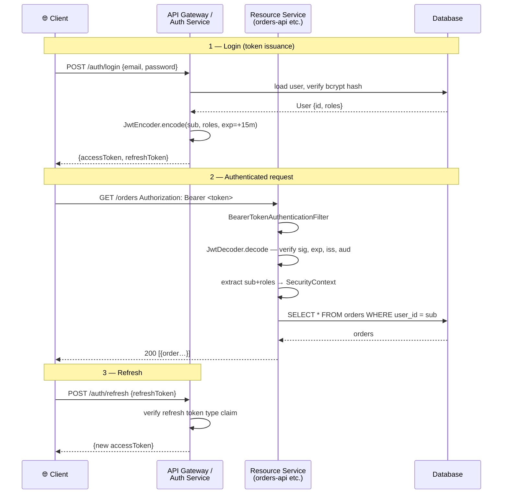

# JWT with Spring Security

> [!info] Express/TS dev ke liye
> Node mein tum `jsonwebtoken` + custom Express middleware use karte ho — jo `Authorization` header uthata hai, verify karta hai, aur `req.user` mein daal deta hai. Spring Security ke paas iske liye poora **OAuth2 Resource Server** module hai jo yeh sab handle karta hai, JWKS rotation samet, jab tumhare tokens kisi external IdP (Identity Provider) se aate hain. Agar tum khud JWT issue kar rahe ho (self-issued), toh ek chhota sa auth controller likhna padega aur resource-server filter reuse karna padega (recommended), ya phir custom filter likhna padega. Neeche dono flavors dekhenge.

## Concept / Yeh kaam kaise karta hai?

Ek JWT (JSON Web Token) hota hai `header.payload.signature` format mein — base64url-encoded, aur signed (usually HS256 shared secret ke saath, ya RS256/ES256 key pair ke saath).

Socho JWT ek **signed parcel slip** jaisa hai jo Zomato delivery boy ke paas hota hai — usme customer ka naam, address, order ID likha hota hai, aur restaurant ki seal lagi hoti hai. Koi bhi usse padh sakta hai (encrypted nahi hai), lekin koi usse tamper nahi kar sakta bina seal todhe — kyunki signature verify ho jayega.

Do alag concerns hain yahan:

1. **Issuing** the token — usually sirf `/login` pe hota hai. Sign karo. Short expiry set karo.
2. **Validating** har doosri request pe — `Authorization: Bearer …` se token nikalo, signature + claims verify karo (`exp`, `aud`, `iss`).



Spring ka `oauth2-resource-server` module validation handle karta hai. Aur agar tum self-contained app mein khud token issue karna chahte ho, toh Nimbus JOSE library use hogi.

## Self-issued JWT (poora example)

Socho tum khud ka mini "auth service" bana rahe ho — jaise Ola apna khud ka login system chalata hai, kisi third-party IdP pe depend nahi karta.

`pom.xml`:

```xml
<dependency>
    <groupId>org.springframework.boot</groupId>
    <artifactId>spring-boot-starter-security</artifactId>
</dependency>
<dependency>
    <groupId>org.springframework.boot</groupId>
    <artifactId>spring-boot-starter-oauth2-resource-server</artifactId>
</dependency>
```

`application.yml`:

```yaml
app:
  jwt:
    issuer: acme-api
    audience: acme-clients
    access-token-ttl: 15m
    refresh-token-ttl: 7d
    rsa:
      public-key:  classpath:keys/public.pem
      private-key: classpath:keys/private.pem
```

Keys generate karo (ek baar ka kaam):

```bash
openssl genrsa -out private.pem 2048
openssl rsa -in private.pem -pubout -out public.pem
```

Yeh RSA key pair hai — `private.pem` se tum token sign karoge (sirf auth service ke paas hoga), aur `public.pem` se koi bhi service verify kar sakti hai ki token genuine hai ya nahi. Private key kabhi kisi ko mat do — yeh bilkul UPI PIN jaisa confidential hai.

### Config

```java
@Configuration
@EnableWebSecurity
@EnableMethodSecurity
public class SecurityConfig {

    @Value("classpath:keys/public.pem")  RSAPublicKey publicKey;
    @Value("classpath:keys/private.pem") RSAPrivateKey privateKey;

    @Bean
    public SecurityFilterChain chain(HttpSecurity http) throws Exception {
        return http
            .csrf(c -> c.disable())
            .sessionManagement(s -> s.sessionCreationPolicy(STATELESS))
            .authorizeHttpRequests(a -> a
                .requestMatchers("/api/v1/auth/**").permitAll()
                .anyRequest().authenticated())
            .oauth2ResourceServer(o -> o
                .jwt(jwt -> jwt.jwtAuthenticationConverter(jwtConverter())))
            .exceptionHandling(e -> e
                .authenticationEntryPoint((req, res, ex) -> {
                    res.setStatus(401);
                    res.setContentType("application/json");
                    res.getWriter().write("{\"error\":\"unauthorized\"}");
                }))
            .build();
    }

    @Bean
    public JwtDecoder jwtDecoder() {
        return NimbusJwtDecoder.withPublicKey(publicKey).build();
    }

    @Bean
    public JwtEncoder jwtEncoder() {
        JWK jwk = new RSAKey.Builder(publicKey).privateKey(privateKey).build();
        JWKSource<SecurityContext> source = new ImmutableJWKSet<>(new JWKSet(jwk));
        return new NimbusJwtEncoder(source);
    }

    @Bean
    public PasswordEncoder passwordEncoder() {
        return PasswordEncoderFactories.createDelegatingPasswordEncoder();
    }

    private JwtAuthenticationConverter jwtConverter() {
        JwtGrantedAuthoritiesConverter g = new JwtGrantedAuthoritiesConverter();
        g.setAuthoritiesClaimName("roles");
        g.setAuthorityPrefix("ROLE_");
        JwtAuthenticationConverter conv = new JwtAuthenticationConverter();
        conv.setJwtGrantedAuthoritiesConverter(g);
        return conv;
    }
}
```

Yahan important cheez: `sessionCreationPolicy(STATELESS)` — matlab Spring session banayega hi nahi. Har request apna proof (JWT) khud lekar aati hai, bilkul jaise har Swiggy order apna khud ka OTP leke aata hai delivery verify karne ke liye — server ko yaad rakhne ki zarurat nahi.

### Token service (issuing)

Kya hota hai yahan? Yeh service actual JWT banata hai — user ka data leke, claims set karke, aur private key se sign karke.

```java
@Service
public class TokenService {

    private final JwtEncoder encoder;
    private final Duration accessTtl  = Duration.ofMinutes(15);
    private final Duration refreshTtl = Duration.ofDays(7);

    public TokenService(JwtEncoder encoder) { this.encoder = encoder; }

    public String issueAccessToken(User user) {
        Instant now = Instant.now();
        JwtClaimsSet claims = JwtClaimsSet.builder()
                .issuer("acme-api")
                .audience(List.of("acme-clients"))
                .subject(user.getId().toString())
                .issuedAt(now)
                .expiresAt(now.plus(accessTtl))
                .id(UUID.randomUUID().toString())
                .claim("roles", user.getRoles().stream()
                        .map(Role::getName).toList())
                .claim("email", user.getEmail())
                .build();
        return encoder.encode(JwtEncoderParameters.from(claims)).getTokenValue();
    }

    public String issueRefreshToken(User user) {
        Instant now = Instant.now();
        JwtClaimsSet claims = JwtClaimsSet.builder()
                .issuer("acme-api")
                .subject(user.getId().toString())
                .issuedAt(now)
                .expiresAt(now.plus(refreshTtl))
                .id(UUID.randomUUID().toString())
                .claim("type", "refresh")
                .build();
        return encoder.encode(JwtEncoderParameters.from(claims)).getTokenValue();
    }
}
```

Access token chhota-sa live rehta hai (15 min) — jaise CRED ka OTP jaldi expire ho jata hai. Refresh token lambi zindagi jeeta hai (7 din) — sirf naya access token maangne ke kaam aata hai, isiliye isme `"type": "refresh"` claim daal ke isse access token se alag pehchana jaata hai.

### Auth controller

```java
@RestController
@RequestMapping("/api/v1/auth")
public class AuthController {

    private final AuthenticationManager authManager;
    private final TokenService tokenService;
    private final UserRepository userRepository;
    private final JwtDecoder jwtDecoder;

    public AuthController(AuthenticationManager am, TokenService ts,
                          UserRepository ur, JwtDecoder jd) {
        this.authManager = am; this.tokenService = ts;
        this.userRepository = ur; this.jwtDecoder = jd;
    }

    public record LoginRequest(@NotBlank String email, @NotBlank String password) {}
    public record TokenResponse(String accessToken, String refreshToken,
                                long expiresIn) {}

    @PostMapping("/login")
    public TokenResponse login(@RequestBody @Valid LoginRequest req) {
        Authentication auth = authManager.authenticate(
            new UsernamePasswordAuthenticationToken(req.email(), req.password()));
        User user = userRepository.findByEmail(auth.getName()).orElseThrow();
        return new TokenResponse(
                tokenService.issueAccessToken(user),
                tokenService.issueRefreshToken(user),
                Duration.ofMinutes(15).toSeconds());
    }

    @PostMapping("/refresh")
    public TokenResponse refresh(@RequestBody Map<String, String> body) {
        String refresh = body.get("refreshToken");
        Jwt jwt;
        try {
            jwt = jwtDecoder.decode(refresh);
        } catch (JwtException e) {
            throw new BadCredentialsException("invalid refresh token");
        }
        if (!"refresh".equals(jwt.getClaim("type"))) {
            throw new BadCredentialsException("not a refresh token");
        }
        User user = userRepository.findById(Long.valueOf(jwt.getSubject())).orElseThrow();
        return new TokenResponse(
                tokenService.issueAccessToken(user),
                tokenService.issueRefreshToken(user),
                Duration.ofMinutes(15).toSeconds());
    }

    @Bean
    public AuthenticationManager authManager(UserDetailsService uds, PasswordEncoder pe) {
        DaoAuthenticationProvider p = new DaoAuthenticationProvider();
        p.setUserDetailsService(uds);
        p.setPasswordEncoder(pe);
        return new ProviderManager(p);
    }
}
```

`/login` pe credentials verify hote hain (email + password), aur success pe dono tokens (access + refresh) return hote hain — bilkul jaise Ola app login karte hi tumhe session token deta hai taaki har baar password na daalna pade. `/refresh` endpoint refresh token check karta hai — agar valid hai aur type "refresh" hai, toh naya pair de deta hai.

> [!warning] Yahan ek gotcha hai
> Refresh endpoint mein refresh token ko revoke ya rotate nahi kiya gaya — production mein tumhe har refresh pe purana refresh token invalidate karna chahiye (rotation), warna agar woh token leak ho jaye toh attacker forever naye access tokens banata rahega.

### Principal use karna

Ek baar JWT valid ho jaye, uska data seedha controller method mein inject ho jata hai — bilkul `req.user` jaisa Express mein.

```java
@GetMapping("/api/v1/me")
public Map<String, Object> me(@AuthenticationPrincipal Jwt jwt) {
    return Map.of(
        "id", jwt.getSubject(),
        "email", jwt.getClaim("email"),
        "roles", jwt.getClaimAsStringList("roles"));
}
```

## External IdP (production ke liye preferred)

Kyun zaruri hai yeh approach? Kyunki khud auth system banana aur secure rakhna (password hashing, rate limiting, breach detection, MFA) bahut zyada kaam hai. Isliye real-world companies apna login Keycloak, Auth0, ya AWS Cognito jaise IdP ko de dete hain — bilkul jaise chhoti startups apna payment Razorpay/Stripe ko outsource kar deti hain, khud payment gateway nahi banati.

Agar tumhare tokens Keycloak / Auth0 / Cognito se aa rahe hain, toh tumhe khud kuch issue nahi karna:

```yaml
spring:
  security:
    oauth2:
      resourceserver:
        jwt:
          issuer-uri: https://auth.example.com/realms/acme
          # OR explicitly:
          jwk-set-uri: https://auth.example.com/realms/acme/protocol/openid-connect/certs
          audiences:
            - acme-api
```

Bas itna config likho aur Spring khud JWKS (public keys ka set) fetch karega, cache karega, aur key rotation automatically handle karega. Dekho [[08-OAuth2-Resource-Server]].

## Express/TS comparison

```ts
// jsonwebtoken
import jwt from 'jsonwebtoken';

app.post('/login', async (req, res) => {
  const user = await verifyCredentials(req.body);
  const token = jwt.sign(
    { sub: user.id, roles: user.roles },
    PRIVATE_KEY, { algorithm: 'RS256', expiresIn: '15m', audience: 'acme-clients' });
  res.json({ accessToken: token });
});

const auth = (req, res, next) => {
  const token = req.headers.authorization?.replace('Bearer ', '');
  try {
    req.user = jwt.verify(token, PUBLIC_KEY, { audience: 'acme-clients' });
    next();
  } catch { res.status(401).end(); }
};
```

| jsonwebtoken | Spring Security |
| --- | --- |
| `jwt.sign(...)` | `JwtEncoder.encode(...)` |
| `jwt.verify(...)` | `JwtDecoder.decode(...)` (auto via resource server) |
| Custom middleware | `oauth2ResourceServer().jwt()` filter |
| `req.user` | `@AuthenticationPrincipal Jwt` |
| Manual JWKS fetch | Auto via `issuer-uri` |
| Manual rotation | Auto |

Basically Node mein tum sab kuch manually likhte ho — sign, verify, middleware sab custom code. Spring mein zyada cheezein "convention over configuration" hain: bas YAML mein `issuer-uri` daal do, baaki framework sambhal leta hai.

## Gotchas

> [!danger] JWT mein secrets mat daalo
> JWTs SIGNED hote hain, ENCRYPTED nahi. Koi bhi payload ko base64-decode karke padh sakta hai — jaise ek khula postcard, seal lagi hai par content sabko dikh raha hai. Isliye sirf non-sensitive claims rakho (id, roles, email) — kabhi bhi password, card number, ya OTP jaisa data JWT mein mat daalo.

> [!danger] HS256 with a weak shared secret
> RS256/ES256 use karo key pair ke saath. Agar HS256 hi use karna majboori hai, toh secret kam se kam 256 bits ka ho aur vault mein secure store ho — "mySecretKey123" jaisa weak secret Paytm ke password jaisa hai jo koi bhi guess kar le.

> [!warning] Refresh token storage
> Refresh tokens bhi bearer tokens hi hain — jiske paas hai, uska hi hai. Inhe server-side revocation list mein store karo, ya har use pe rotate karo (naya refresh token do, purana invalidate karo) aur re-use detect karo as theft signal.

> [!warning] Long token TTLs
> 24-hour access tokens bahut lambe hain. Industry norm hai: 5-15 min access token + longer refresh token + revocation list. Socho agar tumhara Swiggy session token 24 ghante tak valid rahe aur phone chori ho jaye — bahut zyada exposure window hai.

> [!warning] Missing audience/issuer validation
> Bina `aud` validation ke, service-A ke liye bana token service-B bhi accept kar sakti hai — jaise ek building ka access card doosri building ke gate pe bhi chal jaye. Hamesha `audiences` set karo resource-server config mein.

> [!warning] Token in URL
> JWT ko kabhi query string mein mat daalo — yeh access logs aur proxies mein log ho jata hai, jaise tumne apna password billboard pe likh diya ho. Hamesha `Authorization: Bearer …` header use karo.

> [!tip] Keys rotate karna
> Agar tum khud IdP control karte ho, toh JWKS mein multiple `kid` (key ID) entries expose karo rotation ke dauran. Validators automatically matching key pick kar lenge — purane tokens tab tak valid rahenge jab tak unki expiry na ho jaye.

## Related

- [[01-Spring-Security-Concepts]]
- [[02-Configuration-and-SecurityFilterChain]]
- [[03-Authentication-Methods]]
- [[06-Password-Encoding]]
- [[08-OAuth2-Resource-Server]]
