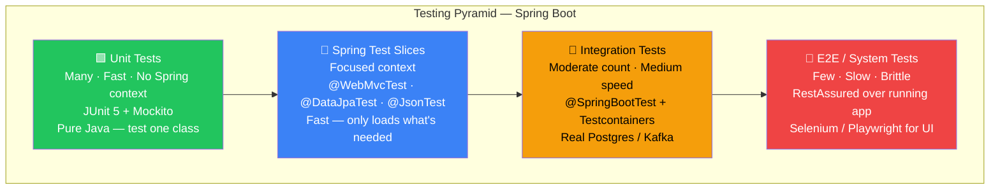

# Testing Pyramid and Tools

> [!info] Express/TS wale dev ke liye
> Node mein tum seedha `jest` (ya `vitest`) + `supertest` + shayad `testcontainers-node` utha lete ho aur kaam chal jaata hai. Spring ki duniya mein canonical stack thoda bada hai — **JUnit 5** (test runner) + **Mockito** (mocks) + **AssertJ** (fluent assertions) + **Spring Boot Test** (context loading) + **Testcontainers** (real DB/broker). Ghabrao mat — Spring Boot yeh sab ek hi jagah bundle karke deta hai `spring-boot-starter-test` mein. Ek dependency add karo, poora toolbox mil jaata hai.

## Concept — Testing Pyramid kya hai?

Socho tum Zomato ke backend pe kaam kar rahe ho. Tumhe kaise pata chalega ki tumhara code sahi kaam kar raha hai bina production mein customer ka order galat restaurant pe bheje? Yahi kaam tests karte hain — lekin sab tests ek jaisे nahi hote. Kuch fast aur focused hote hain (ek function test karo), kuch slow aur broad (poora system test karo). Isi hierarchy ko "Testing Pyramid" kehte hain.



```mermaid
flowchart LR
    subgraph tools["Tool → Use case mapping"]
        direction TB
        J5["JUnit 5 (Jupiter)\n@Test @BeforeEach @ParameterizedTest\nTest runner — always used"]
        MK["Mockito\n@Mock @InjectMocks\nwhen().thenReturn()\nMock collaborators"]
        AJ["AssertJ\nassertThat(x).isEqualTo()\nFluent — replaces JUnit assertions"]
        TC["Testcontainers\n@Testcontainers @Container\nReal Postgres/Redis/Kafka in Docker"]
        MVC["MockMvc / WebTestClient\nperform(get(\"/api/...\"))\nHTTP-level testing without a server"]
        WM["WireMock\nstubFor(get(\"/external\"))\nMock external HTTP APIs"]
        SBT["@SpringBootTest\nFull context integration tests\nUse sparingly — slow"]
    end
```

Purana text-wala pyramid, jo har jagah dikhta hai:

```
       /\
      /E2E\         few, slow, brittle (Selenium, Playwright, RestAssured)
     /------\
    /  Integ  \     moderate (@SpringBootTest with Testcontainers)
   /------------\
  /     Unit     \  many, fast (plain JUnit + Mockito, no Spring context)
 /----------------\
```

Neeche wale layer mein sabse zyada tests hone chahiye (fast, cheap), upar jaate jaate tests kam hone chahiye (slow, expensive, brittle). Yeh Zomato ke delivery model jaisa hi hai — local kirana store (unit test) se saaman uthana fast hai, warehouse (integration test) se thoda slow, aur cross-city truck delivery (E2E) sabse slow aur sabse zyada cheezein galat ho sakti hain rasty mein.

Spring Boot mein ek extra layer hai jo Node mein exist hi nahi karta — **slice tests**. Yeh beech ka tier hai jo poora Spring context load nahi karta, sirf zaruri hissa (`@WebMvcTest`, `@DataJpaTest`, `@JsonTest`). Yeh full `@SpringBootTest` se fast hain lekin pure unit test se zyada realistic — kyunki asli Spring wiring, validation, JSON serialization waghera actually chalta hai, bas puri application context nahi uthti.

### Standard toolbox — kaunsa tool kis kaam ka?

| Tool | Kya karta hai | Node analog |
|------|--------------|-------------|
| **JUnit 5** (Jupiter) | Test runner, lifecycle, assertions | `jest` / `vitest` |
| **Mockito** | Mocking framework | `jest.fn()`, `vi.mock()` |
| **AssertJ** | Fluent assertions | `expect(x).toEqual(...)` |
| **Hamcrest** | Matchers (purana style) | `chai` |
| **Spring Boot Test** | Tests ke liye `ApplicationContext` load karta hai | (direct equivalent nahi) |
| **MockMvc** | Controllers test karo bina HTTP server ke | `supertest` |
| **WebTestClient** | Reactive HTTP client tests ke liye | `supertest` (async) |
| **Testcontainers** | Tests ke liye Docker mein real services | `testcontainers-node` |
| **WireMock** | HTTP service stubbing | `nock`, `msw` |
| **RestAssured** | E2E HTTP DSL | poori app ke against `supertest` |
| **Awaitility** | Async / eventual assertions | Testing Library ka `waitFor` |

## Code example — sab kuch ek jagah

**Kyun zaruri hai?** Har tool alag kaam karta hai — koi runner hai, koi mocking, koi assertions. Inhe milake dekhna zaruri hai taaki pata chale ki asal test file mein sab kaise fit hote hain.

`spring-boot-starter-test` sab kuch le aata hai Testcontainers chhodkar — woh alag se add karna padta hai:

```xml
<dependency>
    <groupId>org.springframework.boot</groupId>
    <artifactId>spring-boot-starter-test</artifactId>
    <scope>test</scope>
</dependency>
<dependency>
    <groupId>org.testcontainers</groupId>
    <artifactId>junit-jupiter</artifactId>
    <scope>test</scope>
</dependency>
<dependency>
    <groupId>org.testcontainers</groupId>
    <artifactId>postgresql</artifactId>
    <scope>test</scope>
</dependency>
```

Gradle mein wahi cheez:

```groovy
testImplementation 'org.springframework.boot:spring-boot-starter-test'
testImplementation 'org.testcontainers:junit-jupiter'
testImplementation 'org.testcontainers:postgresql'
```

Ek chhota sa test jisme chaaron players ek saath dikhte hain — JUnit runner chalata hai, Mockito fake gateway banata hai, AssertJ result check karta hai:

```java
import org.junit.jupiter.api.*;
import static org.mockito.Mockito.*;
import static org.assertj.core.api.Assertions.*;

class OrderServiceTest {

    private PaymentGateway gateway;
    private OrderService service;

    @BeforeEach
    void setup() {
        gateway = mock(PaymentGateway.class);     // Mockito — fake payment gateway
        service = new OrderService(gateway);
    }

    @Test
    void placesOrder_chargesCustomer() {
        when(gateway.charge(100)).thenReturn("txn-1"); // stub — jab charge(100) call ho, "txn-1" return karo

        var order = service.place(new Cart(100));

        assertThat(order.txnId()).isEqualTo("txn-1");  // AssertJ — fluent assertion
        verify(gateway).charge(100);                    // Mockito verify — pakka call hua tha?
    }
}
```

Socho isko ek real scenario mein — `OrderService` UPI se paisa katne ke liye ek `PaymentGateway` use karta hai. Tum yeh test karte waqt asli Razorpay/UPI ko call nahi karna chahte — dhīmā bhi hoga aur paise bhi kat jaayenge. Isliye Mockito se ek fake `gateway` bana diya, usse bol diya "jab 100 rupaye ka charge aaye, 'txn-1' bol dena", aur phir check kiya ki `OrderService` ne sahi se use call kiya ya nahi.

## Express/Node comparison

| Spring world | Node world |
|--------------|------------|
| `spring-boot-starter-test` | `jest` + `supertest` + `@types/jest` |
| `JUnit 5 @Test` | `it()` / `test()` |
| `@BeforeEach` / `@AfterEach` | `beforeEach()` / `afterEach()` |
| `Mockito.mock()` | `jest.fn()` / `vi.fn()` |
| `AssertJ` chains | `expect().toEqual()` chains |
| `MockMvc` | `supertest(app).get('/x')` |
| `Testcontainers` | `testcontainers-node` |
| `@SpringBootTest` | asli `app.listen` test mein start karna |
| Slice tests | (direct equivalent nahi — Node tests aam taur pe ya sab mock karte hain, ya poori app load karte hain) |
| `RestAssured` | deployed URL ke against `supertest` |

Cultural difference samjho — Node tests **ya to** pure unit hote hain (sab kuch mock karo) **ya** poori app boot karte hain, beech ka koi standard raasta nahi. Spring ke slice tests tumhe ek tested middle ground dete hain, kyunki framework ko pata hai apna aadha context kaise banaya jaaye — jaise Swiggy sirf "restaurant listing" module test karna chahe bina poore order-and-delivery system ko chalaye.

## Gotchas — jahan log phasate hain

> [!warning] Har jagah `@SpringBootTest` mat lagao
> Poora context boot karna slow hai (1-5 second per class). Pehle slice tests ya plain JUnit + Mockito try karo. Agar tumhare 80% tests Spring boot karte hain, tumhari poori suite rengne lagegi — CI pipeline coffee break le lega.

> [!warning] Hamcrest vs AssertJ
> Purane Spring docs Hamcrest use karte hain (`assertThat(x, is(5))`). Modern code AssertJ use karta hai (`assertThat(x).isEqualTo(5)`). Dono ka `assertThat` naam same hai — ek file mein ek hi import rakho, warna conflict ho jaayega aur compiler confuse ho jaayega ki kaunsa `assertThat` chahiye.

> [!tip] Context ko reuse karo
> Spring `ApplicationContext` ko cache karta hai same JVM run ke tests ke beech. Lekin agar har test class mein thode-thode alag `@MockBean` ya `@TestPropertySource` hain, toh cache invalidate ho jaata hai aur har class ke liye context reboot hota hai — yeh "death by a thousand reboots" hai. Jaise Ola driver har trip pe naya car register kare instead of reuse karne ke — waste of time.

## Key Takeaways

- Testing pyramid: neeche unit tests (many, fast), beech mein slice tests (Spring-specific middle ground), upar integration/E2E tests (few, slow).
- Standard Spring stack = JUnit 5 (runner) + Mockito (mocks) + AssertJ (assertions) + Spring Boot Test (context) + Testcontainers (real infra) — sab `spring-boot-starter-test` mein bundled, Testcontainers alag add karna hota hai.
- Slice tests (`@WebMvcTest`, `@DataJpaTest`, `@JsonTest`) Node ki duniya mein exist hi nahi karte — Spring ka unique advantage hai kyunki framework ko pata hai apna aadha context kaise wire karna hai.
- `@SpringBootTest` powerful hai lekin slow — sparingly use karo, warna suite crawl karega.
- Hamcrest aur AssertJ dono `assertThat` provide karte hain — ek hi import rakhna, mix mat karna.
- Context caching ka fayda uthao — inconsistent `@MockBean`/`@TestPropertySource` cache invalidate karke suite ko slow kar dete hain.

## Related
- [[02-JUnit-5-Basics]]
- [[03-Mockito]]
- [[04-Spring-Boot-Test]]
- [[05-MockMvc-and-WebTestClient]]
- [[06-Testcontainers]]
- [[07-Integration-Testing]]
- [[08-Test-Profiles-and-Properties]]
