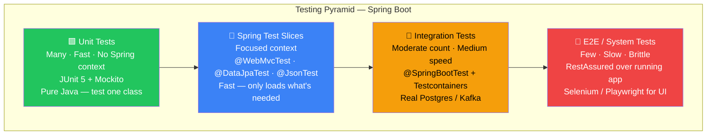

# Testing Pyramid and Tools

> [!info] For the Express/TS dev
> In Node you reach for `jest` (or `vitest`) + `supertest` + maybe `testcontainers-node` and call it a day. In Spring the canonical stack is **JUnit 5** (test runner) + **Mockito** (mocks) + **AssertJ** (fluent assertions) + **Spring Boot Test** (context loading) + **Testcontainers** (real DBs/brokers). Spring Boot bundles all of this in `spring-boot-starter-test`.

## Concept

The classic pyramid:



```mermaid
flowchart LR
    subgraph tools["Tool → Use case mapping"]
        direction TB
        J5["JUnit 5 (Jupiter)\n@Test @BeforeEach @ParameterizedTest\nTest runner — always used"]
        MK["Mockito\n@Mock @InjectMocks\nwhen().thenReturn()\nMock collaborators"]
        AJ["AssertJ\nassertThat(x).isEqualTo()\nFluent — replaces JUnit assertions"]
        TC["Testcontainers\n@Testcontainers @Container\nReal Postgres/Redis/Kafka in Docker"]
        MVC["MockMvc / WebTestClient\nperform(get(\"/api/...\"))\nHTTP-level testing without a server"]
        WM["WireMock\nstubFor(get(\"/external\"))\nMock external HTTP APIs"]
        SBT["@SpringBootTest\nFull context integration tests\nUse sparingly — slow"]
    end
```

Old pyramid text:

```
       /\
      /E2E\         few, slow, brittle (Selenium, Playwright, RestAssured)
     /------\
    /  Integ  \     moderate (@SpringBootTest with Testcontainers)
   /------------\
  /     Unit     \  many, fast (plain JUnit + Mockito, no Spring context)
 /----------------\
```

In Spring Boot specifically you also have **slice tests** — a middle tier that loads only part of the context (`@WebMvcTest`, `@DataJpaTest`, `@JsonTest`). These are faster than full `@SpringBootTest` but more realistic than pure unit tests.

### The standard toolbox

| Tool | What it does | Node analog |
|------|--------------|-------------|
| **JUnit 5** (Jupiter) | Test runner, lifecycle, assertions | `jest` / `vitest` |
| **Mockito** | Mocking framework | `jest.fn()`, `vi.mock()` |
| **AssertJ** | Fluent assertions | `expect(x).toEqual(...)` |
| **Hamcrest** | Matchers (older style) | `chai` |
| **Spring Boot Test** | Loads `ApplicationContext` for tests | (no direct equivalent) |
| **MockMvc** | Tests controllers without HTTP server | `supertest` |
| **WebTestClient** | Reactive HTTP client for tests | `supertest` (async) |
| **Testcontainers** | Real services in Docker for tests | `testcontainers-node` |
| **WireMock** | HTTP service stubbing | `nock`, `msw` |
| **RestAssured** | E2E HTTP DSL | `supertest` for full apps |
| **Awaitility** | Async/eventual assertions | `waitFor` from Testing Library |

## Code example

The starter brings everything except Testcontainers:

```xml
<dependency>
    <groupId>org.springframework.boot</groupId>
    <artifactId>spring-boot-starter-test</artifactId>
    <scope>test</scope>
</dependency>
<dependency>
    <groupId>org.testcontainers</groupId>
    <artifactId>junit-jupiter</artifactId>
    <scope>test</scope>
</dependency>
<dependency>
    <groupId>org.testcontainers</groupId>
    <artifactId>postgresql</artifactId>
    <scope>test</scope>
</dependency>
```

Gradle equivalent:

```groovy
testImplementation 'org.springframework.boot:spring-boot-starter-test'
testImplementation 'org.testcontainers:junit-jupiter'
testImplementation 'org.testcontainers:postgresql'
```

A trivial test showing all four players:

```java
import org.junit.jupiter.api.*;
import static org.mockito.Mockito.*;
import static org.assertj.core.api.Assertions.*;

class OrderServiceTest {

    private PaymentGateway gateway;
    private OrderService service;

    @BeforeEach
    void setup() {
        gateway = mock(PaymentGateway.class);     // Mockito
        service = new OrderService(gateway);
    }

    @Test
    void placesOrder_chargesCustomer() {
        when(gateway.charge(100)).thenReturn("txn-1"); // stub

        var order = service.place(new Cart(100));

        assertThat(order.txnId()).isEqualTo("txn-1");  // AssertJ
        verify(gateway).charge(100);                    // Mockito verify
    }
}
```

## Express/Node comparison

| Spring world | Node world |
|--------------|------------|
| `spring-boot-starter-test` | `jest` + `supertest` + `@types/jest` |
| `JUnit 5 @Test` | `it()` / `test()` |
| `@BeforeEach` / `@AfterEach` | `beforeEach()` / `afterEach()` |
| `Mockito.mock()` | `jest.fn()` / `vi.fn()` |
| `AssertJ` chains | `expect().toEqual()` chains |
| `MockMvc` | `supertest(app).get('/x')` |
| `Testcontainers` | `testcontainers-node` |
| `@SpringBootTest` | starting the actual `app.listen` in tests |
| Slice tests | (no direct equivalent — Node tests usually mock everything or load the whole app) |
| `RestAssured` | `supertest` against a deployed URL |

The cultural difference: Node tests are usually **either** pure unit (mock everything) **or** full app boot. Spring's slice tests give you a tested middle ground because the framework knows how to compose itself partially.

## Gotchas

> [!warning] Don't `@SpringBootTest` everything
> Booting the full context is slow (1-5s per class). Reach for slice tests or plain JUnit + Mockito first. If 80% of your tests boot Spring, your suite will crawl.

> [!warning] Hamcrest vs AssertJ
> Old Spring docs use Hamcrest (`assertThat(x, is(5))`). Modern code uses AssertJ (`assertThat(x).isEqualTo(5)`). They both define `assertThat` — pick one import per file or you'll get conflicts.

> [!tip] Reuse the context
> Spring caches the `ApplicationContext` between tests in the same JVM run. If every test class has slightly different `@MockBean`s or `@TestPropertySource`, the cache invalidates and your suite restarts the context for each — death by a thousand reboots.

## Related
- [[02-JUnit-5-Basics]]
- [[03-Mockito]]
- [[04-Spring-Boot-Test]]
- [[05-MockMvc-and-WebTestClient]]
- [[06-Testcontainers]]
- [[07-Integration-Testing]]
- [[08-Test-Profiles-and-Properties]]
