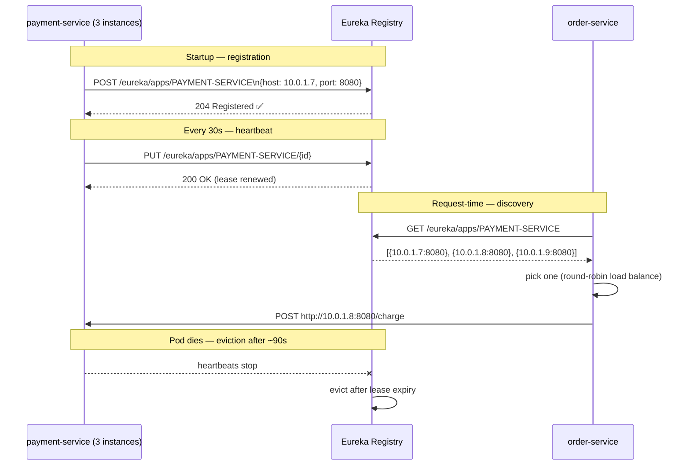

# Service Discovery with Eureka

> [!info] For the Express/TS dev
> Eureka is Netflix's service registry — services register themselves on startup ("hi, I'm `order-service`, here are my IPs"), and clients ask Eureka where they live. It's Consul without the KV store. On Kubernetes you usually skip Eureka entirely; kube-DNS does discovery for free. But Eureka is still common in non-K8s deployments.

## Concept

In a microservice system, "where is `payment-service`?" is a non-trivial question. Instances come and go (autoscaling, deploys, crashes). A **service registry** is the source of truth.

Two flavors of discovery:

- **Server-side** — clients call a stable URL (load balancer); the LB knows where instances live. e.g. AWS ALB, Kubernetes Service.
- **Client-side** — clients ask the registry, get a list of instances, pick one, call it directly. Eureka, Consul.

Eureka is client-side. The flow:



## Code example

### Eureka Server

```xml
<dependency>
    <groupId>org.springframework.cloud</groupId>
    <artifactId>spring-cloud-starter-netflix-eureka-server</artifactId>
</dependency>
```

```java
@SpringBootApplication
@EnableEurekaServer
public class EurekaServerApp {
    public static void main(String[] args) {
        SpringApplication.run(EurekaServerApp.class, args);
    }
}
```

```yaml
# application.yml
server:
  port: 8761

spring:
  application:
    name: eureka-server

eureka:
  client:
    register-with-eureka: false   # the server itself doesn't register
    fetch-registry: false
  server:
    enable-self-preservation: false  # disable in dev; enable in prod
```

Visit `http://localhost:8761` — there's a built-in dashboard listing registered services.

### Eureka Client (any service)

```xml
<dependency>
    <groupId>org.springframework.cloud</groupId>
    <artifactId>spring-cloud-starter-netflix-eureka-client</artifactId>
</dependency>
```

```yaml
spring:
  application:
    name: payment-service        # this is the registry name

server:
  port: 0                        # random port — let Eureka know the actual port

eureka:
  client:
    service-url:
      defaultZone: http://localhost:8761/eureka/
  instance:
    prefer-ip-address: true
    instance-id: ${spring.application.name}:${random.value}
```

```java
@SpringBootApplication
public class PaymentServiceApp {
    public static void main(String[] args) {
        SpringApplication.run(PaymentServiceApp.class, args);
    }
}
```

That's it — just having the starter on the classpath registers the service.

### Calling another service via discovery

Three ways:

**1. `DiscoveryClient` (low-level)**

```java
@RestController
class OrderController {
    private final DiscoveryClient discovery;
    private final RestClient http = RestClient.create();

    OrderController(DiscoveryClient d) { this.discovery = d; }

    @PostMapping("/api/orders")
    Order create(@RequestBody Cart cart) {
        var instances = discovery.getInstances("payment-service");
        var instance = instances.get(new Random().nextInt(instances.size()));
        var url = instance.getUri() + "/charge";

        var txn = http.post().uri(url).body(cart).retrieve().body(String.class);
        return new Order(cart, txn);
    }
}
```

**2. Load-balanced `RestClient` / `WebClient`** — the typical way

```java
@Configuration
class ClientConfig {
    @Bean
    @LoadBalanced
    RestClient.Builder restClientBuilder() {
        return RestClient.builder();
    }
}

@Service
class PaymentClient {
    private final RestClient client;

    PaymentClient(@LoadBalanced RestClient.Builder builder) {
        // base URL uses the SERVICE NAME, not a real host
        this.client = builder.baseUrl("http://payment-service").build();
    }

    String charge(int amount) {
        return client.post().uri("/charge")
            .body(Map.of("amount", amount))
            .retrieve()
            .body(String.class);
    }
}
```

The magic: `http://payment-service` is **not** a real DNS name. The load-balanced interceptor resolves it via Eureka and picks an instance.

**3. OpenFeign** — see [[07-OpenFeign]]. Cleanest.

### Multi-zone Eureka

For HA you run multiple Eureka servers that peer with each other:

```yaml
# eureka-1
eureka:
  instance:
    hostname: eureka-1
  client:
    service-url:
      defaultZone: http://eureka-2:8761/eureka/,http://eureka-3:8761/eureka/

# eureka-2
eureka:
  instance:
    hostname: eureka-2
  client:
    service-url:
      defaultZone: http://eureka-1:8761/eureka/,http://eureka-3:8761/eureka/
```

Clients list all peers in `defaultZone`.

### Health check integration

```yaml
eureka:
  client:
    healthcheck:
      enabled: true
```

Now Eureka considers a service `DOWN` if its `/actuator/health` reports unhealthy — not just based on heartbeats.

## Express/Node comparison

```typescript
// Node + Consul (similar pattern)
import { Consul } from 'consul';
const consul = new Consul();

await consul.agent.service.register({
  name: "payment-service",
  port: 8080,
  check: { http: "http://localhost:8080/health", interval: "10s" }
});

// Discovery
const services = await consul.health.service({ service: "payment-service", passing: true });
const instance = services[Math.random() * services.length | 0];
```

| Eureka | Node |
|--------|------|
| `@EnableEurekaServer` | run a Consul/etcd server |
| `@EnableEurekaClient` (implicit) | `consul.agent.service.register()` |
| `DiscoveryClient` | `consul.health.service()` |
| `@LoadBalanced` `RestClient` | `consul-resolver` package |
| heartbeats | Consul TTL or HTTP checks |
| Eureka self-preservation | (no equivalent) |

On Kubernetes both ecosystems usually skip a registry: kube-DNS resolves `payment-service.default.svc.cluster.local` and the kube `Service` load-balances.

## Gotchas

> [!warning] Self-preservation mode
> If too many instances stop heartbeating, Eureka enters **self-preservation** — it stops evicting instances, assuming a network partition. In dev this masks bugs (dead services stay in the registry). In prod it prevents cascading evictions during a partition. Disable in dev (`enable-self-preservation: false`).

> [!warning] Long propagation delays
> Default eviction is ~90s. A crashed service is "alive" in Eureka for over a minute. Combine with circuit breakers so callers don't keep hammering it.

> [!warning] `prefer-ip-address: true` matters in containers
> Hostname-based registration breaks across Docker/K8s networks. Use IPs.

> [!danger] Don't expose Eureka publicly
> It's an internal infra component. Put it behind a VPN/private subnet. The dashboard is unauthenticated by default.

> [!tip] On K8s? Skip Eureka.
> Use kube `Service`s. They have built-in DNS, health checks, load balancing. Eureka adds a layer that mostly duplicates what kube does — and the platform's eviction is faster than Eureka's.

## Related
- [[02-Spring-Cloud-Overview]]
- [[06-Inter-Service-Communication]]
- [[07-OpenFeign]]
- [[04-API-Gateway-Spring-Cloud-Gateway]]
