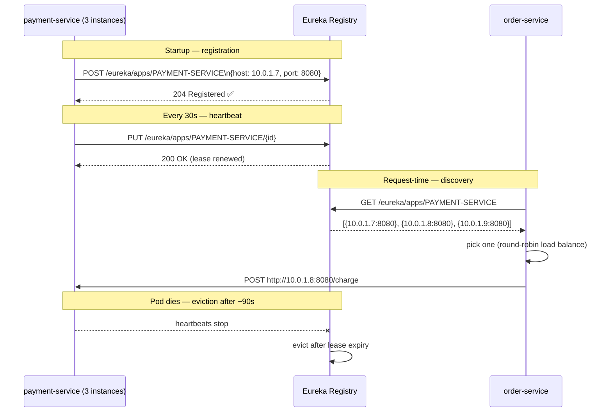

# Service Discovery with Eureka

> [!info] Express/TS dev ke liye
> Eureka basically Netflix ka service registry hai — services startup pe khud ko register karte hain ("hey, main `order-service` hoon, ye rahe mere IPs"), aur clients Eureka se puchte hain ki koi service kahan rehti hai. Isko simple bhasha mein Consul samjho, bas KV store wala part nahi hai. Kubernetes pe usually Eureka ki zaroorat hi nahi padti — kube-DNS ye kaam free mein kar deta hai. Lekin non-K8s deployments mein Eureka aaj bhi kaafi common hai.

## Concept

Kya hota hai? Ek microservice system mein "`payment-service` kahan hai bhai?" — ye sawaal itna simple nahi hai jitna lagta hai. Instances aate-jaate rehte hain — autoscaling ho rahi hai, naya deploy hua, koi instance crash ho gaya. Isliye ek **service registry** chahiye jo source of truth ho, jisse pata chale ki abhi kaunsi service kahan zinda hai.

Discovery ke do tarike hote hain:

- **Server-side** — client ek stable URL (load balancer) ko call karta hai; load balancer ko pata hota hai instances kahan hain. Jaise AWS ALB ya Kubernetes Service — client ko instances ka pata hi nahi chalta, LB sab sambhal leta hai.
- **Client-side** — client khud registry se puchta hai, instances ki list leta hai, ek chunta hai, aur seedha usse call karta hai. Eureka aur Consul isi category mein aate hain.

Eureka client-side discovery follow karta hai. Poora flow kuch aisa dikhta hai:



Socho Zomato ka example — jab bhi koi naya delivery partner online aata hai, woh app ko "main available hoon, yahan hoon" bolta hai (registration). Har thodi der mein app usko "still alive?" check karta rehta hai (heartbeat). Jab tumhara order aata hai, Zomato apne registry mein dekhta hai konse partners nearby available hain (discovery), aur ek ko assign kar deta hai. Agar partner ka phone band ho jaaye aur woh heartbeat bhejna band kar de, to kuch der baad system usko "unavailable" maan leta hai (eviction). Eureka bilkul yahi role nibhata hai microservices ke beech.

## Code example

### Eureka Server

Sabse pehle registry khud banate hain — ye ek alag Spring Boot app hoga jo sirf registry ka kaam karega.

```xml
<dependency>
    <groupId>org.springframework.cloud</groupId>
    <artifactId>spring-cloud-starter-netflix-eureka-server</artifactId>
</dependency>
```

```java
@SpringBootApplication
@EnableEurekaServer
public class EurekaServerApp {
    public static void main(String[] args) {
        SpringApplication.run(EurekaServerApp.class, args);
    }
}
```

```yaml
# application.yml
server:
  port: 8761

spring:
  application:
    name: eureka-server

eureka:
  client:
    register-with-eureka: false   # the server itself doesn't register
    fetch-registry: false
  server:
    enable-self-preservation: false  # disable in dev; enable in prod
```

`http://localhost:8761` pe jaake dekho — ek built-in dashboard milega jisme saari registered services list hoti hain. Bilkul waise hi jaise CRED ke andar tumhare saare linked cards ek dashboard mein dikhte hain.

### Eureka Client (koi bhi service)

Ab har service jo registry mein register hona chahti hai, usme ye dependency daalte hain.

```xml
<dependency>
    <groupId>org.springframework.cloud</groupId>
    <artifactId>spring-cloud-starter-netflix-eureka-client</artifactId>
</dependency>
```

```yaml
spring:
  application:
    name: payment-service        # this is the registry name

server:
  port: 0                        # random port — let Eureka know the actual port

eureka:
  client:
    service-url:
      defaultZone: http://localhost:8761/eureka/
  instance:
    prefer-ip-address: true
    instance-id: ${spring.application.name}:${random.value}
```

```java
@SpringBootApplication
public class PaymentServiceApp {
    public static void main(String[] args) {
        SpringApplication.run(PaymentServiceApp.class, args);
    }
}
```

Bas itna hi — sirf ye starter classpath pe hona hi kaafi hai, koi extra annotation ki zaroorat nahi (naye Spring Cloud versions mein `@EnableEurekaClient` bhi optional hai, starter dependency hi kaam kar deti hai).

### Doosri service ko discovery se call karna

Kya options hain? Teen tarike:

**1. `DiscoveryClient` (low-level)**

Ye sabse raw approach hai — tum khud instances ki list uthate ho aur khud pick karte ho.

```java
@RestController
class OrderController {
    private final DiscoveryClient discovery;
    private final RestClient http = RestClient.create();

    OrderController(DiscoveryClient d) { this.discovery = d; }

    @PostMapping("/api/orders")
    Order create(@RequestBody Cart cart) {
        var instances = discovery.getInstances("payment-service");
        var instance = instances.get(new Random().nextInt(instances.size()));
        var url = instance.getUri() + "/charge";

        var txn = http.post().uri(url).body(cart).retrieve().body(String.class);
        return new Order(cart, txn);
    }
}
```

**2. Load-balanced `RestClient` / `WebClient`** — ye typical, real-world approach hai

```java
@Configuration
class ClientConfig {
    @Bean
    @LoadBalanced
    RestClient.Builder restClientBuilder() {
        return RestClient.builder();
    }
}

@Service
class PaymentClient {
    private final RestClient client;

    PaymentClient(@LoadBalanced RestClient.Builder builder) {
        // base URL uses the SERVICE NAME, not a real host
        this.client = builder.baseUrl("http://payment-service").build();
    }

    String charge(int amount) {
        return client.post().uri("/charge")
            .body(Map.of("amount", amount))
            .retrieve()
            .body(String.class);
    }
}
```

Yahan asli jaadu ye hai: `http://payment-service` koi real DNS name nahi hai — ye ek fake/logical naam hai. `@LoadBalanced` waala interceptor is naam ko dekh ke Eureka se resolve karta hai aur behind-the-scenes ek actual instance (jaise `10.0.1.8:8080`) chun leta hai. Tumhe manually IP-port jugaad karne ki zaroorat hi nahi.

**3. OpenFeign** — [[07-OpenFeign]] dekho. Sabse clean aur declarative tarika — bilkul ek interface define karo aur Spring baaki sab sambhal leta hai.

### Multi-zone Eureka

Kya zaroorat hai? Agar tumhara Eureka server hi down ho gaya to poori discovery system thap ho jaayegi — single point of failure. Isliye HA (high availability) ke liye multiple Eureka servers chalate hain jo aapas mein peer karte hain (ek doosre ka data replicate karte hain).

```yaml
# eureka-1
eureka:
  instance:
    hostname: eureka-1
  client:
    service-url:
      defaultZone: http://eureka-2:8761/eureka/,http://eureka-3:8761/eureka/

# eureka-2
eureka:
  instance:
    hostname: eureka-2
  client:
    service-url:
      defaultZone: http://eureka-1:8761/eureka/,http://eureka-3:8761/eureka/
```

Clients apne `defaultZone` mein saare peers list karte hain, taaki ek Eureka server down ho bhi jaaye to doosre se kaam chal jaaye.

### Health check integration

Sirf heartbeat kaafi nahi hota kabhi kabhi — service zinda hai lekin unhealthy ho sakti hai (jaise database connection tut gaya ho). Isliye actuator health check bhi jodte hain:

```yaml
eureka:
  client:
    healthcheck:
      enabled: true
```

Ab Eureka ek service ko `DOWN` maanega agar uska `/actuator/health` unhealthy report kare — sirf heartbeats ke bharose nahi rahega.

## Express/Node comparison

Node background se aa rahe ho? Ye tumhe familiar lagega — Consul ke saath kaam almost same pattern follow karta hai.

```typescript
// Node + Consul (similar pattern)
import { Consul } from 'consul';
const consul = new Consul();

await consul.agent.service.register({
  name: "payment-service",
  port: 8080,
  check: { http: "http://localhost:8080/health", interval: "10s" }
});

// Discovery
const services = await consul.health.service({ service: "payment-service", passing: true });
const instance = services[Math.random() * services.length | 0];
```

| Eureka | Node |
|--------|------|
| `@EnableEurekaServer` | run a Consul/etcd server |
| `@EnableEurekaClient` (implicit) | `consul.agent.service.register()` |
| `DiscoveryClient` | `consul.health.service()` |
| `@LoadBalanced` `RestClient` | `consul-resolver` package |
| heartbeats | Consul TTL or HTTP checks |
| Eureka self-preservation | (no equivalent) |

Kubernetes pe dono ecosystems (Java aur Node) usually ek registry ki zaroorat hi skip kar dete hain: kube-DNS `payment-service.default.svc.cluster.local` resolve kar deta hai aur kube ka `Service` load-balancing khud sambhal leta hai. Yaani production K8s setup mein na Eureka chahiye, na Consul.

## Gotchas

> [!warning] Self-preservation mode
> Kya hota hai? Agar bahut saare instances heartbeat bhejna band kar dein (jaise network partition ho gaya), to Eureka **self-preservation** mode mein chala jaata hai — woh instances ko evict karna band kar deta hai, ye assume karke ki shayad network hi kharab hai, services nahi. Dev environment mein ye problem create karta hai — dead services registry mein "alive" dikhti rehti hain, bugs mask ho jaate hain. Production mein ye feature accha hai — partition ke waqt cascading evictions rokta hai. Isliye dev mein isse disable karo (`enable-self-preservation: false`), prod mein on rakho.

> [!warning] Long propagation delays
> Default eviction time ~90 seconds hai. Matlab agar koi service crash ho jaaye, to woh Eureka ki nazar mein ek minute se zyada "alive" dikhti rahegi. Isko circuit breakers ke saath combine karo, taaki caller us dead service ko baar-baar hit na karta rahe jab tak eviction naturally na ho.

> [!warning] `prefer-ip-address: true` containers mein zaroori hai
> Docker/K8s networks ke andar hostname-based registration break ho jaata hai kyunki hostnames container ke andar hi meaningful hote hain, bahar se resolve nahi hote. Isliye IPs use karo.

> [!danger] Eureka ko publicly expose mat karo
> Ye ek internal infra component hai — VPN ya private subnet ke peeche rakho. Dashboard by default unauthenticated hota hai, matlab koi bhi jo usse reach kar sakta hai, saari services ki list dekh sakta hai. Ye ek security risk hai, bilkul waise jaise koi apna UPI PIN bina lock ke rakh de.

> [!tip] K8s pe ho? Eureka skip karo.
> Kube `Service`s use karo. Unme built-in DNS, health checks, load balancing sab already hai. Eureka ek extra layer add karta hai jo mostly wahi kaam duplicate karta hai jo kube already karta hai — aur upar se platform ki eviction Eureka se fast bhi hoti hai.

## Related
- [[02-Spring-Cloud-Overview]]
- [[06-Inter-Service-Communication]]
- [[07-OpenFeign]]
- [[04-API-Gateway-Spring-Cloud-Gateway]]
