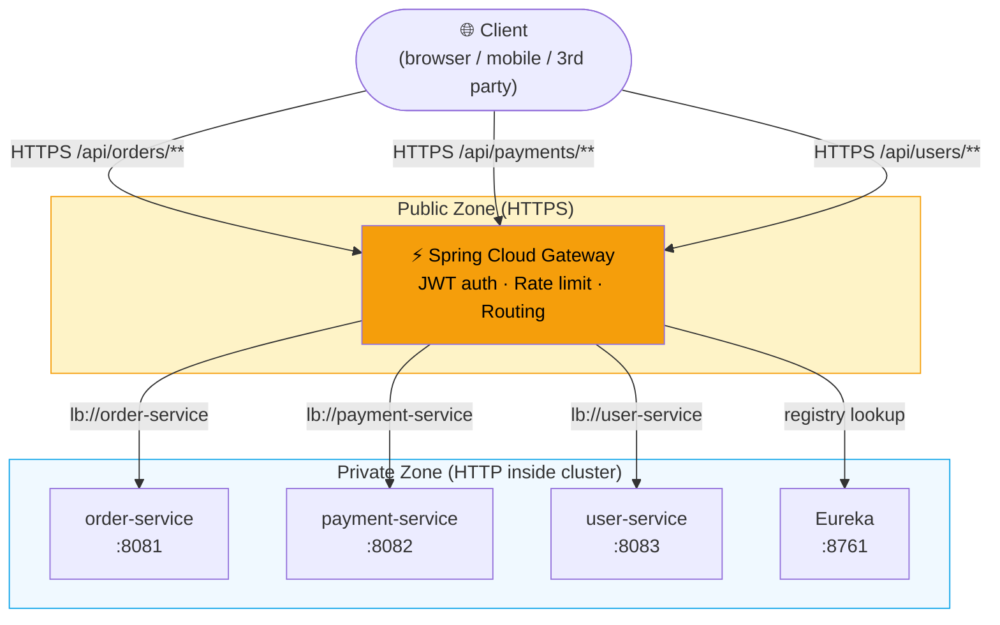

# API Gateway (Spring Cloud Gateway)

> [!info] For the Express/TS dev
> An API gateway is the single front door for clients into your microservices. It handles routing, auth, rate limiting, request rewriting, CORS — concerns that don't belong in every service. Spring Cloud Gateway is the modern, reactive (Netty-based) choice; it replaces the older Zuul. Comparable to Kong, Traefik, or an `express-gateway` setup.

## Concept

Without a gateway, mobile clients need to know about `payment-service`, `orders-service`, `user-service`, etc. directly. A gateway:

- **Routes** `/api/orders/**` → `order-service`
- **Authenticates** once at the edge — services trust internal traffic.
- **Rate-limits** per client.
- **Terminates TLS** so internal traffic can be plain HTTP.
- **Aggregates** responses (sometimes — but usually that's a Backend-for-Frontend, not the gateway).
- **Logs / traces** centrally.

Spring Cloud Gateway is built on Project Reactor (WebFlux) — non-blocking, handles thousands of concurrent connections per instance. It's **not** Spring MVC.



### Three concepts

| Concept | What it does |
|---------|--------------|
| **Route** | A target — predicate(s) + URI + filters |
| **Predicate** | Matches incoming requests (`Path=/api/orders/**`, `Method=GET`, `Header=X-Foo,bar`) |
| **Filter** | Modifies request/response (`AddRequestHeader`, `RewritePath`, `CircuitBreaker`, custom) |

## Code example

### Dependency

```xml
<dependency>
    <groupId>org.springframework.cloud</groupId>
    <artifactId>spring-cloud-starter-gateway</artifactId>
</dependency>
```

> [!warning] Don't add `spring-boot-starter-web` to a Gateway app
> Gateway is reactive (WebFlux). Mixing them breaks the app. If you need a few synchronous endpoints, use `spring-boot-starter-webflux` for them.

### YAML config (the typical way)

```yaml
spring:
  application:
    name: api-gateway

  cloud:
    gateway:
      routes:
        - id: orders
          uri: lb://order-service           # lb:// → load-balanced via discovery
          predicates:
            - Path=/api/orders/**
          filters:
            - RewritePath=/api/orders/(?<segment>.*), /$\{segment}
            - AddRequestHeader=X-Source, gateway

        - id: payments
          uri: lb://payment-service
          predicates:
            - Path=/api/payments/**
            - Method=POST,GET
          filters:
            - StripPrefix=2
            - name: CircuitBreaker
              args:
                name: paymentsCB
                fallbackUri: forward:/fallback/payments

        - id: catalog
          uri: http://catalog-service:8080
          predicates:
            - Path=/api/catalog/**
          filters:
            - RewritePath=/api/catalog/(?<rest>.*), /catalog/$\{rest}
            - name: RequestRateLimiter
              args:
                redis-rate-limiter.replenishRate: 10
                redis-rate-limiter.burstCapacity: 20
                key-resolver: "#{@userKeyResolver}"

server:
  port: 8080
```

`lb://service-name` requires Eureka or another discovery client on the classpath (see [[03-Service-Discovery-Eureka]]).

### Java DSL (programmatic, more flexible)

```java
@Configuration
public class GatewayConfig {

    @Bean
    public RouteLocator routes(RouteLocatorBuilder builder) {
        return builder.routes()
            .route("orders", r -> r
                .path("/api/orders/**")
                .filters(f -> f
                    .rewritePath("/api/orders/(?<seg>.*)", "/${seg}")
                    .addRequestHeader("X-Source", "gateway")
                    .circuitBreaker(c -> c.setName("ordersCB")
                        .setFallbackUri("forward:/fallback/orders")))
                .uri("lb://order-service"))

            .route("payments", r -> r
                .path("/api/payments/**")
                .and().method("POST")
                .filters(f -> f
                    .retry(3)
                    .stripPrefix(2))
                .uri("lb://payment-service"))

            .build();
    }

    @Bean
    KeyResolver userKeyResolver() {
        return ex -> Mono.just(
            ex.getRequest().getHeaders().getFirst("X-User-Id")
        );
    }
}
```

### Custom global filter — auth at the edge

```java
@Component
public class JwtAuthFilter implements GlobalFilter, Ordered {

    private final JwtParser parser;

    public JwtAuthFilter(JwtParser parser) { this.parser = parser; }

    @Override
    public Mono<Void> filter(ServerWebExchange ex, GatewayFilterChain chain) {
        String auth = ex.getRequest().getHeaders().getFirst("Authorization");
        if (auth == null || !auth.startsWith("Bearer ")) {
            ex.getResponse().setStatusCode(HttpStatus.UNAUTHORIZED);
            return ex.getResponse().setComplete();
        }

        try {
            var claims = parser.parseSignedClaims(auth.substring(7)).getPayload();
            // forward user-id downstream so services don't re-validate JWT
            var mutated = ex.getRequest().mutate()
                .header("X-User-Id", claims.getSubject())
                .header("X-User-Roles", String.join(",", (List<String>) claims.get("roles")))
                .build();
            return chain.filter(ex.mutate().request(mutated).build());
        } catch (JwtException e) {
            ex.getResponse().setStatusCode(HttpStatus.UNAUTHORIZED);
            return ex.getResponse().setComplete();
        }
    }

    @Override public int getOrder() { return -100; }  // run early
}
```

### Fallbacks

```java
@RestController
class FallbackController {
    @RequestMapping("/fallback/payments")
    Mono<ResponseEntity<Map<String, Object>>> paymentFallback() {
        return Mono.just(ResponseEntity
            .status(HttpStatus.SERVICE_UNAVAILABLE)
            .body(Map.of("error", "Payments temporarily unavailable")));
    }
}
```

### Rate limiting

```yaml
filters:
  - name: RequestRateLimiter
    args:
      redis-rate-limiter.replenishRate: 100   # tokens/sec sustained
      redis-rate-limiter.burstCapacity: 200   # max burst
      key-resolver: "#{@userKeyResolver}"     # bucket per user
```

Requires `spring-boot-starter-data-redis-reactive` and a Redis instance (token bucket state).

### Common filters quick-ref

| Filter | Effect |
|--------|--------|
| `StripPrefix=2` | drop first 2 path segments before forwarding |
| `RewritePath=...` | regex rewrite |
| `AddRequestHeader` / `RemoveRequestHeader` | header manipulation |
| `SetStatus=404` | force a status |
| `Retry` | retry failed requests |
| `CircuitBreaker` | wrap with Resilience4j circuit breaker |
| `RequestRateLimiter` | throttle |
| `RedirectTo` | 30x redirect |
| `PreserveHostHeader` | keep `Host` from client |

## Express/Node comparison

```js
// Express Gateway / Kong-style routing
const proxy = require('express-http-proxy');
app.use('/api/orders', authenticate, rateLimiter, proxy('order-service:8080'));
app.use('/api/payments', authenticate, proxy('payment-service:8080'));
```

| Spring Cloud Gateway | Node |
|----------------------|------|
| YAML routes | Express middleware chains |
| `lb://service-name` | `consul-resolver` + proxy |
| Global filter | global middleware |
| `CircuitBreaker` filter | `opossum` wrapping the proxy |
| `RequestRateLimiter` | `express-rate-limit` |
| Reactive (Netty) | event-loop (Node) — same model |

## Gotchas

> [!warning] Don't put business logic in the gateway
> A gateway should be **dumb**: route, auth, rate-limit. Aggregating responses and applying business rules belongs in a Backend-for-Frontend (BFF) — a separate service per client (web, mobile).

> [!warning] CORS at the gateway
> Set CORS at the gateway, not in every service. Otherwise services duplicate config and disagree.

> [!warning] Single point of failure
> Run >= 2 replicas behind an L4 LB (cloud LB, NLB). A gateway outage = total outage.

> [!warning] WebFlux thinking
> Gateway is reactive — blocking calls inside filters (JDBC, blocking HTTP) will tank throughput. Use reactive clients only.

> [!tip] Gateway, then mesh
> Some teams use Spring Cloud Gateway at the edge (north-south traffic) and a service mesh like Istio for east-west traffic between services. See [[12-Service-Mesh-vs-Library]].

## Related
- [[02-Spring-Cloud-Overview]]
- [[03-Service-Discovery-Eureka]]
- [[06-Inter-Service-Communication]]
- [[08-Resilience4j]]
- [[12-Service-Mesh-vs-Library]]
- [[../08-Security/04-JWT|JWT]]
