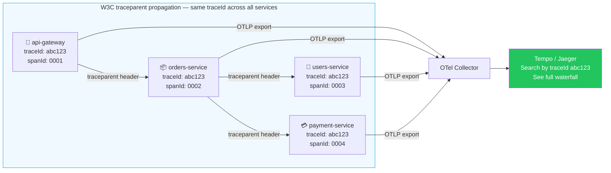

```mermaid
gantt
    title Trace abc123 — POST /api/orders (450ms total)
    dateFormat x
    axisFormat %Lms

    section api-gateway
    JWT validate + route      :0, 20

    section orders-service
    Handle request            :20, 380

    section orders-service DB
    SELECT user               :30, 60

    section users-service (Feign)
    GET /users/42             :65, 130

    section orders-service DB
    INSERT order              :140, 200

    section payment-service (Feign)
    POST /charge              :205, 370

    section orders-service
    Build response            :370, 380
```

# Distributed Tracing

> [!info] For the Express/TS dev
> If you've used `@opentelemetry/api` + auto-instrumentation in Node, the model is identical: a **trace** is a tree of **spans** propagated by W3C `traceparent` headers. Spring's wrapper is **Micrometer Tracing**, and it ships with OpenTelemetry or Brave (Zipkin) bridges.

## The model

- **Trace** — one logical end-to-end operation (a request crossing N services)
- **Span** — one unit of work inside a trace (HTTP call, DB query, method)
- **Context propagation** — `traceparent` (W3C) header carries `traceId` + `spanId` across hops
- **Sampling** — keep a percentage to bound cost





## Setup with OpenTelemetry → Tempo/Jaeger

```xml
<dependency>
    <groupId>org.springframework.boot</groupId>
    <artifactId>spring-boot-starter-actuator</artifactId>
</dependency>
<dependency>
    <groupId>io.micrometer</groupId>
    <artifactId>micrometer-tracing-bridge-otel</artifactId>
</dependency>
<dependency>
    <groupId>io.opentelemetry</groupId>
    <artifactId>opentelemetry-exporter-otlp</artifactId>
</dependency>
```

```yaml
management:
  tracing:
    sampling:
      probability: 0.1   # 10% in prod, 1.0 in dev
otel:
  exporter:
    otlp:
      endpoint: http://otel-collector:4317
  service:
    name: orders-api
```

## What gets auto-traced

- Inbound HTTP requests (Spring MVC, WebFlux)
- Outbound `RestClient` / `WebClient` / `RestTemplate`
- JDBC (with `datasource-micrometer`)
- Kafka producers/consumers
- `@Scheduled` tasks

## Manual spans

```java
@Service
@RequiredArgsConstructor
public class OrderService {
    private final Tracer tracer;

    public Order place(NewOrder cmd) {
        Span span = tracer.nextSpan().name("orders.place").start();
        try (Tracer.SpanInScope ws = tracer.withSpan(span)) {
            span.tag("order.user", cmd.userId().toString());
            return doPlace(cmd);
        } catch (Exception e) {
            span.error(e);
            throw e;
        } finally {
            span.end();
        }
    }
}
```

Or annotation-style (`micrometer-tracing-aop`):

```java
@Observed(name = "orders.place", contextualName = "place-order")
public Order place(NewOrder cmd) { ... }
```

## traceId / spanId in logs

Micrometer Tracing puts both into **MDC** automatically. Combined with the [[03-Logging-Best-Practices|JSON encoder]] config, every log line is correlatable:

```json
{"timestamp":"...","level":"INFO","traceId":"4bf92f3577b34da6a3ce929d0e0e4736","spanId":"00f067aa0ba902b7","msg":"Placed order id=123"}
```

## Propagation across HTTP

`RestClient`, `WebClient`, and Feign automatically inject `traceparent` headers when you build them via Spring's auto-configured beans. Don't `new` them.

```java
// auto-instrumented
@Bean
RestClient restClient(RestClient.Builder builder) {
    return builder.baseUrl("http://payments").build();
}
```

## Across Kafka

```java
@KafkaListener(topics = "orders")
public void onOrder(ConsumerRecord<String, OrderEvent> r) {
    // trace context extracted from Kafka headers automatically
    log.info("Processing order");
}
```

## Backends

| Backend | Notes |
|---------|-------|
| **Jaeger** | Open source, self-host, OTLP support |
| **Zipkin** | Older, simple, light |
| **Grafana Tempo** | Pairs with Loki + Prometheus |
| **Honeycomb / Lightstep / Datadog APM** | Hosted, rich UI |

## Sampling strategies

> [!tip] Don't sample 100% in prod
> Tracing every request is expensive. Use:
> - 1-10% probability sampling
> - **Tail-based** sampling at the collector (keep all errors + slow requests)
> - Dynamic sampling per route

## Useful queries (Tempo/Jaeger)

- All traces for a user: search by tag `user.id=42`
- Slow orders: `service=orders-api duration>500ms`
- Errors: `error=true`

## Related
- [[03-Logging-Best-Practices]]
- [[02-Micrometer-Metrics]]
- [[01-Spring-Boot-Actuator]]
- [[01-Microservices-Overview]]
