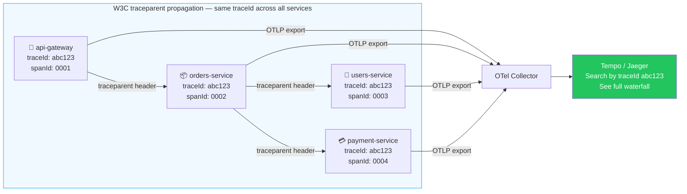

# Distributed Tracing

> [!info] Express/TS wale dev ke liye
> Agar tumne Node mein `@opentelemetry/api` + auto-instrumentation use kiya hai, toh mental model bilkul same hai — ek **trace** matlab **spans** ka ek tree hota hai, jo W3C `traceparent` header se propagate hota hai. Spring ka wrapper naam hai **Micrometer Tracing**, aur ye OpenTelemetry ya Brave (Zipkin) bridges ke saath aata hai.

## Model kya hai?

Socho tumne Zomato pe order place kiya. Ek single "order place karo" request ke peeche kitni saari services kaam kar rahi hoti hain — gateway, orders-service, restaurant-service, payment-service, notification-service. Agar order slow hai ya fail ho raha hai, toh pata kaise chalega ki **kaunsi service** culprit hai? Yahi problem distributed tracing solve karta hai.

- **Trace** — ek logical end-to-end operation (ek request jo N services cross karta hai). Isse socho poore order ki "journey" — start se end tak.
- **Span** — trace ke andar ek unit of work (ek HTTP call, ek DB query, ek method execution). Journey ka ek "step".
- **Context propagation** — `traceparent` (W3C standard) header `traceId` + `spanId` ko har hop ke saath carry karta hai, taaki sab services ko pata rahe "hum sab isi ek request ka hissa hain".
- **Sampling** — har request ko trace karna mehenga padta hai, isliye ek percentage hi rakhte hain — jaise Swiggy apne delivery ke sirf kuch orders ko hi detailed track karta hai analysis ke liye, sab nahi.

```mermaid
gantt
    title Trace abc123 — POST /api/orders (450ms total)
    dateFormat x
    axisFormat %Lms

    section api-gateway
    JWT validate + route      :0, 20

    section orders-service
    Handle request            :20, 380

    section orders-service DB
    SELECT user               :30, 60

    section users-service (Feign)
    GET /users/42             :65, 130

    section orders-service DB
    INSERT order              :140, 200

    section payment-service (Feign)
    POST /charge              :205, 370

    section orders-service
    Build response            :370, 380
```



Is Gantt chart ko dekho jaise ek waterfall — pata chal raha hai ki 450ms mein se sabse zyada time kahan gaya. `payment-service` ka call sabse zyada time le raha hai (165ms) — agar order slow lag raha hai toh ye pehla suspect hai.



Yahan ek important cheez notice karo — `traceId` (`abc123`) **sab services mein same** rehta hai, sirf `spanId` change hota hai. Ye traceId hi tumhara "order tracking number" hai — isse tum Tempo ya Jaeger mein search karke poori journey dekh sakte ho, chahe request kitni bhi services se hokar gayi ho.

## OpenTelemetry → Tempo/Jaeger ke saath setup

```xml
<dependency>
    <groupId>org.springframework.boot</groupId>
    <artifactId>spring-boot-starter-actuator</artifactId>
</dependency>
<dependency>
    <groupId>io.micrometer</groupId>
    <artifactId>micrometer-tracing-bridge-otel</artifactId>
</dependency>
<dependency>
    <groupId>io.opentelemetry</groupId>
    <artifactId>opentelemetry-exporter-otlp</artifactId>
</dependency>
```

```yaml
management:
  tracing:
    sampling:
      probability: 0.1   # 10% in prod, 1.0 in dev
otel:
  exporter:
    otlp:
      endpoint: http://otel-collector:4317
  service:
    name: orders-api
```

Bas itni dependencies daalo aur config likho — Spring baaki sab khud handle kar leta hai. Node mein tumhe manually `NodeSDK` setup karke instrumentations register karni padti thi; yahan Spring Boot ka auto-configuration wahi kaam kar deta hai.

## Kya cheezein automatically trace ho jaati hain?

Kya hota hai? Spring Boot khud-ba-khud in sab cheezon ke liye spans bana deta hai, tumhe ek line code bhi likhne ki zaroorat nahi:

- Inbound HTTP requests (Spring MVC, WebFlux)
- Outbound `RestClient` / `WebClient` / `RestTemplate`
- JDBC (with `datasource-micrometer`)
- Kafka producers/consumers
- `@Scheduled` tasks

## Manual spans — jab khud control chahiye

Kabhi-kabhi auto-tracing kaafi nahi hota — tum chahte ho ki business logic ke andar ek specific step (jaise "order place karna") apna khud ka named span ho, jisme custom tags bhi ho. Wahan manual span banate hain:

```java
@Service
@RequiredArgsConstructor
public class OrderService {
    private final Tracer tracer;

    public Order place(NewOrder cmd) {
        Span span = tracer.nextSpan().name("orders.place").start();
        try (Tracer.SpanInScope ws = tracer.withSpan(span)) {
            span.tag("order.user", cmd.userId().toString());
            return doPlace(cmd);
        } catch (Exception e) {
            span.error(e);
            throw e;
        } finally {
            span.end();
        }
    }
}
```

> [!warning] `span.end()` finally mein hi rakhna
> Agar span end nahi hua toh woh trace mein "hanging" reh jaata hai — memory leak jaisa hi hai, bas tracing ke context mein.

Ya phir annotation-style ka easy tareeka (`micrometer-tracing-aop` chahiye):

```java
@Observed(name = "orders.place", contextualName = "place-order")
public Order place(NewOrder cmd) { ... }
```

Ye same cheez hai jo try-finally waale code mein ki, bas AOP proxy ke through — kam boilerplate, zyada clean.

## Logs mein traceId / spanId

Kyun zaruri hai? Socho tumhare paas 5 services ke logs hain, sab alag-alag jagah likhe ja rahe hain. Ek user complain karta hai "mera order fail ho gaya" — tum kaise pata karoge ki kaunsi service ne kya kiya? Agar har log line mein same `traceId` ho, toh tum sirf ek grep/search se poori request ki story assemble kar sakte ho — chahe woh 5 alag services ke logs hi kyun na ho.

Micrometer Tracing dono values (`traceId`, `spanId`) automatically **MDC** mein daal deta hai. [[03-Logging-Best-Practices|JSON encoder]] config ke saath combine karo, toh har log line correlate ho jaati hai:

```json
{"timestamp":"...","level":"INFO","traceId":"4bf92f3577b34da6a3ce929d0e0e4736","spanId":"00f067aa0ba902b7","msg":"Placed order id=123"}
```

## HTTP ke through propagation

`RestClient`, `WebClient`, aur Feign — ye sab automatically `traceparent` header inject kar dete hain, **bashart** tumne inhe Spring ke auto-configured beans se banaya ho. `new` karke mat banao, warna ye magic kaam nahi karega.

```java
// auto-instrumented
@Bean
RestClient restClient(RestClient.Builder builder) {
    return builder.baseUrl("http://payments").build();
}
```

> [!warning] `new RestTemplate()` mat likho
> Agar tumne khud `new RestTemplate()` ya `new RestClient()` banaya, toh Spring ka auto-instrumentation us instance ko intercept nahi kar payega — aur tumhara traceparent header propagate hi nahi hoga. Hamesha `Builder` inject karke banao.

## Kafka ke across

```java
@KafkaListener(topics = "orders")
public void onOrder(ConsumerRecord<String, OrderEvent> r) {
    // trace context extracted from Kafka headers automatically
    log.info("Processing order");
}
```

Yaani agar orders-service ek Kafka message publish karta hai aur payment-service usse consume karta hai, toh trace context Kafka message headers ke through carry hota hai — same traceId dono taraf milega, HTTP jaisa hi magic yahan bhi.

## Backends — kahan store aur dekhte hain traces

| Backend | Notes |
|---------|-------|
| **Jaeger** | Open source, self-host, OTLP support |
| **Zipkin** | Older, simple, light |
| **Grafana Tempo** | Pairs with Loki + Prometheus |
| **Honeycomb / Lightstep / Datadog APM** | Hosted, rich UI |

## Sampling strategies

> [!tip] Prod mein 100% sampling mat karo
> Har request ko trace karna mehenga padta hai — storage bhi, processing overhead bhi. Isliye:
> - 1-10% probability sampling normal traffic ke liye
> - **Tail-based** sampling collector pe — errors aur slow requests ko hamesha rakho, chahe woh sampling percentage se bahar hi kyun na ho
> - Route ke hisaab se dynamic sampling (jaise `/checkout` route zyada important hai `/health` se)

Socho IRCTC tatkal booking — agar sab requests ka full trace rakhoge toh storage phat jaayega. Isliye normal requests ka 5-10% hi sample karo, lekin jo bhi **fail** hua ya **slow** tha, usse hamesha rakho — wahi debugging ke kaam aata hai.

## Useful queries (Tempo/Jaeger)

- Ek user ke saare traces: tag `user.id=42` se search karo
- Slow orders: `service=orders-api duration>500ms`
- Errors: `error=true`

## Related
- [[03-Logging-Best-Practices]]
- [[02-Micrometer-Metrics]]
- [[01-Spring-Boot-Actuator]]
- [[01-Microservices-Overview]]
