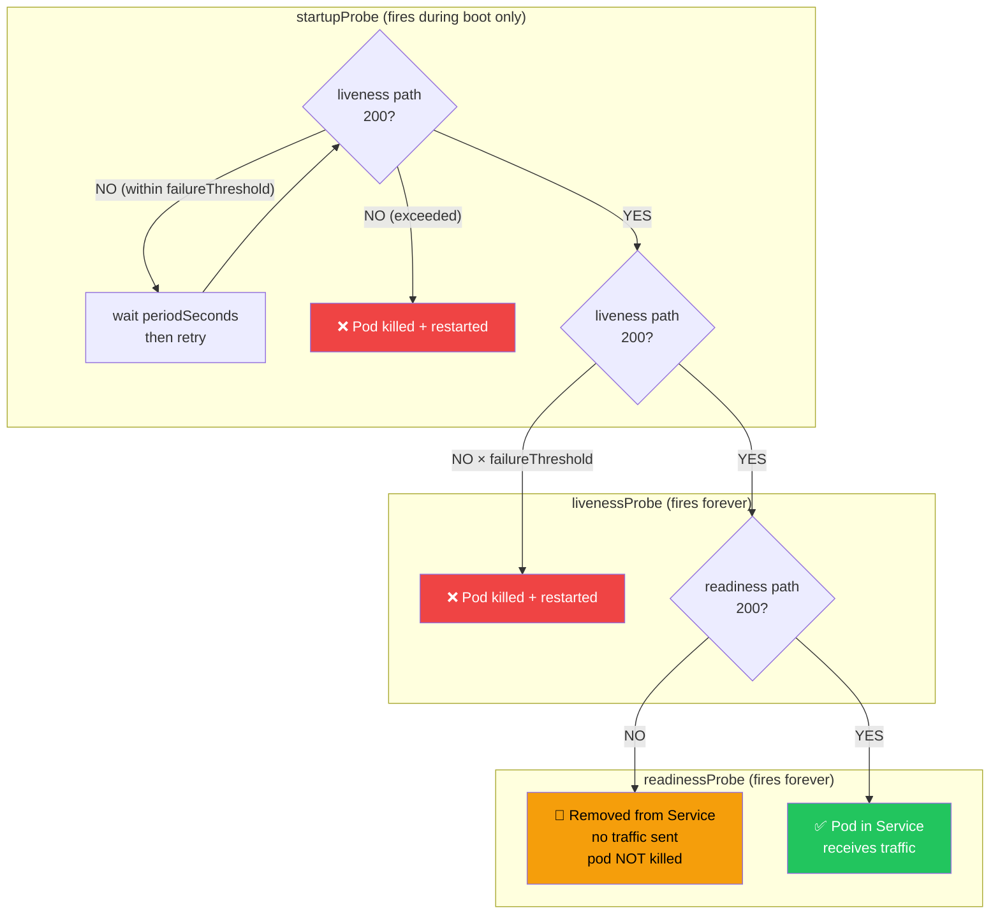

# Health Checks and Readiness

> [!info] For the Express/TS dev
> In Express + k8s, you'd hand-roll `/healthz` and `/readyz`. Spring Boot Actuator gives you `/actuator/health/liveness` and `/actuator/health/readiness` with proper semantics — and ties them to the Spring `ApplicationAvailability` lifecycle.

## Liveness vs Readiness — get this right

| Probe | Question it answers | Failure action |
|-------|---------------------|----------------|
| **Liveness** | Is the JVM/app **alive**? | Kubernetes kills & restarts the pod |
| **Readiness** | Can it **serve traffic** right now? | Pod removed from Service endpoints (no traffic, NOT killed) |



> [!warning] Don't fail liveness on downstream outages
> If your DB is down, that's a **readiness** failure (don't send traffic) not a **liveness** failure (don't restart — restarting won't fix the DB). Restart loops hide the real problem.

## Enable probes

```yaml
management:
  endpoint:
    health:
      probes:
        enabled: true
      show-details: always
      group:
        readiness:
          include: readinessState,db,redis
        liveness:
          include: livenessState
  endpoints:
    web:
      exposure:
        include: health,info,prometheus
```

Endpoints:
- `GET /actuator/health/liveness` → `{"status":"UP"}` or 503
- `GET /actuator/health/readiness`

## Kubernetes manifest

```yaml
apiVersion: apps/v1
kind: Deployment
metadata:
  name: orders-api
spec:
  template:
    spec:
      containers:
        - name: app
          image: orders-api:1.0.0
          ports: [{ containerPort: 8080 }]
          startupProbe:
            httpGet: { path: /actuator/health/liveness, port: 8080 }
            failureThreshold: 30
            periodSeconds: 10           # Up to 5 min for slow JVM startup
          livenessProbe:
            httpGet: { path: /actuator/health/liveness, port: 8080 }
            periodSeconds: 10
            failureThreshold: 3
          readinessProbe:
            httpGet: { path: /actuator/health/readiness, port: 8080 }
            periodSeconds: 5
            failureThreshold: 3
```

> [!tip] Always use a startupProbe for Spring Boot
> JVM warm-up + Spring context init can take 30–90s. Without `startupProbe`, the liveness probe will kill the pod before it finishes booting.

## ApplicationAvailability

Spring publishes events you can listen to and react to:

```java
@Component
@RequiredArgsConstructor
public class CacheWarmer {
    private final ApplicationEventPublisher events;

    @EventListener
    public void onReady(AvailabilityChangeEvent<ReadinessState> event) {
        if (event.getState() == ReadinessState.ACCEPTING_TRAFFIC) {
            // warm caches, etc.
        }
    }

    public void brokenDownstream() {
        AvailabilityChangeEvent.publish(events, this, ReadinessState.REFUSING_TRAFFIC);
    }
}
```

## Custom readiness indicator

```java
@Component
public class KafkaReadinessIndicator implements HealthIndicator {
    private final KafkaTemplate<?, ?> kafka;

    @Override
    public Health health() {
        try {
            kafka.getProducerFactory().createProducer().partitionsFor("orders");
            return Health.up().build();
        } catch (Exception e) {
            return Health.outOfService().withDetail("reason", e.getMessage()).build();
        }
    }
}
```

Add to readiness group via config above.

## Graceful shutdown

```yaml
server:
  shutdown: graceful
spring:
  lifecycle:
    timeout-per-shutdown-phase: 30s
```

On `SIGTERM`, Spring:
1. Stops accepting new requests
2. Waits up to `timeout` for in-flight requests
3. Shuts down

Pair with k8s `terminationGracePeriodSeconds: 60` and a `preStop` sleep so the pod is removed from the Service before shutdown begins.

## Common health checks to include

- DB connectivity (auto when `DataSource` on classpath)
- Redis / cache
- Kafka producer
- Critical downstream APIs (with **circuit breaker** — see [[02-Resilience4j-Circuit-Breakers]])
- Disk space

## What to EXCLUDE from readiness

- Optional caches (Redis warming up shouldn't refuse traffic)
- Background job queues
- Anything where degraded mode is acceptable

## Related
- [[01-Spring-Boot-Actuator]]
- [[04-Kubernetes-Basics]]
- [[02-Resilience4j-Circuit-Breakers]]
- [[06-Profiles-Per-Environment]]
