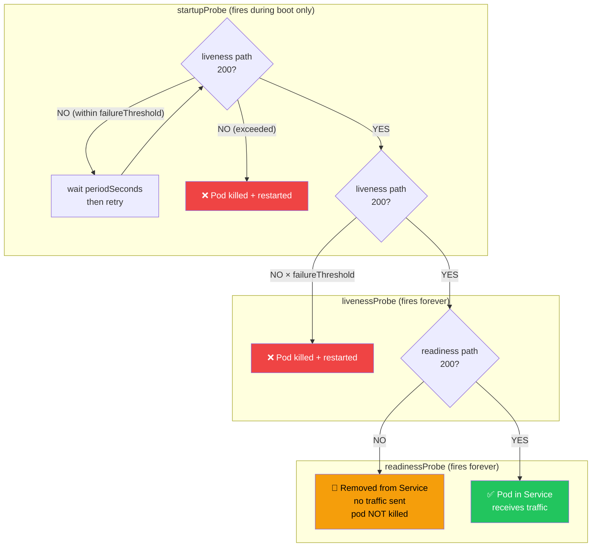

# Health Checks and Readiness

> [!info] For the Express/TS dev
> Express + k8s mein tum khud `/healthz` aur `/readyz` routes hand-roll karte ho — apna khud ka logic likhna padta hai. Spring Boot Actuator yeh ready-made deta hai: `/actuator/health/liveness` aur `/actuator/health/readiness`, proper semantics ke saath — aur yeh Spring ke `ApplicationAvailability` lifecycle se directly connected hote hain. Matlab tumhe pehiya dobara nahi banana padta.

## Liveness vs Readiness — yeh cleanly samajh lo

Kya hota hai? Do alag probes hain jo do alag sawaal poochte hain, aur dono ke failure pe reaction bilkul different hota hai. Confuse mat karo inhe — yeh sabse common Kubernetes mistake hai.

Socho aisa: tumhara Zomato delivery partner app hai. "Liveness" poochta hai — "kya delivery partner ka phone on hai, zinda hai?" Agar nahi, toh phone restart karo (kill the pod). "Readiness" poochta hai — "kya woh abhi order accept karne ke liye free hai?" Agar busy hai (traffic jam mein phasa hai), toh usse naya order mat bhejo — lekin usko fire mat karo, woh zinda hai bas busy hai.

| Probe | Question it answers | Failure action |
|-------|---------------------|----------------|
| **Liveness** | Kya JVM/app **zinda** hai? | Kubernetes pod ko kill karke restart karega |
| **Readiness** | Kya woh **abhi traffic serve** kar sakta hai? | Pod ko Service endpoints se hata diya jaata hai (traffic nahi jayega, lekin pod KILL nahi hota) |



> [!warning] Downstream outage pe liveness fail mat karo
> Agar tumhara DB down hai, toh yeh **readiness** ka failure hai (traffic mat bhejo), **liveness** ka nahi (pod restart mat karo — restart karne se DB thodi theek ho jayega). Yeh galti karoge toh pod baar-baar restart hota rahega, aur asli problem (DB down hona) chhup jayegi. Jaise Zomato ka server down hai toh app crash karne se kaam nahi banega, restaurant list dikhana band karna padega.

## Probes enable karna

Kaise karte hain? Bas `application.yml` mein ek config block daal do:

```yaml
management:
  endpoint:
    health:
      probes:
        enabled: true
      show-details: always
      group:
        readiness:
          include: readinessState,db,redis
        liveness:
          include: livenessState
  endpoints:
    web:
      exposure:
        include: health,info,prometheus
```

Endpoints:
- `GET /actuator/health/liveness` → `{"status":"UP"}` ya 503
- `GET /actuator/health/readiness`

## Kubernetes manifest

Kyun zaruri hai? Config Spring side pe set kar di, ab Kubernetes ko batana hai ki in endpoints ko kab aur kaise hit karna hai. Yeh manifest woh contract hai.

```yaml
apiVersion: apps/v1
kind: Deployment
metadata:
  name: orders-api
spec:
  template:
    spec:
      containers:
        - name: app
          image: orders-api:1.0.0
          ports: [{ containerPort: 8080 }]
          startupProbe:
            httpGet: { path: /actuator/health/liveness, port: 8080 }
            failureThreshold: 30
            periodSeconds: 10           # Up to 5 min for slow JVM startup
          livenessProbe:
            httpGet: { path: /actuator/health/liveness, port: 8080 }
            periodSeconds: 10
            failureThreshold: 3
          readinessProbe:
            httpGet: { path: /actuator/health/readiness, port: 8080 }
            periodSeconds: 5
            failureThreshold: 3
```

> [!tip] Spring Boot ke liye hamesha startupProbe use karo
> JVM warm-up + Spring context init mein 30–90 seconds lag sakte hain — Node.js ke `express.listen()` jaisa instant nahi hai yeh. `startupProbe` ke bina, liveness probe pod ko boot complete hone se pehle hi kill kar dega, aur pod restart loop mein phas jayega (CrashLoopBackOff dekhoge). Startup probe basically ek "abhi patience rakho, boot ho raha hai" wala buffer hai.

## ApplicationAvailability

Kya hota hai? Spring internally events publish karta hai jab uski availability state change hoti hai — tum in events ko listen karke apna khud ka logic chala sakte ho, jaise cache warm karna jab app traffic accept karne ke liye ready ho jaaye.

```java
@Component
@RequiredArgsConstructor
public class CacheWarmer {
    private final ApplicationEventPublisher events;

    @EventListener
    public void onReady(AvailabilityChangeEvent<ReadinessState> event) {
        if (event.getState() == ReadinessState.ACCEPTING_TRAFFIC) {
            // warm caches, etc.
        }
    }

    public void brokenDownstream() {
        AvailabilityChangeEvent.publish(events, this, ReadinessState.REFUSING_TRAFFIC);
    }
}
```

Yeh doosri direction bhi kaam karta hai — agar tumhe pata chale ki koi critical downstream (jaise payment gateway) down hai, toh tum manually `REFUSING_TRAFFIC` publish karke apne app ko "main abhi ready nahi hoon" bol sakte ho, bina pod ko kill kiye.

## Custom readiness indicator

Kaise banaye apna khud ka health check? `HealthIndicator` implement karo. Maan lo tumhara app Kafka pe depend karta hai orders publish karne ke liye — agar Kafka down hai, toh app ko traffic accept nahi karna chahiye.

```java
@Component
public class KafkaReadinessIndicator implements HealthIndicator {
    private final KafkaTemplate<?, ?> kafka;

    @Override
    public Health health() {
        try {
            kafka.getProducerFactory().createProducer().partitionsFor("orders");
            return Health.up().build();
        } catch (Exception e) {
            return Health.outOfService().withDetail("reason", e.getMessage()).build();
        }
    }
}
```

Isko upar wale config mein readiness group mein add kar do, taaki yeh readiness check ka hissa ban jaaye.

## Graceful shutdown

Kyun zaruri hai? Socho tumhara pod terminate ho raha hai lekin usi waqt 5 requests in-flight hain — agar app turant mar gaya, toh un 5 users ko error milega (jaise IRCTC pe ticket book karte waqt server crash ho jaaye, paisa kat gaya lekin ticket nahi bana). Graceful shutdown isi ko rokta hai.

```yaml
server:
  shutdown: graceful
spring:
  lifecycle:
    timeout-per-shutdown-phase: 30s
```

`SIGTERM` milne pe, Spring yeh karta hai:
1. Naye requests accept karna band kar deta hai
2. In-flight requests ke complete hone ka wait karta hai (`timeout` tak)
3. Phir shutdown ho jaata hai

> [!tip] Pair karo k8s ke saath
> Isko k8s ke `terminationGracePeriodSeconds: 60` aur ek `preStop` sleep hook ke saath jodo, taaki pod Service se hatne ke baad hi actual shutdown shuru ho — nahi toh race condition ban sakti hai jahan traffic ek marte hue pod pe bhej diya jaaye.

## Kaunse health checks include karne chahiye

- DB connectivity (agar `DataSource` classpath pe hai toh yeh auto-include ho jaata hai)
- Redis / cache
- Kafka producer
- Critical downstream APIs (**circuit breaker** ke saath — dekho [[02-Resilience4j-Circuit-Breakers]])
- Disk space

## Readiness se kya EXCLUDE karna chahiye

Yeh utna hi important hai jitna kya include karna hai — galat cheez readiness mein daal doge toh healthy pod bhi traffic se cut ho jayega, bina wajah.

- Optional caches (Redis abhi warm ho raha hai — iske liye traffic refuse mat karo)
- Background job queues
- Woh sab jahan degraded mode chalega bhi (perfect nahi, kaam chalau)

## Related
- [[01-Spring-Boot-Actuator]]
- [[04-Kubernetes-Basics]]
- [[02-Resilience4j-Circuit-Breakers]]
- [[06-Profiles-Per-Environment]]
