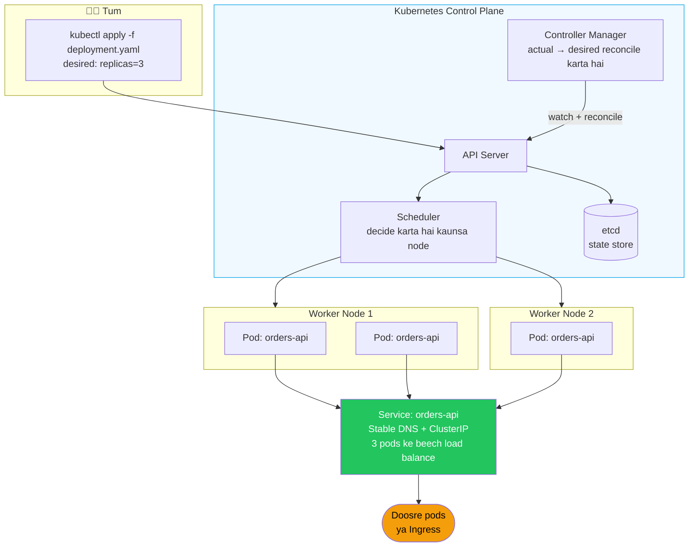

# Kubernetes From Scratch (Docker jaanne wale dev ke liye)

> [!info] Tumhare liye specifically
> Tumhe Docker aata hai. `docker run`, `docker-compose up`, port mappings, volumes, env vars — sab familiar hai. Kubernetes basically wahi cheez hai jab tumhe wahi containers **bahut saare machines** pe chalane hote hain, saath mein self-healing, rolling updates, aur service discovery ke saath. Ye note ek pul hai — left side Docker concept, right side uska k8s wala equivalent.

## 5-minute wala mental model

Socho tumne Zomato jaisa system banaya hai. Ek single laptop pe `docker run orders-api` chala ke kaam nahi chalega — traffic badhega toh crash ho jayega, aur agar container mar gaya toh koi restart nahi karega. Kubernetes yahi problem solve karta hai.

> [!tip] Ye do baar padho
> - Pehle tum **ek container** ek host pe `docker run` se chalate the
> - Ab tum k8s ko batate ho: "Mujhe is container ki **3 copies** chahiye, **hamesha**, ek stable address ke peeche"
> - K8s khud placement, restart, scaling, aur routing sambhalta hai
> - Tum sirf **YAML** likhte ho jisme *desired state* describe hota hai; k8s reality ko us state ke jaisa banata rehta hai

Isko aise socho jaise tumne Swiggy ko ek order diya: "Mujhe 3 delivery partners chahiye is area mein, hamesha active." Swiggy ka system khud dekhta rahega — agar ek partner offline ho gaya, dusra assign kar dega. Tumhe manually track nahi karna padta. Kubernetes bhi exactly yही karta hai apne pods ke saath.



## Docker → Kubernetes vocabulary map

Kya hota hai? Basically jo cheezein tum already Docker mein karte ho, unhi ka ek "enterprise-grade" naam k8s mein hai. Table dekh lo, dimag mein bulb jal jayega.

| Docker | Kubernetes | Notes |
|--------|------------|-------|
| `docker run image` | **Pod** | Ek pod 1 ya usse zyada containers ko wrap karta hai (usually 1). Sabse chhota deploy unit. |
| `docker-compose.yml` | **Deployment** + **Service** + **ConfigMap** | Multiple YAML files, lekin intent same hai |
| `docker run --restart=always` | **Deployment** | Crash hue pods ko automatically restart karta hai |
| `--scale=3` | `replicas: 3` Deployment mein | N copies chalao |
| Container port mapping | **Service** | Stable virtual IP/DNS jo pods ki taraf point karta hai |
| `docker network` | Cluster network (built-in) | By default sab pods ek dusre tak pahunch sakte hain |
| `docker volume` | **PersistentVolumeClaim** | Storage jo pod restart ke baad bhi bacha rehta hai |
| `--env-file` | **ConfigMap** + **Secret** | Non-secret vs secret config |
| `docker exec -it` | `kubectl exec -it` | Same idea |
| `docker logs` | `kubectl logs` | Same idea |
| `docker ps` | `kubectl get pods` | Chal rahi cheezon ki list |

## Wo core objects jo aana hi chahiye

### 1. Pod — ek (ya zyada) chalta hua container

Kya hota hai? Pod k8s ka sabse chhota deployable unit hai. Isme ek ya usse zyada containers hote hain jo saath mein schedule hote hain, same network namespace share karte hain.

> [!info] Direct pod mat banao
> Tum khud se pods rarely banate ho. Iske bajaye tum **Deployments** banate ho, jo apne aap pods create karte hain. Manually pod banana matlab manually delivery boy hire karna instead of Swiggy app use karna — kaam ho jayega lekin scale nahi karega.

### 2. Deployment — "Mujhe is image ki N replicas chahiye, hamesha"

Kyun zaruri hai? Kyunki tumhe khud track nahi karna hai ki kaunsa pod zinda hai, kaunsa mara. Deployment ye guarantee deta hai ki desired replica count hamesha maintain rahe.

```yaml
apiVersion: apps/v1
kind: Deployment
metadata:
  name: orders-api
spec:
  replicas: 3
  selector:
    matchLabels: { app: orders-api }
  template:
    metadata:
      labels: { app: orders-api }
    spec:
      containers:
        - name: app
          image: ghcr.io/me/orders-api:1.0.0
          ports: [{ containerPort: 8080 }]
```

K8s ensure karta hai ki 3 pods hamesha chal rahe hon. Agar ek mar gaya → fresh start ho jata hai. Agar tum `1.0.1` push karo → rolling update hoga, ek-ek pod karke (jaise Zomato apna app update karta hai bina poora system down kiye).

### 3. Service — Deployment ke liye stable address

Kya problem hai? Pod IPs har restart pe change hoti hain. Tum unhe hardcode nahi kar sakte — jaise tum kisi Swiggy delivery boy ka phone number hardcode nahi karoge kyunki wo roz badal sakta hai. **Services** tumhe ek stable DNS naam dete hain jo hamesha same rehta hai, chahe peeche ke pods badalte rahein.

```yaml
apiVersion: v1
kind: Service
metadata:
  name: orders-api
spec:
  selector: { app: orders-api }       # label app=orders-api wale pods match karo
  ports:
    - port: 80
      targetPort: 8080
```

Ab cluster ke kisi bhi doosre pod se: `http://orders-api/...` kaam karega. K8s khud 3 replicas ke beech load-balance karta hai.

> [!tip] DNS naming
> Cluster ke andar: `<service>.<namespace>.svc.cluster.local`. Same namespace ke andar, sirf `<service>` likhna hi kaafi hai.

### 4. ConfigMap — non-secret config

Kya hota hai? Wo config values jo secret nahi hain (jaise profile name, kisi service ka URL) — unhe hardcode karne ke bajaye ConfigMap mein daalte ho, taaki alag environments (dev/staging/prod) ke liye alag values easily inject ho sakein.

```yaml
apiVersion: v1
kind: ConfigMap
metadata: { name: orders-config }
data:
  SPRING_PROFILES_ACTIVE: prod
  EUREKA_CLIENT_SERVICEURL_DEFAULTZONE: http://eureka:8761/eureka/
```

Deployment mein env vars ki tarah mount karo:

```yaml
envFrom:
  - configMapRef: { name: orders-config }
```

### 5. Secret — base64-encoded sensitive config

```yaml
apiVersion: v1
kind: Secret
metadata: { name: orders-secrets }
type: Opaque
stringData:
  SPRING_DATASOURCE_PASSWORD: super-secret
  JWT_SIGNING_KEY: another-secret
```

> [!warning] "Secret" ka matlab encrypted nahi hota
> Plain Secrets sirf base64-encoded hote hain, encrypted nahi — koi bhi decode kar sakta hai jise access mil jaaye. Real protection ke liye **Sealed Secrets**, **External Secrets Operator**, ya apne cloud ka secret manager use karo (AWS Secrets Manager, GCP Secret Manager, Vault). Ye waise hi hai jaise UPI PIN ko plain text mein kahin likh dena — "hidden" hai lekin secure nahi.

### 6. Ingress — public HTTP entry point

Kya hota hai? Ingress cluster ke bahar se aane wale HTTP traffic ke liye ek entry gate hai — jaise IRCTC ka main website jo peeche alag-alag services (booking, payment, PNR status) ko route karta hai.

```yaml
apiVersion: networking.k8s.io/v1
kind: Ingress
metadata: { name: orders-api }
spec:
  ingressClassName: nginx
  rules:
    - host: api.example.com
      http:
        paths:
          - path: /
            pathType: Prefix
            backend:
              service: { name: api-gateway, port: { number: 80 } }
```

Tumhare stack mein, Ingress **Spring Cloud Gateway** ki taraf point karta hai, jo phir internally route karta hai. Dekho [[09-Stack-Specific-Eureka-Gateway-Feign-on-K8s]].

### 7. Namespace — resources ke liye ek folder

```bash
kubectl create namespace dev
kubectl apply -f orders.yaml -n dev
```

Namespaces environments ko isolate karte hain (`dev`, `staging`, `prod`) ek hi cluster ke andar — jaise ek hi office building mein alag-alag floors, har floor apna kaam karta hai bina doosre ko disturb kiye.

## kubectl — tumhara roz ka driver

> [!tip] Agar sirf 10 commands seekhne hain
> ```bash
> kubectl get pods                          # current namespace ke pods list karo
> kubectl get pods -n dev -w                # 'dev' namespace ke pods watch karo
> kubectl get all                           # is namespace mein sab kuch
> kubectl describe pod orders-api-abc123    # detailed status, events, errors
> kubectl logs orders-api-abc123 -f         # logs tail karo
> kubectl logs orders-api-abc123 --previous # *crashed* container ke logs
> kubectl exec -it orders-api-abc123 -- sh  # pod ke andar shell
> kubectl apply -f deployment.yaml          # YAML se create/update karo
> kubectl delete -f deployment.yaml         # hatao
> kubectl port-forward svc/orders-api 8080:80  # localhost tak tunnel
> ```

### Useful aliases

```bash
alias k=kubectl
alias kgp='kubectl get pods'
alias kgs='kubectl get svc'
alias kdp='kubectl describe pod'
alias kl='kubectl logs -f'
```

### Context & namespace

```bash
kubectl config get-contexts                # jin clusters se baat kar sakte ho, unki list
kubectl config use-context my-cluster      # switch karo
kubectl config set-context --current --namespace=dev  # default ns set karo
```

## Local k8s development ke liye

Seekhne ke liye cloud cluster ki zaroorat nahi. Ek pick karo:

| Tool | Notes |
|------|-------|
| **kind** | Kubernetes-in-Docker. Fast. `brew install kind && kind create cluster` |
| **minikube** | Mature, zyada features. `brew install minikube && minikube start` |
| **k3d** | k3s Docker ke andar. Lightweight. |
| **Docker Desktop** | Built-in k8s hai — settings mein toggle karo |
| **Rancher Desktop** | Free, Docker Desktop jaisa hi k3s ke saath |

Tumhare stack ke liye (Eureka + Gateway + multiple services), 3-4 nodes wala **kind** kaafi hai.

## Ek complete worked example

Ye ek Spring Boot service hai jo properly deploy ki gayi hai:

```yaml
# orders-api.yaml — sab kuch ek file mein `---` separators ke saath
apiVersion: v1
kind: ConfigMap
metadata:
  name: orders-config
  namespace: dev
data:
  SPRING_PROFILES_ACTIVE: prod
  EUREKA_CLIENT_SERVICEURL_DEFAULTZONE: http://eureka:8761/eureka/
  JAVA_TOOL_OPTIONS: "-XX:MaxRAMPercentage=75"
---
apiVersion: v1
kind: Secret
metadata:
  name: orders-secrets
  namespace: dev
type: Opaque
stringData:
  SPRING_DATASOURCE_PASSWORD: dev-password
---
apiVersion: apps/v1
kind: Deployment
metadata:
  name: orders-api
  namespace: dev
spec:
  replicas: 2
  selector:
    matchLabels: { app: orders-api }
  template:
    metadata:
      labels: { app: orders-api }
    spec:
      containers:
        - name: app
          image: ghcr.io/me/orders-api:1.0.0
          ports: [{ name: http, containerPort: 8080 }]
          envFrom:
            - configMapRef: { name: orders-config }
            - secretRef: { name: orders-secrets }
          resources:
            requests: { cpu: "250m", memory: "512Mi" }
            limits:   { cpu: "1",    memory: "768Mi" }
          startupProbe:
            httpGet: { path: /actuator/health/liveness, port: http }
            failureThreshold: 30
            periodSeconds: 10
          livenessProbe:
            httpGet: { path: /actuator/health/liveness, port: http }
          readinessProbe:
            httpGet: { path: /actuator/health/readiness, port: http }
            periodSeconds: 5
---
apiVersion: v1
kind: Service
metadata:
  name: orders-api
  namespace: dev
spec:
  selector: { app: orders-api }
  ports:
    - port: 80
      targetPort: http
```

Apply karo:

```bash
kubectl apply -f orders-api.yaml
kubectl get pods -n dev -w
kubectl logs -n dev -l app=orders-api -f
```

## Naye logon ki common galtiyan

> [!warning] Ye pitfalls avoid karo
> 1. **Resource requests/limits set na karna** → noisy neighbors, OOMKills bina kisi warning ke
> 2. **Probes na hona, ya galat probes** → ya toh dead pods pe traffic jaayega ya restart loops honge. Dekho [[05-Health-Checks-and-Readiness]]
> 3. **Spring Boot ke liye `startupProbe` na hona** → JVM boot hone mein slow hai, liveness fail ho jaayega usse pehle. Hamesha ek add karo.
> 4. **Dev mein `imagePullPolicy: Always` with `:latest` tag** → unpredictable behavior. Semantic tags use karo (`1.0.0`, sha-`abc123`).
> 5. **Cluster IPs hardcode karna** → iske bajaye Service names use karo.
> 6. **ConfigMap mein secrets daalna** — Secret use karo (aur ideally ek real secret manager).
> 7. **Namespaces skip karna** — hamesha dev/staging/prod ko namespace do. Warna galat cheez delete karna easy ho jata hai.
> 8. **`kubectl describe` ignore karna** → "mera pod kyun nahi chal raha" jaise 90% sawaalon ke jawaab **Events** section mein hote hain.

## Debugging flowchart

Pod start nahi ho raha?

```
kubectl get pods                     # status kya hai? (Pending / CrashLoopBackOff / ImagePullBackOff)
kubectl describe pod <name>          # pehle Events section padho
kubectl logs <name>                  # current logs
kubectl logs <name> --previous       # last crash
kubectl exec -it <name> -- sh        # andar ghus ke check karo
kubectl get events --sort-by=.lastTimestamp  # cluster-wide events
```

| Status | Likely cause |
|--------|-------------|
| `Pending` | Kisi node ke paas resources nahi hain. Requests vs node capacity check karo. |
| `ImagePullBackOff` | Galat image name, ya registry credentials missing. |
| `CrashLoopBackOff` | App startup pe crash ho raha hai. Logs check karo. |
| `OOMKilled` | Memory limit bahut kam hai. |
| Ready 0/1 hamesha | Readiness probe fail ho raha hai. `describe` mein failure dikhega. |

## Basics ke aage (jab ready ho)

- **Helm** — apna YAML package & template karo; third-party charts install karo
- **Kustomize** — overlay-based config (kubectl mein built-in)
- **HorizontalPodAutoscaler** — CPU/memory/custom metrics pe scale karo
- **PodDisruptionBudget** — voluntary disruptions se bachao
- **NetworkPolicies** — east-west firewall rules
- **GitOps** with **ArgoCD** ya **Flux** — k8s ek Git repo se reconcile karta hai

## Key Takeaways

- Pod = smallest deploy unit; Deployment = "N replicas hamesha chalao" guarantee; Service = pods ke liye stable address, kyunki pod IPs change hoti rehti hain.
- ConfigMap non-secret config ke liye, Secret sensitive data ke liye — lekin Secret sirf base64 hai, encrypted nahi. Real security ke liye Vault/Secrets Manager use karo.
- Ingress cluster ke bahar se traffic andar laata hai; tumhare stack mein ye Spring Cloud Gateway tak jaata hai.
- Spring Boot deployments mein `startupProbe` daalna mat bhoolo — JVM boot slow hota hai aur usse pehle liveness fail ho sakta hai.
- `kubectl describe pod` sabse pehla debugging step hona chahiye — Events section mein zyadatar answers mil jaate hain.
- Local practice ke liye `kind` ya `minikube` use karo, cloud cluster ki zaroorat nahi.
- Namespaces se dev/staging/prod isolate karo — galat namespace mein galti se delete karne se bachne ka best tareeka.

## Aage kahan seekhna hai

- [[04-Kubernetes-Basics]] — HPA/PDB/Ingress ke saath full Spring Boot k8s manifests
- [[09-Stack-Specific-Eureka-Gateway-Feign-on-K8s]] — tumhara stack k8s pe, gotchas aur patterns
- [[05-Health-Checks-and-Readiness]] — probe semantics deeply
- [[02-Docker-for-Spring-Boot]] — jo image deploy karoge usse banana
- [[05-CI-CD-Pipeline-Example]] — isko automate karna

## Related
- [[04-Kubernetes-Basics]]
- [[09-Stack-Specific-Eureka-Gateway-Feign-on-K8s]]
- [[02-Docker-for-Spring-Boot]]
- [[05-Health-Checks-and-Readiness]]
- [[06-Profiles-Per-Environment]]
- [[07-Twelve-Factor-Spring]]
