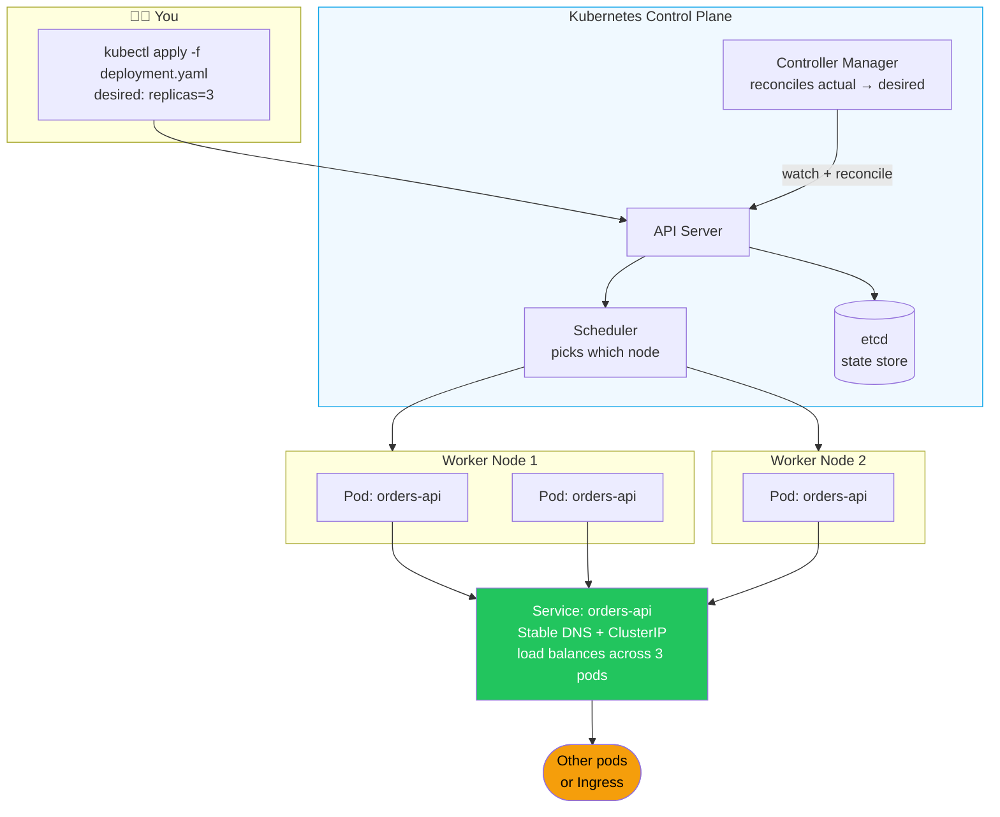

# Kubernetes From Scratch (for the Docker-fluent dev)

> [!info] For you specifically
> You know Docker. You know `docker run`, `docker-compose up`, port mappings, volumes, env vars. Kubernetes is what happens when you need to run those containers across **many machines** with self-healing, rolling updates, and discovery. This note is the bridge — Docker concept on the left, k8s equivalent on the right.

## The 5-minute mental model

> [!tip] Read this twice
> - You used to run **one container** on one host with `docker run`
> - Now you tell k8s: "I want **3 copies** of this container, **always**, behind a stable address"
> - K8s does the placing, restarting, scaling, and routing
> - You write **YAML** describing the *desired state*; k8s makes reality match it



## Docker → Kubernetes vocabulary map

| Docker | Kubernetes | Notes |
|--------|------------|-------|
| `docker run image` | **Pod** | A pod wraps 1+ containers (usually 1). Smallest deploy unit. |
| `docker-compose.yml` | **Deployment** + **Service** + **ConfigMap** | Multiple YAML files, but same intent |
| `docker run --restart=always` | **Deployment** | Automatically restarts crashed pods |
| `--scale=3` | `replicas: 3` in Deployment | Run N copies |
| Container port mapping | **Service** | Stable virtual IP/DNS pointing at pods |
| `docker network` | Cluster network (built-in) | All pods can reach all pods by default |
| `docker volume` | **PersistentVolumeClaim** | Storage that survives pod restarts |
| `--env-file` | **ConfigMap** + **Secret** | Non-secret vs secret config |
| `docker exec -it` | `kubectl exec -it` | Same idea |
| `docker logs` | `kubectl logs` | Same idea |
| `docker ps` | `kubectl get pods` | List running things |

## The core objects you must know

### 1. Pod — one (or more) running container

You rarely create pods directly. You create **Deployments** that create pods for you.

### 2. Deployment — "I want N replicas of this image, always"

```yaml
apiVersion: apps/v1
kind: Deployment
metadata:
  name: orders-api
spec:
  replicas: 3
  selector:
    matchLabels: { app: orders-api }
  template:
    metadata:
      labels: { app: orders-api }
    spec:
      containers:
        - name: app
          image: ghcr.io/me/orders-api:1.0.0
          ports: [{ containerPort: 8080 }]
```

K8s ensures 3 pods are always running. If one dies → started fresh. If you push `1.0.1` → rolling update one pod at a time.

### 3. Service — stable address for a Deployment

Pod IPs change every restart. You can't hard-code them. **Services** give you a stable DNS name.

```yaml
apiVersion: v1
kind: Service
metadata:
  name: orders-api
spec:
  selector: { app: orders-api }       # match pods with label app=orders-api
  ports:
    - port: 80
      targetPort: 8080
```

Now from any other pod in the cluster: `http://orders-api/...` works. K8s load-balances across the 3 replicas.

> [!tip] DNS naming
> Inside the cluster: `<service>.<namespace>.svc.cluster.local`. Within the same namespace, just `<service>` is enough.

### 4. ConfigMap — non-secret config

```yaml
apiVersion: v1
kind: ConfigMap
metadata: { name: orders-config }
data:
  SPRING_PROFILES_ACTIVE: prod
  EUREKA_CLIENT_SERVICEURL_DEFAULTZONE: http://eureka:8761/eureka/
```

Mount as env vars in the Deployment:

```yaml
envFrom:
  - configMapRef: { name: orders-config }
```

### 5. Secret — base64-encoded sensitive config

```yaml
apiVersion: v1
kind: Secret
metadata: { name: orders-secrets }
type: Opaque
stringData:
  SPRING_DATASOURCE_PASSWORD: super-secret
  JWT_SIGNING_KEY: another-secret
```

> [!warning] "Secret" ≠ encrypted
> Plain Secrets are just base64. Use **Sealed Secrets**, **External Secrets Operator**, or your cloud's secret manager (AWS Secrets Manager, GCP Secret Manager, Vault) for real protection.

### 6. Ingress — public HTTP entry point

```yaml
apiVersion: networking.k8s.io/v1
kind: Ingress
metadata: { name: orders-api }
spec:
  ingressClassName: nginx
  rules:
    - host: api.example.com
      http:
        paths:
          - path: /
            pathType: Prefix
            backend:
              service: { name: api-gateway, port: { number: 80 } }
```

In your stack, the Ingress points at **Spring Cloud Gateway**, which then routes internally. See [[09-Stack-Specific-Eureka-Gateway-Feign-on-K8s]].

### 7. Namespace — folder for resources

```bash
kubectl create namespace dev
kubectl apply -f orders.yaml -n dev
```

Namespaces isolate environments (`dev`, `staging`, `prod`) inside one cluster.

## kubectl — your daily driver

> [!tip] If you only learn 10 commands
> ```bash
> kubectl get pods                          # list pods in current namespace
> kubectl get pods -n dev -w                # watch pods in 'dev' namespace
> kubectl get all                           # everything in this namespace
> kubectl describe pod orders-api-abc123    # detailed status, events, errors
> kubectl logs orders-api-abc123 -f         # tail logs
> kubectl logs orders-api-abc123 --previous # logs from the *crashed* container
> kubectl exec -it orders-api-abc123 -- sh  # shell into a pod
> kubectl apply -f deployment.yaml          # create/update from YAML
> kubectl delete -f deployment.yaml         # remove
> kubectl port-forward svc/orders-api 8080:80  # tunnel to localhost
> ```

### Useful aliases

```bash
alias k=kubectl
alias kgp='kubectl get pods'
alias kgs='kubectl get svc'
alias kdp='kubectl describe pod'
alias kl='kubectl logs -f'
```

### Context & namespace

```bash
kubectl config get-contexts                # list clusters you can talk to
kubectl config use-context my-cluster      # switch
kubectl config set-context --current --namespace=dev  # default ns
```

## Local k8s for development

You don't need a cloud cluster to learn. Pick one:

| Tool | Notes |
|------|-------|
| **kind** | Kubernetes-in-Docker. Fast. `brew install kind && kind create cluster` |
| **minikube** | Mature, more features. `brew install minikube && minikube start` |
| **k3d** | k3s in Docker. Lightweight. |
| **Docker Desktop** | Has built-in k8s — toggle in settings |
| **Rancher Desktop** | Free, like Docker Desktop with k3s |

For your stack (Eureka + Gateway + multiple services), **kind** with 3-4 nodes is plenty.

## A complete worked example

Here's a Spring Boot service deployed properly:

```yaml
# orders-api.yaml — combine all in one file with `---` separators
apiVersion: v1
kind: ConfigMap
metadata:
  name: orders-config
  namespace: dev
data:
  SPRING_PROFILES_ACTIVE: prod
  EUREKA_CLIENT_SERVICEURL_DEFAULTZONE: http://eureka:8761/eureka/
  JAVA_TOOL_OPTIONS: "-XX:MaxRAMPercentage=75"
---
apiVersion: v1
kind: Secret
metadata:
  name: orders-secrets
  namespace: dev
type: Opaque
stringData:
  SPRING_DATASOURCE_PASSWORD: dev-password
---
apiVersion: apps/v1
kind: Deployment
metadata:
  name: orders-api
  namespace: dev
spec:
  replicas: 2
  selector:
    matchLabels: { app: orders-api }
  template:
    metadata:
      labels: { app: orders-api }
    spec:
      containers:
        - name: app
          image: ghcr.io/me/orders-api:1.0.0
          ports: [{ name: http, containerPort: 8080 }]
          envFrom:
            - configMapRef: { name: orders-config }
            - secretRef: { name: orders-secrets }
          resources:
            requests: { cpu: "250m", memory: "512Mi" }
            limits:   { cpu: "1",    memory: "768Mi" }
          startupProbe:
            httpGet: { path: /actuator/health/liveness, port: http }
            failureThreshold: 30
            periodSeconds: 10
          livenessProbe:
            httpGet: { path: /actuator/health/liveness, port: http }
          readinessProbe:
            httpGet: { path: /actuator/health/readiness, port: http }
            periodSeconds: 5
---
apiVersion: v1
kind: Service
metadata:
  name: orders-api
  namespace: dev
spec:
  selector: { app: orders-api }
  ports:
    - port: 80
      targetPort: http
```

Apply:

```bash
kubectl apply -f orders-api.yaml
kubectl get pods -n dev -w
kubectl logs -n dev -l app=orders-api -f
```

## Common newcomer mistakes

> [!warning] Pitfalls to avoid
> 1. **No resource requests/limits** → noisy neighbors, OOMKills with no warning
> 2. **No probes, or wrong probes** → either traffic to dead pods or restart loops. See [[05-Health-Checks-and-Readiness]]
> 3. **No `startupProbe` for Spring Boot** → JVM is too slow to boot before liveness fails. Always add one.
> 4. **`imagePullPolicy: Always` in dev with `:latest` tag** → unpredictable. Use semantic tags (`1.0.0`, sha-`abc123`).
> 5. **Hardcoding cluster IPs** → use Service names instead.
> 6. **Putting secrets in ConfigMap** — use Secret (and ideally a real secret manager).
> 7. **Skipping Namespaces** — always namespace dev/staging/prod. Easy to delete the wrong thing.
> 8. **Ignoring `kubectl describe`** → 90% of "why isn't my pod running" answers are in the **Events** section.

## Debugging flowchart

Pod won't start?

```
kubectl get pods                     # what's the status? (Pending / CrashLoopBackOff / ImagePullBackOff)
kubectl describe pod <name>          # read the Events section first
kubectl logs <name>                  # current logs
kubectl logs <name> --previous       # last crash
kubectl exec -it <name> -- sh        # shell in to poke around
kubectl get events --sort-by=.lastTimestamp  # cluster-wide events
```

| Status | Likely cause |
|--------|-------------|
| `Pending` | No node has resources. Check requests vs node capacity. |
| `ImagePullBackOff` | Wrong image name, or no registry credentials. |
| `CrashLoopBackOff` | App is crashing on startup. Check logs. |
| `OOMKilled` | Memory limit too low. |
| Ready 0/1 forever | Readiness probe failing. `describe` shows the failure. |

## Beyond the basics (when you're ready)

- **Helm** — package & template your YAML; install third-party charts
- **Kustomize** — overlay-based config (built into kubectl)
- **HorizontalPodAutoscaler** — scale on CPU/memory/custom metrics
- **PodDisruptionBudget** — guard against voluntary disruptions
- **NetworkPolicies** — east-west firewall rules
- **GitOps** with **ArgoCD** or **Flux** — k8s reconciles from a Git repo

## Where to learn next

- [[04-Kubernetes-Basics]] — full Spring Boot k8s manifests with HPA/PDB/Ingress
- [[09-Stack-Specific-Eureka-Gateway-Feign-on-K8s]] — your stack on k8s, gotchas and patterns
- [[05-Health-Checks-and-Readiness]] — probe semantics in depth
- [[02-Docker-for-Spring-Boot]] — building the image you'll deploy
- [[05-CI-CD-Pipeline-Example]] — automate it

## Related
- [[04-Kubernetes-Basics]]
- [[09-Stack-Specific-Eureka-Gateway-Feign-on-K8s]]
- [[02-Docker-for-Spring-Boot]]
- [[05-Health-Checks-and-Readiness]]
- [[06-Profiles-Per-Environment]]
- [[07-Twelve-Factor-Spring]]
