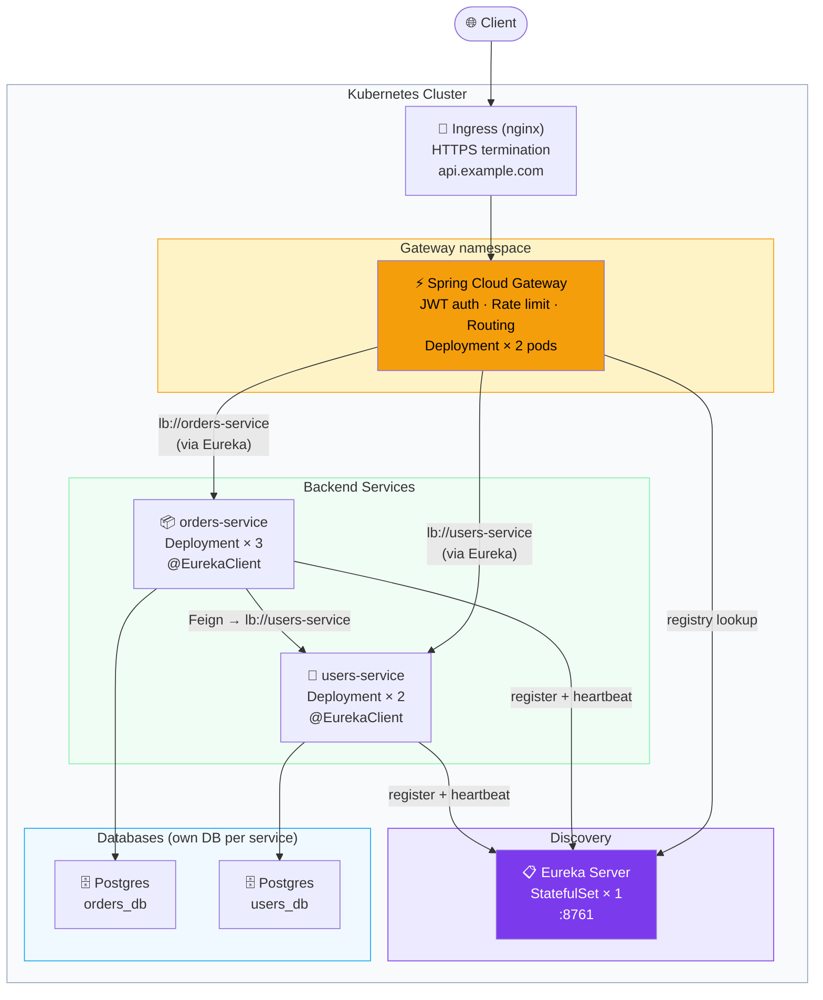

# Your Stack (Eureka + Gateway + Feign + Security + JPA) on Kubernetes

> [!info] What this note is
> A practical map for deploying *your specific* tech stack — Spring Cloud (Eureka client + Spring Cloud Gateway + OpenFeign), Spring Security, Spring Data JPA — to Kubernetes. There are real gotchas when these technologies meet k8s; this note collects them in one place.

## The big architectural question

> [!warning] Eureka + Kubernetes — read this first
> Kubernetes already provides **service discovery via DNS** (every Service gets a name like `orders-api.default.svc.cluster.local`). Eureka does the same job from inside your apps. **Running both is duplicate work** — and a common source of confusion.
>
> Two valid choices:
> 1. **Keep Eureka** — your code uses `@LoadBalanced` / Feign with logical names. Eureka tracks pods. K8s is just the runtime. Good if your team knows Spring Cloud well, or you're migrating from VMs.
> 2. **Drop Eureka, use k8s DNS** — replace `lb://orders-api` with `http://orders-api`. Simpler. The k8s-native path.
>
> This note covers **option 1** (since it's your stack) but flags where option 2 would be cleaner.

## Architecture overview



## 1. Eureka Server on k8s

Eureka itself is a Spring Boot app — but it has **state** (the registry) and clients keep heartbeating. Use a **StatefulSet** (not Deployment) so it gets a stable DNS name.

```yaml
apiVersion: apps/v1
kind: StatefulSet
metadata:
  name: eureka
spec:
  serviceName: eureka       # required for stable DNS
  replicas: 1               # bump to 2-3 for HA, then peer them
  selector:
    matchLabels: { app: eureka }
  template:
    metadata:
      labels: { app: eureka }
    spec:
      containers:
        - name: eureka
          image: ghcr.io/me/eureka-server:1.0.0
          ports: [{ name: http, containerPort: 8761 }]
          env:
            - name: SPRING_PROFILES_ACTIVE
              value: prod
            - name: EUREKA_INSTANCE_HOSTNAME
              valueFrom:
                fieldRef: { fieldPath: metadata.name }
          readinessProbe:
            httpGet: { path: /actuator/health/readiness, port: http }
          livenessProbe:
            httpGet: { path: /actuator/health/liveness, port: http }
---
apiVersion: v1
kind: Service
metadata:
  name: eureka
spec:
  clusterIP: None           # headless service for stable per-pod DNS
  selector: { app: eureka }
  ports:
    - port: 8761
      targetPort: http
```

Eureka server `application.yml`:

```yaml
spring:
  application:
    name: eureka-server
server:
  port: 8761
eureka:
  client:
    register-with-eureka: false   # the server doesn't register with itself
    fetch-registry: false
  server:
    enable-self-preservation: false   # disable in single-node dev/test
```

> [!tip] HA Eureka
> For production, run 2-3 Eureka pods that **peer with each other** via the headless service DNS. Each pod sets `eureka.client.service-url.defaultZone` to all peers' URLs.

## 2. Eureka Client config in your services

Every service (Orders, Users, Gateway) is a Eureka client:

```yaml
# application.yml in each service
spring:
  application:
    name: orders-api      # ← THIS is the name peers use to find you
eureka:
  client:
    service-url:
      defaultZone: ${EUREKA_CLIENT_SERVICEURL_DEFAULTZONE:http://localhost:8761/eureka/}
    register-with-eureka: true
    fetch-registry: true
  instance:
    prefer-ip-address: true              # use pod IP, not hostname
    instance-id: ${spring.application.name}:${random.uuid}
    lease-renewal-interval-in-seconds: 10
    lease-expiration-duration-in-seconds: 30
```

ConfigMap providing the URL:

```yaml
apiVersion: v1
kind: ConfigMap
metadata: { name: cloud-config }
data:
  EUREKA_CLIENT_SERVICEURL_DEFAULTZONE: http://eureka:8761/eureka/
```

> [!warning] prefer-ip-address: true
> Pod hostnames don't resolve cluster-wide. Pod IPs do (they're routable across the cluster). Without this, Feign calls fail with "Unknown host".

## 3. Spring Cloud Gateway as the entry point

Your Gateway is just another Eureka client — it discovers services through Eureka and routes traffic.

```yaml
spring:
  application:
    name: api-gateway
  cloud:
    gateway:
      discovery:
        locator:
          enabled: true
          lower-case-service-id: true
      routes:
        - id: orders
          uri: lb://orders-api          # lb:// = "look up via Eureka and load-balance"
          predicates:
            - Path=/orders/**
          filters:
            - StripPrefix=0
        - id: users
          uri: lb://users-api
          predicates:
            - Path=/users/**
```

Gateway Deployment + Service:

```yaml
apiVersion: apps/v1
kind: Deployment
metadata:
  name: api-gateway
spec:
  replicas: 2
  selector: { matchLabels: { app: api-gateway } }
  template:
    metadata: { labels: { app: api-gateway } }
    spec:
      containers:
        - name: app
          image: ghcr.io/me/api-gateway:1.0.0
          ports: [{ name: http, containerPort: 8080 }]
          envFrom:
            - configMapRef: { name: cloud-config }
          startupProbe:
            httpGet: { path: /actuator/health/liveness, port: http }
            failureThreshold: 30
            periodSeconds: 10
          livenessProbe:
            httpGet: { path: /actuator/health/liveness, port: http }
          readinessProbe:
            httpGet: { path: /actuator/health/readiness, port: http }
---
apiVersion: v1
kind: Service
metadata: { name: api-gateway }
spec:
  selector: { app: api-gateway }
  ports: [{ port: 80, targetPort: http }]
```

Then an **Ingress** points at `api-gateway` Service:

```yaml
apiVersion: networking.k8s.io/v1
kind: Ingress
metadata:
  name: public-api
  annotations:
    cert-manager.io/cluster-issuer: letsencrypt
spec:
  ingressClassName: nginx
  tls:
    - hosts: [api.example.com]
      secretName: api-tls
  rules:
    - host: api.example.com
      http:
        paths:
          - path: /
            pathType: Prefix
            backend:
              service: { name: api-gateway, port: { number: 80 } }
```

> [!tip] Public traffic flow
> Internet → Ingress (TLS) → Gateway Service → Gateway pods → (Eureka lookup) → backend Service pods.

## 4. Feign clients between services

Inside `orders-service`, calling `users-service`:

```java
@FeignClient(name = "users-api")    // ← Eureka service name
public interface UsersClient {
    @GetMapping("/api/users/{id}")
    UserDto getById(@PathVariable("id") Long id);
}
```

Enable on the main class:

```java
@SpringBootApplication
@EnableFeignClients
@EnableDiscoveryClient
public class OrdersApplication { ... }
```

Use it:

```java
@Service
@RequiredArgsConstructor
public class OrderService {
    private final UsersClient users;

    public OrderDto place(NewOrder cmd) {
        UserDto u = users.getById(cmd.userId());
        // ...
    }
}
```

### Propagating JWT through Feign

A common trap: the user hits Gateway with a JWT, Gateway forwards to Orders, Orders calls Users — but the JWT doesn't propagate. Add a `RequestInterceptor`:

```java
@Configuration
public class FeignAuthConfig {
    @Bean
    RequestInterceptor bearerTokenForwardingInterceptor() {
        return template -> {
            ServletRequestAttributes attrs = (ServletRequestAttributes) RequestContextHolder.getRequestAttributes();
            if (attrs == null) return;
            String auth = attrs.getRequest().getHeader(HttpHeaders.AUTHORIZATION);
            if (auth != null) template.header(HttpHeaders.AUTHORIZATION, auth);
        };
    }
}
```

Now Feign forwards the bearer token automatically. See [[04-JWT-with-Spring-Security]], [[07-OpenFeign]].

## 5. Spring Security at the Gateway vs at each service

Two patterns; pick one:

### Pattern A: Gateway authenticates, services trust the network

- Gateway validates JWT, injects user info as headers (`X-User-Id`, `X-User-Roles`)
- Backend services trust those headers and skip auth
- **Requires NetworkPolicies** so only the Gateway can reach backends
- Simpler services, more dangerous if perimeter fails

### Pattern B: Every service validates JWT (defense in depth)

- Gateway forwards the JWT
- Each service has Spring Security configured as an **OAuth2 Resource Server**, validating the JWT
- More CPU, but zero-trust

```java
// each service
@Bean
SecurityFilterChain api(HttpSecurity http) throws Exception {
    return http
        .authorizeHttpRequests(a -> a
            .requestMatchers("/actuator/health/**").permitAll()
            .anyRequest().authenticated())
        .oauth2ResourceServer(o -> o.jwt(Customizer.withDefaults()))
        .sessionManagement(s -> s.sessionCreationPolicy(SessionCreationPolicy.STATELESS))
        .csrf(CsrfConfigurer::disable)
        .build();
}
```

```yaml
spring:
  security:
    oauth2:
      resourceserver:
        jwt:
          issuer-uri: ${JWT_ISSUER_URI}
```

> [!tip] Recommendation
> Start with **Pattern B** — validating per-service is cheap, more secure, and survives misconfiguration of NetworkPolicies. See [[01-Spring-Security-Concepts]], [[08-OAuth2-Resource-Server]].

## 6. Spring Data JPA + k8s

JPA itself doesn't change in k8s. The wiring does:

```yaml
# application.yml — env vars come from Secret
spring:
  datasource:
    url: jdbc:postgresql://${DB_HOST}:5432/${DB_NAME}
    username: ${DB_USER}
    password: ${DB_PASSWORD}
    hikari:
      maximum-pool-size: 10
  jpa:
    hibernate:
      ddl-auto: validate          # NEVER use 'update' or 'create' in prod
  flyway:
    enabled: true
    baseline-on-migrate: true
```

Key practices:
- **Database per service** — Postgres pod (or a managed service like RDS) per microservice
- **Migrations**: Flyway runs on app startup. Init container alternative for stricter control.
- **Connection pool sizing**: `replicas × max-pool-size` should not exceed Postgres `max_connections`. With 3 replicas × 10 = 30 connections. Plan capacity.
- **Don't bake DB creds into images** — always Secret-mounted env vars

See [[01-JDBC-vs-JPA-vs-Hibernate]], [[07-Schema-Migration]], [[08-DataSource-Connection-Pool]].

## 7. Putting it all together — deployment order

```
1. Postgres (StatefulSet or managed)
2. Eureka Server (StatefulSet)
3. (wait until Eureka is Ready)
4. Backend services (Orders, Users, ...) — Deployments
5. (services register with Eureka)
6. API Gateway — Deployment
7. Ingress
```

If you use ArgoCD/Flux, define **sync waves** so they deploy in this order. Otherwise k8s starts everything at once and services retry until Eureka is up — usually fine, but startup is noisier.

## 8. Common stack-on-k8s gotchas

> [!warning] Things that will bite you
> 1. **Eureka cache lag** — when a pod dies, Eureka takes ~30-90s to evict it. Feign calls fail in that window. Mitigation: tune `lease-expiration-duration-in-seconds` lower; configure Resilience4j retry/circuit breaker. See [[08-Resilience4j]].
> 2. **Pod IP changes** — a redeployed pod gets a new IP. With `prefer-ip-address: true` Eureka handles re-registration. Without it, stale entries break Feign calls.
> 3. **Slow JVM startup vs probes** — always use a **startupProbe** (covered in [[05-Health-Checks-and-Readiness]]). Without it, k8s kills the pod before Spring finishes booting.
> 4. **Gateway's reactive stack** — Spring Cloud Gateway is built on **WebFlux** (reactive). Don't add `spring-boot-starter-web` to it — they conflict and the app won't start. Use `spring-boot-starter-webflux` only.
> 5. **Memory limits + JVM** — set `-XX:MaxRAMPercentage=75` so the JVM respects the cgroup limit. Without it, you'll see OOMKills.
> 6. **JWT clock skew** — pods on different nodes may have small time drift. Allow `clock-skew: 60s` in Spring Security JWT config.
> 7. **Logs from many pods** — `kubectl logs -l app=orders-api -f --max-log-requests=10` tails all replicas. For real life, ship to Loki/ELK and query there.
> 8. **Eureka self-preservation** — in dev/test it triggers spuriously and refuses to evict dead pods. Disable: `eureka.server.enable-self-preservation: false`.

## 9. Should you actually use Eureka in k8s?

> [!tip] Honest recommendation
> If you're starting fresh on k8s, consider **Spring Cloud Kubernetes Discovery** instead. It uses k8s's native Service registry — no separate Eureka pods, no double bookkeeping. Your Feign clients still use logical names; the resolution just goes through k8s.
>
> ```xml
> <dependency>
>     <groupId>org.springframework.cloud</groupId>
>     <artifactId>spring-cloud-starter-kubernetes-client-loadbalancer</artifactId>
> </dependency>
> ```
>
> But your stack already chose Eureka — fine. It works. Just understand the tradeoff so future-you can decide whether to migrate.

## 10. Local dev for this stack

You have several options ranked by complexity:

| Option | Setup | Faithfulness |
|--------|-------|--------------|
| **Run apps in IDE, Eureka in Docker** | `docker run -p 8761:8761 eureka-image`, IDE points at `localhost:8761` | High; fastest dev loop |
| **docker-compose** | All services in one compose file | Higher; closer to k8s |
| **kind / minikube** | Apply your real k8s manifests locally | Highest; matches prod |
| **Tilt / Skaffold** | Auto-rebuild + redeploy on save | Highest; best DX |

For learning k8s, do `kind` + raw manifests. Then graduate to Tilt.

## What to read next

- [[08-Kubernetes-From-Scratch]] — k8s primer if any of this felt fast
- [[03-Service-Discovery-Eureka]] — Eureka deep-dive
- [[04-API-Gateway-Spring-Cloud-Gateway]] — Gateway routing/filters
- [[07-OpenFeign]] — Feign config, error decoders, retries
- [[08-Resilience4j]] — circuit breakers around Feign calls
- [[02-Configuration-and-SecurityFilterChain]] — Spring Security 6 config
- [[04-JWT-with-Spring-Security]] — JWT issuance & validation

## Related
- [[08-Kubernetes-From-Scratch]]
- [[04-Kubernetes-Basics]]
- [[02-Spring-Cloud-Overview]]
- [[03-Service-Discovery-Eureka]]
- [[04-API-Gateway-Spring-Cloud-Gateway]]
- [[07-OpenFeign]]
- [[08-Resilience4j]]
- [[01-Spring-Security-Concepts]]
- [[04-JWT-with-Spring-Security]]
- [[05-Health-Checks-and-Readiness]]
- [[02-Docker-for-Spring-Boot]]
