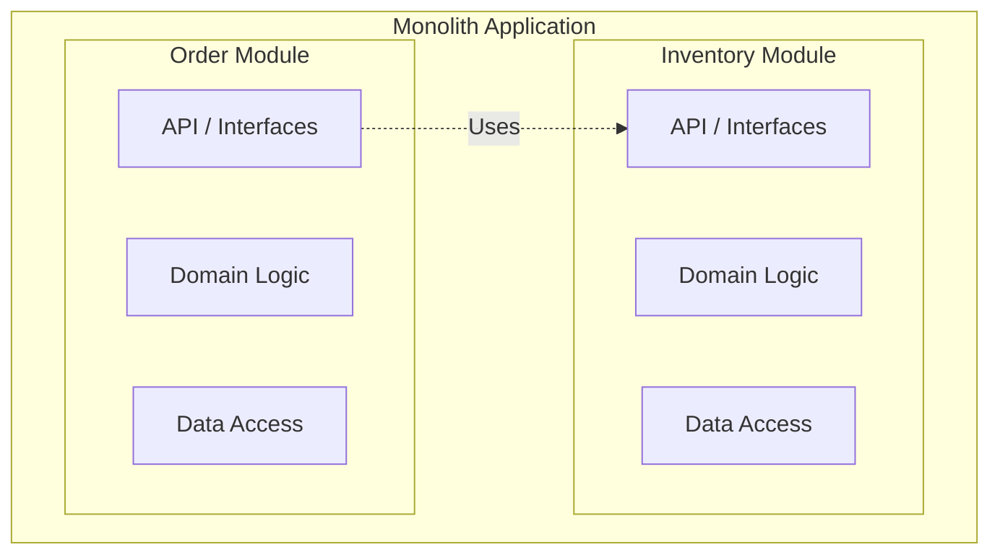

# Spring Modulith Concepts

> [!info] Introduction
> Spring Modulith is an experimental/incubating project (and now a top-level Spring project) that helps developers build well-structured Spring Boot applications. It encourages building monolithic applications with a modular structure, leading to better maintainability and testability before considering a microservices architecture.

## The Monolith-First Approach

Often, teams start with microservices to achieve decoupling, but this brings distributed system complexities (network latency, data consistency, deployment overhead). 

> [!quote] 
> "You shouldn't start a new project with microservices, even if you're sure your application will be big enough to make it worthwhile." - Martin Fowler

Spring Modulith advocates for a **Monolith-First** approach:
1. Start with a single deployment unit (Monolith).
2. Structure the monolith internally into logical modules.
3. Enforce boundaries between these modules.
4. Extract modules into microservices *only* when necessary (e.g., different scaling requirements).

## Architecture Overview

A modular monolith aims to have high cohesion within a module and low coupling between modules.

In a traditional monolith, the `Order Module` might bypass `API_A` and directly access `Data_A` or `Domain_A`. Spring Modulith helps prevent this by allowing you to define clear, verifiable boundaries (see [[03-Encapsulation-and-Verification]]).

## Key Features

- **Structural Validation**: Verifies that your code adheres to the modular architecture you define.
- **Integration Testing**: Allows testing individual modules in isolation without bringing up the entire Spring Boot context (see [[05-Testing-Modules]]).
- **Documentation**: Generates architectural documentation (C4 models, UML) based on the code structure (see [[06-Documentation-and-Actuator]]).
- **Event-Driven Interactions**: Encourages asynchronous communication between modules using application events (see [[04-Events-and-Async]]).

Next: Learn about [[02-Application-Modules|Application Modules]].
