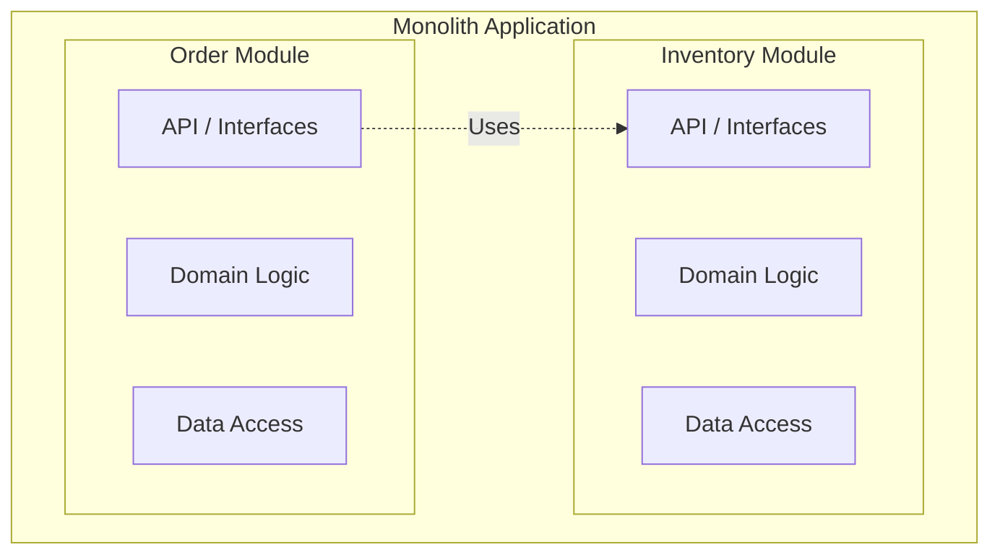

# Spring Modulith Concepts

> [!info] Introduction
> Spring Modulith ek experimental/incubating project tha (ab top-level Spring project ban chuka hai) jo developers ko well-structured Spring Boot applications banane mein help karta hai. Iska idea simple hai — monolithic application banao lekin usko andar se modular structure do. Isse maintainability aur testability dono better ho jaati hai, aur microservices architecture pe jaane se pehle hi tumhe woh benefits mil jaate hain jo modularity se aate hain.

## The Monolith-First Approach

Kya hota hai? Zyada teams ek common mistake karti hain — Day 1 se hi microservices leke baith jaati hain, sirf isliye ki "decoupling" chahiye. Lekin isse distributed system ki saari complexities bhi saath mein aa jaati hain — network latency, data consistency ke jhanjhat, deployment overhead, aur na jaane kya kya. Socho, tum Zomato jaisa app bana rahe ho aur Day 1 se hi "Order Service", "Payment Service", "Inventory Service" alag-alag microservices bana diye — jab tumhare paas total 100 users bhi nahi hain, tab bhi tumhe network calls, service discovery, aur distributed transactions handle karni pad rahi hain. Yeh waste of energy hai.

> [!quote] 
> "You shouldn't start a new project with microservices, even if you're sure your application will be big enough to make it worthwhile." - Martin Fowler

Spring Modulith isi wajah se **Monolith-First** approach ka advocate karta hai:
1. Ek single deployment unit (Monolith) se start karo.
2. Monolith ke andar hi logical modules mein structure karo.
3. In modules ke beech boundaries enforce karo (jaise strict rules — koi bhi module doosre ke internal implementation mein ghus na sake).
4. Jab zaruri ho tabhi modules ko microservices mein extract karo (jaise, jab kisi module ko alag scaling requirement ho — matlab "Payment" module ko suddenly 10x zyada traffic handle karna pade to usko alag nikaal do).

Yeh bilkul waise hai jaise Swiggy shuru mein ek hi codebase mein Orders, Restaurants, aur Delivery logic rakhta hoga, aur jab scale badha tab hi unhe alag services mein break kiya hoga — na ki Day 1 se hi over-engineer kar diya.

## Architecture Overview

Kya hota hai ek modular monolith mein? Goal hota hai — **har module ke andar high cohesion** (matlab module ke andar ki cheezein aapas mein strongly related hon) aur **modules ke beech low coupling** (matlab ek module doosre pe zyada depend na kare, aur agar depend kare bhi to sirf uske public API ke through).

Ek traditional monolith mein jo aksar hota hai (aur galat hota hai) — `Order Module` seedha `API_A` ko skip karke `Data_A` ya `Domain_A` ko directly access kar leta hai. Yeh bilkul waisa hai jaise tum Swiggy ke "Order" wale code mein directly "Restaurant" module ke database table ko query kar lo, uske proper service/API ka use kiye bina. Isse dono modules itne tightly coupled ho jaate hain ki kal ko agar Restaurant module ka internal data structure change hua, to Order module bhi tut jaayega — aur pata bhi nahi chalega compile time pe.

Spring Modulith isi problem ko solve karta hai — yeh tumhe clear, verifiable boundaries define karne deta hai, taaki koi module "shortcut" na le sake (dekho [[03-Encapsulation-and-Verification]]).

## Key Features

- **Structural Validation**: Yeh check karta hai ki tumhara code us modular architecture ko follow kar raha hai jo tumne define ki hai. Agar koi module rules break karta hai (jaise doosre module ke internal class ko directly access karna), to yeh build time pe hi error de dega — production mein jaake surprise nahi milega.
- **Integration Testing**: Poora Spring Boot context uthaaye bina, individual modules ko isolation mein test karne deta hai (dekho [[05-Testing-Modules]]). Matlab agar tumhe sirf "Order" module test karna hai, to poore application ka context load karne ki zarurat nahi — bas usi module ka context spin up hoga, testing fast ho jaati hai.
- **Documentation**: Code structure ke basis pe architectural documentation (C4 models, UML) automatically generate karta hai (dekho [[06-Documentation-and-Actuator]]). Matlab tumhe manually diagrams banake update karte rehne ki zarurat nahi — code hi source of truth hai.
- **Event-Driven Interactions**: Modules ke beech asynchronous communication ko encourage karta hai, application events ke through (dekho [[04-Events-and-Async]]). Jaise UPI transaction complete hone pe "Notification" module ko event ke through inform karna, na ki directly method call karke tightly couple ho jaana.

Next: [[02-Application-Modules|Application Modules]] ke baare mein padho.
