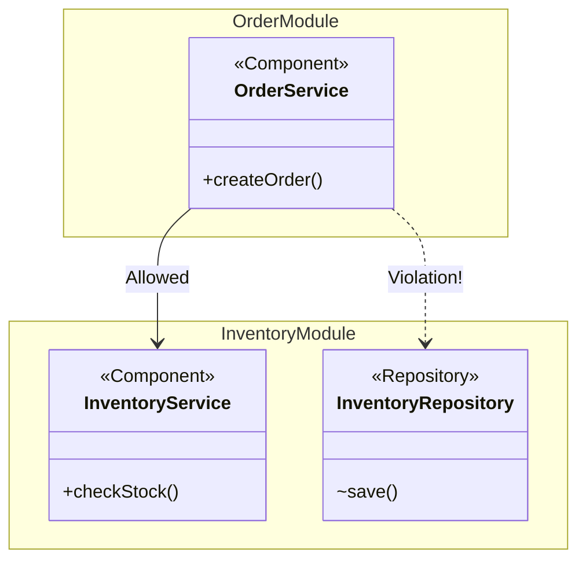

# Application Modules

In Spring Modulith, an application is composed of several logical modules. By default, Spring Modulith infers these modules based on the Java package structure.

## Domain Structuring

To define a module, you typically place it in a direct sub-package of the application's main package.

Example structure:
```text
com.example.shop
 ├── ShopApplication.java
 ├── inventory       <-- Module: "inventory"
 │    ├── InventoryService.java
 │    └── ...
 └── order           <-- Module: "order"
      ├── OrderService.java
      └── ...
```

In this structure, `inventory` and `order` are automatically recognized as distinct application modules.

> [!tip] Best Practice
> Name your top-level module packages according to the business domain (e.g., `inventory`, `order`, `customer`), rather than technical layers (e.g., `controllers`, `services`, `repositories`).

## The `@ApplicationModule` Annotation

While package conventions are the easiest way to define modules, you can explicitly configure a module using the `@ApplicationModule` annotation on a `package-info.java` file.

```java
// src/main/java/com/example/shop/order/package-info.java
@ApplicationModule(
    displayName = "Order Management"
)
package com.example.shop.order;

import org.springframework.modulith.ApplicationModule;
```

### Module Dependencies

You can also use `@ApplicationModule` to restrict which other modules this module is allowed to depend on.

```java
@ApplicationModule(
    allowedDependencies = "inventory" // Order module can only depend on inventory
)
package com.example.shop.order;
```

## Module Boundaries

By default, any Spring Bean (or public class) located directly in the module's base package (e.g., `com.example.shop.inventory`) is considered part of the module's **API** and can be accessed by other modules.

Classes in sub-packages (e.g., `com.example.shop.inventory.internal`) are considered internal to the module and should not be accessed from the outside.



To enforce these boundaries, we use structural verification. See [[03-Encapsulation-and-Verification]].
