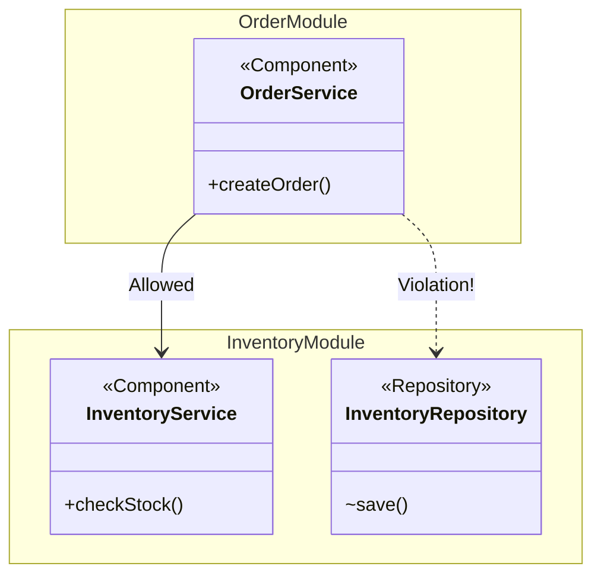

# Application Modules

Socho tumne ek Node.js monorepo banaya hai jisme `services/inventory` aur `services/order` alag folders hain — aur bina kisi extra config ke, tumhara tooling khud pehchaan leta hai ki yeh do alag "modules" hain, apne alag boundaries ke saath. Spring Modulith bilkul yehi karta hai, lekin Spring Boot ke andar. Ek Spring Boot application ko woh chhote-chhote logical modules mein todta hai, aur by default yeh Java ke package structure se hi decide hota hai — koi extra XML ya config file nahi chahiye.

## Domain Structuring

**Kya hota hai?** Spring Modulith tumhare main application package ke andar jo bhi direct sub-packages hain, unhe automatically ek-ek "module" maan leta hai. Bas itna hi karna hai — apna code sahi folder mein daal do, baaki kaam Modulith khud kar lega.

Example structure dekho:
```text
com.example.shop
 ├── ShopApplication.java
 ├── inventory       <-- Module: "inventory"
 │    ├── InventoryService.java
 │    └── ...
 └── order           <-- Module: "order"
      ├── OrderService.java
      └── ...
```

Is structure mein, `inventory` aur `order` — dono automatically alag-alag application modules ke roop mein recognize ho jaate hain. Kisi annotation ki bhi zaroorat nahi padi, package structure hi kaafi hai.

Node.js background se socho toh — yeh kuch-kuch waisa hai jaise tumne `src/modules/inventory` aur `src/modules/order` bana ke apna Express app organize kiya ho, sirf yahan Spring Modulith is convention ko *enforce* bhi karta hai (isके baare mein next file mein baat karenge — encapsulation aur verification).

> [!tip] Best Practice
> Apne top-level module packages ko business domain ke hisaab se naam do (jaise `inventory`, `order`, `customer`), na ki technical layers ke hisaab se (jaise `controllers`, `services`, `repositories`). Zomato ka example lo — agar tum `order`, `restaurant`, `delivery`, `payment` jaise domain-based modules banao, toh code samajhna aur maintain karna kaafi aasan ho jaata hai, compared to ek `controllers` folder jisme sab kuch ek saath thoka ho.

## `@ApplicationModule` Annotation

**Kyun zaruri hai?** Package convention se kaam chal jaata hai zyada tar cases mein, lekin kabhi-kabhi tumhe module ke baare mein extra jaankari deni hoti hai — jaise uska display name, ya woh kin dusre modules pe depend kar sakta hai. Iske liye `@ApplicationModule` annotation use karte hain, jo `package-info.java` file pe lagayi jaati hai.

```java
// src/main/java/com/example/shop/order/package-info.java
@ApplicationModule(
    displayName = "Order Management"
)
package com.example.shop.order;

import org.springframework.modulith.ApplicationModule;
```

Yeh kaafi had tak Java ke `package.json`-type metadata jaisa hai — bas yeh runtime pe module ki documentation aur structure verification ke kaam aata hai.

### Module Dependencies

Yahan asli maza aata hai. `@ApplicationModule` ka use karke tum yeh bhi restrict kar sakte ho ki yeh module sirf kin-kin dusre modules pe depend kar sakta hai — baaki sab pe dependency le liya toh build/verification fail ho jayegi.

```java
@ApplicationModule(
    allowedDependencies = "inventory" // Order module can only depend on inventory
)
package com.example.shop.order;
```

Socho jaise IRCTC ka `booking` module sirf `train-schedule` module ko call kar sakta hai, lekin `payment` module ko directly touch nahi kar sakta — usko `payment-gateway` module ke through hi jaana padega. Yeh restriction accidental "spaghetti dependencies" ko rokta hai jahan har module har module ko call kar raha ho.

> [!warning] Common Mistake
> Agar tum `allowedDependencies` set nahi karte, toh by default module kisi bhi doosre module pe depend kar sakta hai. Bade projects mein yeh dheere-dheere ek unmanageable dependency web bana deta hai — Node.js mein jaise bina kisi lint rule ke koi bhi service kisi bhi service ko import karne lage.

## Module Boundaries

**Yeh kaam kaise karta hai?** By default, jo bhi Spring Bean (ya public class) module ke *base package* mein directly rakha hota hai (jaise `com.example.shop.inventory`), woh us module ka **API** maana jaata hai — yaani dusre modules use isse access kar sakte hain.

Lekin jo classes sub-packages mein hain (jaise `com.example.shop.inventory.internal`), woh us module ke liye **internal** maani jaati hain — inhe bahar se access nahi karna chahiye.

Yeh bilkul Node.js mein `index.js` se `export` karne jaisa concept hai — jo tum `module.exports` mein daalte ho woh public API hai, baaki sab internal implementation detail hai jise consumer ko touch nahi karna chahiye. Farak sirf itna hai ki Spring Modulith is convention ko sirf documentation tak seemit nahi rakhta, balki verification ke through *enforce* bhi kar sakta hai.



Is diagram mein dekho — `OrderService` ka `InventoryService` ko call karna theek hai kyunki `InventoryService` module ka public API hai. Lekin `OrderService` ka seedha `InventoryRepository` ko access karna ek **violation** hai, kyunki repository internal implementation detail hai — yeh toh aise hi hai jaise Swiggy ka `order-service` seedha `restaurant-service` ke database table ko query karne lage, uske API ko bypass karke. Chalta toh hai, par galat hai — aur aage jaake maintenance ka sardard bana dega.

To in boundaries ko enforce karne ke liye, hum structural verification use karte hain. Iske baare mein detail mein [[03-Encapsulation-and-Verification]] mein padhenge.

## Key Takeaways

- Spring Modulith by default Java package structure se hi application modules infer kar leta hai — main package ke direct sub-packages alag modules ban jaate hain.
- Modules ko business domain ke naam do (`order`, `inventory`), technical layer ke naam nahi (`controllers`, `services`).
- `@ApplicationModule` annotation `package-info.java` pe lagakar tum module ka display name aur `allowedDependencies` set kar sakte ho, jisse accidental cross-module dependencies rokh sako.
- Module ke base package ki classes uska **public API** hoti hain; sub-packages (jaise `.internal`) **internal** maani jaati hain aur bahar se access nahi honi chahiye.
- Yeh sab conventions sirf documentation nahi hain — Spring Modulith inhe actual verification ke through enforce kar sakta hai, jisse architecture drift build-time pe hi pakda jaata hai.
