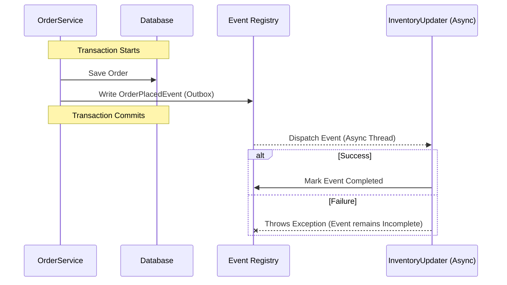

# Events and Asynchronous Interactions

Socho tumne [[02-Application-Modules|Application Modules]] wala setup bana liya, aur ab `Order` module directly `Inventory` module ka service call kar raha hai. Yeh dikhne mein simple hai, lekin isse tight coupling ban jaati hai — `Order` module ko `Inventory` module ke baare mein sab kuch pata hona chahiye: uska class, uska method signature, uska package. Matlab Zomato ka "Order Placement" system agar directly "Restaurant Kitchen Display" system ko call kare, toh dono systems ek doosre se chipak jaate hain. Kal agar Kitchen Display system ka API change ho gaya, toh Order Placement bhi tootega.

Isi problem ko solve karne ke liye Spring Modulith event-driven architecture ko promote karta hai — Spring ke apne built-in **Application Events** ka use karke.

## Publishing Events — Kya Hota Hai?

Idea simple hai: ek module doosre module ko directly call nahi karta. Bas itna karta hai — "Bhai, yeh cheez ho gayi hai, jisko interest hai woh sun le." Yeh exactly waisa hi hai jaise UPI transaction hone ke baad ek event fire hota hai, aur alag-alag services (notification, analytics, fraud-check) us event ko independently sunti hain — kisi ko kisi ke baare mein pata hone ki zaroorat nahi.

```java
// Inside the Order module
@Service
public class OrderService {
    private final ApplicationEventPublisher events;

    public void placeOrder(Order order) {
        // 1. Save order to DB...
        
        // 2. Publish event
        events.publishEvent(new OrderPlacedEvent(order.getId()));
    }
}
```

Yahan `OrderService` ko `Inventory` module ka naam tak nahi pata. Woh bas ek event publish karke apna kaam khatam kar deta hai. Node.js background se aaye ho toh isko `EventEmitter.emit('order.placed', orderId)` jaisa treat kar sakte ho — bas yahan Spring ka `ApplicationEventPublisher` yeh kaam karta hai.

## Consuming Events with `@ApplicationModuleListener`

Ab doosre modules is event ko sun sakte hain. Spring Modulith ek special annotation deta hai — `@ApplicationModuleListener` — jo Spring ke do powerful features ko combine karta hai: `@TransactionalEventListener` aur `@Async`.

```java
// Inside the Inventory module
@Component
public class InventoryUpdater {

    @ApplicationModuleListener
    void on(OrderPlacedEvent event) {
        // Update stock based on the order...
    }
}
```

### `@ApplicationModuleListener` Kyun Zaruri Hai?

1. **Transactional**: By default, yeh listener `AFTER_COMMIT` phase mein chalta hai — matlab jo transaction event ko publish kar raha tha, pehle woh poora commit ho jaye database mein, tabhi listener trigger hoga. Iska matlab hai inventory sirf tabhi update hogi jab order successfully DB mein save ho chuka ho. Agar order save karte waqt koi error aa gaya aur transaction rollback ho gaya, toh inventory update ka event kabhi trigger hi nahi hoga — bilkul waise jaise agar Swiggy ka payment fail ho jaaye toh restaurant ko order ka notification hi nahi jaana chahiye.
2. **Asynchronous**: Yeh listener ek alag thread mein chalta hai. `OrderService` ko inventory update complete hone ka wait nahi karna padta — order place hote hi user ko turant response mil jaata hai, background mein inventory quietly update hoti rehti hai.

> [!warning] Error Handling
> Ab yahan ek real problem aati hai — agar asynchronous listener fail ho jaaye toh? Original transaction toh already commit ho chuka hai (order DB mein save ho chuka hai), lekin inventory update fail ho gaya. Is case mein event permanently lost ho sakta hai! Isi problem ko solve karne ke liye Spring Modulith **Event Publication Registry** deta hai.

## Event Publication Registry (Outbox Pattern)

Reliable event delivery ensure karne ke liye, Spring Modulith **Transactional Outbox Pattern** implement karta hai. Yeh pattern distributed systems mein bahut common hai — socho jaise IRCTC apne ticket-booking confirmation ko kisi background job ke through retry karta hai jab tak SMS/email successfully bhej na diya jaaye. Yahan bhi wahi philosophy hai.

Jab ek event publish hota hai aur `@ApplicationModuleListener` usse intercept karta hai, toh yeh steps hote hain:

1. Spring Modulith event ko serialize karke ek special table (jaise `event_publication`) mein likh deta hai — aur yeh write *usi transaction* mein hota hai jisme business logic (jaise order save karna) chal raha hota hai. Matlab agar order save fail hua, toh event bhi table mein nahi jaayega — dono ek saath commit ya rollback hote hain.
2. Uske baad async listener ko invoke karta hai.
3. Agar listener successfully complete ho jaata hai, event registry mein "completed" mark ho jaata hai.
4. Agar listener fail ho jaata hai, event registry mein "incomplete" state mein pada rehta hai — lost nahi hota!

Yeh incomplete events permanently pade nahi rehte. Tum Spring Modulith ko configure kar sakte ho ki woh startup pe automatically incomplete event publications ko retry kare, ya phir tum manually bhi retry trigger kar sakte ho. Basically yeh ek safety net hai — jaise CRED ka payment reconciliation system jo failed transactions ko background mein baar-baar check karta rehta hai jab tak woh resolve na ho jaayen.



> [!tip] Node.js Comparison
> Agar tumne kabhi message queues (RabbitMQ, Kafka, ya BullMQ) use kiye hain Node.js mein reliable background jobs ke liye, toh yeh concept familiar lagega. Fark sirf itna hai ki yahan tumhe alag se koi message broker setup nahi karna padta — Spring Modulith yeh sab kuch tumhare existing database table ke through hi handle kar leta hai. Simplicity ka fayda hai, lekin scale badhne pe proper message broker ki zaroorat pad sakti hai.

Is asynchronous behavior ko test kaise karte hain, woh cover kiya gaya hai [[05-Testing-Modules]] mein.
