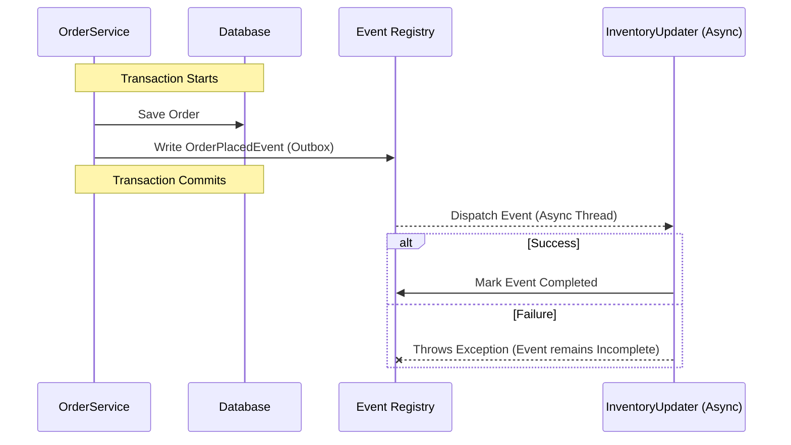

# Events and Asynchronous Interactions

Direct method calls between [[02-Application-Modules|Application Modules]] create strong coupling. If the `Order` module directly calls the `Inventory` module, it needs to know about it. 

To achieve loose coupling, Spring Modulith encourages event-driven architecture using Spring Application Events.

## Publishing Events

Instead of calling a service in another module, a module publishes a domain event.

```java
// Inside the Order module
@Service
public class OrderService {
    private final ApplicationEventPublisher events;

    public void placeOrder(Order order) {
        // 1. Save order to DB...
        
        // 2. Publish event
        events.publishEvent(new OrderPlacedEvent(order.getId()));
    }
}
```

## Consuming Events with `@ApplicationModuleListener`

Other modules can listen to these events. Spring Modulith provides `@ApplicationModuleListener`, which is a specialization of Spring's `@TransactionalEventListener` and `@Async`.

```java
// Inside the Inventory module
@Component
public class InventoryUpdater {

    @ApplicationModuleListener
    void on(OrderPlacedEvent event) {
        // Update stock based on the order...
    }
}
```

### Why `@ApplicationModuleListener`?

1. **Transactional**: By default, it runs in the `AFTER_COMMIT` phase of the transaction that published the event. This means the inventory is only updated if the order was successfully saved to the database.
2. **Asynchronous**: It executes the listener in a separate thread. The `OrderService` doesn't have to wait for the inventory update to complete.

> [!warning] Error Handling
> What if the asynchronous listener fails? Since the original transaction has already committed, you might lose the event! This brings us to the Event Publication Registry.

## Event Publication Registry (Outbox Pattern)

To ensure reliable delivery of asynchronous events, Spring Modulith implements the **Transactional Outbox Pattern**.

When an event is published and intercepted by an `@ApplicationModuleListener`:
1. Spring Modulith serializes the event and writes it to a special table (e.g., `event_publication`) in the *same transaction* as the business logic (e.g., saving the order).
2. It then invokes the async listener.
3. If the listener succeeds, the event is marked as completed.
4. If the listener fails, the event remains incomplete in the registry.

You can configure Spring Modulith to automatically retry incomplete event publications on startup, or you can trigger retries manually.



Testing this asynchronous behavior is covered in [[05-Testing-Modules]].
