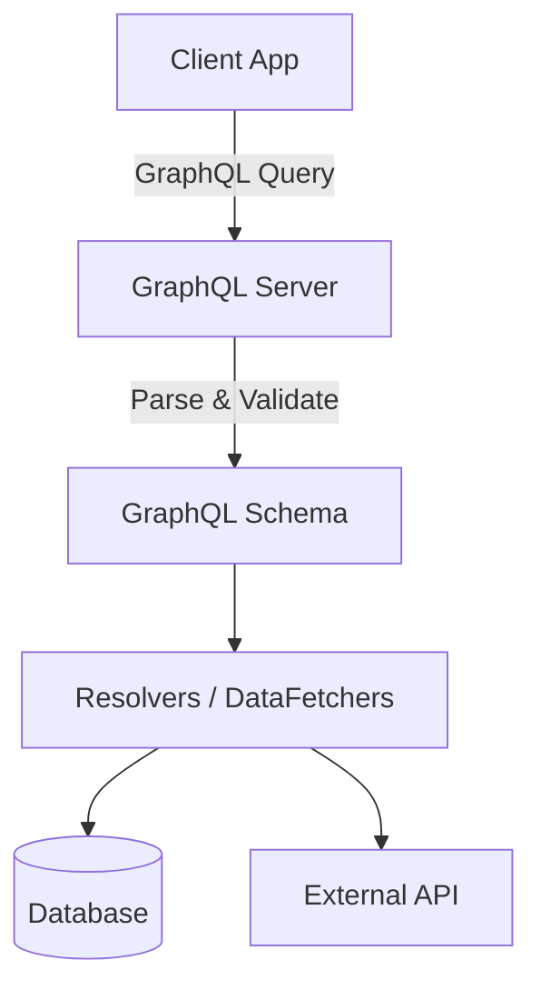

# GraphQL Concepts

> [!info] What is GraphQL?
> GraphQL is a query language for APIs and a runtime for fulfilling those queries with your existing data. It provides a complete and understandable description of the data in your API, gives clients the power to ask for exactly what they need and nothing more.

## GraphQL vs REST

| Feature | REST | GraphQL |
| :--- | :--- | :--- |
| **Data Fetching** | Multiple endpoints, often leads to over-fetching or under-fetching. | Single endpoint, exact data requested is returned. |
| **Schema** | Implicit or documented externally (e.g., OpenAPI). | Strongly typed schema (SDL) is central to the API. |
| **Versioning** | Often requires `/v1/`, `/v2/` in URLs. | Evolution is easier; deprecate fields instead of versioning. |

## Schema Definition Language (SDL)

The Schema Definition Language (SDL) is used to define the structure of a GraphQL API.

```graphql
type Book {
  id: ID!
  title: String!
  author: Author!
}

type Author {
  id: ID!
  name: String!
}

type Query {
  bookById(id: ID!): Book
}
```

> [!note] Schema Location in Spring
> In Spring Boot, the schema files (usually `.graphqls`) are placed in `src/main/resources/graphql/`.

## Architecture Diagram



**Next:** [[02-Queries-and-Controllers]]
