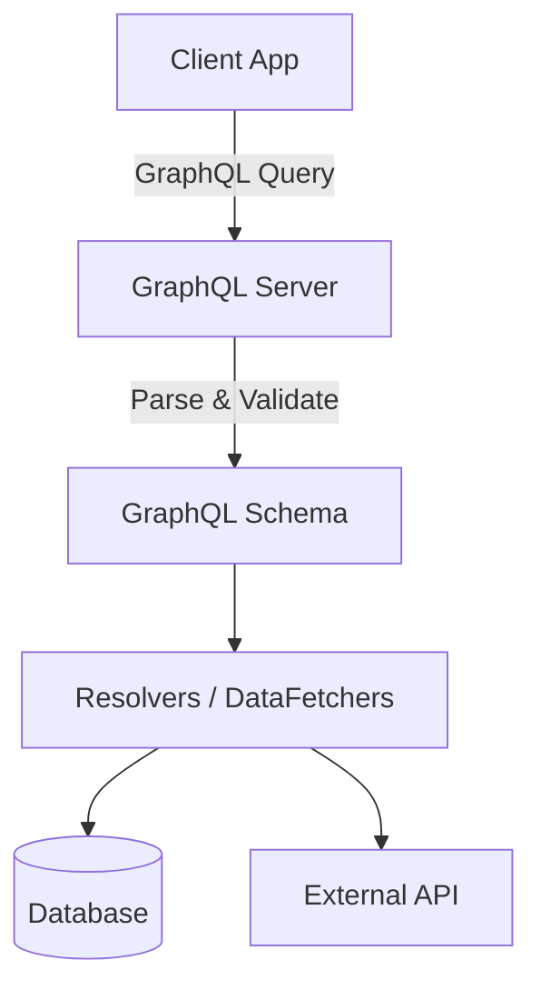

# GraphQL Concepts

## GraphQL hai kya cheez?

Socho tum Zomato ka app bana rahe ho. Home screen pe tumhe restaurant ka sirf **naam, rating aur delivery time** chahiye — poora menu, reviews, owner details kuch nahi chahiye. Ab REST API mein agar `/restaurants/{id}` endpoint hit karoge, woh backend wala bhai tumhe **poora restaurant object** bhej dega — menu, address, reviews, sab kuch — chahe tumne maanga ho ya nahi. Isko bolte hain **over-fetching**.

Aur ulta case bhi hota hai — kabhi tumhe restaurant ka data + uske top 3 reviews bhi chahiye hote hain ek hi screen pe, toh REST mein tumko **do alag calls** maarni padti hain: `/restaurants/{id}` aur `/restaurants/{id}/reviews`. Isko bolte hain **under-fetching**.

**GraphQL** isi problem ko solve karta hai. Yeh ek query language hai APIs ke liye, jisme client (tumhara frontend) khud bolta hai "mujhe bas yeh-yeh fields chahiye" — aur server exactly wahi data return karta hai, na kam na zyada. Ek hi endpoint (`/graphql`) se sab kuch milega.

> [!info] Ek line mein
> GraphQL ek query language hai APIs ke liye + ek runtime hai un queries ko fulfil karne ke liye tumhare existing data se. Yeh tumhare API ke data ka poora, samajhne-laayak description deta hai, aur client ko power deta hai ki woh exactly wahi maange jo usko chahiye — na kam, na zyada.

## GraphQL vs REST — dono mein farak kya hai?

Yeh table dekh lo, phir samjhaata hoon real example se:

| Feature | REST | GraphQL |
| :--- | :--- | :--- |
| **Data Fetching** | Multiple endpoints, aksar over-fetching ya under-fetching ho jaata hai. | Single endpoint, exactly wahi data milta hai jo request kiya. |
| **Schema** | Implicit hota hai ya externally document karna padta hai (jaise OpenAPI/Swagger). | Strongly typed schema (SDL) API ke center mein hota hai. |
| **Versioning** | Aksar `/v1/`, `/v2/` URL mein daalna padta hai. | Evolution easy hai — naya field add karo, purane ko deprecate karo, version badalne ki zaroorat nahi. |

**Real-life analogy:** REST hai jaise IRCTC ka thaali-system tatkal booking — fixed combo milta hai, chahe tumhe sab chahiye ho ya nahi. GraphQL hai jaise Swiggy pe custom order — "mujhe bas paneer roll aur cold drink chahiye, baaki kuch mat bhejo." Tum apni marzi se cherry-pick karte ho ki response mein kya-kya aana chahiye.

> [!tip] Node.js background wale ke liye
> Agar tumne Express mein REST APIs banayi hain, toh socho — usme tum har resource ke liye alag route banate ho (`/users`, `/users/:id/posts`, `/posts/:id/comments`). GraphQL mein yeh sab **ek hi `/graphql` endpoint** pe POST request se hota hai, aur query ke andar hi decide hota hai kaunsa data chahiye.

## Schema Definition Language (SDL) — API ka blueprint

**Kya hota hai?** SDL ek tarika hai jisse tum define karte ho ki tumhara GraphQL API ka data kaisa dikhta hai — kaunse types hain, unke fields kya hain, aur kaunse queries allowed hain. Isse socho jaise tumhare TypeScript ke `interface` ya `type` definitions — bas yeh backend-agnostic hai aur GraphQL ki apni syntax use karta hai.

**Kyun zaruri hai?** Bina schema ke, client ko pata hi nahi chalega ki server se kya maanga ja sakta hai. Schema ek **contract** hai — frontend aur backend dono isi contract ko follow karte hain. Yeh strongly typed hota hai, matlab agar tum galat field maango ya galat type bhejo, toh query hi fail ho jaayegi — runtime pe surprise nahi milega.

```graphql
type Book {
  id: ID!
  title: String!
  author: Author!
}

type Author {
  id: ID!
  name: String!
}

type Query {
  bookById(id: ID!): Book
}
```

Yahan `!` ka matlab hai "yeh field kabhi `null` nahi ho sakta" — TypeScript ke non-nullable type jaisa hi samjho. `ID`, `String` yeh GraphQL ke built-in scalar types hain (jaise TypeScript mein `string`, `number` hote hain).

> [!note] Spring Boot mein schema kahan rakhein?
> Spring Boot mein schema files (usually `.graphqls` extension wali) `src/main/resources/graphql/` folder mein rakhi jaati hain. Spring Boot startup pe khud hi in files ko pick karke schema build kar leta hai — tumhe manually wire karne ki zaroorat nahi.

## Architecture Diagram — request kaise travel karti hai?

Jab client GraphQL query bhejta hai, toh backend mein yeh flow chalta hai:



Simple bhasha mein:

1. **Client** ek query bhejta hai (jaise "mujhe book ka title aur author ka naam chahiye").
2. **GraphQL Server** us query ko **parse aur validate** karta hai schema ke against — check karta hai ki jo fields maange gaye hain woh schema mein exist karte hain ya nahi.
3. Valid hone ke baad, **Resolvers** (Spring Boot mein inhe **DataFetchers** bhi bolte hain) actual kaam karte hain — yeh functions hote hain jo batate hain "yeh field ka data kahan se laana hai."
4. Resolver database se data uthaa sakta hai, ya kisi **external API** ko call kar sakta hai (jaise tumhara payment service Razorpay ko hit karta ho).

Isko Node.js ke Express controllers se compare karo — jahan ek route handler function request ko process karta hai aur response banata hai, wahan GraphQL mein har **field** ke liye ek resolver hota hai jo woh field resolve karta hai. Farak yeh hai ki ek hi query mein multiple resolvers chain ho sakte hain (Book resolve hua, phir uske andar Author bhi resolve hua) — ek hi network call mein.

**Next:** [[02-Queries-and-Controllers]]
