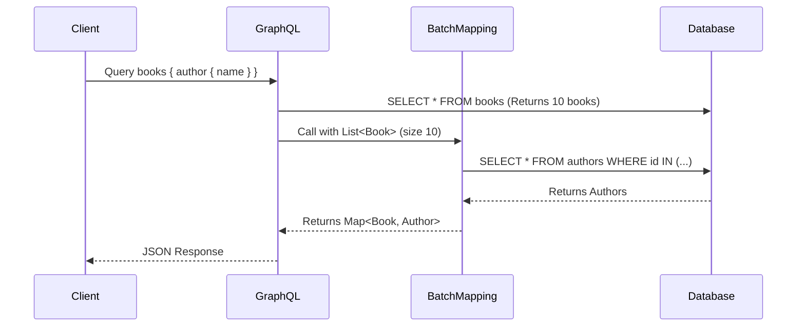

# Data Fetching aur N+1 Problem

Chalo aaj ek aisi problem discuss karte hain jo har GraphQL developer ko kabhi na kabhi bite karti hai — chahe wo Node.js mein ho ya Spring Boot mein. Naam hai **N+1 Problem**, aur agar tumne kabhi Apollo Server ya `graphql-js` ke saath kaam kiya hai, toh tumne shayad `dataloader` npm package ka naam suna hoga. Yahi concept Spring for GraphQL mein bhi hai, bas Java flavour ke saath.

> [!warning] N+1 Problem Kya Hai?
> Jab tum ek list of items fetch karte ho, aur us list ke **har item** ke liye ek nested field bhi fetch karna hai, toh naive implementation mein ek query list ke liye chalti hai (N items milte hain), aur fir **N alag queries** har item ke nested field ke liye chalti hain. Total mila ke ho gayi **N+1 queries**. 10 books ke liye 11 database calls, 100 books ke liye 101 calls — performance bilkul tabaah ho jaati hai.

## Kyun Hoti Hai Yeh Problem?

Socho tum Zomato ka backend bana rahe ho. Ek query aayi: "mujhe 50 restaurants dikhao, har restaurant ke saath uska owner ka naam bhi chahiye."

Agar tumne naively likha:
1. `SELECT * FROM restaurants` — 50 restaurants mil gaye (1 query)
2. Ab har restaurant ke liye: `SELECT * FROM owners WHERE id = ?` — yeh **50 baar** chalega!

Total: **51 database queries**, sirf ek simple sa GraphQL query serve karne ke liye. Yeh scale nahi karega — jaise Zomato agar har restaurant card render karne ke liye alag DB hit kare, toh app crawl karegi peak lunch hour mein.

GraphQL is problem ke liye especially prone hai kyunki iska resolver model **field-by-field** kaam karta hai — har field ka apna resolver function ho sakta hai, aur GraphQL engine ko yeh pata nahi hota ki "author" field sabhi 50 books ke liye ek saath batch karke fetch karna chahiye. Wo bas har book object ke liye resolver ko call kar deta hai, ek-ek karke.

## Example Scenario

Fetching a list of books and their authors:
```graphql
query {
  books {
    title
    author {
      name
    }
  }
}
```

Agar yeh standard `@SchemaMapping` se implement kiya jaaye, toh Spring `author` resolver ko **har ek book ke liye** call karega — matlab agar 10 books hain, toh DB ko 10 alag calls jaayengi sirf authors fetch karne ke liye. Ek call books ke liye, plus 10 calls authors ke liye = 11 total. Yehi hai N+1 (N=10 yahan).

> [!info] Node.js Wale Dev Ke Liye
> Agar tumne Apollo Server ya `graphql-js` use kiya hai, toh yeh bilkul wahi problem hai jise `dataloader` (Facebook ka open-source library) solve karta hai — batching + caching via event loop tick. Spring for GraphQL mein bhi under the hood **DataLoader** (same concept, Java implementation) use hota hai. Idea identical hai, sirf syntax alag.

## Solution: DataLoader aur `@BatchMapping`

Spring for GraphQL `DataLoader` ka use karta hai batching aur caching ke liye — matlab woh multiple individual requests ko collect karke ek hi batch mein combine kar deta hai, phir ek single query database ko bhejta hai. Isko use karne ka sabse aasan tareeka hai `@BatchMapping` annotation.

**Kaise kaam karta hai andar se?** Jab GraphQL engine `books` query resolve karta hai aur usse pata chalta hai ki har book ke liye `author` field bhi chahiye, toh woh turant DB call nahi maarta. Instead, woh saare "author chahiye is book ID ke liye" requests ko ek chhote se time window mein collect karta hai (jaise ek waiter order lene ke baad turant kitchen nahi bhaagta, pehle poori table ka order sun leta hai), aur phir sabko ek saath ek batch function ko de deta hai.

### Using `@BatchMapping`

`@BatchMapping` `@SchemaMapping` ki jagah use hota hai un fields ke liye jo N+1 se pareshaan hain. Yeh parent objects ki ek **list** leta hai, aur results ka ek **map** (ya flux) return karta hai.

```java
import org.springframework.graphql.data.method.annotation.BatchMapping;
import org.springframework.stereotype.Controller;
import java.util.List;
import java.util.Map;
import java.util.stream.Collectors;

@Controller
public class BookController {

    private final AuthorRepository authorRepository;

    @BatchMapping(typeName = "Book", field = "author")
    public Map<Book, Author> author(List<Book> books) {
        // 1. Extract IDs from the list of books
        List<String> authorIds = books.stream().map(Book::getAuthorId).toList();
        
        // 2. Fetch all authors in ONE query!
        List<Author> authors = authorRepository.findByIdIn(authorIds);
        
        // 3. Map the authors back to the requested books
        // (Assuming a helper to map them appropriately)
        return matchAuthorsToBooks(books, authors);
    }
}
```

Yahan magic yeh hai ki method signature khud badal gaya — ab yeh ek book nahi, balki **`List<Book>`** leta hai. Iska matlab Spring khud-ba-khud saare books ko collect karke ek hi call mein tumhe de raha hai, aur tumhara kaam sirf itna hai:
1. Sabke authorId nikaalo
2. Ek single `findByIdIn(...)` query chalao (SQL mein `WHERE id IN (...)` clause — bilkul jaise IRCTC PNR status check karte waqt multiple PNRs ek saath check karwa lo, ek-ek karke nahi)
3. Result ko wapas har book se map karke Map<Book, Author> bana do

Result: 10 books ho ya 1000, author fetch karne ke liye **hamesha ek hi query** chalegi. Yeh hai batching ka fayda.



Is diagram mein dekho — chahe books 1 ho ya 100, `BatchMapping` sirf **ek** call karta hai database ko authors ke liye. Yehi N+1 se N+1 → **2 queries** tak reduce hone ka fayda hai.

## `matchAuthorsToBooks` Kaise Likhein?

Upar ke example mein `matchAuthorsToBooks` helper function ko implement nahi dikhaya gaya — real project mein yeh kuch aisa dikhega:

```java
private Map<Book, Author> matchAuthorsToBooks(List<Book> books, List<Author> authors) {
    // authorId -> Author ka fast lookup map bana lo
    Map<String, Author> authorsById = authors.stream()
        .collect(Collectors.toMap(Author::getId, Function.identity()));

    // Ab har book ke liye uska matching author dhoond lo
    return books.stream()
        .collect(Collectors.toMap(
            Function.identity(),
            book -> authorsById.get(book.getAuthorId())
        ));
}
```

> [!tip] Common Mistake
> Agar `findByIdIn` mein duplicate ya missing IDs ke wajah se result list ka order ya size books list se match nahi karta, toh `matchAuthorsToBooks` mein `null` values aa sakti hain. Hamesha `null` handle karo — warna `NullPointerException` production mein milega, jab koi book ka author record accidentally delete ho gaya ho DB se.

## `@BatchMapping` vs `@SchemaMapping` — Kab Kya Use Karein?

| Situation | Use Karo |
|---|---|
| Field simple hai, koi extra DB call nahi (jaise `book.title`) | Default field mapping (kuch bhi nahi chahiye) |
| Field ek nested/related entity fetch karta hai, jo list ke context mein call hoga | `@BatchMapping` |
| Field sirf ek baar call hota hai (jaise root query `book(id: ...)`) | `@QueryMapping` ya `@SchemaMapping` (batching ka fayda nahi kyunki N=1 hi hai) |

Basically — jahan bhi tumhe pata hai ki resolver **list ke context mein baar-baar call hoga**, wahan `@BatchMapping` laga do. Agar resolver kabhi bhi sirf ek single parent object ke liye call hota hai, batching ka koi fayda nahi.

## Gotchas

1. **N+1 sirf nested relations mein nahi, deeply nested mein bhi ho sakta hai.** Agar `author` ke andar bhi `author.publisher` jaisa koi nested field hai jo per-author DB call karta hai, wahan bhi alag se `@BatchMapping` chahiye hoga — warna woh apna khud ka N+1 create karega.
2. **DataLoader caching request-scoped hoti hai.** Matlab ek hi GraphQL request ke andar agar same author ID do jagah use ho raha hai, toh DataLoader usko cache karke dobara fetch nahi karega — lekin agle request mein cache reset ho jaata hai (koi cross-request caching by default nahi hai, Redis jaisa persistent cache alag baat hai).
3. **`findByIdIn` ka order guarantee nahi hota.** Zyadatar databases `IN (...)` clause ka result input order mein wapas nahi dete — isiliye tumhe manually map banake match karna padta hai (jaisa upar dikhaya), array index se match mat karo.
4. **Reactive types bhi supported hain.** Agar tum Spring WebFlux use kar rahe ho, `@BatchMapping` `Mono<Map<K,V>>` ya `Flux<V>` bhi return kar sakta hai — reactive pipeline ke saath seamlessly kaam karta hai.

## Key Takeaways

- N+1 problem tab hoti hai jab list ke har item ke liye alag DB query lag jaati hai nested field fetch karne ke liye — 10 items = 11 queries.
- Spring for GraphQL is problem ko `DataLoader` (Node.js ke `dataloader` package jaisa hi concept) ke through solve karta hai.
- `@BatchMapping` annotation `@SchemaMapping` ki jagah use hoti hai jab field N+1 se affected ho — yeh `List<ParentType>` leta hai aur `Map<ParentType, ChildType>` return karta hai.
- Andar se Spring saare pending resolver calls ko ek chhote window mein collect karta hai aur ek hi batch function call karta hai — jisse ek single `WHERE id IN (...)` query se sab kuch fetch ho jaata hai.
- Hamesha `null` handling rakho batch mapping function mein — missing ya mismatched IDs se `NullPointerException` aa sakta hai.
- Sirf un fields pe `@BatchMapping` lagao jo list context mein baar-baar call hote hain — single-call resolvers ke liye iska koi fayda nahi.

**Previous:** [[03-Mutations-and-Inputs]]
**Next:** [[05-Error-Handling]]
