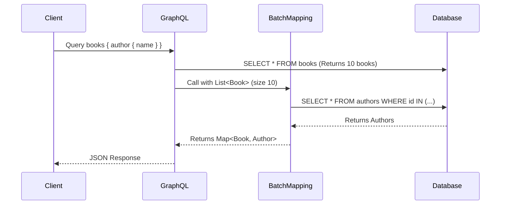

# Data Fetching and the N+1 Problem

> [!warning] The N+1 Problem
> When querying a list of items and a nested field for each item, a naive implementation might make 1 query for the list (N items), and then N subsequent queries to fetch the nested field for each item. This results in N+1 database queries, causing severe performance issues.

## Example Scenario

Fetching a list of books and their authors:
```graphql
query {
  books {
    title
    author {
      name
    }
  }
}
```

If implemented with a standard `@SchemaMapping`, Spring will call the `author` resolver for *every* book, hitting the DB multiple times.

## Solution: DataLoader and `@BatchMapping`

Spring for GraphQL uses `DataLoader` under the hood to batch and cache data fetching. The easiest way to use this is via the `@BatchMapping` annotation.

### Using `@BatchMapping`

`@BatchMapping` replaces `@SchemaMapping` for fields that suffer from N+1. It takes a list of parent objects and returns a map (or flux) of results.

```java
import org.springframework.graphql.data.method.annotation.BatchMapping;
import org.springframework.stereotype.Controller;
import java.util.List;
import java.util.Map;
import java.util.stream.Collectors;

@Controller
public class BookController {

    private final AuthorRepository authorRepository;

    @BatchMapping(typeName = "Book", field = "author")
    public Map<Book, Author> author(List<Book> books) {
        // 1. Extract IDs from the list of books
        List<String> authorIds = books.stream().map(Book::getAuthorId).toList();
        
        // 2. Fetch all authors in ONE query!
        List<Author> authors = authorRepository.findByIdIn(authorIds);
        
        // 3. Map the authors back to the requested books
        // (Assuming a helper to map them appropriately)
        return matchAuthorsToBooks(books, authors);
    }
}
```



**Previous:** [[03-Mutations-and-Inputs]]
**Next:** [[05-Error-Handling]]
