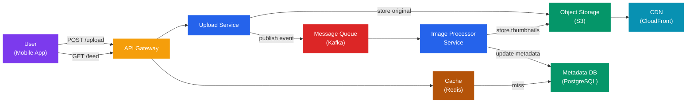
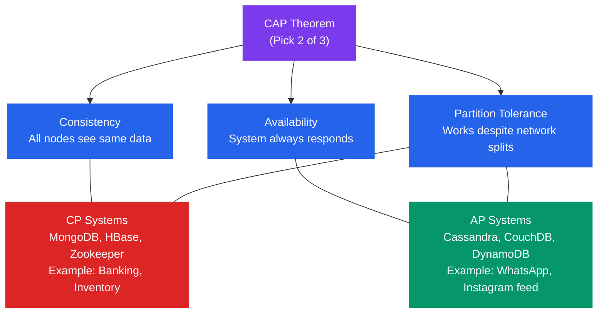
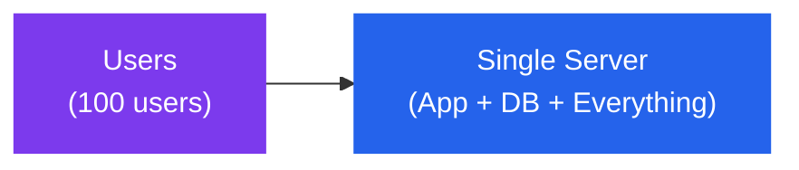
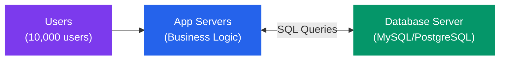
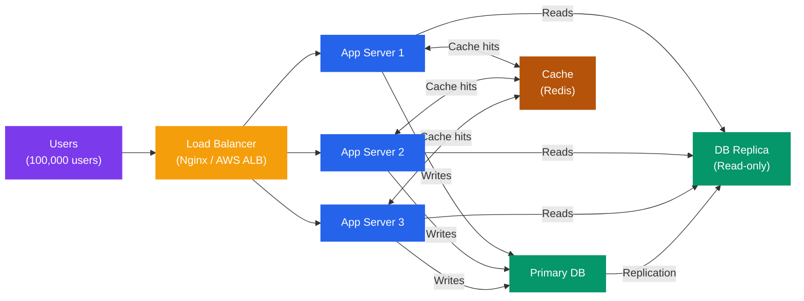
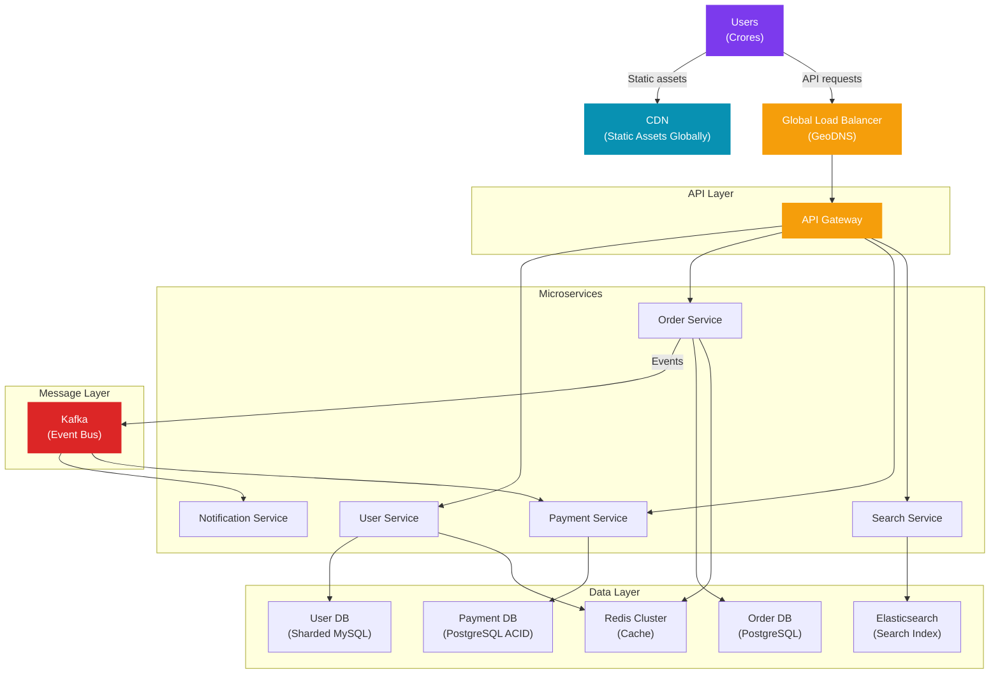
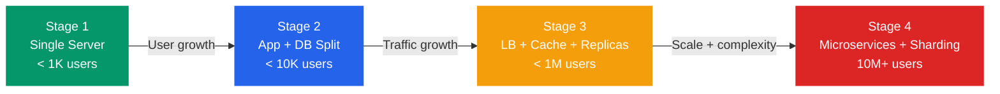
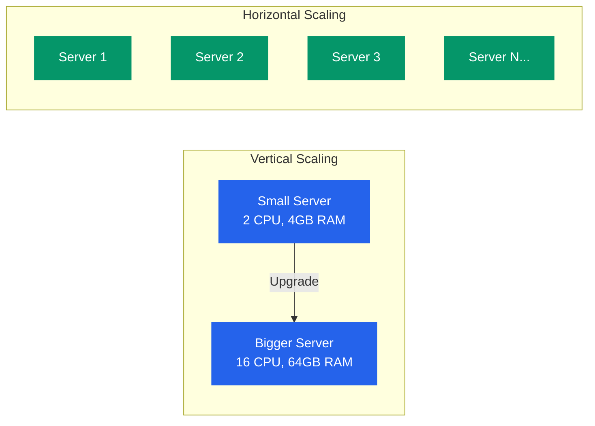
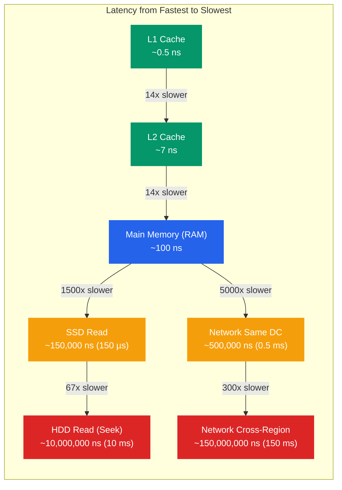
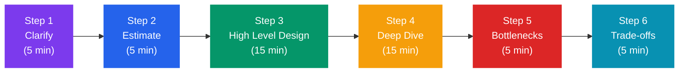

# Introduction to System Design

> **The single most important chapter in your system design journey. Read this slowly. Re-read it. Everything else builds on what's here.**

---

## Table of Contents

1. [What IS System Design?](#1-what-is-system-design)
2. [Why System Design Interviews Exist](#2-why-system-design-interviews-exist)
3. [HLD vs LLD — The Two Worlds of Design](#3-hld-vs-lld--the-two-worlds-of-design)
4. [The Trade-off Mindset](#4-the-trade-off-mindset)
5. [Evolution of a System](#5-evolution-of-a-system)
6. [Key Non-Functional Requirements](#6-key-non-functional-requirements)
7. [The Numbers Every Engineer Must Know](#7-the-numbers-every-engineer-must-know)
8. [The 6-Step Framework for Any System Design Problem](#8-the-6-step-framework-for-any-system-design-problem)
9. [Common Beginner Mistakes](#9-common-beginner-mistakes)
10. [Common Interview Questions](#10-common-interview-questions)
11. [Key Takeaways](#11-key-takeaways)

---

## 1. What IS System Design?

### The Analogy: Designing a City vs Designing a House

Socho ek second ke liye — agar koi tumse keh de "ek ghar design karo" aur agar koi keh de "ek poora sheher design karo" — yeh dono kaam *bilkul* alag hain.

**Ek ghar banana** mein tum sochte ho:
- Kitne kamre chahiye?
- Kitchen kahan hogi?
- Bathroom kahan rakhe?
- Paint ka color kya ho?

**Ek sheher banana** mein tum sochte ho:
- Roads kaise hongi? Highway ya galiyan?
- Bijli kahan se aayegi? Ek power plant ya multiple?
- Paani ka system kya hoga?
- Agar ek area mein load zyada ho toh kya karein?
- Agar ek power plant band ho toh poora sheher dark na ho
- Logon ki population 10 lakh se 1 crore ho jaaye toh kya?

**System design is city planning for software.**

Jab tum Instagram, Zomato, ya WhatsApp use karte ho, toh tumhare phone ke peeche ek poora "sheher" chal raha hota hai. Thousands of servers, databases, caches, queues — sab mil ke kaam karte hain taaki tumhara photo ek second mein upload ho, tumhara food order place ho, aur tumhare messages "double-tick" show karein.

System design is the discipline of planning how all those "buildings, roads, power lines, and water pipes" of software fit together.

### The Formal Definition (But Explained Simply)

System design is the process of defining:
- **Architecture** — What are the big pieces and how do they connect?
- **Components** — Kya kya hoga? Database, cache, queue, servers?
- **Data flow** — Data kahan se aayega, kahan jayega, kaise jayega?
- **Trade-offs** — Kya sacrifice karein toh kya milega?

...all to satisfy both **functional requirements** (what the system does) and **non-functional requirements** (how well it does it).

### A Real-World Moment: What Happens When You Search on YouTube?

Tum "dosa recipe" type karte ho YouTube pe. Kya hota hai behind the scenes?

1. Tumhara phone ek request bhejta hai YouTube ke servers ko
2. Ek **load balancer** decide karta hai — "is request ko kaunse server pe bhejo?"
3. Ek **search service** tumhara query process karta hai, probably Elasticsearch se
4. Results ek **cache** se aate hain (kyunki "dosa recipe" toh lakho log search karte hain)
5. Video thumbnails **CDN** se aate hain — server se nahi, tumhare nearest content delivery node se
6. YouTube's **recommendation engine** (ML model) decide karta hai kaun se videos show karne hain
7. Ye sab 200 milliseconds mein ho jaata hai

Yeh sab plan karna — yeh system design hai.

---

## 2. Why System Design Interviews Exist

### Woh Actually Kya Test Kar Rahe Hain?

Seedha baat karte hain — companies like Google, Amazon, Flipkart, Swiggy tumse "Design Instagram" isliye nahi poochte kyunki unhe ek Instagram chahiye. Woh actually test kar rahe hote hain:

| What They Test | What That Looks Like |
|---|---|
| **Ambiguity handling** | Kya tum bina poori info ke panic karte ho ya smart questions puchte ho? |
| **Scale thinking** | Kya tum 1000 users ke liye sochte ho ya 1 crore ke liye? |
| **Trade-off reasoning** | Kya tum "yeh better hai kyunki..." explain kar sakte ho? |
| **Communication** | Kya tum complex ideas simply bol sakte ho? |
| **Practical experience** | Kya tumne real systems ke saath kaam kiya hai? |
| **Structured thinking** | Kya tum chaos mein bhi structured approach lete ho? |

### Woh Kya TEST NAHI Kar Rahe

- **Memorization** — Answers yaad karne se kaam nahi chalega
- **Perfect solution** — Koi perfect solution hota hi nahi
- **Knowing every technology** — Sab kuch jaanna zaroori nahi
- **Speed** — Yeh race nahi hai

### Why Senior Roles Need This

Ek junior developer ka kaam hota hai: "Yeh feature implement karo."

Ek senior developer ka kaam hota hai: "Yeh feature kaise implement karein, yeh decide karo — aur yeh bhi batao ki is decision ka agla 2 saal mein kya impact hoga."

System design is the language of senior engineering. Aur yeh interviews usi language ka test lete hain.

---

## 3. HLD vs LLD — The Two Worlds of Design

### The Analogy: Blueprint vs Construction Drawing

Socho ek architect aur ek contractor ka kaam:

- **Architect** (HLD person) kehta hai: "Yahan ek 3-floor building hogi, ek main gate, parking basement mein, aur terrace pe garden."
- **Contractor** (LLD person) kehta hai: "Ek pillar ki height 3.2 meters hogi, M25 grade concrete use karenge, rebar spacing 150mm hoga."

Dono zaroori hain. Lekin dono ka kaam alag hai.

---

### HLD — High Level Design

**Kya hai:** The "30,000 feet view" of your system. Boxes aur arrows. Which major components exist and how they talk to each other.

**Isme hota hai:**
- Which services exist (API server, database, cache, queue)
- How they communicate (REST, gRPC, message queue)
- Which technology categories (SQL vs NoSQL, push vs pull)
- How data flows end to end

**Example — HLD of Instagram's Photo Upload:**



**Interview tip:** HLD mein har box explain karo — "yeh service kyun hai, yeh kya karta hai." Sirf diagram banana kafi nahi.

---

### LLD — Low Level Design

**Kya hai:** The "ground level view." Classes, functions, database schemas, API contracts — actual implementation details.

**Isme hota hai:**
- Class diagrams and relationships
- API request/response schemas
- Database table structure
- Specific algorithm choices
- Design patterns used

**Example — LLD of Instagram's Photo Upload (Partial):**

```
API Contract:
POST /api/v1/photos/upload
Headers: Authorization: Bearer <token>
Body: multipart/form-data
  - file: <binary>
  - caption: string (max 2200 chars)
  - location: { lat: float, lng: float } (optional)

Response 201:
{
  "photoId": "uuid",
  "url": "https://cdn.instagram.com/photos/...",
  "thumbnailUrl": "https://cdn.instagram.com/thumbs/...",
  "createdAt": "ISO8601"
}

Database Schema (Photos table):
- id: UUID PRIMARY KEY
- user_id: UUID FOREIGN KEY
- s3_key: VARCHAR(500)
- cdn_url: VARCHAR(500)
- caption: TEXT
- width: INT
- height: INT
- file_size: BIGINT
- created_at: TIMESTAMP
- is_deleted: BOOLEAN DEFAULT FALSE
```

---

### HLD vs LLD — Side by Side

| Aspect | HLD | LLD |
|---|---|---|
| **Scope** | Entire system | Specific component |
| **Audience** | Architects, managers, stakeholders | Developers implementing it |
| **Output** | Architecture diagrams, component descriptions | Class diagrams, DB schemas, API specs |
| **Focus** | What components exist and why | How each component works internally |
| **Level of detail** | Low — boxes and arrows | High — actual code structures |
| **Interview stage** | First 30-40 minutes | Last 15-20 minutes (deep dive) |
| **Example question** | "Design WhatsApp" | "How will you store messages? Explain the schema." |

**Simple baat hai:** HLD bolta hai "kya kya hoga," LLD bolta hai "kaise hoga."

---

## 4. The Trade-off Mindset

### The Analogy: Buying a Car

Socho tum ek car khareed rahe ho. Tum chahte ho:
- Fast ho
- Cheap ho
- Fuel efficient ho
- Spacious ho
- Safe ho

Kya milega ek hi car mein sab? **Nahi.** Tum ek Lamborghini lete ho — fast hai, lekin expensive hai aur fuel guzzler hai. Ek hatchback lete ho — cheap aur fuel efficient, lekin fast nahi. SUV lete ho — spacious hai, safe hai, lekin expensive hai.

**Tumhara job hai: apni needs ke liye right trade-off choose karna.**

Same baat system design mein. **Koi perfect system nahi hota. Sirf right trade-offs hote hain for the given situation.**

### The Most Important Trade-offs

#### 1. Consistency vs Availability (CAP Theorem)

**Analogy:** Socho ek bank ke do branches hain — Delhi aur Mumbai. Ek customer Delhi mein 10,000 rupees nikaalta hai. Exactly us waqt Mumbai ka branch server se disconnect ho jaata hai (network partition).

- **Consistency choose karo:** Mumbai branch ka ATM band ho jaata hai jab tak connection restore nahi hota. User ka paise sahi rakhte hain, lekin service unavailable hai.
- **Availability choose karo:** Mumbai branch ATM chalta rehta hai. User wahan se bhi paise nikaal sakta hai — lekin double-spending ka risk hai.



**Real talk:** Agar tum WhatsApp par message bhejo aur woh kuch second baad deliver ho — chalta hai. But agar Zomato pe order do aur woh inventory ka status wrong dikhaaye, toh problem hai.

#### 2. Latency vs Throughput

- **Latency:** Ek request kitni jaldi process hoti hai (speed)
- **Throughput:** Ek second mein kitne requests process hote hain (volume)

**Analogy:** Ek toll booth soch lo.
- **Low latency approach:** Har car ke liye alag fastag lane — har car 2 second mein nikal jaati hai, lekin lanes zyada lagte hain (cost high)
- **High throughput approach:** Batch mein cars process karo, ek ek kar ke — shayad thoda wait karo, lekin total cars processed per hour zyada hogi

Gaming applications need low latency. Data analytics pipelines need high throughput.

#### 3. Read vs Write Optimization

| Situation | Strategy |
|---|---|
| Read-heavy (news site, blog) | Cache aggressively, read replicas, denormalize |
| Write-heavy (logging, IoT sensors) | Write-optimized DB (Cassandra), async writes, batch |
| Mixed (social media) | Smart caching, CQRS pattern |

#### 4. Cost vs Performance

**Reality check:** Tumhare paas infinite budget nahi hai. Every optimization costs something — more servers, more complex code, more operational overhead.

The right question is always: "Is this optimization worth its cost for our scale?"

Swiggy ko ek chhote city mein same infrastructure ki zaroorat nahi jo unhe Mumbai mein chahiye.

### The Golden Rule

> **Never say "X is better than Y" in an interview. Always say "X is better than Y for this specific use case because..."**

This one habit will take you from average to exceptional in system design interviews.

---

## 5. Evolution of a System

### Yeh Kyun Important Hai

Bahut log sochte hain — "design karein toh seedha best architecture banao." Yeh galat soch hai. **Every successful system started small and evolved.**

Instagram started as a photo filter app. Twitter started as an SMS service. Zomato started as a PDF menu scanner. They didn't start with microservices. They evolved into them.

Samajhna zaroori hai yeh journey — kyunki interviews mein log poochte hain "aap kaise scale karoge" aur tumhara answer should reflect this evolution.

### Stage 1: The Naive Beginning — Single Server

**Analogy:** Ek shopkeeper apne ghar mein hi dukaan chalaata hai. Khud hi stock manage karta hai, khud hi customer serve karta hai, khud hi accounts likhta hai.



**What it is:** One machine running everything — your app code, your database, your static files, everything.

**When it works:** Personal projects, MVPs, very early stage startups (< 1000 users).

**Problems:**
- **Single point of failure** — Server crash = 100% downtime
- **No horizontal scaling** — Can only buy a bigger machine (vertical scaling has limits)
- **App and DB compete for resources** — DB uses RAM, app uses RAM, they fight

**Real example:** Zomato ke early days mein yahi tha. Deepinder Goyal ne manually menus scan karke ek basic site banaya tha.

---

### Stage 2: Separation — App Server + Database Server

**Analogy:** Ab shopkeeper ne ek separate warehouse le liya. Dukaan pe sirf selling hoti hai, storage separate hai.



**What changed:** App and database run on separate machines. Now they don't compete for resources.

**Benefits:**
- Scale app servers independently from DB
- DB can be tuned specifically for database workloads
- App crash doesn't corrupt database

**Problems still:**
- DB is still a single point of failure
- No caching — every request hits DB
- Single app server = still one point of failure

---

### Stage 3: Adding Scale — Load Balancer + Multiple App Servers

**Analogy:** Popular dukaan ho gayi. Ab owner ne 3 cashier rakhe hain. Ek manager khada hai jo decide karta hai "customer A ko counter 1 pe bhejo, customer B ko counter 2 pe."



**What's new:**
- **Load balancer** distributes traffic across multiple app servers
- **Read replica** — primary DB handles writes, replica handles reads (most apps are read-heavy)
- **Cache (Redis)** — frequently accessed data served from memory, not DB

**Benefits:**
- Multiple app servers = no single point of failure for app layer
- Read replica offloads DB — read performance drastically improves
- Cache means most requests never touch DB

**Problems still:**
- Database is still a single primary — what if it crashes?
- Static files (images, videos) still served from app server — slow and wasteful

---

### Stage 4: Global Scale — CDN + Database Sharding + Microservices

**Analogy:** Zomato ab ek sheher se 500 cities mein hai. Ek central kitchen se poore India ko serve nahi kar sakte. Local warehouses chahiye, local delivery partners chahiye, aur alag departments chahiye — delivery team, payment team, restaurant management team.



**What's new at this stage:**
- **CDN** — images, videos, JS/CSS served from edge locations near users (Mumbai user gets data from Mumbai CDN, not from a US server)
- **Database sharding** — instead of one big DB, split data across multiple DBs (e.g., users A-M on shard 1, N-Z on shard 2)
- **Microservices** — each business domain (orders, payments, users) is a separate deployable service
- **Message queue (Kafka)** — services communicate asynchronously; order service doesn't wait for notification service to send email

### The Evolution Summary



**Interview tip:** Jab design poochha jaaye, start from Stage 1 aur evolve karke dikhao. Explain what problem each upgrade solves. This shows systems thinking.

---

## 6. Key Non-Functional Requirements

### Yeh Kyun Jaanna Chahiye?

Functional requirements batate hain "kya karna hai" — user login kar sake, photo upload kar sake.

Non-functional requirements batate hain "kitna achha karna hai" — kitna fast, kitna reliable, kitna available.

**Yeh NFRs hi decide karte hain tumhara architecture.** Agar availability important nahi toh multiple regions ki zaroorat nahi. Agar latency important nahi toh caching zaroor nahi lag sakti.

### 1. Scalability

**Analogy:** Ek restaurant ke 10 seats hain. Eid ka din hai aur 100 log aaye. Kya karoge?

- **Vertical Scaling (Scale Up):** Bade tables laao, zyada efficient chef rakho — ek jagah zyada capacity badhaao. Limit hai — ek table infinitely bada nahi ho sakta.
- **Horizontal Scaling (Scale Out):** Aas paas ki buildings mein aur restaurants kholo, overflow wahaan bhejo. Theoretically infinite.



| | Vertical Scaling | Horizontal Scaling |
|---|---|---|
| **How** | Bigger machine | More machines |
| **Limit** | Hardware limits | Practically infinite |
| **Cost** | Exponential after a point | Linear |
| **Complexity** | Low | High (need load balancing, distributed coordination) |
| **Downtime** | Usually yes (to upgrade) | No (add servers without stopping) |
| **Use when** | Quick fix, DB servers | Long-term growth, app servers |

**Real example:** Netflix uses horizontal scaling for its streaming servers. During India vs Pakistan match, millions tune in — they can spin up more servers in minutes.

**Interview tip:** "Stateless" app servers scale horizontally easily. "Stateful" services (that remember things) are harder to scale horizontally. Design stateless where possible.

---

### 2. Reliability

**What it means:** System apna kaam sahi karta rahe, chahe andar kuch toote bhi.

**Analogy:** Ek reliable car woh nahi jisse kabhi accident nahi hota. Ek reliable car woh hai jo puncture hone par bhi chalti rahe (run-flat tires), jiska seat belt fail-safe ho, jiska engine temperature sensor alert kare.

**Reliability mechanisms:**

- **Redundancy** — Critical components ko duplicate karo. Agar ek fail ho toh doosra le le.
- **Replication** — Data ko multiple places pe store karo. Database crash kare toh replica se serve karo.
- **Chaos Engineering** — Deliberately failures create karo production mein taaki system ki resilience test ho. Netflix ka "Chaos Monkey" yahi karta hai — random servers ko kill karta hai.
- **Graceful Degradation** — Agar ek feature fail ho toh poora system crash nahi karna chahiye. Instagram pe recommendation system fail ho toh chronological feed dikhaao — completely band mat karo.
- **Retry with Exponential Backoff** — Request fail ho toh wait karo, phir retry karo. Wait time exponentially badhaate jao.

**Real example:** WhatsApp ke servers ka ek region down ho jaata hai. Messages queue ho jaate hain. Jab connection restore hota hai, woh deliver ho jaate hain. Tumhe pata bhi nahi chalta tha.

---

### 3. Availability

**What it means:** System kitni percentage time accessible hai.

**Why it matters:** Amazon ek second ka downtime mein 2+ lakh rupees ka loss karta hai (by some estimates). Availability is directly tied to business revenue.

**The "Nines" of Availability:**

| Availability | Annual Downtime | Who Needs This |
|---|---|---|
| 99% (two nines) | ~87.6 hours | Internal tools, experimental systems |
| 99.9% (three nines) | ~8.7 hours | Most production systems |
| 99.99% (four nines) | ~52 minutes | Payments, banking, healthcare |
| 99.999% (five nines) | ~5 minutes | Telecom, critical infrastructure |
| 99.9999% (six nines) | ~31 seconds | Power grids, flight control |

**How to achieve high availability:**
- **Multiple availability zones** — Don't run everything in one data center. AWS has zones in the same region that are physically separate.
- **Health checks and auto-failover** — Load balancers detect unhealthy servers and stop sending traffic automatically.
- **Database replication** — Primary fails → replica becomes primary (automated with tools like AWS RDS Multi-AZ).
- **No single points of failure** — Every critical path should have at least one redundant component.

**Availability vs Reliability:** Yeh dono alag hain.
- A system can be **reliable but not available** — agar deployment ke waqt band ho
- A system can be **available but not reliable** — agar errors return karta ho par response deta ho

---

### 4. Maintainability (The One Engineers Often Forget)

**Analogy:** Ek purana mohalla socho jahan roads random hain, ghar randomly bane hain, pipes underground kahan hain pata nahi. Agar ek pipe leak kare toh poori road khodna padega. Yeh city "maintainable" nahi hai.

**What it means:** How easy is it to:
- **Fix bugs** — Code samajh aaye jaldi
- **Add features** — Naya feature ek jagah change karna padhe, 50 jagah nahi
- **Operate** — Monitoring, alerts, logs clearly samajh aayein
- **Hand over** — New developer aaye toh quickly productive ho sake

**How to build maintainable systems:**
- Clear separation of concerns
- Good logging and monitoring
- Documentation (just the important stuff, not everything)
- Consistent code patterns and conventions
- Automated tests (especially integration tests for system interactions)

**Real example:** Amazon ke early days mein ek monolith tha. Jab ek team change karti thi, doosri teams ka code break ho jaata tha. Isliye unhone microservices adopt kiye — har team apni service maintain kar sakti hai independently.

---

### 5. Latency vs Throughput (Deep Dive)

**Analogy — Ek factory ki assembly line:**
- **Latency** = Ek product start se finish tak kitna time leta hai (say, 10 minutes)
- **Throughput** = Ek ghante mein kitne products complete hote hain (say, 100 products/hour)

Kya dono optimize ho sakte hain? Sometimes yes, sometimes trade-off hai.

**Types of latency:**
- **Network latency** — Data ek machine se doosri machine tak pahunchne ka time
- **Processing latency** — Server par request process hone ka time
- **Database latency** — DB query execute hone ka time

**What affects latency:**
- Physical distance (speed of light is a real limit — Mumbai to New York is ~150ms minimum)
- Network hops (jitne zyada routers/switches, utna zyada time)
- Processing complexity
- DB query efficiency (indexes lagate hain isliye)

**Throughput metrics:**
- **RPS** — Requests per second
- **TPS** — Transactions per second
- **QPS** — Queries per second

**Real example:** Swiggy ka order placement — yahan latency critical hai. User 2 seconds se zyada wait nahi karna chahta. Lekin Swiggy ka data analytics pipeline (jo analyze karta hai kaunsa restaurant popular hai) — yahan throughput important hai, latency nahi.

---

## 7. The Numbers Every Engineer Must Know

### Yeh Kyun Jaanna Chahiye?

Back-of-the-envelope estimation karte waqt — jab tum keh rahe ho "humein kitna storage chahiye" ya "kya ek server kafi hoga" — tumhara intuition real numbers pe based hona chahiye.

Yeh numbers yaad karo. Seriously. Flash cards banao agar zaroorat ho.

### The Latency Hierarchy



**The Latency Numbers Table (Memorize This):**

| Operation | Latency | Human Intuition |
|---|---|---|
| L1 cache reference | 0.5 ns | Like snapping your fingers |
| L2 cache reference | 7 ns | Like... still snapping |
| Main memory access | 100 ns | Like a blink |
| SSD sequential read | 1 µs (1,000 ns) | Like a very fast heartbeat |
| SSD random read | 150 µs | Like a computer beep |
| HDD seek | 10 ms | Like clicking a mouse |
| Same datacenter round trip | 0.5 ms | Very fast network call |
| Cross-country network | 40-80 ms | Noticeable but okay |
| Cross-continent (India to US) | ~150 ms | Slight delay you feel |
| TCP packet retransmit | 1-3 seconds | "Why is this slow?" |

**Why this matters in interviews:**

When someone asks "can you cache this in Redis?" — you need to know:
- Memory access: 100 ns
- Redis (network call + memory): ~0.5-1 ms

Redis is ~10,000x slower than L1 cache, but ~10,000x faster than disk. Context matters.

When someone says "just do a database query" — you need to know that's potentially 10-100ms. At 1 million queries/day, that adds up.

---

### Power of Two — Storage Numbers

Har engineer ko yeh pata hona chahiye:

| Unit | Bytes | Real World |
|---|---|---|
| Kilobyte (KB) | 10^3 (1,024) | A short text document |
| Megabyte (MB) | 10^6 (1,048,576) | A song in MP3 |
| Gigabyte (GB) | 10^9 | A movie (compressed) |
| Terabyte (TB) | 10^12 | 1,000 movies |
| Petabyte (PB) | 10^15 | All books ever written |
| Exabyte (EB) | 10^18 | What Facebook stores |

---

### Quick Estimation: Traffic Numbers

Common approximations to memorize:

| Duration | Seconds |
|---|---|
| 1 day | ~86,400 (≈ 100,000) |
| 1 month | ~2,500,000 |
| 1 year | ~31,500,000 (≈ 30 million) |

**Example estimation:**

> "Design YouTube. Assume 1 billion users watch 5 videos per day on average."

- Videos watched per day: 1B × 5 = 5 billion views/day
- Requests per second: 5B / 100,000 = ~50,000 RPS
- If each video is 500MB and 500 hours of video uploaded per minute...
- Per minute upload: 500 hours × 60 min = 30,000 minutes of video
- At 1 GB/minute (after compression): 30 TB of video uploaded per minute

Yeh numbers tum ek interview mein derive kar sakte ho. Practice karo.

---

## 8. The 6-Step Framework for Any System Design Problem

### Yeh Framework Kyun Use Karna Chahiye?

System design interview mein ek common mistake hai: interviewer ne "Design Instagram" kaha aur candidate seedha drawing karne laga. No clarification, no estimation, no structure.

Yeh galat approach hai kyunki:
1. Tumhe pata nahi kya exactly design karna hai
2. Tumhe pata nahi kitna bada system hai
3. Tum important requirements miss kar sakte ho
4. Interviewer ko lagta hai tum unstructured thinker ho

**Yeh 6-step framework ek roadmap hai. Follow karo, deviate mat karo.**



---

### Step 1: Clarify Requirements (5 minutes)

**Never skip this. Ever.**

Before designing anything, ask questions. This shows maturity and prevents wasted effort.

**Questions to always ask:**

**Functional (What should it do?):**
- What are the core features? (Don't assume everything)
- What are we NOT building? (Scope control)
- Who are the users? (Consumers, businesses, admins?)
- What are the user journeys? (Upload → View? Search → Click → Watch?)

**Non-Functional (How well should it do it?):**
- How many users? Daily active users (DAU)? Monthly?
- Read-heavy or write-heavy?
- What is the acceptable latency? (< 200ms? < 1 second?)
- What availability is needed? (99.9%? 99.99%?)
- Is the system global or India-only?

**Example — "Design WhatsApp":**

Good clarifying questions:
- "Are we designing just messaging, or also voice/video calls?"
- "How many users? WhatsApp-scale (2 billion) or starting smaller?"
- "Is message ordering important? (messages arrive in sent order)"
- "Do we need message delivery receipts (single tick, double tick, blue tick)?"
- "What about offline message delivery?"
- "Are we handling end-to-end encryption?"

**Interview tip:** 2-3 smart clarifying questions impress interviewers more than 10 generic ones. Focus on questions that will change your architecture.

---

### Step 2: Back-of-the-Envelope Estimation (5 minutes)

**Yeh kyun important hai:** Estimation se decide hota hai kitna infrastructure chahiye, kaunsi technology suitable hai, aur kahan bottlenecks aayenge.

**Standard metrics to estimate:**

```
1. DAU (Daily Active Users)
2. Requests per second (RPS) — peak and average
3. Data stored per day / per year
4. Bandwidth required
5. Storage capacity
```

**Example — Estimating for Instagram:**

```
Assumptions:
- 500 million DAU
- Each user views 50 photos/day (reads)
- Each user uploads 2 photos/day (writes)
- Average photo size: 200 KB (after compression)
- Average video size: 5 MB

Read RPS:
  500M users × 50 photos / 86,400 seconds ≈ 290,000 RPS

Write RPS (photo uploads):
  500M users × 2 photos / 86,400 seconds ≈ 11,600 RPS (much less than reads!)
  → This is a read-heavy system (25:1 read-write ratio)

Daily Storage:
  500M users × 2 photos × 200 KB = 200 TB/day

Bandwidth for reads:
  290,000 RPS × 200 KB ≈ 58 GB/s → Need CDN desperately
```

**This estimation immediately tells you:**
- You need caching (290K RPS can't all hit DB)
- You need CDN (58 GB/s bandwidth for reads)
- You need efficient storage (200 TB/day → petabytes per year)

---

### Step 3: High Level Design (15 minutes)

Yeh woh part hai jahan tum architecture draw karte ho. Start simple, then add complexity.

**Always draw these layers:**
1. Client (Web / Mobile)
2. API Gateway / Load Balancer
3. Core services
4. Databases
5. Cache
6. Any async components (queues, workers)

**Approach:**
1. Draw the happy path first — ek user request karta hai, data kaise flow karta hai end-to-end
2. Add each major component one by one, explaining why it's there
3. "Talk while you draw" — interviewer should understand your reasoning

**What NOT to do:**
- Don't draw everything and then explain
- Don't go into implementation details yet
- Don't use technologies you can't defend (don't write "Kafka" if you can't explain why)

---

### Step 4: Deep Dive (15 minutes)

Ab interviewer guide karega — woh ek specific component pe drill down karega. Common deep dive areas:

**Database Design:**
- SQL vs NoSQL — "Why did you choose PostgreSQL over MongoDB here?"
- Sharding strategy — "How would you shard the users table?"
- Indexing — "What indexes would you create?"

**API Design:**
- Specific endpoints
- Request/response format
- Authentication mechanism

**Specific Components:**
- "How does your notification system work?"
- "Walk me through the image upload flow"
- "How do you handle concurrent writes?"

**Tip:** Be specific. Instead of "I'll use a database," say "I'll use PostgreSQL because the data is relational (user → posts → comments → likes), ACID compliance is important for financial operations, and PostgreSQL's JSONB type lets me store flexible metadata."

---

### Step 5: Bottlenecks and Single Points of Failure (5 minutes)

Khud pooch lo apne design se:

- **Where does the system break under load?**
  - Is the database the bottleneck? Add caching, sharding, read replicas.
  - Is the API server the bottleneck? Scale horizontally.
  - Is the network the bottleneck? CDN, compression, edge computing.

- **What single points of failure exist?**
  - Single database → Add replica with failover
  - Single datacenter → Multi-region deployment
  - Single load balancer → Active-active load balancer pair

- **What happens when...**
  - A server goes down?
  - The database goes down?
  - A network partition happens?
  - Traffic spikes 10x suddenly?

**Interview tip:** Proactively identifying your design's weaknesses shows maturity. Interviewers love candidates who can critique their own work.

---

### Step 6: Trade-offs Discussion (5 minutes)

Har decision mein explain karo what you gave up:

- "I chose NoSQL for the feed because it gives us flexible schema and horizontal scaling, but we lose ACID transactions."
- "I chose eventual consistency for likes and views because exact counts aren't critical, but this means a user might sometimes see stale numbers."
- "I chose a monolith to start because it's simpler to develop and deploy, but it will need to be broken into microservices as the team grows."

**The magic phrase:** "Given our requirements of [X], I think [Y] is the right trade-off because [Z]. If instead [requirement changed], I would consider [alternative]."

---

## 9. Common Beginner Mistakes

### Mistake 1: Jumping to Solutions Without Clarifying

**Yeh kya hota hai:** Interviewer ne kaha "Design YouTube" aur candidate drawing karne laga bina ek bhi question puche.

**Kya karo:** Always spend 3-5 minutes on clarifying questions first. Yeh maturity aur seniority dikhata hai.

---

### Mistake 2: Designing for Current Scale Only

**Yeh kya hota hai:** "10K users hain toh ek server kafi hai" — lekin agar next year 10M users ho jayein?

**Kya karo:** Design for 10x growth of current scale. Don't over-engineer for 1000x, but definitely consider the next order of magnitude.

---

### Mistake 3: Ignoring Non-Functional Requirements

**Yeh kya hota hai:** Candidate design kar deta hai aur poora time functional requirements pe lagata hai — user kaise login kare, photo kaise upload kare. Availability, latency, consistency? Mention hi nahi kiya.

**Kya karo:** After functional requirements, explicitly state NFRs: "For this design, I'm assuming we need 99.99% availability, sub-200ms latency for 95th percentile, and the system should handle up to 1 million RPS at peak."

---

### Mistake 4: Using Technologies Without Justification

**Yeh kya hota hai:** "Kafka use karenge," "Kubernetes pe deploy karenge," "MongoDB use karenge." Why? No reason given.

**Kya karo:** Har technology choice justify karo. "I'm using Kafka here because we need asynchronous, durable event streaming between the order service and notification service, and Kafka gives us replay capability if the notification service goes down."

If you can't justify it, don't use it.

---

### Mistake 5: Forgetting the Database

**Yeh kya hota hai:** Beautiful architecture diagram — load balancers, caches, microservices — aur ek "DB" box jo sirf connected hai bina kisi explanation ke.

**Kya karo:** Database decisions are CRITICAL. Always explain:
- Which DB? (SQL vs NoSQL, which specific one)
- Why that DB?
- Primary schema/data model
- How will it scale?
- Read replica? Sharding?

---

### Mistake 6: No Single Point of Failure Discussion

**Yeh kya hota hai:** Beautiful system design, but the candidate forgets there's a single database with no replica, single API server with no load balancer, etc.

**Kya karo:** After designing, explicitly go through each component and ask: "What happens if this fails?" Redundancy is a sign of experience.

---

### Mistake 7: Over-Engineering Too Early

**Yeh kya hota hai:** Problem mein 10,000 users hain aur candidate ne 20 microservices, 3 databases, Kafka, Elasticsearch, aur 5 caches design kar diye.

**Kya karo:** Start simple. Monolith first, microservices when justified. One database before sharding. Cache when you've profiled and confirmed DB is the bottleneck.

---

### Mistake 8: Not Communicating

**Yeh kya hota hai:** Candidate quietly diagram bana raha hai for 10 minutes. Interviewer has no idea what's happening or why.

**Kya karo:** Think aloud. "I'm thinking about the database schema now — I'm considering whether to normalize or denormalize. Given that reads are 25x more frequent than writes, I'll lean toward denormalization to optimize read performance even if it means some data duplication..." Interviewer can then guide you, correct you, or validate your approach.

---

### Mistake 9: Not Handling Edge Cases

**Common edge cases people forget:**
- What if a user uploads a very large file?
- What if two users write to the same record simultaneously?
- What if the cache goes down?
- What about retries — will they cause duplicate operations?
- What about time zones for global systems?

---

### Mistake 10: Starting with Microservices

**Yeh kya hota hai:** Har cheez microservice se shuru karna. Netflix ne microservices tab adopt kiye jab unka team 100+ developers ho gaya. Tum ek MVP design kar rahe ho.

**Kya karo:** Start with a modular monolith. Show evolution path to microservices. This demonstrates realistic thinking.

---

## 10. Common Interview Questions

Yeh sawaal actual interviews mein pooche jaate hain. Practice karo with the 6-step framework.

### Beginner Level

1. **Design a URL shortener** (like bit.ly)
   - Focus: Hash generation, redirect mechanism, analytics
   - Key concept: Base62 encoding, NoSQL for key-value storage

2. **Design a parking lot system**
   - Focus: OOP design, LLD
   - Key concept: Class hierarchy, design patterns

3. **Design a rate limiter**
   - Focus: Algorithms (token bucket, leaky bucket, sliding window)
   - Key concept: Redis for distributed rate limiting

4. **Design a simple messaging system** (like a basic chat app)
   - Focus: Message storage, delivery, online/offline handling
   - Key concept: WebSockets vs polling, message queues

### Intermediate Level

5. **Design Instagram** (or a photo sharing app)
   - Focus: Photo upload, feed generation, CDN, storage
   - Key concept: Push vs pull feed model

6. **Design YouTube** (or video streaming)
   - Focus: Video upload, transcoding, streaming (adaptive bitrate)
   - Key concept: HLS/DASH streaming, CDN, chunking

7. **Design WhatsApp** (or a messaging app at scale)
   - Focus: Message delivery guarantees, group messaging, end-to-end encryption
   - Key concept: Message delivery receipts, offline storage

8. **Design a Zomato/Swiggy** (food delivery)
   - Focus: Location services, order matching, real-time tracking
   - Key concept: Geohashing, WebSockets for tracking

9. **Design a News Feed** (Facebook, LinkedIn)
   - Focus: Feed ranking, fan-out on write vs read
   - Key concept: Celebrity problem, cache invalidation

### Advanced Level

10. **Design Google Search**
    - Focus: Web crawling, indexing, ranking
    - Key concept: PageRank, inverted index, distributed crawlers

11. **Design a distributed cache** (like Redis)
    - Focus: Consistent hashing, eviction policies, replication
    - Key concept: LRU eviction, hash ring

12. **Design a ride-sharing service** (Ola, Uber)
    - Focus: Location matching, surge pricing, driver-rider matching
    - Key concept: Geospatial queries, quadtrees, WebSockets

13. **Design a distributed message queue** (like Kafka)
    - Focus: Producer/consumer model, at-least-once delivery, partitions
    - Key concept: Log-structured storage, consumer groups

14. **Design a web crawler**
    - Focus: BFS/DFS crawling, deduplication, politeness policies
    - Key concept: Bloom filters, distributed queue

### Questions to Ask Your Interviewer

At the end of every interview, ask at least one of these:
- "In the actual system at your company, what was the biggest bottleneck you faced at scale?"
- "Is there a specific component in your current architecture you'd design differently?"
- "What does the on-call experience look like for this kind of system?"

---

## 11. Key Takeaways

---

> ### The Mental Model Box
>
> **System design is not about memorizing architectures. It's about developing intuition for trade-offs.**
>
> Every time you see a technology or pattern, ask:
> - **What problem does this solve?**
> - **What does it sacrifice?**
> - **When should I NOT use this?**
>
> Do that for every concept in this entire notes series, and you'll be better than 90% of candidates.

---

### Core Principles (Tattoo These on Your Brain)

| Principle | What It Means |
|---|---|
| **Start simple, evolve** | No successful system started with microservices. Don't design like you need Netflix-scale on day one. |
| **Requirements first, design second** | Never draw a line before clarifying what you're building. |
| **Every component has a cost** | More components = more complexity, more failure points, more operational burden. |
| **Trade-offs are explicit** | Never say "X is better." Say "X is better for this specific situation because Y." |
| **Bottlenecks move** | Fix the DB bottleneck and the cache becomes the bottleneck. Fix that and the network is next. |
| **Measure, don't guess** | Optimize based on real data, not assumptions. Profile first. |
| **Design for failure** | Every component WILL fail. Plan for it. |
| **Stateless > Stateful** | Stateless services scale horizontally with zero coordination. Design for statelessness where possible. |

---

### The Latency Intuition

```
L1 cache  ──────────────────────────────── 0.5 ns
RAM       ────────────────────────────── 100 ns
SSD       ──────────────────────────── 150 µs
Network (same DC) ─────────────────── 0.5 ms
Network (cross-continent) ──────── 150 ms
         Faster ◄──────────────────► Slower
```

---

### Your Interview Checklist

Before you finish any system design answer, verify:

- [ ] Did I clarify functional requirements?
- [ ] Did I state non-functional requirements (scale, availability, latency)?
- [ ] Did I estimate traffic, storage, bandwidth?
- [ ] Did I draw a clear HLD with data flow?
- [ ] Did I explain every component's purpose?
- [ ] Did I discuss database choice and schema?
- [ ] Did I add caching where reads are frequent?
- [ ] Did I identify and address single points of failure?
- [ ] Did I discuss trade-offs of my decisions?
- [ ] Did I talk about how the system evolves at 10x current scale?

---

### What Comes Next

Now that you understand the foundation, the rest of this series builds on these concepts:

- **[02 — Requirements Gathering](../02-requirements/README.md):** How to ask the RIGHT questions and translate them into concrete technical requirements
- **[03 — Scalability](../03-scalability/README.md):** Deep dive into horizontal/vertical scaling, load balancing, database scaling
- **[04 — Caching](../04-caching/README.md):** Redis, CDN, cache invalidation, and the "where to cache" decision tree
- **[05 — Databases](../05-databases/README.md):** SQL vs NoSQL in depth, sharding, replication, CAP theorem
- **[06 — Networking](../06-networking/README.md):** APIs, protocols, CDNs, DNS, and how the internet actually works

---

*Aakhir mein yeh yaad rakh: System design ek skill hai, trivia nahi. Har real system ke saath interact karo, har technology ke peeche "kyun" pucho, aur consistently practice karo. Ek din yeh sab natural lagega.*

---

**Next:** [Requirements Gathering →](../02-requirements/README.md)
