# Requirements Gathering in System Design

> "Give me six hours to chop down a tree and I will spend the first four sharpening the axe." — Abraham Lincoln

Yahi baat system design pe apply hoti hai. Requirements gather karne mein jo time lagao, woh design aur implementation mein hazaar baar wapas milta hai.

---

## Table of Contents

1. [Why Requirements is the MOST IMPORTANT Step](#1-why-requirements-is-the-most-important-step)
2. [Functional Requirements — What the System DOES](#2-functional-requirements--what-the-system-does)
3. [Non-Functional Requirements — How the System BEHAVES](#3-non-functional-requirements--how-the-system-behaves)
4. [SLA, SLO, SLI — The Reliability Trinity](#4-sla-slo-sli--the-reliability-trinity)
5. [Availability Nines — 99% vs 99.9% vs 99.99%](#5-availability-nines--99-vs-999-vs-9999)
6. [DAU vs MAU — How to Use Scale Numbers](#6-dau-vs-mau--how-to-use-scale-numbers)
7. [Read-Heavy vs Write-Heavy Systems](#7-read-heavy-vs-write-heavy-systems)
8. [Consistency Requirements — When Does It Matter?](#8-consistency-requirements--when-does-it-matter)
9. [How to Extract Requirements in an Interview](#9-how-to-extract-requirements-in-an-interview)
10. [Real Example: WhatsApp Requirements Step by Step](#10-real-example-whatsapp-requirements-step-by-step)
11. [Requirements Template](#11-requirements-template)
12. [Common Pitfalls](#12-common-pitfalls)
13. [Common Interview Questions](#13-common-interview-questions)
14. [Key Takeaways](#14-key-takeaways)

---

## 1. Why Requirements is the MOST IMPORTANT Step

### The House Blueprint Analogy

Soch, tune apne dream house ke liye ek contractor hire kiya. Tu sirf itna bola: "bhai, ek ghar banao, sundar ho."

Contractor ne bina kuch pooche kaam shuru kar diya. Teen mahine baad — ek beautiful 3-bedroom house ready hai. Par tune realize kiya:

- Tu toh 5 bedrooms chahta tha (joint family!)
- Kitchen north-facing chahiye tha, south-facing hai
- Lift chahiye tha — teen floor hain, tu wheelchair user hai
- Budget tha 50 lakh, usne 80 mein banaya

**Ab kya hoga?** Ya toh poora todna padega, ya patch karke kaam chalana padega. Dono expensive hain.

Yahi hota hai software mein jab requirements gather nahi karte.

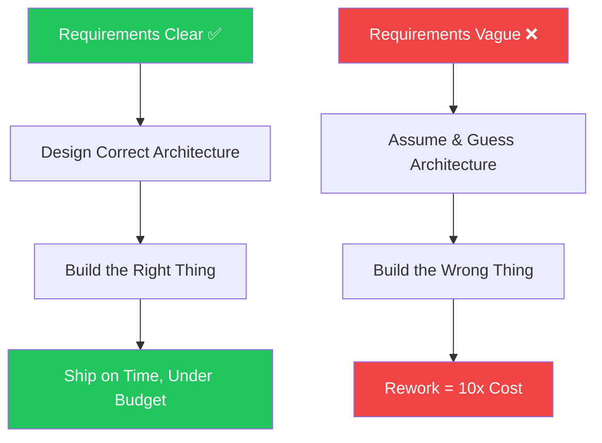

### The Real Cost of Getting Requirements Wrong

Industry data (IBM Systems Sciences Institute):

| Phase Where Bug Found | Cost to Fix |
|---|---|
| Requirements | 1x |
| Design | 5x |
| Implementation | 10x |
| Testing | 20x |
| Production | 100x–200x |

**Simple baat hai** — ek galat assumption requirements phase mein fix karo toh 1 rupee lagti hai. Production mein fix karo toh 100-200 rupee. Yeh kyun important hai — samajh gaya?

### What Requirements Gathering Actually Does

Requirements gathering is NOT just about listing features. It answers four fundamental questions:

1. **WHO** is this for? (users, scale, geography)
2. **WHAT** does it need to do? (functional requirements)
3. **HOW WELL** must it do it? (non-functional requirements)
4. **WHAT ARE** the constraints? (budget, tech stack, timeline)

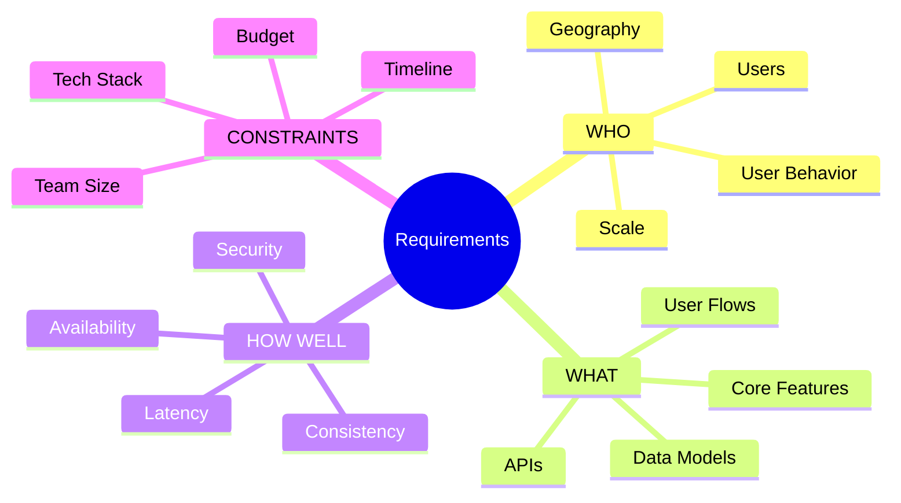

---

## 2. Functional Requirements — What the System DOES

### The Restaurant Menu Analogy

Functional requirements ek restaurant ke menu ki tarah hain. Menu define karta hai — "hum yeh serve karte hain, yeh nahi karte." Agar menu mein pizza hai toh customer pizza order kar sakta hai. Agar biryani nahi hai menu mein, toh chef nahi banayega (at least by design).

**Functional requirements = system ka "menu"** — kya kya kar sakta hai, kya nahi kar sakta.

### What Functional Requirements Include

- **User Actions**: Kya kya kar sakta hai user? (upload photo, send message, place order)
- **System Behaviors**: System kaise respond karta hai? (search results dikhana, notification bhejna)
- **APIs/Interfaces**: Konse endpoints expose hote hain?
- **Data Flows**: Data kahan se aata hai, kahan jaata hai?
- **Business Rules**: Specific logic (e.g., discount applies only if cart > ₹500)

### Example: Instagram Functional Requirements

```
CORE FEATURES (Must Have):
━━━━━━━━━━━━━━━━━━━━━━━━━
✅ User can create an account (email/phone/Google OAuth)
✅ User can upload a photo (with caption, tags, location)
✅ User can apply filters to photos
✅ User can follow/unfollow other users
✅ User can like a photo
✅ User can comment on a photo
✅ User sees a feed of photos from people they follow
✅ User can search by username or hashtag

SHOULD HAVE (Next Sprint):
━━━━━━━━━━━━━━━━━━━━━━━━━
🔶 Stories (24-hour disappearing content)
🔶 Direct messaging
🔶 Video upload (< 60 seconds)
🔶 Save/bookmark posts

OUT OF SCOPE (Not Now):
━━━━━━━━━━━━━━━━━━━━━
❌ Live streaming
❌ Shopping/marketplace
❌ Creator monetization
❌ AR filters
```

### Functional Requirements for WhatsApp

Let's get specific. In an interview, if someone says "design WhatsApp", your functional requirements conversation should look like:

```
Primary Features:
1. One-to-one messaging (text)
2. Group messaging (up to 256 members, later 1024)
3. Message delivery status (sent ✓, delivered ✓✓, read ✓✓ blue)
4. Media sharing (photos, videos, documents, audio)
5. Voice/Video calls
6. User presence (online/last seen)
7. Push notifications when app is in background

What we are NOT building (scope control):
❌ Stories/Status (optional — clarify with interviewer)
❌ Payment (WhatsApp Pay — separate system)
❌ Business API
❌ Web client (WhatsApp Web — separate)
```

### The MoSCoW Method for Prioritization

**M**ust Have → **S**hould Have → **C**ould Have → **W**on't Have

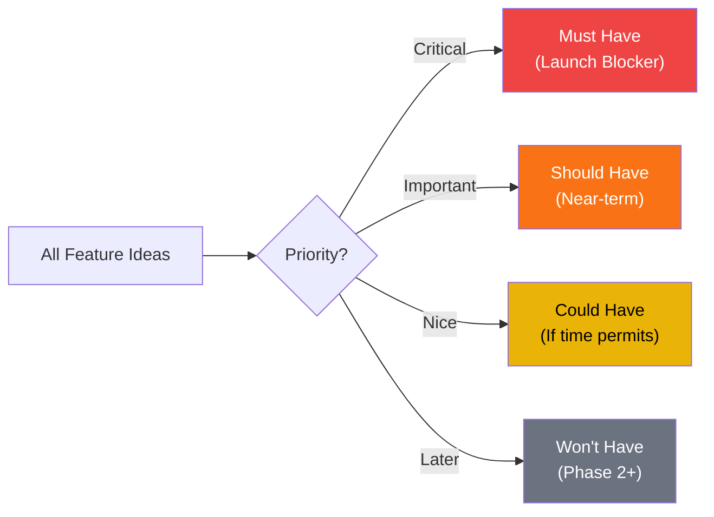

**Interview Tip**: In a 45-minute system design interview, define your Must Haves in the first 5 minutes. Then say "I'll focus on these core features — is that aligned with what you're looking for?" This shows scope awareness.

---

## 3. Non-Functional Requirements — How the System BEHAVES

### The Car Analogy

Functional requirement: "Car mujhe point A se point B le jaaye."

Non-functional requirements:
- **Latency**: Kitni fast? (0-60 mph in 3 seconds vs 12 seconds)
- **Availability**: Kitna reliable? (starts every time vs occasionally fails)
- **Scalability**: Kitna load handle kare? (5 passengers vs 50-seater bus)
- **Security**: Kitna safe? (airbags, ABS, crumple zones)
- **Consistency**: Speedometer hamesha accurate ho

**Non-functional requirements define the QUALITY of the system, not the features.**

### The Six Pillars of Non-Functional Requirements

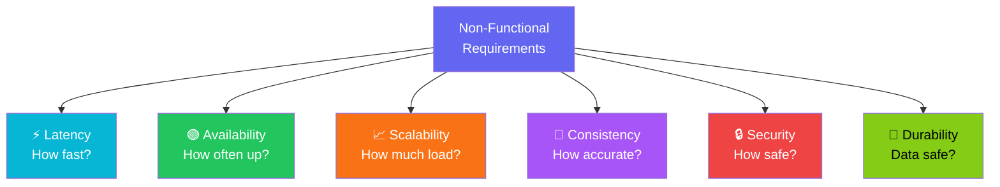

### 3.1 Latency

**What it is**: How quickly does the system respond to a request?

**Why it exists**: Users are impatient. Amazon found that every 100ms of additional latency costs them 1% in sales. Google found 500ms additional delay causes 20% fewer searches.

**How to think about it**:
- **p50 (median)**: 50% of requests are faster than this
- **p95**: 95% of requests are faster than this
- **p99**: 99% of requests are faster than this

**The p99 matters most** because that's the "slow tail" that real users experience.

| System Type | Typical Latency Targets |
|---|---|
| Search (Google, Swiggy search) | p50 < 100ms, p99 < 500ms |
| Chat (WhatsApp, Slack) | p50 < 500ms, p99 < 2s |
| Feed (Instagram, Twitter) | p50 < 200ms, p99 < 1s |
| Video streaming (Netflix, YouTube) | Initial load < 2s, buffering < 1s |
| Payment processing (Razorpay) | p50 < 1s, p99 < 3s |
| File upload | Depends on file size |

**Real Example — Zomato**:
```
Latency Requirements:
- Restaurant search results: < 200ms
- Menu page load: < 500ms
- Order placement API: < 1s
- Real-time tracking update: < 5s (polling interval)
```

### 3.2 Availability

**What it is**: What percentage of time is the system operational and serving requests?

**Why it exists**: Jab Swiggy down ho aur tu hungry ho — that's an availability failure. For businesses, downtime = lost revenue + lost trust.

Detailed coverage in [Section 5: Availability Nines](#5-availability-nines--99-vs-999-vs-9999).

### 3.3 Scalability

**What it is**: Can the system handle growing load without degrading?

**Two types**:
- **Vertical Scaling (Scale Up)**: Bigger machine — more RAM, more CPU. Limited ceiling, expensive.
- **Horizontal Scaling (Scale Out)**: More machines — add servers. Theoretically unlimited.

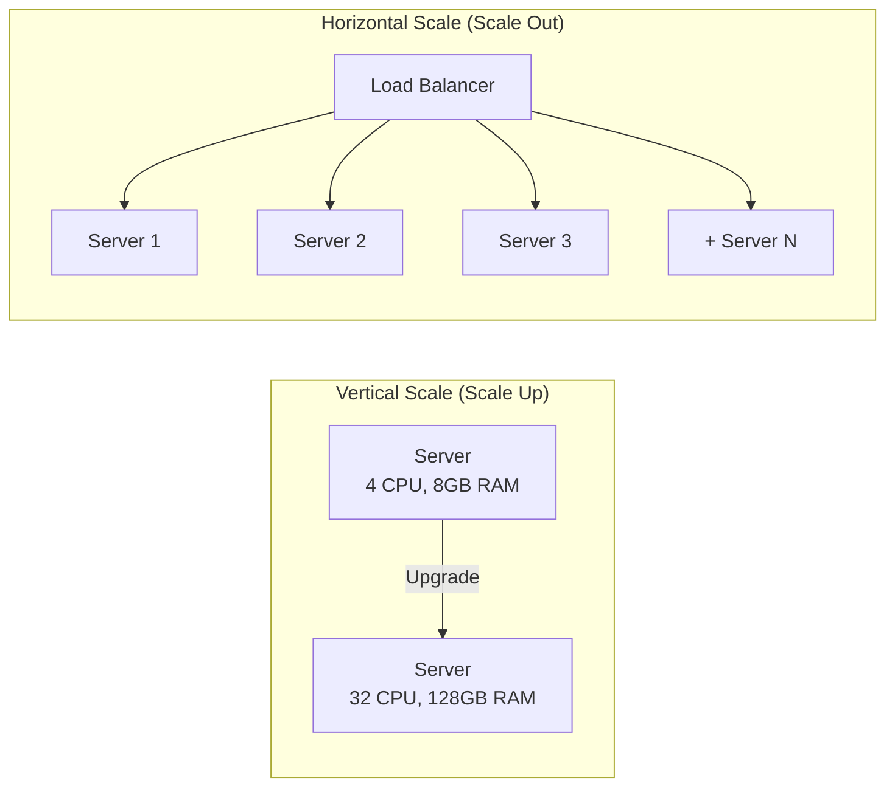

**Interview Tip**: Most modern systems use horizontal scaling for stateless components (application servers) and combination for stateful components (databases).

### 3.4 Security

Non-functional security requirements include:

```
Authentication: How do users prove identity?
  → JWT tokens, OAuth 2.0, session cookies

Authorization: What can each user do?
  → Role-based access control (RBAC), ACLs

Data Encryption:
  → In transit: TLS 1.3
  → At rest: AES-256

Rate Limiting:
  → 100 API requests per minute per user
  → DDoS protection

Compliance:
  → GDPR (European users)
  → HIPAA (healthcare data)
  → PCI-DSS (payment card data)
  → IT Act 2000 (India)
```

### 3.5 Durability

**What it is**: Agar system crash ho jaaye, kya data safe hai?

**Why it exists**: Durability != Availability. A system can be temporarily unavailable but data must NEVER be lost.

**Real example**: WhatsApp messages. Even if your phone dies, when you restore from backup, your messages are there. That's durability.

```
Durability targets:
- Bank transaction records: 100% (zero data loss)
- User photos (Instagram): 99.999999999% (11 nines)
- Application logs: 99.9% (some loss acceptable)
- Cached data: 0% (can be regenerated)
```

### Non-Functional Requirements Comparison Table

| NFR | Bad (Vague) | Good (Specific) |
|---|---|---|
| Latency | "System should be fast" | "p99 API response < 200ms" |
| Availability | "Should be highly available" | "99.99% uptime (< 52 min/year downtime)" |
| Scalability | "Support many users" | "Handle 10M DAU, peak 100K RPS" |
| Security | "Should be secure" | "End-to-end encrypted, GDPR compliant" |
| Durability | "Don't lose data" | "11 nines durability for user uploads" |
| Consistency | "Data should be correct" | "Strong consistency for payments, eventual for likes" |

---

## 4. SLA, SLO, SLI — The Reliability Trinity

### The Pizza Delivery Analogy

Imagine a pizza restaurant:
- **SLI** (Indicator): Kitne orders 30 minutes mein deliver hue? (Measurement)
- **SLO** (Objective): Internal target — "Hum chahte hain 95% orders 30 min mein deliver ho"
- **SLA** (Agreement): Customer ke saath contract — "Agar 30 min mein nahi aaya, order free"

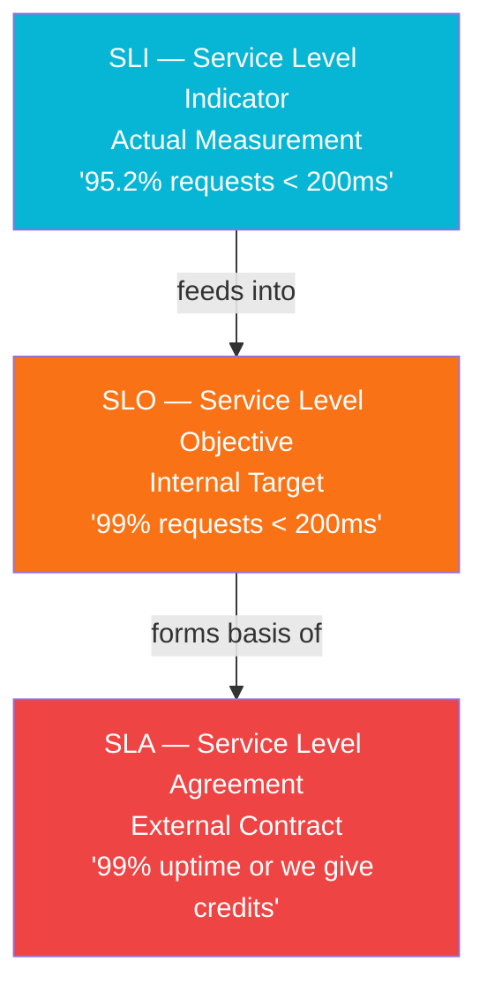

### SLI — Service Level Indicator

**What it is**: An actual measurement of how your service is performing RIGHT NOW.

**Examples**:
```
SLIs for different systems:

Availability SLI:
  = (successful_requests / total_requests) × 100
  Example: 9,950 successful out of 10,000 total = 99.5%

Latency SLI:
  = % of requests completing within threshold
  Example: 97% of requests complete within 200ms

Error Rate SLI:
  = (error_requests / total_requests) × 100
  Example: 0.3% of requests return 5xx errors

Throughput SLI:
  = requests processed per second
  Example: 45,000 RPS currently
```

### SLO — Service Level Objective

**What it is**: Your internal target for an SLI. The level you're TRYING to achieve.

**Why SLO != 100%**: Because building for 100% is infinitely expensive and technically impossible. You need an error budget.

**Error Budget concept**:
```
SLO: 99.9% availability per month
Total minutes in a month: 43,200 minutes
Allowed downtime (error budget): 0.1% × 43,200 = 43.2 minutes/month

If you've used 40 minutes of downtime already this month:
  → Only 3.2 minutes left
  → Risky to deploy new features this week
  → Focus on reliability improvements
```

### SLA — Service Level Agreement

**What it is**: A formal CONTRACT with customers, usually with financial penalties for breach.

**Real examples**:

| Provider | Service | SLA | Penalty for Breach |
|---|---|---|---|
| AWS EC2 | Compute | 99.99% monthly uptime | Up to 30% service credit |
| Google Cloud | Cloud SQL | 99.95% | Up to 50% service credit |
| Azure | Virtual Machines | 99.9% | Up to 25% service credit |
| Razorpay | Payment API | 99.9% | Negotiated per enterprise |

### The Hierarchy: Why Order Matters

```
SLA (loosest) ← SLO (tighter) ← SLI (actual measurement)

Example:
SLA to customers: 99.9% uptime
Internal SLO:     99.95% uptime  ← Buffer between SLO and SLA
Actual SLI:       99.97% uptime  ← Where you actually are

Why buffer? If SLO = SLA, any minor dip violates customer contract.
Buffer gives you room to detect and fix before breaching SLA.
```

**Interview Tip**: When asked about reliability, always mention SLO explicitly. Say: "I'd set an SLO of 99.99% availability, which gives us an error budget of about 52 minutes per year. This allows us to do controlled deployments while staying well within our SLA."

---

## 5. Availability Nines — 99% vs 99.9% vs 99.99%

### The School Attendance Analogy

Soch tu school mein hai:
- **99% attendance**: 3.65 din absent per year — theek hai
- **99.9% attendance**: 8.76 ghante absent per year — bahut accha
- **99.99% attendance**: 52.56 minutes absent per year — exceptional
- **99.999% attendance**: 5.26 minutes absent per year — almost perfect

Jaise attendance mein ek "9" ka difference bahut bada hota hai, waise hi system availability mein bhi.

### The Availability Nines Table

| Availability | Nines | Downtime per Year | Downtime per Month | Downtime per Week | Use Case |
|---|---|---|---|---|---|
| 90% | 1 nine | 36.5 days | 73 hours | 16.8 hours | Dev/test systems |
| 99% | 2 nines | 3.65 days | 7.2 hours | 1.68 hours | Internal tools |
| 99.5% | 2.5 nines | 1.83 days | 3.6 hours | 50.4 minutes | Blogs, portfolios |
| 99.9% | 3 nines | 8.76 hours | 43.8 minutes | 10.1 minutes | Most SaaS products |
| 99.95% | 3.5 nines | 4.38 hours | 21.9 minutes | 5.04 minutes | Enterprise SaaS |
| 99.99% | 4 nines | 52.56 minutes | 4.38 minutes | 1.01 minutes | Payments, Banking |
| 99.999% | 5 nines | 5.26 minutes | 25.9 seconds | 6.05 seconds | Telecom, Critical infra |
| 99.9999% | 6 nines | 31.5 seconds | 2.63 seconds | 0.6 seconds | Air traffic control |

### The Shocking Math

**Google's 99.99% uptime means:**
- 99.99% = only 0.01% downtime
- Minutes in a year = 365 × 24 × 60 = **525,600 minutes**
- Allowed downtime = 0.01% × 525,600 = **52.56 minutes per year**

That's less than ONE HOUR of downtime across the ENTIRE YEAR. And Google serves billions of users across hundreds of services.

**WhatsApp outage example (October 2021)**:
- WhatsApp + Instagram + Facebook were down for ~6 hours
- At their normal 99.9% SLO, their entire ANNUAL error budget is 8.76 hours
- That ONE outage consumed nearly their entire year's error budget

### How Availability Nines Affect Architecture

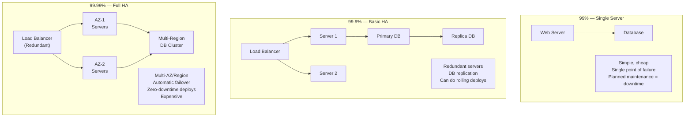

### Cost vs Availability Trade-off

This is a critical trade-off to articulate in interviews:

| Going from | to | Complexity | Cost Increase |
|---|---|---|---|
| 99% | 99.9% | Low | ~2x |
| 99.9% | 99.99% | Medium | ~5x |
| 99.99% | 99.999% | Very High | ~10x–20x |
| 99.999% | 99.9999% | Extreme | ~50x+ |

**Interview Tip**: Always ask the interviewer about the target availability BEFORE designing. A 99.9% system design is fundamentally different from a 99.999% design. The interviewer wants to see that you understand this trade-off.

---

## 6. DAU vs MAU — How to Use Scale Numbers

### The Gym Membership Analogy

Imagine a gym with 10,000 members (MAU — Monthly Active Members). But on any given day, only 300 people actually come (DAU — Daily Active Members). The gym needs to be designed for 300 people using it simultaneously, not 10,000.

But during sale season, 500 people might come on the same day — that's your PEAK load.

**DAU/MAU ratio = Stickiness ratio**. Higher ratio means users love your product and come back daily.

### DAU — Daily Active Users

**What it is**: Number of unique users who use your product on any given day.

**What it drives**:
- Server capacity (how many concurrent connections)
- Database read/write throughput
- Cache sizing
- CDN bandwidth

**How to estimate peak load from DAU**:

```
Rule of thumb: Peak traffic ≈ 3x average daily traffic

If DAU = 10 million users
Average daily sessions per user = ~2-3
Average session duration = 20 minutes
Active minutes per day = 10M × 2.5 × 20 = 500M user-minutes/day

Minutes in a day = 1,440
Average concurrent users = 500M / 1,440 ≈ 347,000 concurrent users

Peak concurrent users = 347,000 × 3 ≈ 1 million
```

### MAU — Monthly Active Users

**What it is**: Number of unique users who use your product at least once in a month.

**What it drives**:
- Total storage requirements (each user has data)
- Total registered user base
- Business metrics (is the product growing?)

### Real Numbers — Industry Benchmarks

| Platform | DAU | MAU | DAU/MAU Ratio |
|---|---|---|---|
| WhatsApp | 2 billion+ | 2 billion+ | ~85% (very sticky) |
| Instagram | 500 million+ | 2 billion+ | ~25% |
| Zomato | ~18 million | ~80 million | ~22% |
| YouTube | 122 million | 2.7 billion | ~5% (many watch without login) |
| Twitter/X | 238 million | 450 million | ~53% |

### DAU/MAU Stickiness Ratio

```
DAU/MAU Ratio Interpretation:
  > 50%   → Highly sticky (users come daily) — WhatsApp, Facebook Messenger
  20-50%  → Normal social app — Instagram, Twitter
  < 20%   → Occasional use — Zomato, travel apps
  < 5%    → Low engagement — most utility apps

High stickiness = users depend on your app = more servers needed at any time
Low stickiness = bursty usage = need good auto-scaling
```

### How to Use DAU in Capacity Estimation

```
Example: Design a system for Instagram-like app
DAU: 100 million users

Step 1: Estimate writes per day
  - Each user posts ~0.5 photos/day (many are lurkers)
  - 100M × 0.5 = 50 million photo uploads/day
  - 50M / 86,400 seconds ≈ 578 uploads/second (average)
  - Peak: 578 × 3 ≈ 1,734 uploads/second

Step 2: Estimate reads per day
  - Each user views ~50 photos/day (read-heavy!)
  - 100M × 50 = 5 billion photo views/day
  - 5B / 86,400 ≈ 57,870 reads/second (average)
  - Peak: 57,870 × 3 ≈ 173,600 reads/second

Step 3: Storage estimate
  - Average photo size: 1 MB (after compression)
  - 50M photos/day × 1 MB = 50 TB/day
  - After 1 year: 50 TB × 365 ≈ 18 PB/year
```

---

## 7. Read-Heavy vs Write-Heavy Systems — Why This Changes Everything

### The Library vs Newspaper Printing Press Analogy

**Read-heavy = Library**: Bahut saare log aate hain aur books padhte hain. Ek book hazaar log padh sakte hain. Reading easy hai, writing (adding new books) rare hai.

**Write-heavy = Newspaper printing press**: Har minute naya content create ho raha hai. News update ho rahi hai, articles write ho rahe hain, fast publish karna padta hai.

Same data. Completely different architecture decisions.

### How to Determine Read vs Write Ratio

In an interview, first estimate the ratio:

```
Read:Write Ratio Estimation Examples:

Twitter/X:
  - Reads (timeline views): 300,000/second
  - Writes (new tweets): 6,000/second
  → Ratio: 50:1 (extremely read-heavy)

WhatsApp:
  - Message sends (writes): ~100 billion/day → 1.16M/second
  - Message reads: ~1.16M/second (each write is one read, roughly)
  → Ratio: ~1:1 (write-heavy for a messaging system)

Swiggy/Zomato order tracking:
  - Location updates from drivers (writes): very frequent
  - Users checking location (reads): also frequent
  → Ratio: ~2:1 (slightly write-heavy during peak)

YouTube:
  - Video uploads (writes): 500 hours of video/minute
  - Video views (reads): billions/day
  → Ratio: 10,000:1 (massively read-heavy)
```

### Read-Heavy System Design Approach

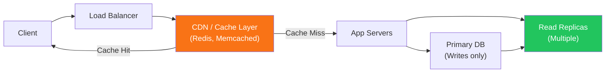

**Key techniques for read-heavy**:
- **Caching** (Redis, Memcached) — serve from memory, not DB
- **CDN** (Cloudflare, AWS CloudFront) — serve static content from edge
- **Read replicas** — multiple DB copies for reads, one for writes
- **Denormalization** — pre-compute and store data in read-optimized format
- **Pagination** — don't return everything at once

### Write-Heavy System Design Approach

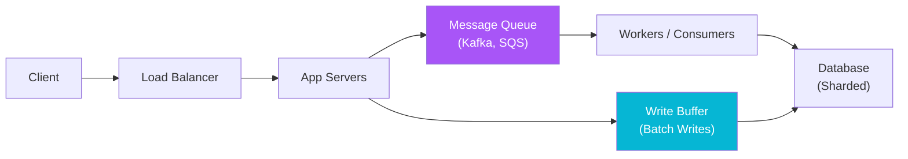

**Key techniques for write-heavy**:
- **Message queues** (Kafka, RabbitMQ) — buffer writes, decouple producers from consumers
- **Database sharding** — distribute writes across multiple DBs by user ID or region
- **Write batching** — group multiple writes into one DB operation
- **LSM-tree based DBs** (Cassandra, RocksDB) — optimized for writes
- **Async processing** — write fast, process later

### Comparison Table

| Factor | Read-Heavy | Write-Heavy |
|---|---|---|
| Examples | YouTube, Instagram, Netflix | Logging, Slack, IoT sensors |
| DB Strategy | Read replicas, denormalize | Sharding, write-optimized DBs |
| Caching | Aggressive caching | Less useful (data changes fast) |
| Consistency | Eventual often acceptable | Often needs strong consistency |
| Bottleneck | DB reads, network bandwidth | DB writes, disk I/O |
| DB Choice | PostgreSQL + replicas, DynamoDB | Cassandra, MongoDB, ClickHouse |
| Pattern | Cache-aside, CDN | Message queue, event streaming |

**Interview Tip**: As soon as you estimate the read:write ratio, explicitly state: "Since this is a read-heavy system with 50:1 ratio, I'll prioritize aggressive caching with Redis and add read replicas to PostgreSQL. This will handle most reads at the cache layer and reduce DB load by 80%+."

---

## 8. Consistency Requirements — When Does It Matter?

### The Bank vs Instagram Likes Analogy

**Bank Account Balance (Strong Consistency)**:
Tu apne account se ₹50,000 withdraw karta hai ATM se. Phir ek second baad tu apna balance check karta hai online banking mein. Balance MUST show ₹50,000 less. Agar nahi dikhaya, toh tu phir se withdraw kar sakta hai — bank doubles ka loss. Consistency here is CRITICAL.

**Instagram Likes (Eventual Consistency)**:
Tu ek meme pe like karta hai. 5 seconds baad tera dost wahi meme pe jaata hai — wo 99 likes dekh sakta hai even though tujhe 100 dikhaya. 30 seconds baad dono ko 100 dikhega. Koi problem? None. Koi bank nahi loota. This is fine.

### The CAP Theorem (Simplified)

In distributed systems, you can only guarantee TWO of three properties:

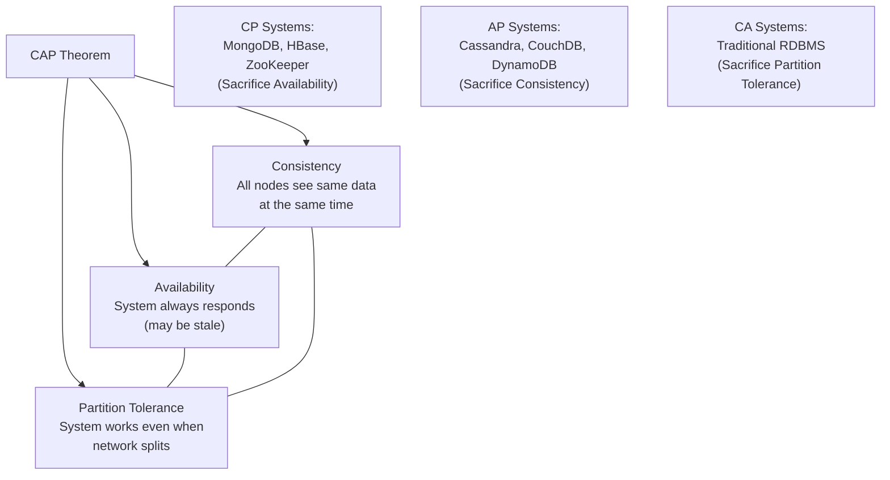

**In reality**: Network partitions WILL happen (cables fail, switches die). So you're always choosing between C and A during a partition.

### Types of Consistency

```
Strong Consistency (Linearizability):
  - Every read sees the most recent write
  - No stale reads ever
  - Examples: Bank transactions, inventory ("only 1 item left")
  - Cost: Higher latency, lower availability

Read-Your-Writes Consistency:
  - After you write something, you always see your own write
  - Others might see stale data
  - Example: Your own profile update on LinkedIn
  - Cost: Moderate

Eventual Consistency:
  - Given enough time, all nodes converge to same value
  - Reads might be stale for a short period
  - Examples: DNS propagation, social media likes/views
  - Cost: Low latency, high availability
```

### When to Use What

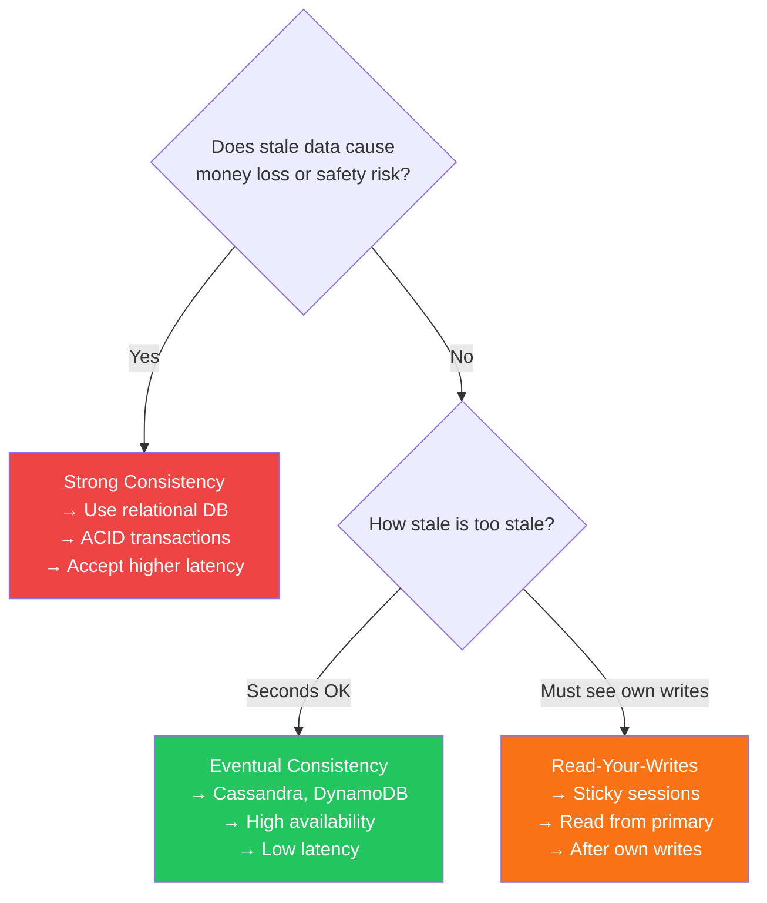

### Real-World Consistency Decisions

| Feature | Consistency Need | Why |
|---|---|---|
| Bank account balance | Strong | Double-spend problem |
| Hotel room booking | Strong | Overselling is a disaster |
| Stock price display | Strong | Trading decisions depend on it |
| Instagram post likes count | Eventual | A few seconds delay is fine |
| YouTube view count | Eventual | Approximate is OK |
| Swiggy order status | Eventual | 1-2 sec delay is acceptable |
| WhatsApp message delivery | At-least-once | Must deliver, duplicates handled |
| Flight seat reservation | Strong | 2 people cannot get seat 14A |
| WhatsApp group message order | Causal | Messages from same person should be ordered |

### Consistency in Interviews

When discussing consistency in an interview, use this framework:

```
Step 1: Identify the data entity
  → "What data are we talking about — user balance, post likes, inventory?"

Step 2: Ask the business question
  → "What happens if two users read different values simultaneously?"

Step 3: Classify the requirement
  → "This is financial data, so we NEED strong consistency"
  → "These are social likes, so eventual consistency is fine"

Step 4: Choose the technical solution
  → Strong: PostgreSQL with ACID, 2-phase commit
  → Eventual: Cassandra, DynamoDB, Redis
```

---

## 9. How to Extract Requirements in an Interview

### The Doctor Analogy

Ek doctor kabhi seedha operation shuru nahi karta. Pehle:
1. Symptoms poochta hai
2. Medical history leta hai
3. Tests karta hai
4. Diagnosis karta hai
5. THEN treatment plan banata hai

System design interview mein bhi — NEVER start designing before asking the right questions. Yeh kyun important hai? Because the interviewer intentionally gives you a vague problem to see IF you ask the right questions.

### The Requirements Extraction Framework

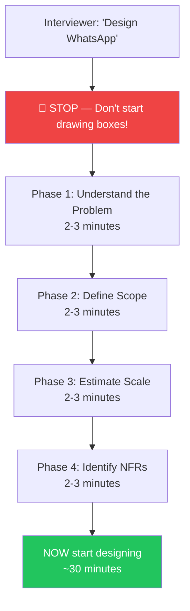

### The Questions to Ask (By Category)

#### Category 1: Clarify Scope (ask FIRST)

```
"Before I start, let me clarify the scope..."

1. "What are the CORE features you want me to focus on?
   For WhatsApp, should I cover:
   → One-to-one messaging? ✓ (definitely)
   → Group messaging? (maybe)
   → Voice/Video calls? (maybe separate)
   → Status/Stories? (probably skip)"

2. "Are we designing this from scratch, or is there
   an existing system to extend?"

3. "What is the time horizon — MVP or 5-year scale?"
```

#### Category 2: Scale Questions (always ask)

```
"Let me understand the scale..."

1. "How many Daily Active Users (DAU) are we targeting?"
   → This determines your entire compute and storage architecture

2. "What's the expected read:write ratio?"
   → This determines caching strategy and DB choice

3. "What are the peak traffic scenarios?"
   → Cricket World Cup final? Movie release on Netflix?

4. "Any geographic constraints?"
   → India only? Global? Specific regions?

5. "What's the expected growth rate?"
   → 2x per year? Need to design for headroom
```

#### Category 3: Performance Requirements

```
"What are the latency/performance expectations?"

1. "What's the acceptable latency for the core user journey?"
   → "How fast should messages deliver?"

2. "What's the target availability?"
   → "Is 99.9% acceptable or do we need 99.99%?"

3. "Is the system latency-sensitive or throughput-sensitive?"
   → Real-time gaming: latency critical
   → Batch data processing: throughput critical
```

#### Category 4: Data Questions

```
"Let me understand the data..."

1. "What data do we need to persist vs can be ephemeral?"
   → Messages: must persist
   → Typing indicators: ephemeral, can drop

2. "What are the data retention requirements?"
   → WhatsApp messages: forever (user's choice)
   → Stories: 24 hours

3. "Any compliance requirements? GDPR? HIPAA?"
   → This changes your storage and access patterns dramatically

4. "What's the consistency requirement for core data?"
   → "If a message is sent, can we tolerate it being undelivered?"
   → "Must message order be preserved?"
```

#### Category 5: Constraints

```
"Are there any technical constraints I should know about?"

1. "Is there a preferred tech stack?"
2. "Any existing systems this must integrate with?"
3. "Any cost constraints?"
4. "Any regulatory requirements for data residency?"
   → "Must Indian user data stay in India?"
```

### What NOT to Do in an Interview

```
❌ DON'T start drawing boxes immediately
❌ DON'T say "Let me design a microservices architecture..."
   (You don't know scale yet!)
❌ DON'T assume read:write ratio without asking
❌ DON'T skip NFRs — this is where most candidates fail
❌ DON'T ask too many questions (5-7 is enough)
❌ DON'T ask questions you can answer yourself
   ("Should I use HTTP?" — just assume REST unless told otherwise)
```

### How a Good Requirements Conversation Sounds

```
Interviewer: "Design WhatsApp."

YOU: "Great. Before I start designing, let me clarify a few things.

First, on scope — I'm assuming the core features are:
one-to-one messaging, group messaging, and media sharing.
Should I include voice/video calls, or focus on messaging first?

[Interviewer: Focus on messaging for now.]

On scale — WhatsApp has 2 billion users globally. Are we
targeting a similar scale, or is this a startup MVP?

[Interviewer: Let's say 50 million DAU to start.]

And for availability — messaging apps are critical communication
tools. Are we targeting 99.99% uptime, or is 99.9% acceptable?

[Interviewer: 99.99% please.]

And consistency — for message delivery, I assume we need
at-least-once delivery with no data loss, but message order
within a chat should be preserved. Is that right?

[Interviewer: Yes, that's correct.]

Great. Let me summarize what I heard:
- 50M DAU, messaging + media, no calls
- 99.99% availability
- At-least-once message delivery, ordered within chat
- [add storage/retention assumption if not asked]

NOW let me start with the high-level design..."
```

---

## 10. Real Example: WhatsApp Requirements Step by Step

### Step 1: Define the Product (2 minutes)

**What is WhatsApp?**
A mobile-first instant messaging platform that allows:
- Real-time text messaging between individuals and groups
- Media sharing (photos, videos, documents, voice notes)
- End-to-end encrypted communication
- Message delivery status (sent/delivered/read)
- Push notifications for offline users

### Step 2: Identify Users and Scale

```
Who are the users?
→ General consumers worldwide
→ Age range: 13 to 70+ (very broad)
→ Mix of mobile data, WiFi, and poor connectivity

Scale (as of 2024, real numbers):
→ Registered users: 3+ billion
→ DAU: 2+ billion
→ Messages sent per day: 100 billion+
→ Messages per second: ~1.16 million/second
→ Countries: 180+

For our design (interview scope):
→ DAU: 500 million (scaled-down for clarity)
→ Messages per day: 25 billion
→ Messages per second: ~290,000/second
```

### Step 3: Functional Requirements

```
MUST HAVE (P0 — Core Product):
━━━━━━━━━━━━━━━━━━━━━━━━━━━━
1. User Registration & Authentication
   - Phone number-based signup
   - OTP verification
   - Profile photo + display name

2. One-to-One Messaging
   - Send/receive text messages
   - Message delivery status (✓ sent, ✓✓ delivered, ✓✓ blue = read)
   - Push notification when user is offline

3. Group Messaging
   - Create groups (up to 256 members)
   - Send messages to group
   - Admin controls (add/remove members)

4. Media Sharing
   - Photos (up to 16 MB)
   - Videos (up to 100 MB)
   - Documents (PDFs, etc., up to 100 MB)
   - Voice messages

5. Message Storage
   - Local device storage (primary)
   - Cloud backup (optional, encrypted)

SHOULD HAVE (P1 — Important):
━━━━━━━━━━━━━━━━━━━━━━━━━━━━
6. End-to-End Encryption (Signal Protocol)
7. User Presence (online/last seen)
8. Typing indicators
9. Message reactions (emoji)

COULD HAVE (P2 — Nice to Have):
━━━━━━━━━━━━━━━━━━━━━━━━━━━━━━
10. Status/Stories
11. Location sharing

OUT OF SCOPE (Not Designing Today):
━━━━━━━━━━━━━━━━━━━━━━━━━━━━━━━━━
❌ Voice/Video calls
❌ WhatsApp Pay
❌ WhatsApp Business API
❌ WhatsApp Web
```

### Step 4: Non-Functional Requirements

```
Availability:
  Target: 99.99% uptime
  Reason: Messaging is critical communication — people rely on it
  Allowed downtime: ~52 minutes/year
  Strategy: Multi-region deployment with automatic failover

Latency:
  Message delivery (sender → recipient, both online): < 500ms
  Message delivery (recipient offline → online): < 1 second
  Media upload acknowledgement: < 2 seconds
  Notification delivery: < 5 seconds

Consistency:
  Message ordering within a chat: Causal consistency (must maintain order)
  Message delivery: At-least-once (better to get duplicate than miss)
  Delivery status: Eventual consistency (✓✓ blue might lag slightly)
  User presence: Eventual consistency (last seen can be slightly stale)

Durability:
  Messages: Must not be lost once acknowledged by server
  Media: 99.999% durability (extremely rare to lose)
  If user deletes: Permanently gone (compliance — GDPR right to be forgotten)

Scalability:
  DAU: 500 million, growing 10% YoY
  Messages/second: 290,000 peak, designed for 500,000
  Concurrent connections: Up to 100 million simultaneous (WebSocket connections)
  Storage growth: ~20 TB/day (accounting for media)

Security:
  End-to-end encryption: Signal Protocol (no server can read messages)
  Data in transit: TLS 1.3
  Auth: JWT tokens + OTP verification
  Data residency: Must comply with local laws (India's DPDP Act, EU GDPR)
```

### Step 5: Data Estimation

```
Messages:
  ├── 25 billion messages/day
  ├── Average message size: 100 bytes (text)
  ├── 25B × 100 bytes = 2.5 TB/day (text messages)
  └── With media metadata: ~5 TB/day

Media:
  ├── ~2 billion media messages/day (8% of messages)
  ├── Average media size: 5 MB
  └── 2B × 5 MB = 10 PB/day (media files)
     → Stored in distributed object storage (like AWS S3)
     → Not on message servers!

Users:
  ├── 500 million DAU × 1 KB profile = 500 GB profiles
  ├── Contact lists: ~500 bytes × 500M = 250 GB
  └── Message history: varies (users control own storage)

Total storage growth: ~10 PB/day (dominated by media)
```

### Step 6: The Requirements Summary Card

```
┌─────────────────────────────────────────────────┐
│           WHATSAPP — REQUIREMENTS CARD           │
├─────────────────────────────────────────────────┤
│ SCALE                                            │
│  DAU: 500 million                                │
│  Messages/day: 25 billion                        │
│  Peak RPS: 500,000 msg/sec                       │
│  Concurrent connections: 100M                    │
├─────────────────────────────────────────────────┤
│ FUNCTIONAL                                       │
│  ✅ 1-1 and group messaging (≤256 members)       │
│  ✅ Media sharing (photo/video/doc/voice)        │
│  ✅ Delivery status (sent/delivered/read)        │
│  ✅ Push notifications                           │
│  ✅ E2E encryption                               │
│  ❌ Voice/video calls (out of scope)             │
├─────────────────────────────────────────────────┤
│ NON-FUNCTIONAL                                   │
│  Availability: 99.99% (52 min/year downtime)    │
│  Latency: < 500ms message delivery              │
│  Consistency: At-least-once delivery            │
│  Durability: No message loss after ACK          │
│  Security: Signal Protocol E2E encryption       │
├─────────────────────────────────────────────────┤
│ DATA                                             │
│  Storage growth: ~10 PB/day (media-heavy)        │
│  Media: Object storage (S3-compatible)           │
│  Messages: Distributed key-value store          │
│  Retention: User-controlled (backup)             │
└─────────────────────────────────────────────────┘
```

### The WhatsApp Architecture Flow

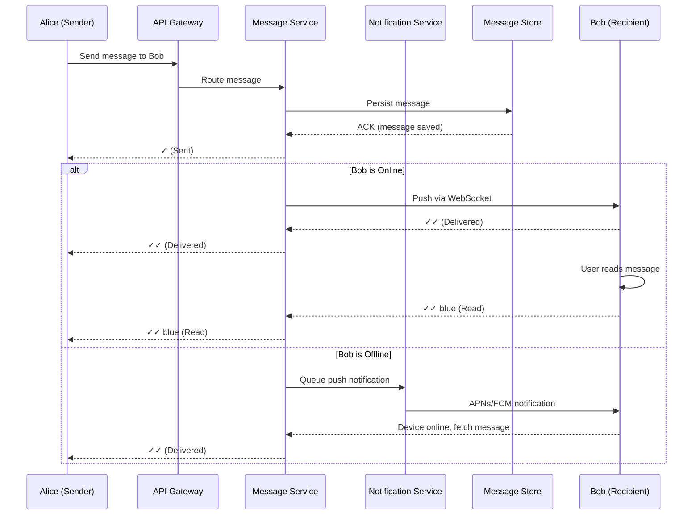

---

## 11. Requirements Template

Copy this template at the start of every system design — interview ya real project dono ke liye:

```markdown
# [SYSTEM NAME] — Requirements Document

## 1. Problem Statement
[One paragraph: what problem are we solving and for whom?]

## 2. Users & Scale
| Metric | Value |
|--------|-------|
| DAU | |
| MAU | |
| Peak RPS | |
| Geographic scope | |
| Growth rate (YoY) | |

## 3. Functional Requirements

### Must Have (P0 — Launch Blockers)
1. 
2. 
3. 

### Should Have (P1 — Important)
1. 
2. 

### Could Have (P2 — Nice to Have)
1. 

### Out of Scope
- 
- 

## 4. Non-Functional Requirements
| Category | Requirement | Target |
|----------|-------------|--------|
| Availability | Uptime | 99.X% |
| Latency | p99 response time | < Xms |
| Read:Write Ratio | | X:1 |
| Consistency | Core data | Strong/Eventual |
| Security | Encryption | At rest + In transit |
| Compliance | | GDPR / HIPAA / other |

## 5. Data Estimates
| Data Type | Size | Volume | Growth |
|-----------|------|--------|--------|
| | | | |

## 6. SLA/SLO
- SLO: X.XX% availability = X min downtime/year
- Latency SLO: pXX < Xms
- Error rate SLO: < X%

## 7. Constraints
- Budget: 
- Timeline: 
- Tech stack: 
- Team size: 

## 8. Assumptions
[List things you're assuming that should be validated]
```

---

## 12. Common Pitfalls

### Pitfall 1: Starting to Design Before Gathering Requirements

**Wrong approach**:
> "Okay, let me design WhatsApp. I'll use microservices with Kafka..."

**Right approach**:
> "Before I start, let me clarify scale and scope. What's the expected DAU?"

---

### Pitfall 2: Only Thinking About Functional Requirements

Candidates often spend all their time on features and forget the non-functionals. The NFRs drive 80% of the interesting architectural decisions.

**Wrong**: "Users can send messages, view chats, and receive notifications."

**Right**: The above PLUS — "With 99.99% availability, we need multi-region deployment. With 500K messages/sec, we need distributed message queues. With E2E encryption requirements, we cannot cache message content."

---

### Pitfall 3: Vague Non-Functional Requirements

```
❌ "The system should be highly available"
✅ "The system should be 99.99% available — that's less than 52 minutes
    downtime per year, requiring multi-AZ deployment with auto-failover"

❌ "The system should be scalable"
✅ "The system should handle 10M DAU today and scale to 100M within 2 years
    without architectural changes — this means stateless services and
    horizontal scaling from day 1"
```

---

### Pitfall 4: Ignoring Read:Write Ratio

Not asking this question leads to wrong database choices and missing critical caching layers.

---

### Pitfall 5: Assuming Consistency Requirements

Every piece of data has different consistency needs. Don't apply one-size-fits-all.

```
Banking transaction: MUST be strongly consistent
User's own profile: Read-your-writes consistency  
Post like count: Eventual consistency is fine
Real-time stock price: Strong or near-strong consistency
```

---

### Pitfall 6: Not Discussing Trade-offs

Requirements have trade-offs. Articulate them:
- Higher availability = more cost and complexity
- Strong consistency = higher latency
- Better latency = more cache, possible stale data

---

## 13. Common Interview Questions

### On Requirements Gathering

**Q1: Why do we gather requirements before designing?**
> Requirements prevent us from solving the wrong problem. A 99.99% availability design is fundamentally different from a 99.9% design. A read-heavy system uses completely different technology choices than a write-heavy one. Without requirements, we're guessing.

**Q2: What's the difference between functional and non-functional requirements?**
> Functional = what the system does (features, APIs, user actions). Non-functional = how well it does it (latency, availability, scalability, security). In interviews, candidates often ace functional requirements but fail to articulate NFRs. NFRs drive the most interesting architectural decisions.

**Q3: How do you handle conflicting requirements?**
> Prioritize using business impact. Usually: reliability > performance > features. Explicitly discuss trade-offs with the interviewer — "If we need 99.999% availability, we'll need to sacrifice some write latency due to synchronous replication. Is that acceptable?"

**Q4: How do you know when you have enough requirements?**
> When you can answer: Who uses it? At what scale? What must it do? How fast? How reliably? What consistency model? At that point, you have enough to make informed architectural decisions.

### On SLA/SLO/SLI

**Q5: What's the difference between SLA, SLO, and SLI?**
> SLI is the actual measurement (99.97% uptime measured). SLO is your internal target (99.99%). SLA is the customer-facing contract (99.9%). SLO should be tighter than SLA to give you buffer. SLI is what you actually measure to see if you're meeting your SLO.

**Q6: What does 99.99% availability mean in practice?**
> 99.99% = 4 nines = 52.56 minutes of allowed downtime per year. This requires multi-AZ deployment, automatic failover, zero-downtime deployment processes, and active monitoring with fast incident response. It's expensive — jumping from 99.9% to 99.99% roughly doubles infrastructure cost.

**Q7: What is an error budget and how do you use it?**
> Error budget = 100% - SLO. If SLO is 99.9%, error budget is 0.1% = 43.8 minutes/month. When the budget is healthy (lots remaining), you can deploy more freely. When the budget is nearly exhausted, you freeze deployments and focus on reliability. This balances reliability with development velocity.

### On Scale

**Q8: How do you estimate scale from DAU?**
> From DAU, estimate: active users per hour (DAU/24), sessions per user (~2-3), requests per session (~10-50). Apply 3x for peak. Example: 10M DAU → 417K/hour average → 4.17M/hour peak → 1,160 RPS peak. Then size your infrastructure for that peak + 20% headroom.

**Q9: When is a system considered "read-heavy"?**
> When read:write ratio exceeds 10:1. Twitter is 50:1, YouTube is even higher. Read-heavy systems prioritize caching (Redis, CDN), read replicas, and denormalization. A 50:1 ratio means you can serve 49 out of 50 requests from cache and only 1 needs to hit the database.

### On Consistency

**Q10: When should you choose eventual consistency over strong consistency?**
> Eventual consistency is appropriate when: (1) slight staleness doesn't cause financial or safety harm, (2) you need high availability and low latency at scale, (3) data can tolerate brief divergence between nodes. Examples: social media likes, view counts, user presence. Strong consistency is mandatory for: financial transactions, inventory, reservations, anything where two conflicting reads could cause real-world harm.

**Q11: Can you give an example of where eventual consistency caused a real problem?**
> Amazon's shopping cart bug — in early distributed systems, a user removing an item from cart might see it reappear after a page refresh due to eventual consistency. The fix: treat the cart as a conflict-free data type (CRDT) where adds always win over deletes, accepting a slightly unintuitive behavior to maintain availability.

---

## 14. Key Takeaways

```
┌─────────────────────────────────────────────────────────┐
│                    KEY TAKEAWAYS                         │
├─────────────────────────────────────────────────────────┤
│                                                          │
│  1. REQUIREMENTS FIRST, ALWAYS                          │
│     Never start designing until you've gathered them.   │
│     The interviewer is testing if you ask the right     │
│     questions — that's part of the evaluation.          │
│                                                          │
│  2. FUNCTIONAL vs NON-FUNCTIONAL                        │
│     Functional = what it does (features)                │
│     Non-functional = how well it does it (quality)      │
│     NFRs drive 80% of interesting design decisions.     │
│                                                          │
│  3. SLA > SLO > SLI (remember the hierarchy)           │
│     SLI: Measured. SLO: Internal target.                │
│     SLA: Customer contract. SLO must be tighter than    │
│     SLA to give you an error budget buffer.             │
│                                                          │
│  4. AVAILABILITY MATH                                    │
│     99.9% = 8.76 hours/year downtime                   │
│     99.99% = 52.56 minutes/year downtime               │
│     Each "9" = 10x more availability, ~2-5x more cost. │
│                                                          │
│  5. DAU DRIVES CAPACITY                                 │
│     From DAU → estimate RPS → size your infrastructure. │
│     Peak = 3x average. Design for peak + 20% headroom.  │
│                                                          │
│  6. READ:WRITE RATIO CHANGES EVERYTHING                 │
│     Read-heavy → caching, CDN, read replicas           │
│     Write-heavy → queues, sharding, write-optimized DB  │
│     Always ask this in an interview before designing.   │
│                                                          │
│  7. CONSISTENCY IS NOT BINARY                           │
│     Strong for money/safety. Eventual for social data.  │
│     Always justify your consistency choice with a       │
│     business reason, not just a technical one.          │
│                                                          │
│  8. SCOPE CONTROL IS A SKILL                            │
│     Say what you're NOT building. "Out of scope" shows  │
│     engineering maturity — you understand trade-offs.   │
│                                                          │
│  9. BE SPECIFIC — NO VAGUE REQUIREMENTS                 │
│     "Fast" → "p99 < 200ms"                             │
│     "Scalable" → "100K RPS with 50M DAU"               │
│     "Highly available" → "99.99% uptime"                │
│                                                          │
│  10. WHATSAPP SUMMARY                                   │
│     500M DAU, 290K msg/sec, 99.99% availability,       │
│     at-least-once delivery, causal message ordering,   │
│     E2E encrypted, ~10 PB/day storage (media-heavy)    │
│                                                          │
└─────────────────────────────────────────────────────────┘
```

---

## Next Steps

Continue to [Capacity Estimation](../03-capacity-estimation/README.md) — where you'll learn to turn these requirements into actual numbers: how many servers, how much storage, what bandwidth.

The requirements you gather here are the INPUT to capacity estimation. Without good requirements, your capacity estimates are just guesses.

---

*Requirements gathering is not a phase you rush through — it IS the design. The best engineers spend more time on requirements than on code, because they know that every hour spent clarifying requirements saves ten hours of rework.*
