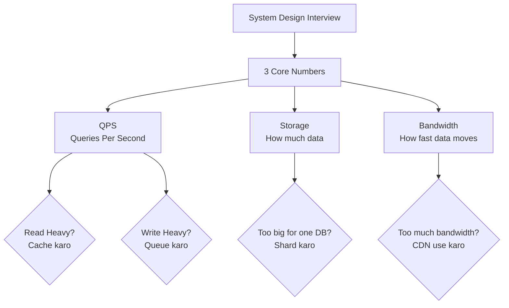
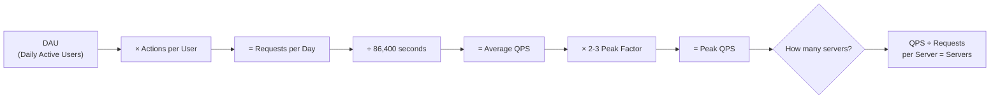
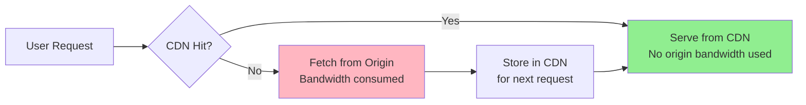
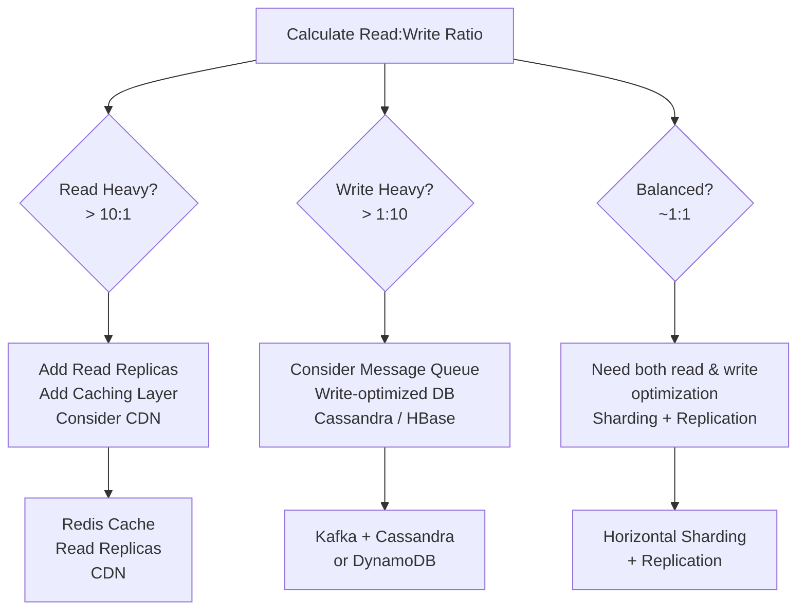
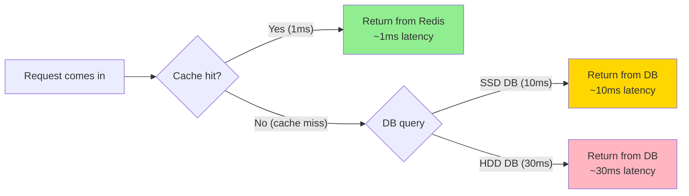
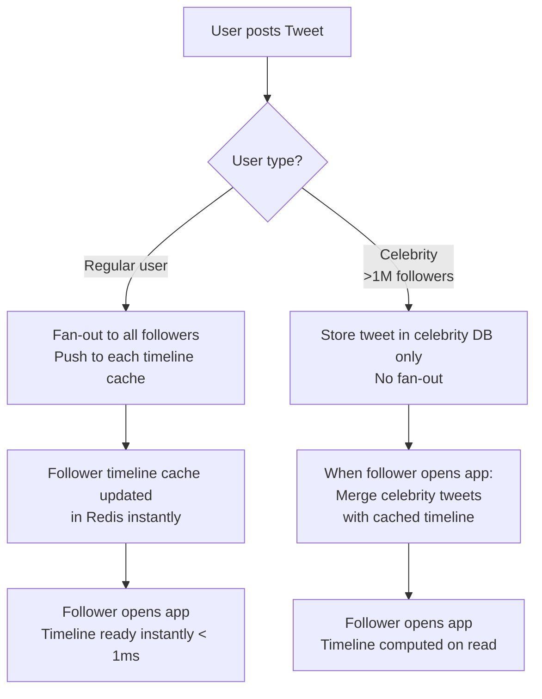
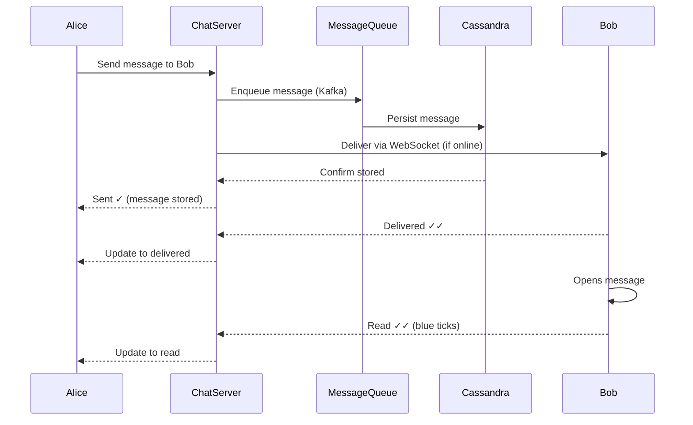

# Capacity Estimation & Back-of-Envelope Math

> "Give me six hours to chop down a tree and I will spend the first four sharpening the axe." — Abraham Lincoln
>
> System design mein bhi, estimation pehle karo — design baad mein. Before you draw a single box in your architecture diagram, you need numbers.

---

## Table of Contents

1. [Why Capacity Estimation Matters](#1-why-capacity-estimation-matters)
2. [The 3 Numbers That Define Every System](#2-the-3-numbers-that-define-every-system)
3. [Powers of 2 Cheat Sheet & Unit Conversions](#3-powers-of-2-cheat-sheet--unit-conversions)
4. [Traffic Estimation: DAU to QPS](#4-traffic-estimation-dau-to-qps)
5. [Storage Estimation](#5-storage-estimation)
6. [Bandwidth Estimation](#6-bandwidth-estimation)
7. [Read/Write Ratio and What It Implies](#7-readwrite-ratio-and-what-it-implies)
8. [Cache Memory Estimation (The 80/20 Rule)](#8-cache-memory-estimation-the-8020-rule)
9. [Latency Numbers Every Engineer Must Know](#9-latency-numbers-every-engineer-must-know)
10. [Worked Example 1: URL Shortener](#10-worked-example-1-url-shortener)
11. [Worked Example 2: Twitter](#11-worked-example-2-twitter)
12. [Worked Example 3: WhatsApp](#12-worked-example-3-whatsapp)
13. [Common Rounding Shortcuts for Interviews](#13-common-rounding-shortcuts-for-interviews)
14. [Common Interview Questions](#14-common-interview-questions)
15. [Key Takeaways](#15-key-takeaways)

---

## 1. Why Capacity Estimation Matters

### The Analogy: Banquet Planning Karna

Socho tum ek shaadi organise kar rahe ho. Tumhe pehle decide karna hoga:
- Kitne log aayenge? (100? 1000?)
- Kitna khana chahiye? (50 kg rice vs 500 kg rice)
- Hall kitna bada chahiye? (Ghar ka lawn vs Taj Banquet Hall)

Agar tumne 200 log estimate kiye aur 2000 aa gaye — **chaos**. Agar tumne 2000 ke liye book kiya aur 100 aaye — **paisa barbad**.

**Same thing with systems.** Yeh kyun important hai:

### Over-Provisioning = Wasting Money

Netflix ne 2016 mein AWS pe **$80 million+ per year** kharch kiya. Agar unka estimate galat hota aur unhone 3x unnecessary servers chalaaye hote, woh $240 million waste karte. At scale, every wrong estimate costs real money.

### Under-Provisioning = System Crashes

**Instagram 2010**: Launch ke baad pehle hin din 25,000+ users aaye. Unke servers crash ho gaye kyunki unhone itne traffic ka estimate hi nahi kiya tha.

**Twitter 2009**: Koi bhi celebrity tweet karti thi toh "Fail Whale" aata tha. System down ho jaata tha kyunki write load estimate wrong tha.

**Zomato IPO day 2021**: App crash ho gayi kyunki expected se 10x zyada log app open kar rahe the simultaneously.

### What Estimation Tells You

```
Over-provisioning → Waste karo paise
Under-provisioning → System crash karo
Right estimation → Sahi architecture choose karo
```

Estimation tells you:
- **Architecture choice**: Monolith thik hai ya microservices chahiye?
- **Database choice**: Single Postgres thik hai ya Cassandra distribute karna padega?
- **Caching**: Cache chahiye bhi ya nahi?
- **Sharding**: Ek database server mein data fit hoga ya nahi?
- **Cost**: AWS bill $500/month hoga ya $500,000/month?

### The Core Principle: Approximately Right > Precisely Wrong

```
Interview mein kya chahiye:
✅ "Roughly 50,000 reads per second" — perfect
✅ "Between 40K and 60K reads per second" — also fine
❌ "Exactly 47,832 reads per second" — over-precision, interviewer frustrated ho jayega
❌ No estimation at all — worst thing you can do
```

Estimation ka goal hai **order of magnitude** pakadna. Is cheez ko scale karne ke liye ek server enough hai ya 1000? That's the question.

---

## 2. The 3 Numbers That Define Every System

### The Analogy: Ek Restaurant Ka Report Card

Koi bhi restaurant evaluate karna ho toh teen cheezein poochho:
1. **Kitne customers aate hain per hour?** (Traffic)
2. **Kitni storage hai — fridge, pantry mein?** (Storage)
3. **Kitchen ka throughput kya hai — kitna khana per hour serve ho sakta hai?** (Bandwidth)

**Har system bhi inhi teen numbers se define hota hai:**

### Number 1: QPS (Queries Per Second)

*"Is system pe kitna load hai?"*

- **Read QPS**: Kitni baar data fetch ho raha hai per second
- **Write QPS**: Kitni baar data write ho raha hai per second
- **Peak QPS**: Maximum load at any point (usually 2-3x average)

### Number 2: Storage

*"Kitna data store karna hai aur kitne time ke liye?"*

- Raw data size per item
- Items per day/month
- Retention period (6 months? 5 years? Forever?)
- Always multiply by replication factor (usually 3x)

### Number 3: Bandwidth

*"Data kitna fast travel karna chahiye?"*

- Ingress (data aana — writes)
- Egress (data jaana — reads)
- Peak bandwidth (usually 3x average)



---

## 3. Powers of 2 Cheat Sheet & Unit Conversions

### The Analogy: Roti Ki Size

1 roti = 1 byte. Ab:
- 1000 rotis = 1 kilogram worth of rotis = **~1 KB**
- 1 million rotis = 1 tonne = **~1 MB**
- 1 billion rotis = **~1 GB** (poori Delhi ka ek din ka ration)
- 1 trillion rotis = **~1 TB** (poore India ka mahine bhar ka ration)

### Powers of 2 (Must Memorize)

| Power | Exact Value | Approx | Name | Real Example |
|-------|-------------|--------|------|-------------|
| 2^10 | 1,024 | ~1 thousand | 1 KB | One plain text page |
| 2^20 | 1,048,576 | ~1 million | 1 MB | One MP3 song (30 sec) |
| 2^30 | 1,073,741,824 | ~1 billion | 1 GB | One HD movie (720p) |
| 2^40 | ~1.1 trillion | ~1 trillion | 1 TB | 250 HD movies |
| 2^50 | ~1.1 quadrillion | ~1 quadrillion | 1 PB | Netflix stores ~petabytes |

### Time Conversions (Ye yaad karo — har estimation mein kaam aayega)

| Duration | Seconds | Shortcut |
|----------|---------|---------|
| 1 minute | 60 seconds | 60 |
| 1 hour | 3,600 seconds | ~4,000 |
| 1 day | 86,400 seconds | **~100,000 (10^5)** |
| 1 month | ~2,600,000 seconds | **~2.5 million** |
| 1 year | ~31,500,000 seconds | **~30 million (3 × 10^7)** |

**Interview shortcut**: `1 day = 86,400 seconds` — yeh yaad karo. Har estimate mein use hoga.

### Storage Unit Quick Reference

```
Bytes → KB → MB → GB → TB → PB → EB

1 KB = 1,000 bytes (or 1,024 — use 1,000 for easy math)
1 MB = 1,000 KB
1 GB = 1,000 MB
1 TB = 1,000 GB
1 PB = 1,000 TB

Memory trick:
- Ek tweet (280 chars) ≈ 280 bytes ≈ 0.28 KB
- Ek WhatsApp message ≈ 100-200 bytes
- Ek compressed photo ≈ 200 KB - 2 MB
- Ek HD video (1 min) ≈ 100 MB
- Ek 4K video (1 min) ≈ 375 MB
```

### Availability / SLA Numbers

| Availability | Downtime Per Year | Downtime Per Month | Use Case |
|-------------|-------------------|-------------------|---------|
| 99% (2 nines) | 3.65 days | 7.3 hours | Internal tools |
| 99.9% (3 nines) | 8.76 hours | 43.8 minutes | Most SaaS products |
| 99.99% (4 nines) | 52.6 minutes | 4.4 minutes | Banking, e-commerce |
| 99.999% (5 nines) | 5.26 minutes | 26 seconds | Mission critical (telecom) |

> **Interview tip**: Jab interviewer pooche "high availability chahiye" — always ask "kitna exactly? 3 nines? 4 nines?" — this question itself impresses them.

---

## 4. Traffic Estimation: DAU to QPS

### The Analogy: Mumbai Local Train

Mumbai local mein daily 7.5 million passengers travel karte hain (DAU = 7.5M). Lekin ye 7.5M log ek second mein nahi chadhte. Rush hours (8-10 AM, 6-8 PM) mein load zyada hota hai — **peak traffic**.

System design mein bhi yahi:
- DAU (Daily Active Users) = Total passengers per day
- Peak QPS = Rush hour load

### The Formula

```
Step 1: Start with DAU
Step 2: Estimate actions per user per day
Step 3: Total requests per day = DAU × actions
Step 4: Average QPS = Total requests / 86,400 seconds
Step 5: Peak QPS = Average QPS × 2 to 3 (for rush hours)
```

### Worked Formula with Real Numbers

```
Platform: Zomato (food delivery app)
DAU: 10 million users

User behavior per day:
- Opens app: 3 times
- Searches restaurant: 2 times
- Views menu: 3 times
- Places order: 0.1 times (1 in 10 users orders per day)
- Checks order status: 2 times (only for orderers)

Read requests per user = 3 + 2 + 3 = 8
Write requests per user = 0.1 (order) + 0.1×2 (status updates)

Total reads per day = 10M × 8 = 80 million
Total writes per day = 10M × 0.1 = 1 million

Read QPS = 80,000,000 / 86,400 ≈ 925 reads/second
Write QPS = 1,000,000 / 86,400 ≈ 12 writes/second

Peak QPS (3x during lunch/dinner rush):
Peak Read QPS = 925 × 3 ≈ 2,800 reads/second
Peak Write QPS = 12 × 3 ≈ 36 writes/second
```

### Traffic Estimation Flow



### Typical DAU Numbers for Reference

| Company | DAU (approx) | Notes |
|---------|-------------|-------|
| WhatsApp | 2 billion total, ~800M DAU | 70B messages/day |
| Instagram | 500M DAU | 100M photos/day |
| YouTube | 122M DAU | 500 hours video uploaded/min |
| Twitter/X | 250M DAU | 500M tweets/day |
| Zomato | 17M DAU (India) | Peak at lunch/dinner |
| Swiggy | 15M DAU (India) | Similar to Zomato |

> **Interview tip**: Interviewers will give you the DAU. Tumhe sirf actions per user estimate karni hai — jo common sense se milti hai. "Ek Instagram user din mein kitni photos dekhta hai?" — 20-30 reasonable estimate hai.

---

## 5. Storage Estimation

### The Analogy: Warehouse Planning

Amazon ka warehouse plan karte time pehle estimate karte hain:
- Ek item kitna space leta hai? (average item size)
- Kitne items aayenge per day? (daily writes)
- Items kitne time tak store honge? (retention period)

Storage = Item Size × Items per Day × Days Retained

### The Formula

```
Storage per day = Size per record × Records per day

Total storage = Storage per day × Retention days

With replication (usually 3x):
Total storage with replication = Total storage × 3
```

### Components of Record Size

```
Har record mein multiple fields hote hain:

Example: A tweet record
───────────────────────────────────────
Field               Size
───────────────────────────────────────
tweet_id            8 bytes  (64-bit int)
user_id             8 bytes  (64-bit int)
content             280 bytes (text, UTF-8)
created_at          8 bytes  (timestamp)
like_count          4 bytes  (int)
retweet_count       4 bytes  (int)
location            16 bytes (lat/lon)
───────────────────────────────────────
TOTAL               ~328 bytes ≈ 500 bytes (with overhead)
```

### Common Data Sizes (Memorize These)

| Data Type | Typical Size | Notes |
|-----------|-------------|-------|
| UUID / GUID | 16 bytes | 128-bit identifier |
| Integer (int32) | 4 bytes | Numbers up to 2 billion |
| Integer (int64) | 8 bytes | Snowflake IDs, timestamps |
| Timestamp | 4-8 bytes | Unix timestamp |
| Boolean | 1 byte | |
| Short string (name) | 20-50 bytes | |
| URL | 100-500 bytes | Average ~200 bytes |
| Tweet text | 280 bytes | |
| WhatsApp message | 100-200 bytes | Text only |
| Compressed photo (thumbnail) | 20-50 KB | |
| Profile photo | 50-200 KB | |
| Instagram photo | 200 KB - 2 MB | After compression |
| Audio (1 min) | ~1 MB | MP3 compressed |
| HD Video (1 min) | ~50-100 MB | 1080p |

### Storage Estimation Worked Example: Instagram

```
Assumptions:
- DAU: 500M users
- 50M photos uploaded per day
- Average photo size: 2 MB (after compression by Instagram)
- Retention: Keep photos forever (Instagram never deletes)
- Replication factor: 3 (for durability)

Step 1: Daily storage for new photos
──────────────────────────────────────
Daily storage = 50M photos × 2 MB = 100 TB per day

Step 2: Yearly storage
──────────────────────────────────────
Yearly = 100 TB × 365 = 36.5 PB per year

Step 3: 5-year storage
──────────────────────────────────────
5-year = 36.5 PB × 5 = 182.5 PB

Step 4: With replication (3x)
──────────────────────────────────────
Actual storage needed = 182.5 PB × 3 = 547.5 PB ≈ 0.5 Exabytes

Step 5: With metadata (user data, likes, comments — ~10% of media)
──────────────────────────────────────
Total = 547.5 PB + 55 PB ≈ 600 PB

FINAL ANSWER: Instagram needs ~600 PB for 5 years of photo storage
```

> **Reality check**: Instagram (Meta) actually stores on the order of exabytes. Our estimate is in the right ballpark.

---

## 6. Bandwidth Estimation

### The Analogy: Highway vs Gali

Data transmission ek highway ki tarah hai. Agar ek highway pe 100 trucks per minute chal sakti hain, aur ek truck mein 10 tonnes maal hai, toh bandwidth = 1000 tonnes per minute.

- **QPS** = Kitne trucks per minute
- **Response size** = Ek truck mein kitna maal
- **Bandwidth** = Total maal per minute

### The Formula

```
Read Bandwidth  = Read QPS × Average Response Size
Write Bandwidth = Write QPS × Average Request Size
Total Bandwidth = Read Bandwidth + Write Bandwidth
```

### Why Bandwidth Matters

Bandwidth determine karta hai:
- **Network interface card (NIC) capacity**: Server ka NIC usually 1 Gbps ya 10 Gbps hota hai
- **CDN cost**: Jitna zyada egress, utna zyada AWS/Cloudflare bill
- **ISP cost**: Datacenters pay per GB transferred

### Bandwidth Estimation Example: YouTube

```
Assumptions:
- 122M DAU
- Average user watches 45 min of video per day
- Video bitrate: 2 Mbps (for 720p — most common quality)
- 500 hours of video uploaded per minute

Read Bandwidth (Streaming):
────────────────────────────
Total video watched per day = 122M users × 45 min = 5.49 billion minutes
                            = 5.49B × 60 seconds = 329 billion seconds

Total bits streamed = 329B seconds × 2 Mbps = 658 Petabits per day
                    = 658 Petabits / 86,400 seconds = 7.6 Gbps average
Peak = 7.6 × 3 = 22.8 Gbps (peak hours — evenings)

Write Bandwidth (Uploads):
────────────────────────────
500 hours uploaded per minute = 30,000 hours per hour
= 720,000 hours per day

720,000 hours × 60 min × 2 Mbps upload = 86.4 Petabits per day
= 1 Gbps average upload bandwidth

TOTAL: ~8-9 Gbps average, ~24 Gbps peak
(YouTube actually uses CDN — so this is distributed globally)
```



---

## 7. Read/Write Ratio and What It Implies

### The Analogy: Library vs Post Office

**Library** = Read-heavy system. Hazaron log aate hain books padhne (read), lekin sirf kuch log nayi books donate karte hain (write). Read:Write ratio = 1000:1

**Post Office** = Write-heavy system. Log packets deliver karne aate hain (write). Koi ek baar drop kar deta hai, koi ek baar pick up karta hai. Ratio = 1:1

### Common Read/Write Ratios

| System | Read:Write | Why | Example |
|--------|-----------|-----|---------|
| Social media feed | 100:1 | Ek tweet hazaron log padhte hain | Twitter, Instagram |
| URL shortener | 100:1 | Ek short URL crore baar click hoti hai | bit.ly |
| Search engine | 1000:1 | Index rarely changes, searches happen constantly | Google |
| E-commerce catalog | 10:1 | Product pages bahut dekhe jaate hain | Amazon, Flipkart |
| Chat apps | 1:1 | Har message send = ek message receive | WhatsApp |
| Analytics/logging | 1:10 | Data aata rehta hai, reports kum | Mixpanel |
| IoT sensors | 1:100 | Sensor data pouring in | Smart meters |

### What Read:Write Ratio Tells You



### Read-Heavy Implications

Agar system read-heavy hai (like Instagram feed, Twitter timeline):

1. **Caching is essential** — Same data bahut baar read hoti hai, cache mein rakhne se DB pe load kam hoga
2. **Read replicas** — Primary DB ke saath 2-3 read-only replicas chalao
3. **CDN** — Static content (images, videos) CDN pe dalo; origin server pe load mat daalo
4. **Denormalization** — Joins at read time expensive hote hain; data pehle se join karke store karo

### Write-Heavy Implications

Agar system write-heavy hai (like logging, analytics):

1. **Message queues (Kafka)** — Writes directly DB pe mat karo; queue mein dalo, process karo asynchronously
2. **Batch writes** — Individual writes instead of 1000 individual inserts, do 1 batch insert of 1000
3. **Write-optimized databases** — Cassandra (LSM tree), HBase better than PostgreSQL for write-heavy
4. **No read replicas needed** — Since reads are rare, no point in read replicas

---

## 8. Cache Memory Estimation (The 80/20 Rule)

### The Analogy: Dukaan Ka Counter

Ek kirana store mein 10,000 products hain. Lekin 80% sales sirf 200 products se hoti hain — namak, chini, atta, dal, etc. Toh dukaandar woh 200 items counter ke paas rakhta hai (quick access) aur baaki items godown mein.

Cache = Counter pe rakhe popular items. DB = Godown.

### The Pareto Principle (80/20 Rule)

```
20% of data generates 80% of traffic

Therefore:
Cache the top 20% hot data → serve 80% of requests from cache
Result: DB load drops by 80%
```

### Cache Estimation Formula

```
Daily reads = Read QPS × 86,400

Hot data (20%) = Daily reads × 0.2 requests → but how much DATA?

Cache size = (Number of unique hot items) × (Size per item)

Usually estimated as:
Cache size = Daily read data × 0.2
```

### Cache Hit Rate

```
Cache Hit Rate = Requests served from cache / Total requests

If cache hit rate = 80%:
- Only 20% requests go to database
- DB load = Read QPS × 0.2

If cache hit rate = 95% (good caching):
- Only 5% requests go to database
- Much cheaper, faster system
```

### Cache Types and When to Use

| Cache Type | Where | Size | Use Case |
|-----------|-------|------|---------|
| L1/L2 CPU cache | In processor | KB | Handled by OS |
| Application cache | In process memory | MB | Small datasets |
| Redis/Memcached | Separate server | GB-TB | Shared cache across instances |
| CDN cache | Edge servers globally | TB-PB | Static files, images, videos |
| Browser cache | User's device | MB | Static assets |

### Cache Memory Estimation Example: Netflix

```
Assumptions:
- 230M subscribers, ~80M watching at any time during peak
- Top 10% of content (movies/shows) = 80% of views
- Average show: 2 GB per episode (HD)
- Netflix has ~36,000 titles (total episodes: ~500,000)

Hot content (top 10% of episodes):
50,000 episodes × 2 GB = 100 TB of hot content

Can we cache 100 TB?
Netflix has CDN nodes globally — each can cache TBs.
With 1,000 CDN nodes × 100 TB = they CAN cache all hot content at each location.

In practice: Netflix uses adaptive bitrate + CDN.
Cache at edge = popular content in all bitrates.
Result: >90% traffic served from CDN, only <10% from origin.
```

> **Interview tip**: Jab cache size estimate karo, always clarify: "Are we caching the actual data or just metadata?" Instagram thumbnails cache karna feasible hai (KBs), full photos nahi (MBs). This distinction shows depth.

---

## 9. Latency Numbers Every Engineer Must Know

### The Analogy: Speed of Transport

- L1 Cache = Light (nanoseconds — fastest possible)
- RAM = Bullet train (microseconds — very fast)
- SSD = Car on highway (milliseconds — fast)
- HDD = Bicycle (milliseconds — slower)
- Network (same datacenter) = Motorcycle courier (sub-millisecond)
- Network (cross-continent) = Airplane cargo (150ms)

### Latency Table

```
Operation                              Approximate Time    Human Scale Analogy
────────────────────────────────────────────────────────────────────────────────
L1 cache reference                     1 ns                1 second
L2 cache reference                     4 ns                4 seconds
Branch misprediction                   5 ns                5 seconds
L3 cache reference                     40 ns               40 seconds
Mutex lock/unlock                      17 ns               17 seconds
Main memory reference (RAM)            100 ns              100 seconds (1.7 min)
Compress 1KB with Snappy               3,000 ns            50 minutes
Send 1 KB over 1 Gbps network         10,000 ns (10 μs)   2.8 hours
Read 4KB randomly from SSD            150,000 ns (150 μs)  1.7 days
Read 1 MB sequentially from RAM        250,000 ns (250 μs)  2.9 days
Round trip within same datacenter      500,000 ns (0.5 ms)  5.8 days
Read 1 MB sequentially from SSD       1,000,000 ns (1 ms)  11.5 days
HDD disk seek                          10,000,000 ns (10 ms) 4 months
Read 1 MB sequentially from HDD       30,000,000 ns (30 ms) 11.5 months
Send packet CA → Netherlands → CA     150,000,000 ns (150ms) 4.8 years
────────────────────────────────────────────────────────────────────────────────
```

### Key Takeaways from Latency Numbers

1. **Memory 1000x faster than disk** — Always prefer in-memory operations
2. **SSD 100x faster than HDD** — Use SSDs for databases
3. **Same-datacenter network < 1ms** — Microservices in same DC communicate fast
4. **Cross-region = 100-200ms** — Design for this; don't assume fast cross-region calls
5. **Compression is worth it** — Network is slower than CPU; compress before sending



---

## 10. Worked Example 1: URL Shortener

### System: bit.ly (ya TinyURL jaise kuch bhi)

**Yeh kya karta hai**: Long URLs ko short karta hai. `https://www.amazon.com/very-long-product-url-with-many-params` → `bit.ly/3xK9p2`

### Step 0: Clarify Requirements (Interview mein pehle yahi karo)

```
Functional:
- User pastes long URL → gets short URL
- User visits short URL → redirected to original URL
- Short URLs expire? (Yes, after 2 years by default)

Non-Functional:
- High availability (system down hoga toh links broken)
- Low latency redirect (< 100ms — user ko wait nahi karwana)
- Scale: 100M new URLs per month
```

### Step 1: Traffic Estimation

```
Given:
- 100M new URLs created per month
- Read:Write ratio = 100:1 (ek URL crore baar click hoti hai on average)

Write QPS:
──────────────────────────────────────────
100M URLs per month
= 100,000,000 / (30 days × 86,400 seconds)
= 100,000,000 / 2,592,000
≈ 40 writes per second

Read QPS:
──────────────────────────────────────────
Read:Write = 100:1
Read QPS = 40 × 100 = 4,000 reads per second

Peak (3x):
──────────────────────────────────────────
Peak write QPS = 40 × 3 = 120 writes/sec
Peak read QPS  = 4,000 × 3 = 12,000 reads/sec
```

### Step 2: Storage Estimation

```
Data per URL record:
──────────────────────────────────────────
short_code:      7 bytes  (e.g., "3xK9p2A")
original_url:    500 bytes (average long URL)
user_id:         8 bytes
created_at:      8 bytes
expires_at:      8 bytes
click_count:     8 bytes
──────────────────────────────────────────
TOTAL:           ~540 bytes ≈ 600 bytes (with overhead)

Records over 10 years (2 year expiry but scale):
──────────────────────────────────────────
100M URLs/month × 12 months × 10 years = 12 Billion URLs

Storage = 12B × 600 bytes
        = 7.2 TB
        ≈ 8 TB (round up)

With replication (3x):
──────────────────────────────────────────
8 TB × 3 = 24 TB total storage needed

With indexing overhead (30%):
──────────────────────────────────────────
24 TB × 1.3 = 31 TB ≈ 30 TB
```

### Step 3: Bandwidth Estimation

```
Write Bandwidth:
──────────────────────────────────────────
40 writes/sec × 600 bytes = 24 KB/second = 0.19 Mbps (negligible)

Read Bandwidth:
──────────────────────────────────────────
4,000 reads/sec × 600 bytes = 2.4 MB/second = 19.2 Mbps

Total = ~20 Mbps (very manageable — single server can do this)
```

### Step 4: Cache Estimation

```
Daily reads:
──────────────────────────────────────────
4,000 reads/sec × 86,400 = 345 million reads/day

Unique URLs accessed per day:
──────────────────────────────────────────
Not all 12B URLs are accessed daily.
Assume: 10% of all URLs are accessed daily = 1.2B URLs
But 20% of those are "hot" = 240M hot URLs

Cache size = 240M URLs × 600 bytes
           = 144 GB

Practical cache = 150 GB Redis cluster

Cache hit rate expected: ~80%
(200M URLs out of 240M hot ones served from cache)

DB reads after cache = 4,000 × 0.2 = 800 reads/sec (very manageable)
```

### Step 5: Short Code Space

```
Characters available: a-z (26) + A-Z (26) + 0-9 (10) = 62 characters
Short code length: 7 characters

Total combinations = 62^7 = 3.5 Trillion combinations

URLs we need to store: 12 Billion

Utilization = 12B / 3.5T = 0.34%

✅ Plenty of space — no collision issue if code is random
```

### Step 6: Database Choice

```
Load analysis:
- Write QPS: 40 (easy — any database can handle)
- Read QPS: 4,000 (easy with a read replica)
- Storage: 30 TB (fits on a few servers)
- Data model: Simple key-value (short_code → long_url)

Options:
──────────────────────────────────────────
Option A: PostgreSQL (relational)
  ✅ ACID compliance
  ✅ Easy to manage
  ✅ 40 writes/sec — trivial for Postgres
  ✅ 4000 reads/sec — fine with 1 read replica
  ✅ 30 TB — needs a few shards eventually

Option B: Cassandra / DynamoDB (NoSQL)
  ✅ Better write throughput (if needed later)
  ✅ Easy horizontal scaling
  ❌ Overkill for current load
  ❌ No ACID — harder to guarantee uniqueness

Option C: Redis only
  ❌ Not persistent — risk of data loss
  ❌ 30 TB in RAM = very expensive

RECOMMENDATION: Start with PostgreSQL (1 primary + 2 read replicas)
                Redis for caching (150 GB cluster)
```

### Summary Table: URL Shortener

| Metric | Value |
|--------|-------|
| Write QPS (avg) | 40 /sec |
| Write QPS (peak) | 120 /sec |
| Read QPS (avg) | 4,000 /sec |
| Read QPS (peak) | 12,000 /sec |
| Storage (10 years) | 30 TB (with replication) |
| Bandwidth | ~20 Mbps |
| Cache size | 150 GB Redis |
| DB choice | PostgreSQL + 2 read replicas |
| Short code space | 3.5T (way more than enough) |
| App servers | 3-5 servers (each handles 5K req/sec) |

---

## 11. Worked Example 2: Twitter

### System: 100M DAU Twitter

**Yeh kya karta hai**: Users tweets post karte hain, doosron ke tweets padhte hain. Timeline mein latest tweets dikhte hain.

### Step 0: Requirements

```
Functional:
- Post a tweet (280 chars)
- Follow users
- View home timeline (tweets from followed users, reverse chronological)
- Like, retweet

Non-Functional:
- 100M DAU
- High availability — always accessible
- Timeline latency < 200ms
- Eventual consistency acceptable (tweet dikh sakta hai slightly delayed)
```

### Step 1: Traffic Estimation

```
Given:
- 100M DAU

User behavior assumptions:
- Each user views timeline: 5 times per day
- Each timeline = 20 tweets shown
- Each user posts: 0.5 tweets per day (half users tweet daily)
- Each user likes: 5 tweets per day
- Each user does: 2 searches per day

Total actions per day:
──────────────────────────────────────────
Read actions:
  Timeline views: 100M × 5 = 500M timeline requests
  Each timeline = 20 tweets fetched
  Total tweet reads: 500M × 20 = 10 Billion tweet reads
  Search: 100M × 2 = 200M searches

Write actions:
  Tweets posted: 100M × 0.5 = 50M tweets/day
  Likes: 100M × 5 = 500M likes/day
  Follows: ~5M new follows/day (smaller)

QPS:
──────────────────────────────────────────
Read QPS (tweet reads) = 10B / 86,400 ≈ 115,000 reads/sec
Search QPS = 200M / 86,400 ≈ 2,300 searches/sec
Write QPS (tweets) = 50M / 86,400 ≈ 580 writes/sec
Write QPS (likes) = 500M / 86,400 ≈ 5,800 like writes/sec

Peak (3x):
Peak Read QPS = 115,000 × 3 = 345,000 reads/sec
Peak Write QPS = (580 + 5,800) × 3 ≈ 19,000 writes/sec
```

### Step 2: Storage Estimation

```
Tweet storage:
──────────────────────────────────────────
Per tweet:
  tweet_id:       8 bytes (Snowflake ID)
  user_id:        8 bytes
  content:        280 bytes (UTF-8, max)
  created_at:     8 bytes
  likes_count:    4 bytes
  retweet_count:  4 bytes
  reply_count:    4 bytes
  Total:          ~316 bytes ≈ 500 bytes (padding/overhead)

Tweets per day = 50M
Daily text storage = 50M × 500 bytes = 25 GB/day

Yearly text storage = 25 GB × 365 = 9 TB/year
5-year text storage = 9 TB × 5 = 45 TB

Media storage (30% tweets have photos):
──────────────────────────────────────────
Photo tweets per day = 50M × 0.30 = 15M photos
Average compressed photo size = 200 KB

Daily media = 15M × 200 KB = 3 TB/day
Yearly media = 3 TB × 365 = 1.1 PB/year
5-year media = 1.1 PB × 5 = 5.5 PB

Video tweets (10% of all tweets):
──────────────────────────────────────────
Video tweets per day = 50M × 0.10 = 5M videos
Average video: 30 sec at 2 Mbps = 7.5 MB compressed

Daily video = 5M × 7.5 MB = 37.5 TB/day
Yearly video = 37.5 TB × 365 = 13.7 PB/year
5-year video = 13.7 × 5 = 68 PB

TOTAL 5-YEAR STORAGE:
  Text:   45 TB   (negligible)
  Photos: 5.5 PB
  Videos: 68 PB
  ─────────────────
  Total:  ~73 PB (before replication)
  With 3x replication: ~220 PB ≈ 0.2 Exabytes
```

### Step 3: Bandwidth Estimation

```
Read Bandwidth:
──────────────────────────────────────────
Text reads:
  115,000 reads/sec × 500 bytes = 57.5 MB/sec

Media reads (not all timelines have media):
  Assume 30% of reads include a media thumbnail (50 KB each)
  115,000 × 0.3 × 50 KB = 1.7 GB/sec

Search results:
  2,300 × 10 KB (result page) = 23 MB/sec

Total Read Bandwidth = 57.5 MB + 1,725 MB + 23 MB ≈ 1.8 GB/sec = 14.4 Gbps

Write Bandwidth:
──────────────────────────────────────────
Tweet text: 580 × 500 bytes = 290 KB/sec
Photo uploads: 15M photos / 86400 ≈ 175 uploads/sec × 2 MB = 350 MB/sec

Total Write Bandwidth ≈ 350 MB/sec = 2.8 Gbps

TOTAL BANDWIDTH: 14.4 + 2.8 = 17.2 Gbps peak load
(Needs CDN — cannot serve this from single location)
```

### Step 4: Timeline Architecture Implications

```
The timeline problem:
──────────────────────────────────────────
Ek user 500 logon ko follow karta hai.
Jab woh timeline kholna chahta hai, system ko:
  1. Un 500 users ke recent tweets dhundhne chahiye
  2. Sort karna chahiye (by time)
  3. Top 20 dikhane chahiye

Ye "pull" model hai — on-demand calculation.

Problem: 115,000 reads/sec × 500 follows = 57.5M DB lookups/sec
This is too slow! 🐢

Solution: "Push" model (Fan-out on Write)
──────────────────────────────────────────
Jab koi tweet karta hai:
1. Uske saare followers ki timeline mein woh tweet push ho jaata hai
2. Timeline = pre-computed list stored in Redis

Read = Just fetch your timeline list from Redis O(1)
Write = Fan-out to all followers (expensive for celebrity with 10M followers)

Twitter's actual solution: Hybrid
- Regular users (<1M followers): Push model
- Celebrities (>1M followers): Pull model — merge at read time
```



### Step 5: Cache Estimation

```
Timeline cache (Redis):
──────────────────────────────────────────
Store last 200 tweets per user timeline
Per timeline entry = tweet_id only (8 bytes)
200 tweets × 8 bytes = 1.6 KB per user

For active users (say 50M active users):
50M × 1.6 KB = 80 GB Redis for timeline IDs

This is very feasible!

Hot tweet cache:
──────────────────────────────────────────
20% of tweets generate 80% of reads
Daily tweets = 50M
Hot tweets (20%) = 10M tweets
10M × 500 bytes = 5 GB

Total Redis cache: 80 GB + 5 GB ≈ 100 GB Redis cluster
```

### Summary Table: Twitter

| Metric | Value |
|--------|-------|
| Read QPS (tweets) | 115,000/sec avg, 345,000/sec peak |
| Write QPS (tweets) | 580/sec avg, 1,740/sec peak |
| Write QPS (likes) | 5,800/sec avg, 17,400/sec peak |
| 5-Year text storage | 45 TB |
| 5-Year media storage | ~73 PB |
| Read bandwidth | 14.4 Gbps |
| Write bandwidth | 2.8 Gbps |
| Timeline cache (Redis) | ~100 GB |
| Timeline model | Hybrid push/pull |
| DB for tweets | Cassandra (write-optimized) |
| Media storage | S3 / Object storage |

---

## 12. Worked Example 3: WhatsApp

### System: Messaging App at Scale

**Yeh kya karta hai**: Users messages bhejte hain 1-to-1 ya groups mein. Messages text/media ho sakte hain.

### Step 0: Requirements

```
Functional:
- 1-to-1 messaging
- Group messaging (max 256 members)
- Text, images, videos, voice messages
- Message delivery receipts (sent ✓, delivered ✓✓, read ✓✓ blue)
- Store messages for 5 years

Non-Functional:
- 2 Billion total users, assume 800M DAU
- Real-time delivery (< 1 second end-to-end)
- End-to-end encryption
- High availability (99.99%)
```

### Step 1: Traffic Estimation

```
Given:
- DAU: 800M users (using round number)
- Each user sends: 40 messages per day on average
  (mix of high and low users — some send 200, some send 5)

Total messages per day:
──────────────────────────────────────────
800M × 40 = 32 Billion messages per day

Write QPS (message sends):
──────────────────────────────────────────
32B / 86,400 = 370,000 writes/sec

Peak (3x — morning/evening peaks):
Peak write QPS = 370,000 × 3 = 1.1 Million writes/sec

Read QPS:
──────────────────────────────────────────
For every message sent, it must be read at least once (probably 2-3x for group chats)
Read:Write ≈ 2:1

Read QPS = 370,000 × 2 = 740,000 reads/sec
Peak Read QPS = 740,000 × 3 = 2.2 Million reads/sec

Status/presence updates:
──────────────────────────────────────────
800M users, each status update ≈ 10 times/day
Status QPS = 800M × 10 / 86,400 ≈ 92,000 writes/sec (just presence!)
```

### Step 2: Storage Estimation

```
Per message size:
──────────────────────────────────────────
message_id:         16 bytes (UUID)
sender_user_id:     8 bytes
receiver_user_id:   8 bytes (or group_id)
content:            100 bytes avg (text messages)
message_type:       1 byte (text/image/video/audio)
sent_at:            8 bytes
delivered_at:       8 bytes
read_at:            8 bytes
encryption_header:  50 bytes (E2E encryption metadata)
──────────────────────────────────────────
TOTAL:              ~207 bytes ≈ 250 bytes

Daily storage (text messages):
──────────────────────────────────────────
32B messages/day × 250 bytes = 8 TB/day (text only)

Yearly storage (text only):
8 TB × 365 = 2.9 PB/year

5-year storage (text only):
2.9 PB × 5 = 14.5 PB

Media messages (30% of all messages):
──────────────────────────────────────────
32B × 0.30 = 9.6B media messages/day

Media breakdown:
- 70% images (avg 150 KB compressed): 9.6B × 0.7 × 150 KB = 1 PB/day
- 20% videos (avg 5 MB): 9.6B × 0.2 × 5 MB = 9.6 PB/day
- 10% voice (avg 50 KB): 9.6B × 0.1 × 50 KB = 48 TB/day

Daily media = 1 PB + 9.6 PB + 0.048 PB ≈ 10.65 PB/day
Yearly media = 10.65 PB × 365 = 3,887 PB/year ≈ 3.9 Exabytes/year

5-year media = 3.9 EB × 5 = 19.5 Exabytes

REALITY CHECK: WhatsApp doesn't store media forever on servers.
Media is stored on device + optionally on phone's cloud backup.
WhatsApp servers only store media temporarily (until delivered).
After delivery, message content is deleted from servers.

Revised 5-year storage (text + metadata only):
14.5 PB text + ~50 PB for indexes and metadata = ~65 PB

FINAL ANSWER: ~65 PB for 5 years (text/metadata only; media offloaded)
```

### Step 3: Message Delivery Architecture

```
Key architectural challenge:
──────────────────────────────────────────
370,000 writes/sec is TOO MUCH for a single database.

Even Cassandra's max throughput is ~100K writes/sec per node.
We need at least 4-5 nodes for writes alone.

Realistic setup: 100 Cassandra nodes
370,000 / 100 = 3,700 writes/sec per node → very comfortable!

Data model for Cassandra:
──────────────────────────────────────────
Partition key: (conversation_id) — all messages in a chat stored together
Clustering key: (message_id DESC) — latest messages first

This way:
- Fetch latest 50 messages = 1 partition scan (fast)
- Write new message = single partition write (fast)
```



### Step 4: Connection Management

```
Online users (persistent connections):
──────────────────────────────────────────
800M DAU, peak concurrent = ~30% online at any time
= 240M concurrent connections

Each connection = WebSocket (persistent TCP connection)
Each server can hold ~65,000 TCP connections (OS limit)

Servers needed for connections:
240M / 65,000 = 3,692 servers ≈ 4,000 connection servers!

But memory per connection:
Each WebSocket = ~1 KB overhead
240M × 1 KB = 240 GB RAM just for connections

Solution: Use load-balanced connection servers (just for holding connections)
+ Application servers (for business logic)
+ Message servers (for storage)
```

### Step 5: Cache Estimation

```
Recent messages cache:
──────────────────────────────────────────
User typically opens a chat and reads last 20-50 messages.
Cache last 50 messages per conversation.

Active conversations per day:
800M DAU × 10 conversations each = 8B conversations
But unique conversations = 800M × 10 / 2 (bidirectional) = 4B

Hot conversations (20% generate 80% of reads):
4B × 0.2 = 800M conversations

Cache size per hot conversation = 50 messages × 250 bytes = 12.5 KB

Total cache = 800M × 12.5 KB = 10 TB

10 TB Redis = Expensive but feasible (Redis can do TB scale with cluster)
More practical: Cache only last 10 messages → 2 TB Redis (much better)
```

### Summary Table: WhatsApp

| Metric | Value |
|--------|-------|
| DAU | 800M |
| Messages per day | 32 Billion |
| Write QPS (messages) | 370,000/sec |
| Peak Write QPS | 1.1 Million/sec |
| 5-year text storage | ~65 PB |
| Daily media ingress | ~10 PB (but not stored long-term) |
| Concurrent connections | 240 Million |
| Connection servers | ~4,000 |
| Cassandra nodes | ~100 (for writes) |
| Redis cache | 2-10 TB |
| Message delivery | WebSocket + Kafka |

---

## 13. Common Rounding Shortcuts for Interviews

### The Analogy: Mental Math Like a Pro Cricketer

Jaise ek cricketer run rate estimate karta hai without calculator — "100 runs in 20 overs = 5 per over" — tum bhi interview mein mental math se estimates nikalo. Exact nahi, but right order of magnitude.

### Time Shortcuts

```
1 day = 86,400 seconds → Round to 100,000 (10^5)
  Why: Calculation simple ho jaata hai
  Example: 1M requests/day = 1M / 100K = 10 req/sec (actual 11.6)
  Error: 14% — acceptable for estimation

1 month = 2.6M seconds → Round to 2.5M or 3M
  Example: 100M URLs/month = 100M / 3M ≈ 33 URLs/sec

1 year = 31.5M seconds → Round to 30M
  Example: 1B events/year = 1B / 30M ≈ 33 events/sec
```

### Storage Shortcuts

```
1 KB ≈ 1,000 bytes (use instead of 1,024)
1 MB ≈ 1,000 KB
1 GB ≈ 1,000 MB
(The 2.4% error from using 1000 instead of 1024 doesn't matter in estimation)

Quick math tricks:
1M items × 1 KB each = 1 GB
1B items × 1 KB each = 1 TB
1M items × 1 MB each = 1 PB

Photo storage:
1M photos × 1 MB each = 1 TB
1B photos × 1 MB each = 1 PB

Video storage:
1M videos × 100 MB each = 100 TB
1B videos × 100 MB each = 100 PB
```

### QPS to Servers

```
Rule of thumb for server capacity:
- Basic web server: ~10,000 req/sec (cached responses)
- Application server (with DB): ~1,000 req/sec
- Database server: ~10,000 simple reads/sec; ~1,000 complex queries/sec

Number of servers = Peak QPS / Capacity per server

Example:
Peak QPS = 50,000/sec
App server capacity = 1,000 req/sec
Servers needed = 50,000 / 1,000 = 50 app servers
Add 20% buffer: 60 servers
```

### Powers of 10 Arithmetic

```
Multiplication:
M × M = T (million × million = trillion)
K × M = B (thousand × million = billion)
K × K = M (thousand × thousand = million)

Division:
B / M = K (billion / million = thousand)
T / B = K (trillion / billion = thousand)

Example:
"1 billion users, 1000 bytes per user = how much storage?"
B × K bytes = T bytes = 1 Trillion bytes = 1 TB ✅
```

### Interview Flow Shortcuts

```
When interviewer says "X million DAU":
──────────────────────────────────────────
Step 1: Multiply by actions/user → total requests/day
Step 2: Divide by 100,000 → average QPS
Step 3: Multiply by 3 → peak QPS
Step 4: Choose DB based on QPS:
  < 1,000/sec: Single DB fine
  < 10,000/sec: Add read replicas
  < 100,000/sec: Need sharding
  > 100,000/sec: Need distributed NoSQL

When interviewer says "store X for Y years":
──────────────────────────────────────────
Step 1: Calculate daily storage (items × size)
Step 2: Multiply by 365 × years
Step 3: Multiply by 3 (replication)
Step 4: Add 30% for indexes
Step 5: If > 10 TB → mention sharding
        If > 1 PB → mention object storage (S3)
        If > 1 EB → mention distributed storage (HDFS)
```

### Common Estimation Mistakes to Avoid

| Mistake | Wrong | Right |
|---------|-------|-------|
| Forgetting peak traffic | Plan for average | Plan for 2-3x average |
| Ignoring replication | 8 TB storage | 8 × 3 = 24 TB |
| No indexing overhead | Raw data size | Raw × 1.3 (30% overhead) |
| No buffer | Provision exactly what you need | Add 20% buffer |
| Over-precision | "47,832 req/sec" | "~50,000 req/sec" |
| Ignoring cache | All traffic hits DB | 80% served from cache |
| Forgetting media | Text only storage | Separate media blob storage |
| No growth planning | Static estimate | Add 20-30% growth/year |

---

## 14. Common Interview Questions

### Category 1: Direct Estimation

**Q1: How much storage does WhatsApp need for 5 years?**
Approach: DAU → messages/day → bytes/message → daily storage → 5-year total → media separately → replication factor.
Answer: ~65 PB (text + metadata) + up to 20 EB if media stored.

**Q2: How many servers does Netflix need to stream videos?**
Approach: Concurrent viewers → bandwidth per stream → total bandwidth → CDN coverage → origin bandwidth.
Key insight: 90%+ served from CDN; only 10% from origin.

**Q3: How many QPS does Google Search handle?**
Approach: World population → internet users → searches per day → divide by 86,400.
Answer: ~8.5 billion searches/day = ~100,000 searches/sec.

**Q4: Estimate the storage for all photos ever uploaded to Instagram.**
Approach: Years of operation × uploads/year × photo size × replication.
Answer: ~100-200 PB range.

### Category 2: Design + Estimation

**Q5: Design a rate limiter. How much memory does it need?**
Approach: Estimate unique users → per-user counter size → total RAM.

**Q6: Design a notification system for 500M users. Estimate the queue size.**
Approach: Notification rate × processing time = backlog size.

**Q7: Design a distributed cache. How many cache servers?**
Approach: Total hot data → RAM per server → number of servers.

**Q8: How would you shard the Twitter database? How many shards?**
Approach: Total tweets → tweets per shard (max 1TB) → number of shards.

### Category 3: Tricky Estimation

**Q9: How many piano tuners are there in Chicago?**
(Fermi estimation — tests logical thinking)
Approach:
- Chicago population: 3M
- Households: 3M / 3 = 1M
- Households with piano: 1M × 5% = 50,000 pianos
- Piano tuned once per year = 50,000 tunings/year
- Tuner does 4 pianos/day × 250 work days = 1,000 pianos/year
- Tuners = 50,000 / 1,000 = **50 piano tuners**

**Q10: If Google must index the entire internet, how much storage?**
Approach:
- ~1 billion websites
- Average page = 2 MB HTML + links
- With index structures: 5-10x original size
- 1B × 2 MB × 10 = 20 PB raw
- Google stores multiple versions/history → 200+ PB
- Actual Google index: ~100 PB (publicly known)

### What Interviewers Actually Look For

```
✅ Structured approach (don't jump to answer)
✅ State your assumptions clearly
✅ Get feedback on assumptions ("Is this reasonable?")
✅ Show you understand trade-offs
✅ Know when to use caching, sharding, CDN
✅ Get within 1 order of magnitude of the right answer
❌ Over-precision
❌ No explanation of assumptions
❌ Skipping bandwidth or cache estimation
❌ Giving up or saying "I don't know"
```

---

## 15. Key Takeaways

```
╔══════════════════════════════════════════════════════════════════╗
║                    CAPACITY ESTIMATION CHEAT SHEET                ║
╠══════════════════════════════════════════════════════════════════╣
║                                                                    ║
║  3 CORE NUMBERS TO ALWAYS CALCULATE:                              ║
║  1. QPS = DAU × actions/user / 86,400 (× 3 for peak)             ║
║  2. Storage = records/day × size/record × retention × 3 (replicas) ║
║  3. Bandwidth = Read QPS × response size + Write QPS × req size   ║
║                                                                    ║
║  TIME SHORTCUTS:                                                   ║
║  1 day ≈ 100,000 seconds                                          ║
║  1 month ≈ 2.5M seconds                                           ║
║  1 year ≈ 30M seconds                                             ║
║                                                                    ║
║  STORAGE SHORTCUTS:                                                ║
║  1M items × 1 KB = 1 GB                                           ║
║  1B items × 1 KB = 1 TB                                           ║
║  1M items × 1 MB = 1 PB                                           ║
║                                                                    ║
║  DB SCALING RULES OF THUMB:                                       ║
║  < 1,000 QPS: Single DB is fine                                   ║
║  < 10,000 QPS: Add read replicas                                  ║
║  < 100,000 QPS: Need sharding                                     ║
║  > 100,000 QPS: Distributed NoSQL (Cassandra, DynamoDB)           ║
║                                                                    ║
║  CACHE: Cache 20% of hot data → serve 80% of traffic             ║
║                                                                    ║
║  READ:WRITE RATIO IMPLICATIONS:                                   ║
║  100:1 → Heavy caching + read replicas                           ║
║  1:100 → Message queue + write-optimized DB                       ║
║  1:1 → Sharding + balanced replication                            ║
║                                                                    ║
║  ALWAYS ADD:                                                       ║
║  - 30% for indexing overhead                                       ║
║  - 3x for replication                                              ║
║  - 20% buffer for headroom                                         ║
║  - 3x for peak traffic vs average                                  ║
║                                                                    ║
║  GOLDEN RULE: Approximately right >> Precisely wrong              ║
╚══════════════════════════════════════════════════════════════════╝
```

### Quick Reference: System Profiles

| System | Read:Write | Cache Need | DB Type | Sharding? |
|--------|-----------|------------|---------|----------|
| URL Shortener | 100:1 | High (Redis) | Relational/NoSQL | At >1B URLs |
| Twitter | 100:1 | Very High | Cassandra + S3 | Yes (by user_id) |
| WhatsApp | 2:1 | Medium | Cassandra | Yes (by conversation_id) |
| YouTube | 1000:1 | CDN Critical | MySQL + S3 | Yes (by video_id) |
| Uber (ride matching) | 1:1 | Location cache | Geospatial DB | Yes (by geo) |
| Zomato | 10:1 | Restaurant cache | PostgreSQL | At scale |
| Netflix | 500:1 | CDN = everything | Cassandra + S3 | Yes (by content_id) |

### The Interview Framework (Do This Every Time)

```
1. CLARIFY (2 min)
   - Ask: "How many DAU?"
   - Ask: "Read-heavy or write-heavy?"
   - Ask: "What's the retention period?"

2. ESTIMATE (5 min)
   - Calculate QPS (read + write + peak)
   - Calculate storage (daily → total → with replication)
   - Calculate bandwidth (read + write)

3. DERIVE (5 min)
   - Cache size (80/20 rule)
   - DB choice (based on QPS and data model)
   - Sharding needed? (if storage > 10 TB per node)
   - CDN needed? (if media bandwidth > a few Gbps)

4. JUSTIFY (2 min)
   - "Based on these numbers, I'd choose X because Y"
   - Mention trade-offs
```

---

## Next Steps

Continue to [API Design](../04-api-design/README.md) to learn how to design clean, scalable APIs.

---

*Yeh notes tumhara primary reference hai capacity estimation ke liye. Isse padhne ke baad koi bhi system design interview mein estimation part easily handle ho jayega. Practice karo — pehle khud estimate karo, phir check karo.*

**Remember**: The goal is not to be right. The goal is to be systematic, logical, and approximately right. That's what separates senior engineers from juniors in a system design interview.
