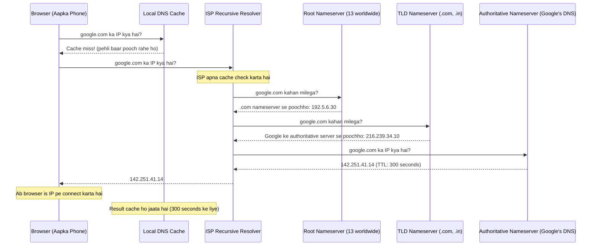
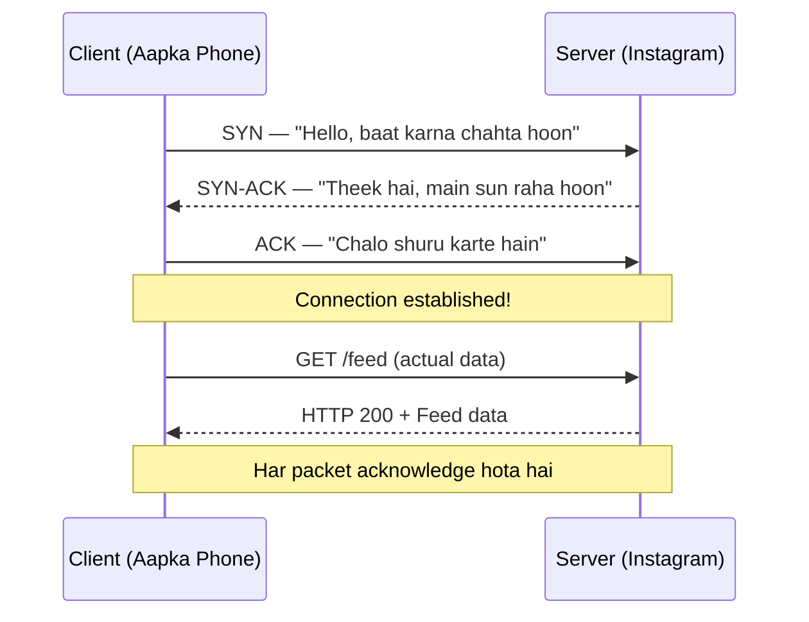
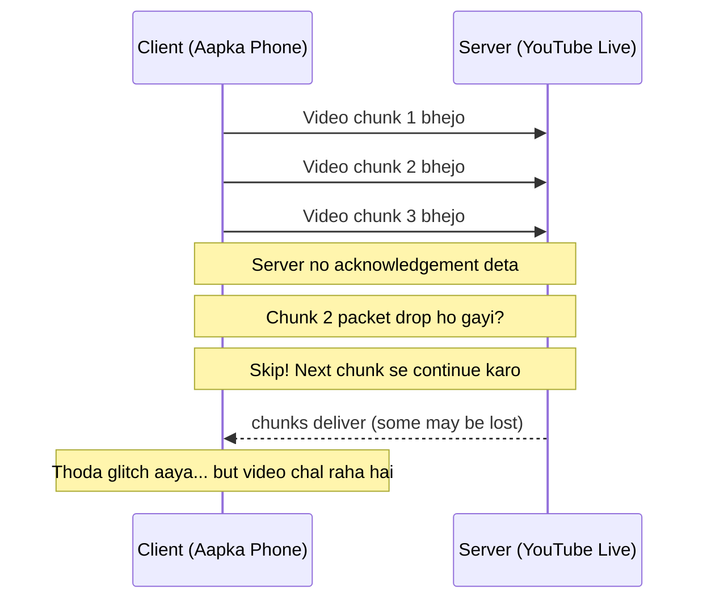
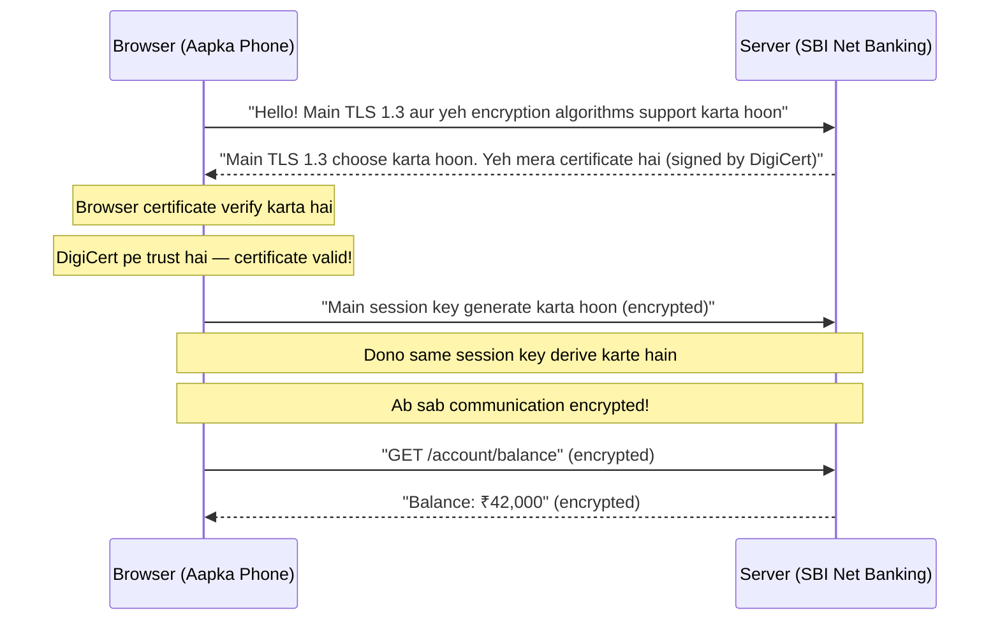
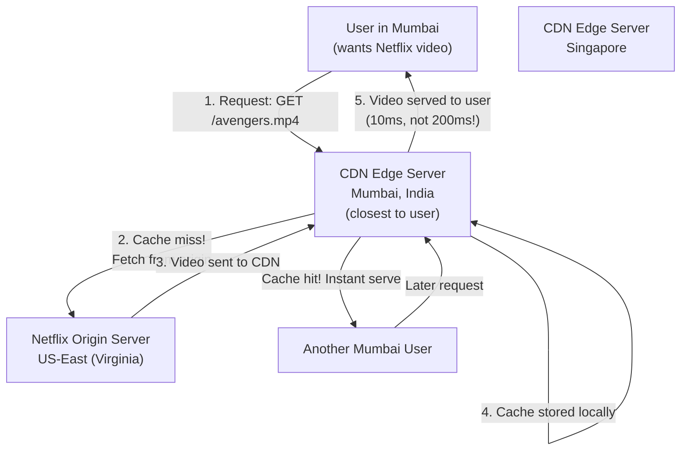
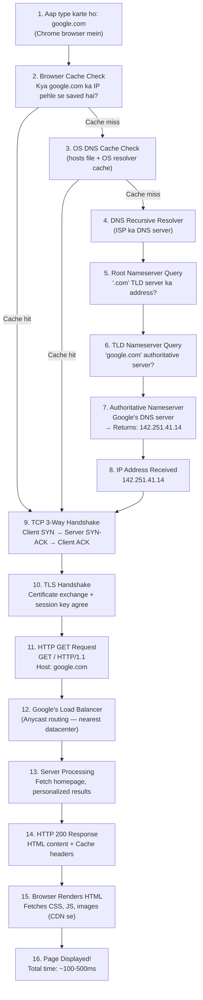

# Networking Fundamentals for System Design

> **Why should YOU care about networking?**
>
> Jab bhi aap koi system design karte ho — chahe Instagram ka feed ho, Zomato ka order tracking ho, ya Netflix ka video streaming — data ek jagah se doosri jagah travel karta hai. Yeh travel networking ke through hota hai. Agar networking samajh nahi aaya, toh system design mein hamesha ek andhera rehega. Yeh chapter uss andhera door karne ke liye hai.

---

## Table of Contents

1. [The OSI Model — Why 3 Layers Are Enough](#osi-model)
2. [IP Addresses — The Postal Addresses of the Internet](#ip-addresses)
3. [DNS — How google.com Becomes a Number](#dns)
4. [TCP vs UDP — The Diner Analogy](#tcp-vs-udp)
5. [HTTP Evolution — From 1.0 to 3](#http-evolution)
6. [HTTPS and TLS — The Secret Code Between Friends](#https-tls)
7. [REST vs GraphQL vs gRPC — Quick Comparison](#api-protocols)
8. [WebSockets — Real-Time Communication](#websockets)
9. [Latency Numbers You Must Memorize](#latency-numbers)
10. [CDN — Edge Servers and Why They Matter](#cdn)
11. [Polling, Long Polling, and SSE](#polling-sse)
12. [What Happens When You Type google.com](#google-flow)
13. [Common Interview Questions](#interview-questions)
14. [Key Takeaways](#key-takeaways)

---

## 1. The OSI Model — Why 3 Layers Are Enough {#osi-model}

### The Analogy First

Socho ek packet delivery company hai — Amazon Logistics. Jab aap order karte ho, toh:
- **Aap** order place karte ho (Application layer — L7)
- **Truck driver** route decide karta hai — Delhi se Mumbai via highway (Network layer — L3)
- **Local delivery boy** aapke ghar ka exact door dhundhta hai (Transport layer — L4)

Beeche mein bahut log kaam karte hain (packing department, sorting warehouse, customs, etc.) — lekin aapko unke baare mein kuch jaanna zaroori nahi. System design interviews mein bhi yahi hota hai.

### The Full Picture (Know It, Don't Memorize It)

| Layer | Number | Name | What It Does | Examples |
|-------|--------|------|-------------|---------|
| Application | L7 | Application | User-facing protocol | HTTP, HTTPS, DNS, SMTP, FTP |
| Presentation | L6 | Presentation | Encoding, encryption | SSL/TLS, JPEG, ASCII |
| Session | L5 | Session | Session management | NetBIOS, PPTP |
| Transport | L4 | Transport | End-to-end delivery | TCP, UDP |
| Network | L3 | Network | Routing across networks | IP, ICMP, routing |
| Data Link | L2 | Data Link | Node-to-node delivery | Ethernet, MAC, WiFi |
| Physical | L1 | Physical | Bits on wire | Cables, fiber, radio |

### The 3 Layers You Actually Need

**L3 — Network Layer (IP)**
- Ye decide karta hai ki packet kahan jaana chahiye
- Router yahan kaam karta hai
- IP addresses yahan ka topic hai
- System design mein: "Traffic kahan route hoga?" — L3 ka jawab

**L4 — Transport Layer (TCP/UDP)**
- Ye decide karta hai ki delivery reliable hai ya fast
- TCP aur UDP yahan ka topic hai
- System design mein: "Connection reliable chahiye ya speed?" — L4 ka jawab

**L7 — Application Layer (HTTP/HTTPS)**
- Ye decide karta hai ki data ka format kya hoga
- HTTP, gRPC, WebSocket yahan ka topic hai
- System design mein: "API kaise design karein?" — L7 ka jawab

```
┌─────────────────────────────────────────────────────┐
│                  L7 — Application                    │
│         (HTTP, WebSocket, gRPC, DNS)                │
│  "Netflix ka video request kaisa dikhega?"          │
├─────────────────────────────────────────────────────┤
│                  L4 — Transport                      │
│                 (TCP, UDP)                           │
│  "Video packet pohonchega ya nahi, aur kaise?"      │
├─────────────────────────────────────────────────────┤
│                  L3 — Network                        │
│                    (IP)                              │
│  "Packet Mumbai se Hyderabad kaise jayega?"         │
└─────────────────────────────────────────────────────┘
        (L1, L2 — Physical + Data Link)
        (Hardware ka kaam — aapko jaanna nahi)
```

> **Interview Tip:** Agar koi puche "OSI model explain karo" toh L1-L7 ek baar batao briefly, phir immediately L3/L4/L7 pe focus karo aur real-world examples do. Interviewer impressed ho jaata hai jab aap relevant parts highlight karte ho bina time waste kiye.

---

## 2. IP Addresses — The Postal Addresses of the Internet {#ip-addresses}

### The Analogy First

Ghar ka address hota hai na — "Building 5, Floor 3, Flat 12, MG Road, Bangalore"? IP address exactly yahi kaam karta hai internet pe. Jab aap WhatsApp pe message bhejte ho, toh message ko pata hona chahiye ki aapka phone kahaan hai aur doosre phone kahaan hai. Yahi kaam IP address karta hai.

### IPv4 — The Original

32-bit number, 4 parts, each 0-255:

```
192.168.1.100
 │    │  │  │
 │    │  │  └── Host number (kaun sa device)
 │    │  └───── Subnet
 │    └──────── Network
 └───────────── Network class
```

**Private IP Ranges (Internet pe nahi dikhte):**
```
10.0.0.0    - 10.255.255.255     (Company internal networks)
172.16.0.0  - 172.31.255.255     (AWS VPC, Docker networks)
192.168.0.0 - 192.168.255.255    (Aapka ghar ka WiFi router)
127.0.0.1                        (Localhost — aap khud se baat kar rahe ho)
```

> **Real Example:** Jab aap Swiggy ke delivery partner ka location track karte ho, toh Swiggy ka backend server ek public IP pe hota hai. Aapka phone ek public IP pe hota hai. But delivery partner ka phone bhi ek public IP pe hota hai (ya NAT ke through). Yeh sab IP addresses ke through communicate karte hain.

### IPv4 Exhaustion — Why We're Running Out

IPv4 mein maximum 4.3 billion addresses hain. Lekin aaj duniya mein 7+ billion phones hain, plus laptops, servers, IoT devices. Problem clearly hai — addresses khatam ho rahe hain.

**Solutions:**
1. **NAT (Network Address Translation)** — Ek public IP se hazaron private devices
2. **IPv6** — 128-bit addresses, practically unlimited

### IPv6 — The Future

```
2001:0db8:85a3:0000:0000:8a2e:0370:7334
          (can be shortened to)
2001:db8:85a3::8a2e:370:7334
```

340 undecillion addresses — itne addresses hain ki duniya ke har ek sand grain ko ek IP de sakte hain. IPv6 ka adoption slow hai lekin ho raha hai.

> **Interview Tip:** "IPv4 vs IPv6" pucha jaaye toh exhaustion problem, NAT ka workaround, aur IPv6 ki practically unlimited capacity — yeh teen points enough hain.

---

## 3. DNS — How google.com Becomes a Number {#dns}

### The Analogy First

Socho aapka ek contacts app hai. Aap "Rahul" ko call karte ho — phone automatically `+91-98765-43210` dial karta hai. Aapko number yaad rakhna nahi padta.

DNS exactly yahi kaam karta hai internet ke liye. Aap `google.com` type karte ho — DNS usse `142.251.41.14` mein convert kar deta hai. Aapko IP address yaad rakhna nahi padta.

### DNS Resolution — Step by Step



### DNS Record Types — Kaunsa Record Kab Kaam Aata Hai

| Record Type | Kya Karta Hai | Real Example |
|-------------|---------------|-------------|
| **A** | Domain → IPv4 address | `instagram.com → 157.240.1.174` |
| **AAAA** | Domain → IPv6 address | `google.com → 2607:f8b0:4004:c07::65` |
| **CNAME** | Alias (ek domain → doosra domain) | `www.zomato.com → zomato.com` |
| **MX** | Mail server | `swiggy.com → mail.swiggy.com` |
| **TXT** | Text data (verification) | SPF records, Google site verification |
| **NS** | Nameserver for domain | `google.com → ns1.google.com` |
| **PTR** | IP → Domain (reverse lookup) | `142.251.41.14 → google.com` |

### DNS Caching — Why Updates Take Time

Har DNS record ka ek **TTL (Time To Live)** hota hai — seconds mein. Agar Instagram apna IP change kare, toh naye IP tak pahonchne mein utna hi time lag sakta hai jitna TTL hai.

```
google.com  A  142.251.41.14  TTL: 300 (5 minutes)

Iska matlab: ISP ka resolver 5 minutes tak yahi IP return karega
Phir woh dubara naya lookup karega
```

> **Real Example:** Kabhi socha hai ki jab koi bada company (jaise Flipkart) apna hosting provider change karta hai toh 24-48 hours kyun lagte hain? Because DNS propagation — world ke sab ISP resolvers purani cached value hold karte hain jab tak TTL expire nahi hota.

> **Interview Tip:** "DNS load balancing" ek common topic hai. Ek domain ke multiple A records ho sakte hain — DNS round-robin karke different IPs return karta hai. Simple traffic distribution!

---

## 4. TCP vs UDP — The Diner Analogy {#tcp-vs-udp}

### The Analogy First

**TCP = Ek achha restaurant waiter**
Aap order dete ho. Waiter note karta hai. Confirm karta hai — "Sir, paneer butter masala aur 2 roti, sahi hai?" Aap confirm karte ho. Khana aata hai. Waiter check karta hai — "Sab sahi mila na?" Kuch miss hua toh wapas kitchen mein jaata hai. Reliable, but thoda slow.

**UDP = Aap dhaba pe jaa ke khud shout karte ho**
Aap counter pe jaate ho aur chillate ho — "Bhai ek chai, samosa!" Tumhe pata nahi ki suna ya nahi. Phir bhi aage badh jaate ho. Fast, lekin guarantee nahi.

### TCP — Connection-Oriented, Reliable

**3-Way Handshake (Connection Setup):**



**TCP ki Guarantees:**
- **Reliability:** Har packet deliver hoga, chahe time lage
- **Order:** Packets same order mein aayenge jis mein bheje gaye
- **Error checking:** Corrupt packets retransmit hote hain
- **Flow control:** Server overwhelm nahi hoga

**When to Use TCP:**
- Instagram feed load karna (data integrity critical)
- Zomato pe order place karna (incomplete order = disaster)
- File transfer (FTP, S3 upload)
- Database connections
- Email (SMTP, IMAP)
- Anything where every byte matters

### UDP — Connectionless, Fast



**When to Use UDP:**
- YouTube Live / Hotstar streaming (thoda glitch chalega, ruk gaya nahi chalega)
- BGMI / Call of Duty gaming (1ms delay = death in game)
- WhatsApp / Google Meet video calls (real-time preferred over perfect quality)
- DNS queries (small, fast, single packet)
- IoT sensor data (speed matters, some loss acceptable)

### TCP vs UDP — The Full Comparison

| Property | TCP | UDP |
|----------|-----|-----|
| Connection | Required (3-way handshake) | Not required |
| Reliability | Guaranteed delivery | Best effort (may drop) |
| Order | In-order delivery | May arrive out of order |
| Speed | Slower (overhead) | Faster (no overhead) |
| Header size | 20 bytes | 8 bytes |
| Flow control | Yes | No |
| Use case | Data integrity critical | Low latency critical |
| Example | Instagram post, banking | Gaming, video calls |

### The Head-of-Line Blocking Problem in TCP

Yeh important hai — ek TCP connection pe agar ek packet drop ho jaaye, toh saare baad wale packets wait karte hain jab tak woh packet retransmit na ho jaaye. Isse kehte hain **Head-of-Line (HOL) Blocking**.

```
Packet 1 ──── LOST ────────────────────────────
Packet 2 ──── Waiting... (packet 1 ka wait) ───
Packet 3 ──── Waiting... (packet 1 ka wait) ───
Packet 4 ──── Waiting... (packet 1 ka wait) ───

Packet 1 retransmit ──────────────────────────→ Server
Packet 2, 3, 4 ───────────────────────────────→ Server (finally!)
```

Yeh problem HTTP/2 mein bhi thi (even with multiplexing), aur HTTP/3 ne ise solve kiya — aage padho.

> **Interview Tip:** "When would you choose UDP over TCP?" — Gaming, video calls, DNS. Explain HOL blocking as a deeper reason why UDP is sometimes preferred even in critical paths.

---

## 5. HTTP Evolution — From 1.0 to 3 {#http-evolution}

### The Analogy First

Socho ek post office hai jo evolve ho raha hai generations ke saath:

- **HTTP/1.0:** Har letter ke liye naya envelope, naya stamp, naya trip to post office. Bahut time waste.
- **HTTP/1.1:** Ek envelope mein multiple letters bhej sakte ho. But ek letter jam ho gayi — baki sab wait.
- **HTTP/2:** Express courier service — multiple packages ek saath, different boxes mein, parallel delivery.
- **HTTP/3:** Helicopter delivery — road pe traffic jam nahi hota kyunki road hi use nahi karti.

### HTTP/1.0 — One Request, One Connection (1996)

**Problem:** Har request ke liye nayi TCP connection banani padti thi.

```
Client                    Server
  │                         │
  ├─── TCP Handshake (3RTT)→│
  ├─── GET /index.html ─────→│
  │←── HTML response ────────┤
  ├─── TCP Close ───────────→│
  │                         │
  ├─── TCP Handshake (3RTT)→│   ← Dobara!
  ├─── GET /style.css ──────→│
  │←── CSS response ─────────┤
  ├─── TCP Close ───────────→│
  │                         │
  (Aur 20 images ke liye 20 baar yahi drama)
```

**Instagram 1990 mein hoti toh:** 30 second mein ek photo load hoti.

### HTTP/1.1 — Keep-Alive and Pipelining (1997–present)

**What Changed:**
1. **Keep-Alive:** TCP connection ek baar banao, reuse karo
2. **Pipelining:** Multiple requests ek saath bhejo (maar nahi wait)
3. **Chunked transfer:** Response pieces mein bhej sakte hain
4. **Host header:** Ek server pe multiple domains

```
Client                    Server
  │                         │
  ├─── TCP Handshake ───────→│  ← Sirf ek baar!
  ├─── GET /index.html ─────→│
  ├─── GET /style.css ──────→│  ← Bina wait kiye!
  ├─── GET /logo.png ───────→│  ← Pipelining!
  │←── HTML ─────────────────┤
  │←── CSS ──────────────────┤  ← But in order!
  │←── PNG ──────────────────┤
  │   (connection alive)     │
```

**Problem — Head-of-Line Blocking:**
Pipelining mein responses same order mein aani chahiye. Agar CSS slow hai toh HTML bhi wait karta hai even though HTML ready hai.

```
Request order: HTML, CSS, PNG
Response order: HTML (fast), CSS (SLOW!), PNG (fast)

HTML: Delivered ✓
CSS:  Loading... ⏳ (200ms network slow)
PNG:  Ready but WAITING! ❌ (HOL blocking)
```

**Browsers ka jugaad:** 6 parallel TCP connections open karo per domain. Hacky but worked.

### HTTP/2 — Multiplexing (2015)

**The Game Changer:** Binary protocol, multiplexing streams over single connection.

**What Changed:**
1. **Multiplexing:** Multiple streams in single TCP connection, interleaved
2. **Header Compression (HPACK):** Repetitive headers compress hote hain
3. **Server Push:** Server proactively data bhej sakta hai bina request ke
4. **Binary Framing:** Text ki jagah binary — faster parsing

```
HTTP/1.1:                    HTTP/2:
─────────                    ───────
Connection 1: HTML           Single Connection:
Connection 2: CSS            ┌─ Stream 1: HTML frame
Connection 3: PNG            ├─ Stream 2: CSS frame
Connection 4: JS             ├─ Stream 3: PNG frame
Connection 5: Font           ├─ Stream 4: JS frame
Connection 6: API call       └─ Stream 5: Font frame
                             (All interleaved, all parallel!)
```

**Header Compression Example:**

```
HTTP/1.1 Request 1:          HTTP/1.1 Request 2:
Host: netflix.com            Host: netflix.com      ← Same! Repeat karna padta
User-Agent: Chrome/120       User-Agent: Chrome/120 ← Same! Repeat
Accept: text/html            Accept: application/json
Accept-Encoding: gzip        Accept-Encoding: gzip  ← Same!
Cookie: session=abc123       Cookie: session=abc123 ← Same! (100s of bytes)

HTTP/2 Request 2:
:path: /api/movies           ← Only difference bheja!
(Baaki sab headers compressed, reference se)
```

**Server Push:**

```
Client requests: GET /index.html
Server knows you'll need CSS and JS too.
Server sends:
  - /index.html (response)
  - /style.css  (pushed, bina request ke!)
  - /app.js     (pushed, bina request ke!)

Result: Page loads faster because CSS/JS ready hain
        jab browser unhe parse karne ki zaroorat padti hai.
```

**Still has a problem:** TCP-level HOL blocking. Ek packet drop = sab streams wait.

### HTTP/3 — QUIC Protocol (2022)

**The Revolution:** TCP chod do. UDP pe apna protocol banao.

**Why UDP?** Because TCP ka HOL blocking solve nahi ho sakta bina protocol change kiye. QUIC (Quick UDP Internet Connections) UDP ke upar bana hai, but TCP ki reliability features khud implement karta hai — smarter way se.

**What Changed:**
1. **QUIC over UDP:** No TCP overhead, no TCP HOL blocking
2. **0-RTT Connection:** Agar pehle connect kiya tha, toh instantly reconnect
3. **Connection Migration:** IP change ho (WiFi → 4G) toh connection toot nahi ta
4. **Independent Streams:** Ek stream ka packet drop = sirf woh stream wait karta hai, baki nahi

```
HTTP/2 (TCP):                HTTP/3 (QUIC/UDP):
─────────────                ──────────────────
Single TCP connection        QUIC Connection
  Stream 1: HTML ✓             Stream 1: HTML ✓
  Stream 2: CSS ✓              Stream 2: CSS ✓
  Stream 3: PNG ✗ (lost!)      Stream 3: PNG ✗ (lost!)
  Stream 4: JS ⏳ WAITING      Stream 4: JS ✓ (keeps going!)
  Stream 5: Font ⏳ WAITING    Stream 5: Font ✓ (keeps going!)

TCP HOL blocking!            QUIC solves it!
```

**Connection Migration (Game Changer for Mobile):**

```
HTTP/2:
Train mein ho, WiFi → 4G switch hua
Old TCP connection dead!
Naya connection banao = 1-2 second delay

HTTP/3/QUIC:
Train mein ho, WiFi → 4G switch hua
QUIC connection migrates automatically!
User ko kuch pata bhi nahi chala
```

> **Real Example:** YouTube, Google Search, Gmail — sab HTTP/3 use karte hain. Aapko faster video start times aur smoother scrolling isliye milta hai.

### HTTP Versions — Side by Side

| Feature | HTTP/1.0 | HTTP/1.1 | HTTP/2 | HTTP/3 |
|---------|----------|----------|--------|--------|
| Year | 1996 | 1997 | 2015 | 2022 |
| Transport | TCP | TCP | TCP | UDP (QUIC) |
| Connections | 1 per request | Keep-alive | Single | Single |
| Multiplexing | No | No (pipelining only) | Yes | Yes |
| Header compression | No | No | Yes (HPACK) | Yes (QPACK) |
| Server push | No | No | Yes | Yes |
| HOL blocking | Yes | Yes | TCP-level | No |
| TLS required | No | No | Mostly yes | Yes |
| Mobile performance | Poor | Okay | Good | Excellent |

> **Interview Tip:** Yeh table yaad rakhna zaroor. "HTTP/2 vs HTTP/3" bahut common question hai. Key answer: HTTP/3 QUIC use karta hai (UDP-based), TCP HOL blocking solve karta hai, aur mobile pe better hai because of connection migration.

---

## 6. HTTPS and TLS — The Secret Code Between Friends {#https-tls}

### The Analogy First

Imagine karo aap aur aapka best friend ek secret language invent karte ho. Aap dono pehle ek dusre ko apna "secret key" share karte ho (kisi se chipake hue). Phir sab messages usi key se encode karte ho. Beech mein koi bhi message padh le, toh samajh nahi aayega.

HTTPS exactly yahi karta hai. Browser aur server pehle ek "secret key" agree karte hain (TLS handshake), phir saari communication encrypted hoti hai.

### Why HTTPS? The Three Promises

```
Without HTTPS (Plain HTTP):
─────────────────────────
Client ──── "Password: abc123" ──── WiFi Router ──── Your ISP ──── Server
                                        ↑
                               Hacker yahan se dekh sakta hai!
                               "Password: abc123" — plaintext!

With HTTPS (TLS Encrypted):
─────────────────────────
Client ──── "xK9#mP2$..." ──── WiFi Router ──── Your ISP ──── Server
                                    ↑
                           Hacker dekh sakta hai but
                           sirf gibberish dikhta hai!
```

**Three Things TLS Provides:**
1. **Confidentiality:** Data encrypt hai — koi padh nahi sakta
2. **Authentication:** Certificate verify karta hai ki aap sach mein `sbi.co.in` pe ho, kisi fake site pe nahi
3. **Integrity:** Data transit mein modify nahi hua (tamper detection)

### TLS Handshake — Simplified



### Certificate Chain — Why You Trust a Website

Kaise pata chalta hai ki `sbi.co.in` fake nahi hai?

```
Root CA Certificate (DigiCert/Comodo/Let's Encrypt)
   ↓ signs
Intermediate Certificate
   ↓ signs
sbi.co.in Certificate

Browser ke paas Root CA certificates pre-installed hain.
Agar chain valid hai → Website trusted ✓
Agar chain invalid/expired → Browser warning deta hai ⚠️
```

> **Real Example:** Jab aap Paytm pe UPI payment karte ho, HTTPS ensure karta hai ki aapka transaction detail koi middle-man nahi padh sakta — chahe aap public WiFi pe ho.

> **Interview Tip:** "What is TLS 1.3 improvement over TLS 1.2?" — TLS 1.3 ne handshake 1-RTT kar diya (1.2 mein 2-RTT tha), aur 0-RTT resumption support kiya. Simpler aur faster.

---

## 7. REST vs GraphQL vs gRPC — Quick Comparison {#api-protocols}

> **Note:** Yeh chapter mein sirf overview hai. Detailed notes Chapter 31 mein hain.

### The Analogy First

Socho teen types ke restaurants hain:
- **REST** = Fixed menu restaurant. Aap waiter ko bolo "Item 5 chahiye" — woh exactly wahi laata hai, no customization.
- **GraphQL** = Buffet. Aap exact choose karo kya chahiye — sirf wahi plate mein aata hai.
- **gRPC** = Industrial kitchen — fast, efficient, machines ke liye optimized.

### Quick Comparison Table

| Property | REST | GraphQL | gRPC |
|----------|------|---------|------|
| Protocol | HTTP/1.1 or HTTP/2 | HTTP/1.1 or HTTP/2 | HTTP/2 |
| Data format | JSON (usually) | JSON | Protocol Buffers (binary) |
| API schema | OpenAPI (optional) | Schema (required) | .proto file (required) |
| Over/under-fetching | Common problem | Solved | Not an issue (binary) |
| Real-time | Polling/WebSocket | Subscriptions | Streaming built-in |
| Browser support | Excellent | Excellent | Needs grpc-web |
| Complexity | Low | Medium | High |
| Best for | Public APIs | Complex frontends | Internal microservices |
| Example | Twitter API | GitHub API | Google internal |

> **Real Example:**
> - **Instagram** Public API → REST (simple, universal)
> - **Facebook** app → GraphQL (fetch exactly what mobile needs, no over-fetching)
> - **Google** microservices talking to each other → gRPC (ultra-fast, binary)

---

## 8. WebSockets — Real-Time Communication {#websockets}

> **Note:** WebSockets are covered in detail in Chapter 29. Yahan brief overview hai.

### The Analogy First

HTTP is like sending a letter — aap letter bhejte ho, jawab aata hai, dono sides ka kaam khatam. WebSocket is like a phone call — ek baar connect karo, phir dono sides jab chahein baat kar sakte hain.

### Why WebSockets?

**HTTP Problem (Polling):**
```
Client: "Koi naya message hai?" → Server: "Nahi"  [Waste!]
Client: "Koi naya message hai?" → Server: "Nahi"  [Waste!]
Client: "Koi naya message hai?" → Server: "Haan! Yeh raha"
```

**WebSocket Solution:**
```
Client: "Connection establish karo"
Server: "Done! Jab bhi kuch naya aayega, main khud bata dunga"
Server: [2 minutes later] "Naya message aaya: 'Bhai kya scene hai?'"
```

**Where WebSockets Are Used:**
- WhatsApp / Telegram — real-time messaging
- Zerodha / Groww — live stock price updates
- Google Docs — collaborative editing (multiple users same doc)
- Online multiplayer games — game state sync
- Live sports scores

---

## 9. Latency Numbers You Must Memorize {#latency-numbers}

### The Analogy First

Socho different types ke kaam karte ho — kuch ekdum fast hain (aankhein jhapakna), kuch slow hain (haath hilana), kuch bahut slow hain (shehar se shehar travel karna). Computer operations bhi aisi hi different speeds pe hoti hain.

Yeh numbers ek system design engineer ke liye MUST KNOW hain:

### Latency Reference Table

| Operation | Time | Analogy |
|-----------|------|---------|
| L1 Cache access | ~0.5 ns | Aankhon ki speed |
| L2 Cache access | ~7 ns | Haath hilane ki speed |
| L3 Cache access | ~40 ns | Ek kadam uthane ka time |
| RAM access | ~100 ns | Ek sentence bolne ka time |
| SSD random read | ~100 μs | Cup mein chai daalna |
| HDD seek + read | ~10 ms | Song ka ek beat |
| Datacenter network round trip | ~0.5 ms | Blink of an eye |
| Same region network round trip | ~1–5 ms | Thoda slow blink |
| Cross-country network (US coast-to-coast) | ~40–80 ms | Ek doosre ko dekh ke muskurana |
| India–US round trip | ~150–200 ms | "Haan bhai" bolne ka time |

### Putting It In Perspective

```
CPU speed: 1 instruction per ns
           = In the time RAM responds (100 ns),
             CPU could have done 100 instructions!

That's why caching is critical.
```

```
Numbers to remember:
────────────────────
L1 Cache:    1 ns       (CPU ke bilkul paas)
RAM:         100 ns     (100x slower than L1)
SSD:         100,000 ns (100,000x slower than L1)
HDD:        10,000,000 ns (10 million x slower!)
Network:   150,000,000 ns (India to US)

Ratio: L1 : RAM : SSD : HDD : Network
             1 :  100 : 100K : 10M : 150M
```

### Why These Numbers Matter in System Design

**Example: Instagram Feed**

```
Option A: Fetch from database (HDD)
  - HDD seek: 10 ms
  - For 1M concurrent users: 10M ms = 10,000 seconds worth of delay per second!
  - Impossible!

Option B: Cache in RAM
  - RAM access: 100 ns
  - 100,000x faster than HDD
  - For 1M users: totally manageable

Conclusion: Instagram's feed is heavily cached in memory (Redis)
```

**Example: Netflix Video Streaming**

```
Video file size: 4 GB per movie
SSD transfer: 4 GB / 500 MB/s = ~8 seconds just to read from disk!

Solution: CDN edge servers ke paas cached copy hoti hai
User ke closest server se serve karo
Network transfer time + serving = much faster than origin + disk read
```

> **Interview Tip:** Jab bhi system design karo, latency numbers se justify karo decisions. "Maine Redis isliye choose kiya kyunki RAM access 100 ns ka hai vs database ka 10 ms — yeh 100,000x faster hai critical path ke liye."

---

## 10. CDN — Edge Servers and Why They Matter {#cdn}

### The Analogy First

Socho Amul dairy Anand, Gujarat mein hai. Agar aapko Mumbai mein fresh milk chahiye, toh Gujarat se truck aayega — 8 hours lagenge, milk khatta ho sakta hai. Solution? Amul ke Mumbai mein local warehouses hain. Fresh milk faster mila, local supply se.

CDN exactly yahi kaam karta hai websites ke liye. Netflix ka data center US mein hai. Agar har video US se stream ho, toh India mein buffering bahut hogi. Solution? Netflix ke India mein CDN edge servers hain — content locally serve hota hai.

### How CDN Works



### CDN Cache — Content Types

```
Perfect for CDN caching:                Not good for CDN:
─────────────────────                   ─────────────────
✅ Images (product photos on Amazon)   ❌ Personalized feed
✅ Videos (Netflix, YouTube)           ❌ User account page
✅ Static JS/CSS files                 ❌ Real-time stock prices
✅ Fonts                               ❌ Dynamic API responses
✅ PDFs, downloads                     ❌ Payment processing
```

### CDN Providers and Who Uses Them

| CDN Provider | Major Customers |
|-------------|----------------|
| Cloudflare | Millions of sites worldwide |
| AWS CloudFront | Amazon, Netflix, Slack |
| Akamai | Major banks, healthcare |
| Fastly | GitHub, Twitter, Shopify |
| Azure CDN | Microsoft products |

> **Real Example:** Jab aap Hotstar pe IPL dekhte ho, video data Hotstar ke origin servers se nahi aata — nearest CDN edge server se aata hai. Isliye India mein live cricket ka stream 2-3 seconds delay mein milta hai na ki 10+ seconds.

### How CDN Reduces Latency

```
Without CDN:
Mumbai User → US Server (200ms round trip)
HD video = 5 Mbps stream
Buffering guaranteed.

With CDN:
Mumbai User → Mumbai CDN (5ms round trip)
HD video = 5 Mbps stream
Seamless playback!

Improvement: 200ms → 5ms = 40x faster!
```

### CDN — Cache Hit and Miss

```
Cache Hit Ratio = (Requests served from cache) / (Total requests) × 100%

If 95% cache hit rate:
- Only 5% requests go to origin
- Origin server load = 5% of total!
- Cost savings + speed improvement

How to improve hit ratio:
- Long TTL for static content
- Proper Cache-Control headers
- Good URL design (no random query params)
```

> **Interview Tip:** CDN ke do main benefits yaad rakhna: (1) Latency kam hoti hai — user ke paas serve karo. (2) Origin server ka load kam hota hai — cache hit = origin tak request nahi gayi.

---

## 11. Polling, Long Polling, and SSE {#polling-sse}

### The Analogy First

Socho aap online food order kiya hai Zomato pe. Aap status track karna chahte ho.

**Short Polling** = Aap har 5 seconds mein Zomato app refresh karte ho — "Order ready hua?" "Order ready hua?" — Thakavat bhari method.

**Long Polling** = Aap Zomato ko ek question bhejte ho. Zomato wait karta hai jab tak update na aaye, phir jawab bhejta hai. Aap phir naya question bhejte ho.

**Server-Sent Events** = Zomato ek live connection open rakhta hai aur khud hi updates push karta hai jab bhi status change ho.

**WebSocket** = Aap aur Zomato dono ek phone call pe hain — dono sides freely communicate kar sakte hain.

### Short Polling

```
Client                     Server
  │                          │
  ├── "Koi update?" ────────→│
  │←─ "Nahi" ───────────────┤
  │   [wait 5 seconds]       │
  ├── "Koi update?" ────────→│
  │←─ "Nahi" ───────────────┤
  │   [wait 5 seconds]       │
  ├── "Koi update?" ────────→│
  │←─ "Haan! Order delivered"┤

Pros: Simple to implement
Cons: Wasteful — mostly empty responses
     High server load at scale
     Not truly real-time (5 second delay)
```

### Long Polling

```
Client                     Server
  │                          │
  ├── "Koi update?" ────────→│
  │                          │ [Server holds connection open]
  │                          │ [Waiting for real update...]
  │←─ "Order accepted!" ─────┤ [Response sent when update happens]
  │                          │
  ├── "Koi update?" ────────→│ [Immediately new request]
  │                          │ [Waiting again...]
  │←─ "Out for delivery!" ───┤

Pros: More real-time than short polling
     Server only responds when there's data
Cons: Still HTTP — new connection each cycle
     Server holds connections open (resource usage)
     Complex timeout handling
```

### Server-Sent Events (SSE)

```
Client                     Server
  │                          │
  ├── "Subscribe to updates"→│
  │←─ "Connected! Streaming"─┤
  │                          │
  │←─ "Order accepted"  ─────┤ [Server pushes when ready]
  │                          │
  │←─ "Preparing food"  ─────┤
  │                          │
  │←─ "Out for delivery"─────┤
  │                          │
  │←─ "Delivered!" ──────────┤
  │   [Connection closed]    │

Pros: True push from server
     Simple (built into browsers)
     Auto-reconnect built-in
Cons: One-way only (server → client)
     HTTP/1.1 has connection limit issues
```

### Comparison Table

| Method | Direction | Real-time? | Connection | Use Case |
|--------|-----------|------------|------------|---------|
| Short polling | Client → Server | No (delay) | New per request | Simple status checks |
| Long polling | Client → Server (held) | Near real-time | Held open | Chat, notifications |
| SSE | Server → Client | Yes | Persistent | Live feeds, stock prices |
| WebSocket | Bidirectional | Yes | Persistent | Gaming, live chat, collaboration |

> **Real Examples:**
> - **Twitter/X** feed updates → SSE (server pushes new tweets)
> - **WhatsApp Web** → WebSocket (bidirectional messaging)
> - **Swiggy order tracking** → Long polling or SSE
> - **Zerodha stock prices** → WebSocket (bidirectional, fast)

---

## 12. What Happens When You Type google.com {#google-flow}

### The Full Journey — Step by Step

Yeh system design ka legendary question hai. Yeh jaanna ki ek URL type karne par exactly kya hota hai — networking ke saare concepts ek jagah cover ho jaate hain.



### Detailed Step-by-Step Breakdown

**Step 1-2: Browser Checks Its Own Cache**
```
Browser checks: "google.com → IP" in its DNS cache
If found and not expired (TTL not elapsed) → use it
If not found → ask OS
```

**Step 3: OS DNS Resolution**
```
OS checks:
1. /etc/hosts file (custom entries)
2. OS DNS cache
If not found → ask ISP's DNS resolver
```

**Step 4-7: Full DNS Resolution**
```
Recursive Resolver → Root NS → TLD NS → Authoritative NS
(Full DNS resolution as shown in DNS section above)
Time: ~20-120ms (first time)
      ~0ms (cached)
```

**Step 8: TCP Connection**
```
Browser initiates TCP to 142.251.41.14:443 (HTTPS)
3-way handshake: ~1 RTT = ~10-50ms (depending on location)
```

**Step 9: TLS Handshake**
```
TLS 1.3: 1-RTT handshake
Certificate validation
Session key exchange
Time: ~20-50ms additional
```

**Step 10: HTTP Request**
```
GET / HTTP/1.1
Host: www.google.com
User-Agent: Chrome/120.0
Accept: text/html,application/xhtml+xml
Accept-Language: en-US,en;q=0.9
Cookie: [session data]
```

**Step 11: Google's Infrastructure**
```
Anycast routing → nearest Google datacenter
Load balancer → available web server
Cache layer → if homepage is cached
Application server → generate personalized content
Time: ~10-50ms server processing
```

**Step 12: Response**
```
HTTP/2 200 OK
Content-Type: text/html; charset=UTF-8
Content-Encoding: gzip
Cache-Control: private, max-age=0
Set-Cookie: [new session]

[HTML body — 15-50 KB compressed]
```

**Step 13-14: Browser Rendering**
```
Browser parses HTML
Finds links: <link rel="stylesheet" href="/style.css">
             <script src="/app.js">
             

Fetches CSS, JS → CDN edge server (fast!)
Fetches images → CDN (fast!)
Renders page → Done!
```

**Total Timeline:**
```
DNS Resolution:    20-120ms  (0ms if cached)
TCP Handshake:     10-50ms
TLS Handshake:     20-50ms
HTTP Request:      5-20ms
Server Processing: 10-50ms
Response Transfer: 10-100ms
Browser Render:    50-200ms
──────────────────────────
Total:             ~125-590ms

(Experienced users feel ~100ms or less due to caching)
```

> **Interview Tip:** Yeh question kaafi broad hai. Interviewer typically 5-10 minutes ka answer chahta hai covering: DNS, TCP, TLS, HTTP, server-side processing, CDN. Points pe focus karo jo aapke domain mein relevant hain — agar networking discussion hai toh DNS aur TCP pe deep dive karo.

---

## Common Interview Questions {#interview-questions}

### OSI Model Questions

**Q1: "OSI model ke 7 layers kya hain aur system design mein kaun se relevant hain?"**

> Briefly L1-L7 name karo. Phir explain karo ki system design mein L3 (IP/routing), L4 (TCP/UDP choice), aur L7 (HTTP/gRPC protocol choice) sabse relevant hain. L1-L2 hardware level hain, L5-L6 mostly TLS/encoding ke saath handled hain.

**Q2: "L4 vs L7 load balancing mein kya difference hai?"**

> L4 load balancer TCP connection level pe kaam karta hai — IP aur port ke basis pe route karta hai, packet content nahi dekha. Fast but dumb. L7 load balancer HTTP content dekh sakta hai — URL path, headers, cookies ke basis pe route karta hai. Smart routing possible — `/api` → API servers, `/static` → CDN, `/admin` → admin servers.

### TCP/UDP Questions

**Q3: "Gaming mein TCP kyun use nahi karte?"**

> Gaming mein 16ms pe ek frame update chahiye (60 FPS). Agar ek TCP packet drop ho, retransmission mein ~50-200ms lag sakta hai. Itnay delay mein game state stale ho chuka hoga. UDP use karte hain — packet drop ho gaya? Skip karo, next state send karo. Slight glitch acceptable hai, delay nahi.

**Q4: "WhatsApp messages reliable kyun hain agar UDP use karta hai?"**

> WhatsApp actual messages TCP pe bhejta hai (or reliable QUIC), sirf voice/video calls UDP pe. Text messages mein data integrity critical hai — isliye TCP. Voice call mein ek dropped packet acceptable hai — isliye UDP.

### HTTP Questions

**Q5: "HTTP/2 aur HTTP/3 mein fundamental difference kya hai?"**

> HTTP/2 TCP pe chal ta hai, HTTP/3 QUIC (UDP-based) pe chalta hai. HTTP/2 TCP-level HOL blocking se suffer karta hai — ek packet drop = sab streams wait. HTTP/3 mein independent streams hain — ek stream ka packet drop sirf us stream ko affect karta hai, dusre chalayt rehte hain. HTTP/3 mobile pe bhi better hai because of connection migration.

**Q6: "HTTP/1.1 head-of-line blocking kya hota hai?"**

> Pipelining mein multiple requests bhejte ho. But responses same order mein aani chahiye. Agar doosri response pehli se slow hai, toh teesri fourth response — chahe ready ho — wait karti hain. Yeh HOL blocking hai. Browsers ne 6 parallel connections ka workaround use kiya tha.

### DNS Questions

**Q7: "DNS TTL kam karne ke trade-offs kya hain?"**

> Kam TTL = DNS change jaldi propagate hota hai (good for deployments, disaster recovery). But more DNS queries = ISP resolvers pe load, slightly higher latency. Zyada TTL = queries kam, faster resolution, but changes slowly propagate. Production mein typical: 300-3600 seconds.

**Q8: "DNS load balancing aur application load balancing mein kya difference hai?"**

> DNS load balancing: ek domain ke multiple A records, DNS round-robin. Simple but dumb — dead servers bhi traffic milti hai jab tak DNS update na ho. Application LB: health checks karta hai, dead servers se traffic hat jaata hai automatically. Weighted routing, session affinity — sab possible.

### HTTPS/TLS Questions

**Q9: "TLS 1.3 kyun better hai TLS 1.2 se?"**

> TLS 1.2: 2 round-trips handshake mein lagte the. TLS 1.3: 1 round-trip (1-RTT), aur agar pehle connect kiya tha toh 0-RTT resumption. Purane, weak cipher suites remove kar diye. Perfect Forward Secrecy by default. Result: faster, more secure.

### Architecture Questions

**Q10: "Ek 10 million user wale app ke liye CDN kyun use karein?"**

> (1) Latency: Users ke geographical location ke paas serve karo — India users ke liye India CDN (5ms) vs US origin (200ms). (2) Origin load: 90%+ cache hits mein origin pe request nahi jaati. (3) DDoS protection: CDN large traffic absorb kar sakta hai. (4) Bandwidth cost: CDN edge se serve karna cheaper ho sakta hai than origin egress.

**Q11: "Real-time notifications ke liye WebSocket vs SSE vs Long Polling — kaunsa choose karoge aur kyun?"**

> **WebSocket** — agar bidirectional communication chahiye (chat, gaming). **SSE** — agar sirf server → client push chahiye (live feed, notifications, stock prices). Browser support better, simpler implementation. **Long Polling** — legacy systems ya environments jahan WebSocket/SSE supported nahi (corporate firewalls block karte hain WebSockets sometimes). Prefer SSE over Long Polling for server-push scenarios.

**Q12: "What happens when you type google.com — briefly explain."**

> DNS resolution (browser cache → OS cache → ISP resolver → Root → TLD → Authoritative → IP returned). TCP 3-way handshake. TLS handshake. HTTP GET request. Server processes (load balancer → web server → cache/app). HTTP response. Browser renders HTML, fetches sub-resources (CSS/JS from CDN). Page displayed.

---

## Key Takeaways {#key-takeaways}

```
╔════════════════════════════════════════════════════════════════╗
║                    NETWORKING CHEAT SHEET                      ║
╠════════════════════════════════════════════════════════════════╣
║                                                                ║
║  OSI Model:                                                    ║
║  • Know L3 (IP/routing), L4 (TCP/UDP), L7 (HTTP/gRPC)        ║
║  • L1-L2 = hardware; L5-L6 = mostly invisible to you         ║
║                                                                ║
║  IP Addressing:                                                ║
║  • IPv4 = 32-bit, running out                                 ║
║  • Private IPs: 10.x, 172.16-31.x, 192.168.x                ║
║  • IPv6 = 128-bit, unlimited, future                          ║
║                                                                ║
║  DNS:                                                          ║
║  • Domain → IP via: Browser cache → OS → ISP Resolver        ║
║              → Root → TLD → Authoritative                     ║
║  • TTL controls cache duration                                 ║
║                                                                ║
║  TCP vs UDP:                                                   ║
║  • TCP = reliable, ordered, slower (HTTP, file transfer)      ║
║  • UDP = fast, unreliable, connectionless (gaming, video)     ║
║  • TCP HOL Blocking = dropped packet blocks all packets       ║
║                                                                ║
║  HTTP Versions:                                                ║
║  • HTTP/1.1: Keep-alive, pipelining, HOL blocking problem     ║
║  • HTTP/2: Multiplexing, header compression, server push      ║
║  • HTTP/3: QUIC (UDP-based), solves TCP HOL blocking          ║
║                                                                ║
║  HTTPS/TLS:                                                    ║
║  • Confidentiality + Authentication + Integrity               ║
║  • TLS 1.3: 1-RTT handshake (faster than TLS 1.2's 2-RTT)   ║
║                                                                ║
║  Latency Numbers:                                              ║
║  • L1 cache: ~1 ns | RAM: ~100 ns | SSD: ~100 μs            ║
║  • HDD: ~10 ms | Network round-trip: 1–200 ms                ║
║                                                                ║
║  CDN:                                                          ║
║  • Serve from edge nodes close to users                       ║
║  • Reduces latency + origin server load                       ║
║  • Cache static content (images, video, CSS, JS)              ║
║                                                                ║
║  Real-Time Communication:                                      ║
║  • Short Polling: Simple but wasteful                         ║
║  • Long Polling: Better, but still creates-new-connection     ║
║  • SSE: Server → Client push, simple, unidirectional         ║
║  • WebSocket: Bidirectional, full-duplex, best for chat/games ║
║                                                                ║
║  google.com Flow:                                              ║
║  DNS → TCP Handshake → TLS → HTTP Request → Server           ║
║  → Load Balancer → App Server → Response → CDN for assets     ║
╚════════════════════════════════════════════════════════════════╝
```

---

## Next Steps

- [Client-Server Architecture](../06-client-server/README.md) — how these networking concepts fit into system architecture
- Chapter 29 — WebSockets in detail
- Chapter 31 — REST vs GraphQL vs gRPC in depth

---

*Networking basics solid ho gayi? Ab system design ke bade patterns ke liye taiyaar ho. Har distributed system networking ke upar hi bana hota hai — yeh foundation hai sab kuch ka.*
