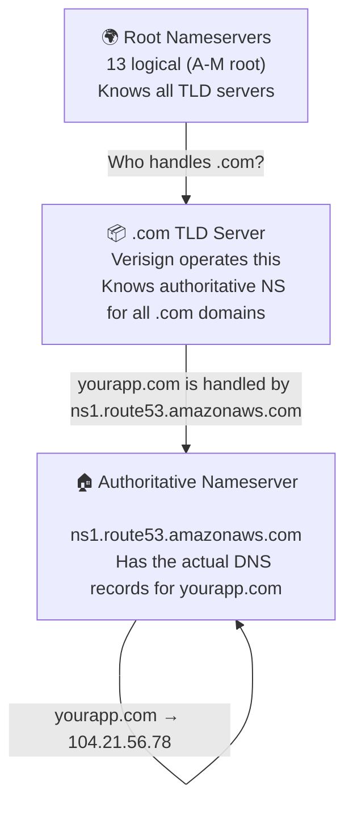
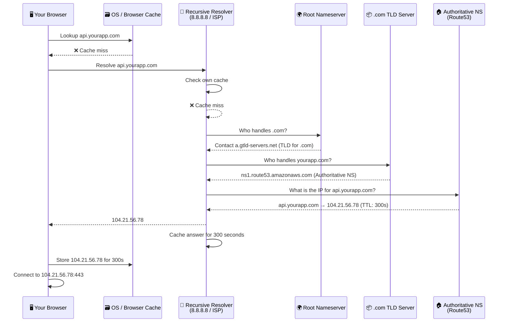
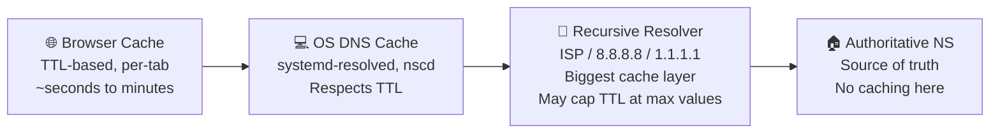
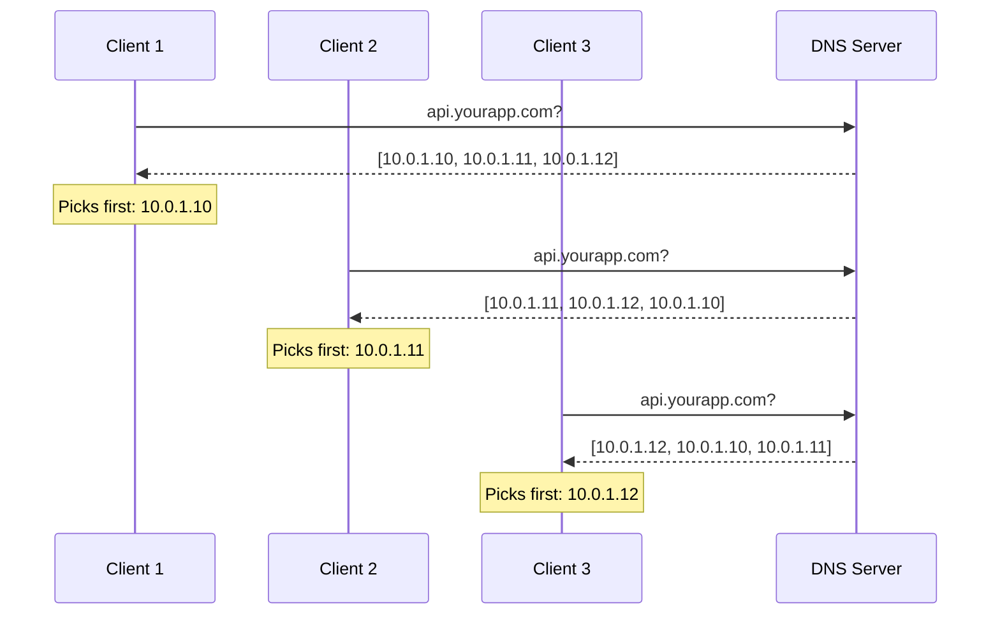
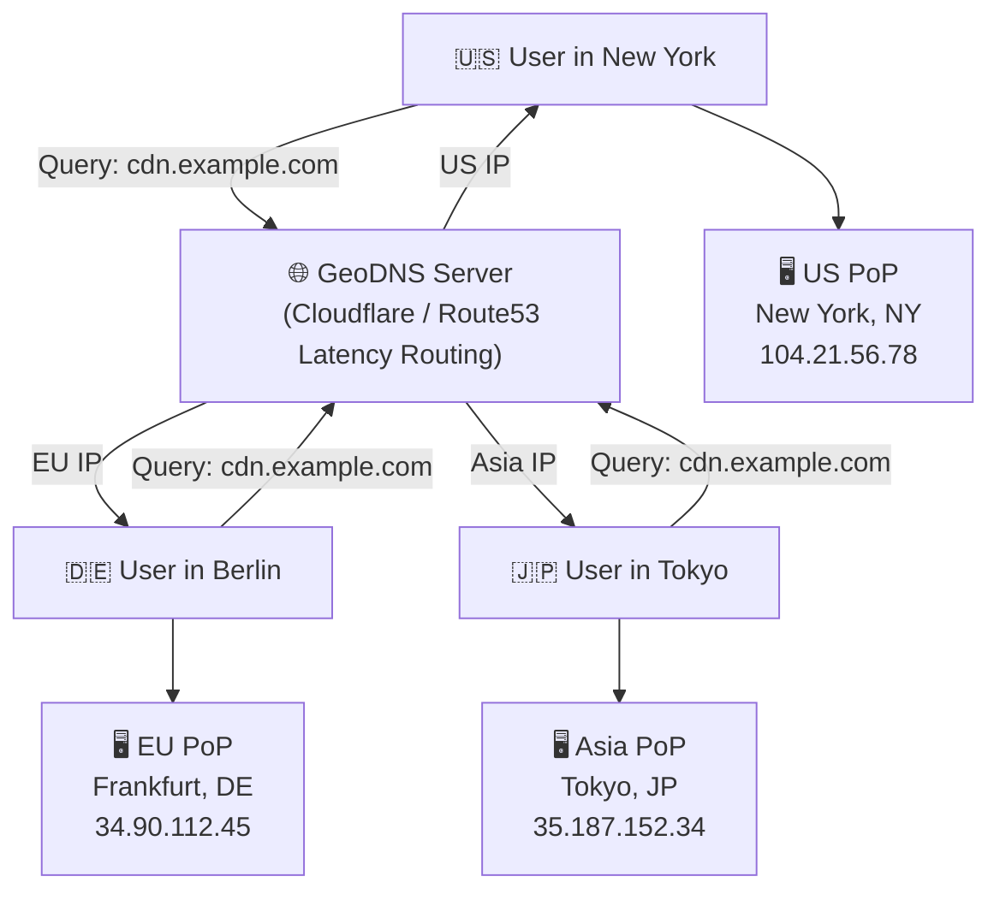
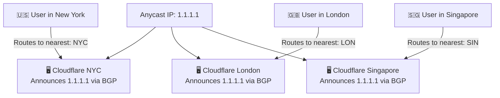
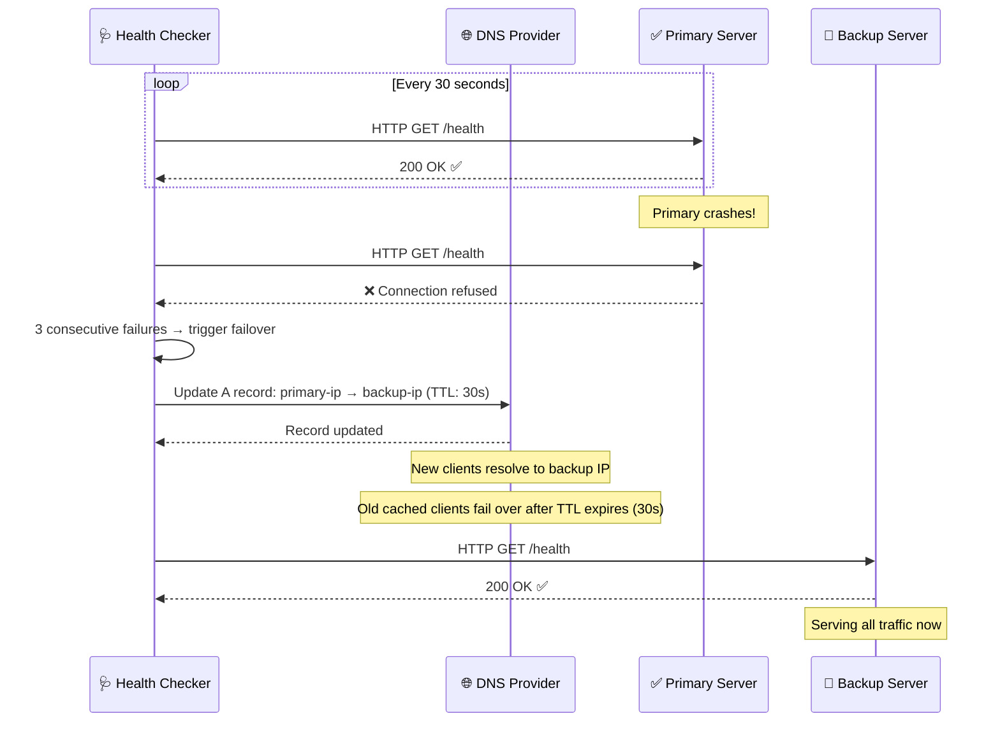
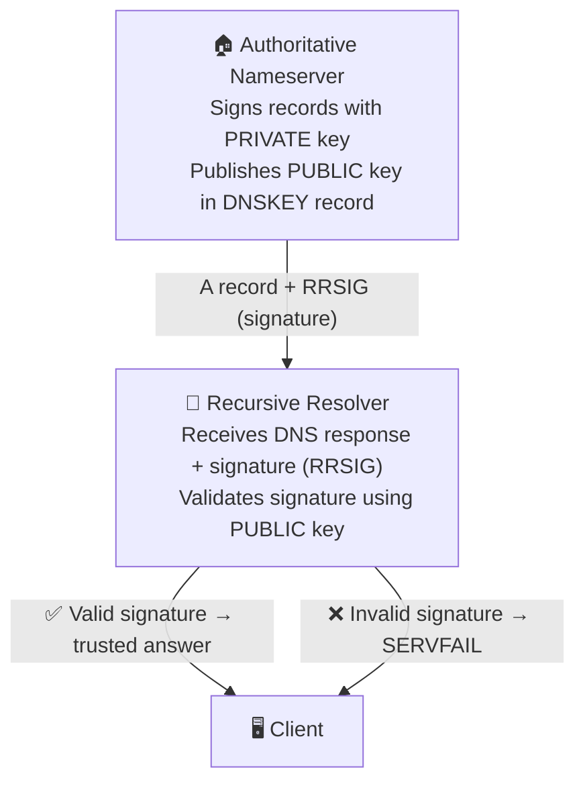
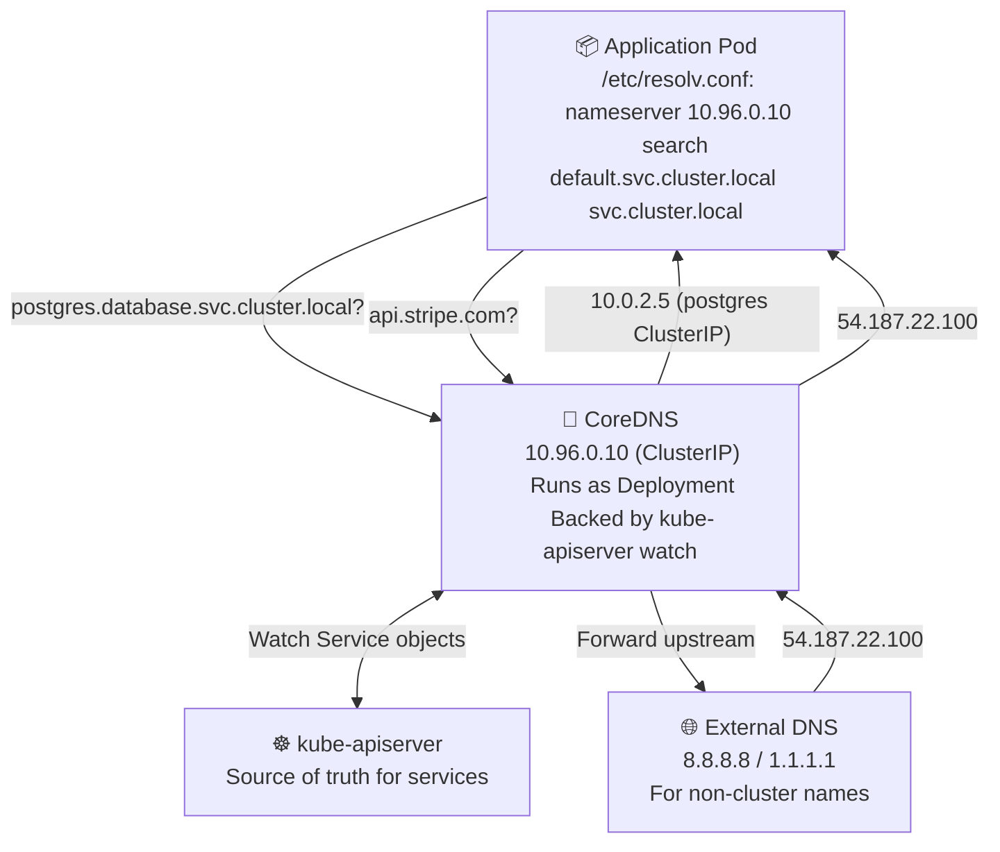
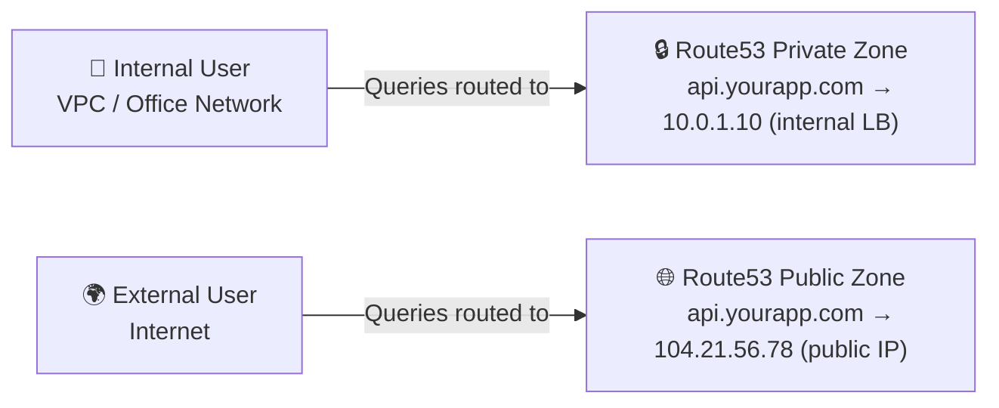

# 20 — DNS Deep Dive

> "DNS is the phonebook of the internet. You say a name, it gives you a number." — every networking textbook ever

---

## 📖 Table of Contents

1. [What is DNS?](#what-is-dns)
2. [DNS Hierarchy](#dns-hierarchy)
3. [DNS Resolution Step by Step](#dns-resolution-step-by-step)
4. [DNS Record Types](#dns-record-types)
5. [TTL and Caching](#ttl-and-caching)
6. [DNS-Based Load Balancing](#dns-based-load-balancing)
7. [GeoDNS](#geodns)
8. [Anycast](#anycast)
9. [DNS Failover](#dns-failover)
10. [DNSSEC](#dnssec)
11. [DNS in Kubernetes](#dns-in-kubernetes)
12. [Common DNS Issues in Production](#common-dns-issues-in-production)
13. [Key Takeaways](#key-takeaways)

---

## 🌐 What is DNS?

**Analogy:** Think of a city's contact directory. You know your friend's name — "Alice" — but to call her, you need her phone number. You look up "Alice" in the directory and get "555-1234". DNS works the same way. You know `google.com` but your computer needs an IP address like `142.250.80.46` to actually talk to it.

Computers talk to each other using **IP addresses** — four numbers separated by dots (IPv4: `142.250.80.46`) or a longer hexadecimal string (IPv6: `2607:f8b0:4004:c08::8a`). Humans can't remember those. We remember names like `google.com`, `github.com`, `api.myapp.com`.

**DNS (Domain Name System)** is the distributed, globally replicated system that translates human-readable domain names into machine-readable IP addresses.

Key properties of DNS:
- **Distributed** — no single server holds all DNS records
- **Hierarchical** — organized in a tree structure (root → TLD → domain → subdomain)
- **Cached** — responses are cached at multiple layers to reduce load
- **Eventually consistent** — changes propagate, not instantly, but reliably

---

## 🏛️ DNS Hierarchy

**Analogy:** Imagine a library with three floors. The ground floor (root) points you to the right wing (TLD). The wing has a catalog (authoritative nameserver) that tells you the exact shelf (IP address). You go from general to specific.

```
.  (root)
├── com
│   ├── google.com  → nameservers: ns1.google.com, ns2.google.com
│   ├── github.com  → nameservers: ns1.github.com, ns2.github.com
│   └── yourapp.com → nameservers: ns1.route53.aws.com
├── org
│   └── wikipedia.org
├── io
│   └── api.service.io
└── net
    └── cloudflare.net
```

There are four layers involved in every DNS lookup:

| Layer | Name | Role | Count |
|---|---|---|---|
| 1 | DNS Recursor / Recursive Resolver | Your local DNS detective. Does all the work. | Millions (ISPs, Google 8.8.8.8, Cloudflare 1.1.1.1) |
| 2 | Root Nameserver | Knows where TLD servers are. Answers "go ask .com servers" | 13 logical servers (A through M), thousands of physical |
| 3 | TLD Nameserver | Top-Level Domain server. Knows where authoritative servers are | One per TLD (.com, .org, .io, etc.) |
| 4 | Authoritative Nameserver | Has the actual answer — the real IP for your domain | One per domain (Route53, Cloudflare, GoDaddy) |



---

## 🔍 DNS Resolution Step by Step

**Analogy:** You want to find a restaurant called "The Golden Fork". You ask your friend (recursive resolver). Your friend doesn't know it. They call the city info line (root server) who says "restaurants are in the 'Food' directory". They then call the food directory (TLD server) who says "The Golden Fork is listed under the 'Downtown Guide' agency". They call that agency (authoritative server) who gives the exact address. Your friend tells you. Next time you ask, your friend remembers.



**Two types of DNS queries:**

| Query Type | Who does the work | Used by |
|---|---|---|
| Recursive | Resolver does all the work, gives final answer | Browsers, applications |
| Iterative | Resolver gives next server to ask, client does each step | Internal DNS servers |

**Query flow in numbers:**
1. Browser checks its in-memory cache (milliseconds)
2. OS checks `/etc/hosts` or Windows `hosts` file
3. OS checks its DNS cache
4. Query goes to configured DNS resolver (your ISP or 8.8.8.8)
5. Resolver checks its cache — if hit, done (sub 10ms)
6. If miss, resolver starts the full recursive resolution (can take 50–200ms for cold start)
7. Answer cached at resolver level for TTL seconds

---

## 📋 DNS Record Types

**Analogy:** A phone book has different sections — residential, business, emergency, fax. DNS records are those different sections, each serving a different purpose.

### A Record — IPv4 Address
Maps a hostname to an IPv4 address. The most common record type.

```
api.yourapp.com.    300    IN    A    104.21.56.78
api.yourapp.com.    300    IN    A    172.67.180.44   ← multiple A records = basic load balancing
```

### AAAA Record — IPv6 Address
Same as A record but for IPv6.

```
api.yourapp.com.    300    IN    AAAA    2606:4700:3031::6815:384e
```

### CNAME Record — Canonical Name (Alias)
Points one hostname to another hostname (not an IP). The resolver then looks up that hostname too.

```
www.yourapp.com.    3600    IN    CNAME    yourapp.com.
blog.yourapp.com.   3600    IN    CNAME    yourapp.ghost.io.
```

**Important:** You cannot put a CNAME on the apex/root domain (`yourapp.com`) — only on subdomains. This is why AWS Route53 offers "Alias records" as a workaround.

### MX Record — Mail Exchange
Tells email servers where to deliver email for your domain. Lower priority number = tried first.

```
yourapp.com.    3600    IN    MX    10    aspmx.l.google.com.
yourapp.com.    3600    IN    MX    20    alt1.aspmx.l.google.com.
yourapp.com.    3600    IN    MX    30    alt2.aspmx.l.google.com.
```

### TXT Record — Text
Stores arbitrary text. Used for domain verification, SPF, DKIM, DMARC, and more.

```
yourapp.com.    3600    IN    TXT    "v=spf1 include:_spf.google.com ~all"
yourapp.com.    3600    IN    TXT    "google-site-verification=abc123def456"
_dmarc.yourapp.com.    3600    IN    TXT    "v=DMARC1; p=quarantine; rua=mailto:dmarc@yourapp.com"
```

### NS Record — Nameserver
Tells the world which servers are authoritative for your domain.

```
yourapp.com.    172800    IN    NS    ns1.route53.amazonaws.com.
yourapp.com.    172800    IN    NS    ns2.route53.amazonaws.com.
```

### SOA Record — Start of Authority
The "birth certificate" of a DNS zone. Contains admin info and zone transfer settings.

```
yourapp.com.    3600    IN    SOA    ns1.route53.amazonaws.com. admin.yourapp.com. (
    2024062601    ; Serial number (date-based)
    7200          ; Refresh (2 hours)
    3600          ; Retry (1 hour)
    1209600       ; Expire (14 days)
    300           ; Minimum TTL (5 minutes)
)
```

### PTR Record — Reverse DNS
Maps an IP address back to a hostname (the reverse of A record). Used for logging, spam filtering.

```
78.56.21.104.in-addr.arpa.    3600    IN    PTR    api.yourapp.com.
```

### Quick Reference Table

| Record | Input | Output | Common Use |
|---|---|---|---|
| A | hostname | IPv4 | Primary address record |
| AAAA | hostname | IPv6 | IPv6 address record |
| CNAME | hostname | another hostname | Aliases, CDN pointing |
| MX | domain | mail server hostname | Email routing |
| TXT | hostname | text string | Verification, SPF, DKIM |
| NS | domain | nameserver hostname | Zone delegation |
| SOA | zone | zone metadata | Zone authority |
| PTR | IP (reversed) | hostname | Reverse DNS lookup |

---

## ⏱️ TTL and Caching

**Analogy:** Imagine you get a bus schedule. The schedule says "valid for the next 5 minutes". After 5 minutes, you need to get a fresh one because routes might have changed. TTL (Time To Live) is that expiry time on the DNS schedule.

TTL is set in **seconds** on each DNS record. When a resolver caches a response, it keeps it for TTL seconds before discarding and re-querying.

```
api.yourapp.com.    300    IN    A    104.21.56.78
                    ^^^
                    TTL = 300 seconds = 5 minutes
```

### TTL Trade-offs

| TTL | Pros | Cons | Best for |
|---|---|---|---|
| Very low (30–60s) | Fast failover, quick IP changes | More DNS queries, higher load on nameservers | Active deployments, migrations |
| Medium (300–600s) | Balance of freshness and performance | 5-10 min propagation delay | Most production services |
| High (3600–86400s) | Fewer queries, faster cached resolution | Slow failover, long rollout times | Stable, rarely-changing records |

### TTL Strategy for Deployments

When you know you are about to change an IP (deployment, migration), use this pattern:

```
BEFORE migration (days before):
  api.yourapp.com  →  TTL: 86400  →  OLD_IP

Step 1 (6 hours before):
  Lower TTL to 60s
  api.yourapp.com  →  TTL: 60  →  OLD_IP
  Wait for old high-TTL caches to expire (~24 hours)

Step 2 (when ready):
  api.yourapp.com  →  TTL: 60  →  NEW_IP
  Propagation happens within 60 seconds now!

Step 3 (after stable):
  Raise TTL back to 300 or higher
  api.yourapp.com  →  TTL: 300  →  NEW_IP
```

### Where Caching Happens



**Note:** Some ISPs and resolvers ignore TTL and cache for longer than you set. Google (8.8.8.8) and Cloudflare (1.1.1.1) generally respect TTL properly.

---

## ⚖️ DNS-Based Load Balancing

**Analogy:** Imagine a call center with 10 agents. When a customer calls, the receptionist gives them one of the 10 agent phone numbers, rotating through the list. DNS does the same — it hands out different IPs from a list, rotating among them.

The simplest form of DNS load balancing is **multiple A records** for the same hostname:

```
api.yourapp.com.    300    IN    A    10.0.1.10
api.yourapp.com.    300    IN    A    10.0.1.11
api.yourapp.com.    300    IN    A    10.0.1.12
```

### How Round-Robin Works

The DNS resolver returns all three IPs in the answer. The client usually picks the first one. Most resolvers rotate the order on each response (round-robin).



### Limitations of DNS Load Balancing

| Limitation | Explanation |
|---|---|
| No health checking | DNS doesn't know if a server is down. It keeps returning dead IPs. |
| Sticky clients | Clients cache the IP and keep hitting same server until TTL expires |
| Unequal load | If one client makes 1000 requests, another makes 1, DNS can't rebalance mid-session |
| No session affinity | Can't guarantee same client always goes to same server |

**DNS load balancing is best for stateless services** where any server can handle any request. For session-based systems, use a real load balancer (HAProxy, NGINX, ALB) behind a single DNS entry.

---

## 🌍 GeoDNS

**Analogy:** Imagine a global pizza chain. When you call their number, it routes to the nearest franchise — not the one in another country. GeoDNS does the same: it looks at where your query comes from and returns an IP for the nearest server.

GeoDNS (Geographic DNS) returns **different IP addresses based on the location of the querying resolver**.

```
User in USA queries api.yourapp.com  →  Returns 104.21.56.78   (US server)
User in EU queries api.yourapp.com   →  Returns 34.90.112.45   (EU server)
User in Asia queries api.yourapp.com →  Returns 35.187.152.34  (Asia server)
```

### How CDNs Use GeoDNS



### GeoDNS vs Anycast

| Feature | GeoDNS | Anycast |
|---|---|---|
| How it works | Different DNS answers per location | Same IP, BGP routing to nearest node |
| Where routing happens | At DNS layer (application level) | At network layer (IP routing) |
| Speed | Subject to DNS TTL | Instant (BGP-based) |
| Failover | Slow (TTL delay) | Fast (BGP reconverges in seconds) |
| Setup complexity | Medium (DNS provider feature) | High (requires BGP infrastructure) |
| Used by | Route53 latency routing, Cloudflare load balancing | Cloudflare's 1.1.1.1, Google's 8.8.8.8, root nameservers |

### Implementing GeoDNS with AWS Route53 (Latency Routing)

```python
import boto3

client = boto3.client('route53')

# Create latency-based routing records for 3 regions
regions = [
    {'region': 'us-east-1', 'ip': '104.21.56.78'},
    {'region': 'eu-west-1', 'ip': '34.90.112.45'},
    {'region': 'ap-northeast-1', 'ip': '35.187.152.34'},
]

for r in regions:
    client.change_resource_record_sets(
        HostedZoneId='ZXXXXXXXXXXXXX',
        ChangeBatch={
            'Changes': [{
                'Action': 'CREATE',
                'ResourceRecordSet': {
                    'Name': 'api.yourapp.com',
                    'Type': 'A',
                    'Region': r['region'],          # Route53 latency routing
                    'SetIdentifier': r['region'],
                    'TTL': 60,
                    'ResourceRecords': [{'Value': r['ip']}]
                }
            }]
        }
    )
```

---

## 📡 Anycast

**Analogy:** Imagine 50 fire stations across a city, all sharing the same phone number "911". When you call, your call automatically goes to the **nearest station**. You don't know which one. The routing happens at the phone network level. Anycast works identically — same IP, nearest server wins.

In Anycast, the **same IP address is announced from multiple physical locations** using BGP (Border Gateway Protocol). The internet's routing protocol naturally directs traffic to the nearest announcement point.



### Who Uses Anycast?

- **Cloudflare 1.1.1.1** — 200+ PoPs, all answering the same IP
- **Google 8.8.8.8** — same approach, different infrastructure
- **DNS root servers** — 13 logical addresses, 1000+ physical servers worldwide
- **CDN edge nodes** — content served from nearest edge automatically

### Anycast Benefits

| Benefit | Detail |
|---|---|
| DDoS resilience | Attack traffic absorbs across all PoPs, not a single target |
| Low latency | Traffic always hits nearest physical server |
| No client changes | Clients just use the IP, routing is transparent |
| Automatic failover | If one PoP goes down, BGP reconverges and traffic reroutes |

---

## 🔄 DNS Failover

**Analogy:** You have a primary doctor and a backup doctor. Your clinic checks every 5 minutes if the primary is available. If not, they route your call to the backup automatically. DNS failover does the same — health check the primary, swap to backup when it fails.

DNS failover combines **health checking** with **dynamic DNS updates** to route traffic away from unhealthy endpoints.



### AWS Route53 Health Check Failover Example

```python
import boto3

r53 = boto3.client('route53')

# Primary record with health check
r53.change_resource_record_sets(
    HostedZoneId='ZXXXXXXXXXXXXX',
    ChangeBatch={
        'Changes': [
            {
                'Action': 'CREATE',
                'ResourceRecordSet': {
                    'Name': 'api.yourapp.com',
                    'Type': 'A',
                    'Failover': 'PRIMARY',
                    'SetIdentifier': 'primary',
                    'HealthCheckId': 'abc-health-check-id',  # Route53 health check
                    'TTL': 30,
                    'ResourceRecords': [{'Value': '10.0.1.10'}]
                }
            },
            {
                'Action': 'CREATE',
                'ResourceRecordSet': {
                    'Name': 'api.yourapp.com',
                    'Type': 'A',
                    'Failover': 'SECONDARY',
                    'SetIdentifier': 'secondary',
                    'TTL': 30,
                    'ResourceRecords': [{'Value': '10.0.1.11'}]   # Backup IP
                }
            }
        ]
    }
)
```

**Failover timing:**
- Health check interval: 10–30 seconds
- Failure threshold: 3 consecutive failures = failover triggered
- Total failover time: ~30–90 seconds + TTL on the record

---

## 🔐 DNSSEC

**Analogy:** Imagine you receive a signed letter from your bank. The letter has an official wax seal. If someone intercepts and tampers with the letter, the seal is broken and you know it's fake. DNSSEC puts a cryptographic seal on DNS responses so tampering is detectable.

**DNS Cache Poisoning** is an attack where a malicious actor injects fake DNS records into a resolver's cache, redirecting users to attacker-controlled servers (e.g., for phishing or man-in-the-middle attacks).

DNSSEC (DNS Security Extensions) prevents this by **cryptographically signing DNS records** using public/private key pairs.



### DNSSEC Record Types

| Record | Purpose |
|---|---|
| DNSKEY | The zone's public key |
| RRSIG | Digital signature of a record set |
| DS | Delegation Signer — links parent zone to child zone's key |
| NSEC / NSEC3 | Proof that a name does NOT exist (prevents enumeration attacks) |

### DNSSEC Chain of Trust

```
Root zone → signs DS record → points to TLD key
TLD zone (.com) → signs DS record → points to yourapp.com key
yourapp.com → signs all its records with its own key
```

Every link in the chain is verified. If any link is broken or tampered with, the resolver rejects the response.

### DNSSEC Trade-offs

| Pros | Cons |
|---|---|
| Prevents cache poisoning | Larger DNS responses (signatures add bytes) |
| Cryptographic integrity guarantee | Complex to manage (key rotation, zone signing) |
| Required for some compliance (FISMA, DoD) | Not all resolvers validate DNSSEC |
| Enables DANE (TLS cert in DNS) | Zone enumeration possible with NSEC (NSEC3 mitigates) |

**When to use DNSSEC:**
- Government or financial services with compliance requirements
- High-value domains where phishing risk is significant
- When you use DANE/TLSA for cert pinning

**When NOT to use DNSSEC:**
- Small internal services where the overhead isn't worth it
- When your DNS provider doesn't support it cleanly (adds operational complexity)

---

## ☸️ DNS in Kubernetes

**Analogy:** Inside a Kubernetes cluster, services are like apartments in a building. You don't know which floor or room a service is in (its IP changes), but the building's internal directory (CoreDNS) always knows the current location.

Every Kubernetes cluster runs a **cluster DNS server** (CoreDNS by default, kube-dns historically) that handles name resolution for all services and pods inside the cluster.

### How Kubernetes DNS Works

Every Service gets a DNS name in the format:

```
<service-name>.<namespace>.svc.cluster.local
```

Examples:
```
my-api.default.svc.cluster.local           → ClusterIP of my-api
postgres.database.svc.cluster.local        → ClusterIP of postgres service
redis-master.cache.svc.cluster.local       → ClusterIP of redis-master
```

Every Pod also gets a DNS name:
```
<pod-ip-dashed>.<namespace>.pod.cluster.local
10-0-1-15.default.pod.cluster.local        → 10.0.1.15
```

### CoreDNS Architecture



### CoreDNS Configuration (Corefile)

```hcl
# /etc/coredns/Corefile
.:53 {
    errors
    health {
        lameduck 5s
    }
    ready
    kubernetes cluster.local in-addr.arpa ip6.arpa {
        pods insecure
        fallthrough in-addr.arpa ip6.arpa
        ttl 30
    }
    prometheus :9153
    forward . /etc/resolv.conf {
        max_concurrent 1000
    }
    cache 30
    loop
    reload
    loadbalance
}
```

### DNS Search Domains in Pods

When a pod queries just `postgres` (not the FQDN), Kubernetes tries:
1. `postgres.default.svc.cluster.local`
2. `postgres.svc.cluster.local`
3. `postgres.cluster.local`
4. `postgres` (external)

This is configured via the `search` field in `/etc/resolv.conf` inside the pod:

```
nameserver 10.96.0.10
search default.svc.cluster.local svc.cluster.local cluster.local
options ndots:5
```

The `ndots:5` means: if the name has fewer than 5 dots, try search domains first before treating it as absolute.

### headless Services and DNS

When you set `clusterIP: None` on a Service, you get a **headless service**. DNS returns the IPs of individual pods, not a single ClusterIP. Useful for StatefulSets (databases).

```yaml
apiVersion: v1
kind: Service
metadata:
  name: postgres
  namespace: database
spec:
  clusterIP: None        # headless!
  selector:
    app: postgres
  ports:
    - port: 5432
```

```
postgres.database.svc.cluster.local  →  [10.0.1.10, 10.0.1.11, 10.0.1.12]
                                          (all pod IPs, not a VIP)
```

StatefulSet pods also get stable DNS names:
```
postgres-0.postgres.database.svc.cluster.local  →  10.0.1.10
postgres-1.postgres.database.svc.cluster.local  →  10.0.1.11
postgres-2.postgres.database.svc.cluster.local  →  10.0.1.12
```

---

## 🚨 Common DNS Issues in Production

### 1. TTL Too High During Migrations

**Problem:** You changed the A record but users still go to the old server because their DNS cache hasn't expired.

**Fix:** Lower TTL to 60s at least 24–48 hours before any IP change. Raise it back after migration is stable.

### 2. Negative Caching (NXDOMAIN Cached)

**Problem:** A service tries to reach `new-service.default.svc.cluster.local` before the Service exists. The NXDOMAIN (not found) response gets cached. Even after the Service is created, queries fail until the negative cache expires.

**Fix:** Reduce negative TTL (the last value in SOA record). In Kubernetes, restart the pod or wait for the CoreDNS cache TTL (default 30s).

### 3. DNS Amplification Attack

**Problem:** Attackers send spoofed DNS queries with victim's IP as source. DNS servers send large responses to the victim (amplification factor of 50–70x).

**Fix:** Enable **Response Rate Limiting (RRL)** on your authoritative nameservers. Use firewalls to block open resolvers.

### 4. Split-Brain DNS

**Problem:** Internal and external users need different answers for the same name. `api.yourapp.com` should resolve to internal IP `10.0.1.10` inside the VPC but `104.21.56.78` externally.

**Fix:** Run two separate DNS zones — one for internal (served by private resolver) and one external. Route53 supports **private hosted zones** for this exact scenario.



### 5. DNS Lookup Failures in Kubernetes (ndots:5 Performance Issue)

**Problem:** With `ndots:5`, every short name (like `postgres`) generates 4–5 DNS queries (trying each search domain) before getting an answer. Under high traffic, this creates a DNS query storm.

**Fix:** Use fully qualified domain names (FQDN) ending with a dot in your app config:

```python
# Bad: generates multiple DNS queries
db_host = "postgres"

# Good: single DNS query, FQDN
db_host = "postgres.database.svc.cluster.local."
```

Or reduce `ndots` in your pod spec:

```yaml
spec:
  dnsConfig:
    options:
      - name: ndots
        value: "2"   # Try absolute lookup sooner
```

### 6. Slow DNS Resolution Under Load (CoreDNS Throttling)

**Problem:** CoreDNS becomes a bottleneck under high query rates in a busy cluster.

**Fix:**
- Scale CoreDNS horizontally (increase replica count)
- Enable NodeLocal DNSCache (DNS caching on each node, bypasses CoreDNS for cached answers)
- Use `autopath` plugin to reduce query count

```yaml
# NodeLocal DNSCache DaemonSet reduces round-trips to CoreDNS
# Recommended for clusters with >50 nodes
apiVersion: apps/v1
kind: DaemonSet
metadata:
  name: node-local-dns
  namespace: kube-system
```

### Production DNS Checklist

| Check | Why |
|---|---|
| Low TTL before deployments | Faster IP changes during rollouts |
| Health checks on failover records | Prevent routing to dead servers |
| Monitor NXDOMAIN rate | Spike indicates misconfiguration or attack |
| DNSSEC on public-facing domains | Protect high-value domains from poisoning |
| Private hosted zones for internal services | Prevent internal topology leakage |
| CoreDNS metrics in Prometheus | Catch DNS issues before users do |
| Test DNS from multiple regions | GeoDNS misconfiguration is hard to spot locally |

---

## 🎯 Key Takeaways

1. **DNS is the backbone of the internet's naming system** — a distributed, hierarchical, cached system that maps names to IPs. Without it, you'd have to memorize IP addresses for every service.

2. **Resolution is a chain of delegation** — Root → TLD → Authoritative → Answer. Each level delegates responsibility downward. The recursive resolver does the legwork so clients don't have to.

3. **TTL is a deployment lever** — lowering TTL before a migration gives you fast failover. Leaving it high gives better performance. Always lower TTL well in advance of any IP change.

4. **Multiple A records = simplest load balancing** — no infrastructure needed, just add more records. But DNS LB has no health awareness and sticky clients are a real problem. Use a real load balancer for serious production traffic.

5. **GeoDNS routes by location, Anycast routes by network proximity** — GeoDNS works at the DNS layer (different answers per region). Anycast works at the IP layer (same IP, BGP picks nearest PoP). CDNs use both together.

6. **DNS failover is not instant** — even with TTL=30, expect 30–90 seconds of failover time (health check + TTL expiry). Design your systems to handle brief outages during failover.

7. **DNSSEC adds cryptographic trust to DNS** — prevents cache poisoning attacks by signing records. Essential for high-value public domains. Adds operational complexity.

8. **Kubernetes DNS is CoreDNS serving the cluster** — every Service gets a stable DNS name. Use FQDNs in your apps to avoid the `ndots:5` query overhead. StatefulSet pods get stable per-pod DNS names for databases.

9. **Split-brain DNS solves internal vs external routing** — run private and public hosted zones for the same domain. Internal users get private IPs, external users get public IPs.

10. **Monitor your DNS** — track query rates, NXDOMAIN rates, resolution latency. DNS problems are silent killers; your app just hangs or gets connection errors with no obvious cause.

---

> "There are two hard problems in computer science: cache invalidation, naming things, and off-by-one errors. DNS is proof that naming things at scale is genuinely hard." — adapted from Phil Karlton
