# API Design Principles — The Complete Guide

> "An API is a contract between two pieces of software. Break the contract, and everything falls apart."

---

## Table of Contents

1. [What is an API?](#1-what-is-an-api)
2. [REST Principles — The 6 Constraints](#2-rest-principles--the-6-constraints)
3. [RESTful URL Design Rules](#3-restful-url-design-rules)
4. [HTTP Methods and Idempotency](#4-http-methods-and-idempotency)
5. [HTTP Status Codes — Group and Memorize](#5-http-status-codes--group-and-memorize)
6. [API Versioning Strategies](#6-api-versioning-strategies)
7. [Pagination — Offset vs Cursor](#7-pagination--offset-vs-cursor)
8. [Rate Limiting in API Design](#8-rate-limiting-in-api-design)
9. [Request/Response Design](#9-requestresponse-design)
10. [API Documentation with OpenAPI/Swagger](#10-api-documentation-with-openapiswagger)
11. [Designing a Twitter-like API](#11-designing-a-twitter-like-api)
12. [Idempotency Keys for Payment APIs](#12-idempotency-keys-for-payment-apis)
13. [Webhooks vs Polling](#13-webhooks-vs-polling)
14. [GraphQL vs REST — Trade-offs](#14-graphql-vs-rest--trade-offs)
15. [Common Interview Questions](#15-common-interview-questions)
16. [Key Takeaways](#16-key-takeaways)

---

## 1. What is an API?

### The Analogy — TV Remote

Socho tumhare ghar mein TV hai. TV ke andar complex circuits hain, signal processing hain, display drivers hain — lekin tumhe kuch nahi pata. Tum sirf remote uthate ho, "Volume Up" button dabaate ho, aur kaam ho jaata hai.

**Yahi hai API.**

- **TV** = Server (actual system with all the logic)
- **Remote** = API (the interface you interact with)
- **You** = Client (browser, mobile app, another service)
- **Button** = Endpoint (`/api/v1/volume/up`)

You don't need to know HOW the TV increases volume. You just press the button and trust that the TV will handle it. Similarly, when Zomato's app calls the Swiggy payment API, it doesn't know how Swiggy processes payments internally — it just sends a request and gets a response.


### Real-World Examples

| Company | API Used For |
|---------|-------------|
| Swiggy | Restaurant listing, order placement, driver tracking |
| Zomato | Menu fetch, reviews, payment processing |
| WhatsApp | Message send/receive, media upload, status update |
| Instagram | Post upload, feed fetch, like/comment |
| Netflix | Video streaming, recommendation fetch, profile management |
| Paytm | Payment initiation, wallet balance, transaction history |

### Why APIs Exist

**Before APIs:** Har company ek closed silo mein kaam karti thi. Agar tum Zomato par Paytm se payment karna chahte the, toh tumhe Zomato ko Paytm ka full source code dena padta. Impossible.

**After APIs:** Zomato calls Paytm's API. Simple request bhejo, response lo. Paytm ka internal code? Zomato ko koi farak nahi.

> **Interview Tip:** Jab interviewer puche "What is an API?", TV remote analogy do. Phir ek real-world business example do — Zomato calling Paytm's payment API. Yeh answer instantly stands out.

---

## 2. REST Principles — The 6 Constraints

### What is REST?

REST = **RE**presentational **S**tate **T**ransfer. Ek architectural style hai, koi protocol nahi. Roy Fielding ne 2000 mein PhD thesis mein define kiya tha.

Simple baat hai: REST ek set of rules hai jo define karta hai ki ek good web API kaise behave karni chahiye.

### The 6 Constraints

#### Constraint 1: Client-Server

**Analogy:** Restaurant mein waiter (server) aur customer (client) alag hote hain. Customer ko kitchen ki tension nahi, kitchen ko customer ke personal life ki tension nahi.

- Client handles UI, user interaction
- Server handles data storage, business logic
- Dono independently evolve ho sakte hain

**Why it matters:** Instagram ka Android app aur iOS app dono ek hi API use karte hain. Server side change hua? Dono clients automatically benefit karte hain.

#### Constraint 2: Stateless

**Analogy:** ATM machine ko har baar apni full identity batani padti hai — card daalo, PIN daalo. ATM tumhara previous transaction yaad nahi rakhta. Har request self-contained hai.

- Server ko client ki state yaad nahi rakhni
- Har request mein saari context honi chahiye
- Authentication token? Har request mein bhejo

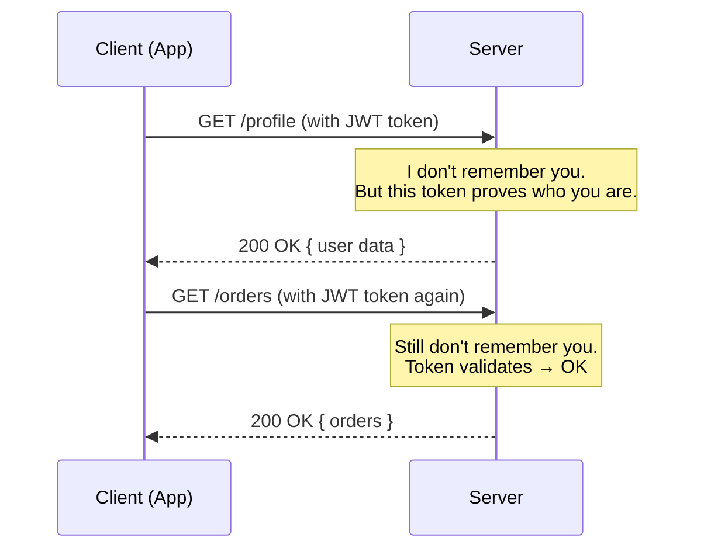

**Why it matters:** Stateless APIs scale horizontally easily. Request 1 Server A pe gayi, Request 2 Server B pe — koi problem nahi kyunki server ne kuch yaad nahi rakha.

#### Constraint 3: Cacheable

**Analogy:** Newspaper. Aaj ka newspaper ek baar print hota hai, lakho log padhte hain. Har baar new copy print nahi hoti. Same data, multiple consumers.

- Server responses ko mark karna chahiye: cacheable ya not cacheable
- GET /products/123 — yeh cache ho sakta hai
- POST /checkout — yeh nahi hona chahiye

```
HTTP Response Headers:
Cache-Control: max-age=3600        ← Cache this for 1 hour
Cache-Control: no-cache            ← Don't cache this
ETag: "abc123"                     ← Version identifier for conditional fetches
```

**Why it matters:** Zomato ke restaurant menu page par lakho hits aate hain. Agar har request database se fetch kare — server crash ho jaayega. Cache se CDN serve karo, latency < 10ms.

#### Constraint 4: Uniform Interface

REST ka sabse important constraint. 4 sub-constraints:

1. **Resource identification in requests** — `/users/123` clearly identifies a user
2. **Resource manipulation through representations** — Client JSON bhejta hai, server samajhta hai
3. **Self-descriptive messages** — Response mein enough info honi chahiye ki client samjhe kya karna hai
4. **HATEOAS** — Hypermedia As The Engine Of Application State (advanced; briefly covered below)

**Why it matters:** Ek bhi endpoint dekh kar samajh aa jaaye ki kya karna hai. `/api/v1/users/123/orders` — clearly "user 123 ke orders" hai.

#### Constraint 5: Layered System

**Analogy:** Dal makhani order karte waqt tumhe nahi pata ki kitchen mein chef kaunsa handi use karta hai, kahan se vegetables aate hain, ya restaurant ka cloud kitchen network kahan hai. Tumhe sirf waiter se kaam hai.

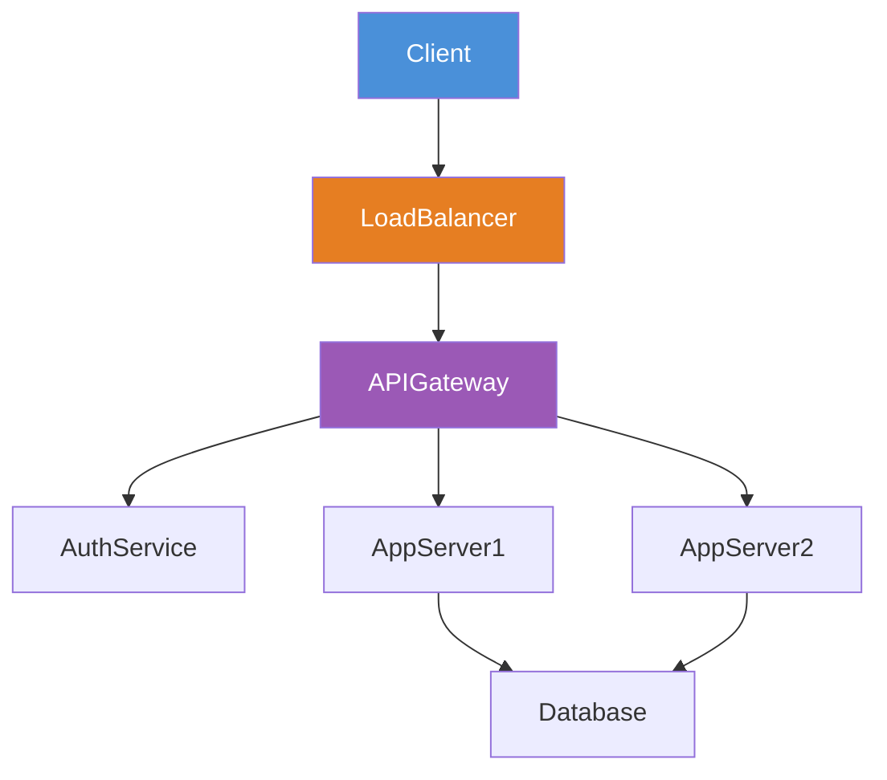

Client ko nahi pata ki request ek load balancer se, phir API gateway se, phir actual server tak gayi. Yeh layering client se hidden hai.

#### Constraint 6: Code on Demand (Optional)

Server client ko executable code bhej sakta hai (like JavaScript). Yeh optional constraint hai aur almost never discussed in interviews.

---

## 3. RESTful URL Design Rules

### The Core Philosophy: Think in Nouns, Not Verbs

**Analogy:** Library mein "Books" section hota hai, "Get Books" section nahi hota. Resources (nouns) ke naam se section hote hain.

### Rule 1: Use Nouns, Never Verbs

```
WRONG (verb-based):
GET /getUser/123
POST /createPost
DELETE /deleteComment/456
POST /getUserPosts

CORRECT (noun-based):
GET /users/123
POST /posts
DELETE /comments/456
GET /users/123/posts
```

**Yeh kyun important hai:** HTTP method already verb hai (GET, POST, DELETE). URL mein dobara verb daalna redundant hai.

### Rule 2: Use Plural Nouns

```
WRONG:
/user/123
/post/456
/product/789

CORRECT:
/users/123
/posts/456
/products/789
```

Collection hamesha plural hoti hai. `/users` matlab "users ka collection". Makes sense.

### Rule 3: Hierarchical Relationships

```
/users/123/posts              → User 123's posts
/users/123/posts/456          → Post 456 of User 123
/users/123/posts/456/comments → Comments on Post 456 of User 123
/orders/789/items             → Items in Order 789
```

**Rule:** 2 levels deep tak theek hai. 3 levels se zyada avoid karo — confusing ho jaata hai.

```
TOO DEEP (avoid):
/users/123/posts/456/comments/789/likes/101

BETTER (flatten it):
/comments/789/likes
/likes/101
```

### Rule 4: Lowercase, Hyphens for Spaces

```
WRONG:
/userPosts       (camelCase)
/User_Posts      (mixed case with underscore)
/UserPosts       (PascalCase)

CORRECT:
/user-posts      (kebab-case with hyphens)
/order-items
/product-categories
```

### Rule 5: Query Params for Filtering, Sorting, Pagination

```
/products?category=electronics&price_max=50000&sort=-price&page=2&limit=20

Breaking it down:
  category=electronics    → Filter by category
  price_max=50000        → Price less than ₹50,000
  sort=-price            → Sort by price descending (- prefix)
  page=2                 → Second page
  limit=20               → 20 results per page
```

### Complete URL Design Example — Zomato-like API

```
GET    /restaurants                          → List all restaurants
GET    /restaurants?city=mumbai&cuisine=biryani → Filtered list
GET    /restaurants/123                      → Specific restaurant
GET    /restaurants/123/menu                 → Restaurant's menu
GET    /restaurants/123/menu/items/456       → Specific menu item
POST   /orders                               → Place new order
GET    /orders/789                           → Get order details
PATCH  /orders/789                           → Update order status
DELETE /orders/789                           → Cancel order
GET    /users/me/orders                      → Current user's orders
POST   /users/me/addresses                   → Add delivery address
GET    /users/me/addresses                   → List saved addresses
```

---

## 4. HTTP Methods and Idempotency

### The Analogy — ATM Operations

- **GET** = Check balance (safe, can do it 1000 times, same result)
- **POST** = Deposit money (creates something new each time)
- **PUT** = Replace your entire account info
- **PATCH** = Update just your phone number
- **DELETE** = Close the account

### HTTP Methods Deep Dive

| Method | Purpose | Request Body | Response Body | Idempotent | Safe |
|--------|---------|-------------|--------------|-----------|------|
| GET | Retrieve resource | No | Yes | Yes | Yes |
| POST | Create resource | Yes | Yes | **No** | No |
| PUT | Replace entire resource | Yes | Yes | Yes | No |
| PATCH | Partial update | Yes | Yes | **No*** | No |
| DELETE | Remove resource | No | No (or 200) | Yes | No |
| HEAD | Like GET but no body | No | No | Yes | Yes |
| OPTIONS | Get supported methods | No | Yes | Yes | Yes |

*PATCH can be designed to be idempotent but isn't required to be.

### Idempotency — Yeh Kyun Itna Important Hai?

**Analogy:** Light ka switch socho. Switch ON karo — light jali. Dobara ON karo — light still jali. 10 baar ON karo — same result. Yeh idempotent hai. Par "ek press mein volume 10% badhao" idempotent nahi hai — 10 baar press kiya toh 100% badh jaayega.

```
Idempotent operations:
  GET /users/123      → Always returns same user (if not modified)
  DELETE /users/123   → Delete once: 200 OK. Delete again: 404 Not Found (or 200)
                        Net effect is same — user is gone
  PUT /users/123 {name: "Siddesh"}  → 1st call: creates/replaces. 2nd call: same result

Non-idempotent operations:
  POST /orders        → Each call creates a NEW order
  POST /likes         → Each call adds another like (if no duplicate check)
```

**Why it matters in production:** Network failures happen. Mobile app retries a request — kya ek order 2 baar place ho sakta hai? Agar POST idempotent nahi hai, haan. Isliye we use **idempotency keys** for payments (covered later).

### When to Use Which Method — Real Examples

```
Instagram API:

GET    /posts/abc123              → Fetch a post
POST   /posts                    → Create new post
PUT    /posts/abc123             → Replace entire post object
PATCH  /posts/abc123             → Update just the caption
DELETE /posts/abc123             → Delete the post
POST   /posts/abc123/likes       → Like a post (not idempotent by default)
DELETE /posts/abc123/likes       → Unlike a post

WhatsApp API:

POST   /messages                 → Send message
GET    /messages/msg789          → Get message details
DELETE /messages/msg789          → Delete message (for me or everyone)
PATCH  /messages/msg789          → Edit message text

Swiggy API:

POST   /orders                   → Place new order
GET    /orders/ord456            → Track order
PATCH  /orders/ord456            → Update delivery address (before accepted)
DELETE /orders/ord456            → Cancel order
```

---

## 5. HTTP Status Codes — Group and Memorize

### The Analogy — Restaurant Response System

Imagine ordering food. The waiter's possible responses:
- "Here's your food!" = **2xx Success**
- "That dish moved to table 5" = **3xx Redirect**
- "Sorry, we don't have that on the menu" = **4xx Client Error** (YOUR mistake)
- "Chef burned everything, kitchen is on fire" = **5xx Server Error** (THEIR mistake)

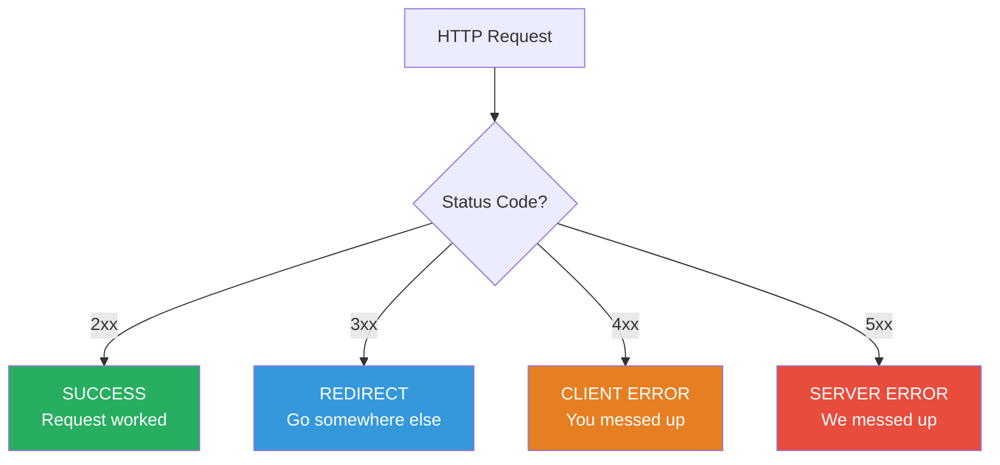

### 2xx — Success Codes

| Code | Name | When to Use | Real Example |
|------|------|-------------|-------------|
| **200** | OK | Generic success for GET, PUT, PATCH | `GET /users/123` returns user data |
| **201** | Created | POST created a new resource | `POST /tweets` returns new tweet with ID |
| **204** | No Content | Success but no response body | `DELETE /posts/123` — deleted, nothing to return |
| **206** | Partial Content | Returning a range (file streaming) | Netflix video streaming chunks |

**Memory trick:** 2 = "Two thumbs up" = good things happened

```json
// 201 Created — POST /api/v1/users
// Response includes the newly created resource
{
  "id": "usr_9f8d7c6b",
  "name": "Siddesh Pansare",
  "email": "siddesh@example.com",
  "createdAt": "2026-06-26T10:00:00Z"
}
```

### 3xx — Redirection Codes

| Code | Name | When to Use |
|------|------|-------------|
| **301** | Moved Permanently | Old URL forever moved to new URL |
| **302** | Found (Temp Redirect) | Temporary redirect |
| **304** | Not Modified | Client has cached version, use it |
| **307** | Temporary Redirect | Redirect but keep HTTP method |
| **308** | Permanent Redirect | Like 301 but keep method |

**304 is gold for performance:** Client sends `If-None-Match: "etag123"`. Server says "304 Not Modified" — client uses its cache. Zero data transfer!

### 4xx — Client Error Codes (Tumhari galti hai!)

| Code | Name | When to Use | Real Example |
|------|------|-------------|-------------|
| **400** | Bad Request | Invalid input format | `POST /users` with missing required `email` field |
| **401** | Unauthorized | Not logged in / token missing | Accessing Swiggy orders without login |
| **403** | Forbidden | Logged in but no permission | User trying to delete another user's post |
| **404** | Not Found | Resource doesn't exist | `GET /users/999999` — user doesn't exist |
| **405** | Method Not Allowed | Wrong HTTP method | `DELETE /users` (can't delete entire collection) |
| **409** | Conflict | Resource conflict | `POST /users` with email that already exists |
| **422** | Unprocessable Entity | Valid format, but semantically wrong | Valid JSON but `age: -5` makes no sense |
| **429** | Too Many Requests | Rate limit exceeded | Sending 1000 API requests in 1 minute |

**401 vs 403 — Yaad kaise rakhen:**
- **401 Unauthorized** = "Who are you? Show me your ID card." (Identity not established)
- **403 Forbidden** = "I know who you are. You still can't enter." (Identity known, access denied)

```json
// 400 Bad Request
{
  "error": {
    "code": "VALIDATION_ERROR",
    "message": "Request validation failed",
    "details": [
      { "field": "email", "issue": "Invalid email format" },
      { "field": "age", "issue": "Must be greater than 0" }
    ]
  },
  "requestId": "req_abc123xyz"
}

// 401 Unauthorized
{
  "error": {
    "code": "AUTHENTICATION_REQUIRED",
    "message": "Please login to access this resource"
  }
}

// 403 Forbidden
{
  "error": {
    "code": "INSUFFICIENT_PERMISSIONS",
    "message": "You do not have permission to delete this post"
  }
}
```

### 5xx — Server Error Codes (Hamari galti hai!)

| Code | Name | When to Use | Real Example |
|------|------|-------------|-------------|
| **500** | Internal Server Error | Unhandled exception, bug in code | NullPointerException in production |
| **501** | Not Implemented | Feature not built yet | Endpoint defined but logic not coded |
| **502** | Bad Gateway | Upstream service returned invalid response | Load balancer got garbage from app server |
| **503** | Service Unavailable | Server too busy or in maintenance | Zomato server down during peak dinner hours |
| **504** | Gateway Timeout | Upstream service took too long | App server didn't respond to gateway in time |

**502 vs 503 vs 504 — The Gateway Trinity:**
- **502** = Gateway got a bad/corrupt response from upstream
- **503** = Server is too busy/down (no response capacity)
- **504** = Server started responding but TIMED OUT

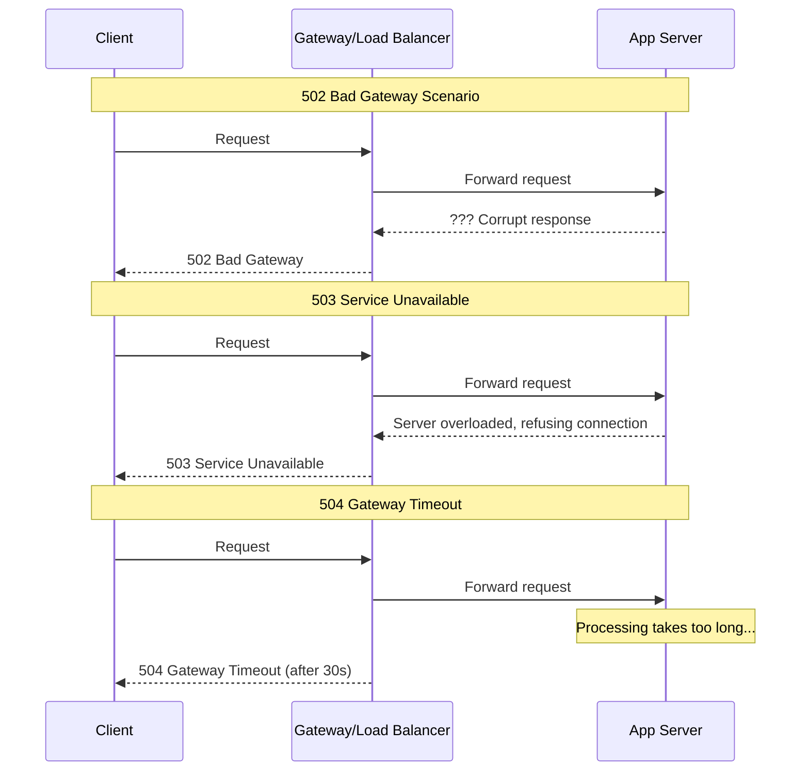

> **Interview Tip:** Memorize these groups: "2-good, 3-move, 4-your fault, 5-our fault". Then rattle off the key ones. Interviewers love when you explain 401 vs 403 and 502 vs 503 vs 504.

---

## 6. API Versioning Strategies

### Why Version Your API?

**Analogy:** Imagine WhatsApp updates the message format. All old WhatsApp apps worldwide would break if the server changed the API without warning. Versioning means old apps keep working while new apps get new features.

Simple baat: **API versioning = backward compatibility guarantee**.

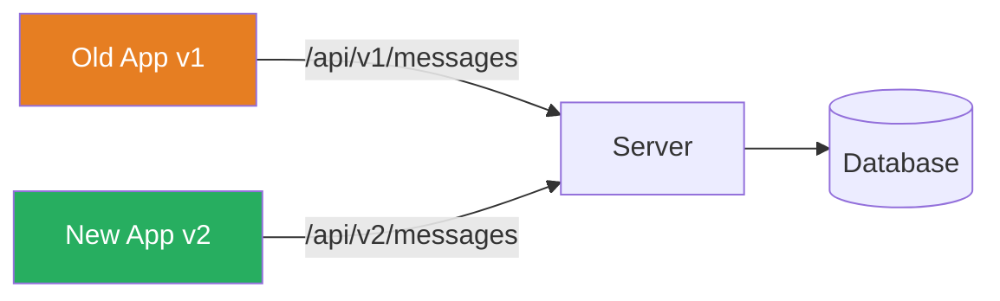

### Strategy 1: URL Path Versioning

```
GET /api/v1/users
GET /api/v2/users
GET /v1/products
GET /v2/products
```

**Pros:**
- Most visible — immediately clear which version you're using
- Easy to test in browser (just type the URL)
- Caching works perfectly (different URLs = different cache entries)
- Load balancers can route by URL prefix

**Cons:**
- "Unclean" URLs (version is not really a resource)
- Breaks the REST principle that URLs should represent resources
- Client has to change the URL to upgrade

**Used by:** Twitter API, Stripe, Twilio, GitHub

### Strategy 2: Header Versioning

```
GET /api/users
Accept: application/vnd.myapp.v2+json

— OR —

GET /api/users
API-Version: 2
X-API-Version: 2026-01-01
```

**Pros:**
- Clean URLs — resource URL never changes
- Follows HTTP spec (Accept header for content negotiation)
- REST purist's choice

**Cons:**
- Invisible in browser URL bar — hard to test manually
- Harder to cache (cache must vary on headers)
- Clients often forget to send the header
- Not beginner-friendly

**Used by:** GitHub API (uses `Accept` header), Microsoft Azure

### Strategy 3: Query Parameter Versioning

```
GET /api/users?version=1
GET /api/users?api-version=2
GET /api/users?v=2
```

**Pros:**
- Simple to add
- Visible in URL
- Easy to test in browser

**Cons:**
- Query params are meant for filtering, not routing
- Can conflict with other query params
- Caching issues (cache systems may strip query params)
- Easy to forget

**Used by:** Netflix (internally), Amazon AWS

### Comparison Table

| Criteria | URL Path | Header | Query Param |
|----------|---------|--------|------------|
| Visibility | High | Low | Medium |
| Browser testable | Yes | No | Yes |
| Caching | Excellent | Complex | Moderate |
| REST purity | Low | High | Low |
| Developer experience | Best | Moderate | Good |
| Industry adoption | Most common | Second | Least common |
| **Recommendation** | **Use this** | Advanced cases | Avoid |

### Version Deprecation Strategy

```
Timeline for deprecating v1 when launching v2:

Month 0:   Launch v2
Month 1:   Announce v1 deprecation (email, docs, deprecation headers)
Month 3:   Add Deprecation header to every v1 response:
           Deprecation: true
           Sunset: Sat, 01 Jan 2027 00:00:00 GMT
           Link: </api/v2/users>; rel="successor-version"
Month 12:  v1 returns 410 Gone with migration guide link
Month 18:  v1 completely removed from infrastructure
```

> **Interview Tip:** Always say "I'd use URL path versioning for public APIs because of cacheability and developer experience. Header versioning is more REST-pure but hurts usability." This shows you understand the tradeoffs.

---

## 7. Pagination — Offset vs Cursor

### Why Pagination?

**Analogy:** Imagine library mein koi book maange aur librarian saari 50,000 books ek saath utha ke le aaye. Absurd hai na? Isliye humlog "page 1 mein pehli 20 books do" bolte hain.

Database mein millions of records ho sakte hain. Sab ek saath return karna:
- Server ki memory blow up kar dega
- Client itna data render nahi kar sakta
- Network pe unnecessary load

### Strategy 1: Offset-Based Pagination

```
GET /posts?offset=0&limit=20    → Posts 1-20
GET /posts?offset=20&limit=20   → Posts 21-40
GET /posts?offset=40&limit=20   → Posts 41-60

— OR page-based (same thing, different math) —

GET /posts?page=1&limit=20      → Posts 1-20
GET /posts?page=2&limit=20      → Posts 21-40
```

**Response:**
```json
{
  "data": [
    { "id": 1, "title": "Post 1" },
    { "id": 2, "title": "Post 2" }
  ],
  "pagination": {
    "page": 1,
    "limit": 20,
    "totalItems": 1543,
    "totalPages": 78,
    "hasNextPage": true,
    "hasPreviousPage": false
  }
}
```

**Pros:**
- Simple to implement
- Can jump to any page: `?page=50`
- Shows total count and "Page X of Y"

**Cons:**
- **The Phantom Record Problem:** User is on page 2. Meanwhile, a new post is added. Page 2 shifts — user sees a duplicate record from old page 1.
- **The Missing Record Problem:** A post is deleted. User skips over a record.
- **Performance degrades at high offsets:** `SELECT * FROM posts OFFSET 100000 LIMIT 20` — database still scans 100,000 rows to skip them!

```sql
-- This is slow for large offsets:
SELECT * FROM posts ORDER BY created_at DESC OFFSET 100000 LIMIT 20;
-- Database scans 100,020 rows to return 20
```

### Strategy 2: Cursor-Based Pagination

**Analogy:** Bhai, bookmark ke saath padho. Jahan chhoda wahan se shuru. Page number nahi, actual position remember karo.

A cursor is an opaque pointer to a specific position in the dataset — usually encoded as base64 to make it tamper-resistant.

```
GET /posts                     → First page (no cursor)
GET /posts?cursor=eyJpZCI6MjB9 → Next page (cursor from previous response)
GET /posts?cursor=eyJpZCI6NDB9 → Next next page
```

**How it works internally:**
```
Cursor = base64({"id": 20, "created_at": "2026-06-20T10:00:00Z"})

Query:
SELECT * FROM posts
WHERE (created_at, id) < (decoded_created_at, decoded_id)
ORDER BY created_at DESC, id DESC
LIMIT 20;

This uses an index properly! No full scan needed.
```

**Response:**
```json
{
  "data": [
    { "id": 20, "title": "Post 20" },
    { "id": 19, "title": "Post 19" }
  ],
  "pagination": {
    "nextCursor": "eyJpZCI6MTgsImNyZWF0ZWRfYXQiOiIyMDI2LTA2LTE5VDEwOjAwOjAwWiJ9",
    "prevCursor": "eyJpZCI6MjEsImNyZWF0ZWRfYXQiOiIyMDI2LTA2LTIxVDEwOjAwOjAwWiJ9",
    "hasNextPage": true,
    "hasPreviousPage": true
  }
}
```

**Pros:**
- Stable — no duplicate/missing records even if data changes
- Consistent performance regardless of position (O(log n) with index)
- Better for real-time feeds (Instagram, Twitter, YouTube)

**Cons:**
- Can't jump to arbitrary page ("go to page 50" is impossible)
- No total count (hard to show "Page X of Y")
- More complex to implement
- Cursor must be kept between requests

### Offset vs Cursor — When to Use Which

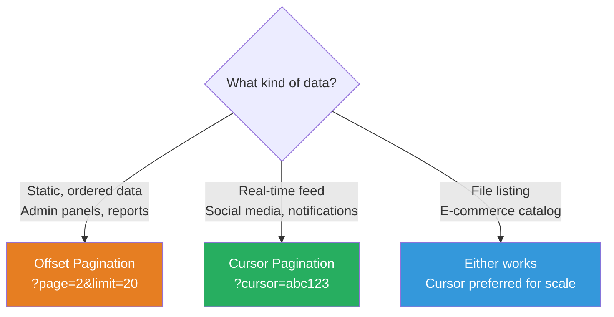

| Feature | Offset | Cursor |
|---------|--------|--------|
| Jump to any page | Yes | No |
| Stable during inserts/deletes | No | Yes |
| Shows total count | Yes | No |
| Performance at scale | Degrades | Consistent |
| Use case | Admin dashboards, reports | Social feeds, notifications |
| Used by | Most REST APIs | Twitter, Instagram, Facebook |

> **Interview Tip:** "Instagram's feed uses cursor pagination because new posts are constantly added. If they used offset, you'd see duplicate posts scrolling down. Cursor ensures you pick up exactly where you left off."

---

## 8. Rate Limiting in API Design

### Why Rate Limiting?

**Analogy:** Chai ki dukaan par unlimited free refills hain. Ek banda 500 cups le gaya — baaki sab ko milhi nahi. Rate limiting matlab "ek banda zyada na le sake taaki sab ko mile."

In APIs:
- Prevent abuse (one user flooding your server)
- Protect against DDoS attacks
- Ensure fair usage across all clients
- Control costs (especially for expensive operations)

### Rate Limit Headers (Standard)

Every rate-limited API should return these headers:

```
HTTP/1.1 200 OK
X-RateLimit-Limit: 1000          ← Total allowed per window
X-RateLimit-Remaining: 842       ← Remaining in current window
X-RateLimit-Reset: 1751025600    ← Unix timestamp when window resets
Retry-After: 3600                ← (when 429) seconds until retry
```

### When Rate Limit is Exceeded

```
HTTP/1.1 429 Too Many Requests
X-RateLimit-Limit: 1000
X-RateLimit-Remaining: 0
X-RateLimit-Reset: 1751025600
Retry-After: 3600

{
  "error": {
    "code": "RATE_LIMIT_EXCEEDED",
    "message": "You have exceeded 1000 requests per hour",
    "retryAfter": 3600
  }
}
```

### Rate Limiting Strategies (API Design Perspective)

Different limits for different tiers:

```
Free Tier:      100 requests/hour
Developer Tier: 5,000 requests/hour
Business Tier:  50,000 requests/hour
Enterprise:     Custom / Unlimited

Per endpoint limits:
  GET /search         → 100 req/min (expensive full-text search)
  GET /posts          → 1000 req/min (cheap read)
  POST /messages      → 60 req/min (prevent spam)
```

Note: Implementation details (Token Bucket, Sliding Window, Redis-based) are covered in detail in chapter 35 on Rate Limiting.

---

## 9. Request/Response Design

### Consistent Error Format — Isliye Zaroori Hai

**Analogy:** Imagine 10 alag doctors hain. Ek prescriptions Hindi mein likhta hai, doosra English mein, teesra shorthand mein. Patient confused ho jaata hai. Ek standard format ho toh — saara hospital ek tarah se communicate kare.

Same for APIs: Client code ko pata hona chahiye ki error kahan se aayegi, kaise parse karein, bina documentation padhte.

### Standard Error Response Format

```json
{
  "error": {
    "code": "RESOURCE_NOT_FOUND",       // Machine-readable code (never changes)
    "message": "User with ID 123 was not found", // Human-readable
    "details": [                         // Optional: field-level details
      {
        "field": "userId",
        "issue": "No user exists with this ID"
      }
    ]
  },
  "meta": {
    "requestId": "req_9f8d7c6b5a4e",   // For debugging / support tickets
    "timestamp": "2026-06-26T10:30:00Z",
    "path": "/api/v1/users/123",
    "method": "GET"
  }
}
```

**Why `requestId` is critical:** Jab user complains karta hai "mera order place nahi hua", support engineer request ID se exact log entry dhundh sakta hai. Needle in a haystack immediately found.

### Envelope Pattern

**What:** Wrap your actual data in a container object with metadata.

```json
// Without envelope (raw data):
[
  { "id": 1, "name": "iPhone" },
  { "id": 2, "name": "Samsung" }
]

// With envelope:
{
  "data": [
    { "id": 1, "name": "iPhone" },
    { "id": 2, "name": "Samsung" }
  ],
  "meta": {
    "total": 245,
    "page": 1,
    "limit": 20
  },
  "links": {
    "self": "/products?page=1",
    "next": "/products?page=2",
    "last": "/products?page=13"
  }
}
```

**Why envelope:**
- Future-proof: can add metadata without breaking clients
- Consistent structure for success AND error responses
- Pagination info has a natural home

### Response Design Rules

```
1. Always use consistent field naming (camelCase or snake_case — pick one)
   camelCase: { "userId": 123, "createdAt": "..." }    ← JavaScript-friendly
   snake_case: { "user_id": 123, "created_at": "..." } ← Python-friendly

2. Always use ISO 8601 for dates:
   "2026-06-26T10:30:00Z"   ← UTC (recommended)
   "2026-06-26T15:30:00+05:30"  ← With timezone offset

3. Use null explicitly, never omit fields:
   { "middleName": null }   ← Good: field exists, has no value
   {}                       ← Bad: client doesn't know if field exists or was missed

4. Boolean fields should have clear names:
   { "isActive": true }     ← Good
   { "active": 1 }          ← Bad (integer, not boolean)

5. IDs should be strings, not integers:
   { "id": "usr_9f8d7c6b" } ← Good (opaque, can change format)
   { "id": 123456 }         ← Bad (leaks database internals, JS number precision issues)
```

### Successful Response Patterns

```json
// Single resource: GET /users/123
{
  "data": {
    "id": "usr_9f8d7c6b",
    "name": "Siddesh Pansare",
    "email": "siddesh@example.com",
    "createdAt": "2026-01-15T09:00:00Z"
  }
}

// Collection: GET /users
{
  "data": [
    { "id": "usr_1", "name": "Alice" },
    { "id": "usr_2", "name": "Bob" }
  ],
  "meta": {
    "total": 1250,
    "page": 1,
    "limit": 20
  }
}

// Creation: POST /users → 201 Created
{
  "data": {
    "id": "usr_newid",
    "name": "Charlie",
    "createdAt": "2026-06-26T10:00:00Z"
  },
  "meta": {
    "requestId": "req_abc"
  }
}

// Deletion: DELETE /users/123 → 204 No Content
(empty body)
```

---

## 10. API Documentation with OpenAPI/Swagger

### Why Documentation Matters

**Analogy:** Naya microwave ghar laya, manual nahi tha. Popcorn mode kaise use karein? Trial and error. Waste of time. API documentation isi tarah hai — bina docs ke developer waste hours.

Good documentation = faster onboarding + fewer support tickets + better adoption.

### OpenAPI 3.0 Specification

OpenAPI (formerly Swagger) is the industry standard for REST API documentation. It's a YAML/JSON file that describes every endpoint, parameter, and response.

```yaml
openapi: 3.0.3
info:
  title: Swiggy-like Food Delivery API
  description: REST API for food ordering platform
  version: 1.0.0
  contact:
    name: API Support
    email: api@foodapp.com

servers:
  - url: https://api.foodapp.com/v1
    description: Production
  - url: https://staging-api.foodapp.com/v1
    description: Staging

security:
  - bearerAuth: []

paths:
  /restaurants:
    get:
      summary: List restaurants
      description: Get paginated list of restaurants, optionally filtered by city/cuisine
      tags: [Restaurants]
      parameters:
        - name: city
          in: query
          description: Filter by city
          schema:
            type: string
            example: "Mumbai"
        - name: cuisine
          in: query
          schema:
            type: string
            example: "biryani"
        - name: page
          in: query
          schema:
            type: integer
            minimum: 1
            default: 1
        - name: limit
          in: query
          schema:
            type: integer
            minimum: 1
            maximum: 100
            default: 20
      responses:
        '200':
          description: Successful response
          content:
            application/json:
              schema:
                $ref: '#/components/schemas/RestaurantListResponse'
        '400':
          $ref: '#/components/responses/BadRequest'
        '429':
          $ref: '#/components/responses/RateLimitExceeded'

  /orders:
    post:
      summary: Place a new order
      tags: [Orders]
      security:
        - bearerAuth: []
      requestBody:
        required: true
        content:
          application/json:
            schema:
              $ref: '#/components/schemas/CreateOrderRequest'
            example:
              restaurantId: "rest_123"
              items:
                - itemId: "item_456"
                  quantity: 2
              deliveryAddress:
                line1: "42 Marine Drive"
                city: "Mumbai"
                pincode: "400001"
      responses:
        '201':
          description: Order placed successfully
          content:
            application/json:
              schema:
                $ref: '#/components/schemas/OrderResponse'
        '400':
          $ref: '#/components/responses/BadRequest'
        '401':
          $ref: '#/components/responses/Unauthorized'
        '422':
          $ref: '#/components/responses/UnprocessableEntity'

components:
  securitySchemes:
    bearerAuth:
      type: http
      scheme: bearer
      bearerFormat: JWT

  schemas:
    Restaurant:
      type: object
      properties:
        id:
          type: string
          example: "rest_9f8d7c6b"
        name:
          type: string
          example: "Biryani Blues"
        cuisine:
          type: array
          items:
            type: string
          example: ["Biryani", "Mughlai"]
        rating:
          type: number
          format: float
          example: 4.3
        deliveryTime:
          type: integer
          description: Estimated delivery time in minutes
          example: 35
        createdAt:
          type: string
          format: date-time

    RestaurantListResponse:
      type: object
      properties:
        data:
          type: array
          items:
            $ref: '#/components/schemas/Restaurant'
        meta:
          type: object
          properties:
            total:
              type: integer
            page:
              type: integer
            limit:
              type: integer

  responses:
    BadRequest:
      description: Invalid request parameters
      content:
        application/json:
          schema:
            $ref: '#/components/schemas/ErrorResponse'
    Unauthorized:
      description: Authentication required
    RateLimitExceeded:
      description: Too many requests
```

### Swagger UI

OpenAPI spec se automatically ek interactive documentation website ban jaati hai — Swagger UI. Developer directly browser se API test kar sakta hai.

```
Tools:
  Swagger UI     → Visual documentation (most popular)
  Redoc          → Beautiful read-only docs
  Postman        → Import OpenAPI, test directly
  Stoplight      → Design-first API workflow
```

### Documentation Best Practices

```
1. Document EVERY parameter — even optional ones
2. Provide realistic examples (not "string123" but actual values)
3. Document error responses as thoroughly as success
4. Include authentication guide at the top
5. Add changelog section for version history
6. Keep docs in sync with code (use code-first generation when possible)
7. Add rate limit details on every endpoint
```

---

## 11. Designing a Twitter-like API

### Starting with the Domain Model

Twitter-like app mein kya kya hai?
- **Users** — create account, follow others
- **Tweets** — create, read, delete
- **Timeline** — home feed, user feed
- **Interactions** — like, retweet, reply
- **Relationships** — follow, unfollow

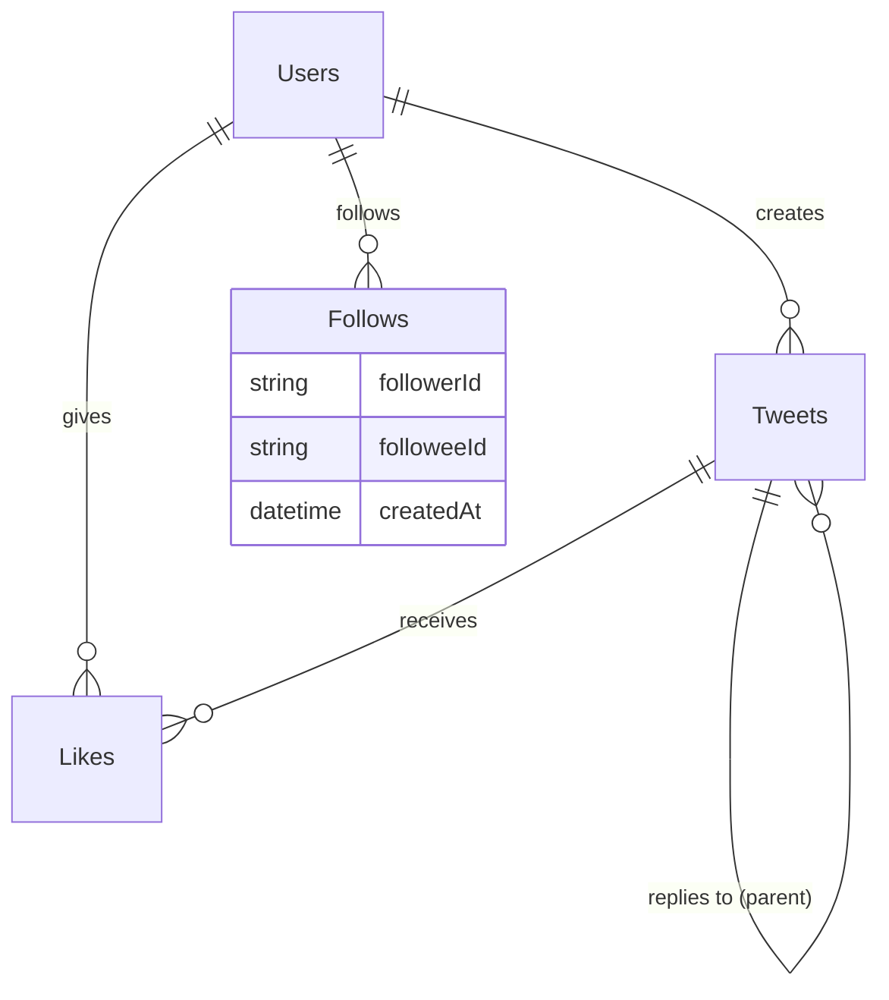

### Tweet CRUD

```
CREATE TWEET:
  POST /tweets
  Body: { "text": "Hello Twitter!", "mediaIds": ["media_123"] }
  Response: 201 Created { "id": "twt_abc", "text": "...", "authorId": "...", "createdAt": "..." }

READ TWEET:
  GET /tweets/twt_abc
  Response: 200 OK { tweet object with author details }

UPDATE TWEET (not allowed on real Twitter — interesting design decision):
  PATCH /tweets/twt_abc
  Body: { "text": "Updated text" }
  Response: 200 OK { updated tweet }

DELETE TWEET:
  DELETE /tweets/twt_abc
  Response: 204 No Content
```

### Timeline API — The Interesting One

```
HOME TIMELINE (posts from people you follow):
  GET /timelines/home
  Query: ?cursor=eyJpZCI6MjB9&limit=20
  Response: paginated tweets from followed users

USER TIMELINE (all posts by a specific user):
  GET /users/usr_123/tweets
  Query: ?cursor=eyJpZCI6NDB9&limit=20
  Response: paginated tweets by that user

SEARCH TIMELINE:
  GET /tweets/search?q=cricket&lang=en&cursor=abc
```

**Timeline uses cursor pagination** — because new tweets are constantly being added. Offset-based would cause duplicates.

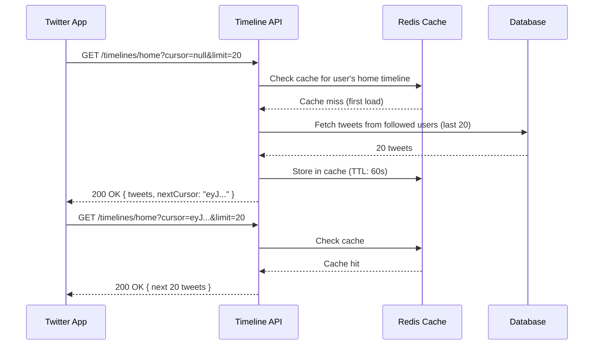

### Follow/Unfollow API

```
FOLLOW A USER:
  POST /users/usr_456/followers
  (Note: You're adding yourself as a follower of usr_456)
  Auth: Required
  Response: 201 Created { "followerId": "usr_me", "followeeId": "usr_456" }

UNFOLLOW A USER:
  DELETE /users/usr_456/followers/usr_me
  Response: 204 No Content

CHECK IF FOLLOWING:
  GET /users/usr_456/followers/usr_me
  Response: 200 OK { "isFollowing": true }
           or 404 Not Found (not following)

GET FOLLOWERS LIST:
  GET /users/usr_456/followers?limit=50&cursor=abc
  Response: paginated list of followers

GET FOLLOWING LIST:
  GET /users/usr_me/following?limit=50&cursor=abc
  Response: paginated list of people I follow
```

### Likes API

```
LIKE A TWEET:
  POST /tweets/twt_abc/likes
  Response: 201 Created
  Note: Idempotent by business logic (can't like twice)

UNLIKE A TWEET:
  DELETE /tweets/twt_abc/likes
  Response: 204 No Content

GET WHO LIKED:
  GET /tweets/twt_abc/likes?limit=20&cursor=xyz
  Response: paginated users who liked
```

### Complete Twitter-like API Reference

```
AUTHENTICATION:
  POST   /auth/register           → Create account
  POST   /auth/login              → Get JWT token
  POST   /auth/logout             → Invalidate token
  POST   /auth/refresh            → Refresh JWT token

USERS:
  GET    /users/me                → My profile
  PATCH  /users/me                → Update my profile
  GET    /users/:userId           → Public profile
  DELETE /users/me                → Delete account

TWEETS:
  POST   /tweets                  → Create tweet
  GET    /tweets/:tweetId         → Get single tweet
  DELETE /tweets/:tweetId         → Delete tweet
  GET    /tweets/:tweetId/replies → Get replies

TIMELINE:
  GET    /timelines/home          → Home feed (people I follow)
  GET    /users/:userId/tweets    → User's timeline

INTERACTIONS:
  POST   /tweets/:tweetId/likes   → Like tweet
  DELETE /tweets/:tweetId/likes   → Unlike tweet
  POST   /tweets/:tweetId/retweets → Retweet
  DELETE /tweets/:tweetId/retweets → Undo retweet

FOLLOW SYSTEM:
  POST   /users/:userId/followers → Follow user
  DELETE /users/:userId/followers/me → Unfollow user
  GET    /users/:userId/followers → List followers
  GET    /users/:userId/following → List following

MEDIA:
  POST   /media                   → Upload photo/video
  GET    /media/:mediaId          → Get media metadata

SEARCH:
  GET    /tweets/search?q=text    → Search tweets
  GET    /users/search?q=name     → Search users
```

---

## 12. Idempotency Keys for Payment APIs

### The Problem with Payments

**Analogy:** Tumne Swiggy par ₹500 ka order place kiya. Payment processing ho rahi thi, network cut gaya. App nahi jaanti — payment success hua ya nahi. Dobara try kiya. Kya ₹1000 debit ho gaye? Yahi problem hai.

In payment systems:
1. Client sends payment request
2. Server processes it
3. Network fails before response reaches client
4. Client doesn't know — success or failure?
5. Client retries — DUPLICATE PAYMENT!

### Idempotency Key Solution

**A unique key sent with every payment request.** Server stores the key + result. If same key comes again, return the stored result — don't process again.

```
POST /payments
Idempotency-Key: idem_7f3a9d2b1c8e4f6a

{
  "amount": 50000,
  "currency": "INR",
  "customerId": "cust_123",
  "orderId": "ord_456",
  "paymentMethod": "upi",
  "upiId": "siddesh@paytm"
}
```

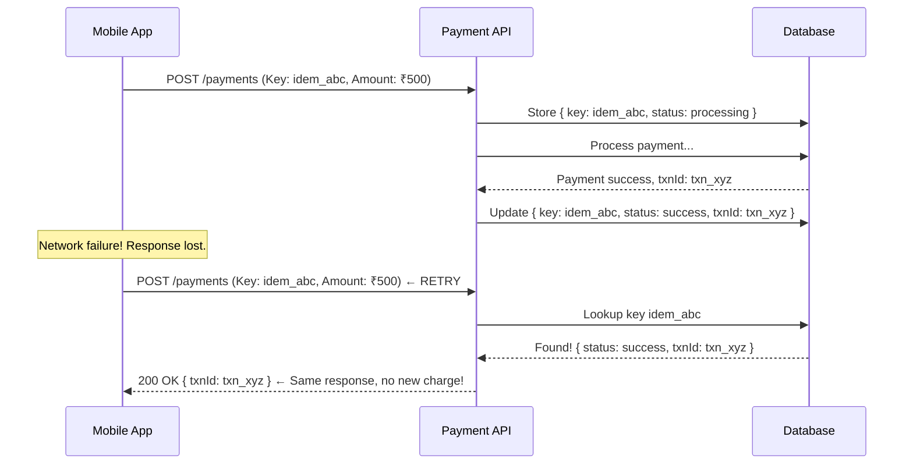

### Idempotency Key Design Rules

```
1. Generate on client side (UUID v4 is perfect):
   "550e8400-e29b-41d4-a716-446655440000"

2. Keys must be unique per operation type:
   Same key for payment ≠ same key for refund

3. Store key + full response for 24-48 hours:
   After expiry, same key = new operation

4. If key exists but still processing → return 202 Accepted:
   { "status": "processing", "checkUrl": "/payments/status/txn_xyz" }

5. Return exact same response for duplicate key:
   Do NOT return "duplicate request" error
   Return the original success/failure response
```

### What Companies Actually Do (Stripe Pattern)

```
First request:
POST /v1/charges
Idempotency-Key: key_123abc
→ 201 Created { charge_id: "ch_abc", amount: 5000, status: "succeeded" }

Duplicate (before expiry):
POST /v1/charges
Idempotency-Key: key_123abc  ← same key
→ 200 OK { charge_id: "ch_abc", amount: 5000, status: "succeeded" }
  Idempotent-Replayed: true  ← header tells you it was a replay

After 24h (expired):
POST /v1/charges
Idempotency-Key: key_123abc
→ 201 Created { charge_id: "ch_NEW", ... }  ← treated as new request
```

> **Interview Tip:** "Payment APIs need idempotency keys because network failures are inevitable. The client generates a UUID, sends it as a header, and the server deduplicates using that key. Stripe and Razorpay both implement this pattern."

---

## 13. Webhooks vs Polling

### The Core Problem

**Analogy:** Tum pizza order karte ho. Ab kya:
- **Polling:** Har 5 minute mein restaurant call karo — "Pizza ready hua kya?" (irritating, wasteful)
- **Webhooks:** Restaurant tumhe call karta hai jab pizza ready ho (efficient, push-based)

### Polling

Client periodically asks the server: "Kuch hua kya?"

```
Timeline:
T+0m:  App → Server: GET /orders/123 → "Preparing"
T+5m:  App → Server: GET /orders/123 → "Preparing"
T+10m: App → Server: GET /orders/123 → "Out for delivery"
T+15m: App → Server: GET /orders/123 → "Delivered"

Total: 4 requests, most wasted
```

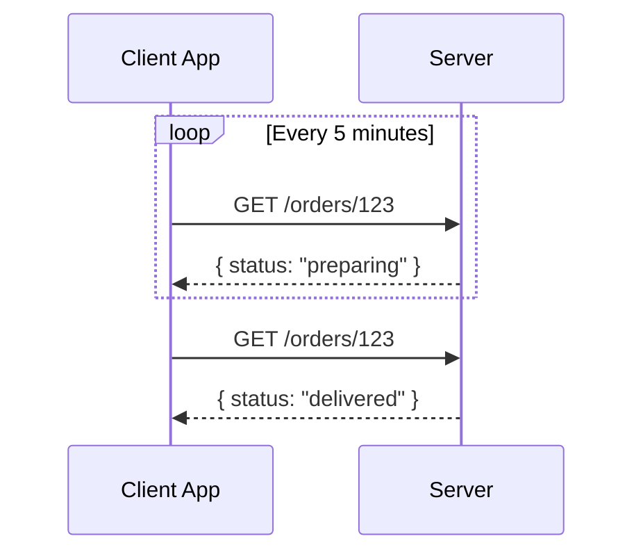

**When Polling Makes Sense:**
- Simple use cases where real-time isn't critical
- Client controls the timing (dashboards refreshed manually)
- Server can't push to client (firewalls, NAT)
- Short-lived operations (status check during checkout)
- Webhook infrastructure is overkill for the use case

**Cons of Polling:**
- Wasteful (most requests return "nothing changed")
- Latency = polling interval (up to 5 min delay)
- Server load increases with poll frequency
- Not scalable for millions of clients

### Webhooks (Push-Based)

Server calls your server when something happens.

```
Setup:
  You register: "When payment succeeds, call https://myapp.com/webhooks/payment"

Flow:
  1. User pays on Stripe
  2. Stripe processes payment (takes 1-2 seconds)
  3. Stripe immediately POSTs to your webhook URL:
     POST https://myapp.com/webhooks/payment
     {
       "event": "payment.succeeded",
       "paymentId": "pay_abc123",
       "amount": 50000,
       "currency": "INR",
       "timestamp": "2026-06-26T10:00:00Z"
     }
  4. Your server handles it: activate subscription, send confirmation email
```

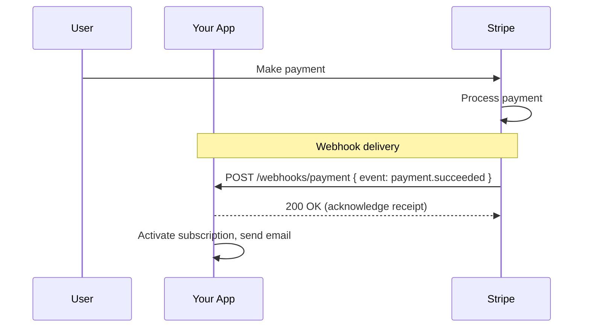

**When Webhooks Make Sense:**
- Async operations that take time (payment processing, video encoding)
- Third-party integrations (Stripe, Razorpay, GitHub, Slack)
- Event-driven architectures
- When you need real-time notification (order status, delivery updates)

**Cons of Webhooks:**
- Your server must be publicly reachable
- You must handle duplicate deliveries (webhooks retry on failure)
- Need to validate webhook signatures (security)
- Hard to test locally (use ngrok or webhook.site)

### Webhook Security — Sign Your Payloads

```python
# Stripe signs webhooks with HMAC-SHA256
import hmac, hashlib

# Stripe sends:
# Stripe-Signature: t=1751025600,v1=abc123...

def verify_stripe_webhook(payload, signature_header, secret):
    timestamp = extract_timestamp(signature_header)  # t=...
    expected_sig = extract_sig(signature_header)      # v1=...

    computed = hmac.new(
        secret.encode(),
        f"{timestamp}.{payload}".encode(),
        hashlib.sha256
    ).hexdigest()

    return hmac.compare_digest(computed, expected_sig)

# If signature doesn't match → REJECT (could be forged)
# If timestamp is >5 minutes old → REJECT (replay attack)
```

### Polling vs Webhooks — Decision Table

| Criteria | Polling | Webhooks |
|----------|---------|---------|
| Latency | High (= poll interval) | Near real-time |
| Server load | High (constant requests) | Low (only on events) |
| Client-side complexity | Low | Medium |
| Requires public URL | No | Yes |
| Works behind firewall | Yes | No |
| Duplicate handling needed | No | Yes |
| Best for | Short operations | Long async operations |
| Examples | Order status check | Payment confirmation, CI/CD builds |

> **Interview Tip:** "GitHub uses webhooks to notify CI/CD systems (like Jenkins) when code is pushed. Polling GitHub every minute would waste thousands of API calls. Webhooks push the event instantly when it happens."

---

## 14. GraphQL vs REST — Trade-offs

### The Problem REST Has

**Analogy:** Swiggy app pe restaurant detail page open kiya. Page mein chahiye: restaurant name, rating, menu items (top 5), delivery time, reviews (latest 3).

With REST:
```
GET /restaurants/123              → Restaurant details
GET /restaurants/123/menu?limit=5 → Menu items
GET /restaurants/123/reviews?limit=3 → Reviews
```

3 separate API calls. Mobile pe network expensive hai. Slow UI.

**Over-fetching:** GET /restaurants/123 returns 50 fields — tumhe sirf 5 chahiye the.
**Under-fetching:** Ek call se poora data nahi aaya, 3 calls karne pade.

### GraphQL Solution

```graphql
query GetRestaurantPage {
  restaurant(id: "123") {
    name
    rating
    deliveryTimeMinutes
    menuItems(limit: 5) {
      name
      price
      isVegetarian
    }
    reviews(limit: 3) {
      rating
      comment
      author { name }
    }
  }
}
```

One request. Exactly the fields you asked for. No over/under-fetching.

```mermaid
graph LR
    subgraph REST
        A1[Mobile App] -->|3 requests| B1[/restaurants/123]
        A1 -->|request 2| B2[/restaurants/123/menu]
        A1 -->|request 3| B3[/restaurants/123/reviews]
    end

    subgraph GraphQL
        A2[Mobile App] -->|1 request| B4[/graphql]
        B4 --> C1[Resolver: restaurant]
        B4 --> C2[Resolver: menuItems]
        B4 --> C3[Resolver: reviews]
    end
```

### REST vs GraphQL Trade-offs

| Aspect | REST | GraphQL |
|--------|------|---------|
| Learning curve | Low | Medium-High |
| Caching | Excellent (URL-based) | Complex (POST, no URL caching) |
| Over-fetching | Common | Solved |
| Under-fetching | Common (N+1 problem) | Solved |
| File uploads | Easy | Needs workarounds |
| Browser testing | Easy (curl, browser) | Needs client |
| Error handling | HTTP status codes | Always 200, errors in body |
| Versioning | URL path / headers | Schema evolution (no versioning needed) |
| Tooling | Mature | Growing |
| Good for | Public APIs, simple CRUD | Mobile apps, complex data graphs |
| Used by | Most of the web | Facebook, GitHub, Shopify |

### When to Choose What

```
Choose REST when:
  - Building a public API (developers expect REST)
  - Simple CRUD operations
  - Caching is critical (CDN, browser cache)
  - Team is familiar with REST
  - Over/under-fetching isn't a problem for your use case

Choose GraphQL when:
  - Multiple clients with different data needs (web vs mobile vs TV)
  - Mobile clients with limited bandwidth
  - Complex, deeply nested data relationships
  - Rapid iteration (add fields without breaking old clients)
  - Single page apps with complex state

Both have their place. Most companies use REST for public APIs,
GraphQL for internal/mobile APIs.
```

> Note: gRPC is covered separately in chapter 31 (Service-to-Service Communication). GraphQL is covered in depth in chapter 31 as well.

---

## 15. Common Interview Questions

### Question 1: "What's the difference between PUT and PATCH?"

**Answer:**
```
PUT replaces the ENTIRE resource.
PATCH updates ONLY the provided fields.

Example: User has { name: "Alice", email: "alice@example.com", age: 25 }

PUT /users/123 { name: "Alice Updated" }
→ Result: { name: "Alice Updated" }  ← email and age are GONE

PATCH /users/123 { name: "Alice Updated" }
→ Result: { name: "Alice Updated", email: "alice@example.com", age: 25 }
← Only name changed, rest preserved

PUT is idempotent. PATCH may or may not be.
```

### Question 2: "What's the difference between 401 and 403?"

**Answer:** "401 means you're not authenticated — the server doesn't know who you are, like trying to enter a building without showing your ID. 403 means you are authenticated — the server knows who you are — but you don't have permission, like knowing who someone is but still not letting them into a restricted area."

### Question 3: "How would you handle API versioning?"

**Answer:** "I'd use URL path versioning — `/api/v1/`, `/api/v2/` — because it's most visible to developers, easy to cache at CDN level, and provides the best developer experience. Header versioning is more REST-pure but harder to test and discover. I'd give at least 12 months deprecation notice before removing an old version, with `Sunset` and `Deprecation` headers on every response."

### Question 4: "Offset vs cursor pagination — when to use which?"

**Answer:** "Offset pagination is simple and lets you jump to any page, but it's unstable — new inserts cause duplicate or missing records in paginated results, and performance degrades at high offsets. Cursor pagination solves both: it's stable regardless of inserts/deletes and performant at any position because it uses an indexed column. I'd use cursor for any real-time feed — Instagram, Twitter, YouTube comments — and offset for static admin reports where jumping to page 50 is needed."

### Question 5: "Why do payment APIs need idempotency keys?"

**Answer:** "Network failures are guaranteed in distributed systems. When a payment request is sent, the client may not receive the response even if the server successfully processed it. Without idempotency, the client retry causes a duplicate charge. The client generates a UUID as an idempotency key, sends it with every payment request. The server stores this key with the result. If the same key comes again — from a retry — it returns the stored result without processing again. Stripe and Razorpay both implement this pattern."

### Question 6: "Design the API for Instagram's post feature"

**Sample Answer:**
```
Create post:
  POST /posts
  Body: { "caption": "Beautiful sunset", "mediaIds": ["media_abc"], "location": "Mumbai" }
  Response: 201 { "id": "post_xyz", "caption": "...", "createdAt": "..." }

Get post:
  GET /posts/post_xyz

Delete post:
  DELETE /posts/post_xyz → 204

Like post:
  POST /posts/post_xyz/likes → 201
  DELETE /posts/post_xyz/likes → 204

Comments:
  GET /posts/post_xyz/comments?cursor=abc&limit=20
  POST /posts/post_xyz/comments { "text": "Beautiful!" }
  DELETE /comments/comment_123

Feed:
  GET /feed/home?cursor=abc&limit=20     → Posts from people I follow
  GET /users/usr_123/posts?cursor=abc    → Posts by specific user
```

### Question 7: "Webhooks vs polling — when would you use each?"

**Answer:** "Polling works when real-time isn't critical, operations are short-lived, or the server can't push (behind NAT/firewall). Webhooks are better for async operations — payment processing, video encoding, CI/CD builds — where you'd waste thousands of poll requests waiting. Webhooks deliver the event the moment it happens. The trade-off: webhooks require your server to be publicly reachable and you must handle duplicates since webhooks retry on failure. Always verify webhook signatures to prevent forged events."

### Question 8: "What are the 6 REST constraints?"

**Answer:** "Client-server separation (decouple UI from data), stateless (every request self-contained), cacheable (responses marked cacheable or not), uniform interface (consistent resource URLs and HTTP methods), layered system (client doesn't know about load balancers and caches in between), and code on demand (optional — server can send executable code)."

### Question 9: "How would you design rate limiting for a public API?"

**Answer:** "Three levels: per IP (prevent DDoS), per API key (per developer limit), and per endpoint (expensive search endpoint gets lower limit). Use standard headers: `X-RateLimit-Limit`, `X-RateLimit-Remaining`, `X-RateLimit-Reset`. Return 429 with `Retry-After` header. Offer tiered limits — free, developer, business, enterprise. Implementation uses Token Bucket or Sliding Window Counter in Redis."

### Question 10: "REST vs GraphQL — which would you choose for a new project?"

**Answer:** "It depends on the use case. For a public API — REST. It's well-understood, caches at CDN level, and developers expect it. For a complex mobile app with multiple client types (iOS, Android, web, TV) fetching different data — GraphQL eliminates over and under-fetching. Netflix uses GraphQL internally for this reason. I'd avoid GraphQL for simple CRUD or small teams — the overhead isn't worth it."

---

## 16. Key Takeaways

```
╔══════════════════════════════════════════════════════════════════╗
║                    API DESIGN — KEY TAKEAWAYS                   ║
╠══════════════════════════════════════════════════════════════════╣
║                                                                  ║
║  FUNDAMENTALS                                                    ║
║  ● API = TV remote. You press buttons, not care about internals  ║
║  ● REST = 6 constraints: Client-Server, Stateless, Cacheable,    ║
║    Uniform Interface, Layered, Code on Demand                    ║
║  ● URLs = nouns (resources), HTTP methods = verbs (actions)      ║
║                                                                  ║
║  HTTP METHODS                                                    ║
║  ● GET (read), POST (create), PUT (replace), PATCH (update),    ║
║    DELETE (remove)                                               ║
║  ● Idempotent: GET, PUT, DELETE. NOT idempotent: POST           ║
║                                                                  ║
║  STATUS CODES (memorize these groups)                            ║
║  ● 2xx = Success: 200 OK, 201 Created, 204 No Content           ║
║  ● 3xx = Redirect: 301 Permanent, 304 Not Modified              ║
║  ● 4xx = Client Error: 400, 401, 403, 404, 409, 422, 429       ║
║  ● 5xx = Server Error: 500, 502, 503, 504                       ║
║  ● 401 = "Who are you?", 403 = "I know you, still NO"          ║
║  ● 502/503/504 = Gateway error trinity                          ║
║                                                                  ║
║  VERSIONING                                                      ║
║  ● Use URL path: /api/v1/ (most practical)                      ║
║  ● Give 12 months deprecation notice                             ║
║  ● Use Sunset + Deprecation headers                              ║
║                                                                  ║
║  PAGINATION                                                      ║
║  ● Offset: simple, jump to any page, unstable with live data    ║
║  ● Cursor: stable, performant, can't jump to page N            ║
║  ● Rule: Social feeds → cursor. Admin reports → offset          ║
║                                                                  ║
║  PAYMENTS                                                        ║
║  ● Always use idempotency keys (UUID per request)               ║
║  ● Server deduplicates: same key = same response, no new charge ║
║                                                                  ║
║  WEBHOOKS                                                        ║
║  ● Push-based: server calls you when something happens          ║
║  ● Always verify signatures (HMAC-SHA256)                       ║
║  ● Always handle duplicates (webhooks retry)                    ║
║                                                                  ║
║  GRAPHQL vs REST                                                 ║
║  ● REST: public APIs, caching, simple CRUD                      ║
║  ● GraphQL: mobile, multiple clients, complex data graphs       ║
║                                                                  ║
║  DESIGN PRINCIPLES                                               ║
║  ● Consistent error format with requestId always                ║
║  ● Envelope pattern: { data: {}, meta: {}, links: {} }         ║
║  ● ISO 8601 dates, string IDs, null over missing fields         ║
║  ● Document with OpenAPI/Swagger                                 ║
║  ● Rate limit with standard headers (X-RateLimit-*)             ║
║                                                                  ║
╚══════════════════════════════════════════════════════════════════╝
```

---

## API Design Checklist

```
Before Launch:
  [ ] Consistent noun-based URL naming
  [ ] Correct HTTP methods for each operation
  [ ] Appropriate status codes (not 200 for everything!)
  [ ] Consistent error response format with requestId
  [ ] Pagination for all collection endpoints
  [ ] API versioned from day one (/api/v1/)
  [ ] Rate limiting with standard headers
  [ ] Authentication/Authorization (JWT/OAuth2)
  [ ] HTTPS enforced everywhere
  [ ] CORS configured correctly
  [ ] Idempotency keys for payment/financial endpoints
  [ ] Webhook signature verification
  [ ] OpenAPI/Swagger documentation
  [ ] Realistic examples in docs
  [ ] Deprecation strategy documented
```

---

## Next Steps

Continue to [Database Design](../08-database-design/README.md) to understand how to design the data layer that powers your APIs.

Also revisit:
- **Chapter 31** — GraphQL and gRPC in depth
- **Chapter 35** — Rate Limiting implementation (Token Bucket, Sliding Window, Redis)

---

*Yeh notes ek complete reference hain API Design ke liye. Interview mein jo bhi poochha jaaye — analogies, real examples, trade-offs — sab yahan covered hai. Best of luck!*
