# CAP Theorem — The Distributed Systems Survival Guide

> "The network is reliable" — the biggest lie in distributed systems.

---

## Table of Contents

1. [The Fundamental Problem — Why This Even Exists](#1-the-fundamental-problem)
2. [What is CAP Theorem?](#2-what-is-cap-theorem)
3. [Why Partition Tolerance is NOT Optional](#3-why-p-is-not-optional)
4. [The Real Choice: CP vs AP](#4-the-real-choice-cp-vs-ap)
5. [Consistency — Deep Dive](#5-consistency-deep-dive)
6. [Availability — Deep Dive](#6-availability-deep-dive)
7. [Partition Tolerance — Deep Dive](#7-partition-tolerance-deep-dive)
8. [CP Systems — Examples and Behavior](#8-cp-systems)
9. [AP Systems — Examples and Behavior](#9-ap-systems)
10. [PACELC — The Extension Nobody Talks About](#10-pacelc-extension)
11. [Real-World Decisions — What Companies Actually Do](#11-real-world-decisions)
12. [How to Answer CAP Questions in Interviews](#12-interview-strategy)
13. [Common Interview Questions](#13-common-interview-questions)
14. [Key Takeaways](#14-key-takeaways)

---

## 1. The Fundamental Problem

### The Analogy First

Imagine you and your friend both work at the same bank branch, but in different rooms. A customer walks into your room and deposits ₹10,000. Now a second customer walks into your friend's room and asks "what is this person's balance?"

If you and your friend can talk to each other — great. Your friend checks, gets the updated balance, answers correctly.

**But what if the phone line between your two rooms is down?**

Your friend has two choices:
- "I can't answer right now — the phone is down, please come back later." (CP — refuse to answer)
- "As per what I know, their balance is ₹X" — possibly stale. (AP — answer with old data)

**This is exactly what distributed systems face. Every. Single. Day.**

---

### Yeh Problem Kyun Aaya?

Early databases — MySQL, PostgreSQL running on a single machine — life was simple. One server, all data in one place. Consistency was free because there was only ONE copy of the data.

Then the internet exploded. Instagram has 2 billion users. YouTube serves videos to every continent. You CANNOT run this on one server. So we distributed the data across multiple servers, multiple data centers, multiple continents.

And the moment you distribute data — you introduce **network** between nodes. And networks fail. Always eventually.

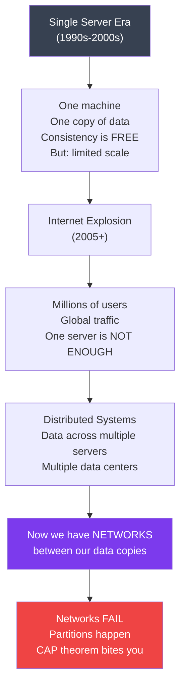

---

### What is a Network Partition?

Simple baat hai — a network partition is when some nodes in your system cannot talk to other nodes. The servers are running fine. They're healthy. But the network cable between data centers got cut. Or a router crashed. Or a cloud provider had a networking blip.

**Real examples of partitions that happened:**
- **AWS us-east-1 outage (2021)** — Kinesis failure caused cascading failures. Netflix, Twitch, Disney+ went down.
- **Facebook outage (2021)** — BGP misconfiguration caused 6-hour worldwide outage. WhatsApp, Instagram, Facebook — sab band.
- **GitHub outage (2018)** — Database replication lag of 1 second caused major consistency issues.
- **Cloudflare outage (2022)** — Network partition in backbone caused 19 data centers to go offline.

**These aren't rare edge cases. They're monthly occurrences at scale.**

```
Causes of Network Partitions:
──────────────────────────────
✗ Physical cable cut (it literally happens — construction workers, etc.)
✗ Network switch failure
✗ Router misconfiguration (BGP route leak)
✗ Firewall rule gone wrong
✗ Data center power failure
✗ Cloud provider networking blip
✗ Overloaded network causing packet drops / timeouts
✗ Software bugs in network stack
✗ DDoS attacks saturating links
✗ Asymmetric routing (A can reach B, but B can't reach A)
```

---

## 2. What is CAP Theorem?

### The Theorem

Eric Brewer presented this at PODC 2000. Gilbert and Lynch formally proved it in 2002.

**In any distributed system, you can guarantee at most 2 of these 3 properties simultaneously:**

| Property | Symbol | What it means |
|---|---|---|
| **Consistency** | C | Every read returns the most recent write, or an error |
| **Availability** | A | Every request gets a response (not an error), even if the data might be stale |
| **Partition Tolerance** | P | The system keeps operating even when network partitions occur |

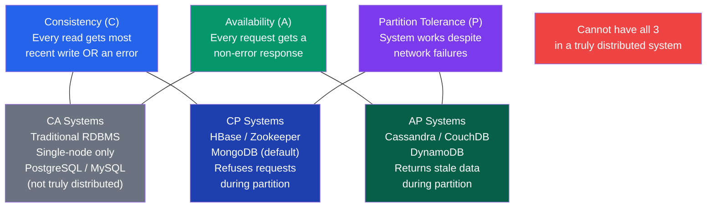

---

### The Triangle Intuition

Think of CAP like a triangle. You can stand on any two corners, but not all three at once.

- **CA corner** — Consistent and Available. But if network splits, you're toast. This is only possible on single-node systems — which aren't really "distributed."
- **CP corner** — Consistent and Partition-tolerant. During a split, you refuse to answer rather than give wrong data.
- **AP corner** — Available and Partition-tolerant. During a split, you answer but data might be stale.

---

## 3. Why P is NOT Optional

### The Brutal Truth

Here's something many tutorials gloss over: **Partition Tolerance is NOT a choice. It's a requirement.**

Why? Because in a distributed system, partitions WILL happen. It's not "if" — it's "when."

So saying "I'll build a CA system (no partition tolerance)" in a distributed context is like saying "I'll build a house with no roof — it never rains in my city." One day it will rain.

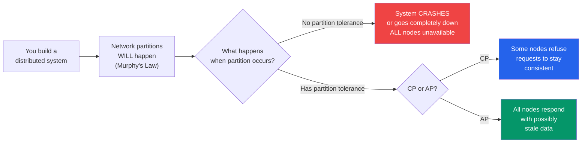

**So the real and only meaningful choice is: CP or AP.**

CA as a category only makes sense for single-node databases (PostgreSQL, MySQL on one machine) — and those aren't distributed systems. In the real world of distributed systems, P is always assumed.

---

### The Math Behind Why P is Non-Negotiable

If you have N nodes, the probability that ALL of them are perfectly reachable at any given moment decreases exponentially with N.

```
If single node has 99.9% uptime (pretty good):
- 2 nodes perfectly connected: 99.9% × 99.9% = 99.8%
- 5 nodes perfectly connected: 99.9%^5 = 99.5%
- 10 nodes perfectly connected: 99.9%^10 = 99.0%
- 100 nodes perfectly connected: 99.9%^100 = 90.5%

Translation: With 100 nodes, you'd expect network issues ~10% of the time.
At scale, "network always works" is simply false.
```

---

## 4. The Real Choice: CP vs AP

So the actual decision you make as a system designer is:

**When a network partition happens, what should my system do?**

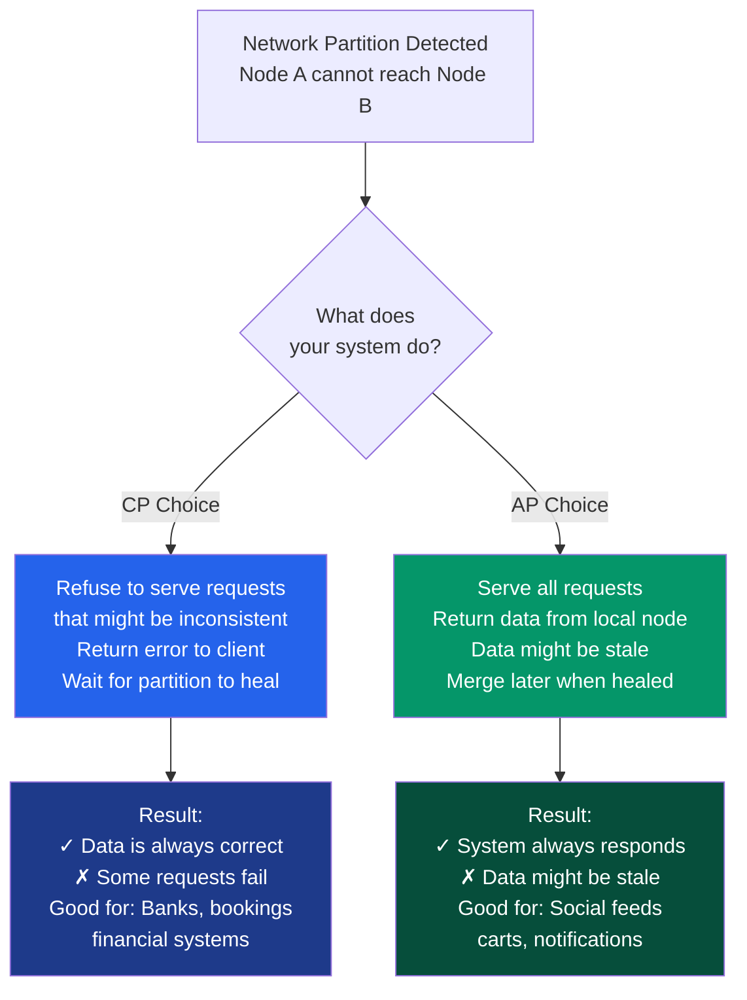

| | CP (Consistency + Partition Tolerance) | AP (Availability + Partition Tolerance) |
|---|---|---|
| **During partition** | Refuses requests to maintain consistency | Serves requests with potentially stale data |
| **User experience** | "Service temporarily unavailable" | "Here's the data (might be slightly old)" |
| **Data correctness** | Always correct | Eventually correct |
| **Use cases** | Financial, medical, config coordination | Social, caching, shopping carts, DNS |
| **Examples** | HBase, Zookeeper, MongoDB (default) | Cassandra, DynamoDB, CouchDB |

---

## 5. Consistency — Deep Dive

### The Analogy

You walk to an ATM and check your balance — ₹50,000. You then walk across the street to another ATM and check again. The second ATM shows ₹50,000 too.

Now imagine your sister transferred ₹10,000 FROM your account while you were walking between ATMs. The first ATM showed ₹50,000 (before transfer). The second ATM should show ₹40,000.

**A consistent system guarantees: the second ATM EITHER shows ₹40,000 (correct) OR says "I can't answer right now" (error). It will NEVER show ₹50,000 if it knows about the transfer.**

### What Consistency Actually Means

In CAP theorem, consistency has a specific technical meaning (called **linearizability**):

> Every read operation returns either the result of the most recent completed write, or an error.

This is NOT the same as ACID consistency (which is about data constraints/integrity). CAP consistency is about **recency** — are you seeing the latest data?

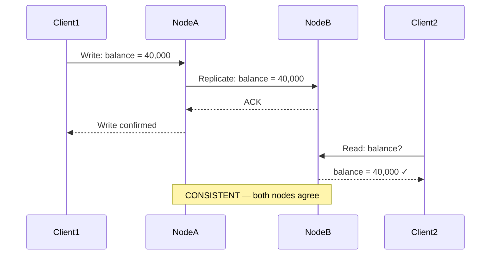

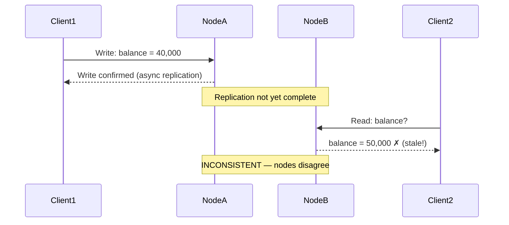

### Types of Consistency (From Strongest to Weakest)

```
Linearizability (Strongest)
────────────────────────────
Operations appear instantaneous. Once a write completes, ALL subsequent
reads from ANY node see that write.
Cost: High latency (need synchronous replication + coordination)
Used by: Zookeeper, etcd, Google Spanner

Sequential Consistency
───────────────────────
All nodes see operations in the same order, but not necessarily
in real-time order.
Less strict than linearizability but still strong.

Causal Consistency
──────────────────
If operation A causally affects operation B, all nodes see A before B.
Instagram comment example: If you reply to a comment, your reply appears
after the original comment.

Eventual Consistency (Weakest)
───────────────────────────────
Given no new updates, all nodes will eventually converge to the same value.
"Eventually" can mean milliseconds or seconds.
Used by: Cassandra, DynamoDB, DNS
```

### Real-World Consistency Needs

**Banking — Why CP is non-negotiable:**
```
Scenario: You have ₹1,000 in your account.
You make two ATM withdrawals simultaneously from two ATMs.

Without consistency:
- ATM 1 checks: ₹1,000 available → dispenses ₹1,000
- ATM 2 checks: ₹1,000 available (stale data!) → dispenses ₹1,000
- You now have ₹2,000 but only had ₹1,000

Banks use distributed locking / Two-Phase Commit / Paxos to prevent this.
They WILL refuse you rather than give you someone else's money.
```

**Interview Tip:** When asked about consistency, say "consistency in CAP means linearizability — every read sees the most recent write or gets an error. This is different from ACID consistency which is about data constraints."

---

## 6. Availability — Deep Dive

### The Analogy

You're driving through Rajasthan — no network. You open Google Maps. Does Google Maps crash? No! It shows you the cached map it downloaded earlier. It's not live traffic data. It's not the latest road construction. But it RESPONDS. It gives you something useful.

That's availability — the system always responds, even if it can't guarantee the freshest data.

### What Availability Actually Means

> Every request receives a response — not an error.

Note: "Response" includes responses with potentially stale data. What availability does NOT include is timeouts or errors like "503 Service Unavailable."

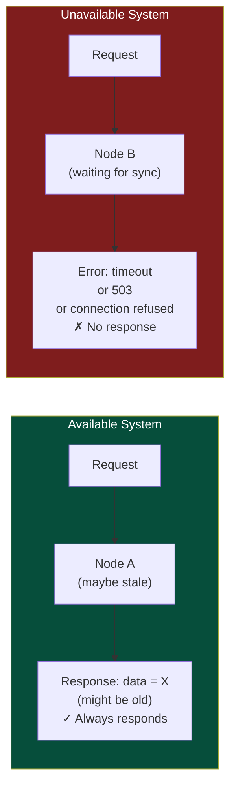

### Availability vs Uptime

People confuse these. Uptime is about the server being ON. Availability (in CAP) is about EVERY request getting a non-error response.

```
Uptime: Your server is running 100% of the time.
But: If network splits and your CP system refuses requests — uptime = 100%, availability = 0%.

Availability (CAP): Every single request gets back a non-error response.
Even if the server is running, if it refuses requests during partition → NOT available.
```

### The AP Bargain

When you choose AP, you're saying: "I'd rather show you slightly old data than show you an error page." This is often the right call for user experience.

**Examples where AP is the right call:**

| System | AP Behavior | Why Acceptable |
|---|---|---|
| Instagram feed | Shows posts from 30 seconds ago | You won't notice 30-second lag in a feed |
| Swiggy menu | Shows yesterday's menu prices | Price might be off by ₹5, acceptable |
| YouTube view count | Shows approximate count | Exact number doesn't matter |
| Netflix recommendations | Shows last computed recommendations | Fine to be a few minutes old |
| Google Search | May not have indexed the latest page | Users don't expect millisecond freshness |

**Interview Tip:** When asked "what does availability mean in CAP?" say: "Every request gets a non-error response, even if the data returned is slightly stale. It's the opposite of the system refusing requests during failures."

---

## 7. Partition Tolerance — Deep Dive

### The Analogy

Imagine a company with two offices — one in Mumbai, one in Delhi. Normally they communicate by phone. Now the phone lines go down. Both offices still work — they serve their local customers, make local decisions, do local work. They're not in sync, but they're FUNCTIONING.

When phone lines come back, they compare notes and reconcile differences.

**That's partition tolerance — each part of the system keeps working even when it can't talk to the other parts.**

### What Happens During a Partition?

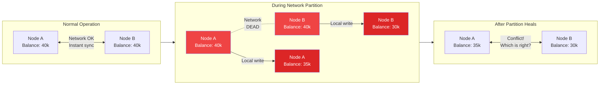

### CP vs AP Behavior During Partition — Step by Step

**CP System (e.g., Zookeeper, HBase) during partition:**

```
Step 1: Network partition detected between Node A and Node B
Step 2: Client sends write request to Node A
Step 3: Node A tries to coordinate with Node B (quorum write)
Step 4: Node B unreachable — cannot achieve quorum
Step 5: Node A REFUSES the write → returns error to client
Step 6: Client sees: "Write failed, please try again"
Step 7: Data remains consistent (no divergence between nodes)
Step 8: When partition heals → system resumes normal operation
```

**AP System (e.g., Cassandra, DynamoDB) during partition:**

```
Step 1: Network partition detected between Node A and Node B
Step 2: Client sends write request to Node A
Step 3: Node A accepts the write locally → confirms to client
Step 4: Node B also accepts writes from its local clients
Step 5: Now A and B have diverged — different data
Step 6: Client sees: "Write successful" ✓
Step 7: When partition heals → conflict resolution kicks in
         (last-write-wins, vector clocks, CRDTs, etc.)
Step 8: System eventually converges to consistent state
```

---

## 8. CP Systems

### What CP Systems Do

CP systems say: **"I will NEVER give you wrong data. If I'm not sure my data is current, I'll refuse to answer."**

They achieve this by requiring a **quorum** — a majority of nodes must agree before any read or write is confirmed.

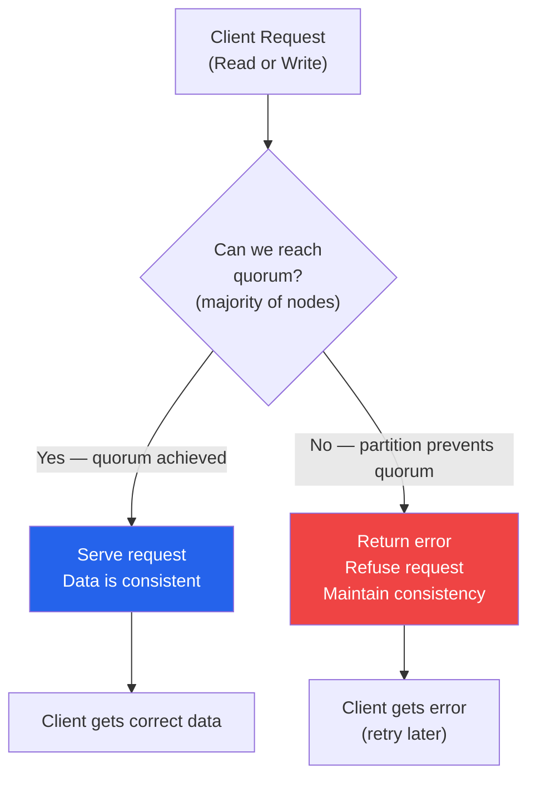

### CP Systems in the Wild

#### Zookeeper — The Config Coordinator

Zookeeper is used by Kafka, Hadoop, HBase for distributed coordination — leader election, configuration, distributed locks.

**Why CP?** Because if you're electing a leader and two nodes disagree on who the leader is — you get split-brain. Two leaders doing conflicting work. Catastrophic. Better to refuse any operation than have two "leaders."

```
Zookeeper setup: 5 nodes (quorum = 3)

Normal operation:
All 5 nodes agree → reads/writes work fine

Partition: 2 nodes separated from 3
├── Group of 3: Can achieve quorum → still works
└── Group of 2: Cannot achieve quorum → refuses all writes

Result: Group of 2 is "unavailable" — returns errors.
But data is NEVER inconsistent.
```

#### HBase — The Financial Database

Used by: Facebook (formerly), financial institutions, telcos

```
HBase uses HDFS underneath and ZooKeeper for coordination.
Write path:
1. Write to WAL (Write-Ahead Log) on primary node
2. WAL must be flushed/replicated before ACK
3. If region server loses contact with ZooKeeper → stops serving
4. Rather go offline than serve inconsistent data

Use case: Telco billing records, Facebook messages (historical)
```

#### MongoDB — The Configurable One

MongoDB in its default configuration is CP. Here's why:

```
MongoDB Replica Set (3 nodes: 1 primary, 2 secondaries)

Write (default writeConcern: majority):
1. Write hits primary
2. Primary replicates to majority (at least 1 secondary)
3. Only then confirms to client

If primary loses contact with secondaries:
→ Primary steps down (can't confirm it's still primary)
→ Secondaries elect a new primary (if quorum achievable)
→ Old primary refuses writes (to prevent split-brain)

Result: During partition, some nodes refuse writes. CP behavior.
```

#### etcd — Kubernetes' Brain

etcd stores all Kubernetes cluster state — pod configs, service definitions, secrets.

```
If etcd became AP:
- One node thinks Pod X should run on Server A
- Another node thinks Pod X should run on Server B
- You'd get two copies of a critical pod, or none
- Kubernetes cluster goes haywire

etcd uses Raft consensus — majority must agree on every write.
During partition of a 5-node cluster:
- Majority partition (3 nodes): Works fine
- Minority partition (2 nodes): Read-only or unavailable
```

### When to Choose CP

Choose CP when the cost of wrong data is higher than the cost of unavailability:

- **Financial transactions** — double-spend, wrong balance = legal/financial disaster
- **Distributed locks** — two nodes thinking they hold the same lock = data corruption
- **Leader election** — two leaders = split-brain = chaos
- **Inventory with hard limits** — airline seats, concert tickets (can't oversell)
- **Medical records** — wrong drug dosage data could kill someone
- **Configuration management** — wrong config deployed to 10,000 servers

---

## 9. AP Systems

### What AP Systems Do

AP systems say: **"I will ALWAYS respond to you. If I don't have the latest data, I'll give you what I have and sync up later."**

They achieve this by accepting writes locally and replicating asynchronously.

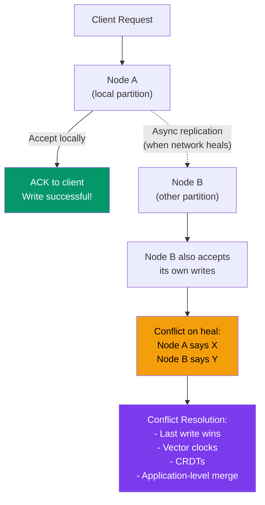

### AP Systems in the Wild

#### Cassandra — The Always-On Beast

Cassandra is designed for massive write throughput with no single point of failure. Used by: Netflix, Instagram, Uber, Apple.

```
Cassandra's "tunable consistency":
- Write with consistency level ONE: write to 1 node → instant ACK
- Write with consistency level QUORUM: write to majority → slower but safer
- Write with consistency level ALL: write to all nodes → slowest, most consistent

Default: eventual consistency (AP behavior)

During partition:
- Both sides accept writes
- Each node timestamps writes
- On heal: "Last Write Wins" (LWW) resolves conflicts
- Netflix uses this for user activity tracking, viewing history

Real stat: Netflix uses Cassandra for 2.5+ trillion requests per day
```

#### DynamoDB — Amazon's AP Workhorse

DynamoDB (Amazon's internal Dynamo design, the public DynamoDB service) is what powers Amazon's shopping cart and most of AWS's backend.

```
DynamoDB's consistency modes:
- Eventually Consistent Reads (default): Fast, may be 1-2 seconds stale
- Strongly Consistent Reads: Slower, always current
- Transactional Reads: CP-like behavior (uses extra resources)

Shopping Cart example (AP):
User in Mumbai partition:
→ Adds Airpods to cart → local write, instant ACK

User in Delhi partition (same user on another device):
→ Adds MacBook to cart → local write, instant ACK

On heal: Cart merges — both Airpods and MacBook in cart
(Amazon's conflict resolution: merge strategy, not last-write-wins)
```

#### CouchDB — Designed for Disconnection

CouchDB was built for mobile sync scenarios — where devices go offline frequently.

```
CouchDB model:
- Each document has a revision tree
- Writes always succeed (even offline)
- On sync: revisions are merged, conflicts flagged for application resolution
- Used in PouchDB (browser) + CouchDB (server) sync

Classic use case: Field workers in remote areas
- Doctor records patient info offline (no internet)
- Syncs to central CouchDB when back in range
- Conflicts resolved by application logic
```

#### DNS — The OG AP System

DNS is the most widely deployed AP system in the world. You type `google.com`, DNS returns an IP. But:

```
DNS AP behavior:
- Updates propagate with TTL (Time To Live) delays
- Different DNS resolvers might return different IPs
- Your ISP's DNS might cache the old IP for hours
- This is INTENTIONAL — availability > consistency

When Google changes their IP:
- New IP propagates across DNS servers over 24-48 hours
- During propagation: some users hit old IP, some hit new IP
- System keeps working (AP) even though it's inconsistent

Nobody wants DNS to go down because it's checking if every server
agrees on an IP address. That would break the whole internet.
```

### When to Choose AP

Choose AP when availability is more important than perfect consistency, and stale data is tolerable:

- **Social media feeds** — 30-second-old feed is fine
- **Product recommendations** — slightly old recommendations are fine
- **Like/view counts** — 1000 vs 1001 likes — nobody cares
- **Shopping carts** — better to show cart than error (handle conflicts on checkout)
- **Notification systems** — if you get a notification 5 seconds late, that's okay
- **DNS** — availability of the entire internet > perfect consistency
- **Caching layers** — caches are AP by definition
- **User presence** (online/offline status) — slight lag is acceptable

---

## 10. PACELC Extension

### Why CAP is Incomplete

CAP theorem only talks about what happens DURING a network partition. But what about the rest of the time — when everything is normal?

Even without partitions, there's a fundamental tradeoff: **Latency vs Consistency.**

This is the **PACELC** theorem (Daniel Abadi, 2012):

```
If there's a Partition:
    you choose between Availability and Consistency
Else (normal operation):
    you choose between Latency and Consistency
```

**P → A or C, E → L or C**

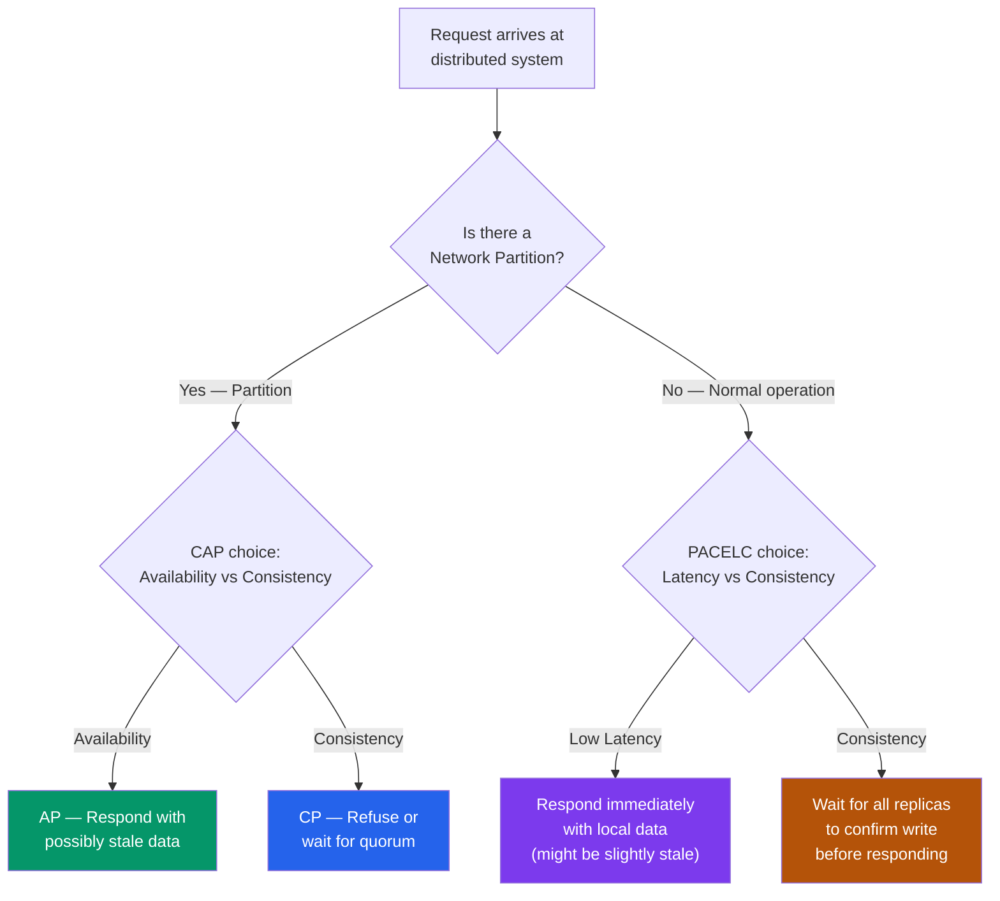

### PACELC Classifications

| System | Partition behavior | Normal behavior | Classification |
|---|---|---|---|
| DynamoDB | Availability | Latency | PA/EL |
| Cassandra | Availability | Latency | PA/EL |
| MongoDB | Consistency | Consistency | PC/EC |
| HBase | Consistency | Consistency | PC/EC |
| Zookeeper | Consistency | Consistency | PC/EC |
| MySQL (cluster) | Consistency | Consistency | PC/EC |
| Amazon Dynamo | Availability | Latency | PA/EL |
| PNUTS (Yahoo) | Availability | Latency | PA/EL |

### Why Latency-Consistency Tradeoff Matters

The analogy: you're writing a WhatsApp message. You hit send.

**High Consistency (EC) path:**
```
Your phone → WhatsApp server A
→ Wait for server B (in another region) to confirm
→ Wait for server C (another region) to confirm
→ All confirmed → show "sent" tick
→ Time: 300-500ms per message (noticeable lag!)
```

**Low Latency (EL) path:**
```
Your phone → WhatsApp server A (nearest)
→ Immediately show "sent" tick
→ Asynchronously replicate to B, C
→ Time: 20-50ms
→ Occasionally, if A crashes before replication: message lost
```

WhatsApp (and most messaging apps) chose EL — low latency, with eventual consistency. That's why you sometimes see one tick (sent) but the message wasn't actually delivered.

### Tunable Consistency — The Best of Both Worlds?

Cassandra and DynamoDB let you tune consistency per operation:

```
Cassandra read/write consistency levels:
────────────────────────────────────────
ONE:    Contact 1 replica. Fastest. Least consistent.
TWO:    Contact 2 replicas. Faster. Less consistent.
QUORUM: Contact majority. Balanced. Eventually consistent.
LOCAL_QUORUM: Quorum within local datacenter. Low latency + decent consistency.
ALL:    Contact all replicas. Slowest. Most consistent.
EACH_QUORUM: Quorum in each datacenter.

The sweet spot for many systems: LOCAL_QUORUM
- Fast (uses local datacenter)
- Consistent within local datacenter
- Accepts writes even if remote datacenter is partitioned
```

---

## 11. Real-World Decisions

### Banking and Financial Systems — Always CP

**Why:** Wrong balance shown = regulatory violation, potential fraud, user harm.

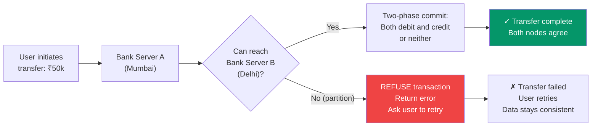

Systems: Core banking uses CP databases. SWIFT transactions. Stock exchange order books.

**The cost they pay:** During the 2021 AWS outage, many bank apps showed errors. Users couldn't transfer money for hours. But no one's balance was wrong. They chose CP correctly.

---

### Social Media — AP All the Way

**Instagram likes count:**

```
You post a photo. 10 million people like it.

CP approach:
- Every like requires all datacenter agreement
- Like operation: 500ms+ latency
- If datacenter partitioned: like operation fails
- Users see errors trying to like posts
- Instagram is unusable during any network hiccup

AP approach (what Instagram actually does):
- Like hits nearest datacenter → instant ACK
- Count propagates asynchronously
- Your like counter might show 9,999,998 instead of 10,000,000
- Nobody notices. Nobody cares.
- Instagram works perfectly even with network issues.
```

**Yeh kyun important hai:** Instagram handles 100 million+ interactions per day. Even a 1% failure rate means 1 million failed likes per day. AP is the only viable choice.

---

### Swiggy / Zomato — Restaurant Menu (AP) vs Payment (CP)

Swiggy is a great example of using different CAP choices for different parts of the same system:

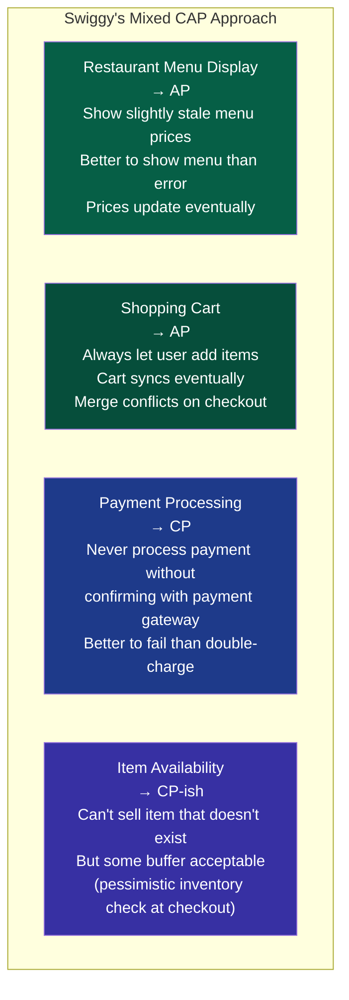

**Interview gem:** "Different parts of the same system can have different CAP choices. The menu display can be AP, but payment processing must be CP."

---

### Online Shopping — Cart vs Checkout vs Inventory

**Shopping cart (AP):**
```
Amazon's cart philosophy (famously AP):
- Cart must ALWAYS be addable-to
- If you can't add to cart → you leave the site
- Stale cart data costs less than cart unavailability
- Conflicts resolved at checkout (merge, deduplicate)
```

**Checkout / Payment (CP):**
```
At checkout:
- Must verify items still available
- Must atomically charge card and confirm order
- CP operation — cannot have partial checkout
- Better to show "payment failed, try again" than double-charge
```

**Inventory (depends on business):**
```
Hard inventory (flights, concert tickets, limited editions):
→ CP. Never oversell. User gets error if seat taken.

Soft inventory (Amazon physical products):
→ AP-ish. Occasionally oversell by 1-2 units.
→ Amazon just cancels order and apologizes.
→ Cost of cancellation << cost of inventory system going down.

This is a business decision, not a technical one.
```

---

### Flight Booking vs Movie Tickets vs Hotel Rooms

| System | CAP Choice | Reason | Behavior on conflict |
|---|---|---|---|
| Flight booking | CP | Can't oversell seat — safety/legal issues | Hard error: "seat taken" |
| Movie tickets | CP | Seat assignments must be exact | Hard error: pick another seat |
| Hotel booking | CP-ish | Overbooking sometimes done intentionally | Walk the customer (embarrassing but done) |
| Bus booking (Redbus) | AP with reconciliation | High volume, some overbooking acceptable | Upgrade/cancel/refund |
| Ride sharing (Ola, Uber) | AP | Driver assignment can be stale | Re-assign driver if conflict |

---

### YouTube View Counts — The Classic AP Example

YouTube view counts are eventually consistent. Here's the actual pipeline:

```
User watches video:
→ View event hits nearest Google data center
→ Acknowledged immediately (AP)
→ Batched with millions of other view events
→ Processed by Dataflow/BigQuery pipeline (seconds-minutes later)
→ View count updated

Result:
- View count you see might be 5-10 minutes old
- During viral moments, count can lag significantly
- YouTube shows "1.2M views" when actual count might be 1.25M
- Nobody cares. Video is still popular. AP is correct choice.

Cost of CP for view counts:
- Every view requires global consensus
- 500ms+ per view operation
- YouTube would be unusable
```

---

### WhatsApp Message Delivery — Complex AP

```
Message flow:
1. You send message → hits nearest WhatsApp server
2. Server ACKs (one tick ✓) — AP, local ACK
3. Message delivered to recipient's device
4. Two ticks (✓✓) — recipient's device ACKed
5. Blue ticks — recipient read it

During partition:
- Your message is stored on WhatsApp server
- If recipient's region is partitioned, message waits
- When partition heals, message delivers
- This is AP — system always accepts your message, delivers when possible

WhatsApp doesn't do CP (refuse to accept message if can't immediately deliver)
because that would break user experience completely.
```

---

## 12. Interview Strategy

### The Framework: Business First, Technology Second

In a system design interview, when CAP comes up, NEVER jump straight to "we'll use Cassandra (AP)" or "we'll use Zookeeper (CP)." Instead, follow this framework:

```
Step 1: Understand the business requirement
"What does the business actually need? What's the cost of each failure mode?"

Step 2: Identify failure modes
"If we show stale data, what happens? Lost revenue? Safety issue? Just annoying?"
"If we go unavailable, what happens? Users can't work? Business loses money?"

Step 3: Make the CP vs AP call
"Given that network partitions WILL happen, and we must choose..."

Step 4: Name the technology
"Therefore we'd use X (CP) or Y (AP) because..."

Step 5: Mention PACELC if relevant
"Even without partitions, consistency-latency tradeoff matters for..."
```

### The Decision Tree

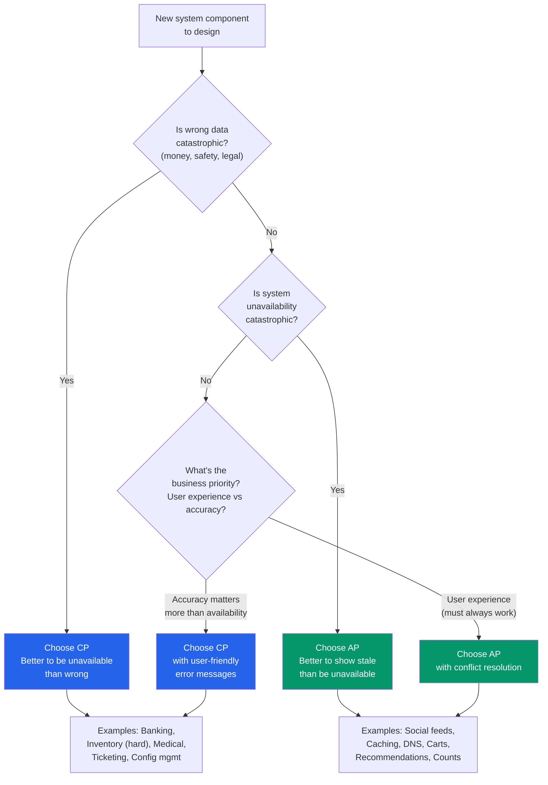

### Quick Reference for Common Interview Scenarios

| Scenario | CP or AP | Key reasoning |
|---|---|---|
| Bank account balance | CP | Wrong balance = financial/legal disaster |
| Distributed lock / mutex | CP | Two holders = data corruption |
| Leader election (Kafka, etc.) | CP | Split-brain = catastrophe |
| User authentication | CP-leaning | Security critical, but some systems cache auth |
| E-commerce inventory (flights) | CP | Cannot oversell hard-limited items |
| Shopping cart | AP | Must always work, conflicts resolved at checkout |
| Social media like count | AP | ±1 count is meaningless |
| News feed / timeline | AP | Slightly stale feed is acceptable |
| DNS | AP | Internet availability > DNS consistency |
| Config management (etcd) | CP | Wrong config on 10k servers = disaster |
| Product catalog / prices | AP-ish | Slight staleness acceptable, update eventually |
| Payment processing | CP | Cannot double-charge or miss a charge |
| Notification delivery | AP | Slightly delayed notification is fine |
| Healthcare records | CP | Wrong data could harm patients |
| Ride assignment (Uber/Ola) | AP | Can re-assign if conflict, must stay available |
| Swiggy restaurant menu | AP | Show cached menu, refresh eventually |
| Cricket score update | AP | 1-ball delay is fine, availability critical |

---

### How to Phrase CP/AP Decisions in Interviews

**For CP:**
> "For [component X], correctness is paramount. If there's a network partition, we'd rather return an error and let the user retry than risk serving stale or conflicting data. The cost of incorrect data — [financial loss / safety risk / legal violation] — far outweighs the cost of temporary unavailability. We'd use [HBase/Zookeeper/MongoDB with majority write concern] which provides linearizable reads and writes."

**For AP:**
> "For [component X], availability is paramount. Users expect the system to always respond. If there's a network partition, we'll serve data from the available node even if it might be slightly stale. The staleness window is bounded at [X seconds/minutes], and the business impact of stale data — [showing slightly old like count / slightly old menu price] — is negligible compared to the system going down. We'd use [Cassandra/DynamoDB] with eventual consistency and implement [last-write-wins / CRDT / application merge] for conflict resolution."

---

## 13. Common Interview Questions

### Q1: Explain CAP theorem in simple terms.

**Answer framework:**
In distributed systems, network failures (partitions) are inevitable. CAP theorem says you must choose how your system behaves during these failures: either stay consistent (refuse requests to avoid wrong data) or stay available (respond with possibly stale data). You can't do both simultaneously during a partition. So the real choice is CP vs AP.

---

### Q2: "Can I build a CA system?" (Classic trick question)

**Answer:**
CA means sacrificing partition tolerance. In a truly distributed system — multiple machines communicating over a network — partitions WILL happen. A CA system would simply crash or become completely unavailable during any network issue, which is worse than either CP or AP. CA is only meaningful for single-node databases, which aren't distributed systems in the CAP sense. In practice, you must choose CP or AP.

---

### Q3: Design a distributed counter (like YouTube views). What's your CAP choice?

**Answer:**
AP. View counts don't need to be exact in real-time. We can use:
- A Cassandra counter column (AP) — distributed counters with eventual consistency
- Or a Redis-based approach with periodic flush to persistent storage
- Or a streaming pipeline (Kafka → Flink/Spark) that batches view events

The tradeoff: count might lag by seconds/minutes during high load. Acceptable.

---

### Q4: Design a distributed payment system. CP or AP?

**Answer:**
CP. Payments must be idempotent and consistent. We can't double-charge or miss a charge. Implementation:
- Use a SQL database with strong consistency (ACID transactions)
- Idempotency keys to handle retries safely
- Two-phase commit (or Saga pattern) for distributed transactions
- Circuit breakers: if payment gateway unreachable, fail the transaction gracefully rather than process in inconsistent state

---

### Q5: What's PACELC and why does it matter?

**Answer:**
CAP only describes behavior during partitions. PACELC adds: even during normal operation (no partition), there's a tradeoff between latency and consistency. If you want all replicas to confirm every write (consistency), writes are slower (higher latency). If you want fast responses (low latency), you reply before all replicas confirm (eventual consistency). Cassandra and DynamoDB let you tune this per-operation. This matters because most of the time there's NO partition — the latency/consistency tradeoff affects every single request.

---

### Q6: Instagram uses Cassandra. Why? What are the trade-offs?

**Answer:**
Cassandra is AP with tunable consistency. Instagram chose it because:
- Massive write throughput (100M+ interactions/day)
- Geographic distribution (users on every continent)
- High availability is critical (any downtime = revenue loss)

Trade-offs they accept:
- Like counts might be slightly stale (acceptable)
- During partition, writes might diverge (resolved by LWW or application logic)
- No multi-row ACID transactions (application handles this)

They complement Cassandra with CP systems where needed (PostgreSQL for user account data, ZooKeeper for coordination).

---

### Q7: How does DynamoDB achieve high availability?

**Answer:**
DynamoDB uses a modified Dynamo (Amazon's internal paper) design:
- Data is partitioned across multiple nodes using consistent hashing
- Each item is replicated to 3 nodes
- Writes succeed with at least 1 node ACK (eventually consistent) or majority (strongly consistent — user's choice)
- During partition, each side accepts writes independently
- On heal, vector clocks or last-write-wins resolves conflicts
- This gives ~99.999% availability SLA

---

### Q8: How do CP systems handle partitions without losing data?

**Answer:**
CP systems use consensus algorithms — Paxos or Raft — to ensure majority agreement before confirming writes.

With 5 nodes and Raft:
- A write is committed only when majority (3+) nodes have it in their log
- During partition of 2+3 nodes: the 3-node group can still commit writes (quorum), the 2-node group cannot
- No data is lost because the 2-node group doesn't accept writes
- When partition heals, 2-node group catches up from the 3-node group

---

### Q9: What is eventual consistency and how does it work?

**Answer:**
Eventual consistency guarantees that if no new updates are made, all nodes will eventually converge to the same value. "Eventually" is typically milliseconds to seconds in modern systems.

Mechanism in Cassandra:
1. Write goes to coordinator node
2. Coordinator writes to N replica nodes (based on replication factor)
3. With consistency level ONE: waits for 1 ACK, returns to client
4. Remaining replicas apply write asynchronously
5. Anti-entropy (Merkle trees) and read repair ensure convergence
6. Hinted handoff: if a node is down, coordinator stores the write as a "hint" and delivers when node comes back

---

### Q10: How do you handle conflicts in AP systems?

**Answer:**
Several strategies:

1. **Last Write Wins (LWW):** Use timestamps. Newer timestamp wins. Simple but can lose data.
2. **Vector Clocks:** Track causality. If A → B → C is the causal chain, detect when two writes are concurrent (no causal relationship) and flag as conflict.
3. **CRDTs (Conflict-free Replicated Data Types):** Math-based data structures where merging always produces a deterministic result. Great for counters, sets, lists.
   - Counter CRDT: Each node increments its own counter; merge = sum all nodes' counts. No conflict.
   - OR-Set CRDT: Track adds and removes separately; merge = union of adds minus union of removes.
4. **Application-level merge:** Shopping cart example — merge all items from both carts (union). Some items might be duplicated, deduplicate on display.

---

## 14. Key Takeaways

```
╔══════════════════════════════════════════════════════════════════════╗
║                     CAP THEOREM — KEY TAKEAWAYS                      ║
╠══════════════════════════════════════════════════════════════════════╣
║                                                                        ║
║  1. PARTITIONS ARE INEVITABLE                                          ║
║     Network failures happen. You MUST design for them.                 ║
║                                                                        ║
║  2. P IS NOT OPTIONAL IN DISTRIBUTED SYSTEMS                           ║
║     CA (no partition tolerance) = system crashes on partition.         ║
║     Real choice is always CP vs AP.                                    ║
║                                                                        ║
║  3. CONSISTENCY = correctness over availability                        ║
║     Every read gets most recent write OR an error.                     ║
║     Never serves stale data. May refuse to serve.                      ║
║                                                                        ║
║  4. AVAILABILITY = uptime over correctness                             ║
║     Every request gets a non-error response.                           ║
║     May serve stale data. Never refuses.                               ║
║                                                                        ║
║  5. CP SYSTEMS                                                          ║
║     HBase, Zookeeper, etcd, MongoDB (default)                          ║
║     Use when: banking, coordination, config, medical                   ║
║                                                                        ║
║  6. AP SYSTEMS                                                          ║
║     Cassandra, DynamoDB, CouchDB, DNS                                  ║
║     Use when: social, carts, feeds, counts, notifications              ║
║                                                                        ║
║  7. PACELC EXTENDS CAP                                                 ║
║     Even without partitions: choose latency vs consistency.            ║
║     Most systems optimize for latency (EL) in normal operation.        ║
║                                                                        ║
║  8. DIFFERENT PARTS OF THE SAME SYSTEM CAN HAVE DIFFERENT CAP         ║
║     Swiggy: menu = AP, payment = CP, cart = AP, inventory = CP-ish    ║
║                                                                        ║
║  9. IN INTERVIEWS: BUSINESS FIRST, TECHNOLOGY SECOND                  ║
║     "What's the cost of wrong data vs cost of unavailability?"         ║
║     That answer drives your CP vs AP decision.                         ║
║                                                                        ║
║  10. EVENTUAL CONSISTENCY IS NOT EVENTUAL DISASTER                     ║
║      When designed correctly, AP systems with eventual consistency     ║
║      are safe, fast, and perfectly suitable for most use cases.        ║
║                                                                        ║
╚══════════════════════════════════════════════════════════════════════╝
```

---

### Quick Cheat Sheet

```
CP Systems (Consistency + Partition Tolerance):
→ HBase, Zookeeper, etcd, MongoDB (majority writes)
→ Use for: finance, coordination, config, medical, hard inventory
→ During partition: REFUSES requests → user sees error

AP Systems (Availability + Partition Tolerance):
→ Cassandra, DynamoDB, CouchDB, DNS, Redis (cluster)
→ Use for: social, feeds, carts, counters, caching, notifications
→ During partition: SERVES stale data → user sees possibly old data

PACELC Reminder:
→ PA/EL: DynamoDB, Cassandra — fast but eventually consistent
→ PC/EC: MongoDB, HBase — consistent but slower

The interview mantra:
"Partitions will happen. CP refuses, AP serves stale.
Business decides which failure mode is more acceptable."
```

---

## Next Steps

Continue to [Consistency Patterns](../09-consistency-patterns/README.md) to learn implementation patterns like saga, two-phase commit, event sourcing, and CRDTs that make CP and AP systems actually work in production.

---

*These notes are your complete guide to CAP theorem — from first principles through real-world systems through interview mastery. Revisit the decision tree and interview cheat sheet before any system design round.*
