# Consistency Models in Distributed Systems

> "Distributed systems are hard because data lives in multiple places at once — and keeping those places in sync is the core problem of our field."

---

## Table of Contents

1. [Why Consistency is Hard](#1-why-consistency-is-hard)
2. [The Consistency Spectrum](#2-the-consistency-spectrum)
3. [Linearizability — Strong Consistency](#3-linearizability--strong-consistency)
4. [Sequential Consistency](#4-sequential-consistency)
5. [Causal Consistency](#5-causal-consistency)
6. [Eventual Consistency](#6-eventual-consistency)
7. [Session Guarantees](#7-session-guarantees)
8. [ACID vs BASE](#8-acid-vs-base)
9. [Replication Lag](#9-replication-lag)
10. [Conflict Resolution](#10-conflict-resolution)
11. [Read-After-Write Consistency](#11-read-after-write-consistency)
12. [Quorum Reads and Writes](#12-quorum-reads-and-writes)
13. [Cassandra's Tunable Consistency](#13-cassandras-tunable-consistency)
14. [Real Systems Compared](#14-real-systems-compared)
15. [WhatsApp Message Ordering — Interview Deep Dive](#15-whatsapp-message-ordering--interview-deep-dive)
16. [Common Interview Questions](#16-common-interview-questions)
17. [Key Takeaways](#17-key-takeaways)

---

## 1. Why Consistency is Hard

### The Analogy: Google Docs vs. Notepad

Imagine you and your friend are writing a shared college assignment. If you both use Notepad and email the file back and forth, you might get conflicts — "who saved last?" But Google Docs works smoothly because it has smart sync logic.

**Distributed databases have the exact same problem, except at massive scale.**

### The Core Problem

Aaj kal koi bhi serious application ek single server pe nahi chalti. Instagram, WhatsApp, Zomato — yeh sab multiple servers use karte hain, different datacenters mein, different continents pe. Reason? Reliability, speed, and scale.

But problem yeh hai: **when data lives in multiple places, how do you keep them in sync?**

```
The Basic Setup:
────────────────────────────────────────────────────
                     ┌──────────────┐
     User writes     │   Node A     │ ← Primary
     balance = ₹5000 │  balance=5000│
                     └──────┬───────┘
                            │
                     async replication
                      (takes time!)
                            │
              ┌─────────────┼──────────────┐
              ▼             ▼              ▼
        ┌──────────┐  ┌──────────┐  ┌──────────┐
        │  Node B  │  │  Node C  │  │  Node D  │
        │ bal=4000 │  │ bal=4000 │  │ bal=5000 │
        │ (stale!) │  │ (stale!) │  │   (ok)   │
        └──────────┘  └──────────┘  └──────────┘

User reads balance from Node B → gets ₹4000 😱
(The write to Node A hasn't propagated yet!)
```

### Why Updates Take Time to Propagate

Real duniya mein, replication synchronous nahi hoti (mostly). Kya hota hai:

1. User writes to Node A (primary)
2. Node A acknowledges the write — "done!"
3. Node A **asynchronously** sends the update to Node B, C, D
4. Network latency: maybe 10ms, maybe 200ms, maybe 2 seconds if a node is slow
5. In that window, anyone reading from B, C, or D gets **stale data**

Yeh gap — between when a write happens on the primary and when it's visible on all replicas — is called **replication lag**. And this is the root cause of every consistency problem.

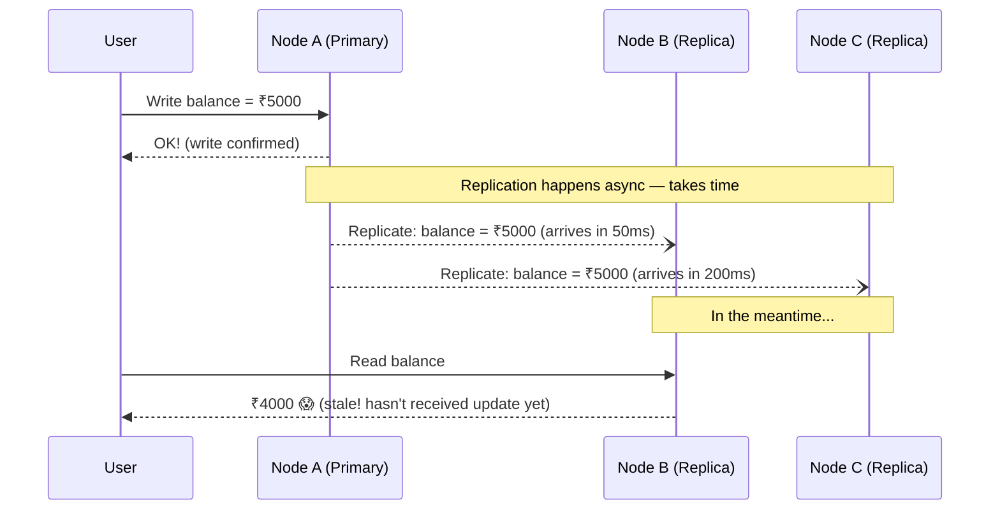

### Three Fundamental Tensions

| Tension | Option A | Option B |
|---|---|---|
| Consistency vs. Speed | Wait for all replicas (slow but correct) | Return immediately (fast but stale) |
| Consistency vs. Availability | Refuse requests during sync | Serve possibly stale data |
| Consistency vs. Scale | One master (bottleneck) | Many nodes (inconsistent) |

Yeh tensions hi hain jo **CAP theorem** explain karta hai: Consistency, Availability, Partition Tolerance — pick two. (And in practice, partition tolerance is non-negotiable, so you're really choosing between C and A.)

---

## 2. The Consistency Spectrum

Think of consistency models like a dial — strong on one end, weak on the other. **Stronger = safer but slower. Weaker = faster but riskier.**

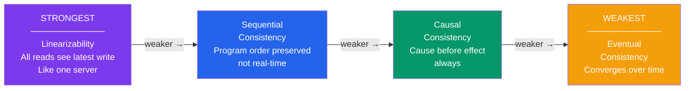

**As you go weaker:**
- Latency goes DOWN (faster responses)
- Availability goes UP (system stays up more)
- Data freshness goes DOWN (more chances of stale reads)

**As you go stronger:**
- Latency goes UP (must coordinate)
- Availability goes DOWN (may block)
- Data is always fresh (never stale)

There is **no universally correct model**. The right choice depends on what your application can tolerate.

---

## 3. Linearizability — Strong Consistency

### The Analogy: ATM Machine

Jab aap ATM se paise nikalte ho, aap expect karte ho ki balance **exactly** as of right now dikhe. Agar aapne abhi 5 seconds pehle ₹2000 nikale, aur ATM abhi bhi ₹10,000 dikha raha hai — woh completely wrong hai. ATMs use strong consistency because **money cannot be stale**.

### What It Is

**Linearizability** (also called **Strong Consistency** or **Atomic Consistency**) is the strongest guarantee. It says:

> The system behaves as if there is only **one copy** of the data, and every operation takes effect at a single instantaneous point in time.

Once a write completes:
- **Every** subsequent read from **any** node returns that value
- No client can ever see an older value
- The distributed system feels like a single machine

### Why It Exists

Kuch scenarios hain jahan stale data simply unacceptable hai:
- Bank balances (you can't show ₹10,000 if balance is ₹500)
- Inventory counts (you can't sell an item that's already sold)
- Distributed locks (two nodes shouldn't think they both hold the lock)
- Leader election (only one node should be the leader)

### How It Works

Strong consistency requires **synchronous coordination** before confirming a write:

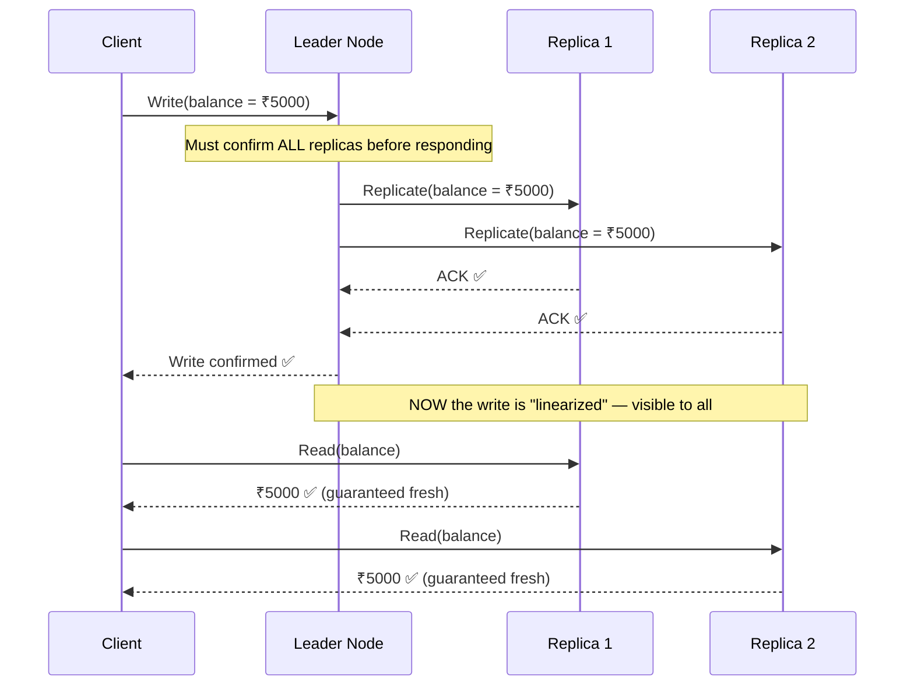

The key: **the write does not return to the client until ALL replicas have confirmed they have the new data.** This is expensive (latency increases) but guarantees correctness.

### Real Production Examples

| System | How It Achieves Linearizability |
|---|---|
| **Google Spanner** | TrueTime API + Paxos consensus across datacenters |
| **ZooKeeper / etcd** | Raft consensus protocol — quorum must agree before commit |
| **HBase** | Single region server per key range + synchronous HDFS writes |
| **PostgreSQL** (sync replication) | `synchronous_standby_names` — primary waits for replica WAL sync |
| **CockroachDB** | Raft + MVCC timestamps across distributed nodes |

### Trade-offs

```
Pros of Linearizability:
✅ Never returns stale data
✅ Simple programming model — feels like one server
✅ No conflict resolution needed — last write always wins globally
✅ Safe for money, locks, inventory — anywhere correctness is critical

Cons of Linearizability:
❌ High latency — must wait for cross-replica coordination
❌ Low availability — during network partition, system may refuse requests
❌ Low throughput — every write is a distributed consensus round
❌ Hard to achieve across geographies (adding 100ms+ per cross-region call)
```

### Interview Tip

> **If an interviewer asks:** "How would you design a bank's balance system?"
>
> Say: "I'd use linearizable (strong) consistency — specifically, a primary-replica setup with synchronous replication, or a consensus-based system like Raft. Every debit/credit needs to be an atomic transaction. I'd accept higher latency because correctness is non-negotiable for financial data. In practice, systems like Google Spanner or CockroachDB handle this well at scale."

---

## 4. Sequential Consistency

### The Analogy: Movie Subtitles

Ek movie dekh rahe ho. Subtitles Hindi mein hain. Dialogue aur subtitle exact same time pe nahi aate — subtitle thodi der baad aati hai. But they always come in the **right order** — you never see the end subtitle before the beginning subtitle. That's sequential consistency: **order preserved, but not real-time**.

### What It Is

**Sequential Consistency** guarantees that:
1. All operations appear to execute in **some** total sequential order
2. Operations from **each individual client** appear in the order that client issued them
3. But there's **no real-time guarantee** — reads might see slightly old data

Think of it as: "Everyone agrees on a single history, but that history might be slightly behind reality."

### The Key Difference from Linearizability

```
Linearizability:
────────────────
Client A writes x=1 at time T.
Client B reads x at time T+1.
B MUST see x=1.
(Real-time guarantee)

Sequential Consistency:
───────────────────────
Client A writes x=1 at time T.
Client B reads x at some point.
B might see x=0 or x=1 — BUT if B later reads x=1,
B will never see x=0 again (order is preserved).
(No real-time guarantee, but order is respected)
```

### Example

```
Thread 1 writes: x=1, then y=1
Thread 2 reads: y first, then x

Valid under Sequential Consistency:
┌────────────────────────────────────────────────────┐
│  Thread 2 reads y=1, x=1  ✅ (Thread 1's ops visible)   │
│  Thread 2 reads y=0, x=0  ✅ (Thread 1's ops not visible)│
│  Thread 2 reads y=1, x=0  ❌ IMPOSSIBLE                  │
│    (y was written AFTER x, so if y=1 is visible,         │
│     x=1 must also be visible — order preserved!)         │
└────────────────────────────────────────────────────┘
```

### Real Production Examples

- **CPU memory models** — Intel x86 guarantees something close to sequential consistency at the hardware level
- **Some distributed databases** with relaxed but ordered replication
- **Amazon DynamoDB** with certain configuration — operations within a session are sequential

### Trade-offs

```
Pros:
✅ Preserves program-order — easier to reason about than full eventual consistency
✅ Lower latency than linearizability — no real-time synchronization needed

Cons:
❌ Clients might see "old" data briefly
❌ Harder to implement correctly than eventual consistency
❌ Not sufficient for bank transactions (real-time is sometimes needed)
```

---

## 5. Causal Consistency

### The Analogy: WhatsApp Conversation

Agar aapke friend ne aapko message kiya "Kya hua?" aur aapne reply kiya "Theek hai", toh jo bhi yeh conversation dekhega — **wo pehle question dekhega, phir answer**. Reply kabhi bhi question se pehle nahi dikhega. That's causal consistency — **cause always comes before effect**.

### What It Is

**Causal Consistency** guarantees:
> Operations that are **causally related** are seen in the same order by all nodes.
> Concurrent (causally unrelated) operations can be seen in any order.

"Causal relationship" means: if event A **happened before** event B (A influenced B), then every node sees A before B.

### How Causality Works

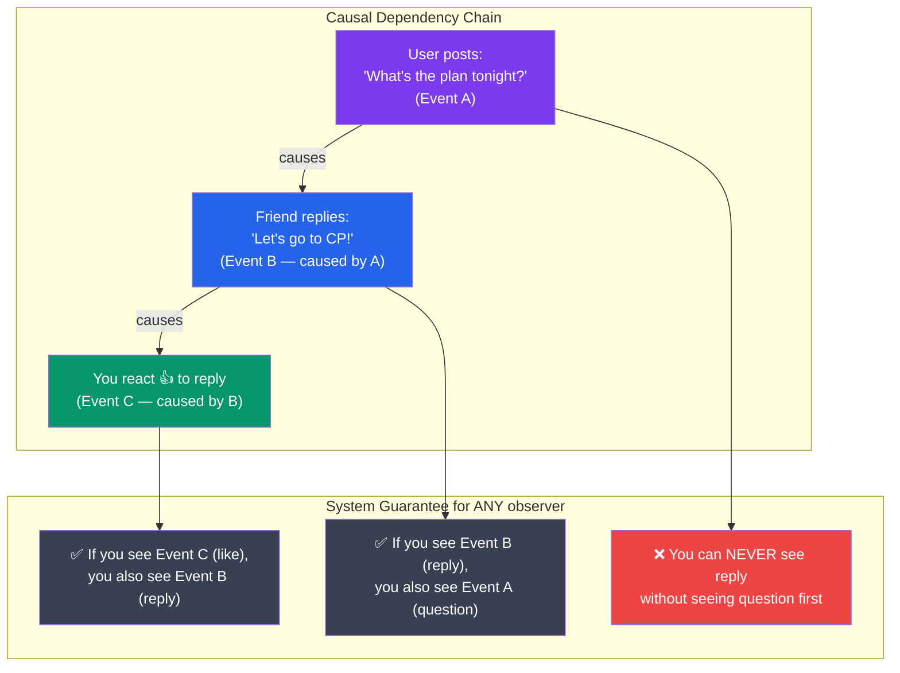

### Concurrent vs. Causal Operations

```
Causal: Post → Reply → Like on reply
  (clear causality chain — order MUST be preserved)

Concurrent: Two independent posts at the same time
  - Siddesh posts: "Pizza for lunch!"
  - Priya posts: "Anyone for cricket tonight?"
  These are NOT causally related — different nodes can show them
  in different order. That's fine!
```

### How It's Tracked: Vector Clocks

Yeh track karne ke liye ki "kaunsa event pehle hua", systems use **vector clocks**:

```
Each node maintains a vector: [NodeA_count, NodeB_count, NodeC_count]

Node A does operation → A's counter increments:
  A: [1, 0, 0]

Node B reads A's operation, then does its own:
  B: [1, 1, 0]  ← B knows it happened after A's first op

If C sees [1, 1, 0], it knows: A did 1 op, B did 1 op after A's first op.
This lets C reconstruct the causal order!
```

### Real Production Examples

- **MongoDB** — Causal Consistency Sessions let you read-your-writes across a replica set with causal ordering
- **Facebook's TAO** — Social graph reads guarantee causal consistency for your social feed
- **Antidote DB** — Specifically designed around causal consistency
- **Riak** — Optionally supports causal reads

### Trade-offs

```
Pros:
✅ Much more intuitive than full eventual consistency for users
✅ Handles the "reply before question" problem perfectly
✅ Lower latency than sequential or linearizable
✅ Higher availability than strong consistency

Cons:
❌ Tracking causal dependencies has overhead (vector clocks)
❌ More complex to implement than simple eventual consistency
❌ Doesn't guarantee globally total order (concurrent events can still be reordered)
```

---

## 6. Eventual Consistency

### The Analogy: Spreading Gossip

Ek colony mein koi news phailti hai — gossip style. Pehle aapne suna, phir aapne apne 3 dost ko bataya, unhone apne doston ko bataya. Kuch log 5 minute mein janenge, kuch 1 ghante mein. **Eventually sab ko pata chal jaata hai — but there's a window where some people know and others don't.** That's eventual consistency.

### What It Is

**Eventual Consistency** is the weakest (and most common) model:

> If no new updates are made to a value, eventually all replicas will converge to the same value.

No guarantee on **when** they'll converge. No guarantee about **what you'll read in the meantime.** But given enough time and no new writes, the system reaches agreement.

### Timeline Visualization

```
Write: user.bio = "Software Engineer at Google"

Time (ms):   0    50   100  200  500  1000  2000
             │    │    │    │    │    │     │
Primary:     │ ██████████████████████████████ "Google"
Replica 1:   │         │  ██████████████████ "Google" (lag: 100ms)
Replica 2:   │              │  █████████████ "Google" (lag: 200ms)
Replica 3:   │                   │  ████████ "Google" (lag: 500ms)
Replica 4:   │                        │ ████ "Google" (lag: 1000ms)

During the lag windows → stale reads possible!
After 2000ms → ALL replicas say "Software Engineer at Google" ✅
```

### What Can Go Wrong: Common Anomalies

```
Anomaly 1: Stale Read
──────────────────────
Siddesh updates his Zomato delivery address.
Server A gets the update immediately.
Next request goes to Server B (load balanced).
Server B hasn't replicated yet.
Siddesh's order goes to the old address! 😱

Anomaly 2: Monotonic Reads Violation
──────────────────────────────────────
Request 1 → Replica A (up-to-date): follower_count = 10,000
Request 2 → Replica B (lagging):    follower_count = 9,800
Time appears to go BACKWARDS — count decreased!

Anomaly 3: Write Conflicts
───────────────────────────
Siddesh updates name = "Siddesh P" on Node A (Mumbai datacenter)
His friend Priya (sharing account?) updates name = "Priya K" on Node B (Delhi datacenter)
Both writes succeed locally.
Now the nodes sync. CONFLICT — which name wins?
```

### Real Production Examples

| System | Use Case | Why Eventual is OK |
|---|---|---|
| **DynamoDB** (default) | Shopping carts | Cart being slightly stale for 100ms is fine |
| **Cassandra** | Time-series data, IoT | Latest sensor reading doesn't need to be globally synced |
| **Redis** (async replica) | Session cache, leaderboards | Slightly stale leaderboard is acceptable |
| **DNS** | Domain resolution | DNS changes propagate over hours — you've experienced this! |
| **CDN caches** | Static content | Cache invalidation takes time — you've seen "stale" content |
| **Instagram feed** | Social posts | Seeing a post 2 seconds late is fine |

### Trade-offs

```
Pros:
✅ Lowest latency — write returns immediately from primary
✅ Highest availability — system stays up even during network issues
✅ Highest throughput — no coordination overhead
✅ Works well across geographies — don't need cross-region sync

Cons:
❌ Stale reads possible — user might see old data
❌ Write conflicts possible — need resolution strategy
❌ Complex conflict resolution logic required
❌ Application must handle inconsistencies gracefully
```

---

## 7. Session Guarantees

### Yeh Kyun Important Hai?

Global consistency models are "system-wide" — they apply to all clients. But sometimes you just need **per-user** guarantees. Session guarantees are weaker than full linearizability but stronger than raw eventual consistency — and they're practical for most web apps.

### 7.1 Read-Your-Own-Writes (RYW)

#### The Analogy: Post Office Receipt

Jab aap post office se parcel bhejte ho, aapko receipt milti hai. Agar aap 5 minute baad jaake check karo, "kya mera parcel gaya?", toh post office should say "haan, gaya" — not "humne koi parcel nahi dekha." That's read-your-own-writes.

#### What It Guarantees

> After you perform a write, **your** subsequent reads will always see that write — even if other clients still see old data.

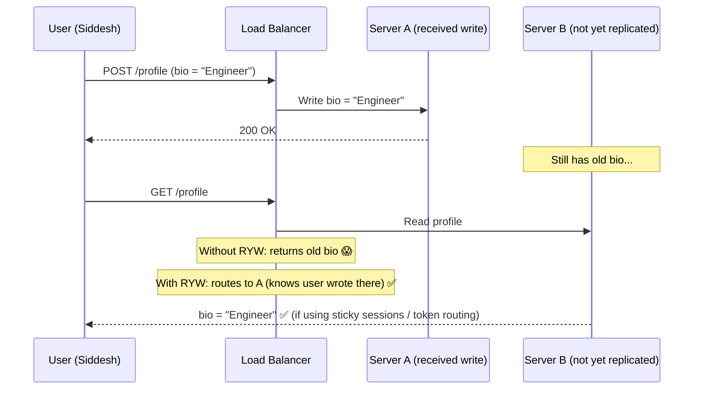

#### How RYW is Implemented

**Option 1: Sticky Sessions**
Route the same user to the same replica — they'll always read what they wrote. Simple but creates hot spots.

**Option 2: Read-After-Write Token**
After a write, server returns a "write token" (version number or timestamp). Future reads must include this token. System routes reads to replicas that are at least as up-to-date as the token.

**Option 3: Read from Primary**
Always write to primary, always read from primary for your own data. Simple but doesn't scale reads.

#### Real Production Use

- **Instagram** — when you post a story, you always see it immediately (RYW)
- **MongoDB Causal Sessions** — returns an `operationTime` token; reads use `afterClusterTime`
- **DynamoDB Strongly Consistent Reads** — explicitly requesting primary read for your own writes

### 7.2 Monotonic Reads

#### The Analogy: YouTube View Count

Agar aapne ek YouTube video pe 10,000 views dekhe, toh refresh karne pe aap expect karte ho ki count 10,000 ya zyada hoga — **kabhi 9,500 nahi dikha**. That's monotonic reads — once you've seen a value, you'll never see an older one.

#### What It Guarantees

> If you read value V at time T, all your future reads will return V or something **newer** — never older.

```
Without Monotonic Reads:
────────────────────────
Request 1 → Replica A (fresh): follower_count = 12,400 ✅
Request 2 → Replica B (lagging): follower_count = 12,200 😱

Time appears to go backwards! Count DECREASED.

With Monotonic Reads:
──────────────────────
System remembers: "This user has seen version V=12,400"
Next read is routed to a replica with version >= V
Result: 12,400 or higher ✅
```

#### How It's Implemented

Client (or proxy) tracks the **highest version seen**. Subsequent reads are tagged with this version. System routes to a replica that has caught up to at least that version.

### 7.3 Causal Consistency (Session Level)

At the session level, this means: "You can see replies only after you've seen the original post." Tracked via vector clocks or hybrid logical clocks (HLC) embedded in request headers.

---

## 8. ACID vs BASE

### The Fundamental Philosophy Split

Simple baat hai: there are two schools of thought in database design — **ACID** (used by SQL/relational databases) and **BASE** (used by NoSQL/distributed databases). They represent different answers to "what do you prioritize: correctness or availability?"

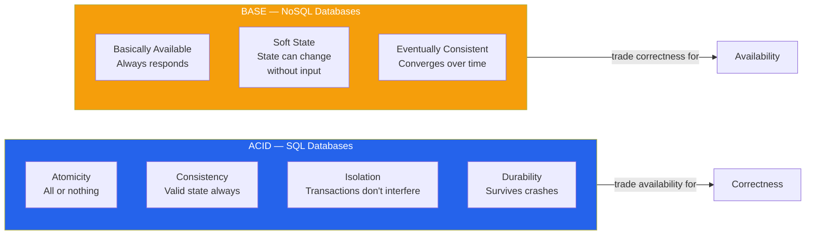

### ACID — Deep Dive

**Used by:** PostgreSQL, MySQL, Oracle, SQL Server, CockroachDB, Spanner

#### Atomicity

> All operations in a transaction succeed together, or none of them do.

```sql
-- Banking transfer: debit ₹5000 from A, credit ₹5000 to B
BEGIN;
  UPDATE accounts SET balance = balance - 5000 WHERE id = 'A';
  UPDATE accounts SET balance = balance + 5000 WHERE id = 'B';
COMMIT;

-- If the second UPDATE fails (for any reason):
-- ROLLBACK happens automatically — A's money is NOT debited
-- No partial state! Account A still has its full balance.
```

Real life analogy: UPI payment — either money leaves your account AND reaches the other person, or neither happens. UPI ka "debit hua, credit nahi hua" scenario ACID ki failure hai.

#### Consistency

> The database moves from one valid state to another. Constraints are never violated.

```sql
-- Foreign key constraint — consistency rule
-- You cannot insert an order for a non-existent user
INSERT INTO orders (user_id, amount) VALUES (99999, 500);
-- ERROR: user_id 99999 does not exist!
-- Database refuses to enter invalid state ✅
```

Note: In ACID, "Consistency" means **application-level data validity** (constraints, triggers, rules). It's different from the distributed systems meaning of consistency (linearizability).

#### Isolation

> Concurrent transactions don't see each other's intermediate states.

```
Isolation Levels (from weakest to strongest):

Read Uncommitted:  See other transactions' uncommitted changes 😱 (dirty reads)
Read Committed:    Only see committed data (default in PostgreSQL, Oracle)
Repeatable Read:   Your reads don't change during a transaction
Serializable:      Transactions appear to run one after another (strongest)

Trade-off: Stronger isolation = more locking = slower throughput
```

#### Durability

> Once a transaction is committed, it survives crashes — even if the server dies immediately after.

How it works:
1. Before writing to data files, write to **WAL (Write-Ahead Log)** on disk
2. `fsync()` — force the OS to flush WAL to physical disk
3. Only then, confirm the commit to the client
4. On crash recovery, replay the WAL to restore committed state

### BASE — Deep Dive

**Used by:** DynamoDB, Cassandra, MongoDB (default), CouchDB, Redis, Riak

**Basically Available:** The system responds to every request, even if the response might be stale or approximate. The system never says "I'm busy, try later" — it always gives you something.

```
Example: DynamoDB "Basic Availability"
────────────────────────────────────────
Even if 2 out of 5 nodes are down, DynamoDB still serves reads and writes.
The response might be slightly stale (from the nodes that are up),
but the system doesn't refuse your request.

ACID equivalent behavior: "503 Service Unavailable" during any node failure.
BASE behavior: "Here's what I know, might be slightly old" — always a response.
```

**Soft State:** The state of the system can change over time even without new client inputs — because replicas are converging.

```
Example: Cassandra "Soft State"
────────────────────────────────
At T=0ms: Node A has x=1, Node B has x=0
No new writes come in.
At T=500ms: Node B receives replication from A → B now has x=1
State changed... without any client writing anything!
This "self-healing" is the soft state property.
```

**Eventually Consistent:** Already covered — all replicas converge to the same value over time.

### ACID vs BASE Comparison Table

| Property | ACID | BASE |
|---|---|---|
| **Stands for** | Atomicity, Consistency, Isolation, Durability | Basically Available, Soft state, Eventually consistent |
| **Philosophy** | Correctness first | Availability first |
| **Consistency model** | Strong (linearizable) or Serializable | Eventual (with optional tuning) |
| **Availability** | Lower (refuses during issues) | Higher (always responds) |
| **CAP preference** | CP (Consistency + Partition Tolerance) | AP (Availability + Partition Tolerance) |
| **Latency** | Higher (coordination needed) | Lower (write and propagate) |
| **Throughput** | Lower (locking, coordination) | Higher (no coordination needed) |
| **Typical systems** | PostgreSQL, MySQL, Oracle, Spanner | DynamoDB, Cassandra, MongoDB (default) |
| **Best for** | Financial transactions, inventory | Social feeds, analytics, IoT, caches |
| **Failure mode** | Return error — refuse bad state | Accept write, reconcile later |
| **Conflict handling** | Prevention (locks, constraints) | Resolution (LWW, CRDTs, app logic) |

### When to Use What

```
Use ACID when:
  ✅ Money is involved (bank transfers, payments)
  ✅ Inventory that must not oversell (e-commerce flash sales)
  ✅ Referential integrity matters (orders must have valid users)
  ✅ You cannot tolerate stale reads at all

Use BASE when:
  ✅ Social media feeds (slightly delayed posts are fine)
  ✅ Analytics and logs (approximate counts are acceptable)
  ✅ IoT sensor data (latest reading doesn't need global sync)
  ✅ Shopping cart (stale for 100ms is harmless)
  ✅ Massive scale where ACID coordination would be too slow
```

---

## 9. Replication Lag

### What It Is

**Replication lag** is the delay between when a write is committed on the primary (master) node and when that write is visible on the replica (secondary) nodes.

Think of it like a photocopier with a slow memory: you put the original in, it says "copied!" — but it actually puts the copy in a queue. The copy machine (replica) prints the copy some time later.

### What Causes Replication Lag?

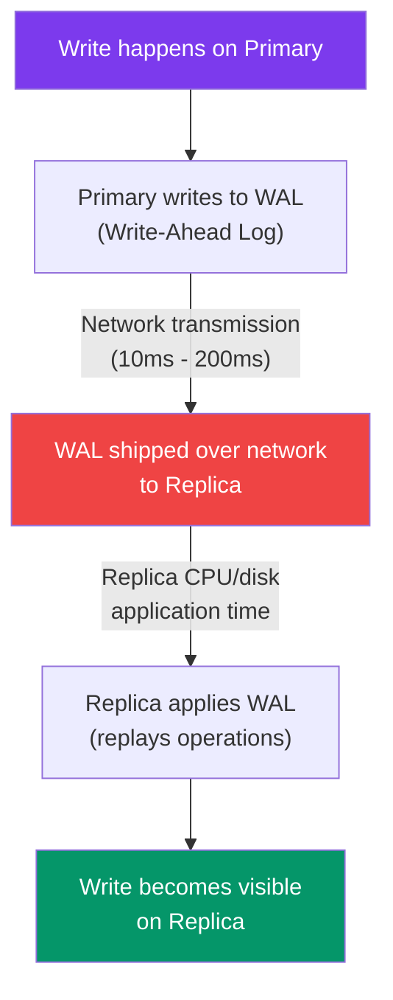

**Causes of high replication lag:**
- Network congestion or high latency between primary and replica
- Replica is under heavy read load (can't keep up with applying WAL)
- Large transactions on primary (replication pauses until transaction commits)
- Cross-datacenter replication (adds inherent network latency)
- Replica disk is slow

### How Replication Lag Causes Problems

```
Scenario: Zomato order tracking
─────────────────────────────────────────────────────────
T=0:   Delivery partner marks order as "Delivered" (writes to Primary)
T=0:   Primary confirms to delivery partner app ✅
T=200ms: Replica receives replication update
T=500ms: Customer refreshes order status (reads from Replica)

If customer reads at T=100ms → sees "Out for Delivery" (stale!) 😱
If customer reads at T=300ms → sees "Delivered" ✅
```

### Visualizing Replication Lag

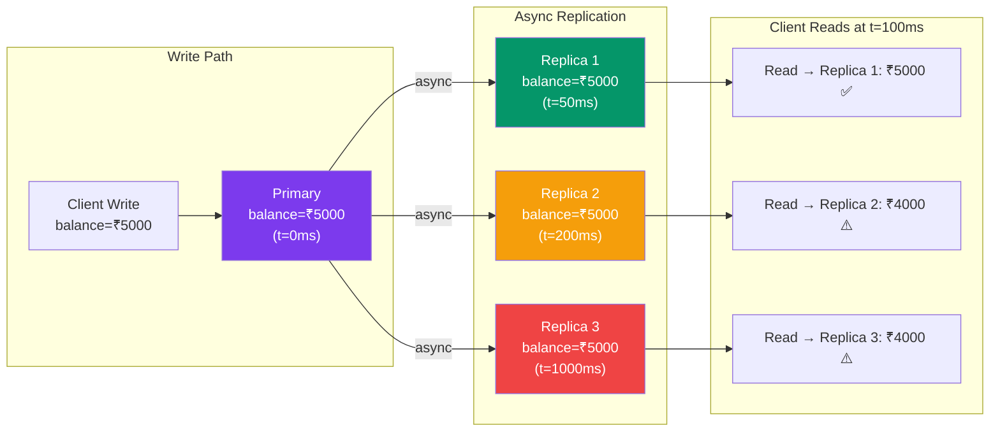

### Solutions to Replication Lag

**Option 1: Read from Primary (Simplest)**
```
For writes and their immediate reads — always hit the primary.
Use replicas only for reads that can tolerate stale data.

Pros: Simple. Guarantees read-your-writes.
Cons: Primary becomes a bottleneck for read-heavy workloads.

Used by: Most well-designed APIs for user-facing mutations
```

**Option 2: Sticky Sessions**
```
Route a given user's requests to the same replica consistently.
They'll always see their own writes (that replica has their data).

Pros: Simple to implement at load balancer level.
Cons: Uneven load distribution; that one replica becomes hot.

Used by: Many legacy session-based web apps
```

**Option 3: Write Tokens / Read-After-Write Timestamps**
```
After write: server returns token = {version: 42, timestamp: T}
Future reads: client includes token in request
System: routes read to replicas with version >= 42

Pros: Precise. No need for sticky sessions.
Cons: More complex. Client must carry the token.

Used by: MongoDB Causal Consistency, Google Spanner externally-consistent reads
```

**Option 4: Synchronous Replication**
```
Primary waits for replica(s) to confirm write before returning.

Pros: Zero lag — replica is always up-to-date.
Cons: Higher write latency. Write fails if replica is unreachable.

Used by: PostgreSQL synchronous_standby_names, MySQL semi-sync replication
```

**Option 5: Quorum Reads (discussed in Section 12)**
```
Read from multiple replicas and take the majority/latest value.
Mathematically guarantees you hit at least one up-to-date replica.
```

### Monitoring Replication Lag

In production, you should always monitor lag:

```sql
-- PostgreSQL: check replication lag
SELECT client_addr, state, write_lag, flush_lag, replay_lag
FROM pg_stat_replication;

-- MySQL: check replica lag
SHOW SLAVE STATUS\G
-- Look for: Seconds_Behind_Master
```

**Interview Tip:** Mention monitoring replication lag as part of your design. "I'd set an alert if replication lag exceeds 5 seconds, and we'd route all reads to primary if lag is critical."

---

## 10. Conflict Resolution

### When Do Conflicts Happen?

Conflicts happen in **eventual consistency systems** when two clients write to the **same key** on **different replicas** at the **same time** (or during a network partition). Both writes succeed locally, but when replicas sync, they disagree.

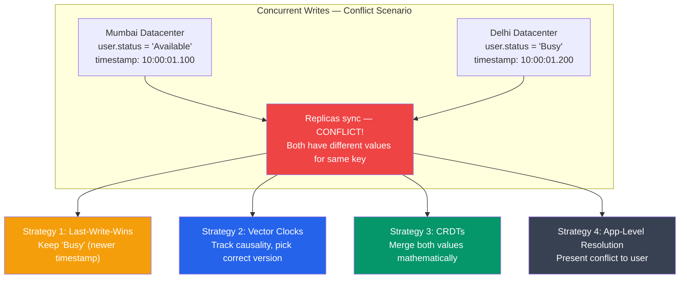

### Strategy 1: Last-Write-Wins (LWW)

#### The Analogy: Google Form — Last Edit Wins

Ek Google Form mein do log ek saath same field edit kar rahe hain. Jo last save karega, uska answer rakhega. Simple — jo last hua, wo wins.

#### How It Works

```
Each write carries a timestamp (wall clock or logical clock).
When replicas sync and find a conflict:
  → Keep the write with the HIGHER timestamp
  → Discard the older timestamp's value

Example:
────────
Node A: name = "Alice"  [timestamp: 1000]
Node B: name = "Bob"    [timestamp: 1200]

On sync: Bob wins (1200 > 1000). Alice's write is silently lost.
```

#### LWW — The Problem

```
⚠️ CLOCK SKEW IS DANGEROUS:
Node A timestamp: 10:00:05.000  (server clock is 5 seconds fast)
Node B timestamp: 10:00:03.000  (server clock is correct)

Even though B's write happened AFTER A's (in real time),
A's timestamp is higher → A wins. WRONG result!

Solution: Use Hybrid Logical Clocks (HLC) or logical clocks (Lamport)
instead of wall clock timestamps.
```

#### When LWW is Acceptable

- **Last known GPS position** — most recent location IS the right one
- **Session tokens** — latest login wins
- **CDN cache invalidation** — latest version of a file wins

#### When LWW is Dangerous

- **Counters** — you can't LWW a counter (you'd lose increments)
- **Bank balances** — silently losing a debit or credit is catastrophic
- **Shopping cart** — two devices add items, one device's additions get lost

**Used by:** Cassandra (default), DynamoDB (optional)

### Strategy 2: Vector Clocks

#### The Analogy: Git Commit History

Git jab do branches merge karta hai, woh exactly track karta hai ki "yeh commit kab hua, kaunsa pehle, kaunsa baad, kaunsa independent tha." Vector clocks databases ke liye yehi kaam karte hain.

#### How Vector Clocks Work

```
Each node maintains a vector of counters — one per node:
Format: [NodeA_ops, NodeB_ops, NodeC_ops]

Initial state: all nodes have [0, 0, 0]

Step 1: Client writes to Node A:
  Node A: [1, 0, 0]  ← A incremented its own counter

Step 2: Node A replicates to Node B:
  Node B receives [1, 0, 0] from A
  Node B increments own counter: [1, 1, 0]

Step 3: Client concurrently writes to Node C (without seeing B's state):
  Node C: [0, 0, 1]  ← only C's counter

Step 4: B and C sync:
  B has: [1, 1, 0]
  C has: [0, 0, 1]
  
  Neither dominates the other — CONCURRENT CONFLICT detected!
  [1,1,0] vs [0,0,1]: neither vector is element-wise ≥ the other
  → Must resolve conflict (application level or merge)
```

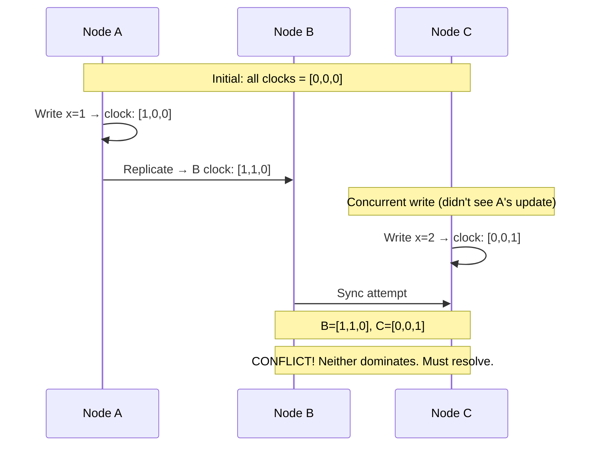

#### Vector Clocks — Key Properties

```
A "dominates" B (no conflict, A is newer):
  A[i] >= B[i] for ALL i, and A[j] > B[j] for at least one j

Concurrent (conflict exists):
  A[i] > B[i] for some i, AND B[j] > A[j] for some j

Identical (same state):
  A[i] = B[i] for ALL i
```

**Used by:** Amazon DynamoDB (internally), Riak, distributed version control systems

### Strategy 3: CRDTs (Conflict-free Replicated Data Types)

#### The Analogy: Shared Grocery List

Agar aap aur aapke roommate dono grocery list mein items add karte ho without syncing — when you finally sync, aap simply **dono lists merge kar dete ho**. Koi conflict nahi, koi item lose nahi hota. That's a CRDT.

#### The Math Behind CRDTs

A CRDT is a data structure with a **merge function** that is:
- **Commutative**: merge(A, B) = merge(B, A) — order doesn't matter
- **Associative**: merge(merge(A, B), C) = merge(A, merge(B, C)) — grouping doesn't matter
- **Idempotent**: merge(A, A) = A — merging same thing twice is fine

This means **any two replicas can independently merge at any time and always reach the same result.**

#### Common CRDT Examples

**G-Counter (Grow-Only Counter):**
```
Used for: view counts, like counts, impression counters

Each node maintains its own counter segment:
Node A: 3 increments
Node B: 2 increments
Node C: 5 increments

Global total = sum of all = 3 + 2 + 5 = 10

Even if A and B sync first: A+B = 5, then +C = 10 ✅
Even if C syncs first: C = 5, then +A+B = 10 ✅
Order doesn't matter! No increments lost!
```

**PN-Counter (Positive-Negative Counter):**
```
Used for: inventory counts (can increment and decrement)

Two G-Counters: one for additions (P), one for subtractions (N)
Value = P - N

This allows decrement operations without conflict!
Node A: P=5, N=2 → local value = 3
Node B: P=2, N=1 → local value = 1
Merged: P=7, N=3 → global value = 4 ✅
```

**OR-Set (Observed-Remove Set):**
```
Used for: shared tag sets, collaborative lists

Challenge: what if one node adds an item and another removes it?

Solution: Each add operation gets a unique tag.
Remove only removes specific tagged instances.

Node A: add("apple" with tag=uuid1)
Node B: remove("apple" with tag=uuid1)
Merge: apple is gone ✅ (the specific tagged instance was removed)

Node A: add("apple" with tag=uuid2) at the same time as B's remove
Merge: apple stays! ✅ (uuid2 was never removed)
```

**LWW-Register (Last-Write-Wins with timestamps):**
```
Used for: user profile fields (name, bio, avatar URL)

Carries timestamp. Merge = keep higher timestamp.
Trade-off: might lose a concurrent write (intentional here).
```

**MV-Register (Multi-Value Register):**
```
Used for: shopping carts (Amazon DynamoDB uses this!)

On conflict: KEEP BOTH VALUES. Present them to the application.
Application (or user) decides which to keep.

Amazon Dynamo Paper classic example:
  Node A: cart = [item1, item2]
  Node B: cart = [item1, item3]
  Merge: cart = [[item1, item2], [item1, item3]]
  → Application sees both versions and merges them: [item1, item2, item3]
```

#### Real CRDT Deployments

| System | CRDT Used | Use Case |
|---|---|---|
| **Redis** | HyperLogLog | Approximate distinct count |
| **Riak** | Riak DT (sets, counters, maps) | General-purpose conflict-free data |
| **Phoenix/Presence** | CRDT presence tracking | Real-time who's online |
| **Google Docs / Figma** | OT / CRDT for text | Collaborative editing |
| **SoundCloud** | CRDT counters | Play count tracking |
| **Yjs / Automerge** | CRDT libraries | Browser-based collaboration |

---

## 11. Read-After-Write Consistency

### The Instagram Story Problem

Yeh real problem hai jo Instagram ne face kiya — aur kaafi systems face karti hain.

#### The Scenario

```
Story:
───────────────────────────────────────────────────────
1. You post an Instagram Story (video of your food)
2. Instagram says "Story posted!" ✅
3. You immediately go to your profile to see your story
4. Your story is NOT there 😱
5. You panic. Post it again? Refresh? Log out?
6. 30 seconds later, it appears.

What happened?
```

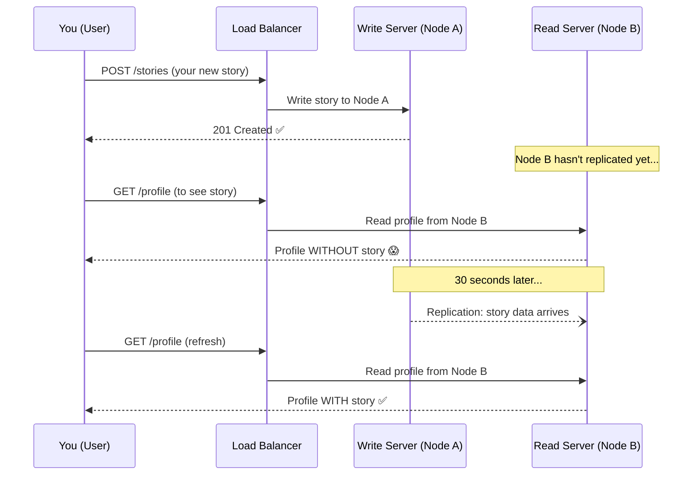

#### Why This Happens

Instagram uses massive horizontal scaling — hundreds of servers. Write goes to Server A (maybe Mumbai datacenter), but the next GET request is load-balanced to Server B (maybe Pune server). Server B hasn't received the replication update yet. You see stale data.

This is exactly the **read-after-write consistency** problem.

#### Solutions Instagram and Similar Systems Use

**Solution 1: Read-After-Write Token**
```
After write → return { post_id: "xyz", version: 1042 }
Next profile read includes: ?min_version=1042
Server routes this read to a node that has version >= 1042

Pros: Works well, precise
Cons: Client must carry and send the token
```

**Solution 2: Route Profile Reads to Primary (For Your Own Profile)**
```
When YOU view YOUR OWN profile → always read from primary
When you view SOMEONE ELSE's profile → can read from replica

Instagram logic: "If user_id == viewer_id → primary read"
Pros: Simple, effective for the most common case
Cons: Primary gets more load for profile reads
```

**Solution 3: Sticky Sessions on Post**
```
After a write, set a cookie: "last_write_server=NodeA"
For the next N minutes, route reads to NodeA
Pros: Simple cookie-based approach
Cons: NodeA becomes hot for that user; cookie expiry issues
```

**Solution 4: Cache the Write Locally (Client-Side)**
```
When you post a story, immediately add it to your local client state
Don't wait for server to return it on the next read
If server returns without it, client "injects" it from local cache

Pros: Zero server-side complexity; instant UX
Cons: Requires client-side state management; data can get out of sync
```

**What Instagram Actually Does:** A combination — they route self-profile reads to primary for a short window after writes, plus client-side optimistic updates for immediate feedback.

#### The Zomato Address Problem

```
Same problem, higher stakes:
────────────────────────────
1. Siddesh updates delivery address in Zomato profile
2. Server A confirms "address updated"
3. Siddesh immediately places an order
4. Order read picks up from Server B (lagging)
5. Server B has OLD address — order goes to wrong place!

Solution: Zomato routes order placement reads through primary
for 30 seconds after a profile write. After that, replicas are
assumed to have caught up.
```

---

## 12. Quorum Reads and Writes

### The Analogy: Parliament Vote

Sansad mein bill pass karne ke liye majority chahiye. Agar 543 MPs hain, aapko at least 272 chahiye. Even if some MPs are absent (some nodes are down), as long as the majority agrees, the bill passes. Yeh concept quorum hai.

### The Formula

```
N = Total number of replicas
W = Number of replicas that must confirm a WRITE
R = Number of replicas that must respond to a READ

For Strong Consistency:
    W + R > N

This guarantees: ANY read quorum overlaps with ANY write quorum.
At least ONE node in your read set has the latest write.
```

### Why W + R > N Guarantees Consistency

```
Example: N=5, W=3, R=3

Write happens → confirmed by 3 of 5 replicas (nodes 1, 2, 3)

Read happens → reads from 3 of 5 replicas

Possible read sets: {1,2,3}, {1,2,4}, {1,2,5}, {1,3,4}, {1,3,5},
                   {2,3,4}, {2,3,5}, {3,4,5}, {1,4,5}, {2,4,5}

Write set was {1,2,3}. EVERY possible read set of size 3 overlaps
with {1,2,3} — because 3+3=6 > 5.

→ Every read will hit at least one node that has the latest write ✅
```

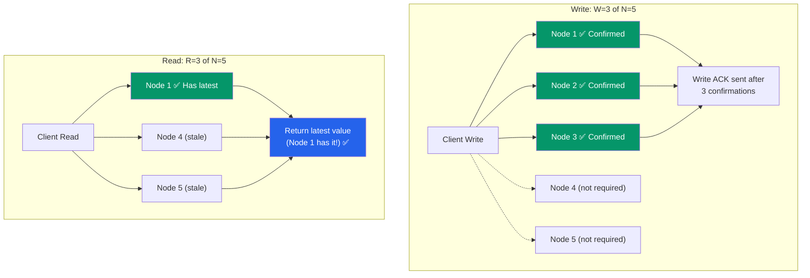

### Quorum Configurations and Their Properties

| N | W | R | W+R | Consistency | Availability | Use Case |
|---|---|---|---|---|---|---|
| 3 | 3 | 1 | 4 > 3 | Strong ✅ | Low (all nodes needed for write) | Critical writes |
| 3 | 1 | 3 | 4 > 3 | Strong ✅ | Low (all nodes needed for read) | Critical reads |
| 3 | 2 | 2 | 4 > 3 | Strong ✅ | Medium (majority needed) | Balanced (most common) |
| 3 | 1 | 1 | 2 < 3 | Eventual ❌ | High (any single node) | Speed over correctness |
| 5 | 3 | 3 | 6 > 5 | Strong ✅ | Medium | Large clusters |
| 5 | 1 | 1 | 2 < 5 | Eventual ❌ | Very High | Best effort |

### Sloppy Quorum (DynamoDB's Trick)

Normal quorum: must write to W **specific** replicas that "own" the key.

**Sloppy quorum:** if those replicas are down, write to **any** available node as a "hint", and send the data to the real owner later (hinted handoff).

```
Normal Quorum (N=3, W=2):
  Nodes for key "user123": Node 1, Node 2, Node 3
  Node 1 is down → WRITE FAILS (only 1 of 3 available for W=2)

Sloppy Quorum:
  Node 1 is down → Write to Node 4 (a "hint" node) instead
  Write succeeds! Node 4 holds the data temporarily.
  When Node 1 recovers → Node 4 forwards the data (hinted handoff)

Trade-off: Higher availability, but briefly breaks read quorum guarantees.
Used by: DynamoDB, Cassandra
```

---

## 13. Cassandra's Tunable Consistency

### What Makes Cassandra Special

Cassandra ek unique position pe hai: woh **per-query** consistency level choose karne deti hai. Yeh matlab hai ki ek hi application mein aap kuch queries ke liye strong consistency use kar sakte ho aur kuch ke liye eventual — depending on what each query needs.

Yeh "tunable consistency" ka concept hai — aap apna trade-off choose karo.

### Cassandra's Consistency Levels

```
For a cluster with N replicas:

Consistency Level    Writes Required    Reads Required    Behavior
─────────────────    ───────────────    ──────────────    ────────────────────────────
ONE                       1                  1            Fastest. No consistency guarantee.
TWO                       2                  2            Slightly better.
THREE                     3                  3            Even better.
QUORUM                   N/2+1             N/2+1          Strong consistency (W+R > N).
LOCAL_QUORUM             N/2+1 local       N/2+1 local    Strong within datacenter.
EACH_QUORUM              Quorum in each DC Quorum in each DC Multi-DC strong consistency.
ALL                       N                  N            Strongest. Any node failure = failure.
LOCAL_ONE                 1 local            1 local       Like ONE but prefers local DC.
ANY                       1 (can be hinted)  -            Write always succeeds (even hints).
SERIAL / LOCAL_SERIAL    Paxos lightweight  Paxos reads   Linearizable reads/CAS operations.
```

### Tuning for Your Use Case

```
Cassandra cluster: N=3 replicas per key

Use Case 1: User profile reads (can be slightly stale)
  Write: QUORUM (2 of 3)
  Read: ONE (1 of 3)
  W+R = 2+1 = 3 ≤ N=3 → Eventual consistency
  Benefit: Very fast reads ✅

Use Case 2: User account balance (must be accurate)
  Write: QUORUM (2 of 3)
  Read: QUORUM (2 of 3)
  W+R = 2+2 = 4 > N=3 → Strong consistency ✅
  Cost: Slower reads/writes

Use Case 3: Audit log (must never lose a write, reads can be stale)
  Write: ALL (3 of 3)
  Read: ONE (1 of 3)
  W+R = 3+1 = 4 > N=3 → Strong consistency (every write hits all nodes)
  Cost: Any dead node blocks writes

Use Case 4: IoT sensor data (throughput maximization)
  Write: ONE (1 of 3)
  Read: ONE (1 of 3)
  W+R = 2 ≤ N=3 → Eventual, but MAXIMUM throughput ✅
```

### Cassandra's Architecture

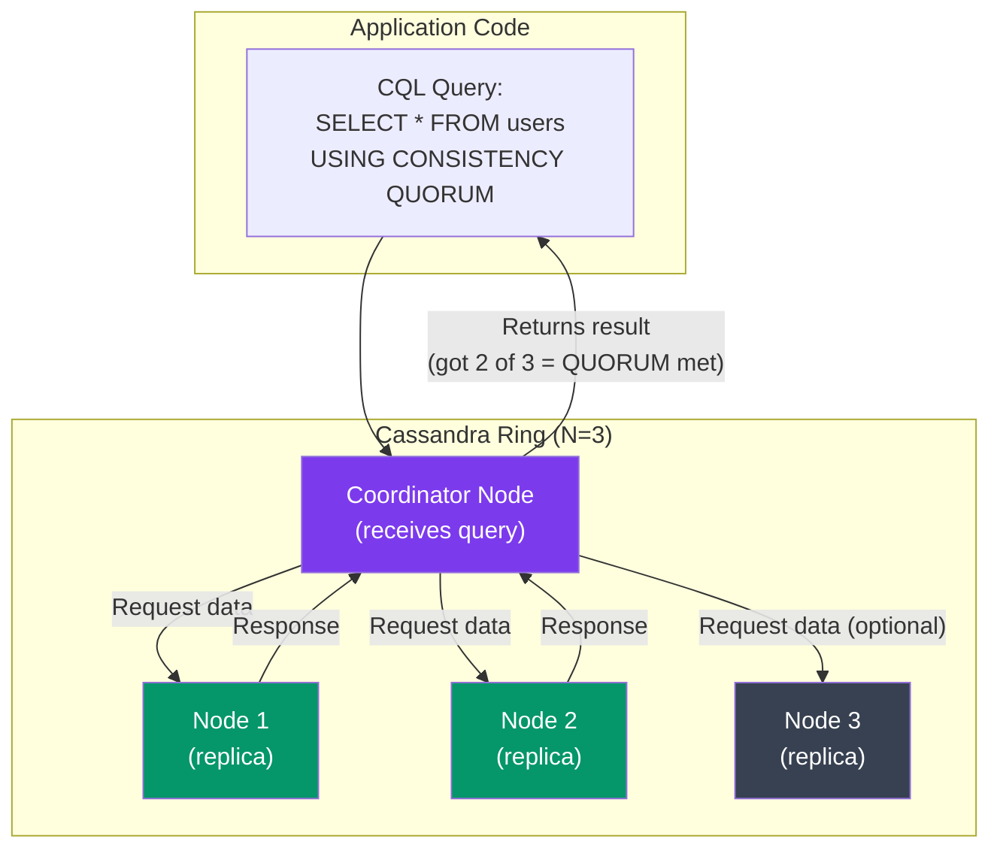

### Multi-Datacenter Consistency

```
Mumbai DC:    Replica 1, Replica 2, Replica 3
Singapore DC: Replica 4, Replica 5, Replica 6

LOCAL_QUORUM:
  Write: must confirm 2 of 3 replicas in LOCAL DC (fast, no cross-region)
  Read: must read from 2 of 3 replicas in LOCAL DC

EACH_QUORUM:
  Write: must confirm QUORUM in EACH DC (Mumbai: 2/3, Singapore: 2/3)
  Very strong but very slow (cross-ocean latency!)

LOCAL_QUORUM is the sweet spot for multi-DC deployments:
  → Strong consistency within a region
  → Low latency (no cross-region coordination for every query)
  → Async replication handles cross-DC propagation
```

### Real-World Cassandra Deployments

| Company | Use Case | Consistency Choice |
|---|---|---|
| **Netflix** | User watch history | ONE (eventual) — slightly stale history is fine |
| **Apple** | iCloud Drive metadata | QUORUM — need reliable metadata |
| **Uber** | Trip data | LOCAL_QUORUM — consistency within region |
| **Instagram** | Direct messages | QUORUM + SERIAL for CAS operations |
| **Discord** | Message storage | Tuned per operation type |

---

## 14. Real Systems Compared

### Consistency Model Summary Table

| System | Default Consistency | Strongest Available | Conflict Resolution | Notable Feature |
|---|---|---|---|---|
| **PostgreSQL** | Serializable (ACID) | Serializable | Locks prevent conflicts | Synchronous standby replication option |
| **MySQL** | Read Committed (ACID) | Serializable | Locks | Group Replication for distributed |
| **Google Spanner** | External Consistency | External Consistency (linearizable) | Paxos prevents conflicts | TrueTime — globally ordered timestamps |
| **CockroachDB** | Serializable | Serializable | Raft consensus | Geo-distributed ACID |
| **Amazon DynamoDB** | Eventual | Strong Consistent Read (2x cost) | LWW (last-write-wins) | Sloppy quorum, tunable |
| **Apache Cassandra** | LOCAL_ONE | ALL or SERIAL | LWW or LightWeight Transactions | Per-query tunable consistency |
| **MongoDB** | Eventual (secondaries) | Linearizable (w:majority + readConcern) | Raft replica sets | Causal sessions with operation time |
| **Redis** | Eventual (async replica) | Strong (with WAIT command) | LWW | Fast in-memory; data loss risk on failover |
| **ZooKeeper** | Sequential Consistency | Sequential Consistency | Zab protocol (leader-based) | Used for distributed coordination |
| **etcd** | Linearizable | Linearizable | Raft consensus | Kubernetes' backbone |
| **HBase** | Strong (region-based) | Strong | Single region server per key | HDFS-backed, strong by design |

### Trade-off Matrix

| Model | Latency | Availability | Data Freshness | Complexity | Best For |
|---|---|---|---|---|---|
| Linearizable | Very High | Low | Always fresh | Very High | Locks, balance, inventory |
| Sequential | High | Medium | Near-fresh | High | Ordered event logs |
| Causal | Medium | High | Causally fresh | Medium | Social feeds, chat |
| Eventual | Low | Very High | May be stale | Medium | Analytics, caches, IoT |
| Session (RYW) | Low-Medium | High | Fresh for you | Low | Web apps, user profiles |

---

## 15. WhatsApp Message Ordering — Interview Deep Dive

### The Interview Question

> "How does WhatsApp ensure your messages are delivered in order? If you send 'Hello' then 'How are you?', how does the recipient always see them in that order?"

Yeh ek classic interview question hai. Let's break it down completely.

### Why This is Hard

```
Scenario without ordering guarantees:
──────────────────────────────────────
You send:
  Message 1: "Hello"           (at t=100ms)
  Message 2: "How are you?"    (at t=200ms)

What could go wrong:
  Message 1 takes 500ms to reach server (network hiccup)
  Message 2 takes 100ms to reach server (fast network)
  Server receives Message 2 BEFORE Message 1!
  
  Recipient sees: "How are you?" first, then "Hello" 😱
```

### WhatsApp's Solution: Multiple Layers of Ordering

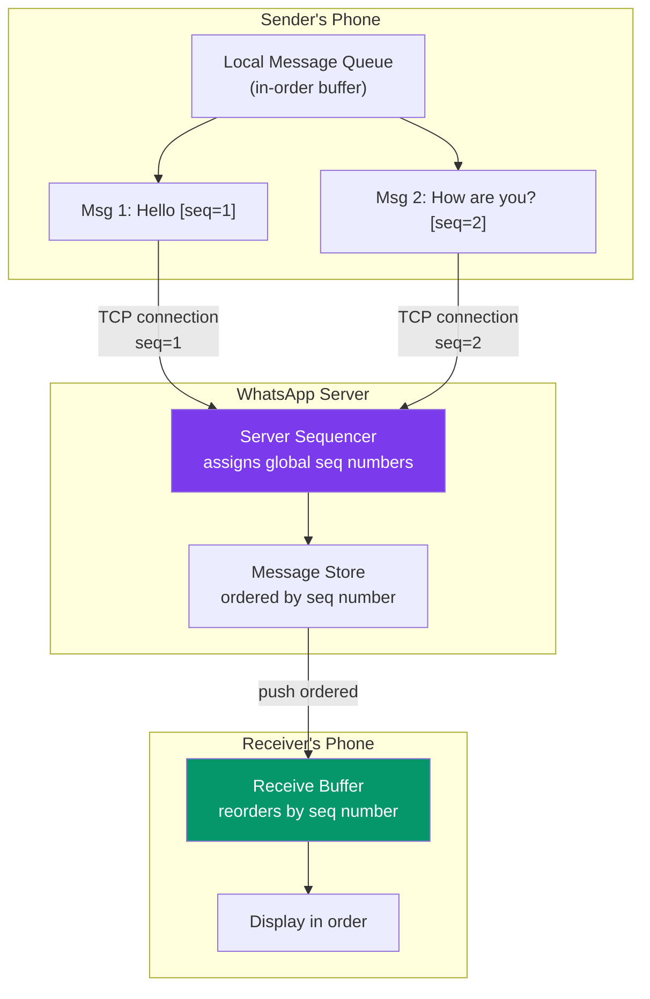

### The Technical Mechanisms

**Layer 1: Client-Side Sequence Numbers**
```
Each message gets a client-assigned sequence number before sending.
Sender's phone maintains an in-order queue.
Even if you're offline, messages are queued and sent in order when reconnected.

Implementation:
  Message 1: { content: "Hello", client_seq: 1, client_id: "siddesh_phone" }
  Message 2: { content: "How are you?", client_seq: 2, client_id: "siddesh_phone" }
```

**Layer 2: TCP Connection (Ordered Delivery)**
```
WhatsApp uses a persistent TCP connection.
TCP guarantees in-order delivery over the network.
Messages 1 and 2, sent over same TCP connection, arrive at server in order.

This handles network reordering automatically at the transport layer.
```

**Layer 3: Server-Side Sequencing**
```
WhatsApp's server assigns a global server sequence number to each message.
These are monotonically increasing per conversation (chat room).

Even if two servers receive concurrent messages from two participants:
  Server assigns seq=1 to the first message it commits
  Server assigns seq=2 to the second

Recipients display in seq order — guaranteed globally ordered display.
```

**Layer 4: Causal Consistency for Replies**
```
When Priya replies to your message:
  Her reply carries the seq number of the message she replied to.
  Server ensures the original message is processed before the reply.
  
This handles the causal dependency: you always see the original before the reply.
```

**Layer 5: Read Receipts and Acknowledgment**
```
Client sends message → receives ACK from server (seq assigned)
Only then is the message "confirmed sent"
If ACK not received → client retries (idempotent, same client_seq)
Duplicate prevention: server deduplicates by client_id + client_seq
```

### What If Recipient is Offline?

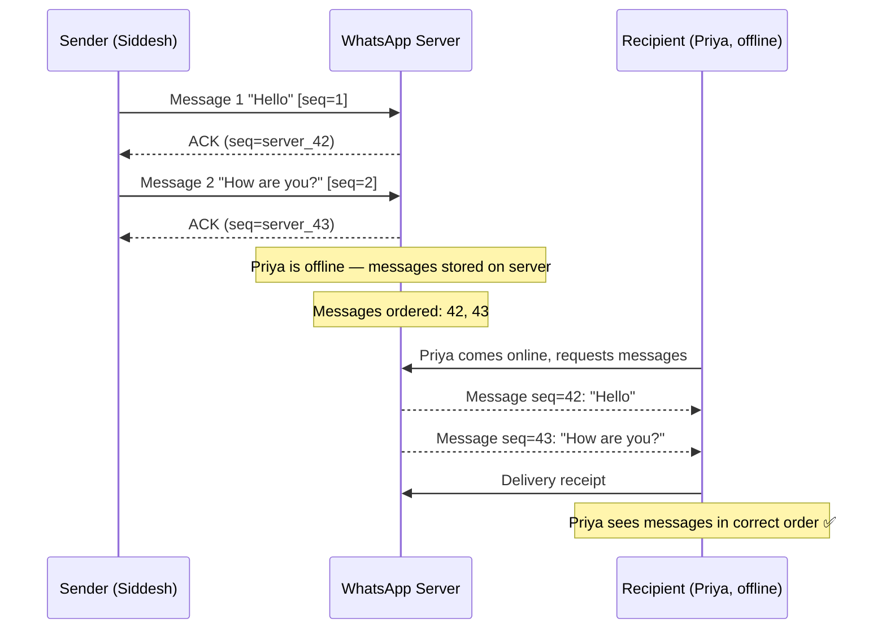

### The Full Answer for Interview

**"WhatsApp ensures message ordering through multiple complementary mechanisms:**

1. **Client-side sequence numbers** — each client assigns monotonically increasing sequence numbers to messages before sending. This preserves sender-side ordering even across reconnects.

2. **TCP persistent connections** — the transport layer itself guarantees in-order delivery of messages from a single sender.

3. **Server-side global sequencer** — the WhatsApp server assigns conversation-scoped sequence numbers. All recipients read messages in this server-assigned order.

4. **Causal consistency for replies** — reply messages carry the sequence number of their parent, ensuring the parent is always visible before the reply.

5. **Offline delivery with ordering** — messages stored server-side in sequence order; delivered in bulk when recipient comes online.

6. **Idempotent retries** — if a message's ACK is lost, the client retries with the same client_seq. Server deduplicates, preventing duplicates while maintaining exactly-once delivery semantics.

**The consistency model here is causal consistency** — causally related messages (replies, reactions) are always seen in causal order. Concurrent messages from different senders may appear in any order (which is fine — they're unrelated)."

---

## 16. Common Interview Questions

### Q1: Bank transfer system — what consistency model?

**Answer:**
> Strong consistency — specifically serializable isolation or linearizability. Use ACID transactions (PostgreSQL/CockroachDB). Every debit and credit is atomic. We cannot allow two concurrent withdrawals to both succeed when the balance is insufficient. Accept higher latency; correctness is non-negotiable.
>
> At scale: use serializable transactions with row-level locking, or optimistic concurrency (compare-and-swap). For multi-region: Google Spanner gives globally linearizable transactions.

---

### Q2: Design Instagram feed — what consistency model?

**Answer:**
> Eventual consistency with read-your-writes for the posting user.
>
> For the feed of other users: eventual consistency is fine. Someone seeing your post 2 seconds late is acceptable. Use async replication (Cassandra or DynamoDB) for massive throughput.
>
> For YOU seeing your own post: read-your-writes guarantee. After you post, route your own profile reads to the primary (or include a write token) for 30 seconds. After that, replica lag has caught up.

---

### Q3: What is a CRDT? Give a real example.

**Answer:**
> A CRDT (Conflict-free Replicated Data Type) is a data structure where concurrent writes can always be merged without conflict — mathematically guaranteed by its structure.
>
> Real example: Google Docs uses a text CRDT. If Siddesh types "Hello" and Priya simultaneously types "World" in the same document, the CRDT algorithm merges both insertions correctly — you get "HelloWorld" (or similar), not a conflict error and not a lost edit.
>
> Another example: A G-Counter (Grow-Only Counter) for YouTube views. Node A counts 1M views, Node B counts 2M views. Merge = 3M total. No matter what order nodes sync, the total is always correct.

---

### Q4: R + W > N — explain this with an example.

**Answer:**
> N is the replication factor (total replicas). W is how many replicas must confirm a write. R is how many replicas must respond to a read.
>
> If W + R > N, then any read quorum MUST overlap with any write quorum — guaranteeing at least one reader has the latest write.
>
> Example: N=5, W=3, R=3. W+R=6 > 5. Write confirmed by nodes {1,2,3}. Read from nodes {3,4,5}. Node 3 is in both sets — it has the latest data! Read returns the latest value.
>
> If W=1, R=1: W+R=2 ≤ 5. Write goes to node 1. Read goes to node 5. Node 5 might not have the write yet. Eventual consistency only.

---

### Q5: Explain replication lag and how to handle it.

**Answer:**
> Replication lag is the delay between when a write commits on the primary and when it's visible on replicas. On a loaded system or cross-datacenter replication, this can be 10ms to several seconds.
>
> It causes stale reads — a client reads from a replica that hasn't caught up yet.
>
> Solutions:
> 1. Read from primary for critical reads (always fresh, but primary becomes bottleneck)
> 2. Sticky sessions — route user to same replica consistently (they see their own writes)
> 3. Write tokens — after write, carry version number; route reads to replicas at least that version
> 4. Synchronous replication — primary waits for replica ACK before confirming (zero lag, but higher latency)
> 5. Quorum reads — read from multiple replicas and take the latest (W+R>N)

---

### Q6: ACID vs BASE — when would you choose each?

**Answer:**
> ACID when: correctness is non-negotiable. Bank transfers, inventory management, booking systems (flights, hotels). Use PostgreSQL, CockroachDB, or Spanner. Accept higher latency.
>
> BASE when: scale and availability matter more than perfect freshness. Social media feeds, analytics pipelines, IoT telemetry, CDN caches, shopping cart. Use Cassandra, DynamoDB, or MongoDB (default settings). Accept eventually consistent reads.
>
> Many modern systems use both: ACID for the core transactional domain (payments, orders) and BASE for supporting systems (activity feeds, analytics, notifications).

---

### Q7: How does Cassandra's tunable consistency work?

**Answer:**
> Cassandra stores N replicas of each partition (typically N=3). On each query, you specify a consistency level that determines how many replicas must respond.
>
> ONE: Write/read from 1 replica — fastest, eventual consistency.
> QUORUM: Write/read from majority (N/2 + 1 = 2 of 3) — W+R > N, so strong consistency.
> ALL: Write/read from all 3 — strongest, but any dead node blocks the operation.
>
> The sweet spot is QUORUM for reads and writes — you get strong consistency while tolerating one node being down. Per query tuning lets you use ONE for non-critical reads (huge performance gain) and QUORUM only where accuracy matters.

---

### Q8: What is the difference between sequential and causal consistency?

**Answer:**
> Sequential consistency: all operations appear in SOME total order. Every node agrees on the same history. But that history might not match real-time — a write that happened at T=5 might appear "after" a read at T=10 in the global order. Program order is preserved for each client.
>
> Causal consistency: only causally related operations are ordered. If A happened before B (A caused B), all nodes see A before B. But concurrent (causally unrelated) operations can appear in any order on different nodes.
>
> Causal is weaker than sequential: sequential requires a TOTAL order of ALL operations; causal only requires ordering where there's a causal relationship.
>
> Example: Two users post independent messages at the same time. Sequential consistency picks some order for them. Causal consistency says "they're concurrent — no ordering required." But if User 2 REPLIES to User 1's message, causal guarantees the reply is always seen after the original.

---

## 17. Key Takeaways

```
╔══════════════════════════════════════════════════════════════════════╗
║                    KEY TAKEAWAYS — CONSISTENCY MODELS                ║
╠══════════════════════════════════════════════════════════════════════╣
║                                                                      ║
║  1. CONSISTENCY IS A SPECTRUM                                        ║
║     Linearizable → Sequential → Causal → Eventual                   ║
║     Stronger = safer but slower. Weaker = faster but riskier.       ║
║                                                                      ║
║  2. REPLICATION LAG IS THE ROOT CAUSE                                ║
║     Async replication creates a window of inconsistency.             ║
║     Solutions: primary reads, sticky sessions, write tokens,         ║
║     quorum reads, or sync replication.                               ║
║                                                                      ║
║  3. ACID = CORRECTNESS FIRST (SQL DBs)                              ║
║     Atomicity, Consistency, Isolation, Durability.                   ║
║     Use for money, inventory, anything where stale = catastrophic.   ║
║                                                                      ║
║  4. BASE = AVAILABILITY FIRST (NoSQL DBs)                           ║
║     Basically Available, Soft state, Eventually consistent.          ║
║     Use for feeds, caches, analytics, IoT — stale is acceptable.    ║
║                                                                      ║
║  5. QUORUM: W + R > N = STRONG CONSISTENCY                          ║
║     The mathematical foundation of distributed consistency.          ║
║     QUORUM writes + QUORUM reads always overlap.                     ║
║                                                                      ║
║  6. SESSION GUARANTEES ARE PRACTICAL MIDDLE GROUND                  ║
║     Read-your-writes (RYW) fixes the Instagram story problem.        ║
║     Monotonic reads prevents "time going backwards."                 ║
║     You don't need global linearizability — per-user is enough.      ║
║                                                                      ║
║  7. CONFLICT RESOLUTION STRATEGIES                                   ║
║     LWW: Simple but silent data loss possible.                       ║
║     Vector Clocks: Detect concurrency, let app decide.               ║
║     CRDTs: Mathematical conflict-freedom — best for collaboration.   ║
║                                                                      ║
║  8. CASSANDRA'S TUNABLE CONSISTENCY                                  ║
║     Choose per-query: ONE for speed, QUORUM for correctness.         ║
║     Mix and match — critical queries use QUORUM, others use ONE.     ║
║                                                                      ║
║  9. WHATSAPP-STYLE ORDERING = CAUSAL + SEQUENCER                    ║
║     Client seq numbers + TCP ordering + server seq + causal          ║
║     consistency = messages always arrive in the right order.         ║
║                                                                      ║
║  10. NO SILVER BULLET — MATCH MODEL TO REQUIREMENTS                 ║
║      Bank? Strong. Social feed? Eventual. Chat? Causal.              ║
║      Most systems use MULTIPLE models for different components.       ║
║                                                                      ║
╚══════════════════════════════════════════════════════════════════════╝
```

### The One-Sentence Mental Model for Each Concept

| Concept | One-Sentence Mental Model |
|---|---|
| Linearizability | Feels like one server — every read sees the latest write, always |
| Sequential Consistency | Everyone agrees on history, but history might be slightly behind real time |
| Causal Consistency | Cause always comes before effect — replies never appear before questions |
| Eventual Consistency | Give it time with no new writes, and all replicas converge |
| Read-Your-Writes | You always see your own changes — even if others don't yet |
| Monotonic Reads | Time never goes backwards — once you see v2, you'll never see v1 again |
| ACID | All-or-nothing transactions that survive crashes — correctness first |
| BASE | Always respond, converge eventually — availability first |
| Replication Lag | The delay between "written on primary" and "visible on replica" |
| Last-Write-Wins | When in doubt, keep the most recent timestamp — simple but lossy |
| Vector Clocks | Causality tracker — tells you if two events are ordered or concurrent |
| CRDTs | Data structures where concurrent writes always merge without conflict |
| Quorum (W+R>N) | Overlap guarantee — read set always includes at least one write node |
| Tunable Consistency | Choose your trade-off per query — speed vs. correctness |

---

## Practice Exercises

**Choose the right consistency model and explain why:**

1. **UPI / NEFT payment transfer** — debit one account, credit another
2. **YouTube video view count** — billions of views per day
3. **Swiggy order status** — you want to track "Preparing → Picked Up → Delivered"
4. **WhatsApp group chat** — multiple people sending messages simultaneously
5. **Netflix "Continue Watching" position** — resume from where you left off
6. **Ola driver GPS location** — updates every 3 seconds, shown to rider

<details>
<summary>Solutions (Click to Expand)</summary>

**1. UPI Payment Transfer: Linearizable + ACID**
Money is the canonical case for strong consistency. Use serializable ACID transactions. Both the debit and credit must be atomic — no partial states. If any step fails, full rollback. PostgreSQL or a distributed ACID DB (CockroachDB/Spanner) at scale.

**2. YouTube View Count: CRDT (G-Counter) + Eventual**
Billions of increments per day — you cannot use a single counter with locks. Use sharded G-Counters across many nodes. Each server tracks its own count segment. Periodically merge all segments for the displayed total. The count might be slightly stale (a few seconds), but that's fine. No one cares if a video shows "1,234,567" vs "1,234,569" views.

**3. Swiggy Order Status: Causal Consistency + Read-Your-Writes**
Each status update causally depends on the previous one. You cannot see "Delivered" before "Picked Up." Causal consistency ensures correct ordering. You (the customer) need read-your-writes so your latest refresh always shows the current state, not stale data from a lagging replica.

**4. WhatsApp Group Chat: Causal Consistency + Server Sequencer**
Messages must be causally ordered (replies after originals). Concurrent messages from different users can appear in any order. The server assigns sequence numbers per conversation. Combine causal consistency with a server-side sequencer for predictable ordering.

**5. Netflix Continue Watching: Eventual Consistency + Last-Write-Wins**
Your watch position (e.g., "Episode 3, 42:15") can tolerate being slightly stale. If you watched on your phone and switch to TV, the TV might resume 30 seconds behind where you left off — annoying but not catastrophic. LWW works: most recent write (latest timestamp) wins. Eventual consistency is fine here.

**6. Ola Driver GPS: Eventual Consistency + LWW**
Driver location updates every 3 seconds. Slightly stale by 1-2 seconds is completely acceptable — the driver is still near that position. Prioritize write throughput (millions of location updates per second across all drivers). LWW ensures the latest position wins. No conflicts possible — only one driver writes to their own location record.

</details>

---

## Next Steps

Continue to [Load Balancing](../10-load-balancing/README.md) to learn how traffic is distributed across the very servers whose consistency we've been discussing.

---

*This note covers the complete consistency landscape for distributed systems interviews and real-world design. The topic connects deeply with [Replication](../08-replication/README.md), [CAP Theorem](../07-cap-theorem/README.md), and [Database Selection](../06-databases/README.md).*
