# Scaling Systems: Vertical vs Horizontal

> "Every system that succeeded eventually had to scale. Every system that failed to scale eventually became irrelevant."

---

## Table of Contents

1. [Why Scaling Matters — The Million-User Problem](#1-why-scaling-matters)
2. [Vertical Scaling: Scale Up](#2-vertical-scaling-scale-up)
3. [Horizontal Scaling: Scale Out](#3-horizontal-scaling-scale-out)
4. [Vertical vs Horizontal — Head to Head](#4-vertical-vs-horizontal-head-to-head)
5. [The Scaling Ladder — Evolution Diagram](#5-the-scaling-ladder)
6. [Making Services Stateless](#6-making-services-stateless)
7. [Auto-Scaling — Pay Only for What You Use](#7-auto-scaling)
8. [Database Scaling Strategies](#8-database-scaling-strategies)
9. [Scaling Non-Obvious Bottlenecks](#9-scaling-non-obvious-bottlenecks)
10. [Real Case Study: Instagram's 10x Growth](#10-real-case-study-instagram)
11. [The Scaling Decision Framework](#11-the-scaling-decision-framework)
12. [Common Interview Questions](#12-common-interview-questions)
13. [Key Takeaways](#13-key-takeaways)

---

## 1. Why Scaling Matters

### The Simple Analogy

Socho ek dhaba hai — 5 log aate hain toh ek chef kaafi hai. Ek plate mein khana serve kar do, sab khush. Ab agar ek din achanak 5000 log aa jayein? Woh ek chef kya karega? Servers crash hoga, log wait karenge, aur ultimately sab chhod ke chale jayenge.

Yehi scaling ka problem hai. **1 user ke liye design kiya hua system, 1 million users pe toot jaata hai.**

### Why 1 User is Easy, 1 Million Users Breaks Everything

When you build for 1 user:
- One database connection is enough
- One server handles all requests
- In-memory state works fine
- You don't worry about network latency
- A simple `SELECT *` query runs in milliseconds

When 1 million users hit your system simultaneously:

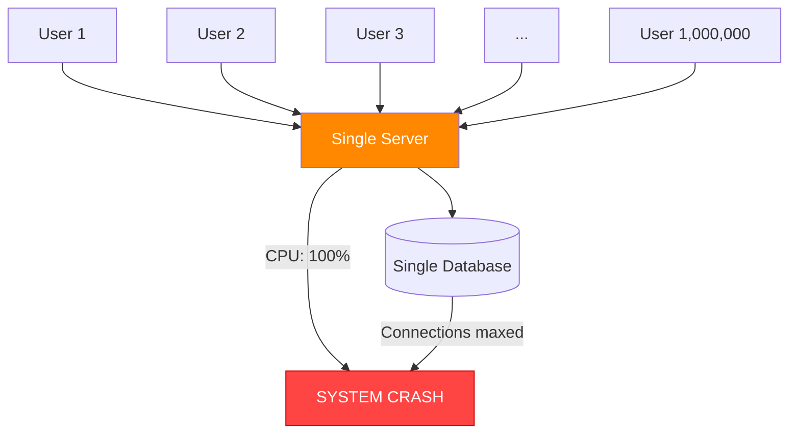

**Real numbers that break things:**
- PostgreSQL default: **100 max connections**. 1M users? You need connection pooling.
- A single Node.js process: handles ~10K concurrent requests before latency spikes
- A single-threaded server with 1TB database: a `SELECT COUNT(*)` takes seconds, not milliseconds
- A single server's network card: typically 1-10 Gbps. Netflix streams 4K at ~25 Mbps per user. Do the math.

### The Cost of Not Scaling

| Event | What Happened | Business Impact |
|-------|---------------|-----------------|
| Amazon — 2013 outage | 40 min downtime | $5 million lost |
| Facebook — 2021 outage | 6 hours down | ~$60M in ad revenue lost |
| Zomato — peak dinner hour | Servers overwhelmed | Orders dropped, app crashed |
| Hotstar — IPL 2023 | 32M concurrent viewers | Required months of scale prep |

**Interview Tip:** Jab bhi "design a system for X users" poochhe, pehle samjho current load vs expected peak load. Difference yahi batata hai ki tumhe scaling ki zaroorat hai ya nahi.

---

## 2. Vertical Scaling (Scale Up)

### The Simple Analogy

Ek auto-rickshaw hai. Zyada log fit karne hain? Bade auto mein upgrade karo. Phir minibus. Phir bus. Phir double-decker bus. But ek point aata hai jab road pe aur bada vehicle nahi ja sakta. **Yahi vertical scaling ki limit hai.**

### What is Vertical Scaling?

Simple baat hai — **same machine ko upgrade karo**. More RAM, faster CPU, bigger disk, better network card. Your code stays the same, your architecture stays the same, but the machine underneath gets beefier.

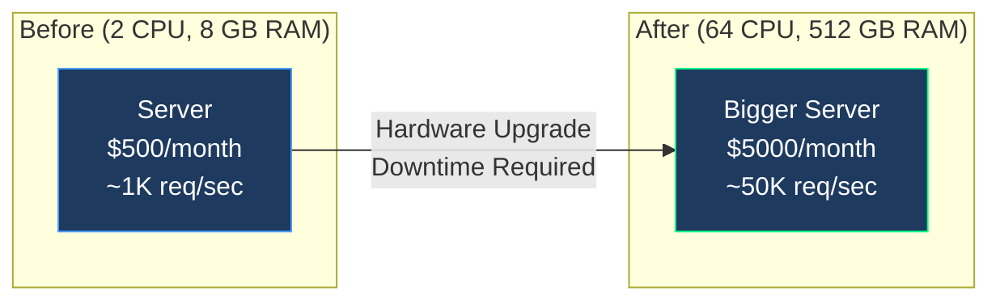

### How It Works — Step by Step

1. Your app gets slower under load (CPU at 90%, RAM nearly full)
2. You order a bigger machine (or upgrade the instance type on AWS)
3. You take the server offline for maintenance
4. You migrate your app to the new machine
5. Server comes back online
6. Everything works faster — for now

### Pros of Vertical Scaling

- **Zero code changes**: Your app doesn't know or care — it just runs on a faster machine
- **No distributed system problems**: No network partitions, no data sync issues, no split-brain scenarios
- **Better single-thread performance**: A faster CPU clock speed directly helps single-threaded workloads
- **Simple operations**: One machine to monitor, patch, back up
- **Low latency**: No inter-server network calls

### Cons of Vertical Scaling

- **Hard upper limit**: There's a biggest machine possible, and you'll hit it
- **Single Point of Failure (SPOF)**: Server goes down, everything goes down. Full stop.
- **Requires downtime**: Upgrading hardware usually means taking the server offline
- **Exponential cost curve**: Going from 8GB to 16GB RAM might cost 2x. Going from 500GB to 1TB might cost 10x.
- **Waste during low traffic**: You're paying for peak capacity 24/7, even at 3am when traffic is 1% of peak

### The Real Limit — AWS's Biggest Machine

The biggest EC2 instance on AWS right now is the `u-24tb1.112xlarge`:
- **24 TB of RAM**
- **448 vCPUs**
- **~$220/hour** (yes, per hour)

Sounds like a lot? **Amazon.com itself cannot run on one machine.** They process millions of requests per second. No single machine on Earth can handle that. This is the fundamental limit of vertical scaling.

```
AWS Instance Progression (cost jumps):
─────────────────────────────────────
t3.micro    →  2 vCPU,   1 GB RAM   →  $0.01/hr
t3.large    →  2 vCPU,   8 GB RAM   →  $0.08/hr  (8x cost, 8x RAM)
m5.xlarge   →  4 vCPU,  16 GB RAM   →  $0.19/hr
m5.4xlarge  → 16 vCPU,  64 GB RAM   →  $0.77/hr
m5.24xlarge → 96 vCPU, 384 GB RAM   →  $4.61/hr
x1e.32xlarge→128 vCPU,3904 GB RAM   → $26.69/hr (2650x cost for 3900x RAM)
```

The cost doesn't scale linearly — it curves upward steeply. **Horizontal scaling with commodity hardware is almost always cheaper at scale.**

### When to Use Vertical Scaling

- Early-stage startups (0 to ~100K users)
- Databases — always scale up before scaling out
- When your team doesn't have distributed systems expertise
- When simplicity matters more than cost efficiency
- Legacy applications that can't be made stateless easily

---

## 3. Horizontal Scaling (Scale Out)

### The Simple Analogy

Ek cashier slow hai queue mein? 5 cashier rakh do. 10 rakh do. 100 rakh do. Koi limit nahi (practically). **Yahi horizontal scaling hai — ek machine nahi, bahut saari machines.**

### What is Horizontal Scaling?

Instead of making one machine bigger, you add more machines of the same size. A load balancer sits in front and distributes incoming requests across all your servers.

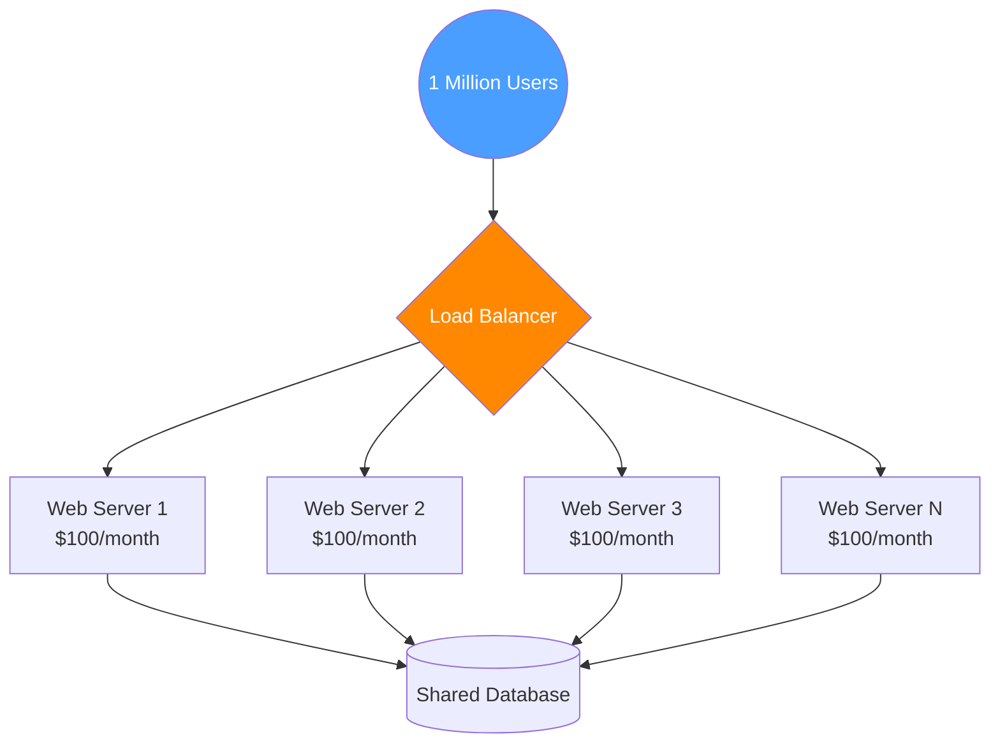

### How It Works

1. You put a **load balancer** in front (nginx, AWS ALB, HAProxy)
2. Load balancer receives all incoming requests
3. It distributes requests across your fleet of servers (round-robin, least-connections, etc.)
4. Each server handles its slice of the traffic
5. If one server dies, load balancer routes traffic to the remaining servers
6. To scale up: just spin up more servers

### Pros of Horizontal Scaling

- **Theoretically infinite scale**: Just add more machines. Google runs millions of servers.
- **Fault tolerance**: One server crashes? The other 99 keep running. Users barely notice.
- **No downtime to scale**: Spin up new servers alongside existing ones, then add them to the pool
- **Cheaper at scale**: $100 commodity servers vs $220/hr monster machines
- **Geographic distribution**: Put servers in Mumbai, Singapore, US — users get low latency everywhere
- **Cost-proportional scaling**: More load → more servers. Light load → fewer servers. Pay for what you use.

### Cons of Horizontal Scaling

- **Complex architecture**: Load balancers, service discovery, health checks — lots of moving parts
- **Stateless requirement**: Your app servers must not store session state locally (more on this below)
- **Distributed systems problems**: Network partitions, clock skew, split-brain — these don't exist on single servers
- **Database bottleneck**: Adding web servers is easy. The database still struggles. (That's why DB scaling is a whole topic.)
- **Operational overhead**: 100 servers need monitoring, patching, logging aggregation
- **Harder debugging**: A request might hit server 1 for step A and server 47 for step B. Tracing is complex.

### Real Example — Netflix

Netflix handles **200+ million subscribers**. On a Friday evening when everyone's binge-watching:
- ~15 million concurrent streams
- Each stream at ~5 Mbps average = 75 Tbps of bandwidth
- Thousands of microservices running on hundreds of thousands of servers

No single machine on Earth handles this. Netflix scales horizontally so aggressively that they run on **AWS across 3 regions with automatic failover**. When an entire AWS region goes down, Netflix keeps streaming.

---

## 4. Vertical vs Horizontal — Head to Head

| Dimension | Vertical Scaling | Horizontal Scaling |
|-----------|-----------------|-------------------|
| Approach | Bigger machine | More machines |
| Code changes | None | Must be stateless |
| Upper limit | Hard limit (biggest machine) | Practically unlimited |
| Fault tolerance | Single point of failure | Highly fault tolerant |
| Cost at scale | Very expensive (exponential) | Cheaper (linear) |
| Complexity | Low | High |
| Downtime to scale | Yes (hardware swap) | No (add servers online) |
| Best for | Databases, early stage | Large distributed systems |
| When it breaks | You hit hardware ceiling | When state isn't managed right |
| Latency | Lower (no inter-server calls) | Slightly higher |

**The real-world answer:** You use BOTH. Scale up your database. Scale out your web tier. Yeh dono saath mein kaam karte hain.

---

## 5. The Scaling Ladder

### From One Server to Global Scale — Evolution

Yeh ladder batata hai ki ek startup kaise ek server se shuru hokar millions of users tak pahunchta hai. Every rung is a response to a specific bottleneck.

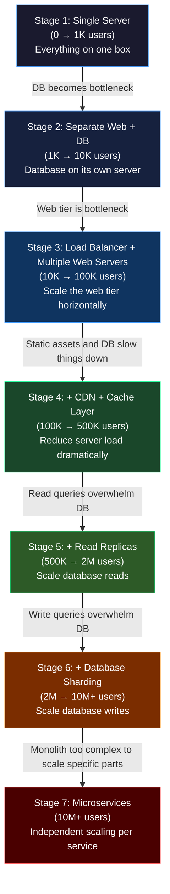

### Stage 1: Single Server (0 to ~1K users)

**Everything on one machine** — web server, application, database, cache, everything.

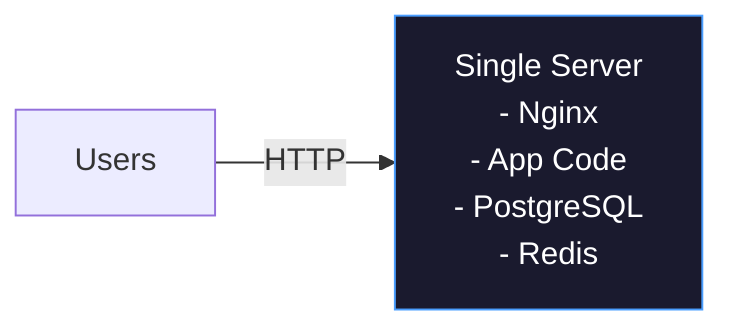

**Bottleneck:** The server itself. CPU, RAM, or disk gets maxed out. Usually the database is the first thing to cry.

**Fix:** Move to Stage 2.

### Stage 2: Web + DB Separate

**Why?** The database has very different resource needs (lots of disk I/O, memory for caching) vs the web server (CPU for processing). Separating them lets you tune each independently.

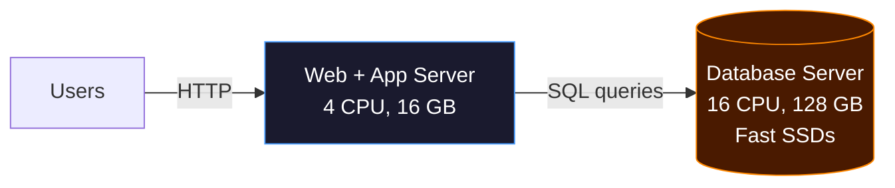

**Bottleneck:** Web server gets overwhelmed. Single web server handles 10K-50K req/sec before choking.

**Fix:** Move to Stage 3.

### Stage 3: Load Balancer + Multiple Web Servers

This is when horizontal scaling truly begins.

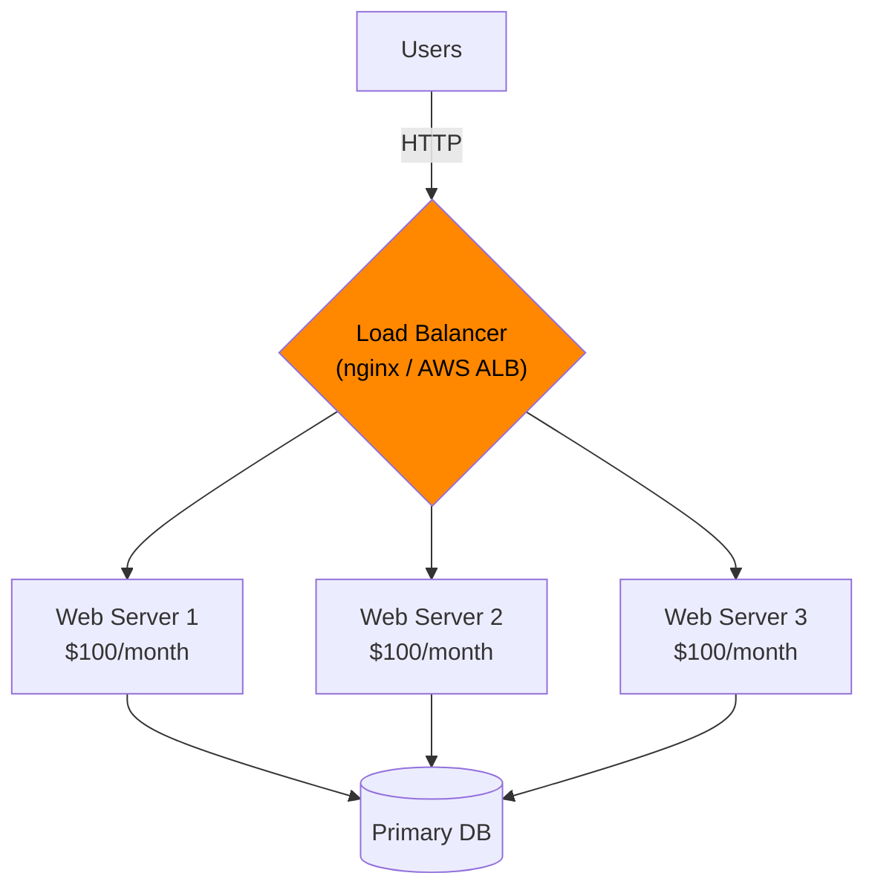

**Bottleneck:** Static assets (images, JS, CSS) still served from your servers. Database reads are increasing.

**Fix:** Move to Stage 4.

### Stage 4: CDN + Cache Layer

**CDN** (Content Delivery Network): Static files served from servers close to the user. Swiggy's food images don't come from their Mumbai datacenter when you're in Bangalore — they come from a Bangalore CDN edge node.

**Cache (Redis/Memcached):** Frequently accessed data stored in RAM instead of hitting the database every time.

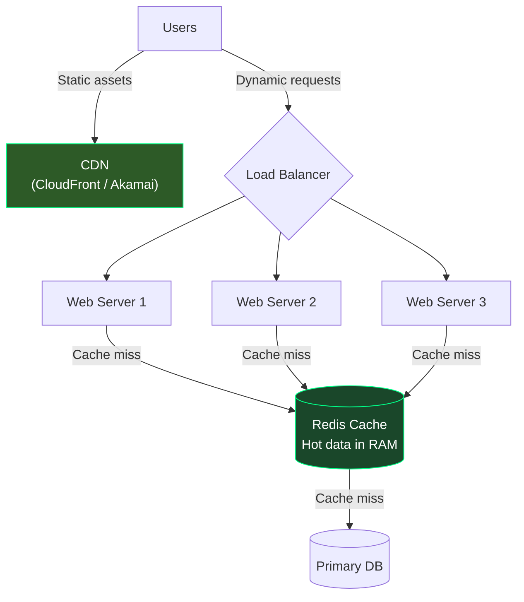

**Result:** 80% of reads served from cache. DB load drops dramatically.

### Stage 5: Read Replicas

DB reads are still high. Solution: **replicate the database** and route all reads to replicas.

(See detailed diagram in Database Scaling section below.)

### Stage 6: Database Sharding

Writes are the bottleneck now. Solution: **shard the database** — partition data across multiple independent database servers.

(See detailed diagram in Database Scaling section below.)

### Stage 7: Microservices

The monolith can't scale specific hotspots efficiently. Instagram's photo upload service has totally different scaling needs than its notification service. **Split into independent services that scale independently.**

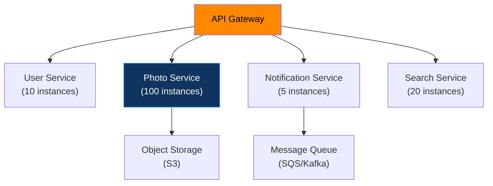

---

## 6. Making Services Stateless

### The Simple Analogy

Socho ek restaurant hai jahan har waiter sirf ek specific table ke orders yaad rakhta hai (state). Agar woh waiter beemar pade toh table ke log bhuke rahenge. Ab socho waiter ko ek tablet de do jahan sab orders likhein — koi bhi waiter kisi bhi table ko serve kar sakta hai. **Yahi stateless service hai.**

### Why Stateful Servers Can't Scale Horizontally

This is the **most important concept** to understand about horizontal scaling.

**Stateful server problem:**

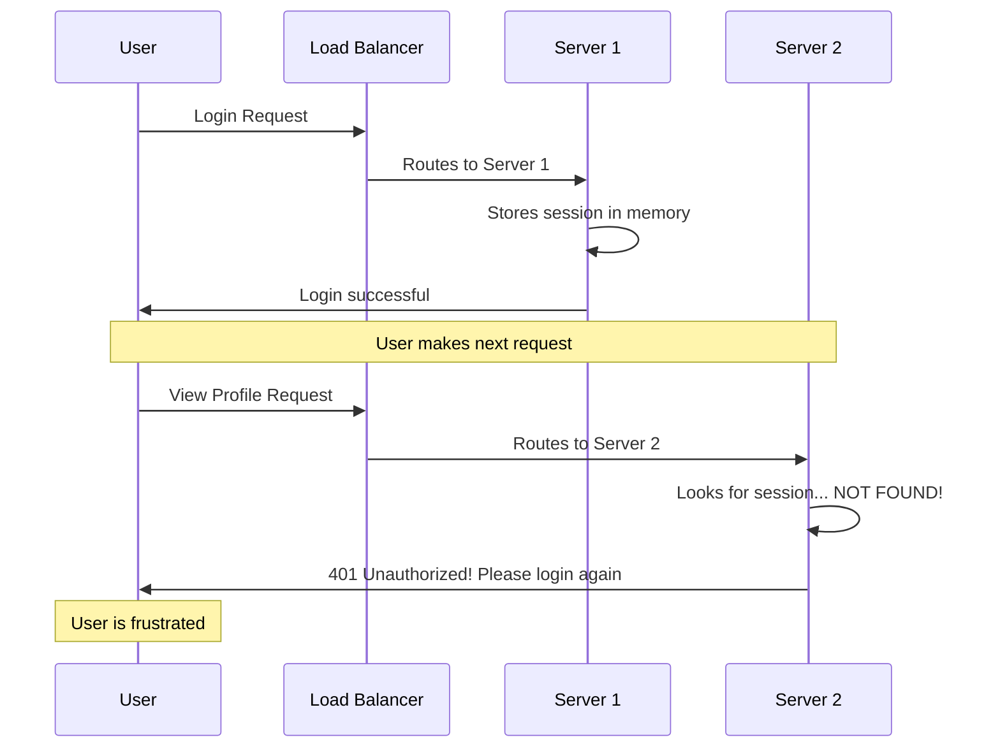

The user gets randomly logged out depending on which server the load balancer sends them to. This is broken.

**Bad workarounds people try (and why they fail):**

1. **Sticky sessions (session affinity):** Always route user to the same server. Problem: if that server dies, user loses session. Also creates uneven load distribution.
2. **Copying session to all servers:** Huge overhead. Every login needs to broadcast to all N servers.

### The Right Solution: Externalize State

Move session storage out of the web server's memory into a **shared external store**.

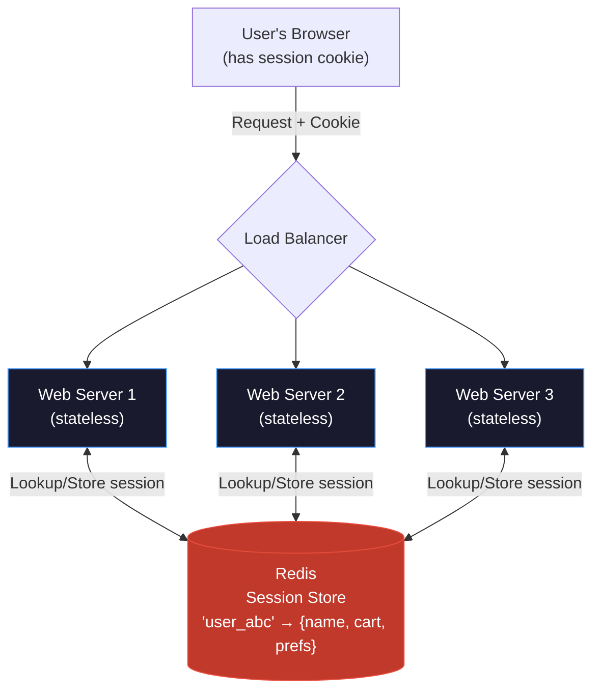

**How it works:**
1. User logs in → Server generates session ID → Stores `{sessionId: "abc123", userId: 5, cart: [...]}` in Redis
2. Server sends cookie with `sessionId=abc123` to browser
3. Every subsequent request: browser sends cookie → **any** web server reads from Redis → gets user's full context
4. Web servers are now completely interchangeable and replaceable

**Technologies:**
- **Redis** — most popular, in-memory, blazing fast, supports TTL (auto-expiry)
- **Memcached** — simpler, slightly faster for pure caching, no persistence
- **Database** — works but too slow for session lookups (50-100ms vs Redis's 1ms)

### What "Stateless" Means for Your Web Server

A stateless web server:
- Stores NOTHING in its local memory between requests
- All user state lives in Redis, the database, or the client's JWT token
- Can be killed and replaced at any time without impacting users
- Is identical to all other instances — truly fungible

**Interview Tip:** "To scale horizontally, your application tier must be stateless. All shared state — sessions, locks, counters — must live in an external store like Redis. This makes web servers disposable and interchangeable."

---

## 7. Auto-Scaling

### The Simple Analogy

Swiggy pe IPL final ke din orders bahut zyada hote hain. Raat 2 baje almost zero. Agar Swiggy har waqt "IPL final capacity" pe chal raha hota toh paise barbaad hote. **Auto-scaling matlab: jab load zyada toh servers zyada, jab kam toh servers kam.** Electricity bill ki tarah — use karo toh pay karo.

### Why Auto-Scaling Matters

Without auto-scaling:
- You provision for PEAK load → paying for peak capacity 24/7
- During off-peak (3am), you're running at 2% utilization but paying 100% cost
- During unexpected spikes (news event, sale), you're under-provisioned and crash

With auto-scaling:
- Scale out when CPU > 70% for 5 minutes
- Scale in when CPU < 30% for 10 minutes
- Pay only for what you actually use

### How Auto-Scaling Works

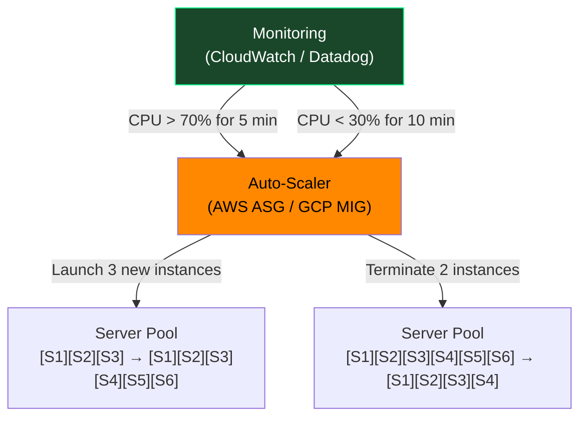

### Auto-Scaling Metrics — What to Watch

| Metric | Scale Out When... | Scale In When... |
|--------|-------------------|-----------------|
| CPU utilization | > 70% for 5 min | < 25% for 15 min |
| Memory usage | > 80% | < 40% |
| Request queue depth | Queue > 100 messages | Queue < 10 |
| Response time (p99) | p99 > 500ms | p99 < 100ms |
| Active connections | > 80% of max | < 30% of max |

### Predictive Auto-Scaling

Advanced systems don't wait for load to spike — they predict it:

- **Zomato:** Knows that lunch rush starts at 12:00 PM every day. Auto-scales at 11:45 AM proactively.
- **Hotstar:** Knows IPL match starts at 7:30 PM. Pre-warms servers at 7:00 PM.
- **E-commerce sites:** Knows Diwali sale starts at midnight. Scales at 11:45 PM.

Reactive scaling (CPU spike → scale) has a lag of 3-5 minutes. Pre-warming eliminates that lag.

### Cost Impact of Auto-Scaling

```
Without Auto-Scaling (manual provisioning for peak):
─────────────────────────────────────────────────────
Peak servers needed: 100
Cost: 100 × $0.10/hr × 720 hrs/month = $7,200/month

With Auto-Scaling (actual usage pattern):
──────────────────────────────────────────
Off-peak (8 hours/day at 10 servers):  10 × $0.10 × 8 × 30 = $240
Medium load (12 hours/day at 40 servers): 40 × $0.10 × 12 × 30 = $1,440
Peak (4 hours/day at 100 servers):  100 × $0.10 × 4 × 30 = $1,200

Total: $2,880/month
Savings: 60% cost reduction
```

---

## 8. Database Scaling Strategies

### Why the Database is Always the Hard Part

Web servers are stateless and easy to scale horizontally. **The database has state — all of it, all the time.** That's what makes it hard.

The three main strategies are:
1. **Read Replicas** — scale read queries
2. **Sharding** — scale write queries
3. **Caching** — reduce database load entirely

---

### Strategy 1: Read Replicas (Scale Reads)

#### The Analogy

Ek library mein ek hi original book hai jisme log changes kar sakte hain. Reads ke liye? Photocopy karo aur bahut saari rakh do. Log photocopies padh sakte hain (reads), original sirf librarian update karta hai (writes). **Yahi read replicas hai.**

#### How It Works

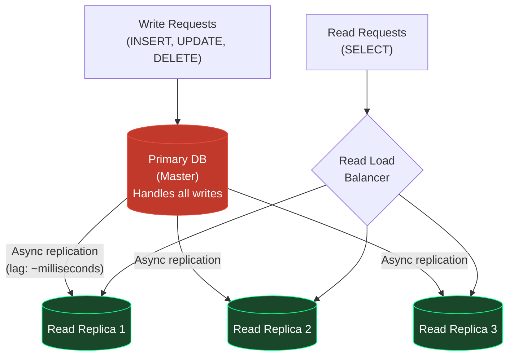

#### Real Numbers

```
Instagram's DB read/write ratio: ~99% reads, 1% writes
(People browse WAY more than they post)

Before read replicas: 1 DB server → 1K reads/sec max
After 5 read replicas: 6 DB servers → 6K reads/sec
Cost: 6x more DB servers, but web tier handles 6x more traffic
```

#### Replication Lag Problem

**This is the gotcha interviewers love.** Replication is async — there's a tiny delay (usually milliseconds, sometimes seconds under heavy load) between a write to primary and it appearing on replicas.

```
Scenario: User updates their profile picture
1. Write goes to Primary: "profile_pic = new_url" ✅
2. User immediately refreshes profile page
3. Read goes to Replica → still shows OLD profile picture (lag!)
4. User is confused
```

**Solutions:**
- For critical reads after writes: route to primary (not replica)
- Accept eventual consistency for non-critical data (feed, counters)
- Use synchronous replication for critical data (but this slows down writes)

#### When to Use Read Replicas

- Your app does far more reads than writes (social media, news sites, e-commerce browsing)
- Instagram uses this extensively — most queries are feed reads, not new posts
- YouTube: WAY more video views than uploads

---

### Strategy 2: Database Sharding (Scale Writes)

#### The Analogy

Mumbai city ka phone directory ek book mein nahi aata — too many people. So they split it: A-G in Volume 1, H-N in Volume 2, O-Z in Volume 3. Each phone operator handles only their volume. **Yahi sharding hai — data ko multiple databases mein partition karna.**

#### What is Sharding?

Sharding means splitting your data across multiple independent database instances. Each instance (shard) holds a subset of the data.

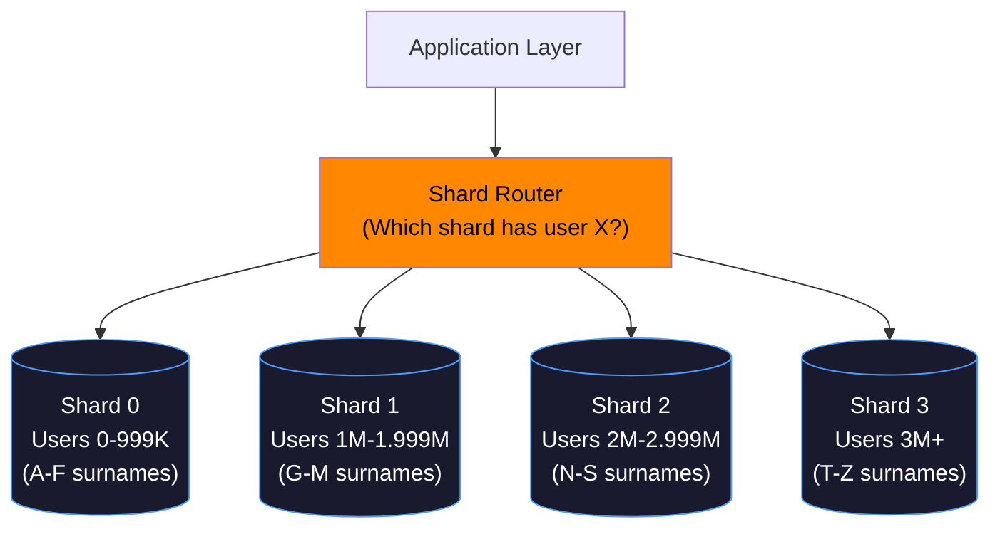

#### Sharding Strategies

**1. Range-Based Sharding**
```
Shard 0: user_id 0 to 999,999
Shard 1: user_id 1,000,000 to 1,999,999
...

Pro: Simple, easy range queries
Con: Hotspots — new users always go to the last shard
```

**2. Hash-Based Sharding**
```
shard = hash(user_id) % num_shards

user_id = 12345 → hash(12345) % 4 = 1 → Shard 1
user_id = 67890 → hash(67890) % 4 = 2 → Shard 2

Pro: Even distribution, no hotspots
Con: Range queries hard, resharding is painful
```

**3. Directory-Based Sharding**
```
Lookup table: { user_id_range → shard_id }
More flexible, can rebalance without rehashing
Con: Lookup table itself becomes a bottleneck
```

#### The Painful Problems with Sharding

This is why you delay sharding as long as possible:

| Problem | Why it hurts |
|---------|--------------|
| **Cross-shard queries** | "Find all users in Mumbai" → must query all shards, aggregate results |
| **Cross-shard transactions** | User A (Shard 0) sends money to User B (Shard 2) → distributed transaction nightmare |
| **Resharding** | When you need more shards, you must move half your data — while system is live |
| **Join operations** | Can't JOIN across shards at the DB level. Must do it in application code. |
| **Hotspot shards** | If celebrities are all in one shard, that shard is overwhelmed |

**WhatsApp's approach:** Shard by phone number. Each message between two users always hits the same shard. Group chats are trickier — they distribute group state across a small set of "group owner" shards.

---

### Strategy 3: Caching (Reduce DB Load)

#### The Analogy

Har baar customer ko pizza chahiye toh kitchen se fresh banaana padega? Nahi — popular items ready rakh lo counter pe. Cache exactly yehi karta hai: **frequently accessed data ko fast memory mein rakh do taaki database tak jaana hi na pade.**

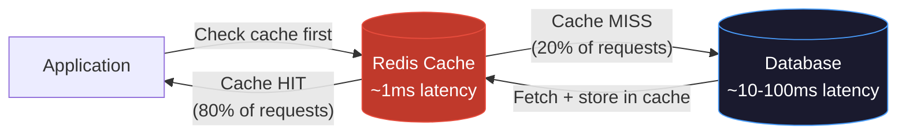

#### Cache Hit Ratio — The Key Metric

```
Instagram's cache hit rate: ~95-99%
(Most profile views hit cache, not DB)

Effect:
─────────
Without cache: 1M reads/sec → 1M DB queries/sec (DB dies)
With 99% cache hit: 1M reads/sec → 10K DB queries/sec (manageable)
```

#### Cache Eviction Policies

| Policy | How it works | Use case |
|--------|-------------|----------|
| LRU (Least Recently Used) | Evicts data not accessed recently | General purpose |
| LFU (Least Frequently Used) | Evicts least popular data | Content popularity |
| TTL (Time to Live) | Data expires after N seconds | Session data, API responses |
| Write-through | Write to cache AND DB simultaneously | Strong consistency needed |
| Write-back | Write to cache, DB updated async | High write throughput |

#### Cache Invalidation — The Hardest Problem in CS

> "There are only two hard things in Computer Science: cache invalidation and naming things." — Phil Karlton

When data changes in the DB, you must invalidate the cache. Otherwise users see stale data.

```
Strategies:
───────────
1. TTL-based: Cache expires after 5 minutes (simple, slightly stale)
2. Event-driven: DB write triggers cache delete (complex, always fresh)
3. Write-through: Update cache when DB updates (consistent, slower writes)
4. Cache-aside (lazy loading): App handles it, miss → load from DB → store
```

---

## 9. Scaling Non-Obvious Bottlenecks

Yeh woh problems hain jo beginners sochte nahi — lekin real systems mein yahi sabse pehle toot'te hain.

### 1. Database Connection Pool Exhaustion

**The Problem:**

```
PostgreSQL default max_connections = 100

Scenario: 50 web servers × 5 connections each = 250 connections
PostgreSQL CANNOT ACCEPT MORE. New queries: "FATAL: too many connections"
```

**Why this happens:**
Each web server instance keeps a pool of DB connections open (because opening a new TCP connection + DB handshake takes 10-50ms). With many web servers, you exhaust the DB's connection limit.

**Solution: PgBouncer / Connection Pooler**

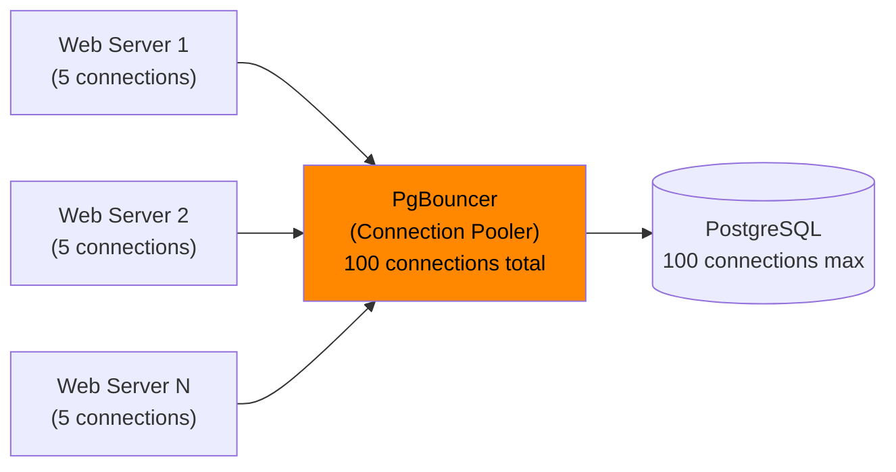

PgBouncer multiplexes thousands of application connections through a smaller pool of real DB connections. **Instagram runs PgBouncer in front of every PostgreSQL instance.**

### 2. File Descriptor Limits

**The Problem:**

On Linux, everything is a file: open sockets, files on disk, pipes. The OS limits how many files a process can have open simultaneously (default: 1024 on many systems).

```
Nginx with 1000+ concurrent connections: each is a file descriptor
1024 limit hit → "Too many open files" error → requests fail
```

**Solution:** Increase the ulimit:
```bash
ulimit -n 1000000
# Or in /etc/security/limits.conf:
# nginx soft nofile 1000000
# nginx hard nofile 1000000
```

This is a hidden scaling wall. Many companies only discover it when they scale to production load.

### 3. Network Bandwidth Saturation

**The Problem:**

```
Server NIC: 1 Gbps = 125 MB/sec
Average API response: 50 KB
Max requests/sec: 125,000 KB / 50 KB = 2,500 req/sec

That's it. No matter how powerful your CPU, network is the ceiling.
```

**Real example:** Video streaming. Netflix streams 4K at 25 Mbps per user. A server with 1 Gbps NIC can serve only 40 simultaneous 4K streams. This is why CDNs exist — distribute the bandwidth load across thousands of edge servers worldwide.

**Solutions:**
- CDN for static assets (images, video, CSS, JS)
- Response compression (gzip/brotli) — reduces payload by 60-80%
- Binary protocols instead of JSON (protobuf, messagepack)
- 10 Gbps or 25 Gbps NICs for high-traffic servers

### 4. CPU Context Switching Overhead

Running 10,000 threads on an 8-core CPU means constant context switching. Each switch costs ~1-2 microseconds. At 10K threads, this overhead dominates.

**Solution:** Event-loop architectures (Node.js, Nginx, Golang) handle thousands of concurrent connections with few threads. No blocking → no context switching → massive throughput.

### 5. DNS Resolution Bottleneck

**The hidden problem:** Every outbound API call your server makes requires DNS resolution. If your DNS server is slow or unavailable, ALL outbound calls block.

**Solution:** Local DNS caching (nscd), connection pooling with persistent HTTP connections, service mesh for internal communication.

---

## 10. Real Case Study: Instagram

### Background

Instagram was acquired by Facebook in April 2012 for $1 billion. At the time, they had:
- 13 employees
- 30 million users
- ~1 billion photos stored
- Running on Amazon EC2

The question: how did 13 people scale a system to handle 10x traffic growth?

### Instagram's Original Stack (2010 — Launch)

```
Web Tier:
  - 3 Amazon EC2 instances (nginx + Django)
  - 1 load balancer

Database:
  - PostgreSQL (photos, users, relationships)

Media Storage:
  - Amazon S3 (actual photo files)
  - Amazon CloudFront CDN

Cache:
  - Redis (in-memory, for hot data)

Queue:
  - Gearman (async tasks like pushing notifications)
```

### The 10x Traffic Problem — And What They Scaled in Order

#### Step 1: Solve the "Thundering Herd" Problem (Caching)

When a post from Justin Bieber (who had millions of followers on Instagram) went out, millions of requests would simultaneously try to read the post from the database. This is a "thundering herd."

**What they did:**
- Deployed Redis as the primary caching layer
- Cached user sessions, feed data, and post metadata in Redis
- Result: 99%+ of read traffic served from Redis, DB barely touched

```
Before: 10M requests → 10M DB queries (DB overwhelmed)
After:  10M requests → 100K DB queries (99% cache hit rate)
```

#### Step 2: Scale the Database — Read Replicas

As user base grew, writes stayed manageable but reads were enormous. Photo feed queries were the dominant workload.

**What they did:**
- Added PostgreSQL read replicas
- All `SELECT` queries routed to replicas
- Primary DB used only for writes (new posts, follows, likes)
- Result: Read capacity scaled linearly with number of replicas

#### Step 3: Handle the Photo Storage Scale

Photos are NOT stored in PostgreSQL — that would be insane. They used **Amazon S3** from day one for storing actual photo files. The DB only stored metadata (photo ID, user ID, timestamp, S3 URL).

At 1 billion photos (2012), object storage was the only answer. S3 scales infinitely. You just pay per GB stored and per GB transferred.

**CDN for photos:**
- User in Chennai hits `https://instagram.com/photos/abc.jpg`
- CloudFront CDN serves it from a Chennai edge node
- Photo loads in ~50ms instead of ~500ms from US servers

#### Step 4: Sharding PostgreSQL

As user base hit tens of millions, write throughput on a single PostgreSQL primary maxed out.

**Instagram's sharding approach (Shard by user_id):**
```
PostgreSQL shard selection:
  user_id 1 to 999,999     → PG Shard 0
  user_id 1M to 1.999M     → PG Shard 1
  ...

Key insight: Instagram used PostgreSQL schemas (not separate instances) 
initially — multiple "virtual shards" in one PostgreSQL instance, 
easier to manage.
```

They wrote a Python library called `ig-shard` (internal) to abstract shard routing.

#### Step 5: Django to Async — The Web Tier

Django (Python) is synchronous. 3 EC2 instances couldn't handle explosive growth.

**What they did:**
- Scaled EC2 fleet horizontally behind the load balancer
- Made Django instances stateless (sessions in Redis, not Django's in-memory store)
- Added Celery for async task processing (sending push notifications, resizing photos)
- Result: Web tier scaled smoothly — just add more EC2 instances

### The Instagram Scaling Timeline

```
Oct 2010: Launch — 25K users on day 1 (servers nearly die)
├── Emergency vertical scaling on web servers
└── Redis caching added immediately

Dec 2010: 1M users
├── Multiple EC2 web servers behind ELB (Elastic Load Balancer)
└── Read replicas added to PostgreSQL

Jun 2011: 5M users
├── PostgreSQL sharding begins
└── CDN fully utilized for all photo delivery

Apr 2012: 30M users (Facebook acquisition)
├── 3 web servers → dozens
├── Multiple PostgreSQL shards
├── Billions of Redis operations per day
└── Petabytes of photos on S3

2013: 100M users (Facebook integration begins)
├── Migration to Facebook's infrastructure
└── Instagram's scaling principles preserved and extended
```

### Key Lessons from Instagram

1. **Start simple, add complexity only when forced** — 13 people could not maintain a complex distributed system. They used managed AWS services (S3, RDS, ElastiCache) to avoid operational overhead.

2. **Cache everything possible** — Redis was the single most impactful addition. 99% cache hit rate means your DB doesn't feel the user growth.

3. **Shard by the right key** — Sharding by `user_id` means all of a user's data is co-located. Queries about a user are fast. Cross-user queries (feed aggregation) are handled in application code.

4. **Separate media from metadata** — Never store files in a relational database. S3 for files, PostgreSQL for metadata. This was correct from day 1.

5. **Make the web tier truly stateless** — Scaling from 3 to 30 web servers was trivial because all state lived in Redis.

---

## 11. The Scaling Decision Framework

### When to Scale Vertically vs Horizontally

```
Is the application stateless?
├── No → Fix this first (externalize state to Redis/Memcached)
└── Yes → Continue

Is the bottleneck the database?
├── Yes → Scale up DB, add read replicas, then cache, then shard
└── No → Scale web tier horizontally

Is cost the primary concern?
├── At small scale → Vertical scaling is simpler and cheap
└── At large scale → Horizontal is almost always cheaper

What is the bottleneck type?
├── CPU-bound → Horizontal (more CPUs via more servers)
├── Memory-bound → Vertical first, then optimize
├── I/O-bound (DB) → Caching + read replicas + sharding
├── Network-bound → CDN + compression + protocol optimization
└── Connection-bound → Connection pooler + keep-alive
```

### The Golden Rules

1. **Measure before scaling** — Don't guess. Use `htop`, `iostat`, `pg_stat_activity`, APM tools (Datadog, New Relic).
2. **Scale the bottleneck, not the non-bottleneck** — Adding web servers when DB is the problem does nothing.
3. **Vertical first, then horizontal** — Vertical is simpler. Go horizontal when vertical hits its ceiling.
4. **Statefulness is the enemy of horizontal scaling** — Eliminate it early.
5. **Database is always the last bottleneck** — Solve web tier scaling first; it's easier.

---

## 12. Common Interview Questions

### Q1: What is the difference between horizontal and vertical scaling?

**Answer framework:**
- Vertical = bigger machine (more RAM/CPU), simple, has hard limits, single point of failure
- Horizontal = more machines, requires stateless apps, theoretically unlimited, fault tolerant
- In practice: scale up DB (vertical), scale out web tier (horizontal)

### Q2: How do you make a web application stateless?

**Answer:**
- Move session storage from in-memory to Redis or Memcached
- Use JWTs (JSON Web Tokens) that are self-contained (no server-side state needed)
- Store user files in S3, not local disk (local disk isn't shared across servers)
- Any shared counters or locks go to Redis, not in-memory variables

### Q3: What is a read replica and when would you use it?

**Answer:**
- A copy of the primary database that replicates writes asynchronously
- Route all SELECT queries to replicas, all writes to primary
- Use when your app is read-heavy (social media, e-commerce browsing, news sites)
- Caveat: replication lag means replicas may be slightly behind (eventual consistency)
- Don't use for data that must be immediately consistent after a write (payments, inventory)

### Q4: What is database sharding and what are its downsides?

**Answer:**
- Sharding = partitioning data across multiple DB instances (each holds a subset of rows)
- Common shard keys: user_id (range-based or hash-based)
- Use when single DB master can't handle write throughput
- Downsides: no cross-shard JOINs, cross-shard transactions very complex, resharding painful, hotspot risk

### Q5: If I have 10 million users and my database is slow, what do I do first?

**Answer (ordered by complexity/impact):**
1. Add caching (Redis) — biggest bang for buck, often reduces DB load by 90%
2. Add read replicas — scale read-heavy workloads
3. Optimize slow queries — add indexes, rewrite bad queries
4. Upgrade DB instance (vertical scale) — more RAM, faster disk
5. Database sharding — last resort due to complexity

### Q6: How would you design an auto-scaling system?

**Answer:**
- Define scaling metrics (CPU %, memory %, request queue depth, p99 latency)
- Set scale-out threshold (CPU > 70% for 5 min → add 2 servers)
- Set scale-in threshold (CPU < 30% for 15 min → remove 1 server, with cooldown period)
- Cooldown period prevents thrashing (adding and removing servers rapidly)
- Pre-warm servers for predictable load spikes (IPL final, Diwali sale)
- AWS Auto Scaling Groups, GCP Managed Instance Groups, Kubernetes HPA

### Q7: What is the "thundering herd" problem and how do you solve it?

**Answer:**
- Thundering herd: Many concurrent requests simultaneously hit a cold cache or single resource
- Example: A cache expires → 10K requests simultaneously all go to DB
- Solutions:
  - Cache lock: First request populates cache, others wait
  - Jitter: Randomize TTL so caches don't all expire simultaneously
  - Background refresh: Refresh cache before it expires, never leave it cold

### Q8: How did Instagram scale to millions of users?

**Answer (key points):**
- Redis caching was the single biggest win (99% cache hit rate)
- S3 for photo storage from day one (never try to store blobs in PostgreSQL)
- Made Django web tier stateless → scale horizontally behind ELB
- PostgreSQL read replicas for read-heavy queries
- PostgreSQL sharding by user_id when writes became bottleneck
- Managed services (AWS) reduced operational overhead for a 13-person team

### Q9: At what point does vertical scaling become impractical?

**Answer:**
- Financially: When cost per unit of performance is higher than horizontal equivalent
- Technically: AWS biggest instance is 24TB RAM, 448 vCPUs — beyond that, no vertical option
- Operationally: Single machine = single point of failure. For high-availability you MUST have redundancy, which requires at least 2+ machines, making it inherently horizontal.
- Real answer in interviews: "I'd use vertical scaling early on for simplicity. When I hit hardware limits or the cost curve turns steep, I switch to horizontal. For databases, I scale up first before considering sharding because sharding complexity is high."

---

## 13. Key Takeaways

```
┌─────────────────────────────────────────────────────────────────────┐
│                        KEY TAKEAWAYS                                │
├─────────────────────────────────────────────────────────────────────┤
│                                                                     │
│  VERTICAL SCALING (Scale Up)                                        │
│  ✓ Simple — no code changes, no distributed systems complexity      │
│  ✓ Best for: early stage, databases, single-thread performance      │
│  ✗ Hard limit — biggest machine on AWS: 24TB RAM                    │
│  ✗ Single point of failure — everything down when it goes down      │
│  ✗ Requires downtime to upgrade hardware                            │
│                                                                     │
│  HORIZONTAL SCALING (Scale Out)                                     │
│  ✓ Theoretically unlimited — add machines as needed                 │
│  ✓ Fault tolerant — lose 1 of 100 servers, 99 keep running         │
│  ✓ Cheaper at scale — commodity hardware beats monster machines     │
│  ✗ Requires stateless application design                            │
│  ✗ Distributed systems complexity — partitions, consistency, etc.   │
│  ✗ Database still bottlenecks — horizontal web, but DB struggles    │
│                                                                     │
│  DATABASE SCALING ORDER (do this, in this order):                  │
│  1. Add caching (Redis) — 90% DB load reduction possible           │
│  2. Optimize queries + add indexes                                  │
│  3. Read replicas — scale reads linearly                            │
│  4. Vertical scale the DB — more RAM, faster disk                   │
│  5. Shard — last resort, massive complexity, huge reward            │
│                                                                     │
│  STATELESSNESS IS THE KEY                                           │
│  → Sessions in Redis, not in-memory                                 │
│  → Files on S3, not local disk                                      │
│  → Shared counters in Redis, not process memory                     │
│  → Stateless web servers = disposable, scalable, fault-tolerant     │
│                                                                     │
│  THE SCALING LADDER                                                 │
│  Single Server → Web+DB Separate → LB+Multiple Web                 │
│  → CDN+Cache → Read Replicas → Sharding → Microservices            │
│                                                                     │
│  INSTAGRAM'S LESSON                                                 │
│  Redis first. S3 for media. Stateless web tier. Shard last.        │
│  13 people scaled to 30M users using managed services + good       │
│  architecture decisions from day one.                               │
│                                                                     │
│  AUTO-SCALING                                                       │
│  → Scale out when CPU > 70% for 5 min                              │
│  → Scale in when CPU < 30% for 15 min                              │
│  → Pre-warm for predictable spikes (IPL, Diwali)                   │
│  → 60%+ cost reduction vs provisioning for peak                     │
│                                                                     │
│  INTERVIEW ONE-LINER                                                │
│  "Scale the web tier horizontally (stateless), scale the DB        │
│   vertically first then add read replicas then shard. Cache         │
│   everything possible. Auto-scale to optimize cost."               │
│                                                                     │
└─────────────────────────────────────────────────────────────────────┘
```

---

## Next Steps

Continue to [Load Balancing](../10-load-balancing/README.md) to understand how traffic is distributed across your horizontally-scaled servers.

Or revisit:
- [Caching](../caching/README.md) — deep dive on cache strategies
- [Database Design](../databases/README.md) — sharding and replication internals

---

*This document covers scaling at the depth needed for system design interviews at FAANG/MAANG companies and for designing production systems at scale. The Instagram case study, non-obvious bottlenecks section, and stateless design pattern are the most commonly under-explained concepts in most resources — master these for interview differentiation.*
