# Load Balancing

> "Distributing work intelligently is not laziness — it is engineering."

---

## Table of Contents

1. [What Is a Load Balancer?](#1-what-is-a-load-balancer)
2. [Problems Without a Load Balancer](#2-problems-without-a-load-balancer)
3. [L4 vs L7 Load Balancers](#3-l4-vs-l7-load-balancers)
4. [Load Balancing Algorithms](#4-load-balancing-algorithms)
5. [Health Checks](#5-health-checks)
6. [Session Persistence (Sticky Sessions)](#6-session-persistence-sticky-sessions)
7. [Hardware vs Software vs Cloud Load Balancers](#7-hardware-vs-software-vs-cloud-load-balancers)
8. [DNS-Based Load Balancing](#8-dns-based-load-balancing)
9. [Global Load Balancing and GeoDNS](#9-global-load-balancing-and-geodns)
10. [Load Balancer as a Single Point of Failure](#10-load-balancer-as-a-single-point-of-failure)
11. [AWS Application Load Balancer — Real World](#11-aws-application-load-balancer--real-world)
12. [Common Interview Questions](#12-common-interview-questions)
13. [Key Takeaways](#13-key-takeaways)

---

## 1. What Is a Load Balancer?

### The Analogy

Imagine a busy intersection in Mumbai during rush hour. There are four roads leading out of the intersection, and thousands of cars are trying to get through. If all cars pile into one road — chaos, jam, accidents. But a traffic police officer stands in the middle and waves cars toward whichever road has less traffic. Result? Everyone moves faster, no single road is overloaded, and even if one road is blocked (due to an accident), he just redirects traffic to the remaining three.

A **load balancer** is exactly that traffic police officer — but for network requests.

### Definition

A load balancer is a component (hardware, software, or cloud service) that sits in front of your servers and distributes incoming client requests across a pool of backend servers.

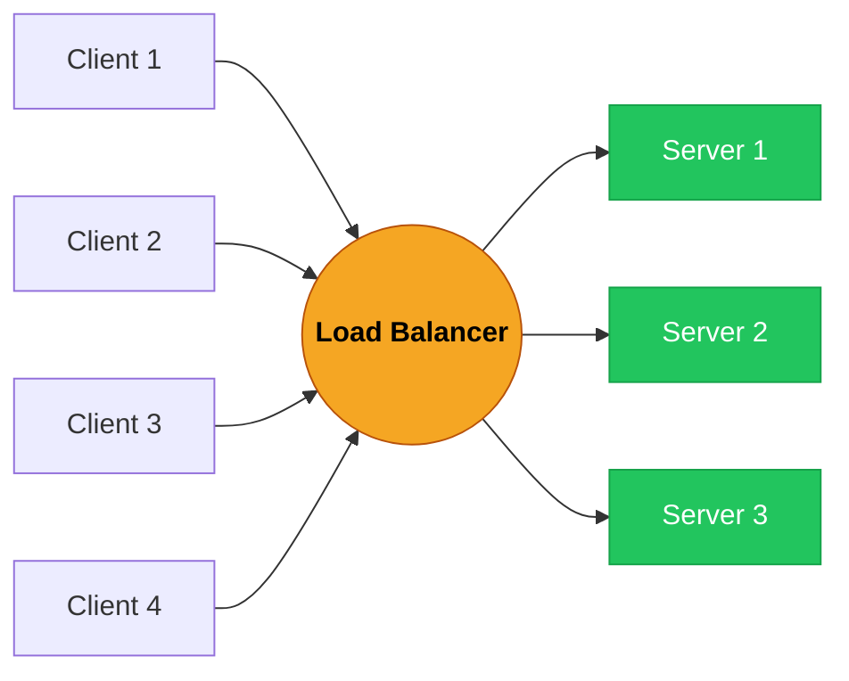
```mermaid
graph LR
    C1[Client 1] --> LB((Load Balancer))
    C2[Client 2] --> LB
    C3[Client 3] --> LB
    C4[Client 4] --> LB

    LB --> S1[Server 1]
    LB --> S2[Server 2]
    LB --> S3[Server 3]

    style LB fill:#F5A623,stroke:#B8520A,color:#000,font-weight:bold
    style S1 fill:#22c55e,stroke:#16a34a,color:#fff
    style S2 fill:#22c55e,stroke:#16a34a,color:#fff
    style S3 fill:#22c55e,stroke:#16a34a,color:#fff
```

### Why Does It Exist?

Simple baat hai — one server can only handle so many requests at a time. At some point, your traffic grows beyond what a single machine can serve. You add more servers (horizontal scaling), but now the question is: *who decides which server handles which request?* That's the load balancer's job.

**Real example:** When you open Instagram and scroll your feed, your app sends requests to Instagram's backend. Instagram doesn't have one server — they have thousands. A load balancer at the front decides which of those thousands of servers your request goes to. You never notice it. That invisibility is the whole point.

### What a Load Balancer Does

- Accepts client connections
- Picks a backend server based on a configured algorithm
- Forwards the request to that server
- Returns the server's response to the client
- Monitors server health and removes unhealthy servers from rotation
- Optionally terminates SSL (so backend servers don't have to)
- Optionally rewrites headers, URLs, or cookies

---

## 2. Problems Without a Load Balancer

### Analogy: One Cashier, Thousand Customers

Imagine a supermarket with 1000 customers and only ONE cash counter open. People stand in line for 30 minutes. If that one cashier falls sick — the store shuts down completely. Zero service. Agar aur cashiers add kar do but sirf ek hi counter rakho, toh woh bhi useless hai.

### Problem 1: Single Server Overload

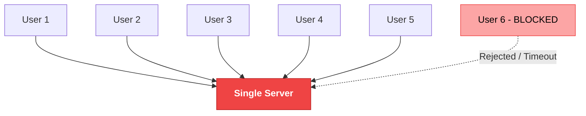
```mermaid
graph TD
    C1[User 1] --> S[Single Server]
    C2[User 2] --> S
    C3[User 3] --> S
    C4[User 4] --> S
    C5[User 5] --> S
    C6[User 6 - BLOCKED] -.->|Rejected / Timeout| S

    style S fill:#ef4444,stroke:#b91c1c,color:#fff,font-weight:bold
    style C6 fill:#fca5a5,stroke:#ef4444,color:#000
```

**What happens when traffic spikes:**
- CPU usage hits 100% — requests start queuing
- Memory fills up — server starts swapping to disk (very slow)
- Response times go from 50ms to 5000ms
- Some requests time out — user sees errors
- Server may crash entirely

**Real example:** Remember when Zomato launched a new feature and their app went down? Or when movie tickets go on sale and BookMyShow crashes? That's a single server (or under-provisioned cluster without good load balancing) getting overwhelmed.

### Problem 2: Single Point of Failure (SPOF)

No machine is immortal. Hard drives fail. Networks drop. OS crashes. Power supplies blow. If your entire application runs on one server and that server dies:

- **100% of users** see an outage
- **Zero requests** are served
- Recovery means manually spinning up a new server — takes time

**Real example:** In the early days of Twitter (the "Fail Whale" era), the platform had a monolithic architecture with insufficient load balancing. The iconic "fail whale" error page appeared whenever servers got overloaded. They literally showed users a picture of a whale being carried by birds because too many birds (requests) overloaded the system. Harsh lesson, ek whale ne poori company ko lesson diya.

### Summary: What Load Balancing Solves

| Problem | Without LB | With LB |
|---|---|---|
| Traffic spike | One server dies | Spread across many servers |
| Server failure | All users see error | LB removes dead server, traffic continues |
| Deployment | Must take server down (downtime) | Rolling updates, one server at a time |
| Scaling | Vertical only (bigger machine) | Horizontal (add more servers) |
| Response time | Degrades as load grows | Stays consistent |

---

## 3. L4 vs L7 Load Balancers

### The Analogy

Think of two types of postal sorting:

- **L4 (Transport Layer):** The postal worker looks only at *the envelope* — your name, address, and zip code. They don't open the package. Very fast.
- **L7 (Application Layer):** The postal worker *opens the package*, reads the contents, and routes it to the right department based on what's inside. Smarter, but takes more time.

Both work. Which to use depends on what intelligence you need.

### L4 — Transport Layer Load Balancer

L4 operates at the **TCP/UDP level**. It sees:
- Source IP address
- Destination IP address
- Source port
- Destination port

It does NOT read HTTP headers, URLs, cookies, or any application-level content. It makes routing decisions purely based on network-level information.

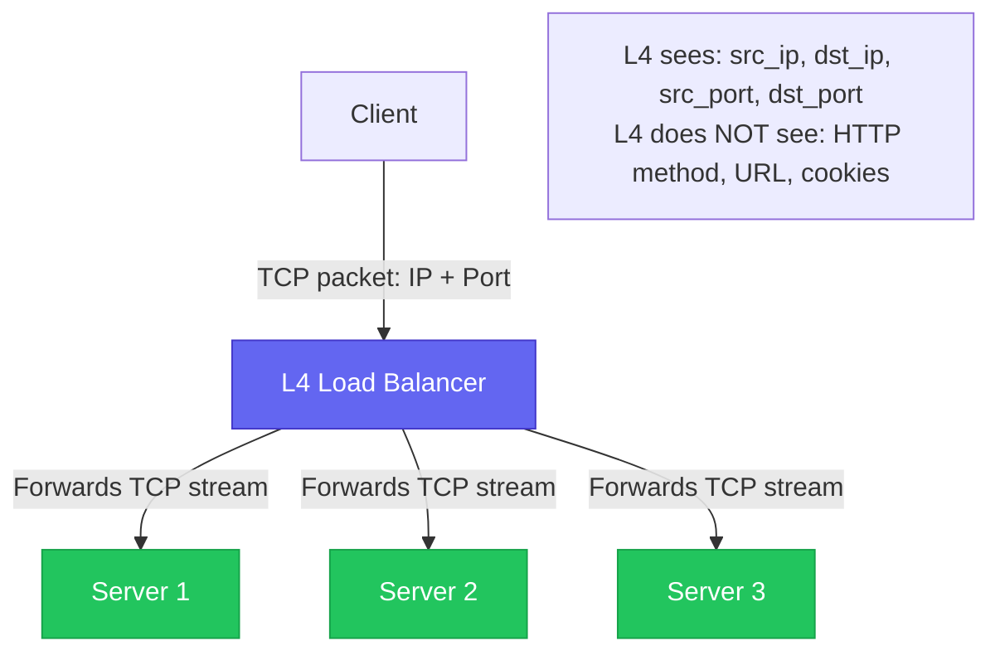
```mermaid
graph TD
    Client -->|TCP packet: IP + Port| L4[L4 Load Balancer]
    L4 -->|Forwards TCP stream| S1[Server 1]
    L4 -->|Forwards TCP stream| S2[Server 2]
    L4 -->|Forwards TCP stream| S3[Server 3]

    note1["L4 sees: src_ip, dst_ip, src_port, dst_port\nL4 does NOT see: HTTP method, URL, cookies"]

    style L4 fill:#6366f1,stroke:#4338ca,color:#fff
    style S1 fill:#22c55e,stroke:#16a34a,color:#fff
    style S2 fill:#22c55e,stroke:#16a34a,color:#fff
    style S3 fill:#22c55e,stroke:#16a34a,color:#fff
```

**How L4 works step by step:**
1. Client opens TCP connection to LB's IP:Port
2. LB picks a backend server
3. LB forwards the raw TCP packets to that server
4. The TCP connection is effectively proxied — LB doesn't buffer or parse the payload
5. Responses flow back through the same path

**L4 real-world use cases:**
- Database load balancing (MySQL, PostgreSQL) — you just need TCP forwarding
- Gaming servers — low latency, no HTTP overhead
- SMTP (email) load balancing
- AWS Network Load Balancer (NLB) is L4

**L4 pros and cons:**

| Pros | Cons |
|---|---|
| Extremely fast — no payload parsing | Cannot route based on URL, headers, cookies |
| Handles any TCP/UDP protocol | No SSL termination intelligence |
| Very low latency | Cannot do A/B testing or canary deployments |
| Works for non-HTTP traffic | Limited visibility into application health |

### L7 — Application Layer Load Balancer

L7 operates at the **HTTP/HTTPS level**. It reads:
- HTTP method (GET, POST, PUT)
- URL path (`/api/users`, `/static/image.jpg`)
- HTTP headers (Host, Authorization, Content-Type)
- Cookies (session IDs, user preferences)
- Request body (for some implementations)

Because it understands the application protocol, it can make much smarter routing decisions.

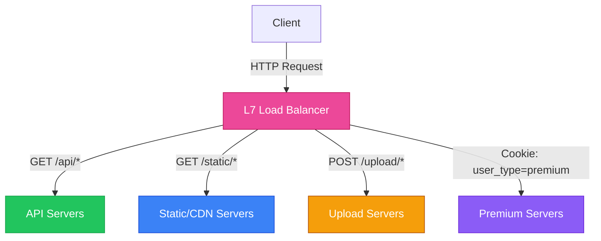
```mermaid
graph TD
    Client -->|HTTP Request| L7[L7 Load Balancer]

    L7 -->|GET /api/*| API[API Servers]
    L7 -->|GET /static/*| CDN[Static/CDN Servers]
    L7 -->|POST /upload/*| Upload[Upload Servers]
    L7 -->|Cookie: user_type=premium| Premium[Premium Servers]

    style L7 fill:#ec4899,stroke:#be185d,color:#fff
    style API fill:#22c55e,stroke:#16a34a,color:#fff
    style CDN fill:#3b82f6,stroke:#1d4ed8,color:#fff
    style Upload fill:#f59e0b,stroke:#b45309,color:#fff
    style Premium fill:#8b5cf6,stroke:#6d28d9,color:#fff
```

**L7 routing examples in real life:**

```
YouTube uses L7 to route:
  GET /watch?v=xxx    → Video serving servers
  GET /api/comments   → Comment API servers
  GET /api/feed       → Feed recommendation servers
  POST /upload        → Video upload servers (different pool!)
  GET /thumbnail/*    → Image/CDN servers
```

```
Instagram uses L7 to route:
  /api/v1/feed        → Feed service
  /api/v1/stories     → Stories service
  /api/v1/direct      → Direct message service
  /api/v1/explore     → Explore/discovery service
  Cookie: beta_user=1 → Beta server pool
```

**L7 pros and cons:**

| Pros | Cons |
|---|---|
| URL-based routing | More CPU overhead (must parse HTTP) |
| Header-based routing | Higher latency than L4 |
| Cookie-based routing | Cannot handle non-HTTP traffic |
| SSL termination | More complex configuration |
| A/B testing and canary releases | More expensive |
| Better health checks (HTTP 200 vs TCP ACK) | |
| Rate limiting per endpoint | |

### L4 vs L7 Comparison Table

| Feature | L4 | L7 |
|---|---|---|
| OSI Layer | Transport (4) | Application (7) |
| Protocols | TCP, UDP | HTTP, HTTPS, gRPC, WebSocket |
| Routing basis | IP + Port | URL, headers, cookies, body |
| Speed | Very fast | Slower (but still fast) |
| SSL termination | Pass-through | Yes (can decrypt and inspect) |
| Content-based routing | No | Yes |
| Health checks | TCP connect | HTTP 200 response |
| Use case | Databases, gaming, email | Web apps, APIs, microservices |
| AWS equivalent | NLB | ALB |
| Example tools | HAProxy (TCP mode), AWS NLB | Nginx, HAProxy (HTTP mode), AWS ALB |

**Interview tip:** When asked "which type of load balancer would you use?" — if the problem involves routing different request types to different service pools (microservices), or you need SSL termination, or A/B testing → L7. If you need maximum throughput and minimum latency for non-HTTP workloads (gaming, databases) → L4.

---

## 4. Load Balancing Algorithms

### The Analogy: Waiter at a Restaurant

A restaurant has 5 waiters. A new group of customers walks in. The host (load balancer) must assign them a waiter. Different restaurants have different policies:
- "Next waiter in line gets them" — Round Robin
- "The waiter with fewest tables right now" — Least Connections
- "The fastest waiter" — Least Response Time
- "Always the same waiter for regulars" — IP Hash / Sticky Sessions

Yeh sab algorithms hain — let's go deep on each.

---

### Algorithm 1: Round Robin

**What it is:** Distribute requests in a circular sequence. Request 1 → Server A, Request 2 → Server B, Request 3 → Server C, Request 4 → Server A again, and so on.

**Why it exists:** Simplest possible fair distribution. When all servers are identical and requests are roughly the same size, this works perfectly.

**How it works:**

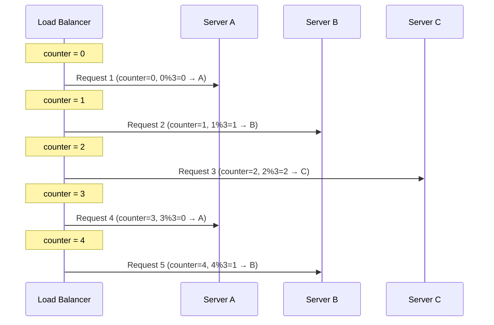
```mermaid
sequenceDiagram
    participant LB as Load Balancer
    participant A as Server A
    participant B as Server B
    participant C as Server C

    Note over LB: counter = 0
    LB->>A: Request 1 (counter=0, 0%3=0 → A)
    Note over LB: counter = 1
    LB->>B: Request 2 (counter=1, 1%3=1 → B)
    Note over LB: counter = 2
    LB->>C: Request 3 (counter=2, 2%3=2 → C)
    Note over LB: counter = 3
    LB->>A: Request 4 (counter=3, 3%3=0 → A)
    Note over LB: counter = 4
    LB->>B: Request 5 (counter=4, 4%3=1 → B)
```

**Real example:** A small startup's API with 3 identical EC2 instances. All servers are the same size, all requests are simple JSON responses. Round robin works perfectly.

**Trade-offs:**

| Pros | Cons |
|---|---|
| Extremely simple | Ignores server capacity |
| Easy to implement | Ignores actual server load |
| Predictable distribution | A slow request on Server A doesn't reduce its share |
| Zero state needed | One slow request can pile up on a server |

**When to use:** Stateless services, identical server hardware, uniform request types.

**Interview tip:** Round Robin is almost never the right answer in an interview, but it's the baseline everyone mentions first. Show you know its limitations.

---

### Algorithm 2: Weighted Round Robin

**What it is:** Round Robin, but servers get more or fewer requests proportional to their "weight" (capacity). A server with weight 3 gets 3x more requests than a server with weight 1.

**Why it exists:** In the real world, not all servers are equal. You might have a mix of old (2 CPU, 4GB RAM) and new (8 CPU, 32GB RAM) machines. It's wasteful to treat them equally.

**How it works:**

```
Server A: weight=3 (powerful new machine)
Server B: weight=2 (medium machine)
Server C: weight=1 (old machine)

Total weight = 6
Distribution per 6 requests:
  A → 3 requests (50%)
  B → 2 requests (33%)
  C → 1 request  (17%)

Sequence: A, A, A, B, B, C, A, A, A, B, B, C ...
```

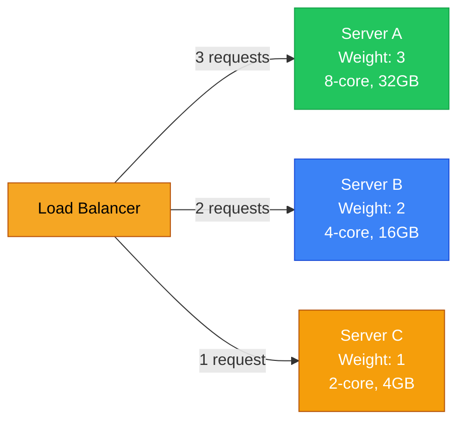
```mermaid
graph LR
    LB[Load Balancer] -->|3 requests| A[Server A\nWeight: 3\n8-core, 32GB]
    LB -->|2 requests| B[Server B\nWeight: 2\n4-core, 16GB]
    LB -->|1 request| C[Server C\nWeight: 1\n2-core, 4GB]

    style LB fill:#F5A623,stroke:#B8520A,color:#000
    style A fill:#22c55e,stroke:#16a34a,color:#fff
    style B fill:#3b82f6,stroke:#1d4ed8,color:#fff
    style C fill:#f59e0b,stroke:#b45309,color:#fff
```

**Real example:** Netflix during a migration. They're upgrading their server fleet. New servers (m5.4xlarge) can handle 4x more traffic than old ones (m3.xlarge). Instead of using equal round robin and killing old servers, they use weighted round robin to ease old servers and hammer new ones appropriately.

**Trade-offs:**

| Pros | Cons |
|---|---|
| Respects server capacity differences | Weights must be configured manually |
| Works with heterogeneous fleets | Weights don't adapt if one server slows down |
| Simple to understand | Need to reconfigure when servers change |

---

### Algorithm 3: Least Connections

**What it is:** Send the new request to the server that currently has the *fewest active connections*.

**Why it exists:** Round Robin is blind to what's happening inside the servers. Imagine request 5 takes 30 seconds (a big file download), but the LB keeps sending requests to that server because "it's its turn." That's dumb. Least Connections fixes this.

**How it works:**

```
Current state:
  Server A: 15 active connections
  Server B: 3 active connections  ← choose this
  Server C: 9 active connections

New request → Server B

After routing:
  Server A: 15 connections
  Server B: 4 connections
  Server C: 9 connections
```

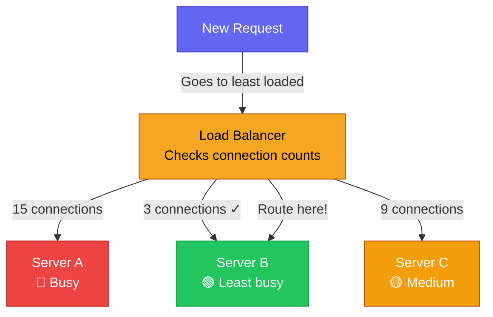
```mermaid
graph TD
    LB[Load Balancer\nChecks connection counts]

    LB -->|15 connections| A[Server A\n🔴 Busy]
    LB -->|3 connections ✓| B[Server B\n🟢 Least busy]
    LB -->|9 connections| C[Server C\n🟡 Medium]

    NewReq[New Request] -->|Goes to least loaded| LB
    LB -->|Route here!| B

    style LB fill:#F5A623,stroke:#B8520A,color:#000
    style B fill:#22c55e,stroke:#16a34a,color:#fff
    style A fill:#ef4444,stroke:#b91c1c,color:#fff
    style C fill:#f59e0b,stroke:#b45309,color:#fff
    style NewReq fill:#6366f1,stroke:#4338ca,color:#fff
```

**Real example:** Swiggy's order-tracking websocket connections. A WebSocket stays open the entire time you're tracking your delivery — could be 30-45 minutes. With Round Robin, one server might accumulate 10x more long-lived connections. Least Connections naturally balances this.

**Trade-offs:**

| Pros | Cons |
|---|---|
| Adapts to varying request durations | Requires LB to track connection state |
| Better than round robin for mixed workloads | Connection count ≠ actual CPU/memory load |
| Automatically adjusts to slow servers | A server doing 100 CPU-heavy requests may look lighter than one doing 200 idle requests |

**When to use:** Mix of short-lived and long-lived connections (websockets, streaming, file uploads).

---

### Algorithm 4: Least Response Time

**What it is:** Send requests to the server that is responding the *fastest* (lowest average response time). Some implementations combine this with least connections.

**Why it exists:** Connection count is an indirect measure of server health. What you really want is the server that will reply quickest. A server with 5 connections but slow disk I/O is worse than one with 10 connections running smoothly.

**How it works:**

```
Load balancer tracks rolling average response times:
  Server A: avg 280ms  ← slow (maybe doing heavy work)
  Server B: avg 45ms   ← fastest, send here
  Server C: avg 120ms

New request → Server B
```

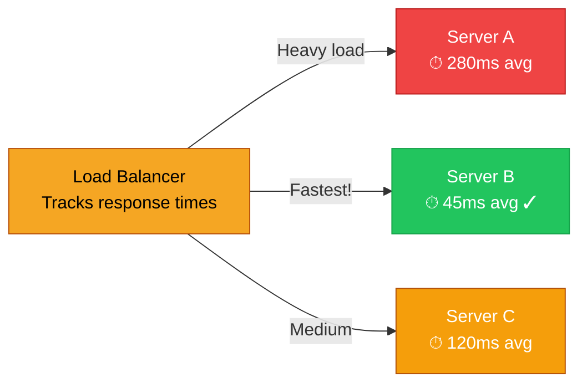
```mermaid
graph LR
    LB[Load Balancer\nTracks response times]
    A[Server A\n⏱ 280ms avg]
    B[Server B\n⏱ 45ms avg ✓]
    C[Server C\n⏱ 120ms avg]

    LB -->|Heavy load| A
    LB -->|Fastest!| B
    LB -->|Medium| C

    style LB fill:#F5A623,stroke:#B8520A,color:#000
    style B fill:#22c55e,stroke:#16a34a,color:#fff
    style A fill:#ef4444,stroke:#b91c1c,color:#fff
    style C fill:#f59e0b,stroke:#b45309,color:#fff
```

**Real example:** YouTube's video processing servers. Some videos are 4K and take longer to process. A server processing a 4K video will respond slowly. Least Response Time naturally routes new encoding jobs away from those busy servers.

**Trade-offs:**

| Pros | Cons |
|---|---|
| Best user experience | Requires active latency monitoring |
| Automatically detects slow servers | More complex to implement |
| Responds to actual server performance | Response time fluctuates — can oscillate |

---

### Algorithm 5: IP Hash / Sticky Sessions via Hash

**What it is:** Hash the client's IP address and always map it to the same server. Same client → same server, every time.

**Why it exists:** Some applications store user session data in server memory (not in a database or Redis). If the next request goes to a *different* server, that server has no session — user gets logged out or sees errors. IP Hash solves this by ensuring a client always lands on the same server.

**How it works:**

```
Client IP: 103.25.48.200
Hash: MD5(103.25.48.200) = some big number
Server index = hash % number_of_servers
           = 47239847 % 3 = 1 → Server B

Every future request from 103.25.48.200 → Server B (always)
```

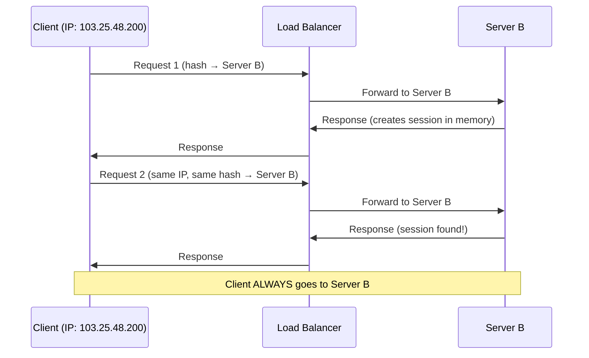
```mermaid
sequenceDiagram
    participant C as Client (IP: 103.25.48.200)
    participant LB as Load Balancer
    participant B as Server B

    C->>LB: Request 1 (hash → Server B)
    LB->>B: Forward to Server B
    B->>LB: Response (creates session in memory)
    LB->>C: Response

    C->>LB: Request 2 (same IP, same hash → Server B)
    LB->>B: Forward to Server B
    B->>LB: Response (session found!)
    LB->>C: Response

    Note over C,B: Client ALWAYS goes to Server B
```

**Real example:** An online exam platform. The user starts their exam and their progress is stored in the server's memory (in-memory session). If they get routed to a different server mid-exam, their answers are gone. IP Hash prevents this.

**Trade-offs:**

| Pros | Cons |
|---|---|
| Stateful apps work without external storage | Uneven distribution (some IPs cluster) |
| No Redis/external session needed | If server dies, client's session is lost |
| Simple to implement | Hard to scale down (removing a server rehashes all clients) |
| | NAT (many users, one IP) overloads one server |
| | VPNs and proxies break IP identity |

**Better alternative:** Use Redis or Memcached for shared session storage, then you don't need IP Hash at all. True stateless apps can use any load balancing algorithm.

---

### Algorithm 6: Random

**What it is:** Pick a server at random for each request. Simple as rolling a dice.

**Why it exists:** Surprisingly, with a large number of requests, random selection converges to roughly equal distribution (law of large numbers). It's simpler than round robin because you don't need to track a counter.

**How it works:**

```
Servers: [A, B, C]
random(0, 2) = 1 → Server B
random(0, 2) = 0 → Server A
random(0, 2) = 2 → Server C
random(0, 2) = 0 → Server A (oops, uneven in short bursts)
```

**Trade-offs:**

| Pros | Cons |
|---|---|
| Zero state needed | Short-term imbalance (one server may get 5x load briefly) |
| Very simple | No adaptation to server load |
| Works surprisingly well at scale | Not suitable for small server pools or stateful apps |

**When to use:** Large server pools (100+ servers) where the law of large numbers kicks in. Rarely the best choice in real production.

### Algorithm Summary Table

| Algorithm | Best For | Avoids | State Required |
|---|---|---|---|
| Round Robin | Identical servers, uniform requests | Nothing specific | Minimal (counter) |
| Weighted Round Robin | Mixed server sizes | Overloading weak servers | Weights config |
| Least Connections | Long-lived connections, mixed workloads | Overloading busy servers | Connection counts |
| Least Response Time | User-facing APIs | Slow server penalty | Latency tracking |
| IP Hash | Stateful apps, in-memory sessions | Session loss on re-route | Hash table |
| Random | Huge server pools | Nothing specific | None |

---

## 5. Health Checks

### The Analogy

Imagine a hospital with 10 doctors on call. The receptionist (load balancer) routes patients to doctors. But what if one doctor collapses in their office? The receptionist needs a way to know — so they call each doctor's phone every few minutes. If a doctor doesn't pick up, the receptionist stops sending patients to them and calls a backup.

That phone call is a **health check**.

### Why Health Checks Exist

Without health checks, the load balancer is blind. A server might crash, hang, or start throwing errors — and the load balancer will keep sending requests to it like nothing happened. Users see errors. Health checks prevent this.

### Active Health Checks

The load balancer *proactively* sends a test request to each backend server at a regular interval and checks the response.

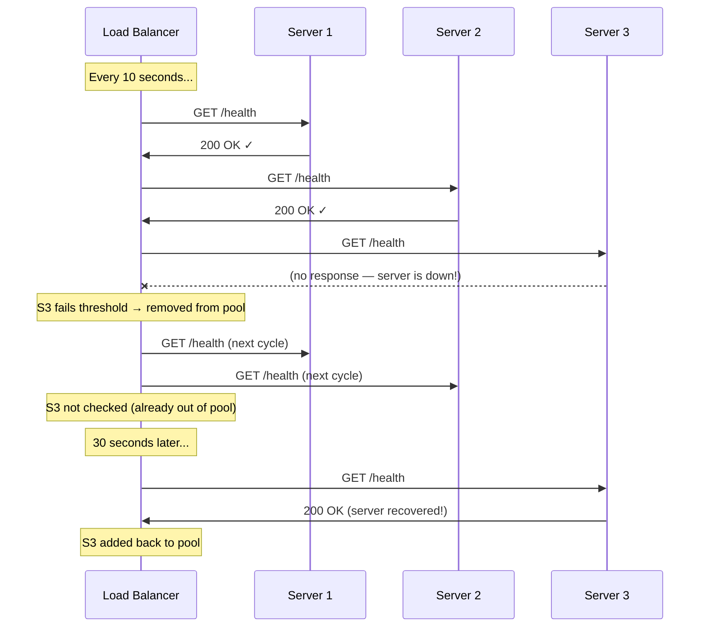
```mermaid
sequenceDiagram
    participant LB as Load Balancer
    participant S1 as Server 1
    participant S2 as Server 2
    participant S3 as Server 3

    Note over LB: Every 10 seconds...
    LB->>S1: GET /health
    S1->>LB: 200 OK ✓

    LB->>S2: GET /health
    S2->>LB: 200 OK ✓

    LB->>S3: GET /health
    S3--xLB: (no response — server is down!)

    Note over LB: S3 fails threshold → removed from pool
    LB->>S1: GET /health (next cycle)
    LB->>S2: GET /health (next cycle)
    Note over LB: S3 not checked (already out of pool)

    Note over LB: 30 seconds later...
    LB->>S3: GET /health
    S3->>LB: 200 OK (server recovered!)
    Note over LB: S3 added back to pool
```

**How active health check works:**

1. LB sends `GET /health` (or `/ping` or `/status`) to each server every N seconds
2. If response is `200 OK` → server is healthy
3. If response is non-200, connection refused, or times out → mark as one failure
4. After K consecutive failures → remove server from rotation
5. Continue checking the failed server
6. After M consecutive successes → add server back to rotation

**Typical configuration:**

```nginx
upstream backend {
  server server1.example.com:8080;
  server server2.example.com:8080;
  server server3.example.com:8080;

  # Health check settings
  # check every 10 seconds
  # mark unhealthy after 2 failures
  # mark healthy after 3 successes
}
```

In AWS ALB:
- Health check interval: 30 seconds (default)
- Unhealthy threshold: 2 consecutive failures
- Healthy threshold: 5 consecutive successes
- Timeout: 5 seconds
- Protocol: HTTP, HTTPS, or TCP

**What a good /health endpoint looks like:**

```python
# DO: Lightweight check that tests critical dependencies
@app.get("/health")
def health():
    try:
        db.execute("SELECT 1")   # verify DB is reachable
        redis.ping()             # verify cache is reachable
        return {"status": "healthy"}, 200
    except Exception as e:
        return {"status": "unhealthy", "error": str(e)}, 500

# DON'T: Just return 200 without checking dependencies
# (Your app might be "alive" but DB is down)
```

### Passive Health Checks

The load balancer does NOT send separate test requests. Instead, it *observes* real traffic responses. If a server starts returning 500 errors or timing out on real requests, the LB marks it as unhealthy.

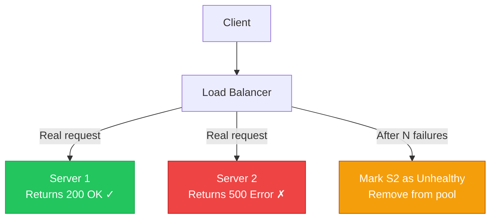
```mermaid
graph TD
    Client --> LB[Load Balancer]
    LB -->|Real request| S1[Server 1\nReturns 200 OK ✓]
    LB -->|Real request| S2[Server 2\nReturns 500 Error ✗]

    LB -->|After N failures| Mark[Mark S2 as Unhealthy\nRemove from pool]

    style S1 fill:#22c55e,stroke:#16a34a,color:#fff
    style S2 fill:#ef4444,stroke:#b91c1c,color:#fff
    style Mark fill:#f59e0b,stroke:#b45309,color:#fff
```

**Active vs Passive Health Checks:**

| Feature | Active | Passive |
|---|---|---|
| How it works | LB sends dedicated test requests | LB monitors real request outcomes |
| Detects failure | Before real users are affected | Only after real users see errors |
| Extra load | Yes (health check requests) | No extra requests |
| Speed of detection | Fast (configured interval) | Depends on traffic volume |
| Works with low traffic | Yes | No (need traffic to observe) |
| Used by | Nginx Plus, AWS ALB, HAProxy | HAProxy (circuit breakers), Nginx |

**Best practice:** Use *both*. Active health checks catch dead servers quickly. Passive checks catch degraded servers (slow but responding) under real load.

---

## 6. Session Persistence (Sticky Sessions)

### The Analogy

Think of a bank with 5 tellers. You go to Teller #3, who knows your account details and has your documents on her desk. You step away for a moment and come back — but now you're sent to Teller #1, who has no idea who you are and has to start over. Frustrating!

Sticky sessions = always sending you back to the same teller. Iska ek faayda hai, ek nuksaan — let's break it down.

### Why Sticky Sessions Are Needed

Some applications store user state in the server's memory:
- Shopping cart items
- File upload progress
- Authentication tokens
- Game state

If request 1 creates this state on Server A and request 2 goes to Server B, the user's state is gone.

```mermaid
sequenceDiagram
    participant C as Client
    participant LB as Load Balancer
    participant A as Server A
    participant B as Server B

    rect rgb(239, 68, 68)
        Note over C,B: WITHOUT Sticky Sessions (BAD)
        C->>LB: Request 1: Add item to cart
        LB->>A: Route to Server A
        A->>A: Store cart in memory: {item: "shirt"}
        A->>LB: 200 OK
        LB->>C: Cart updated

        C->>LB: Request 2: View cart
        LB->>B: Route to Server B (different server!)
        B->>B: Check memory: cart = {} (empty!)
        B->>LB: 200 OK (empty cart)
        LB->>C: Your cart is empty! (BUG)
    end

    rect rgb(34, 197, 94)
        Note over C,B: WITH Sticky Sessions (Session stored on same server)
        C->>LB: Request 1: Add item to cart
        LB->>A: Route to Server A
        A->>A: Store cart in memory: {item: "shirt"}
        A->>LB: Set-Cookie: ServerID=A; 200 OK
        LB->>C: Cart updated + cookie set

        C->>LB: Request 2: View cart (Cookie: ServerID=A)
        LB->>A: Route to Server A (same server, cookie says so)
        A->>A: Check memory: cart = {item: "shirt"}
        A->>LB: 200 OK
        LB->>C: Your cart has 1 item ✓
    end
```

### How Sticky Sessions Work

**Cookie-based stickiness (most common):**
1. Client sends first request
2. LB routes to Server A, and adds a cookie: `Set-Cookie: SERVERID=A; Path=/; HttpOnly`
3. Client's browser stores this cookie
4. All subsequent requests include `Cookie: SERVERID=A`
5. LB reads the cookie and always routes to Server A

**Source IP-based stickiness:**
- Hash client's IP address → same server every time
- Problem: NAT can make many users share one IP

### The Hidden Dangers of Sticky Sessions

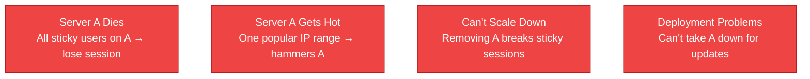
```mermaid
graph TD
    Problem1[Server A Dies\nAll sticky users on A → lose session]
    Problem2[Server A Gets Hot\nOne popular IP range → hammers A]
    Problem3[Can't Scale Down\nRemoving A breaks sticky sessions]
    Problem4[Deployment Problems\nCan't take A down for updates]

    style Problem1 fill:#ef4444,stroke:#b91c1c,color:#fff
    style Problem2 fill:#ef4444,stroke:#b91c1c,color:#fff
    style Problem3 fill:#ef4444,stroke:#b91c1c,color:#fff
    style Problem4 fill:#ef4444,stroke:#b91c1c,color:#fff
```

**The proper solution:** Don't store session in server memory. Store it externally.

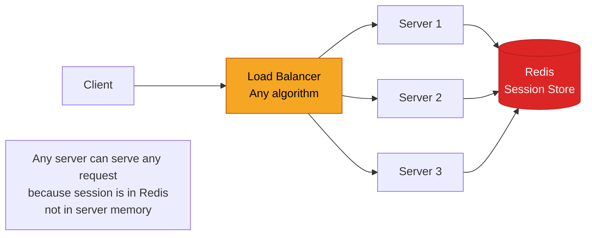
```mermaid
graph LR
    Client --> LB[Load Balancer\nAny algorithm]
    LB --> S1[Server 1]
    LB --> S2[Server 2]
    LB --> S3[Server 3]

    S1 --> Redis[(Redis\nSession Store)]
    S2 --> Redis
    S3 --> Redis

    note1["Any server can serve any request\nbecause session is in Redis\nnot in server memory"]

    style Redis fill:#dc2626,stroke:#b91c1c,color:#fff
    style LB fill:#F5A623,stroke:#B8520A,color:#000
```

**Real example:** WhatsApp's web session. When you log in on WhatsApp Web, your session is stored in a distributed store, not on one server's memory. That's why you don't get logged out if WhatsApp restarts some servers.

### When Sticky Sessions Are Acceptable

1. Legacy applications that cannot be refactored for external session storage
2. Short-lived connections where session loss is acceptable
3. Temporary during a phased migration to stateless architecture

**Interview tip:** If asked "how do you handle sessions with load balancing?" — the answer is NOT sticky sessions. The answer is "store sessions in Redis (or DynamoDB) so any server can serve any request." Only mention sticky sessions as a legacy/temporary workaround.

---

## 7. Hardware vs Software vs Cloud Load Balancers

### The Analogy

Three types of load balancers are like three types of kitchens:
- **Hardware LB:** A Michelin-star restaurant kitchen — very expensive, extremely capable, but you can't move it and it takes months to set up
- **Software LB:** Your home kitchen — free, flexible, you can rearrange it anytime, but you have to maintain it yourself
- **Cloud LB:** A ghost kitchen (delivery-only) — you pay as you use, someone else maintains the equipment, and you can scale from 1 chef to 100 with a click

### Hardware Load Balancers

Dedicated physical appliances built specifically for load balancing.

**Examples:** F5 BIG-IP, Cisco ACE, Citrix NetScaler/ADC, Radware

```
F5 BIG-IP specs (enterprise grade):
├─ Up to 20 million connections
├─ Up to 160 Gbps throughput
├─ Hardware SSL acceleration chips
├─ Built-in DDoS protection
├─ Full-stack support: L4-L7
└─ Cost: $50,000 - $500,000+
```

**Who uses them:** Large banks, telecom companies, government agencies, enterprises with very strict compliance requirements and massive on-premise infrastructure.

**Pros:**
- Extremely high performance (custom ASICs, not general-purpose CPUs)
- Purpose-built reliability
- Hardware SSL acceleration (offloads encryption from servers)
- Feature-rich: WAF, DDoS, content switching, global traffic management

**Cons:**
- Very expensive ($$$$$)
- Capacity is fixed — to scale, you buy another appliance
- Long procurement cycles (weeks/months to get approved, delivered, racked)
- Requires specialized training to operate
- No "pay-as-you-go" — you pay for peak capacity even during off-hours

---

### Software Load Balancers

Software running on general-purpose servers or VMs. You install, configure, and operate them yourself.

**Examples:**

| Tool | Type | Best For |
|---|---|---|
| Nginx | L4 + L7 | Web apps, reverse proxy, SSL termination |
| HAProxy | L4 + L7 | High-performance, TCP and HTTP |
| Envoy | L4 + L7 | Service mesh, microservices (Lyft, Uber) |
| Traefik | L7 | Kubernetes, Docker, dynamic config |
| Linux LVS | L4 | Kernel-level, extreme throughput |

**Nginx example config:**

```nginx
# Nginx as L7 Load Balancer

upstream api_servers {
    least_conn;  # Algorithm: Least Connections

    server 10.0.1.1:8080 weight=3 max_fails=2 fail_timeout=30s;
    server 10.0.1.2:8080 weight=3 max_fails=2 fail_timeout=30s;
    server 10.0.1.3:8080 weight=1 max_fails=2 fail_timeout=30s;
}

server {
    listen 443 ssl;
    server_name api.myapp.com;

    location /api/ {
        proxy_pass http://api_servers;
        proxy_set_header X-Real-IP $remote_addr;
        proxy_set_header X-Forwarded-For $proxy_add_x_forwarded_for;
    }

    location /static/ {
        root /var/www/;
        expires 30d;
    }
}
```

**HAProxy example:**

```
frontend http_front
  bind *:80
  default_backend http_back

backend http_back
  balance roundrobin
  option httpchk GET /health
  server s1 10.0.1.1:8080 check
  server s2 10.0.1.2:8080 check
  server s3 10.0.1.3:8080 check
```

**Pros:**
- Free (open source)
- Very flexible configuration
- Can run on any hardware/VM/container
- Active communities, lots of documentation

**Cons:**
- You manage HA yourself (if the Nginx machine dies, you have a new SPOF)
- Requires ops expertise
- Upgrades = potential downtime
- No SLA unless you pay for commercial support (Nginx Plus, HAProxy Enterprise)

---

### Cloud Load Balancers

Managed services provided by cloud providers. You configure them; the provider runs them.

**AWS Elastic Load Balancing:**

| Type | Layer | Use Case |
|---|---|---|
| ALB (Application LB) | L7 | Web apps, microservices, HTTP/HTTPS |
| NLB (Network LB) | L4 | High throughput, low latency, TCP/UDP |
| GLB (Gateway LB) | L3 + L4 | Network appliances, security inspection |
| CLB (Classic LB) | L4 + L7 | Legacy, being phased out |

**GCP and Azure equivalents:**

| Provider | Service | Notes |
|---|---|---|
| AWS | ALB / NLB | Most mature, richest features |
| Google Cloud | Cloud Load Balancing | Global single-anycast IP |
| Azure | Azure Load Balancer / Application Gateway | Similar to AWS NLB/ALB |
| Cloudflare | Cloudflare Load Balancing | + CDN + DDoS built in |

**Pros:**
- Zero infrastructure management
- Auto-scaling (handles traffic spikes automatically)
- Built-in high availability (cloud providers run multiple instances under the hood)
- Pay-per-use (no upfront cost)
- Deep integration with cloud services (auto-scaling groups, ACM for SSL, WAF)
- Health checks built-in

**Cons:**
- Cost adds up at scale (AWS ALB: ~$0.008 per LCU-hour + data charges)
- Vendor lock-in
- Less control over fine-grained behavior
- Latency added by cloud infrastructure (usually <1ms, but measurable)

### Comparison Table

| | Hardware | Software | Cloud |
|---|---|---|---|
| Cost | Very high upfront | Low (ops cost) | Pay-per-use |
| Performance | Highest | High | High |
| Management | Vendor + your team | Your team | Provider managed |
| Flexibility | Low | Very high | Medium |
| Scaling | Buy more hardware | Add more VMs | Automatic |
| HA | Built-in (expensive) | DIY | Built-in |
| Setup time | Weeks/months | Hours/days | Minutes |
| Best for | Enterprise, compliance | On-prem, custom | Cloud-native apps |

---

## 8. DNS-Based Load Balancing

### The Analogy

When you type `google.com` in your browser, your computer asks "hey, what's the IP address of google.com?" The DNS server could respond with just one IP — or it could respond with multiple IPs. Your computer picks one. That's DNS-based load balancing.

### How DNS Round Robin Works

A domain can have multiple A records:

```
myapp.com    A    52.1.2.1
myapp.com    A    52.1.2.2
myapp.com    A    52.1.2.3
```

When a client resolves `myapp.com`:
- Client 1 gets: `[52.1.2.1, 52.1.2.2, 52.1.2.3]` — uses first: `52.1.2.1`
- Client 2 gets: `[52.1.2.2, 52.1.2.3, 52.1.2.1]` — uses first: `52.1.2.2`
- Client 3 gets: `[52.1.2.3, 52.1.2.1, 52.1.2.2]` — uses first: `52.1.2.3`

The DNS server rotates the order — clients naturally hit different servers.

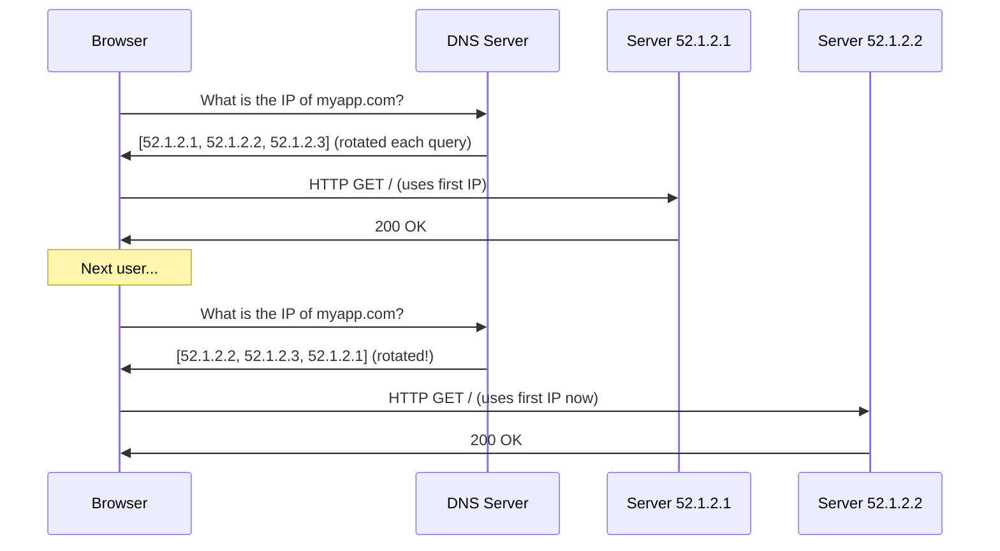
```mermaid
sequenceDiagram
    participant B as Browser
    participant D as DNS Server
    participant S1 as Server 52.1.2.1
    participant S2 as Server 52.1.2.2

    B->>D: What is the IP of myapp.com?
    D->>B: [52.1.2.1, 52.1.2.2, 52.1.2.3] (rotated each query)
    B->>S1: HTTP GET / (uses first IP)
    S1->>B: 200 OK

    Note over B: Next user...
    B->>D: What is the IP of myapp.com?
    D->>B: [52.1.2.2, 52.1.2.3, 52.1.2.1] (rotated!)
    B->>S2: HTTP GET / (uses first IP now)
    S2->>B: 200 OK
```

### DNS Load Balancing Limitations

**Major problem: TTL and caching.** DNS responses are cached for their TTL (Time to Live). If TTL is 60 seconds, clients cache the IP for 60 seconds. If Server 52.1.2.1 dies, clients that cached that IP will keep hitting the dead server for up to 60 seconds.

| Issue | Impact |
|---|---|
| No health awareness | Dead servers still get traffic until TTL expires |
| TTL caching delay | Changes take TTL seconds to propagate |
| Client-side caching | OS, browser, ISP all cache DNS — actual delay can be hours |
| No session affinity | Client may get different IP on reconnect |
| No intelligent routing | Pure round-robin, no load awareness |

**When DNS LB is still useful:**
- Load balancing across multiple data centers (first level of distribution)
- Disaster recovery failover (though slow due to TTL)
- Combined with proper LBs inside each DC
- CDN providers use DNS extensively for geographic routing

---

## 9. Global Load Balancing and GeoDNS

### The Analogy

Netflix has servers in Mumbai, London, and New York. When you open Netflix from Bangalore, should you connect to the New York server (200ms latency) or the Mumbai server (10ms latency)? Obviously Mumbai. But how does Netflix automatically route you to the nearest server? GeoDNS.

### How GeoDNS Works

GeoDNS is a DNS service that returns *different IP addresses based on where the client is asking from*.

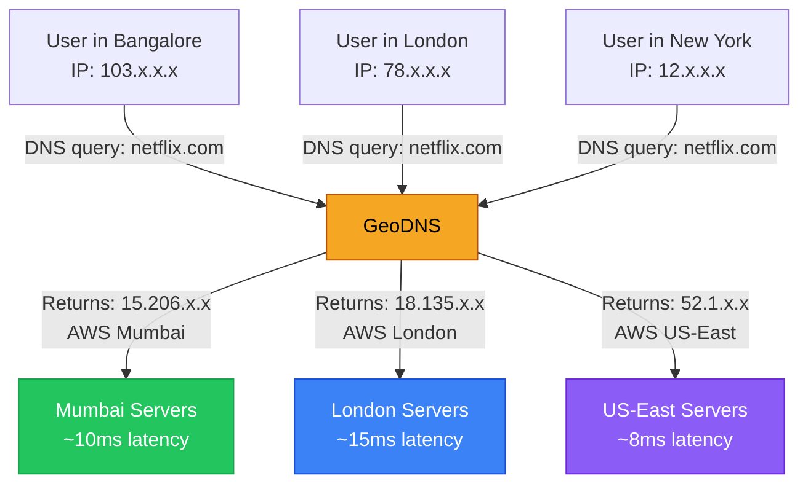
```mermaid
graph TD
    User1[User in Bangalore\nIP: 103.x.x.x] -->|DNS query: netflix.com| GeoDNS
    User2[User in London\nIP: 78.x.x.x] -->|DNS query: netflix.com| GeoDNS
    User3[User in New York\nIP: 12.x.x.x] -->|DNS query: netflix.com| GeoDNS

    GeoDNS -->|Returns: 15.206.x.x\nAWS Mumbai| Mumbai[Mumbai Servers\n~10ms latency]
    GeoDNS -->|Returns: 18.135.x.x\nAWS London| London[London Servers\n~15ms latency]
    GeoDNS -->|Returns: 52.1.x.x\nAWS US-East| NY[US-East Servers\n~8ms latency]

    style GeoDNS fill:#F5A623,stroke:#B8520A,color:#000
    style Mumbai fill:#22c55e,stroke:#16a34a,color:#fff
    style London fill:#3b82f6,stroke:#1d4ed8,color:#fff
    style NY fill:#8b5cf6,stroke:#6d28d9,color:#fff
```

**How it works step by step:**
1. User in Bangalore types `netflix.com`
2. DNS query reaches GeoDNS provider (AWS Route 53, Cloudflare, etc.)
3. GeoDNS checks the source IP: `103.x.x.x` → belongs to Bangalore, India
4. Returns IP address of the Mumbai region's load balancer
5. User connects to Mumbai — lowest latency

**GeoDNS providers:**
- AWS Route 53 (Latency-based routing, Geolocation routing)
- Cloudflare DNS
- NS1
- Azure Traffic Manager
- Google Cloud DNS

### Global Load Balancer Architecture (Full Picture)

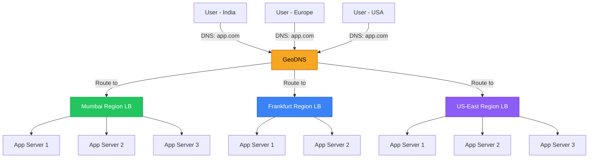
```mermaid
graph TD
    User1[User - India] -->|DNS: app.com| GeoDNS
    User2[User - Europe] -->|DNS: app.com| GeoDNS
    User3[User - USA] -->|DNS: app.com| GeoDNS

    GeoDNS -->|Route to| Mumbai[Mumbai Region LB]
    GeoDNS -->|Route to| Frankfurt[Frankfurt Region LB]
    GeoDNS -->|Route to| Virginia[US-East Region LB]

    Mumbai --> MApp1[App Server 1]
    Mumbai --> MApp2[App Server 2]
    Mumbai --> MApp3[App Server 3]

    Frankfurt --> FApp1[App Server 1]
    Frankfurt --> FApp2[App Server 2]

    Virginia --> VApp1[App Server 1]
    Virginia --> VApp2[App Server 2]
    Virginia --> VApp3[App Server 3]

    style GeoDNS fill:#F5A623,stroke:#B8520A,color:#000
    style Mumbai fill:#22c55e,stroke:#16a34a,color:#fff
    style Frankfurt fill:#3b82f6,stroke:#1d4ed8,color:#fff
    style Virginia fill:#8b5cf6,stroke:#6d28d9,color:#fff
```

### Failover with GeoDNS

If the Mumbai region goes down entirely:
1. Health checks detect Mumbai is unreachable
2. GeoDNS removes Mumbai's IPs from the response
3. Indian users now get routed to Singapore or Frankfurt (higher latency but service continues)
4. When Mumbai recovers, GeoDNS adds it back

**Real example:** During the AWS ap-south-1 (Mumbai) outage in 2022, companies using proper GeoDNS failover automatically rerouted Indian users to Singapore. Companies not using GeoDNS had full outages for Indian users.

---

## 10. Load Balancer as a Single Point of Failure

### The Irony

The load balancer is supposed to eliminate single points of failure by distributing traffic. But if the load balancer itself fails — everyone goes down. You've replaced one SPOF (single server) with a different SPOF (the load balancer). Yeh toh ek haathi ke peeche doosra haathi aa gaya.

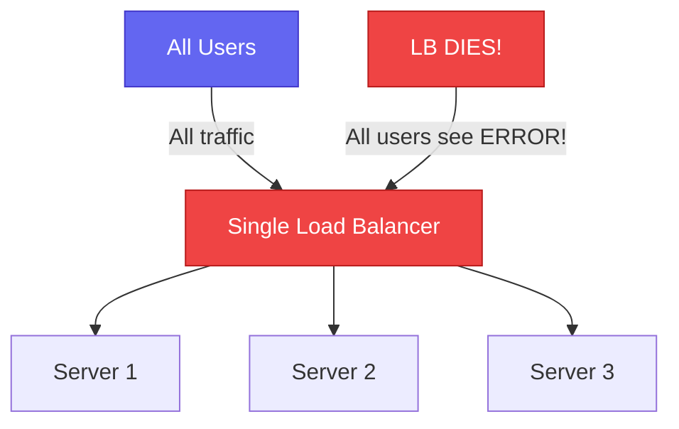
```mermaid
graph TD
    Users[All Users] -->|All traffic| LB[Single Load Balancer]
    LB --> S1[Server 1]
    LB --> S2[Server 2]
    LB --> S3[Server 3]

    LB_Fail[LB DIES!]:::failure -->|All users see ERROR!| LB

    classDef failure fill:#ef4444,stroke:#b91c1c,color:#fff
    style LB fill:#ef4444,stroke:#b91c1c,color:#fff
    style Users fill:#6366f1,stroke:#4338ca,color:#fff
```

### The Solution: Active-Passive HA with Virtual IP

**Virtual IP (VIP):** An IP address that is not tied to any physical machine. It can "float" between machines. DNS points to the VIP. Whichever machine currently "owns" the VIP will receive traffic.

**Active-Passive setup:**
- LB1 is Active — it owns the VIP and handles all traffic
- LB2 is Passive (standby) — monitors LB1 via heartbeat
- If LB1 dies, LB2 detects no heartbeat → takes over the VIP → starts handling traffic
- Total failover time: usually 1-3 seconds

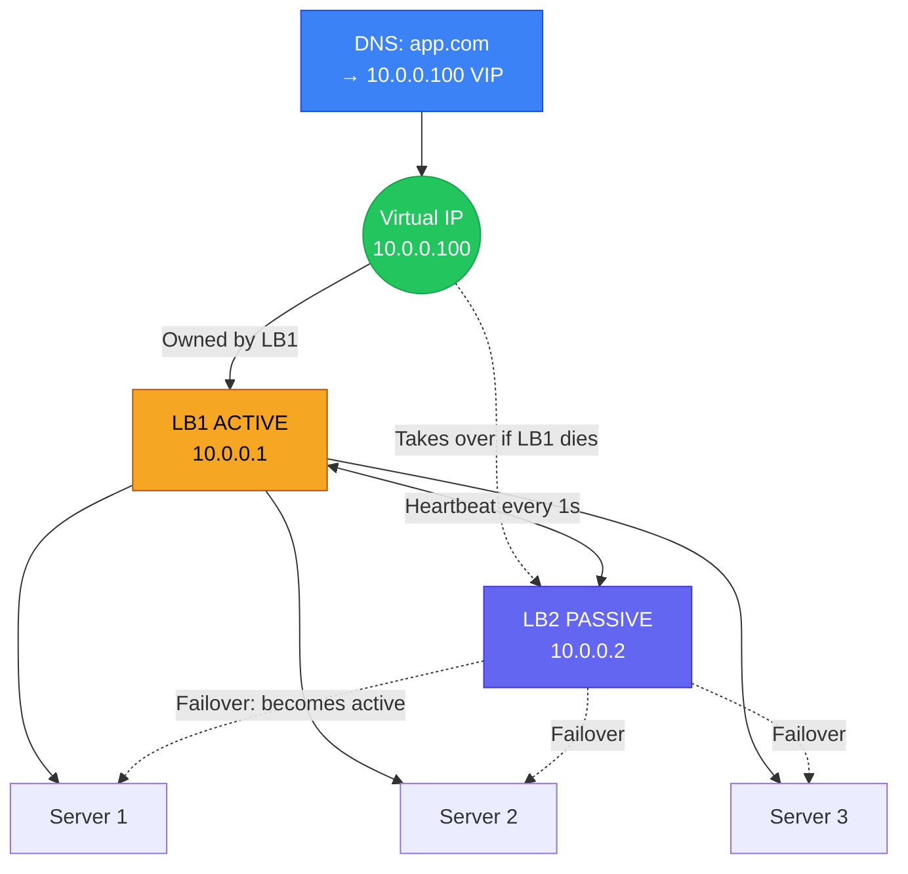
```mermaid
graph TD
    DNS[DNS: app.com\n→ 10.0.0.100 VIP] --> VIP((Virtual IP\n10.0.0.100))

    VIP -->|Owned by LB1| LB1[LB1 ACTIVE\n10.0.0.1]
    VIP -.->|Takes over if LB1 dies| LB2[LB2 PASSIVE\n10.0.0.2]

    LB1 <-->|Heartbeat every 1s| LB2

    LB1 --> S1[Server 1]
    LB1 --> S2[Server 2]
    LB1 --> S3[Server 3]

    LB2 -.->|Failover: becomes active| S1
    LB2 -.->|Failover| S2
    LB2 -.->|Failover| S3

    style VIP fill:#22c55e,stroke:#16a34a,color:#fff
    style LB1 fill:#F5A623,stroke:#B8520A,color:#000
    style LB2 fill:#6366f1,stroke:#4338ca,color:#fff
    style DNS fill:#3b82f6,stroke:#1d4ed8,color:#fff
```

**Failover sequence:**

```
Normal state:
  LB1 owns VIP 10.0.0.100
  LB2 receives heartbeat from LB1 every 1 second

LB1 fails at T=0:
  T=1: LB2 misses first heartbeat → starts timer
  T=2: LB2 misses second heartbeat → assumes LB1 is dead
  T=2: LB2 sends ARP broadcast: "I am now 10.0.0.100"
  T=2: Network switches update their ARP tables
  T=3: All new traffic now reaches LB2
  T=4: LB2 is fully handling traffic

Users experience:
  ~2-3 seconds of failed requests (connections dropped)
  After T=3: service fully restored
```

**Tools that implement this:**
- **Keepalived** (uses VRRP — Virtual Router Redundancy Protocol) — most common for HAProxy/Nginx
- **Pacemaker + Corosync** — enterprise-grade cluster management
- **AWS ALB/NLB** — cloud providers handle HA internally (you don't see it)

### Active-Active Setup (Even Better)

Both load balancers are active simultaneously. Both receive traffic. DNS returns both IPs (DNS round robin to the two LBs). If one LB fails, the other continues serving 100% of traffic.

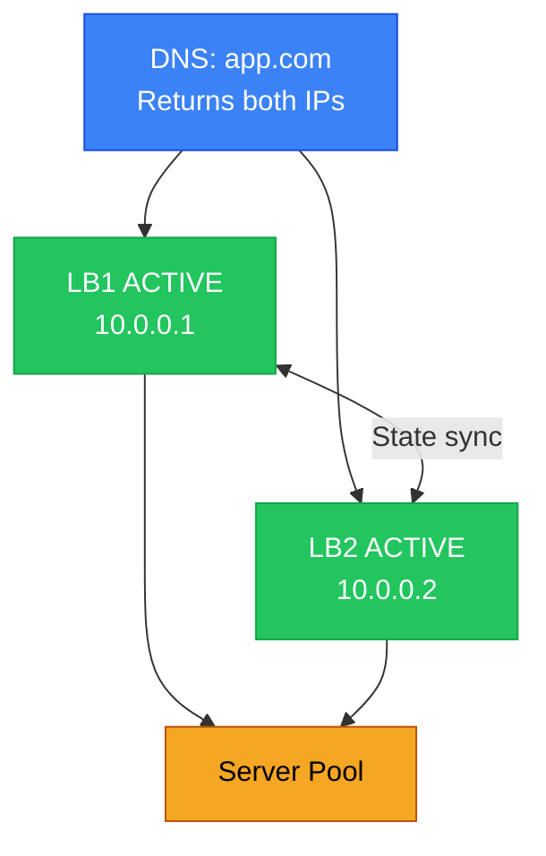
```mermaid
graph TD
    DNS[DNS: app.com\nReturns both IPs] --> LB1[LB1 ACTIVE\n10.0.0.1]
    DNS --> LB2[LB2 ACTIVE\n10.0.0.2]

    LB1 <-->|State sync| LB2

    LB1 --> Pool[Server Pool]
    LB2 --> Pool

    style DNS fill:#3b82f6,stroke:#1d4ed8,color:#fff
    style LB1 fill:#22c55e,stroke:#16a34a,color:#fff
    style LB2 fill:#22c55e,stroke:#16a34a,color:#fff
    style Pool fill:#F5A623,stroke:#B8520A,color:#000
```

**Active-Active vs Active-Passive:**

| Feature | Active-Passive | Active-Active |
|---|---|---|
| Resource utilization | One LB idle (wasted) | Both LBs serving traffic |
| Failover time | 1-3 seconds | Nearly instant (DNS redirect) |
| Complexity | Lower | Higher (state sync needed) |
| Cost | Pay for idle standby | Pay for both being active (but useful) |
| Used when | Cost matters | High traffic, zero tolerance for downtime |

---

## 11. AWS Application Load Balancer — Real World

### How AWS ALB Works

AWS ALB (Application Load Balancer) is a production-grade L7 load balancer. Let's see how it actually works at a company like Swiggy or Zomato on AWS.

```mermaid
graph TD
    Internet[Internet\n1M req/day]
    Internet --> ALB[AWS ALB\nL7 Load Balancer\nManaged, HA, Multi-AZ]

    ALB -->|GET /api/orders*| TG1[Target Group 1\nOrder Service\n10 EC2 instances]
    ALB -->|GET /api/restaurants*| TG2[Target Group 2\nRestaurant Service\n5 EC2 instances]
    ALB -->|POST /api/payments*| TG3[Target Group 3\nPayment Service\n3 EC2 instances\nhigh memory]
    ALB -->|GET /* default| TG4[Target Group 4\nFrontend Servers\n4 EC2 instances]

    style ALB fill:#F5A623,stroke:#B8520A,color:#000
    style TG1 fill:#22c55e,stroke:#16a34a,color:#fff
    style TG2 fill:#3b82f6,stroke:#1d4ed8,color:#fff
    style TG3 fill:#8b5cf6,stroke:#6d28d9,color:#fff
    style TG4 fill:#ec4899,stroke:#be185d,color:#fff
```

**Key AWS ALB features:**

**1. Listener Rules (L7 routing):**
```
Priority 1: IF path = /api/orders/*  → Forward to Order Target Group
Priority 2: IF path = /api/payments/* → Forward to Payment Target Group
Priority 3: IF header X-Beta-User = true → Forward to Beta Target Group
Default:    Forward to Frontend Target Group
```

**2. Target Groups:**
- A target group is a pool of backend instances (EC2, ECS tasks, Lambda functions, IPs)
- Each target group has its own health check configuration
- ALB distributes requests across healthy targets in the group

**3. Health Checks on ALB:**
```
Health check settings for Order Target Group:
  Protocol: HTTP
  Path: /health
  Port: 8080
  Healthy threshold: 2 (need 2 successes to mark healthy)
  Unhealthy threshold: 3 (3 failures → removed from rotation)
  Timeout: 5 seconds
  Interval: 30 seconds
```

**4. Multi-AZ (High Availability):**
```
ALB spans multiple Availability Zones:
  ap-south-1a → some EC2 instances
  ap-south-1b → some EC2 instances
  ap-south-1c → some EC2 instances

If one AZ goes down, ALB routes to instances in other AZs
(Cross-Zone Load Balancing must be enabled)
```

**5. Auto Scaling integration:**
```
Auto Scaling Group:
  Min: 3 instances
  Max: 20 instances
  Scale out: when CPU > 70%
  Scale in: when CPU < 30%

ALB automatically detects new instances when ASG scales
No manual configuration — fully automatic
```

**6. SSL Termination:**
```
Client → HTTPS (encrypted) → ALB → HTTP (plain) → Backend servers
                              ↑
                         SSL cert managed by AWS ACM
                         (free, auto-renewing)
Backend servers don't need to handle SSL — simpler, faster
```

**7. Sticky Sessions on ALB:**
```
ALB supports cookie-based sticky sessions:
  Duration-based: ALB creates its own cookie (AWSALB)
  Application-based: LB reads your app's cookie

# Enable in console or Terraform:
resource "aws_lb_target_group" "example" {
  stickiness {
    type            = "lb_cookie"
    cookie_duration = 86400  # 1 day
  }
}
```

**Real Zomato-like architecture on AWS:**

```mermaid
graph TD
    User[User Opens Zomato App]
    User --> R53[Route 53 DNS\nGeoDNS: route to nearest region]
    R53 --> ALB[AWS ALB\nap-south-1 Mumbai]

    ALB -->|/api/restaurants| RestSG[Restaurant Service\nTarget Group\nEC2 Auto Scaling 5-20]
    ALB -->|/api/orders| OrdSG[Order Service\nTarget Group\nEC2 Auto Scaling 3-10]
    ALB -->|/api/delivery| DelSG[Delivery Tracking\nTarget Group\nWebSocket servers 3-8]
    ALB -->|/* default| FE[Frontend\nTarget Group\nEC2 3-6 instances]

    RestSG --> RDS1[(RDS PostgreSQL\nRestaurant DB)]
    OrdSG --> RDS2[(RDS PostgreSQL\nOrder DB)]
    OrdSG --> Redis[(ElastiCache Redis\nSession + Cache)]
    DelSG --> Redis

    style ALB fill:#F5A623,stroke:#B8520A,color:#000
    style R53 fill:#6366f1,stroke:#4338ca,color:#fff
    style Redis fill:#dc2626,stroke:#b91c1c,color:#fff
    style RDS1 fill:#0284c7,stroke:#0369a1,color:#fff
    style RDS2 fill:#0284c7,stroke:#0369a1,color:#fff
```

**AWS ALB pricing (rough):**
- $0.0225 per ALB-hour (~$16.20/month just to have one)
- $0.008 per LCU-hour (LCU = Load Balancer Capacity Unit)
- 1 LCU = 25 new connections/sec OR 3,000 active connections OR 1 GB/hour

---

## 12. Common Interview Questions

### Q1: "Is the load balancer itself a single point of failure? How do you fix it?"

**Answer:**
Yes, a single load balancer is a SPOF. You fix it with:

1. **Active-Passive HA:** Two load balancers share a Virtual IP. Primary handles traffic. Secondary monitors heartbeat and takes over VIP if primary dies. Tools: Keepalived with VRRP. Failover time: 1-3 seconds.

2. **Active-Active:** Both LBs serve traffic. DNS returns both LB IPs (DNS round robin). If one dies, the other serves all traffic. Better resource utilization, faster failover.

3. **Cloud managed LBs (AWS ALB/NLB):** The cloud provider runs multiple LB instances under one endpoint. HA is built-in and transparent. You never see a single machine — it's a cluster managed for you.

---

### Q2: "How would you design load balancing for Instagram with 1 billion users?"

**Answer outline:**

```
Level 1: GeoDNS
  Route users to nearest datacenter
  Regions: US, Europe, Asia-Pacific, etc.

Level 2: Global Load Balancer (within region)
  Multiple AWS ALBs in active-active
  Route 53 health checks + failover

Level 3: Service-level Load Balancing
  Different target groups per service:
    Feed Service
    Story Service
    Direct Message Service
    Media Upload Service
    Notification Service

Level 4: Internal Load Balancing
  Service mesh (Envoy) for inter-service traffic
  Kubernetes ingress for container routing

Session handling:
  Stateless services → Redis cluster for sessions
  No sticky sessions at LB level

Health checks:
  Every 10 seconds
  2 failures → remove from pool
  3 successes → add back
```

---

### Q3: "Round Robin vs Least Connections — when to use which?"

**Answer:**

Use **Round Robin** when:
- All servers are identical in hardware and configuration
- All requests are roughly the same size/duration (simple GET APIs)
- Stateless application, short-lived connections

Use **Least Connections** when:
- Mix of short and long-lived connections (WebSockets, file downloads, streaming)
- Servers have different workloads (some handling background jobs)
- Response times vary significantly across requests

In practice: **Least Connections is almost always the better default** for web applications. The marginal overhead is negligible.

---

### Q4: "How does the LB handle a deployment without downtime?"

**Answer: Rolling Deployment**

```
1. Remove Server 1 from LB pool (LB health check fails or manual removal)
2. Wait for existing connections to drain (connection draining: 30-60 seconds)
3. Deploy new code to Server 1
4. Server 1 starts and passes health checks
5. LB adds Server 1 back to pool
6. Repeat for Server 2, Server 3, etc.

At all times, at least 2/3 servers are serving traffic.
Zero downtime. Users never see an error.

AWS ALB does this with:
  - Connection draining (deregistration delay): 30 seconds
  - Health check minimum healthy threshold: 1
  - Auto Scaling rolling update policy
```

---

### Q5: "When would you choose L4 over L7 load balancing?"

**Answer:**

Choose **L4** when:
- Traffic is not HTTP (databases, SMTP, game servers, IoT)
- You need absolute minimum latency (L4 doesn't parse application layer)
- You're doing raw TCP forwarding and don't need content-based routing
- Very high throughput requirements (millions of packets per second)

Choose **L7** when:
- You need URL-based routing to different microservices
- You need SSL termination
- You need cookie-based sticky sessions
- You want A/B testing or canary deployments
- You need rate limiting per endpoint
- You want to add/modify HTTP headers

**Real example:** At a company like Paytm:
- **L7 ALB** in front of their API gateway — routes `/api/payments/` to payment service, `/api/wallet/` to wallet service
- **L4 NLB** in front of their internal MySQL databases — pure TCP forwarding, minimum latency

---

### Q6: "What happens when a health check endpoint takes too long to respond?"

**Answer:**

A slow health check endpoint (e.g., it queries the DB) can cause false negatives:
- Under high load, DB is slow → health check times out → LB thinks server is down → removes it from pool
- Now remaining servers get more traffic → they also slow down → their health checks also fail
- **Cascade failure** — the whole pool gets removed!

**Best practices for health check endpoints:**
1. Keep the `/health` endpoint extremely lightweight
2. Don't query the main database in the health check
3. Check only critical dependencies (is the process running? can it accept connections?)
4. Optionally: two levels — `/health/live` (process alive) and `/health/ready` (ready to serve traffic)
5. Set health check timeout appropriately (5-10 seconds, not 1 second)

---

### Q7: "How do you handle WebSocket connections with a load balancer?"

**Answer:**

WebSockets are persistent, stateful connections. Once established, the connection stays open (could be hours).

**Challenges:**
- LB must maintain persistent TCP connections — can't swap servers mid-connection
- Connection counts can be very high (10K+ per server)
- Round Robin doesn't work well (one server may get all the long-lived connections)

**Solutions:**
1. **Sticky sessions at LB level:** Route WebSocket upgrades to a server and stick there. Works but limits failover.
2. **Least Connections algorithm:** Naturally balances long-lived WebSocket connections
3. **Layer 7 WebSocket-aware LB:** ALB, Nginx, HAProxy all understand WebSocket upgrade and handle it gracefully
4. **Architecture change:** Use a pub/sub system (Redis Pub/Sub, Kafka) so WebSocket servers are stateless. Client reconnects to any server and gets events via the shared pub/sub.

**Real example:** WhatsApp's architecture uses a message queue behind WebSocket servers. Any WS server can serve any client because messages flow through the shared queue, not server memory.

---

## 13. Key Takeaways

```
╔══════════════════════════════════════════════════════════════════════╗
║                    LOAD BALANCING — KEY TAKEAWAYS                   ║
╠══════════════════════════════════════════════════════════════════════╣
║                                                                      ║
║  WHY                                                                 ║
║  ├─ Eliminate single points of failure                               ║
║  ├─ Enable horizontal scaling                                        ║
║  ├─ Enable zero-downtime deployments                                 ║
║  └─ Distribute traffic evenly for best user experience               ║
║                                                                      ║
║  L4 vs L7                                                            ║
║  ├─ L4: faster, protocol-agnostic, IP+port routing only              ║
║  └─ L7: smarter, URL/header/cookie routing, SSL termination          ║
║                                                                      ║
║  ALGORITHMS                                                          ║
║  ├─ Round Robin: simple, identical servers, uniform requests         ║
║  ├─ Weighted Round Robin: heterogeneous server fleet                 ║
║  ├─ Least Connections: best for mixed/long-lived connections         ║
║  ├─ Least Response Time: best user experience, needs monitoring      ║
║  ├─ IP Hash: stateful apps (but use Redis instead when possible)     ║
║  └─ Default production choice: Least Connections                     ║
║                                                                      ║
║  HEALTH CHECKS                                                       ║
║  ├─ Active: LB probes servers on schedule — fast detection           ║
║  ├─ Passive: LB observes real traffic — no extra requests            ║
║  ├─ Use both together for best coverage                              ║
║  └─ /health endpoint must be lightweight — don't query main DB       ║
║                                                                      ║
║  SESSION HANDLING                                                    ║
║  ├─ Sticky sessions = technical debt — avoid when possible           ║
║  ├─ Right answer: external session store (Redis, DynamoDB)           ║
║  └─ Stateless services scale infinitely — design for this            ║
║                                                                      ║
║  HA FOR LOAD BALANCERS                                               ║
║  ├─ Active-Passive with Virtual IP: simple, 1-3s failover            ║
║  ├─ Active-Active: better utilization, near-instant failover         ║
║  └─ Cloud LBs (AWS ALB/NLB): HA is built-in, use them               ║
║                                                                      ║
║  GLOBAL LB                                                           ║
║  ├─ GeoDNS routes users to nearest datacenter                        ║
║  ├─ DNS TTL must be low for fast failover (60-300s)                  ║
║  └─ AWS Route 53, Cloudflare are production-grade options            ║
║                                                                      ║
║  INTERVIEW GOLDEN RULES                                              ║
║  ├─ LB itself is a SPOF → always mention HA (VIP, Active-Active)     ║
║  ├─ Don't recommend sticky sessions — recommend Redis instead        ║
║  ├─ For microservices → L7 (URL-based routing)                       ║
║  ├─ For databases/gaming → L4 (pure TCP, low latency)                ║
║  └─ Cloud-native = use managed LBs (ALB/NLB) + auto scaling          ║
║                                                                      ║
╚══════════════════════════════════════════════════════════════════════╝
```

---

## Further Reading

- [AWS ALB Documentation](https://docs.aws.amazon.com/elasticloadbalancing/latest/application/introduction.html)
- [HAProxy Documentation](https://www.haproxy.org/#docs)
- [Nginx Load Balancing Guide](https://docs.nginx.com/nginx/admin-guide/load-balancer/http-load-balancer/)
- [VRRP and Keepalived for HA](https://keepalived.readthedocs.io/)
- [The Facebook Load Balancing Blog](https://engineering.fb.com/2014/11/13/production-engineering/solving-the-mystery-of-link-imbalance-a-metastable-failure-state-at-scale/)

---

## Next Steps

Continue to [Caching Strategies](../12-caching/README.md) to learn how to reduce load on your servers by caching data intelligently.

---

*Load balancers are the silent workhorses of every large-scale system. Master this, and you will design better systems. Yeh topic ek baar samajh gaye toh system design interviews mein confidence naturally aata hai.*
