# 12 — Reverse Proxy (Nginx, HAProxy, Traefik, Envoy)

> "Every major website on the planet — Instagram, YouTube, Netflix, Zomato — has a middleman sitting between you and their servers. You never talk to the real server. Understanding that middleman is understanding how the internet actually works."

---

## The Big Picture — Why Does Any of This Exist?

Samjho aise — you open Zomato on your phone and tap "Order Biryani." Your request travels across the internet. But does it land directly on a server deep inside Zomato's data center in Mumbai? No. It hits a gatekeeper first.

That gatekeeper is a **reverse proxy**. It inspects your request, figures out where it should go, adds some security, compresses the response, and sends it back to you — all in a few milliseconds. Your phone never knows the real server even existed.

This chapter is about that gatekeeper. We'll cover:
- What a reverse proxy is and why it exists
- Forward proxy vs reverse proxy (fundamentally different things)
- Nginx as a reverse proxy — real config you can copy-paste
- SSL/TLS termination — the most important thing a proxy does
- Load balancing, caching, rate limiting, DDoS protection inside Nginx
- HAProxy — the battle-hardened TCP/HTTP load balancer
- Traefik — the Kubernetes-native proxy
- Envoy/Istio — the modern service mesh proxy
- Cloudflare as the world's biggest reverse proxy
- Reverse proxy vs API Gateway vs Load Balancer — the comparison everyone gets confused about

Let's go.

---

## 1. The Core Mental Model — Forward vs Reverse Proxy

### Analogy: Two Very Different Middlemen

**Forward Proxy** — Imagine you want to send a complaint letter to a company, but you don't want them to know your home address. So you hire an agent. You give the letter to your agent, the agent puts *their* return address on the envelope, and sends it. The company sees the agent's address, not yours.

That agent is a **forward proxy**. It sits on the **client's side**. It hides the client's identity.

**Reverse Proxy** — Now imagine you walk into a 5-star hotel. You speak to the concierge. You never directly interact with housekeeping, the kitchen, the IT department, or the manager. The concierge takes your request, routes it to the right department, and brings you back the result. The hotel's internal structure stays completely hidden from you.

That concierge is a **reverse proxy**. It sits on the **server's side**. It hides the server's identity.

One tiny sentence separates them forever:
- **Forward proxy** = proxy that the *client* knows about and configures
- **Reverse proxy** = proxy that the *server's owner* deploys; the client doesn't know it exists

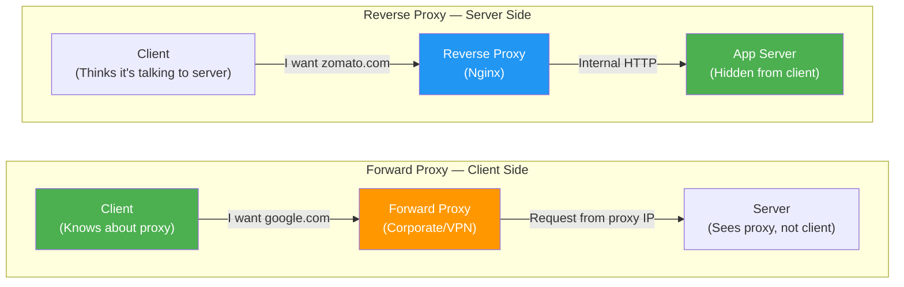

| Dimension | Forward Proxy | Reverse Proxy |
|---|---|---|
| **Sits in front of** | Clients | Servers |
| **Hides** | Client identity | Server identity |
| **Who configures it** | Client/IT admin | Server owner/DevOps |
| **Client aware?** | Yes — client explicitly uses it | No — client thinks it IS the server |
| **Examples** | VPNs, corporate proxies, Tor | Nginx, HAProxy, Cloudflare, Traefik |
| **Protects** | The client | The server fleet |
| **Common use** | Privacy, filtering, geo-bypass | Security, performance, scaling |

### Real-World Forward Proxy Examples

- **Corporate proxy (Squid)** — your company's IT blocks YouTube and routes all traffic through a proxy that logs everything
- **VPN (NordVPN, ExpressVPN)** — your traffic appears to come from the VPN server's IP
- **Tor Network** — the extreme version — multiple forward proxies chained together across the world

### Real-World Reverse Proxy Examples

- **Nginx at Zomato** — every request to zomato.com hits an Nginx cluster first
- **Cloudflare at Instagram** — Cloudflare sits in front of Instagram's servers in 200+ cities worldwide
- **AWS ALB at Swiggy** — Application Load Balancer distributes across hundreds of app servers
- **Traefik at a Kubernetes cluster** — auto-discovers services and routes traffic

---

## 2. Why Does a Reverse Proxy Exist? The Five Core Problems It Solves

Yeh kyun important hai — before we look at HOW it works, understand WHY anyone built this thing.

### Problem 1: Your App Server Can't Handle HTTPS Alone

Running HTTPS means doing cryptographic math — expensive. If you have 50 app servers, each one would need to manage SSL certificates and do the crypto work. That's 50 certificates to renew, 50 places to configure, and crypto overhead on every server.

**Reverse proxy solution:** SSL termination at one (or a few) proxy servers. The proxy decrypts HTTPS traffic, then sends plain HTTP internally on a private network. 50 backend servers stay simple.

### Problem 2: Your App Server Is Slow at Serving Static Files

A Node.js server is great at running JavaScript business logic. It's terrible at serving millions of image files. It holds file descriptors open, buffers them in memory, and wastes CPU that should be running your code.

**Reverse proxy solution:** Nginx serves static files directly from disk at 50,000+ requests/second with minimal CPU. Your app server never sees those requests.

### Problem 3: You Need to Scale Horizontally

One server can only handle so much traffic. Instagram in 2010 vs Instagram in 2024 — you cannot run everything on one machine forever.

**Reverse proxy solution:** Upstream server pools. The proxy distributes requests across N app servers. Add more servers → more capacity. Remove servers → less cost.

### Problem 4: Your Backend Architecture Is Complex and Changing

You have a monolith today. Tomorrow you're splitting it into microservices. Next month you're doing a blue-green deployment. You don't want clients to know about any of this.

**Reverse proxy solution:** The proxy routes based on URL paths, headers, and conditions. `/api/orders/*` goes to the orders service. `/api/users/*` goes to the user service. Clients just see one domain.

### Problem 5: The Internet Has Bad Actors

DDoS attacks, SQL injection, bots scraping your site, credential stuffing — all of this hits your servers directly without a proxy. Your app code would need to handle all of it.

**Reverse proxy solution:** Rate limiting, connection limiting, WAF rules, bot detection — all at the proxy layer. Bad traffic gets blocked before it ever touches your app.

---

## 3. Nginx as a Reverse Proxy — The Industry Standard

### Analogy: Nginx Is Like a Swiss Army Knife at the Hotel Front Desk

The concierge doesn't just route requests. They also check your ID (security), hold your luggage (caching), speak multiple languages (protocol translation), and keep track of how many requests you've made today (rate limiting). Nginx is that kind of concierge.

Nginx powers over **34% of all websites** on the internet. Every company you've heard of — Instagram, Netflix, YouTube, Dropbox, GitHub — uses Nginx or something built on top of it.

### Understanding Nginx's Two Main Blocks

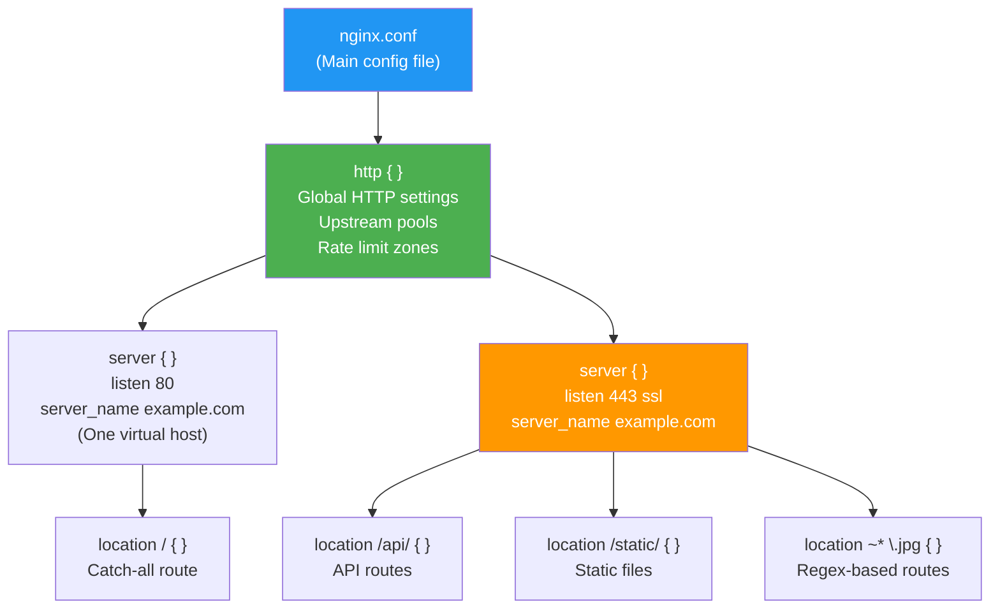

### Step 1: The Upstream Block — Defining Your Backend Pool

This is where you tell Nginx about your backend servers. Think of this as the hotel's internal directory of departments.

```nginx
# /etc/nginx/nginx.conf  (inside the http {} block)

http {

    # Rate limiting zone — 10 requests/second per IP, stored in 10MB shared memory
    limit_req_zone $binary_remote_addr zone=api_limit:10m rate=10r/s;

    # Connection limiting zone
    limit_conn_zone $binary_remote_addr zone=conn_limit:10m;

    # ─────────────────────────────────────────
    # UPSTREAM POOLS — Your backend server fleet
    # ─────────────────────────────────────────

    # App servers — for /api/* requests
    upstream app_servers {
        # Load balancing algorithm — pick ONE:
        # (default = round robin, no keyword needed)
        least_conn;           # Pick server with fewest active connections

        server 10.0.0.1:8080 weight=3;   # Gets 3x traffic (bigger machine)
        server 10.0.0.2:8080 weight=1;   # Normal weight
        server 10.0.0.3:8080 backup;     # Only used if primary servers fail

        # Keep 32 persistent connections open to backends (avoids TCP handshake per request)
        keepalive 32;

        # Active health checks (Nginx Plus only; for OSS use passive)
        # health_check interval=5s fails=2 passes=2 uri=/health;
    }

    # A separate pool for a different microservice
    upstream auth_service {
        server 10.0.1.1:9090;
        server 10.0.1.2:9090;
        keepalive 16;
    }

    include /etc/nginx/conf.d/*.conf;
}
```

### Step 2: The Server Block — SSL Termination and Routing

```nginx
# /etc/nginx/conf.d/myapp.conf

# ─────────────────────────────────────
# Block 1: HTTP → HTTPS redirect
# ─────────────────────────────────────
server {
    listen 80;
    server_name myapp.com www.myapp.com;

    # Force HTTPS everywhere
    return 301 https://$host$request_uri;
}

# ─────────────────────────────────────
# Block 2: The main HTTPS server
# ─────────────────────────────────────
server {
    listen 443 ssl http2;
    server_name myapp.com www.myapp.com;

    # ── SSL/TLS TERMINATION ──────────────────────────────────────────
    # Decrypt HTTPS here. Backends receive plain HTTP (on private network).
    ssl_certificate     /etc/letsencrypt/live/myapp.com/fullchain.pem;
    ssl_certificate_key /etc/letsencrypt/live/myapp.com/privkey.pem;

    # Only allow modern TLS versions — TLS 1.0 and 1.1 are broken
    ssl_protocols TLSv1.2 TLSv1.3;

    # Prefer server cipher order (prevents downgrade attacks)
    ssl_prefer_server_ciphers on;
    ssl_ciphers 'ECDHE-ECDSA-AES256-GCM-SHA384:ECDHE-RSA-AES256-GCM-SHA384';

    # SSL session caching — avoids full TLS handshake on repeat visits
    ssl_session_cache shared:SSL:10m;
    ssl_session_timeout 10m;

    # OCSP Stapling — proves cert is valid without client contacting CA
    ssl_stapling on;
    ssl_stapling_verify on;

    # ── COMPRESSION ─────────────────────────────────────────────────
    gzip on;
    gzip_vary on;
    gzip_min_length 1024;   # Don't gzip tiny responses (not worth CPU)
    gzip_types
        text/plain
        text/css
        text/javascript
        application/json
        application/javascript
        application/xml
        image/svg+xml;

    # ── SECURITY HEADERS ────────────────────────────────────────────
    add_header Strict-Transport-Security "max-age=31536000; includeSubDomains; preload" always;
    add_header X-Frame-Options "SAMEORIGIN" always;
    add_header X-Content-Type-Options "nosniff" always;
    add_header X-XSS-Protection "1; mode=block" always;
    add_header Referrer-Policy "strict-origin-when-cross-origin" always;
    # Hide that this is Nginx (don't reveal your weapons)
    server_tokens off;

    # ── LOCATION BLOCKS (routing rules) ─────────────────────────────

    # Static files — served by Nginx directly, never hits backend
    location /static/ {
        alias /var/www/myapp/public/;
        expires 1y;
        add_header Cache-Control "public, immutable";
        access_log off;       # Don't log every image/CSS hit
        tcp_nodelay off;      # Optimize for large files
        sendfile on;          # Kernel-level file serving (much faster)
    }

    # Regex match for any asset file by extension
    location ~* \.(jpg|jpeg|png|gif|ico|webp|css|js|woff|woff2|ttf|svg)$ {
        root /var/www/myapp/public;
        expires 30d;
        add_header Cache-Control "public";
        access_log off;
    }

    # Health check — load balancers poll this; don't rate limit it
    location /health {
        access_log off;
        proxy_pass http://app_servers;
    }

    # API routes — rate limited, forwarded to backend pool
    location /api/ {
        # Rate limiting: burst=20 allows 20 queued requests, nodelay = reject immediately after burst
        limit_req zone=api_limit burst=20 nodelay;
        limit_req_status 429;

        # Connection limit per IP
        limit_conn conn_limit 30;

        proxy_pass         http://app_servers;
        proxy_http_version 1.1;

        # CRITICAL: Pass client info to backend
        proxy_set_header Host              $host;
        proxy_set_header X-Real-IP         $remote_addr;
        proxy_set_header X-Forwarded-For   $proxy_add_x_forwarded_for;
        proxy_set_header X-Forwarded-Proto $scheme;

        # Required for keepalive connections to upstream
        proxy_set_header Connection "";

        # Timeouts — tune these for your app's expected response times
        proxy_connect_timeout  10s;
        proxy_read_timeout     60s;
        proxy_send_timeout     60s;

        # Buffer settings — proxy buffers response before sending to slow clients
        proxy_buffering on;
        proxy_buffer_size 4k;
        proxy_buffers 8 16k;
    }

    # Auth service — separate upstream pool
    location /auth/ {
        proxy_pass http://auth_service;
        proxy_set_header Host            $host;
        proxy_set_header X-Real-IP       $remote_addr;
        proxy_set_header X-Forwarded-For $proxy_add_x_forwarded_for;
        proxy_http_version 1.1;
        proxy_set_header Connection "";
    }

    # Everything else — serve frontend (React SPA)
    location / {
        root /var/www/myapp/dist;
        try_files $uri $uri/ /index.html;  # SPA fallback for client-side routing
        expires 5m;
    }
}
```

### How SSL/TLS Termination Works — The Full Flow

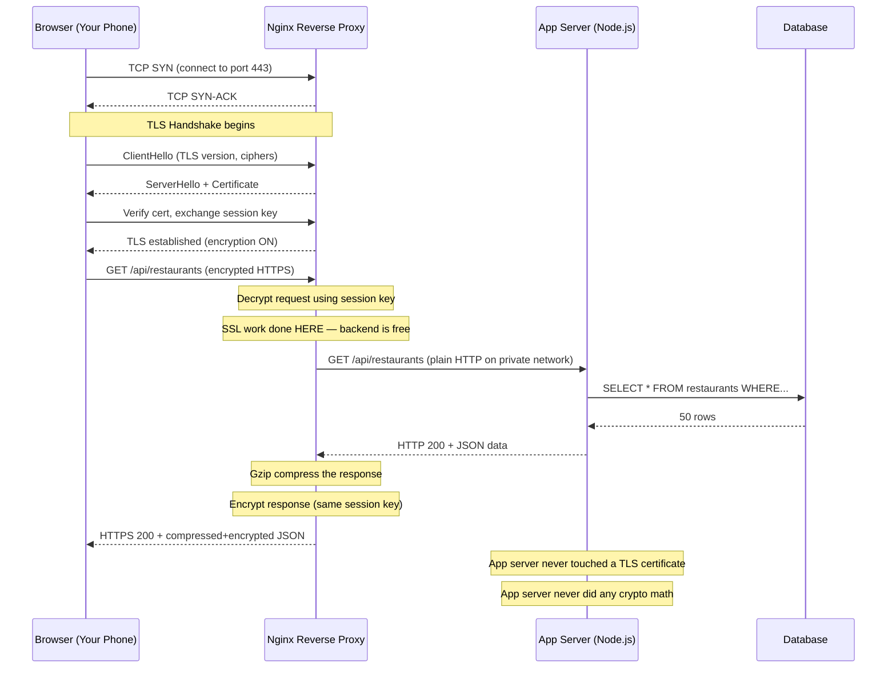

**Interview Insight:** The key insight here is that SSL termination offloads crypto math from app servers. A single Nginx server with a modern CPU can handle 10,000+ TLS connections/second. Your app servers can focus 100% on business logic.

---

## 4. Load Balancing Within Nginx — The Upstream Algorithms Deep Dive

### Analogy: The Buffet Queue Manager

At a busy wedding buffet, there are 5 serving stations. A queue manager stands at the entrance and decides which station each guest goes to. How they decide depends on the algorithm:
- **Round robin:** "You go to station 1. You to station 2. You to station 3. Next one back to 1."
- **Least connections:** "Station 3 has the shortest line right now — you go there."
- **IP hash:** "Guests from Table 5 always go to station 2 (so they always get the same waiter)."

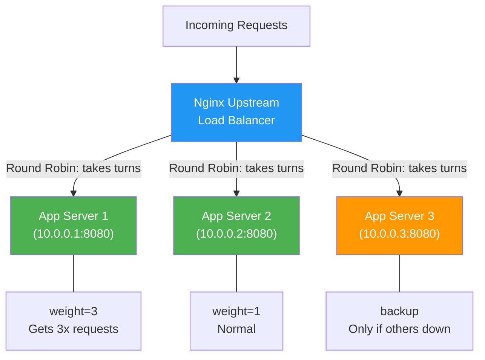

| Algorithm | Nginx Keyword | How It Works | Best For | Avoid When |
|---|---|---|---|---|
| **Round Robin** | (default) | Requests go to each server in turn | Stateless apps, equal-spec servers | Long-running connections |
| **Weighted Round Robin** | `weight=N` | Server with weight 3 gets 3x requests | Mixed server specs (some bigger) | All servers are identical |
| **Least Connections** | `least_conn` | Pick server with fewest active connections | File uploads, WebSockets, slow requests | Very short-lived requests (overhead not worth it) |
| **IP Hash** | `ip_hash` | Same client IP always hits same server | Session-based apps without Redis session store | Uneven IP distribution (data center traffic) |
| **Hash (generic)** | `hash $variable` | Any variable as hash key (URI, cookie, etc.) | Cache server affinity | Dynamic backends |
| **Random** | `random` | Pick randomly, optionally `two least_conn` | Simple setup, works well at scale | Single server |

```nginx
# Examples of each in an upstream block:

upstream round_robin_example {
    server 10.0.0.1:8080;
    server 10.0.0.2:8080;
    server 10.0.0.3:8080;
    # No keyword = round robin by default
}

upstream least_conn_example {
    least_conn;
    server 10.0.0.1:8080;
    server 10.0.0.2:8080;
}

upstream ip_hash_example {
    ip_hash;                    # Sticky sessions — same IP → same server
    server 10.0.0.1:8080;
    server 10.0.0.2:8080;
}

upstream hash_uri_example {
    hash $request_uri consistent;  # Same URL always goes to same backend
    server 10.0.0.1:8080;          # Great for backend cache efficiency
    server 10.0.0.2:8080;
}
```

---

## 5. Caching at the Proxy Level

### Analogy: The Photo Copier in the Office

Imagine the boss asks for a report. It takes 10 minutes to prepare. The next day, the same boss asks for the same report. Instead of spending 10 more minutes, the assistant hands over the photocopy from yesterday. The boss gets it instantly and the report-writer isn't bothered.

Nginx's proxy cache is that photocopy. The first request fetches from the backend (slow). The next 1000 requests for the same URL get served from disk (fast, free).

```nginx
http {

    # Define a cache zone — 10MB of keys, 1GB of cached content, purge after 60min of no use
    proxy_cache_path /var/cache/nginx
        levels=1:2
        keys_zone=app_cache:10m
        max_size=1g
        inactive=60m
        use_temp_path=off;

    server {
        listen 443 ssl http2;
        # ... ssl config ...

        location /api/products/ {
            proxy_pass http://app_servers;

            # Use the cache zone defined above
            proxy_cache app_cache;

            # Cache key — what makes a unique response?
            proxy_cache_key "$scheme$request_method$host$request_uri";

            # Cache these status codes
            proxy_cache_valid 200 302 10m;   # Cache 200/302 responses for 10 minutes
            proxy_cache_valid 404 1m;         # Cache 404s for 1 minute

            # Serve stale cache if backend is down (great for resilience)
            proxy_cache_use_stale error timeout updating http_500 http_502 http_503;

            # Add header so you can see if it was a cache HIT or MISS
            add_header X-Cache-Status $upstream_cache_status;

            # Don't cache if the client sends Cache-Control: no-cache
            proxy_cache_bypass $http_cache_control;
        }

        # Never cache these — user-specific or write operations
        location /api/cart/ {
            proxy_no_cache 1;
            proxy_cache_bypass 1;
            proxy_pass http://app_servers;
        }
    }
}
```

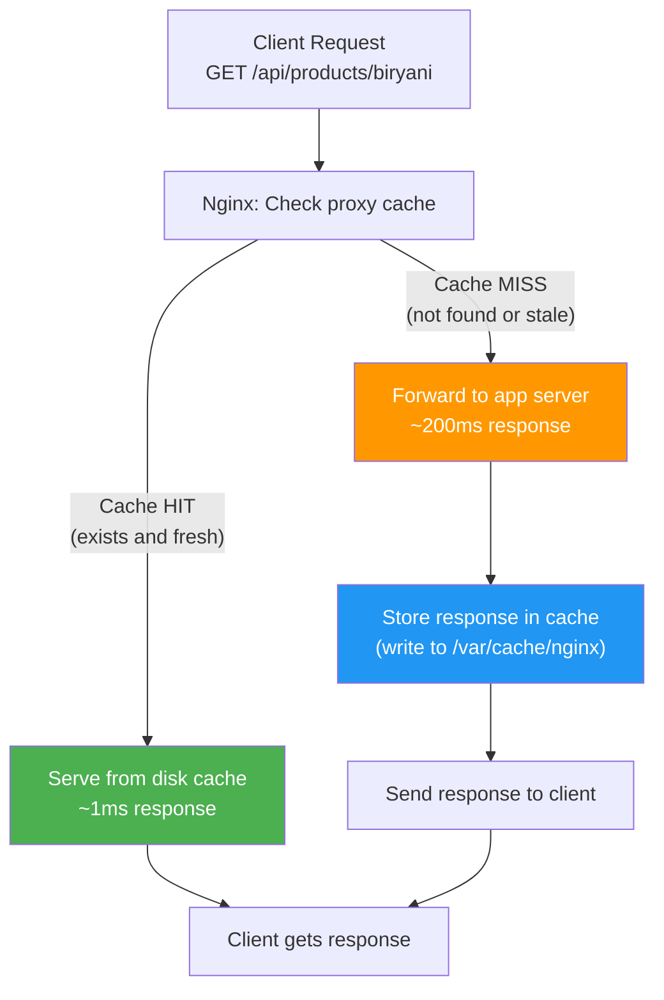

**Real example:** Swiggy's restaurant listing page (`/restaurants/bangalore`) barely changes minute to minute. Caching it at the proxy layer for 2 minutes means their backend handles 1 request per restaurant per city per 2 minutes — not millions. At 10 million active users, that's a massive reduction in backend load.

---

## 6. Rate Limiting with Nginx — Protecting Your Backend from Overload

### Analogy: The Club Bouncer

The bouncer at a nightclub has one job: control the rate of entry. "Maximum 5 people per minute through this door. If more try, they wait or get turned away." He doesn't care who you are or where you came from — just the rate.

Nginx's rate limiting is that bouncer, but at the network level.

```nginx
http {

    # Zone 1: General API rate limiting — 10 req/s per IP
    # $binary_remote_addr = client IP (binary for memory efficiency)
    # zone=api:10m = name the zone "api", allocate 10MB for IP tracking
    limit_req_zone $binary_remote_addr zone=api:10m rate=10r/s;

    # Zone 2: Login endpoint — very strict (brute force protection)
    limit_req_zone $binary_remote_addr zone=login:10m rate=1r/s;

    # Zone 3: Search endpoint — more lenient
    limit_req_zone $binary_remote_addr zone=search:10m rate=30r/s;

    # Simultaneous connection limiting
    limit_conn_zone $binary_remote_addr zone=perip:10m;

    server {
        # API endpoints
        location /api/ {
            # burst=20: allow a burst of 20 extra requests to queue
            # nodelay: process burst requests immediately (don't make them wait)
            limit_req zone=api burst=20 nodelay;
            limit_req_status 429;           # Return "Too Many Requests"
            limit_conn perip 50;            # Max 50 simultaneous connections per IP

            proxy_pass http://app_servers;
        }

        # Login — protect against brute force
        location /api/auth/login {
            limit_req zone=login burst=5 nodelay;
            limit_req_status 429;

            # Custom error page for rate limiting
            error_page 429 /429.html;

            proxy_pass http://app_servers;
        }

        # Expensive search — be generous but not unlimited
        location /api/search/ {
            limit_req zone=search burst=50 nodelay;
            proxy_pass http://app_servers;
        }
    }
}
```

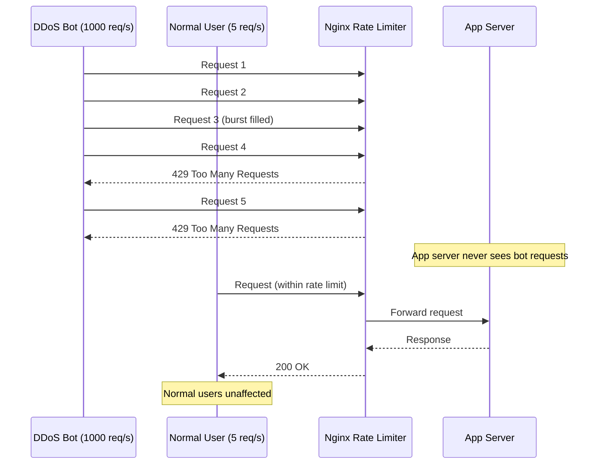

**Interview Insight:** Rate limiting at the proxy layer is much more efficient than rate limiting in your application code. By the time a request hits your app, you've already used CPU, RAM, and potentially DB connections. Nginx drops it in microseconds with zero app server involvement.

---

## 7. Security — Hiding Your Backend Topology

### Why You Don't Want the World Knowing Your Internal Setup

If an attacker knows you're running Node.js 16.x on Ubuntu 20.04 with PostgreSQL 14, they can search for known CVEs (vulnerabilities) targeting exactly that stack. The reverse proxy hides all of this.

```nginx
server {
    # Don't reveal Nginx version (prevents targeted exploits)
    server_tokens off;

    # Don't pass server info to clients
    proxy_hide_header X-Powered-By;    # Hides "Express" / "Django" etc.
    proxy_hide_header Server;          # Would reveal backend server type

    # Add misleading server header (optional — some prefer to omit entirely)
    # add_header Server "cloudflare" always;  # Make them think you're Cloudflare

    # Hide internal IP addresses from responses
    proxy_hide_header X-Backend-Server;
    proxy_hide_header X-Application-Context;

    # Strip cookies from cached content (prevent cache poisoning)
    proxy_ignore_headers Set-Cookie;
}
```

### DDoS Protection at the Proxy Layer

```nginx
http {
    # Limit connections per IP
    limit_conn_zone $binary_remote_addr zone=ddos_conn:10m;

    # Limit request rate per IP
    limit_req_zone $binary_remote_addr zone=ddos_req:10m rate=30r/s;

    server {
        # Block common attack patterns (simplified WAF)
        # Block requests with SQL injection patterns in URI
        if ($request_uri ~* "(union|select|insert|drop|delete|update|script)") {
            return 403;
        }

        # Block abnormally large URIs (path traversal attempts)
        if ($request_uri ~* "\.\.") {
            return 403;
        }

        # Block requests without a host header (scanner/bot behavior)
        if ($host = '') {
            return 444;    # 444 = close connection without response (Nginx-specific)
        }

        # Reject oversized request bodies (prevents memory exhaustion)
        client_max_body_size 10m;

        location / {
            limit_conn ddos_conn 20;
            limit_req zone=ddos_req burst=50 nodelay;
            proxy_pass http://app_servers;
        }
    }
}
```

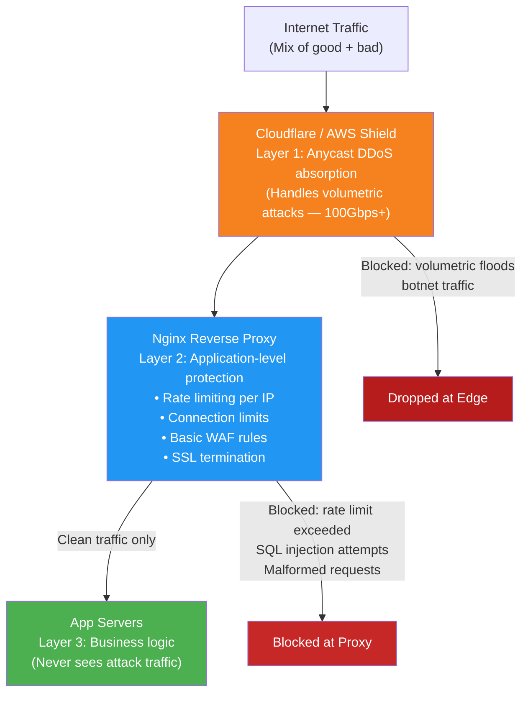

---

## 8. Static File Serving — The Free Performance Boost

### Analogy: The Library Catalogue vs the Librarian

If you ask the librarian (your app server) "what's the cover of this book?" — they'd have to go find the book, read it, and describe it. That's wasteful. But if you ask for a scanned copy from the catalogue (Nginx serving files directly), you get it instantly.

Your app server should never serve images, CSS, JS files, or fonts. Nginx should.

```nginx
server {
    listen 443 ssl http2;

    # Serve entire /uploads directory directly
    location /uploads/ {
        alias /var/www/storage/uploads/;

        # Long cache time for user-uploaded content
        expires 7d;
        add_header Cache-Control "public";

        # Security: don't execute scripts in uploads
        location ~* \.(php|py|rb|sh)$ {
            deny all;
        }
    }

    # Fingerprinted assets — cache forever (file hash in filename)
    # e.g., /static/bundle.a3f7c.js — hash changes when content changes
    location ~* /static/.*\.[a-f0-9]{8,}\.(js|css|woff2?)$ {
        root /var/www/app/dist;
        expires 1y;
        add_header Cache-Control "public, immutable";
        access_log off;
    }

    # Regular static assets — moderate cache
    location ~* \.(jpg|jpeg|png|gif|ico|svg|webp)$ {
        root /var/www/app/public;
        expires 30d;
        add_header Cache-Control "public";
        access_log off;
        sendfile on;           # Zero-copy file sending via kernel
        tcp_nopush on;         # Send headers and start of file together
    }
}
```

**Numbers that matter:** A single Nginx instance on a 2-core VM can serve 100,000+ static file requests per second. A Node.js server on the same machine might handle 2,000-5,000. Don't use Node.js for what Nginx does better.

---

## 9. HAProxy — The Battle-Hardened TCP/HTTP Load Balancer

### Analogy: HAProxy Is Like a Highway Traffic Controller

Nginx is the Swiss Army Knife — it does everything well. HAProxy is the specialized tool — it does load balancing and proxying at insane performance levels. Think of it as the dedicated highway traffic controller who does nothing but decide which lane cars go into, but does it 2 million times a second.

HAProxy stands for **High Availability Proxy**. It's been battle-tested since 2000. Instagram, GitHub, Reddit, and Airbnb use it.

### When to Choose HAProxy Over Nginx

| Scenario | HAProxy | Nginx |
|---|---|---|
| TCP load balancing (non-HTTP) | Excellent — native support | Basic |
| MySQL/PostgreSQL load balancing | Yes | No |
| Raw HTTP performance | Slightly faster | Fast |
| Advanced health checks | Richer options | Good |
| Static file serving | No | Yes |
| SSL termination | Yes | Yes |
| Caching | No | Yes |
| Web server features | No | Yes |
| Config complexity | Moderate | Moderate |
| Stats/monitoring UI | Built-in dashboard | External tools |

### HAProxy Config — TCP Load Balancing (MySQL)

```haproxy
# /etc/haproxy/haproxy.cfg

global
    log /dev/log local0
    maxconn 50000
    user haproxy
    group haproxy
    daemon

defaults
    log     global
    mode    tcp           # TCP mode — works with any protocol, not just HTTP
    option  tcplog
    option  dontlognull
    timeout connect 5s
    timeout client  30s
    timeout server  30s

#──────────────────────────────────────────────────────────────────
# FRONTEND: where HAProxy listens for incoming connections
#──────────────────────────────────────────────────────────────────
frontend mysql_frontend
    bind *:3306           # Listen on MySQL's default port
    mode tcp
    default_backend mysql_backend

#──────────────────────────────────────────────────────────────────
# BACKEND: where HAProxy sends connections
#──────────────────────────────────────────────────────────────────
backend mysql_backend
    mode tcp
    balance roundrobin    # or leastconn for long-lived DB connections

    # Health check: try to connect to MySQL port every 5 seconds
    option tcp-check

    server mysql-primary   10.0.0.1:3306 check inter 5s rise 2 fall 3
    server mysql-replica1  10.0.0.2:3306 check inter 5s rise 2 fall 3 weight 1
    server mysql-replica2  10.0.0.3:3306 check inter 5s rise 2 fall 3 weight 1
    # rise 2 = needs 2 successful checks to mark healthy
    # fall 3 = needs 3 failed checks to mark unhealthy
```

### HAProxy Config — HTTP Load Balancing with Advanced Features

```haproxy
#──────────────────────────────────────────────────────────────────
# HTTP mode with ACLs (Access Control Lists) — route by URL
#──────────────────────────────────────────────────────────────────
frontend http_frontend
    bind *:80
    bind *:443 ssl crt /etc/ssl/myapp.pem   # SSL termination
    mode http
    option httplog

    # Redirect HTTP to HTTPS
    redirect scheme https if !{ ssl_fc }

    # Define ACLs — conditions for routing
    acl is_api      path_beg /api/
    acl is_auth     path_beg /auth/
    acl is_static   path_beg /static/
    acl is_mobile   hdr(User-Agent) -i mobile android iphone

    # Route based on ACLs
    use_backend api_servers   if is_api
    use_backend auth_servers  if is_auth
    default_backend web_servers

backend api_servers
    mode http
    balance leastconn
    option httpchk GET /health HTTP/1.1\r\nHost:\ api.myapp.com
    http-check expect status 200

    # Stick table — session persistence by cookie
    cookie SERVERID insert indirect nocache

    server api-1 10.0.0.1:8080 check cookie s1 maxconn 1000
    server api-2 10.0.0.2:8080 check cookie s2 maxconn 1000
    server api-3 10.0.0.3:8080 check cookie s3 maxconn 1000

backend auth_servers
    mode http
    balance roundrobin
    server auth-1 10.0.1.1:9090 check
    server auth-2 10.0.1.2:9090 check

backend web_servers
    mode http
    balance roundrobin
    server web-1 10.0.2.1:80 check
    server web-2 10.0.2.2:80 check

# ── STATS DASHBOARD ─────────────────────────────────────────────
listen stats
    bind *:8404
    stats enable
    stats uri /haproxy/stats
    stats auth admin:secretpassword
    stats refresh 10s
    stats show-legends
```

### HAProxy Architecture Flow

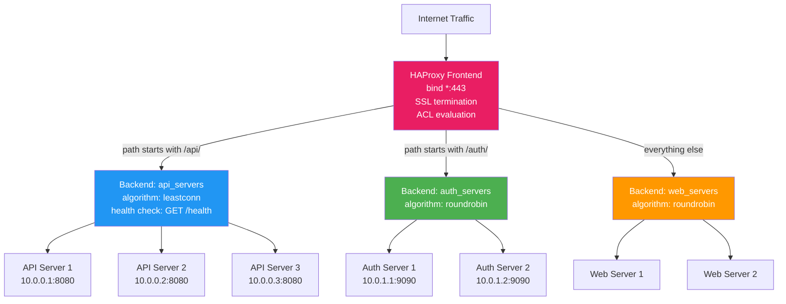

---

## 10. Traefik — The Kubernetes-Native Reverse Proxy

### Analogy: Traefik Is Like a Self-Managing Concierge

Traditional Nginx requires you to manually update config files whenever you add or remove a server. It's like a concierge who needs a new employee handbook every time a new hotel department opens.

Traefik watches your Kubernetes cluster automatically. When you deploy a new service, Traefik discovers it and starts routing traffic to it — no config file editing required. It's a self-updating concierge.

### Why Traefik Exists

In Kubernetes, services come and go constantly. You might have 50 microservices, each scaling up/down based on load. Maintaining Nginx config for all of this manually would be a nightmare. Traefik reads Kubernetes annotations and auto-configures itself.

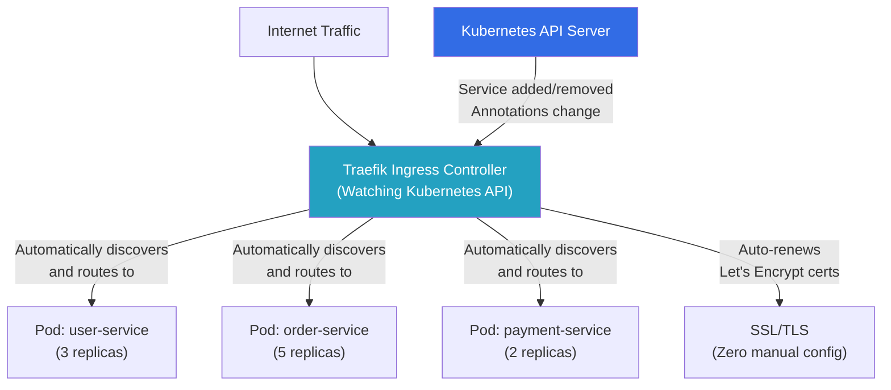

### Traefik Configuration in Kubernetes (via Ingress annotations)

```yaml
# kubernetes-ingress.yaml
apiVersion: networking.k8s.io/v1
kind: Ingress
metadata:
  name: myapp-ingress
  annotations:
    # Tell Kubernetes to use Traefik as the ingress controller
    kubernetes.io/ingress.class: "traefik"

    # Rate limiting
    traefik.ingress.kubernetes.io/rate-limit: |
      extractorfunc: client.ip
      rateset:
        default:
          period: 1s
          average: 100
          burst: 200

    # Middleware: redirect HTTP to HTTPS
    traefik.ingress.kubernetes.io/redirect-entry-point: "https"

spec:
  rules:
    - host: myapp.com
      http:
        paths:
          - path: /api/users
            pathType: Prefix
            backend:
              service:
                name: user-service      # Kubernetes service name
                port:
                  number: 8080
          - path: /api/orders
            pathType: Prefix
            backend:
              service:
                name: order-service
                port:
                  number: 8080
          - path: /
            pathType: Prefix
            backend:
              service:
                name: frontend-service
                port:
                  number: 3000

  tls:
    - hosts:
        - myapp.com
      secretName: myapp-tls-cert        # Traefik can auto-provision via Let's Encrypt
```

### Traefik vs Nginx in Kubernetes

| Dimension | Nginx Ingress | Traefik |
|---|---|---|
| **Config style** | ConfigMaps + manual reload | Annotations, auto-reload |
| **Service discovery** | Manual | Automatic from K8s API |
| **SSL auto-renewal** | Manual (cert-manager needed) | Built-in Let's Encrypt |
| **Dashboard** | Requires external tools | Built-in |
| **Performance** | Slightly higher | Good |
| **Ecosystem** | Mature, huge community | Growing fast |
| **Learning curve** | Familiar (standard Nginx) | New concepts |

---

## 11. Istio and Envoy — The Service Mesh Proxy

### Analogy: Envoy as a Personal Assistant for Each Microservice

In a microservices world, you have 50+ services talking to each other. Each service needs to: retry failed requests, circuit-break on failures, encrypt traffic, trace requests across services, and rate limit downstream calls.

Instead of building all this into each service (messy, language-specific), you put a small proxy *next to* each service — a sidecar proxy. That sidecar handles all the networking complexity, and the service just handles business logic.

This is **Istio** (the control plane that manages the sidecars) + **Envoy** (the actual sidecar proxy).

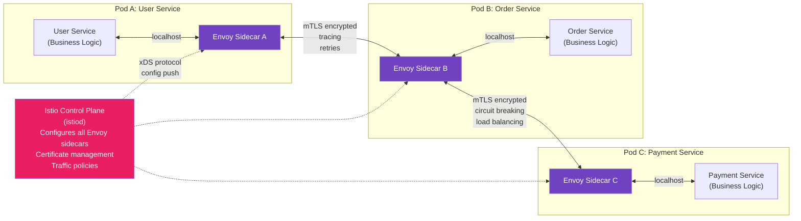

### What Envoy Does That Nginx Doesn't

| Feature | Nginx | Envoy |
|---|---|---|
| **Dynamic config (no reload)** | No — needs reload | Yes — xDS API |
| **gRPC native support** | Limited | Excellent |
| **Distributed tracing** | No | Yes (Jaeger, Zipkin) |
| **Circuit breaking** | No | Yes |
| **Retries with backoff** | No | Yes |
| **Mutual TLS (mTLS)** | Manual config | Automatic via Istio |
| **Traffic mirroring** | No | Yes |
| **Canary deployments** | Config-heavy | Built-in |
| **L7 load balancing** | Good | Excellent |
| **Observability** | Limited | Rich metrics, tracing |

### Envoy's xDS — Dynamic Configuration Without Restart

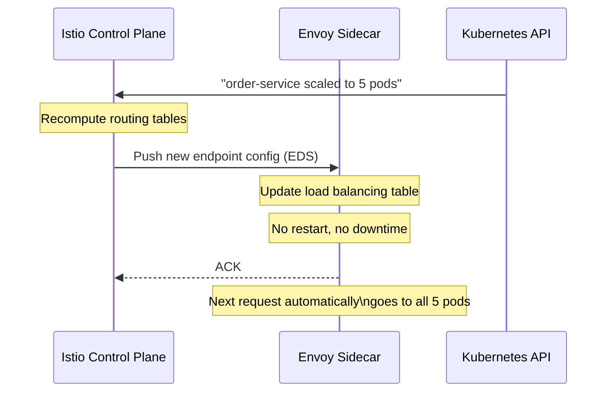

The xDS (discovery service) protocol is Envoy's superpower — configuration updates happen in real-time via a gRPC stream. Nginx requires a config file edit + reload (brief disruption). Envoy updates without any interruption.

---

## 12. Cloudflare — The World's Biggest Reverse Proxy

### Analogy: Cloudflare Is Like Having 300 Hotel Concierges Around the World

Normally, a user in Mumbai connecting to a server in Virginia has 200ms of latency just from distance. Cloudflare puts a concierge in Mumbai, Singapore, London, Frankfurt, and 300 other cities. The Mumbai user talks to the Mumbai concierge. The concierge may have the answer cached (CDN), or it forwards the request to your actual server.

Cloudflare processes **3.3 trillion DNS queries per day** and handles traffic for over 20% of all web properties.

### What Cloudflare Does As a Reverse Proxy

1. **CDN (Content Delivery)** — static files served from the nearest PoP (Point of Presence)
2. **DDoS Protection** — absorbs volumetric attacks at 100+ Tbps capacity across 300 cities
3. **WAF** — blocks OWASP top 10 attacks, bot traffic, and custom rules
4. **SSL/TLS termination** — at the edge, closest to users (lower latency)
5. **Bot management** — distinguishes humans from bots using ML
6. **Rate limiting** — per IP, per country, per ASN
7. **DNS** — authoritative DNS with 11ms average global resolution
8. **Workers** — serverless compute at the edge (like Lambda but globally distributed)
9. **Caching** — configurable cache rules for any URL pattern

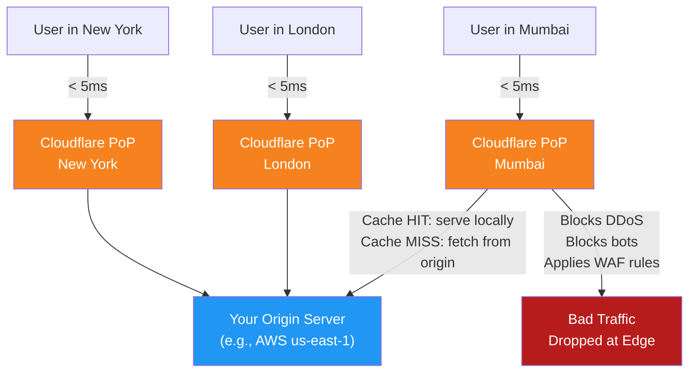

### How Every Major Website Uses This Pattern

- **Instagram** — Cloudflare (or similar) at the edge for DDoS protection and CDN. Nginx inside their data centers for routing and SSL termination.
- **Zomato** — AWS CloudFront as CDN, AWS ALB for load balancing, Nginx on EC2 instances.
- **Swiggy** — Similar AWS setup. Nginx handles routing between their 100+ microservices.
- **Netflix** — Open Connect (their own CDN), Zuul (their own reverse proxy gateway built on Java).
- **YouTube/Google** — Their own global proxy infrastructure. They literally invented the HTTP/2 protocol (originally called SPDY) and pushed it into Nginx.

---

## 13. The Big Comparison — Reverse Proxy vs API Gateway vs Load Balancer

This is the question that trips up most engineers in system design interviews. Let's settle it once and for all.

### Analogy

- **Reverse Proxy** = Hotel concierge who routes you to the right department
- **Load Balancer** = Queue manager at a government office who says "next counter please"
- **API Gateway** = Intelligent system that checks your ID, validates your permit, routes you to the right department, logs your visit, and limits how often you can come

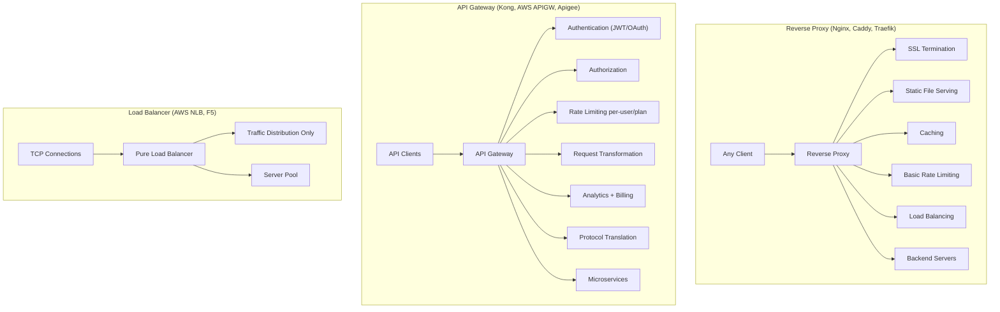

| Feature | Reverse Proxy | Load Balancer | API Gateway |
|---|---|---|---|
| **Primary purpose** | Mediate client↔server, add features | Distribute traffic | Manage API access |
| **Works with 1 backend?** | Yes | Pointless | Yes |
| **SSL termination** | Yes | Layer 7 LBs only | Yes |
| **Caching** | Yes | No | Sometimes |
| **Compression** | Yes | No | Rarely |
| **Static file serving** | Yes | No | No |
| **Load balancing** | Yes (built-in) | Yes (primary function) | Yes |
| **Auth (JWT/OAuth)** | No (needs plugin) | No | Yes |
| **Per-user rate limiting** | No | No | Yes |
| **Request transformation** | Limited | No | Full |
| **Protocol translation** | Limited | No | Yes (REST↔gRPC) |
| **Developer portal** | No | No | Yes |
| **Analytics dashboard** | Logs only | Basic | Full |
| **A/B testing** | Yes (split_clients) | No | Yes |
| **Cost** | Free (OSS) | Varies | Often expensive |
| **Complexity** | Low-Medium | Low | High |
| **Examples** | Nginx, Caddy, HAProxy | AWS NLB, F5 | Kong, Apigee, AWS APIGW |

### The Mental Model That Clears Up All Confusion

```
Pure Load Balancer
      ⊂
Reverse Proxy  (Load Balancer + SSL + Caching + Routing + Security)
      ⊂
API Gateway    (Reverse Proxy + Auth + Analytics + Transformation + Dev Portal)
```

Every API Gateway is a reverse proxy. Every reverse proxy can do load balancing. But a pure load balancer (like AWS NLB at Layer 4) just routes TCP connections — it has no idea what HTTP even is.

---

## 14. Complete Production Architecture — How Everything Fits Together

Let's build Zomato's architecture (simplified) to see all these pieces working together.

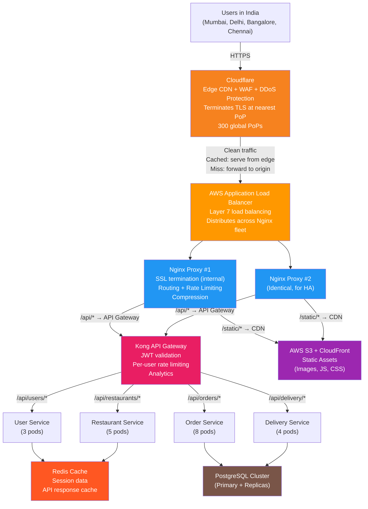

### What Each Layer Does

1. **Cloudflare (Edge)** — Handles DDoS, serves cached static content from the closest city to the user, terminates TLS for lower latency
2. **AWS ALB** — Distributes traffic across the Nginx fleet; if one Nginx goes down, traffic automatically shifts
3. **Nginx** — Second layer of SSL termination (internal), routing, rate limiting, compression, serves any missed static files
4. **Kong API Gateway** — JWT/auth validation, per-user rate limiting, request logging, routes to specific microservices
5. **Microservices** — Pure business logic, no networking complexity
6. **Redis** — Fast cache layer (restaurant listings, user sessions)
7. **PostgreSQL** — Persistent data (orders, payments)

---

## 15. The Reverse Proxy in a Kubernetes Ingress Pattern

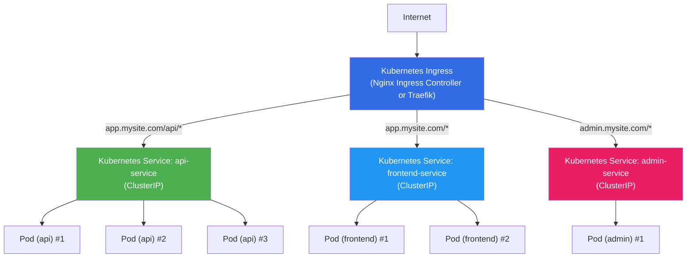

**Ingress Resource Definition:**

```yaml
apiVersion: networking.k8s.io/v1
kind: Ingress
metadata:
  name: myapp-ingress
  annotations:
    nginx.ingress.kubernetes.io/rewrite-target: /
    nginx.ingress.kubernetes.io/ssl-redirect: "true"
    nginx.ingress.kubernetes.io/proxy-body-size: "10m"
    nginx.ingress.kubernetes.io/limit-rps: "100"          # Rate limit: 100 req/s
    nginx.ingress.kubernetes.io/limit-connections: "50"   # Max 50 concurrent connections
spec:
  ingressClassName: nginx
  tls:
    - hosts:
        - app.mysite.com
        - admin.mysite.com
      secretName: mysite-tls
  rules:
    - host: app.mysite.com
      http:
        paths:
          - path: /api
            pathType: Prefix
            backend:
              service:
                name: api-service
                port:
                  number: 8080
          - path: /
            pathType: Prefix
            backend:
              service:
                name: frontend-service
                port:
                  number: 3000
    - host: admin.mysite.com
      http:
        paths:
          - path: /
            pathType: Prefix
            backend:
              service:
                name: admin-service
                port:
                  number: 8081
```

---

## 16. A/B Testing and Canary Deployments at the Proxy Layer

### Nginx Split Traffic (without code changes)

```nginx
# Direct 10% of traffic to new version, 90% to old version
# Split decision based on client IP + User-Agent (deterministic, not random)

split_clients "${remote_addr}${http_user_agent}${date_gmt}" $upstream_variant {
    10%     new_backend;     # 10% → new version
    *       old_backend;     # 90% → old version
}

upstream old_backend {
    server 10.0.0.1:8080;
    server 10.0.0.2:8080;
}

upstream new_backend {
    server 10.0.1.1:8080;   # New version servers
    server 10.0.1.2:8080;
}

server {
    location / {
        proxy_pass http://$upstream_variant;

        # Log which version served the request (for analysis)
        add_header X-Version $upstream_variant;
    }
}
```

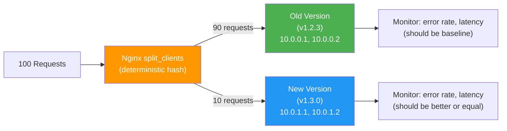

---

## 17. Common Pitfalls and Gotchas

### Pitfall 1: Forgetting X-Forwarded-For Header

Without this header, your app sees Nginx's IP as the client IP — completely useless for logging, rate limiting in-app, or geo-detection.

```nginx
# ALWAYS include these in your proxy_pass location:
proxy_set_header X-Real-IP         $remote_addr;
proxy_set_header X-Forwarded-For   $proxy_add_x_forwarded_for;
proxy_set_header X-Forwarded-Proto $scheme;
```

In your Node.js app, enable trust proxy:
```javascript
app.set('trust proxy', 1);  // Trust first proxy (Nginx)
const clientIP = req.ip;    // Now correctly shows real client IP
```

### Pitfall 2: HTTP vs HTTPS on Internal Network

Behind a load balancer, your app might receive HTTP but think it's HTTPS:

```javascript
// WRONG — will redirect to http:// even if user accessed https://
const redirectUrl = `${req.protocol}://myapp.com/success`;

// CORRECT — check the forwarded protocol header
const proto = req.headers['x-forwarded-proto'] || req.protocol;
const redirectUrl = `${proto}://myapp.com/success`;
```

### Pitfall 3: WebSocket Proxying Needs Extra Config

Regular HTTP proxying doesn't work for WebSockets. You need upgrade headers:

```nginx
location /ws/ {
    proxy_pass http://websocket_backend;
    proxy_http_version 1.1;

    # These two headers are REQUIRED for WebSocket
    proxy_set_header Upgrade    $http_upgrade;
    proxy_set_header Connection "upgrade";

    # Longer timeouts — WebSocket connections are long-lived
    proxy_read_timeout 3600s;    # 1 hour
    proxy_send_timeout 3600s;
}
```

### Pitfall 4: Buffer Sizes and Large File Uploads

```nginx
server {
    # Default is 1MB — will reject larger file uploads
    client_max_body_size 50m;    # Allow up to 50MB

    # Tune buffers for large responses
    proxy_buffer_size          128k;
    proxy_buffers            4 256k;
    proxy_busy_buffers_size    256k;
}
```

### Pitfall 5: Not Handling Proxy Timeouts

```nginx
location /api/reports/ {
    # Reports might take 30 seconds to generate
    proxy_connect_timeout 10s;
    proxy_read_timeout    120s;    # Wait 2 minutes for response
    proxy_send_timeout    30s;
    proxy_pass http://app_servers;
}
```

---

## 18. Decision Guide — Which Tool to Use When

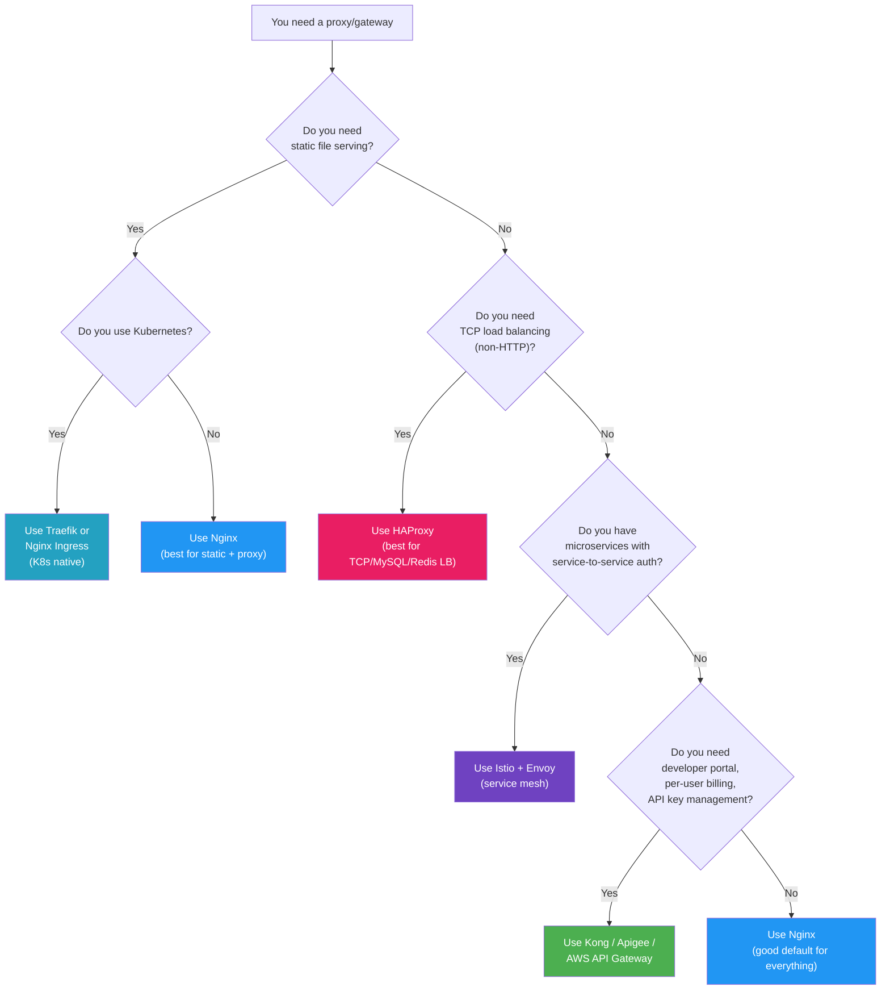

---

## 19. Common Interview Questions

### Q1: "What is a reverse proxy and why would you use one?"

**Strong answer:** A reverse proxy sits in front of your backend servers and intercepts all incoming requests before they reach your app. You'd use one for SSL/TLS termination (so your app servers don't need to handle crypto), load balancing across multiple app servers, serving static files without involving your app (Nginx is 10-100x faster at this), caching frequently-requested data, and security — rate limiting, DDoS mitigation, and hiding your backend topology. Every serious production deployment has one. At Zomato's scale, without a reverse proxy, every HTTPS request would add crypto overhead to every app server, every static image would go through business logic code, and a single malicious IP could flood your database with requests.

### Q2: "Forward proxy vs reverse proxy — what's the difference?"

**Strong answer:** They're at opposite ends of the connection. A forward proxy sits in front of clients — the client knows about it, configures it, and it hides the client from servers. VPNs and corporate web filters are forward proxies. A reverse proxy sits in front of servers — the client doesn't know about it, and it hides the server from clients. Nginx and Cloudflare are reverse proxies. The mental model: forward proxy protects clients, reverse proxy protects servers.

### Q3: "How does SSL termination work at a reverse proxy?"

**Strong answer:** The reverse proxy holds the SSL certificate and private key. When a client connects via HTTPS, the TLS handshake happens between the client and the proxy. The proxy decrypts the encrypted data, reads the HTTP request, and forwards it as plain HTTP to the backend server on a private internal network. The backend never needs to know about TLS. Benefits: one certificate to manage (not one per app server), crypto work centralized and optimized, backends can be simple HTTP servers. The trade-off: traffic between proxy and backend is unencrypted — only safe if that network is private (not crossing the public internet).

### Q4: "When would you use HAProxy instead of Nginx?"

**Strong answer:** HAProxy when I need TCP load balancing — database connections, raw TCP services like Redis clusters, or any protocol that isn't HTTP/HTTPS. HAProxy handles these better because it was built ground-up for high-performance proxying. It also has a more powerful health-checking system and a built-in stats dashboard. I'd use Nginx when I also need static file serving, caching, or web server features alongside the proxy. In practice, many setups use both — HAProxy for L4 TCP load balancing at the entry point, Nginx behind it for L7 HTTP routing and serving.

### Q5: "What is a service mesh and how is Envoy different from Nginx?"

**Strong answer:** A service mesh is infrastructure for service-to-service communication in microservices. Instead of each service handling retries, circuit breaking, mutual TLS, and distributed tracing itself, you inject a sidecar proxy (Envoy) next to each service. Istio is the control plane that configures all these Envoy sidecars uniformly. Envoy differs from Nginx in key ways: Envoy supports dynamic configuration without restarts (via the xDS protocol), has native support for gRPC, distributed tracing integration, circuit breaking, and retries built in. Nginx excels at static file serving and is simpler to configure for traditional reverse proxy use cases. Envoy is the right choice in a cloud-native Kubernetes environment with many microservices.

### Q6: "How does Cloudflare work as a reverse proxy?"

**Strong answer:** Cloudflare acts as a global reverse proxy CDN. When a company onboards to Cloudflare, they change their DNS to point at Cloudflare's anycast IP addresses. Requests from users worldwide hit the nearest Cloudflare PoP (300+ globally) instead of the origin server. Cloudflare terminates TLS there, checks for DDoS patterns, applies WAF rules, and serves cached content if available. Cache misses are forwarded to the origin server. The origin server sees all traffic as coming from Cloudflare IPs, not real client IPs (which are passed via CF-Connecting-IP header). This architecture means even a 100Gbps DDoS attack is absorbed across 300 PoPs before reaching your origin — each PoP only sees 1/300th of the attack.

### Q7: "What's the difference between a reverse proxy and an API Gateway?"

**Strong answer:** An API Gateway is a superset of a reverse proxy. Both handle SSL termination, load balancing, and routing. But an API Gateway adds: centralized authentication and authorization (validate JWT tokens before forwarding), per-user or per-plan rate limiting (not just per IP), request/response transformation, analytics with per-API tracking, protocol translation (REST to gRPC), and a developer portal for API key management and documentation. Use a reverse proxy (Nginx) for infrastructure-level concerns — serving a monolith, SSL termination, static files. Use an API Gateway (Kong, AWS API GW) when you have multiple external-facing APIs consumed by developers, need fine-grained access control, or are billing by API usage.

### Q8: "How would you set up Nginx for zero-downtime deployments?"

**Strong answer:** Configure upstream server pools and use Nginx's ability to reload config without dropping connections. When deploying a new version: start new servers with the new code, add them to the Nginx upstream with a low weight or as a secondary pool, verify they're healthy, then remove old servers from the pool, run `nginx -s reload` (which gracefully finishes in-flight requests before switching). For canary deployments, use `split_clients` directive to send 5% to the new version while keeping 95% on old. Monitor error rates on the canary — if good, increase to 10%, 25%, 50%, 100%. If bad, remove the canary servers from the pool instantly. The whole traffic shift happens in milliseconds.

### Q9: "How do you prevent a single IP from DDoS-ing your app through Nginx?"

**Strong answer:** Multiple layers: (1) `limit_req_zone` — rate limit requests per IP at a configurable RPS with burst allowance; (2) `limit_conn_zone` — limit simultaneous connections per IP; (3) Return 444 (close without response) for clearly malicious request patterns like missing Host headers or SQL injection patterns in URI; (4) `client_max_body_size` to reject oversized payloads; (5) Block known bad IP ranges with geo-blocking if relevant. For volumetric DDoS, Nginx alone isn't enough — you need Cloudflare or AWS Shield at the edge to absorb attacks before they even reach your servers. Nginx is good for application-layer protection (L7), but volumetric attacks need to be stopped at the network edge (L3/L4).

### Q10: "Why does Traefik work better than Nginx in Kubernetes?"

**Strong answer:** In Kubernetes, services are ephemeral — pods start, stop, and get rescheduled constantly. Nginx requires manually updating config files and triggering reloads every time the topology changes. In a cluster with 50 microservices each scaling dynamically, this is operationally painful and error-prone. Traefik watches the Kubernetes API and automatically discovers services via labels and annotations — no config file editing. It also has built-in Let's Encrypt SSL auto-provisioning. The trade-off: Nginx Ingress Controller has a larger community, more edge case support, and slightly better raw performance. Many large teams use Nginx Ingress Controller with good automation (Helm charts + GitOps) and get similar operational ease. Neither is objectively better — both are production-grade.

---

## 20. Key Takeaways

1. **Forward proxy hides clients, reverse proxy hides servers.** The direction of protection defines which type it is. VPNs hide clients. Nginx hides servers. This one sentence clears up 80% of the confusion.

2. **SSL termination at the reverse proxy is almost always correct.** One certificate to manage, no crypto overhead on app servers, and you can inspect/modify HTTP content at the proxy before forwarding.

3. **Never serve static files from your application server in production.** Nginx at 50,000 req/sec for static files vs Node.js at 2,000 req/sec. Let Nginx do this — it's literally what it was built for.

4. **Rate limiting at the proxy layer is better than in-app rate limiting.** Requests blocked at Nginx never consume app server CPU, memory, database connections, or logging overhead. Block bad traffic before it enters your system.

5. **HAProxy is the specialist for TCP load balancing.** When you're load balancing MySQL, PostgreSQL, Redis, or raw TCP services — HAProxy is the right tool. Nginx is the generalist.

6. **Traefik and Nginx Ingress Controller both work in Kubernetes; choose based on ops preference.** Traefik auto-discovers services. Nginx Ingress is more familiar to teams coming from traditional ops.

7. **Envoy/Istio is the answer to service-to-service communication in microservices.** It moves networking concerns (retries, circuit breaking, mTLS, tracing) out of your code into a sidecar proxy. Your service code becomes pure business logic.

8. **Cloudflare is a globally-distributed reverse proxy.** Every company you've heard of either uses Cloudflare or runs their own equivalent (Netflix's Open Connect, Google's global proxy fleet). The pattern is identical — edge caches close to users, origin servers hidden behind the proxy.

9. **An API Gateway is a reverse proxy with a brain.** Authentication, per-user rate limiting, analytics, and developer portals on top. Use it when you have external API consumers or need fine-grained access control.

10. **Load balancer ⊂ Reverse Proxy ⊂ API Gateway.** Every API Gateway does what a reverse proxy does. Every reverse proxy can do what a load balancer does. A pure L4 load balancer only distributes TCP connections — it doesn't care about HTTP. Keep this hierarchy in mind and interview questions about "what's the difference" become easy.

---

## Quick Reference Card

```
NGINX KEY DIRECTIVES
─────────────────────────────────────────────────
upstream mypool { ... }          Define backend server pool
server { listen 443 ssl; ... }   Virtual host with SSL
location /api/ { ... }           Route matching block
proxy_pass http://mypool;        Forward to backend
ssl_certificate /path/cert.pem;  SSL cert file
gzip on;                         Enable compression
limit_req_zone ... rate=10r/s;  Define rate limit zone
limit_req zone=X burst=20;       Apply rate limit
proxy_cache_path /var/cache/...  Define cache storage
proxy_cache myzone;              Enable caching for location
add_header X-Real-IP $remote_addr;  Pass client IP
server_tokens off;               Hide Nginx version

HAPROXY KEY CONCEPTS
─────────────────────────────────────────────────
frontend   = where HAProxy listens (binds to port)
backend    = where HAProxy sends traffic (server pool)
ACL        = conditions for routing decisions
balance    = load balancing algorithm (roundrobin, leastconn)
check      = health check configuration
stats      = built-in monitoring dashboard

LOAD BALANCING ALGORITHMS
─────────────────────────────────────────────────
round_robin    → equal distribution, simplest
least_conn     → best for variable-length requests
ip_hash        → sticky sessions by client IP
hash $uri      → same URL → same server (cache optimization)
random         → works well at scale, simple

PROXY LAYER SECURITY CHECKLIST
─────────────────────────────────────────────────
✓ SSL/TLS termination (TLS 1.2 minimum, prefer 1.3)
✓ server_tokens off (hide proxy version)
✓ proxy_hide_header X-Powered-By
✓ Rate limiting (limit_req_zone)
✓ Connection limiting (limit_conn_zone)
✓ client_max_body_size (prevent body bombs)
✓ Security headers (HSTS, X-Frame-Options, CSP)
✓ X-Forwarded-For header passing
✓ HTTP → HTTPS redirect
```

---

*Next: CDN and Edge Caching →*
