# Caching — The Most Important Performance Optimization

> "There are only two hard things in Computer Science: cache invalidation and naming things." — Phil Karlton

---

## Table of Contents

1. [What is Caching? The Brain Analogy](#1-what-is-caching)
2. [Why Caching? The Pareto Principle in Action](#2-why-caching)
3. [Cache Hit vs Cache Miss — Cost of Each](#3-cache-hit-vs-miss)
4. [Types of Caches in a Real System](#4-types-of-caches)
5. [Cache Read Strategies](#5-cache-read-strategies)
6. [Cache Write Strategies](#6-cache-write-strategies)
7. [Cache Eviction Policies](#7-cache-eviction-policies)
8. [Cache Invalidation — The Hardest Problem](#8-cache-invalidation)
9. [Cache Stampede / Thundering Herd](#9-cache-stampede)
10. [Redis vs Memcached](#10-redis-vs-memcached)
11. [Distributed Cache and Consistent Hashing](#11-distributed-cache)
12. [Real-World Examples: Twitter, Instagram, Netflix](#12-real-world-examples)
13. [Interview: "How would you cache a Twitter timeline?"](#13-interview-question)
14. [Common Interview Questions](#14-common-interview-questions)
15. [Key Takeaways](#15-key-takeaways)

---

## 1. What is Caching?

### The Brain Analogy — Simple baat hai

Socho tumhara ek doston ka group hai aur koi poochhe: "2 + 2 kitna hota hai?"

Kya tum calculator nikaloge? Nahin. Tumhara brain already jaanta hai ki answer **4** hai. Tumne isse already calculate kiya tha, result yaad rakh liya, aur ab bas recall karte ho.

**Yahi caching hai.**

Caching means: **do a computation once, store the result, reuse it instead of repeating the work.**

In system design terms:
- "2 + 2" = a database query (expensive, slow)
- "4" = the query result (cheap to return)
- "Brain" = cache (fast in-memory store like Redis)

```
Without Cache:
──────────────
User Request → App Server → Database → Disk I/O → Response
                                        (10–100ms)

With Cache:
───────────
User Request → App Server → Cache (RAM) → Response
                                (0.1–1ms)

Speedup: 100x to 1000x faster!
```

### Formal Definition

A **cache** is a high-speed data storage layer that stores a subset of data — typically transient in nature — so that future requests for that data are served faster than accessing the original slower storage layer.

**Three conditions where caching makes sense:**
1. The data is **read frequently** (high read-to-write ratio)
2. Computing or fetching the data is **expensive** (slow DB query, API call, complex calculation)
3. The data does **not change very frequently** (or you can tolerate slightly stale data)

---

## 2. Why Caching?

### The Pareto Principle — 80/20 Rule

Ab ek real scenario socho: **Instagram pe 500 million posts hain.** But kaunse posts zyada dekhe jaate hain?

Virat Kohli ne kal raat ek photo post ki. Woh ek post akela 5 crore views le leta hai agle 2 ghante mein. Baaki 499 million posts? Shayad 100 log dekhte hain.

**Yeh hai Pareto Principle in action:**

> **80% of read traffic hits only 20% of data.**

So instead of serving ALL data from a slow database, you:
1. Identify the "hot" 20% data
2. Cache it in fast memory
3. Serve 80% of requests from cache — instant response

```
Total Users: 10 million per hour
                │
    ┌───────────┴───────────────────────┐
    │                                   │
80% requests (8M/hr)           20% requests (2M/hr)
Hit cached data                Hit database
(0.1ms response)               (50ms response)
```

This is why companies like **Netflix, YouTube, Zomato** invest heavily in caching infrastructure. Unka 80% traffic sirf kuch popular content ke liye hota hai — ek baar cache karo, crores of requests serve ho jaate hain.

### The Numbers Don't Lie

| Operation | Latency | Analogy |
|-----------|---------|---------|
| L1 CPU cache | ~1 ns | 1 second |
| L2 CPU cache | ~4 ns | 4 seconds |
| RAM (in-process cache) | ~100 ns | 1.5 minutes |
| Redis / Memcached | ~0.5 ms | 5 hours |
| SSD read | ~100 µs | 1.5 days |
| Database query (network + disk) | ~10–50 ms | 1.5–6 months |
| Cross-datacenter call | ~150 ms | 5 years |

(All relative to "1 second" = 1ns baseline)

**Bottom line:** If your API currently queries a database on every request, adding a cache can reduce response time from 50ms to 0.5ms — a **100x improvement** without changing your application logic.

---

## 3. Cache Hit vs Cache Miss

### The Library Analogy

Socho tum ek library mein kaam karte ho. Koi book maangta hai.

- **Cache Hit** = woh book tumhare desk pe already rakhi hai. Instantly de do. Fast!
- **Cache Miss** = woh book warehouse mein hai. Jaao, dhoondho, laao. Slow.

But miss ke baad, tum woh book apne desk pe rakh lete ho — next time koi maange, hit hoga.

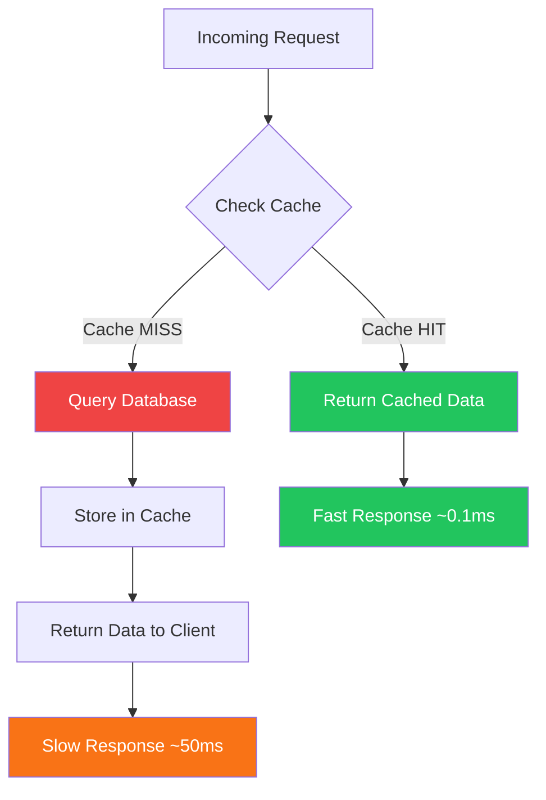
```mermaid
flowchart TD
    A[Incoming Request] --> B{Check Cache}
    B -->|Cache HIT| C[Return Cached Data]
    B -->|Cache MISS| D[Query Database]
    D --> E[Store in Cache]
    E --> F[Return Data to Client]
    C --> G[Fast Response ~0.1ms]
    F --> H[Slow Response ~50ms]

    style C fill:#22c55e,color:#fff
    style D fill:#ef4444,color:#fff
    style G fill:#22c55e,color:#fff
    style H fill:#f97316,color:#fff
```

### Cache Hit Rate — The Most Important Cache Metric

```
Hit Rate = Cache Hits / (Cache Hits + Cache Misses) × 100

Good benchmarks:
├─ 99%+ hit rate → Excellent
├─ 90–99%       → Good
├─ 80–90%       → Acceptable
├─ Below 80%    → Cache is not helping much
```

**Real example:** Facebook's memcached fleet reportedly maintains a **99%+ cache hit rate** for user profile reads. Matlab 100 mein se 99 requests kabhi database tak pahunchi hi nahin.

### The Cost of a Cache Miss

A cache miss is not free. Every miss:
1. Takes the full database round-trip (50–100ms)
2. Adds load to your database
3. May trigger a cascade if many misses happen simultaneously (more on this in Cache Stampede section)

**Interview tip:** When asked "how will you handle scale?", always say: "I'll cache the hot data with Redis, targeting 95%+ hit rate. A miss will fall back to DB and populate the cache."

---

## 4. Types of Caches in a Real System

A modern web application has **multiple layers of caching**. Let's go from the user's browser all the way to the CPU.

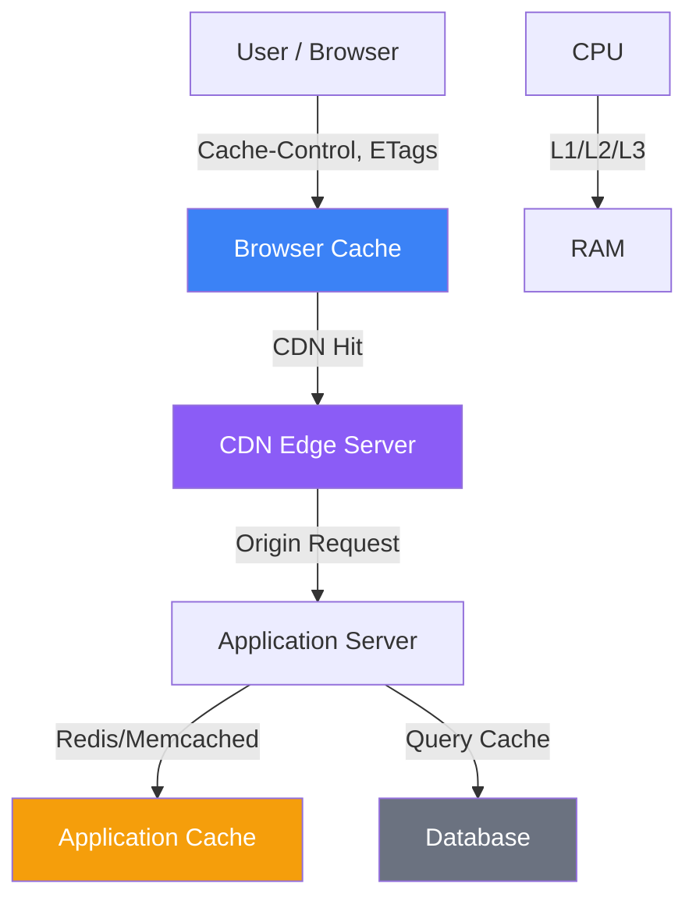
```mermaid
graph TB
    U[User / Browser] -->|Cache-Control, ETags| B[Browser Cache]
    B -->|CDN Hit| C[CDN Edge Server]
    C -->|Origin Request| D[Application Server]
    D -->|Redis/Memcached| E[Application Cache]
    D -->|Query Cache| F[Database]
    G[CPU] -->|L1/L2/L3| H[RAM]

    style B fill:#3b82f6,color:#fff
    style C fill:#8b5cf6,color:#fff
    style E fill:#f59e0b,color:#fff
    style F fill:#6b7280,color:#fff
```

---

### 4.1 Browser Cache (HTTP Cache)

**Analogy:** Jab tum YouTube pe pehli baar jaate ho, woh logo download hota hai. Baar baar jaate ho? Logo already tumhare computer mein save hai — dubara download nahi hota. Browser ne cache kar liya.

#### How it works:

When your server sends a response, it includes HTTP headers that tell the browser how to cache the response.

```http
HTTP/1.1 200 OK
Cache-Control: max-age=86400, public
ETag: "33a64df551425fcc55e4d42a148795d9f25f89d4"
Last-Modified: Wed, 21 Oct 2024 07:28:00 GMT
Content-Type: image/png
```

**Key headers:**

| Header | Purpose | Example |
|--------|---------|---------|
| `Cache-Control: max-age=3600` | Cache for 3600 seconds | `max-age=86400` = 1 day |
| `Cache-Control: no-cache` | Validate with server before using | Used for HTML pages |
| `Cache-Control: no-store` | Never cache (sensitive data) | Banking pages |
| `Cache-Control: public` | Can be cached by CDN too | Static assets |
| `Cache-Control: private` | Only browser can cache | User-specific pages |
| `ETag` | Version fingerprint of response | Changes when content changes |
| `Last-Modified` | When content was last changed | Date string |

#### ETag — The Smart Validator

```
First Request:
─────────────
Browser: GET /profile-pic.jpg
Server: 200 OK, ETag: "abc123", [image data]

Second Request (after max-age expires):
────────────────────────────────────────
Browser: GET /profile-pic.jpg, If-None-Match: "abc123"
Server: 304 Not Modified (if image hasn't changed)
        → Browser uses cached version! Zero bandwidth used.

If image changed:
Server: 200 OK, ETag: "xyz789", [new image data]
```

#### Real-world example:

**Zomato** caches restaurant logos, menu images, and static JS/CSS with `max-age=31536000` (1 year). Their HTML pages use `no-cache` so menu updates appear immediately. Result: returning users experience near-instant page loads because 90%+ of assets are already in browser cache.

**Trade-offs:**

| Pros | Cons |
|------|------|
| Fastest possible (local storage) | Limited storage space |
| Zero network cost on hit | Hard to force-invalidate early |
| Works offline | User can clear it |
| Reduces server load | Per-user, not shared |

---

### 4.2 CDN Cache (Edge Caching)

**Analogy:** Netflix India ka content America ke server pe hai. Agar India ke 5 crore users seedha America se video maangen, toh bandwidth aur latency dono nightmare ho jaayenge. Solution? Netflix CDN edge servers India mein rakhta hai — Bangalore, Mumbai, Chennai. Ab content nearby hai.

**CDN (Content Delivery Network)** = network of servers distributed globally that cache your content close to users.

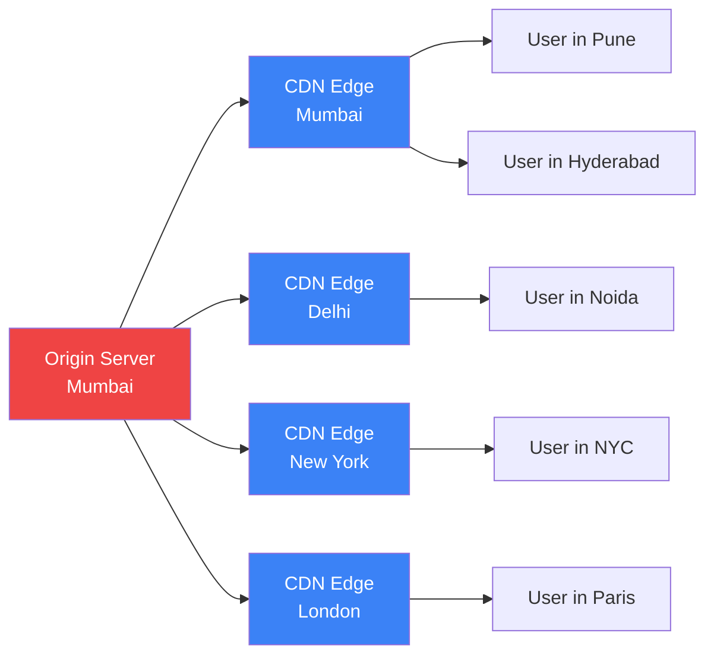
```mermaid
graph LR
    OS[Origin Server\nMumbai]
    
    OS --> CDN1[CDN Edge\nMumbai]
    OS --> CDN2[CDN Edge\nDelhi]
    OS --> CDN3[CDN Edge\nNew York]
    OS --> CDN4[CDN Edge\nLondon]
    
    CDN1 --> U1[User in Pune]
    CDN1 --> U2[User in Hyderabad]
    CDN2 --> U3[User in Noida]
    CDN3 --> U4[User in NYC]
    CDN4 --> U5[User in Paris]

    style OS fill:#ef4444,color:#fff
    style CDN1 fill:#3b82f6,color:#fff
    style CDN2 fill:#3b82f6,color:#fff
    style CDN3 fill:#3b82f6,color:#fff
    style CDN4 fill:#3b82f6,color:#fff
```

#### How CDN caching works:

1. User in Delhi requests `netflix.com/movie/thumbnail.jpg`
2. DNS resolves to nearest CDN edge (Delhi edge server)
3. CDN checks its cache:
   - **HIT:** Serves directly from Delhi. Latency: ~5ms
   - **MISS:** Fetches from Mumbai origin. Caches it. Latency: ~80ms (but only first user pays this cost)
4. Next 10,000 users in Delhi get it from CDN cache in 5ms

#### Static vs Dynamic CDN Caching

| Type | What | TTL | Example |
|------|------|-----|---------|
| Static | Images, JS, CSS, videos | Hours to days | Netflix thumbnails, YouTube video chunks |
| Dynamic | API responses, personalized HTML | Seconds to minutes | Product listings, search results |
| Edge computing | Run code at edge | N/A | Cloudflare Workers, Vercel Edge |

**Real example:** YouTube uses Google's CDN (backed by thousands of edge servers). When a popular video goes viral — say, a new song by Arijit Singh — the first few requests in each city fetch from origin, then every subsequent user in that city gets it from local edge cache. Millions of concurrent streams, zero load on origin servers.

**Popular CDN providers:** Cloudflare, Akamai, AWS CloudFront, Fastly, Vercel Edge Network

**Trade-offs:**

| Pros | Cons |
|------|------|
| Global low latency | Cost can be significant |
| Massive traffic absorption | Cache invalidation is complex |
| DDoS protection built-in | Dynamic content harder to cache |
| Reduces origin server load | Configuration complexity |

---

### 4.3 Application / Server Cache (Redis, Memcached)

**Analogy:** Imagine a waiter at a restaurant. Customer #1 asks "aaj ka special kya hai?" — waiter goes to kitchen, asks chef, comes back. Customer #2 same question poochhe — waiter already jaanta hai, instantly bolta hai. The waiter's memory = application cache.

This is the most important cache type in system design interviews. Yahan hum **Redis** aur **Memcached** ki baat karte hain.

#### In-Process Memory Cache (L1 Application Cache)

```
Within one app server process:
──────────────────────────────
HashMap<String, Object> localCache = new HashMap<>();

Pros: Sub-microsecond access (no network hop)
Cons: Not shared across multiple servers, lost on restart
Use case: Configuration values, rarely-changing reference data
```

#### Distributed Cache — Redis / Memcached (L2 Application Cache)

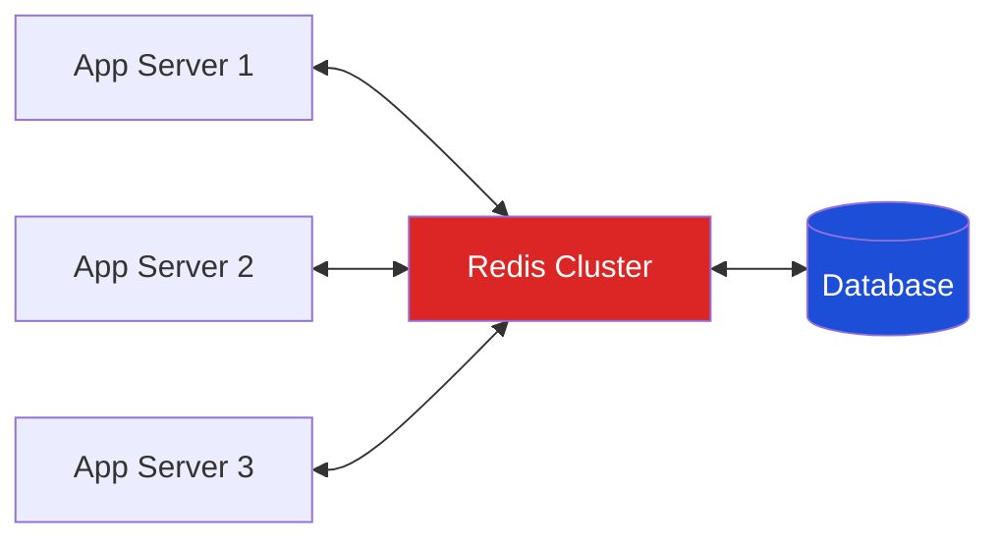
```mermaid
graph LR
    AS1[App Server 1]
    AS2[App Server 2]
    AS3[App Server 3]
    
    AS1 <--> RC[Redis Cluster]
    AS2 <--> RC
    AS3 <--> RC
    
    RC <--> DB[(Database)]

    style RC fill:#dc2626,color:#fff
    style DB fill:#1d4ed8,color:#fff
```

All app servers share the same Redis cache. No matter which server handles your request, the cached data is available.

**A cache entry in Redis:**
```
Key:   "user:profile:123"
Value: '{"id":123,"name":"Rahul","email":"rahul@gmail.com","city":"Pune"}'
TTL:   3600 seconds (expires in 1 hour)
```

**Common things to cache at the application layer:**

- User profiles, settings, preferences
- Product catalog data
- Search results
- Aggregated counts (likes, views, follower counts)
- Computed values (recommendation scores)
- Session data (who is logged in)
- Rate limiting counters

**Trade-offs:**

| Pros | Cons |
|------|------|
| Shared across all servers | Network hop (still ~0.5ms) |
| Survives single server restarts | Another service to maintain |
| Rich data structures (Redis) | Memory costs money |
| Horizontal scalability | Cache invalidation responsibility |

---

### 4.4 Database Query Cache

**Analogy:** Socho tumhare class ke teacher ne pichle semester ke marks calculate kiye. Ek ghante lage. Koi aur teacher same marks maange — kya woh phir se calculate karein? No! File cabinet mein already stored hai.

Databases have their own internal caching mechanisms:

1. **Query result cache:** Store the result of `SELECT * FROM products WHERE id=123` so the next identical query returns instantly
2. **Buffer pool:** Keep frequently accessed data pages in RAM instead of reading from disk every time (MySQL InnoDB buffer pool)
3. **Index cache:** Keep B-tree index nodes in memory

```sql
-- This query hits disk the first time (slow)
SELECT name, price FROM products WHERE category='electronics';

-- MySQL stores the result in query cache
-- Second identical query hits cache (fast, no disk access)
SELECT name, price FROM products WHERE category='electronics';
```

**Important note:** MySQL 8.0 removed the query cache because it caused more problems than it solved (cache invalidation on every write, mutex contention). **Don't rely on DB-level query cache** — use Redis instead.

---

### 4.5 CPU Cache (L1, L2, L3) — For Latency Understanding

**Analogy:** The CPU is a chef. RAM is the pantry (30 feet away). CPU cache is the small tray right next to the chef — ingredients he uses constantly are kept right there.

This is mostly for understanding latency numbers, not something you architect directly.

```
CPU Cache Hierarchy:
────────────────────
L1 Cache  → 32 KB,  per core,  ~1ns latency
L2 Cache  → 256 KB, per core,  ~4ns latency
L3 Cache  → 8 MB,   shared,   ~12ns latency
RAM       → 8–64 GB,          ~100ns latency
SSD       → 1 TB,             ~100,000ns (100µs)
HDD       → 10 TB,            ~10,000,000ns (10ms)
```

**Why this matters for system design:**
- Understanding why in-memory cache (Redis) is 1000x faster than database is rooted in this hierarchy
- Writing cache-friendly code (accessing memory sequentially vs randomly) matters for CPU cache efficiency

---

## 5. Cache Read Strategies

Do main strategies hain: **Cache-Aside** aur **Read-Through**. Interview mein yeh zaroor poochha jaata hai.

### 5.1 Cache-Aside (Lazy Loading) — Most Common

**Analogy:** Tum khud apni notebook check karte ho pehle. Agar answer nahi mila, tab library jaate ho, answer nikaalte ho, aur notebook mein likh lete ho future ke liye. Application khud cache manage karta hai.

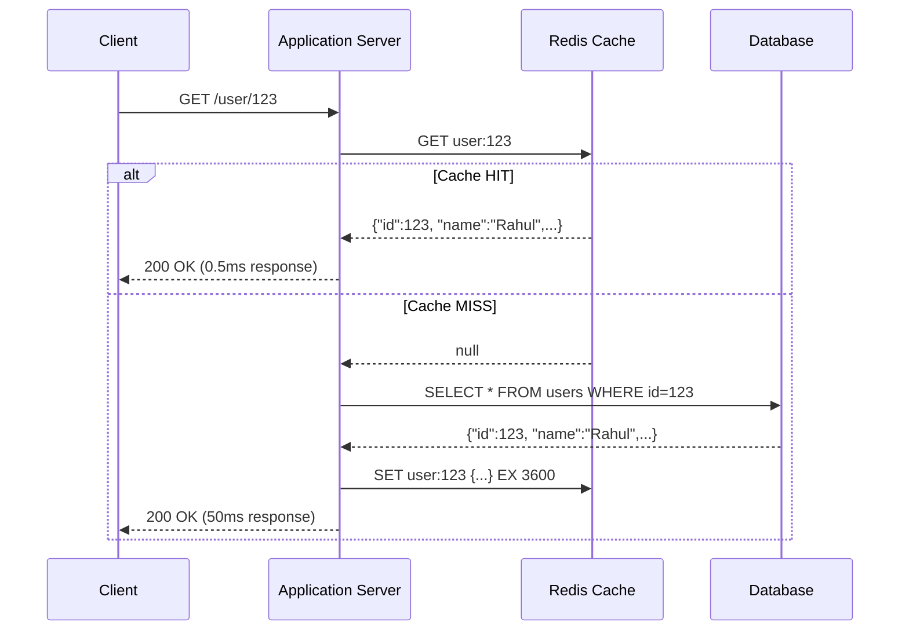
```mermaid
sequenceDiagram
    participant Client
    participant App as Application Server
    participant Cache as Redis Cache
    participant DB as Database

    Client->>App: GET /user/123

    App->>Cache: GET user:123
    
    alt Cache HIT
        Cache-->>App: {"id":123, "name":"Rahul",...}
        App-->>Client: 200 OK (0.5ms response)
    else Cache MISS
        Cache-->>App: null
        App->>DB: SELECT * FROM users WHERE id=123
        DB-->>App: {"id":123, "name":"Rahul",...}
        App->>Cache: SET user:123 {...} EX 3600
        App-->>Client: 200 OK (50ms response)
    end
```

**Implementation in pseudocode:**
```python
def get_user(user_id):
    # Step 1: Check cache
    cached = redis.get(f"user:{user_id}")
    if cached:
        return json.loads(cached)  # Cache HIT — fast path
    
    # Step 2: Cache MISS — fetch from DB
    user = db.query("SELECT * FROM users WHERE id = ?", user_id)
    
    # Step 3: Populate cache for next time
    redis.setex(f"user:{user_id}", 3600, json.dumps(user))
    
    return user  # Slow path, but next call will be fast
```

**Trade-offs:**

| Pros | Cons |
|------|------|
| Only caches what's actually requested | First request always slow (cold cache) |
| Cache failure doesn't break app (falls back to DB) | Risk of stale data between TTL cycles |
| Application controls caching logic | Application code is more complex |
| Works for any data source | Must write cache population logic everywhere |

**Interview tip:** Cache-Aside is the default answer for most system design questions. When in doubt, say Cache-Aside.

---

### 5.2 Read-Through Cache

**Analogy:** Instead of you personally going to the library, there is a librarian assistant who sits between you and the library. You always ask the assistant. If they don't know, they go to the library for you, remember the answer, and tell you. Cache khud DB se data laata hai.

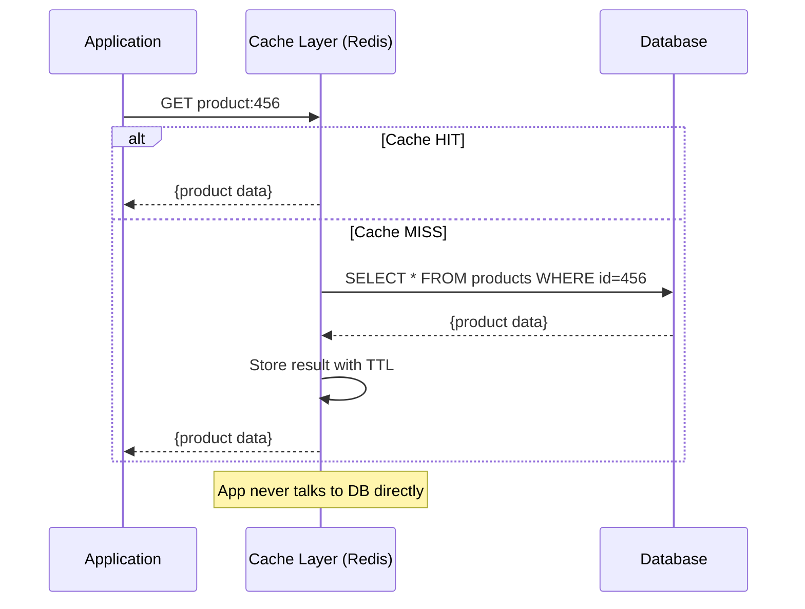
```mermaid
sequenceDiagram
    participant App as Application
    participant Cache as Cache Layer (Redis)
    participant DB as Database

    App->>Cache: GET product:456
    
    alt Cache HIT
        Cache-->>App: {product data}
    else Cache MISS
        Cache->>DB: SELECT * FROM products WHERE id=456
        DB-->>Cache: {product data}
        Cache->>Cache: Store result with TTL
        Cache-->>App: {product data}
    end
    
    Note over Cache: App never talks to DB directly
```

**Difference from Cache-Aside:**
- In Cache-Aside: **application** fetches from DB on miss
- In Read-Through: **cache layer** fetches from DB on miss (library like AWS DAX for DynamoDB)

**Trade-offs:**

| Pros | Cons |
|------|------|
| Application code is simpler | First request still slow |
| Cache manages its own data loading | Cache must know about DB schema |
| Consistent cache population logic | Less flexibility |
| Good for read-heavy workloads | Cache library must support this pattern |

**When to use:** When using managed cache services like **AWS DAX** (for DynamoDB) or **Ehcache** with a loader.

---

## 6. Cache Write Strategies

Reading caching karना easy hai. **Writing** — yahan asli drama hota hai. Cache aur database ko sync rakhna padta hai.

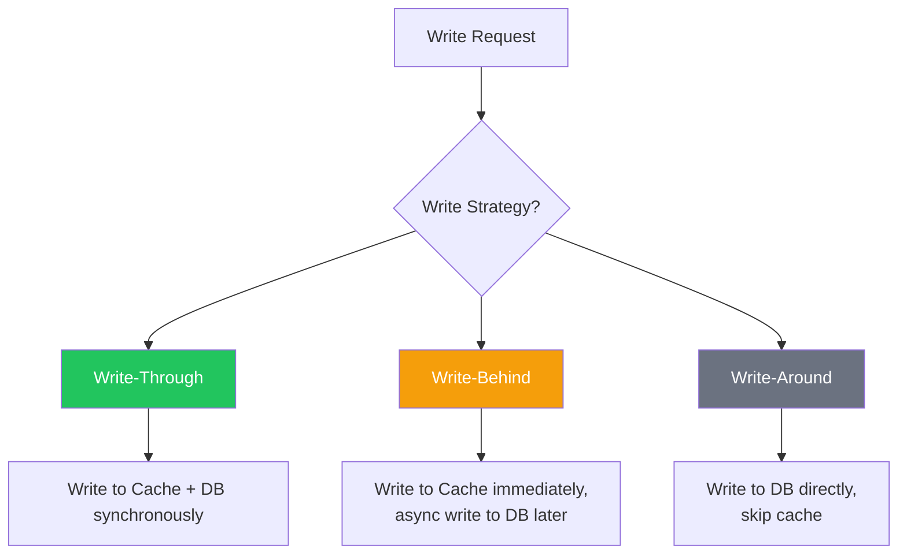
```mermaid
graph TD
    A[Write Request] --> B{Write Strategy?}
    B --> C[Write-Through]
    B --> D[Write-Behind]
    B --> E[Write-Around]
    
    C --> F[Write to Cache + DB synchronously]
    D --> G[Write to Cache immediately,\nasync write to DB later]
    E --> H[Write to DB directly,\nskip cache]

    style C fill:#22c55e,color:#fff
    style D fill:#f59e0b,color:#fff
    style E fill:#6b7280,color:#fff
```

---

### 6.1 Write-Through

**Analogy:** Tum ek diary maintain karte ho. Jab bhi koi nai information aaye, tum ek saath dono jagah likhte ho — apni memory mein bhi aur diary mein bhi. Dono hamesha sync mein rehte hain.

Write to **both cache AND database simultaneously**. Only return success when both writes succeed.

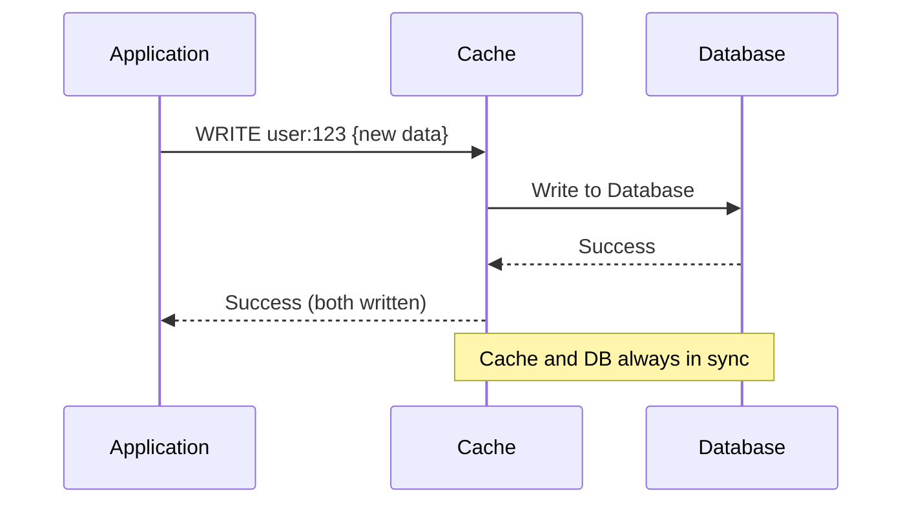
```mermaid
sequenceDiagram
    participant App as Application
    participant Cache as Cache
    participant DB as Database

    App->>Cache: WRITE user:123 {new data}
    Cache->>DB: Write to Database
    DB-->>Cache: Success
    Cache-->>App: Success (both written)
    
    Note over Cache,DB: Cache and DB always in sync
```

```python
def update_user(user_id, new_data):
    # Write to database first (source of truth)
    db.update("UPDATE users SET ... WHERE id = ?", user_id, new_data)
    
    # Update cache immediately
    redis.setex(f"user:{user_id}", 3600, json.dumps(new_data))
    
    return success
```

**Trade-offs:**

| Pros | Cons |
|------|------|
| Cache always consistent with DB | Write latency is higher (two writes) |
| No stale data | Unused data also gets cached |
| No data loss risk | Both writes must succeed (atomicity concern) |
| Read-after-write consistency | If write to DB fails, need to rollback cache |

**When to use:** When read-after-write consistency is critical. Example: **financial data, inventory counts, user account updates.**

---

### 6.2 Write-Behind (Write-Back)

**Analogy:** Jab tum notes likhte ho class mein, pehle rough notebook mein likho (fast). Ghar jaake saaf copy mein transfer karo (background mein). Rough notebook = cache. Saaf copy = database.

Write to **cache immediately**, then **asynchronously** write to the database in the background.

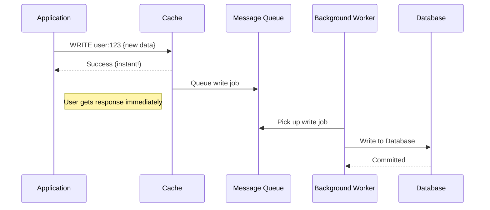
```mermaid
sequenceDiagram
    participant App as Application
    participant Cache as Cache
    participant Queue as Message Queue
    participant Worker as Background Worker
    participant DB as Database

    App->>Cache: WRITE user:123 {new data}
    Cache-->>App: Success (instant!)
    Cache->>Queue: Queue write job
    
    Note right of App: User gets response immediately
    
    Worker->>Queue: Pick up write job
    Worker->>DB: Write to Database
    DB-->>Worker: Committed
```

```python
def update_user(user_id, new_data):
    # Write to cache immediately (fast)
    redis.setex(f"user:{user_id}", 3600, json.dumps(new_data))
    
    # Queue async write to DB
    message_queue.publish("db_write", {
        "table": "users",
        "id": user_id,
        "data": new_data
    })
    
    return success  # Returns immediately, DB write happens later
```

**Trade-offs:**

| Pros | Cons |
|------|------|
| Extremely fast writes | Data loss if cache crashes before DB write |
| Handles write bursts well | Complexity: async failure handling |
| Reduced DB write load | Temporary inconsistency between cache and DB |
| Good for write-heavy workloads | DB can lag behind cache |

**When to use:** High write throughput with acceptable eventual consistency. Example: **like counts, view counts, game scores, logging.** Twitter ne tweet engagement counts ke liye yeh pattern use kiya hai.

**Risk mitigation:** Use persistent queue (Kafka/RabbitMQ), add retry logic, use Redis AOF persistence.

---

### 6.3 Write-Around

**Analogy:** Tum ghar mein nai furniture laaye jo bahut rarely use hogi (guest room ka sofa). Storage room mein seedha rakh do, living room mein (cache mein) mat raho — space waste hoga.

Write **directly to the database, bypass the cache entirely**. Cache only gets populated when data is actually read.

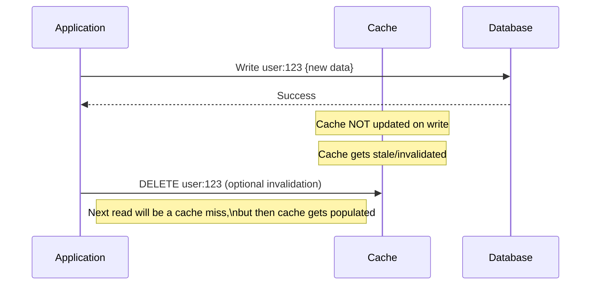
```mermaid
sequenceDiagram
    participant App as Application
    participant Cache as Cache
    participant DB as Database

    App->>DB: Write user:123 {new data}
    DB-->>App: Success
    
    Note over Cache: Cache NOT updated on write
    Note over Cache: Cache gets stale/invalidated
    
    App->>Cache: DELETE user:123 (optional invalidation)
    
    Note right of App: Next read will be a cache miss,\nbut then cache gets populated
```

**Trade-offs:**

| Pros | Cons |
|------|------|
| Cache not polluted with write-once data | Read-after-write will be a cache miss |
| Reduces write latency | Higher read latency for recently written data |
| Good for bulk writes / imports | Temporary inconsistency |
| Less cache churn | Need to invalidate stale cache entries |

**When to use:** When data is written once and read rarely (or much later). Example: **log files, archival data, bulk data imports, rarely-read reports.**

---

### Write Strategy Comparison Table

| Strategy | Write Speed | Consistency | Data Loss Risk | Best For |
|----------|-------------|-------------|----------------|---------|
| Write-Through | Slower | Strong | None | Financial, account data |
| Write-Behind | Fastest | Eventual | Low-Medium | Counters, game scores |
| Write-Around | Medium | Eventual | None | Bulk writes, logs |

---

## 7. Cache Eviction Policies

**Analogy:** Cache ek limited size ka bookshelf hai. Nai books aangi toh purani kisi ko hataana padega. But **konsi** book hataayein? Yahi eviction policy decide karti hai.

Cache is always finite. When it's full, something must go. The eviction policy determines what gets removed.

---

### 7.1 LRU — Least Recently Used (Most Common)

**Analogy:** Tumhare bookshelf pe books hain. Jo book sabse pehle "use" ki thi, woh sabse purani hai — agar jagah chahiye, woh pehle jaayegi. Recently read books front mein rahti hain.

Remove the item that **was least recently accessed**.

```
Cache capacity: 4 items
Access sequence: A, B, C, D, A, B, E

Time │ Access │ Cache State (left=LRU, right=MRU)
─────┼────────┼──────────────────────────────────
  1  │   A    │ [A]
  2  │   B    │ [A, B]
  3  │   C    │ [A, B, C]
  4  │   D    │ [A, B, C, D]  ← Cache full
  5  │   A    │ [B, C, D, A]  ← A moved to most-recent end
  6  │   B    │ [C, D, A, B]  ← B moved to most-recent end
  7  │   E    │ [D, A, B, E]  ← C evicted (least recently used)
```

**Implementation:** Uses a doubly-linked list + hash map. O(1) get and put.

**Used by:** Redis (default), most browser caches, CPU caches

**Trade-offs:**

| Pros | Cons |
|------|------|
| Great for temporal locality (recently used = likely reused) | Single large scan can evict all hot data |
| Simple to understand | Tracking access time adds overhead |
| Works well in most cases | Not ideal for cyclical access patterns |

---

### 7.2 LFU — Least Frequently Used

**Analogy:** Library mein woh books jo sabse kam baar issue hui hain, shelf pe jagah kam milegi. Popular books hamesha available rahenge.

Remove the item that has been **accessed fewest times**.

```
Cache: [A(freq=10), B(freq=2), C(freq=8), D(freq=1)]
       → Cache full, new item E arrives
       → Evict D (frequency = 1, lowest)

Cache: [A(freq=10), B(freq=2), C(freq=8), E(freq=1)]
```

**Trade-offs:**

| Pros | Cons |
|------|------|
| Keeps truly "hot" data in cache longer | Complexity: tracking frequency counts |
| Great when access patterns are stable | New items start with freq=1, may be evicted too quickly |
| Long-lived popular data stays cached | Older popular data might block newer trending data |

**Used by:** Redis (optional), some CDNs for content popularity

---

### 7.3 TTL — Time To Live (Most Practical)

**Analogy:** Doodh ki expiry date hoti hai — chahe khaya ho ya nahin, 3 din baad phenk do. Cache items ki bhi expiry hoti hai.

Items **automatically expire after a fixed duration**, regardless of access pattern.

```python
# Set with TTL
redis.setex("user:123", 3600, json.dumps(user_data))
# ↑ Expires after 3600 seconds (1 hour), automatically deleted

# Different TTLs for different data types
redis.setex("session:abc",     1800,   session_data)   # 30 min
redis.setex("product:456",     86400,  product_data)   # 1 day
redis.setex("config:settings", 3600,   config_data)    # 1 hour
redis.setex("trending:posts",  300,    trending_data)  # 5 min
```

**How to choose TTL:**
- **Short TTL (seconds to minutes):** Real-time data, trending lists, rate limiting
- **Medium TTL (hours):** User profiles, product details
- **Long TTL (days to weeks):** Static content, reference data, thumbnails

**Trade-offs:**

| Pros | Cons |
|------|------|
| Simple to implement | Data can be stale up to TTL duration |
| Automatic cleanup (no memory leaks) | TTL too short = more DB hits; too long = stale data |
| Predictable behavior | Simultaneous expirations can cause stampede |
| Works well with most eviction strategies | Not access-pattern aware |

---

### 7.4 FIFO — First In, First Out

**Analogy:** Queue mein pehle aaya, pehle gaya. Simple. Koi preference nahi — oldest item hamesha pehle jaata hai.

**Trade-offs:**

| Pros | Cons |
|------|------|
| Extremely simple | Doesn't consider how often/recently accessed |
| Predictable behavior | May evict frequently-used items |

**Rarely used** in practice. LRU is almost always better.

---

### Eviction Policy Comparison

| Policy | Evicts | Best For | Used In |
|--------|--------|---------|---------|
| LRU | Least recently accessed | General purpose web caching | Redis, Memcached |
| LFU | Least frequently accessed | Stable popularity workloads | Redis (config option) |
| TTL | Items past expiration time | Any cache with freshness requirements | Redis, browsers, CDN |
| FIFO | Oldest inserted item | Simple, non-critical caches | Rare |
| Random | Random item | When overhead matters more than hit rate | Some CPU caches |

---

## 8. Cache Invalidation — The Hardest Problem

> "There are only two hard things in Computer Science: cache invalidation and naming things." — Phil Karlton

**Yeh kyun hard hai?** Simple: ek baar kuch cache ho gaya, toh ensure karna ki woh stale nahin hai — yeh guarantee dena hard hai. Database update hua but cache purana data de raha hai — yeh **data inconsistency** hai.

### The Core Problem

```
Database: User Rahul → City: "Mumbai"    ✓ (current truth)
Cache:    User Rahul → City: "Pune"      ✗ (old data, not invalidated)

What user sees: Pune ← WRONG!
```

---

### 8.1 TTL-Based Expiry (Simplest)

**Analogy:** Newspaper yaad karo — har subah naya aata hai, purana phenk do. Cache entry hmesha ek fixed time ke baad expire ho jaati hai.

```python
# Set cache with TTL — simplest invalidation
redis.setex("user:123", ttl=3600, value=user_json)
# After 3600s, cache auto-expires. Next read goes to DB.
```

**When to use:** When slight staleness is acceptable (user profiles, product listings, recommendation feeds)

**Instagram** uses short TTLs on follower counts and like counts. A post might show "10.2M likes" when actual count is 10.201M — that's fine. They refresh every few seconds.

---

### 8.2 Event-Driven Invalidation (Cache Busting)

**Analogy:** Jab bhi naya doodh aaata hai ghar mein, purana immediately throw out karo. Don't wait for expiry.

When data changes → immediately delete/update cache entry.

```python
def update_user_profile(user_id, new_data):
    # Update database (source of truth)
    db.execute("UPDATE users SET ... WHERE id=?", user_id, new_data)
    
    # Immediately invalidate cache
    redis.delete(f"user:{user_id}")
    # Next read will miss cache, fetch fresh data from DB, repopulate
```

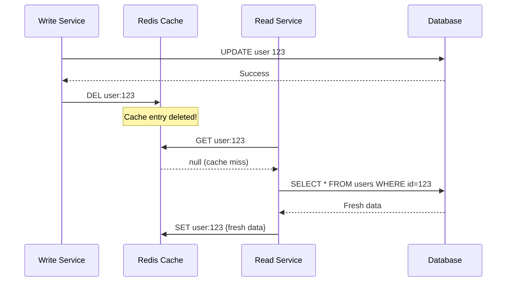
```mermaid
sequenceDiagram
    participant WriteService as Write Service
    participant Cache as Redis Cache
    participant ReadService as Read Service
    participant DB as Database

    WriteService->>DB: UPDATE user 123
    DB-->>WriteService: Success
    WriteService->>Cache: DEL user:123
    
    Note over Cache: Cache entry deleted!
    
    ReadService->>Cache: GET user:123
    Cache-->>ReadService: null (cache miss)
    ReadService->>DB: SELECT * FROM users WHERE id=123
    DB-->>ReadService: Fresh data
    ReadService->>Cache: SET user:123 {fresh data}
```

**Trade-offs:**

| Pros | Cons |
|------|------|
| No stale data after write | Requires cache invalidation in every write path |
| Strong consistency | If invalidation fails, stale data persists |
| Cache is accurate | Complex in distributed systems (multiple services) |

**Zomato** does this for restaurant availability. When a restaurant marks itself as "closed", it immediately invalidates the cached listing. No TTL-based staleness allowed here.

---

### 8.3 Cache Versioning

**Analogy:** Instead of erasing and rewriting, give a new version number. "user_v1_123" is old; "user_v2_123" is new. Old key automatically becomes orphaned and expires.

```python
# Store with version in key
CACHE_VERSION = "v2"
key = f"user:{CACHE_VERSION}:{user_id}"
redis.setex(key, 3600, user_json)

# On schema change, bump version to "v3"
# Old "v2" keys are just ignored and expire naturally
CACHE_VERSION = "v3"
```

**When to use:** When you want to deploy a new data format without immediate cache invalidation. Great for **blue-green deployments** and schema migrations.

---

### 8.4 Write-Through as Built-in Invalidation

Simply always update cache on write (Write-Through pattern). No separate invalidation step needed — cache is always fresh.

```python
def update_user(user_id, new_data):
    db.update(...)
    redis.setex(f"user:{user_id}", 3600, json.dumps(new_data))
    # Cache updated in same transaction — always consistent
```

---

### Cache Invalidation Strategy Decision Tree

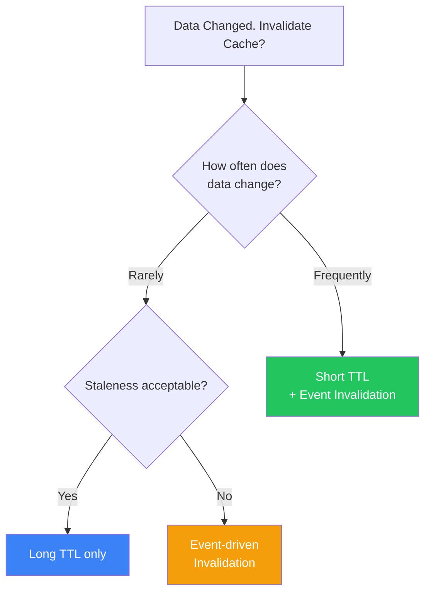
```mermaid
graph TD
    A[Data Changed. Invalidate Cache?] --> B{How often does\ndata change?}
    B -->|Rarely| C{Staleness acceptable?}
    B -->|Frequently| D[Short TTL\n+ Event Invalidation]
    C -->|Yes| E[Long TTL only]
    C -->|No| F[Event-driven\nInvalidation]
    
    style D fill:#22c55e,color:#fff
    style E fill:#3b82f6,color:#fff
    style F fill:#f59e0b,color:#fff
```

---

## 9. Cache Stampede / Thundering Herd

**Yeh problem kyun hoti hai?**

**Analogy:** IPL final ticket booking opens at 10am. 1 lakh log ek saath website pe aaate hain. Server crash. Exactly yahi hota hai jab cache expire hoti hai aur sab simultaneously database hit karte hain.

### The Problem

```
Popular item "home-feed:user:1" has TTL = 60 seconds
At T=0, item expires

At T=0.001 seconds:
├─ Request #1: Cache miss → queries DB
├─ Request #2: Cache miss → queries DB
├─ Request #3: Cache miss → queries DB
├─ ...
├─ Request #10,000: Cache miss → queries DB

All 10,000 requests hit DB simultaneously!
Database gets overwhelmed → Latency spikes → Cascade failures
```

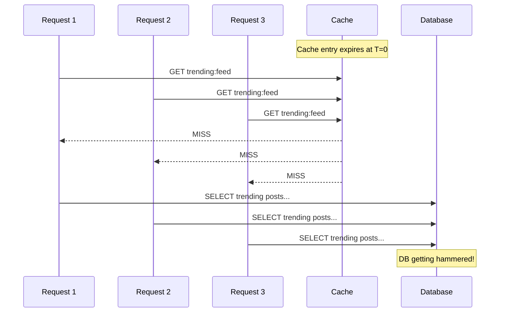
```mermaid
sequenceDiagram
    participant R1 as Request 1
    participant R2 as Request 2
    participant R3 as Request 3
    participant Cache as Cache
    participant DB as Database

    Note over Cache: Cache entry expires at T=0

    R1->>Cache: GET trending:feed
    R2->>Cache: GET trending:feed
    R3->>Cache: GET trending:feed

    Cache-->>R1: MISS
    Cache-->>R2: MISS
    Cache-->>R3: MISS

    R1->>DB: SELECT trending posts...
    R2->>DB: SELECT trending posts...
    R3->>DB: SELECT trending posts...

    Note over DB: DB getting hammered!
```

### Solutions

#### Solution 1: Mutex / Distributed Lock

Only **one** request regenerates the cache. All others wait.

```python
import redis
import time

def get_trending_posts():
    cache_key = "trending:posts"
    lock_key = "lock:trending:posts"
    
    # Try cache first
    cached = redis.get(cache_key)
    if cached:
        return json.loads(cached)
    
    # Acquire lock (only one winner)
    acquired = redis.set(lock_key, "1", nx=True, ex=5)  # 5s lock
    
    if acquired:
        # Winner: regenerate cache
        data = db.query("SELECT ... trending posts ...")
        redis.setex(cache_key, 300, json.dumps(data))
        redis.delete(lock_key)
        return data
    else:
        # Losers: wait and retry
        time.sleep(0.1)
        return get_trending_posts()  # recursive retry
```

**Trade-off:** If the winner crashes, lock expires and next request wins. But all losers had to wait.

#### Solution 2: Probabilistic Early Expiry (Best in practice)

**Analogy:** Don't wait for the light to turn red before slowing down. Start braking when you see it's about to turn.

Before the cache item expires, proactively refresh it. Uses a probabilistic approach to decide when to start refreshing.

```python
import math, random

def get_with_early_refresh(key, ttl, fetch_fn):
    value, remaining_ttl = redis.get_with_ttl(key)
    
    if value is None:
        # Cache miss — regenerate
        value = fetch_fn()
        redis.setex(key, ttl, value)
        return value
    
    # XFetch algorithm: refresh early with increasing probability
    # as TTL decreases
    beta = 1.0  # tuning param
    if -beta * math.log(random.random()) > remaining_ttl:
        # Probabilistically refresh early (before expiry)
        value = fetch_fn()
        redis.setex(key, ttl, value)
    
    return value
```

This means some requests will refresh the cache **before it expires**, ensuring no stampede.

#### Solution 3: Staggered Expiry (Simplest Fix)

Add **random jitter** to TTL so all similar cache entries don't expire at the same time.

```python
import random

BASE_TTL = 3600  # 1 hour
JITTER = 300     # ±5 minutes

def set_cache(key, value):
    ttl = BASE_TTL + random.randint(-JITTER, JITTER)
    redis.setex(key, ttl, value)
    # Different entries expire at different times → no stampede
```

#### Solution 4: Cache Warming

Pre-populate cache **before** expected load. Run a warm-up job that pre-fetches and caches hot data.

```python
def warm_cache():
    """Run before traffic spike (e.g., midnight, or before a product launch)"""
    
    # Top 1000 products
    top_products = db.query("SELECT * FROM products ORDER BY views DESC LIMIT 1000")
    for p in top_products:
        redis.setex(f"product:{p['id']}", 86400, json.dumps(p))
    
    # Home feeds for daily active users
    active_users = db.query("SELECT id FROM users WHERE last_seen > NOW() - INTERVAL 1 DAY")
    for user in active_users:
        feed = compute_feed(user['id'])
        redis.setex(f"feed:{user['id']}", 3600, json.dumps(feed))

# Run daily at 3am (low traffic) or before expected spike
```

**Netflix** warms caches before major new releases. Before a new season drops at midnight, their systems pre-cache thumbnails, metadata, and recommendation lists — so the spike of millions of users is absorbed by cache, not database.

---

### Cache Stampede Solutions Comparison

| Solution | Complexity | Effectiveness | Best For |
|----------|------------|---------------|---------|
| Mutex/Lock | Medium | High | Single popular item expiring |
| Probabilistic Early Expiry | High | Very High | Continuous, high-traffic caches |
| Staggered TTL Jitter | Low | Medium | Bulk similar entries expiring together |
| Cache Warming | Medium | Very High | Predictable traffic patterns |

---

## 10. Redis vs Memcached

**The eternal debate in system design interviews. Jaano dono ko.**

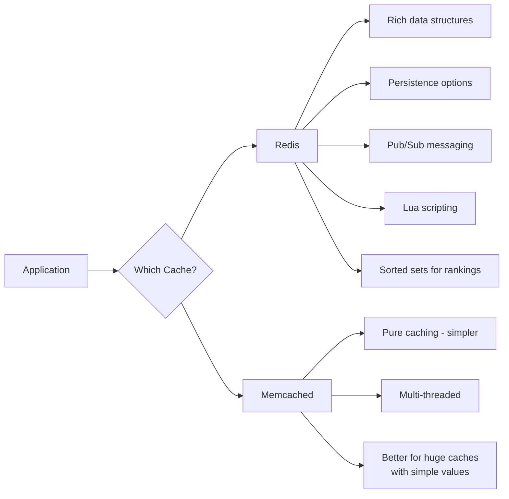
```mermaid
graph LR
    A[Application] --> B{Which Cache?}
    B --> C[Redis]
    B --> D[Memcached]
    
    C --> C1[Rich data structures]
    C --> C2[Persistence options]
    C --> C3[Pub/Sub messaging]
    C --> C4[Lua scripting]
    C --> C5[Sorted sets for rankings]
    
    D --> D1[Pure caching - simpler]
    D --> D2[Multi-threaded]
    D --> D3[Better for huge caches\nwith simple values]
```

### Feature Comparison

| Feature | Redis | Memcached |
|---------|-------|-----------|
| Data Types | String, List, Set, Sorted Set, Hash, Bitmap, HyperLogLog, Stream | String only |
| Persistence | Yes (RDB snapshots + AOF logs) | No (in-memory only) |
| Replication | Yes (primary-replica) | No native replication |
| Clustering | Yes (Redis Cluster) | No native clustering |
| Pub/Sub | Yes | No |
| Transactions | Yes (MULTI/EXEC) | No |
| Lua scripting | Yes | No |
| Threading | Single-threaded (main) + I/O threads | Multi-threaded |
| Memory efficiency | Slightly less efficient | More memory-efficient for simple strings |
| TTL support | Yes | Yes |
| LRU eviction | Yes | Yes |
| Max value size | 512 MB | 1 MB |
| Use cases | Caching, sessions, queues, leaderboards, pub/sub | Pure caching |

### When to Choose Which

**Choose Redis when:**
- You need data structures (sorted sets for leaderboards, lists for queues)
- You need persistence (survive restarts)
- You need pub/sub for real-time features
- You want transactions
- Building something beyond basic caching (rate limiting, session store, etc.)

**Choose Memcached when:**
- Pure high-volume caching of simple string values
- You need maximum throughput with minimal overhead
- You have a massive dataset and want simplest possible caching
- Multi-threading performance matters

### Real Redis Data Structures in Production

```redis
# String — user session
SET session:abc123 '{"userId":1,"role":"admin"}' EX 1800

# Sorted Set — leaderboard (Twitter followers, YouTube views)
ZADD video:views 1000000 "desi_comedy_video"
ZADD video:views 5000000 "kohli_century_video"
ZREVRANGE video:views 0 9 WITHSCORES  # Top 10

# Hash — user profile (access individual fields)
HSET user:123 name "Rahul" city "Pune" age "25"
HGET user:123 city  # → "Pune"

# List — user activity feed
LPUSH feed:user:456 "post:789" "post:790"
LRANGE feed:user:456 0 49  # Latest 50 items

# Set — unique visitors today
SADD unique:visitors:2024-01-15 "user:123" "user:456"
SCARD unique:visitors:2024-01-15  # Count of unique visitors

# HyperLogLog — approximate unique count (10000x less memory)
PFADD pageviews:home "user:1" "user:2" "user:3"
PFCOUNT pageviews:home  # Approximate unique count
```

**Twitter** famously stores the 800 most recently posted tweet IDs for every user who has tweeted in Redis Sorted Sets. This powers the timeline feature. The entire "home timeline" of a user is assembled from these Redis lookups — no database query needed for timeline reads.

---

## 11. Distributed Cache and Consistent Hashing

**Analogy:** Ek dukaan ki jagah, tumne ek mall banaaya with multiple shops (cache servers). Par customer kaise jaane ki kaunsi shop mein apna product stored hai?

When you have a large cache, a single Redis server won't be enough. You need to **shard** data across multiple cache servers.

### The Problem with Naive Sharding

```
Simple modulo sharding:
Server = hash(key) % num_servers

3 servers:
user:123 → hash = 1230 → 1230 % 3 = 0 → Server 0
user:456 → hash = 4560 → 4560 % 3 = 0 → Server 0
user:789 → hash = 7890 → 7890 % 3 = 2 → Server 2

Problem: Add a 4th server!
Now: hash(key) % 4

user:123 → 1230 % 4 = 2 → NOW Server 2 (was Server 0!)
user:456 → 4560 % 4 = 0 → Server 0 (same, lucky)
user:789 → 7890 % 4 = 2 → Server 2 (same, lucky)

Result: 75% of keys point to different servers!
→ Massive cache miss spike on server addition/removal!
```

### Consistent Hashing — The Solution

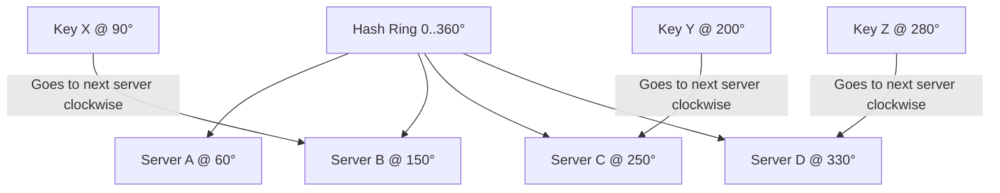
```mermaid
graph TD
    A[Hash Ring 0..360°]
    
    A --> S1[Server A @ 60°]
    A --> S2[Server B @ 150°]
    A --> S3[Server C @ 250°]
    A --> S4[Server D @ 330°]
    
    K1[Key X @ 90°] -->|Goes to next server clockwise| S2
    K2[Key Y @ 200°] -->|Goes to next server clockwise| S3
    K3[Key Z @ 280°] -->|Goes to next server clockwise| S4
```

**How it works:**

1. Hash all servers onto a circular ring (0 to 2^32)
2. Hash each cache key onto the same ring
3. Each key is stored on the **first server clockwise** from its position

```
Ring positions:
  Server A: 60°
  Server B: 150°
  Server C: 250°
  Server D: 330°

Key "user:123" hashes to 90° → goes to Server B (next clockwise)
Key "user:456" hashes to 200° → goes to Server C (next clockwise)
```

**Adding a server:**
```
Add Server E at 120°

Now:
  Keys between 60° and 120° → move from Server B to Server E
  All other keys: unchanged!

Impact: Only ~25% of keys move (1/N), not 75%+ like simple modulo
```

**Virtual nodes** (vnodes) improve balance: instead of one position per server, each server gets multiple positions on the ring (e.g., 150 virtual nodes per physical server). This ensures even key distribution.

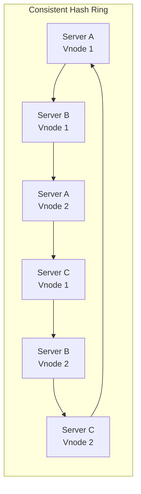
```mermaid
graph LR
    subgraph Consistent Hash Ring
        S1_1[Server A\nVnode 1]
        S2_1[Server B\nVnode 1]
        S1_2[Server A\nVnode 2]
        S3_1[Server C\nVnode 1]
        S2_2[Server B\nVnode 2]
        S3_2[Server C\nVnode 2]
    end
    
    S1_1 --> S2_1 --> S1_2 --> S3_1 --> S2_2 --> S3_2 --> S1_1
```

**Real usage:** **Redis Cluster** uses consistent hashing (with 16384 hash slots). **Memcached** clients implement consistent hashing on the client side. **Discord** uses this for their message caching.

---

## 12. Real-World Examples

### Twitter — Home Timeline Caching

**Problem:** User opens Twitter. Their home timeline must show tweets from the 200 people they follow — instantly.

**Naive approach:** `SELECT tweets FROM tweets WHERE author_id IN (select following from follows where user=me) ORDER BY time LIMIT 20`
- This query on millions of users and billions of tweets = impossibly slow

**Twitter's actual solution (Fan-out on Write):**

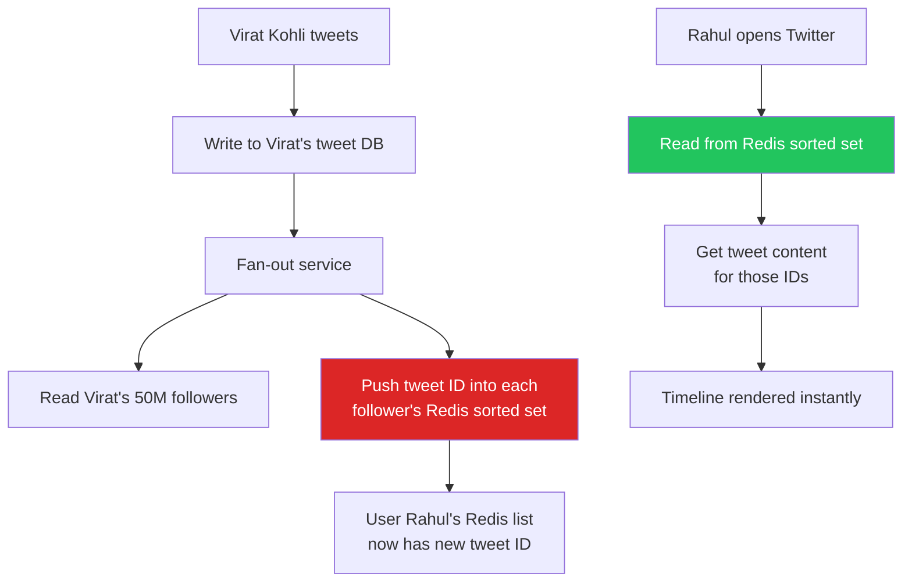
```mermaid
graph TD
    A[Virat Kohli tweets] --> B[Write to Virat's tweet DB]
    B --> C[Fan-out service]
    C --> D[Read Virat's 50M followers]
    C --> E[Push tweet ID into each\nfollower's Redis sorted set]
    
    E --> F[User Rahul's Redis list\nnow has new tweet ID]
    
    G[Rahul opens Twitter] --> H[Read from Redis sorted set]
    H --> I[Get tweet content\nfor those IDs]
    I --> J[Timeline rendered instantly]

    style E fill:#dc2626,color:#fff
    style H fill:#22c55e,color:#fff
```

Twitter stores the **800 most recent tweet IDs** for every active user in Redis. When you open Twitter, it reads your personalized timeline from Redis — no complex SQL join at read time. The "fan-out" (pushing to followers' Redis lists) happens asynchronously at write time.

**Scale:** ~150 million daily active users × 800 tweets × ~8 bytes per ID = ~960 GB of Redis data just for timelines.

---

### Instagram — Photo Feed Caching

**Challenge:** Instagram serves 100 billion+ photos. New followers, new posts, changing relationships.

**Solution:** Multi-level caching
1. **CDN:** Photo files (actual images) cached at edge. A viral photo is served from Fastly CDN nodes worldwide — origin never gets hammered
2. **Redis:** User feed data, like counts, follower counts
3. **Memcached:** User metadata, session data

Instagram uses **Write-Through** for follower counts (consistency matters for display) and **Write-Behind** for like counts (slight staleness acceptable for performance).

---

### Netflix — Video Streaming Cache

**Challenge:** Saturday night pe 100M log simultaneously streaming. Content must start in <2 seconds.

**Solution:**
1. **Open Connect CDN:** Netflix's own global CDN. ISPs host Netflix servers. Your Jio/Airtel router is potentially a few hops from a Netflix server that has popular content cached.
2. **Predictive pre-caching:** Netflix predicts which movies/shows will be popular (based on viewing patterns, launch announcements) and pre-caches them on edge servers *before* demand spikes
3. **Metadata cache:** Show info, thumbnails, recommendations served from Redis

**Result:** 95%+ of Netflix traffic is served from CDN cache, never touching origin servers.

---

### Facebook's Memcached Fleet — Largest Cache in the World

Facebook published a famous 2013 paper: ["Scaling Memcache at Facebook"](https://www.usenix.org/conference/nsdi13/technical-sessions/presentation/nishtala)

Key facts:
- **Thousands of Memcached servers** with **tens of terabytes** of cached data
- Reduces database reads by **90%+**
- Cache hit rate: **99%+**
- Handles billions of requests per second

**Key innovation: "Lease"** — Facebook's solution to cache stampede:
- On cache miss, give a "lease" token to the first requester
- Other requests for the same key get a "wait" signal
- Only the lease holder queries the database and repopulates cache
- All waiters then get the result → exactly one DB query per cache miss

---

### Zomato — Restaurant Listing Cache

**Challenge:** Peak dinner time (7–9pm), millions of users searching for restaurants in their area.

**Solution:**
- **Redis cache for restaurant listings:** City-wise restaurant data cached with 5-minute TTL
- **CDN for images:** Restaurant photos served from Cloudflare with 24-hour TTL
- **Event invalidation:** When restaurant goes offline/online, immediately invalidate cache
- **Database sharding + caching:** Each city's data sharded and cached separately

**Their challenge:** Restaurant status (open/closed) must be near-real-time. They use short TTL (30 seconds) + event-driven invalidation for status, while using longer TTL for static data like menus and photos.

---

## 13. Interview Question: "How Would You Cache a User's Twitter Timeline?"

**This is the most common caching interview question. Here's a full answer.**

### Problem Statement

Design a caching system for Twitter's home timeline. Given a user, return their 20 most recent tweets from people they follow — fast, at scale.

### Step 1: Understand the Requirements

```
Read-to-write ratio: Very high (users read 10x more than they post)
Consistency: Eventual consistency acceptable (slight delay in seeing new tweets is OK)
Scale: 150M daily active users, 500M tweets/day
Latency target: < 200ms for timeline load
```

### Step 2: Identify What to Cache

```
Cache: User's pre-computed timeline (list of tweet IDs from people they follow)
Don't cache: The tweet content itself (too large, changes with edits/likes)
Cache the IDs, fetch content separately
```

### Step 3: Choose the Caching Strategy

**Fan-out on Write (for users with < 10K followers):**

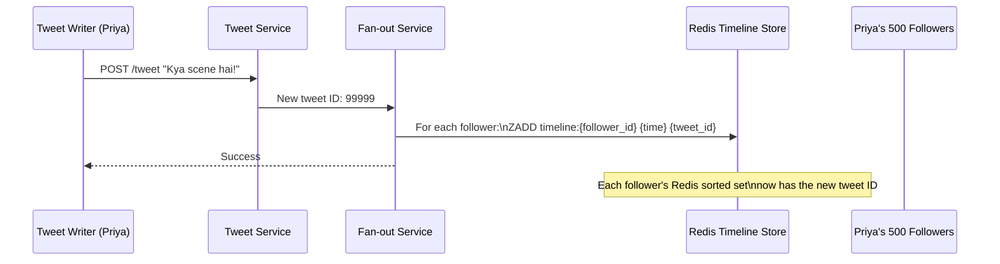
```mermaid
sequenceDiagram
    participant TW as Tweet Writer (Priya)
    participant TS as Tweet Service
    participant FO as Fan-out Service
    participant Redis as Redis Timeline Store
    participant Followers as Priya's 500 Followers

    TW->>TS: POST /tweet "Kya scene hai!"
    TS->>FO: New tweet ID: 99999
    FO->>Redis: For each follower:\nZADD timeline:{follower_id} {time} {tweet_id}
    FO-->>TW: Success
    
    Note over Redis: Each follower's Redis sorted set\nnow has the new tweet ID
```

**Fan-out on Read (for celebrities with > 10M followers):**

```
Virat Kohli tweets → Only stored in Virat's tweet list
When Rahul opens timeline:
  ├─ Fetch from Rahul's cached timeline (regular follows)
  └─ Merge with recent tweets from followed celebrities (fetched on-demand)
```

### Step 4: Cache Storage Design

```
Key:   "timeline:{user_id}"
Type:  Redis Sorted Set
Score: Unix timestamp (for ordering)
Value: Tweet ID

Commands:
# User 456 posted tweet 99999 at timestamp 1700000000
ZADD timeline:123 1700000000 "99999"

# Get latest 20 tweets for user 123
ZREVRANGE timeline:123 0 19

# Keep only latest 800 tweets per user (evict old ones)
ZREMRANGEBYRANK timeline:123 0 -801
```

### Step 5: Cache Invalidation

```
When user unfollows someone:
  → Remove that person's tweet IDs from the timeline cache
  → OR mark timeline as dirty and recompute on next read

When tweet is deleted:
  → Remove tweet ID from all followers' timeline caches
  → (Expensive — that's why Twitter marks deleted tweets, not full removal)

TTL: 7 days of inactivity → expire timeline cache, recompute on next visit
```

### Step 6: Handling Scale Issues

```
Cache Stampede: User with 50M followers returns after 3 months
  → Timeline cache expired
  → System must recompute: fetch last N tweets from 200 following accounts
  → Solution: Async recomputation on return, show older cached data first

Hot Users: Celebrities' tweet lists are read millions of times/sec
  → Store in Redis with replication (1 primary, 5 replicas for reads)
  → Route read requests to replicas via load balancer
```

### Step 7: Full Architecture

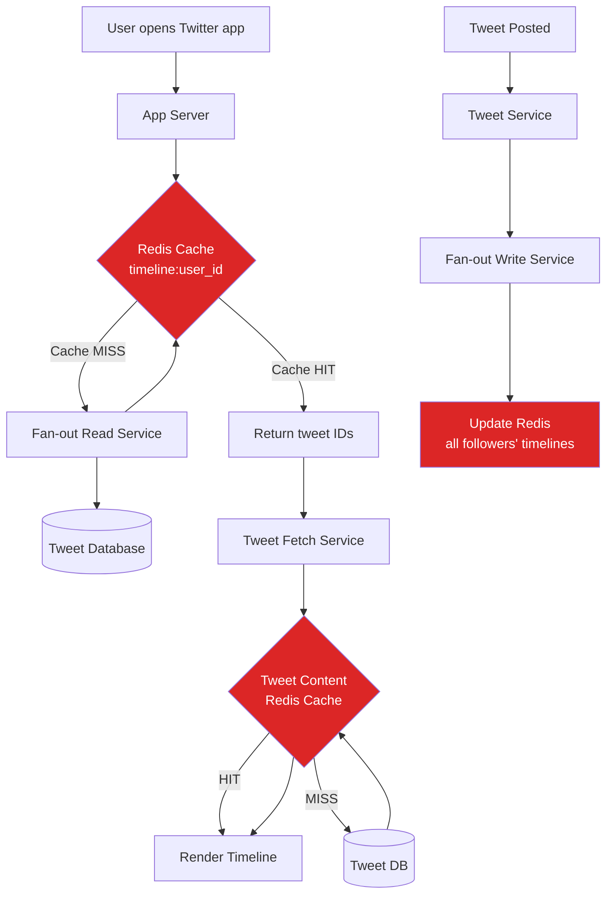
```mermaid
graph TB
    U[User opens Twitter app] --> AS[App Server]
    AS --> RC{Redis Cache\ntimeline:user_id}
    RC -->|Cache HIT| AS2[Return tweet IDs]
    RC -->|Cache MISS| FOW[Fan-out Read Service]
    FOW --> TDB[(Tweet Database)]
    FOW --> RC
    
    TP[Tweet Posted] --> TS[Tweet Service]
    TS --> FO[Fan-out Write Service]
    FO --> RC2[Update Redis\nall followers' timelines]
    
    AS2 --> TF[Tweet Fetch Service]
    TF --> TRC{Tweet Content\nRedis Cache}
    TRC -->|HIT| UI[Render Timeline]
    TRC -->|MISS| TDB2[(Tweet DB)]
    TDB2 --> TRC
    TRC --> UI

    style RC fill:#dc2626,color:#fff
    style RC2 fill:#dc2626,color:#fff
    style TRC fill:#dc2626,color:#fff
```

**Summary answer for interview:**

> "I'd use Redis Sorted Sets to cache each user's pre-computed timeline (tweet IDs, scored by timestamp). Fan-out-on-write for regular users — when Priya tweets, we push her tweet ID into all her followers' Redis sorted sets. For celebrities with 10M+ followers, we use fan-out-on-read — merge their recent tweets at read time. Timeline cache has a 7-day TTL. Cache stampede is handled by probabilistic early expiry. Cache hit rate target: 95%+, which means 95% of timeline reads never hit the database."

---

## 14. Common Interview Questions

Here are the questions most likely to come up, with brief pointers:

---

**Q1: What is the difference between Cache-Aside and Read-Through?**

> In Cache-Aside, the **application** is responsible for fetching from DB on miss and populating cache. In Read-Through, the **cache layer** itself fetches from DB. Cache-Aside gives more control; Read-Through is simpler application code.

---

**Q2: What is cache stampede and how do you prevent it?**

> Cache stampede happens when a popular cache entry expires and many concurrent requests all go to the DB simultaneously. Prevent with: (1) mutex/distributed lock so only one request regenerates, (2) probabilistic early expiry so cache refreshes before expiry, (3) staggered TTL jitter so entries don't expire simultaneously, (4) cache warming before expected traffic.

---

**Q3: When would you use Write-Behind vs Write-Through?**

> Write-Through: when consistency is critical (financial data, account balances). Write-Behind: when write throughput is high and slight staleness is OK (like counts, view counts, game scores). Write-Behind risks data loss if cache fails before async DB write completes.

---

**Q4: Redis vs Memcached — when to use which?**

> Use Redis almost always — it supports rich data structures, persistence, replication, pub/sub, and transactions. Memcached only when you need pure, high-throughput caching of simple string values and maximum memory efficiency.

---

**Q5: How would you handle cache invalidation in a microservices architecture?**

> Use event-driven invalidation: when Service A updates user data, it publishes a `UserUpdated` event to Kafka. Any service caching user data subscribes to this event and invalidates its cache. This decouples services while ensuring eventual cache consistency.

---

**Q6: What is consistent hashing and why does it matter for distributed caches?**

> Consistent hashing places both servers and keys on a circular ring. Keys map to the nearest clockwise server. When a server is added/removed, only ~1/N of keys need to be remapped (vs ~100% with modulo hashing). This prevents massive cache miss spikes during scaling events.

---

**Q7: How would you cache a product catalog for an e-commerce site during a sale?**

> (1) Identify hot products (top 1% by views — Pareto principle). (2) Cache product details in Redis with TTL of 1 hour, prices with TTL of 5 minutes (prices change more). (3) Use event-driven invalidation on price/inventory changes. (4) Pre-warm cache before sale starts. (5) Add jitter to TTLs to prevent stampede. (6) CDN for product images and static content. Target: 95% cache hit rate so DB handles only 5% of traffic during sale peak.

---

**Q8: What is a cache hit rate and what is a good target?**

> Hit Rate = Hits / (Hits + Misses). Aim for 80-99%+ depending on use case. Below 80% means cache is not helping much — reconsider what's being cached, TTL values, or cache size.

---

**Q9: How does Twitter's home timeline work with caching?**

> Twitter uses Redis Sorted Sets. Each user has a "timeline" sorted set containing tweet IDs from accounts they follow, scored by timestamp. On tweet creation, fan-out service pushes tweet ID to followers' timeline caches. On timeline read, fetch tweet IDs from Redis, then fetch tweet content (also cached). 95%+ reads never hit the primary database.

---

**Q10: What are the trade-offs of caching at the CDN vs application layer?**

> CDN cache: global, lower latency for end users, reduces origin traffic, but invalidation is slower (propagates to all edges) and limited control. Application cache (Redis): programmable, fine-grained control, instant invalidation, but doesn't help with geographic distribution. Use both together: CDN for static/edge caching, Redis for dynamic/personalized data.

---

## 15. Key Takeaways

```
┌──────────────────────────────────────────────────────────────────────┐
│                        CACHING CHEAT SHEET                           │
├──────────────────────────────────────────────────────────────────────┤
│                                                                      │
│  WHAT: Store expensive results temporarily for fast reuse            │
│                                                                      │
│  WHY: 80% of reads hit 20% of data — cache that 20% (Pareto)        │
│                                                                      │
│  CACHE LAYERS (fastest to slowest):                                  │
│  CPU L1/L2/L3 → RAM (in-process) → Redis → CDN → Browser            │
│                                                                      │
│  READ STRATEGIES:                                                    │
│  • Cache-Aside (most common) — app fetches on miss                   │
│  • Read-Through — cache fetches on miss                              │
│                                                                      │
│  WRITE STRATEGIES:                                                   │
│  • Write-Through → consistent, slower writes (financial data)        │
│  • Write-Behind  → fast writes, risk of loss (counters, logs)        │
│  • Write-Around  → skip cache on write (write-once data)             │
│                                                                      │
│  EVICTION:                                                           │
│  • LRU = most common, evict least recently used                      │
│  • TTL = simple time-based expiry, always use it                     │
│  • LFU = keep most frequently used (popularity-driven)               │
│                                                                      │
│  HARDEST PROBLEM: Cache Invalidation                                 │
│  → Use TTL + event-driven invalidation together                      │
│                                                                      │
│  CACHE STAMPEDE: Prevent with lock + jitter + early expiry           │
│                                                                      │
│  REDIS > MEMCACHED in almost every modern use case                   │
│                                                                      │
│  DISTRIBUTED CACHE: Use consistent hashing for sharding             │
│                                                                      │
│  TARGET HIT RATE: 95%+ (miss = expensive DB round-trip)             │
│                                                                      │
│  REAL EXAMPLES:                                                      │
│  • Twitter: Redis Sorted Sets for home timeline                      │
│  • Netflix: Own CDN (Open Connect) + predictive pre-caching          │
│  • Facebook: Memcached fleet, 99%+ hit rate, billions req/sec        │
│  • Instagram: CDN for photos, Redis for feed + counts                │
│  • Zomato: Event-driven cache invalidation for restaurant status     │
│                                                                      │
│  INTERVIEW ANSWER TEMPLATE:                                          │
│  "I'll cache [what] using [Redis/CDN] with Cache-Aside pattern.      │
│   TTL of [X], targeting [Y]% hit rate. Cache invalidation via        │
│   [TTL/events]. Stampede prevention via [lock/jitter/warming]."      │
│                                                                      │
└──────────────────────────────────────────────────────────────────────┘
```

---

## Navigation

- Previous: [CDN (Content Delivery Networks)](../12-cdn/README.md)
- Next: [Message Queues](../14-message-queues/README.md)
- Back to: [System Design Notes](../README.md)

---

*Caching is the single highest-leverage optimization in system design. Master it and you can make almost any system 10–100x faster. The hardest part isn't reading from cache — it's knowing what to cache, for how long, and how to keep it fresh. Yahi distinguish karta hai a good engineer from a great one.*
