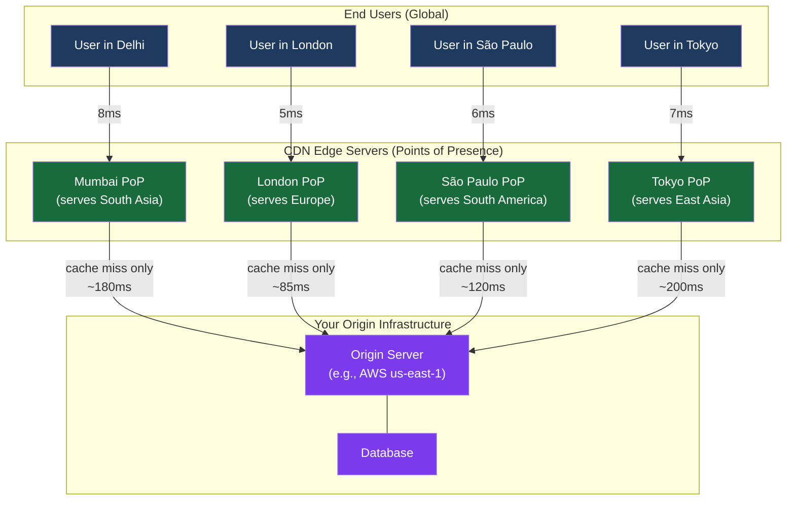
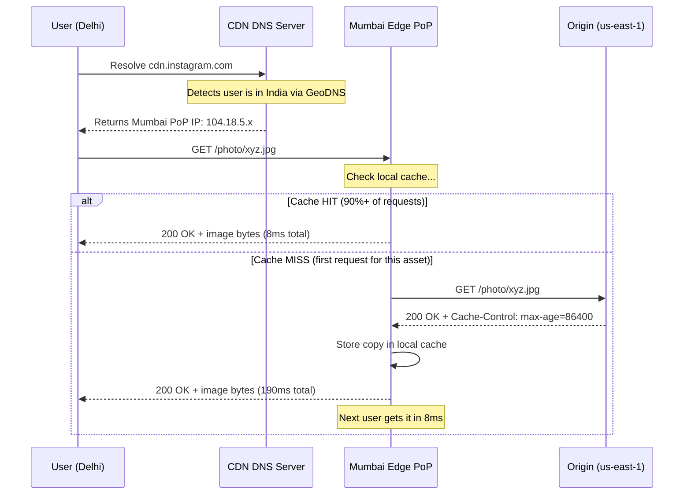
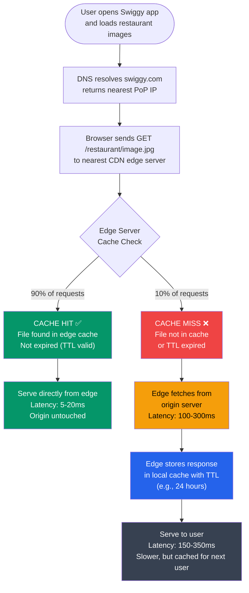
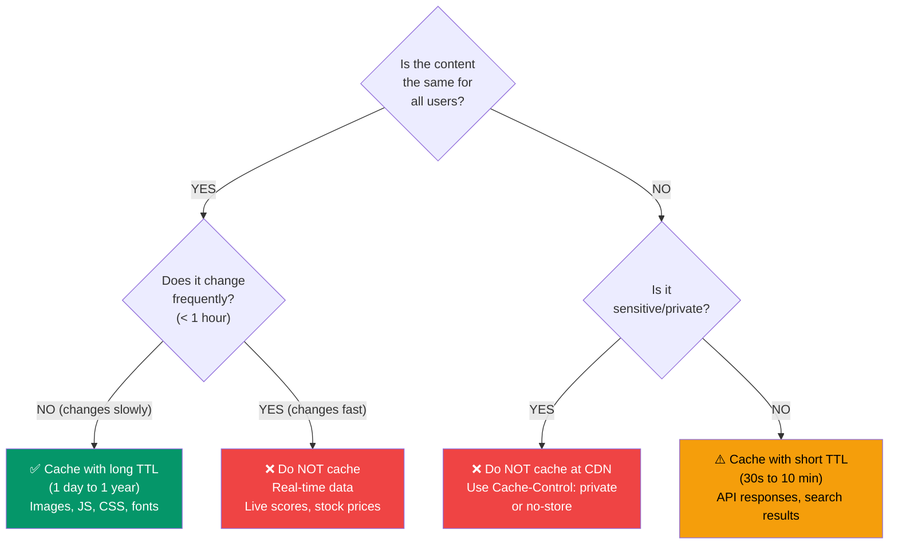
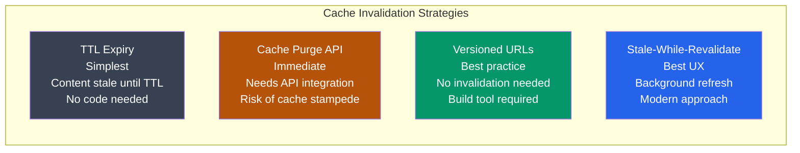
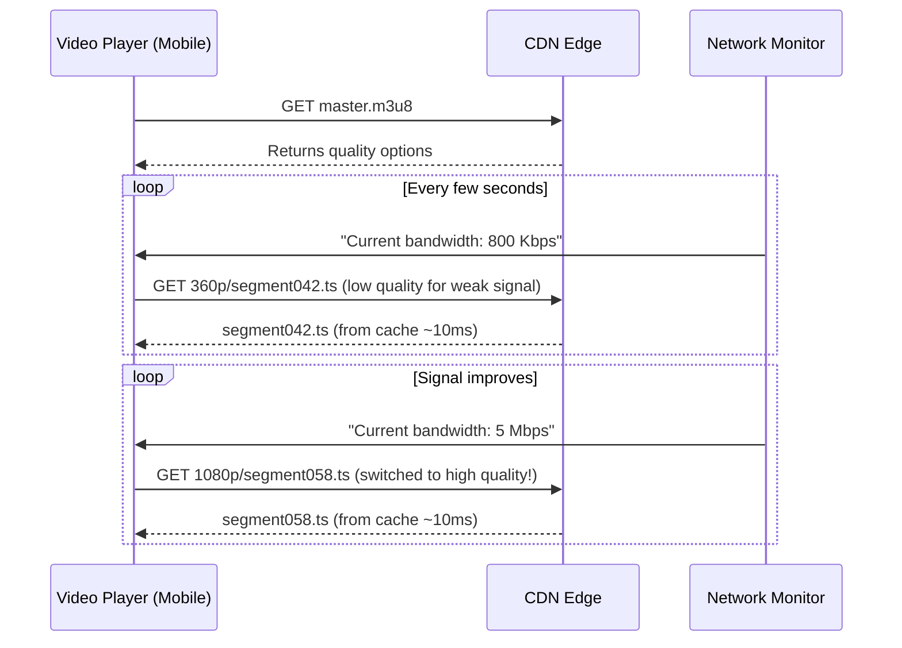
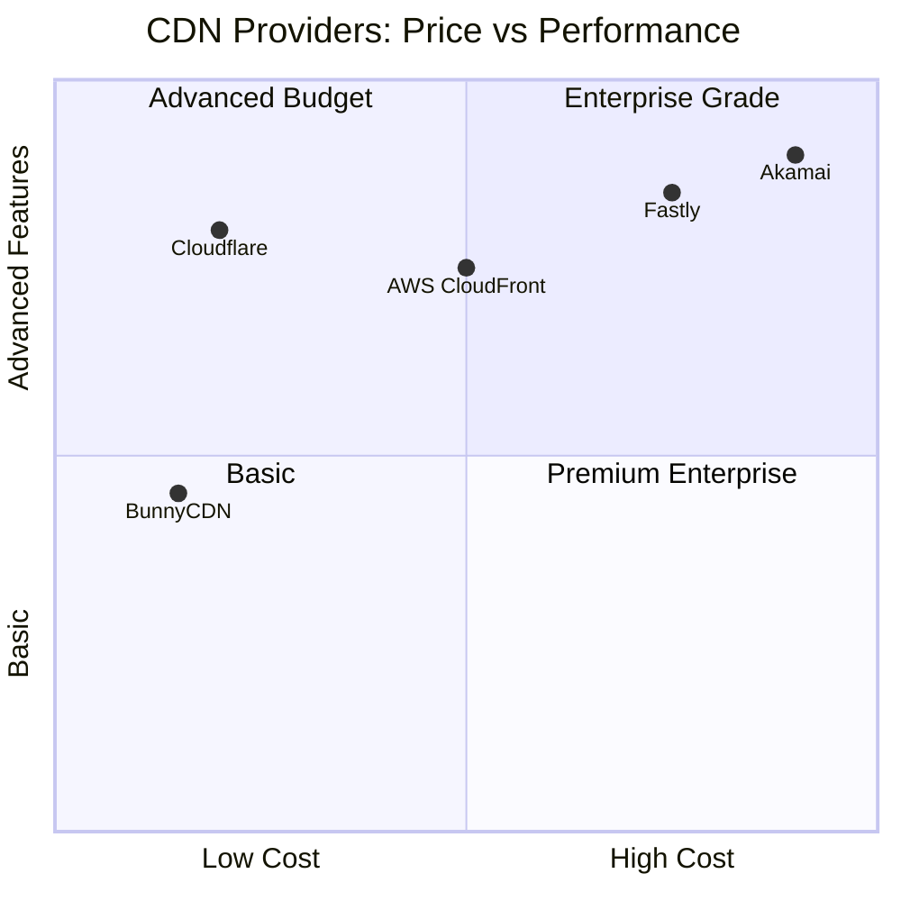
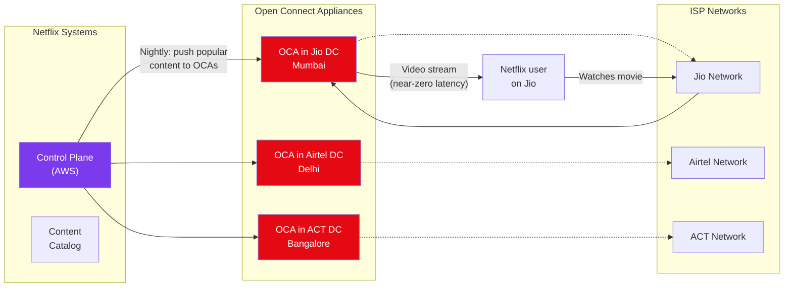

# Content Delivery Networks (CDN)

> This is your one-stop reference for CDNs — from first principles to interview-ready depth. No supplement needed.

---

## Table of Contents

1. [The Problem CDNs Solve](#1-the-problem-cdns-solve)
2. [What Is a CDN?](#2-what-is-a-cdn)
3. [How CDNs Work Internally](#3-how-cdns-work-internally)
4. [CDN Request Flow — Cache Hit and Miss](#4-cdn-request-flow--cache-hit-and-miss)
5. [What Can Be Cached?](#5-what-can-be-cached)
6. [Push CDN vs Pull CDN](#6-push-cdn-vs-pull-cdn)
7. [Cache Headers for CDN](#7-cache-headers-for-cdn)
8. [Cache Invalidation Strategies](#8-cache-invalidation-strategies)
9. [CDN for Video Streaming](#9-cdn-for-video-streaming)
10. [CDN Providers Compared](#10-cdn-providers-compared)
11. [CDN Security Features](#11-cdn-security-features)
12. [Edge Computing — The Next Level](#12-edge-computing--the-next-level)
13. [When NOT to Use a CDN](#13-when-not-to-use-a-cdn)
14. [Real-World: Netflix Open Connect](#14-real-world-netflix-open-connect)
15. [Cost Considerations](#15-cost-considerations)
16. [Common Pitfalls](#16-common-pitfalls)
17. [Common Interview Questions](#17-common-interview-questions)
18. [Key Takeaways](#18-key-takeaways)

---

## 1. The Problem CDNs Solve

### Analogy first — samosa stall wali baat

Imagine you're in Delhi and you're craving a very specific dosa. The only restaurant that makes it is in Chennai. You have two options:

- **Option A**: Book a flight to Chennai, eat the dosa, fly back. Round trip: 3–4 hours.
- **Option B**: That Chennai restaurant opens a branch in Connaught Place, Delhi — same recipe, same taste. You walk 10 minutes and eat.

Option B is what a CDN does. Your server (the origin restaurant in Chennai) has the content. The CDN opens "branches" (edge servers) all over the world. Users get served from the nearest branch.

### The actual math — latency without CDN

Consider Instagram's image server sitting in Mumbai. A user in New York opens Instagram.

```
Mumbai → New York distance: ~13,000 km
Speed of light in fiber: ~200,000 km/s

One-way theoretical minimum: 65ms
With TCP overhead, routing hops, processing: ~180–220ms round trip

For a single image: 200ms
Instagram feed loads 12 images at once
Serial loading: 12 × 200ms = 2.4 seconds just for images!
(Parallel connections help, but you still pay the distance tax)
```

Now multiply this for Zomato serving restaurant images to users in Bangalore from servers in US-East. Or YouTube serving video thumbnails globally. The distance problem is real and brutal.

### What happens at scale

```
A page like Flipkart's homepage:
─────────────────────────────────
- 1 HTML file
- 15 CSS files
- 30+ JavaScript bundles
- 80+ images (product photos, banners, icons)
- 10 fonts
= ~136 assets per page load

Without CDN (India → US server):
136 assets × 200ms = 27 seconds (sequential)
Even with parallelism: 4–6 seconds just in network time

With CDN (India → Mumbai edge):
136 assets × 8ms = ~1 second total ✅
```

Yeh kyun important hai? Because Google's research shows: **every 100ms of latency costs 1% in revenue**. Amazon found a 1-second delay reduces sales by 7%. Latency is money.

---

## 2. What Is a CDN?

### Simple definition

A **CDN (Content Delivery Network)** is a globally distributed network of servers that caches and serves content from locations physically close to end users — instead of making every request travel to a central origin server.

**Key vocabulary:**
- **Origin server**: Your actual server where the content lives (e.g., your AWS EC2 instance in us-east-1)
- **Edge server**: A CDN server geographically close to users (also called a "PoP server")
- **PoP (Point of Presence)**: A CDN data center in a specific city/region (e.g., Cloudflare has a PoP in Mumbai, Chennai, Hyderabad, Delhi)
- **Cache**: A local copy of content stored on the edge server

### Scale of major CDN providers

| CDN Provider | PoPs Worldwide | Countries |
|---|---|---|
| Cloudflare | 300+ | 100+ |
| AWS CloudFront | 450+ | 90+ |
| Akamai | 4,000+ | 130+ |
| Fastly | 60+ | 30+ |
| Google Cloud CDN | 120+ | 50+ |

Cloudflare has a PoP in most major Indian cities. When someone in Pune loads a Cloudflare-fronted website, their request hits a server possibly in Mumbai — not somewhere in the US.

### The global CDN architecture



**Simple baat hai**: Users talk to their nearest PoP. The PoP talks to origin only when it doesn't have a cached copy.

---

## 3. How CDNs Work Internally

### DNS-based routing — how do users reach the right PoP?

When you type `www.instagram.com`, your browser does a DNS lookup. For CDN-backed sites, the DNS server is smart — it looks at where your request came from and returns the IP address of the nearest edge server.

Two main routing mechanisms:

#### Method 1: GeoDNS

```
User in Delhi does DNS lookup for cdn.example.com
   ↓
CDN's DNS server checks: "This request came from India"
   ↓
Returns IP address of Mumbai PoP: 104.18.x.x
   ↓
User connects to Mumbai PoP directly
```

#### Method 2: Anycast (Cloudflare's approach)

```
All Cloudflare PoPs worldwide advertise the SAME IP address via BGP
Example: 1.1.1.1 is Cloudflare's DNS — served from ALL PoPs

When your packet arrives at a router, BGP naturally routes it to
the topologically closest PoP advertising that IP.

User in Delhi → packet goes to Mumbai PoP
User in London → same IP, packet goes to London PoP

No DNS trickery needed — the network itself does routing!
```



### The cache hit rate — the magic metric

The CDN's value is in **cache hit rate**: percentage of requests served from edge cache without hitting origin.

```
Cache Hit Rate = (Requests served from cache) / (Total requests) × 100

Good: 90%+
Great: 95%+
Exceptional: 99%+

If 1 million users load the same Instagram story photo:
- First user: cache MISS → 190ms, origin gets hit
- Users 2 through 1,000,000: cache HIT → 8ms each, origin untouched

Origin load reduced by 99.9999%!
```

---

## 4. CDN Request Flow — Cache Hit and Miss

### Complete flow diagram



### Response headers to identify CDN behavior

When you open Chrome DevTools → Network tab, you can see these headers:

```http
# Cloudflare headers
CF-Cache-Status: HIT          ← served from Cloudflare cache
CF-Cache-Status: MISS         ← fetched from your origin
CF-Cache-Status: EXPIRED      ← was cached but TTL elapsed
CF-Cache-Status: BYPASS       ← CDN intentionally skipped caching
CF-Cache-Status: DYNAMIC      ← not cached (dynamic content)
CF-Ray: 7a8b9c0d1e2f3a4b-BOM  ← BOM = Bombay PoP served this

# Generic CDN headers
X-Cache: HIT
Age: 3600    ← this response has been in cache for 3600 seconds
```

**Interview tip**: Interviewers sometimes ask "how do you know if CDN is working?" — check these headers in DevTools.

---

## 5. What Can Be Cached?

### Analogy — what can a branch restaurant prepare vs what needs the head chef?

The Mumbai branch of your restaurant can serve standard menu items (idli, dosa, vada) without calling Chennai. But for a custom wedding menu for a specific customer, you need the head chef in Chennai.

Similarly, CDNs are great at serving standard content, not so great at serving personalized content.

### Static content — CDN ka best friend

These are assets that are the **same for every user** and **don't change frequently**:

```
✅ Images (JPEG, PNG, WebP, SVG)
   → Instagram profile pictures, Zomato food photos, product images
   → TTL: 7-30 days (or forever with cache-busting)

✅ Videos (MP4, WebM, HLS segments)
   → YouTube video chunks, Netflix episodes
   → TTL: 24 hours to 30 days

✅ CSS stylesheets
   → Your app's design, layout, colors
   → TTL: 1 year (with content hashing in filename)

✅ JavaScript bundles
   → React/Angular/Vue code
   → TTL: 1 year (with content hashing: app.a3f5b1.js)

✅ Fonts (WOFF2, WOFF)
   → Typography files
   → TTL: 1 year

✅ Static HTML pages
   → Marketing pages, landing pages, docs
   → TTL: 1 hour to 1 day
```

### Dynamic content — tricky territory

```
⚠️  API responses (JSON)
   → Public APIs that return the same data for everyone
   → Example: "Top 10 restaurants in Bangalore" (changes hourly)
   → TTL: 60 seconds to 10 minutes

⚠️  HTML pages with some personalization
   → Swiggy homepage shows your city's restaurants
   → Strategy: Edge-side includes (render common parts at CDN, personal parts from origin)

⚠️  Search results
   → Popular searches can be cached briefly
   → TTL: 30 seconds to 5 minutes
```

### Content that should NEVER be cached at CDN level

```
❌ Shopping cart contents
❌ User authentication tokens / session data
❌ Bank account details, payment info
❌ Real-time stock prices, live scores
❌ Private messages (WhatsApp chats, DMs)
❌ Personalized recommendations (your Spotify playlist)
   → Use Cache-Control: private (browser can cache, CDN cannot)
   → Use Cache-Control: no-store (nothing caches it)
```

### Decision matrix



---

## 6. Push CDN vs Pull CDN

### The fundamental difference

Think of two types of supermarkets:

- **Push CDN**: You (the store) proactively stock the branch before customers arrive. Before launch, you push all your inventory to all branches.
- **Pull CDN**: The branch is empty. First customer asks for something, branch orders it from the warehouse, stocks it, and serves it. Second customer gets it immediately from branch stock.

### Pull CDN (most common)

```
How it works:
─────────────
1. You deploy your website. CDN starts empty.
2. First user in Mumbai requests image.jpg
3. Mumbai PoP has no copy → fetches from origin → caches it → serves user
4. Second user in Mumbai requests same image.jpg
5. Mumbai PoP serves from cache immediately ✅

Configuration (Nginx origin):
──────────────────────────────
location /images/ {
    root /var/www/static;
    add_header Cache-Control "public, max-age=86400";
    # CDN will pull and cache for 86400 seconds (1 day)
}
```

**Pros of Pull CDN:**
- Zero setup needed — just point CDN to your origin
- Only stores content that's actually requested (no wasted storage)
- Simple to configure
- Good for sites with thousands of assets (CDN caches only popular ones)

**Cons of Pull CDN:**
- First user in each region gets a slow response (cache miss, origin fetch)
- High traffic spikes hit origin before CDN warms up (e.g., when a cricket match starts)
- If origin goes down, cache misses fail too

**Used by**: Cloudflare, AWS CloudFront, Fastly — all support pull by default. YouTube, Zomato, Flipkart use pull CDN for their assets.

### Push CDN

```
How it works:
─────────────
1. You finish a video encoding job (e.g., new movie on OTT platform)
2. Your system PUSHES the video file to all CDN PoPs proactively
   POST https://api.cdn-provider.com/content/upload
   Body: { file: video.mp4, regions: ["IN", "US", "EU"] }
3. When first user in any region requests it, it's already there ✅

Example with AWS S3 + CloudFront:
───────────────────────────────────
- Upload video to S3 bucket (origin)
- Set S3 bucket as CloudFront origin
- Optionally pre-warm specific PoPs via CloudFront API
```

**Pros of Push CDN:**
- No cache miss penalty — content pre-distributed before users hit it
- Great for predictable, scheduled releases (Hotstar IPL stream starting at 7:30pm)
- Efficient for large files that need guaranteed availability

**Cons of Push CDN:**
- Storage costs — you pay for storage in all PoPs even for unpopular content
- More complex to manage (you handle the push logic)
- Need to delete old content manually

**Used by**: Netflix (partial — they pre-position popular content), Hotstar for major cricket events, gaming companies for update patches.

### When to choose which

| Criteria | Pull CDN | Push CDN |
|---|---|---|
| **Content type** | Dynamic, unpredictable, long-tail | Known files, scheduled releases |
| **File size** | Small-medium (< 1GB) | Large (videos, game patches) |
| **Traffic pattern** | Unpredictable, organic | Predictable spikes (events, launches) |
| **Setup complexity** | Simple (just point to origin) | Complex (upload pipeline needed) |
| **Cost model** | Pay for bandwidth | Pay for storage + bandwidth |
| **Cache miss risk** | First request per region is slow | No cache misses |
| **Examples** | Zomato images, Twitter media | Netflix movies, Hotstar IPL, game updates |

**Interview tip**: Most systems use Pull CDN. Push CDN is specifically for large media files with predictable demand. If someone asks "design CDN strategy for OTT platform" — say Pull for thumbnails/metadata, Push for actual video content of popular titles.

---

## 7. Cache Headers for CDN

### Analogy — label on a milk carton

Every product in a supermarket has an expiry date on the label. Similarly, every HTTP response has Cache-Control headers that tell the CDN: "how long can you keep this? who can keep it?"

### The most important cache headers

```http
# 1. Cache-Control — the primary directive
Cache-Control: public, max-age=86400
# public = both CDN and browser can cache
# max-age = cache for 86400 seconds (1 day)

Cache-Control: public, max-age=31536000, immutable
# 1 year cache, content will never change (use with hashed filenames)
# immutable = browser won't even check for updates during TTL

Cache-Control: public, s-maxage=3600, max-age=60
# s-maxage = CDN-specific TTL (3600s = 1 hour)
# max-age = browser TTL (60s = 1 minute)
# CDN caches longer than browser — good for API responses

Cache-Control: private, max-age=300
# private = CDN cannot cache, only browser can
# Use for user-specific data

Cache-Control: no-cache
# Must revalidate with origin before serving
# CDN can store it but must check if still fresh

Cache-Control: no-store
# NEVER store anywhere — sensitive data
# Bank statements, medical records, auth responses

Cache-Control: must-revalidate
# Once stale, must check origin before serving (even if origin is slow/down)
```

### The Vary header — cache key variants

```http
Vary: Accept-Encoding
# CDN stores separate copies for gzip, br, identity
# One copy for browsers that support Brotli, another for those that don't

Vary: Origin
# CRITICAL for CORS — CDN stores separate response per requesting origin
# Without this: cdn.example.com returns Access-Control-Allow-Origin: https://app1.com
# to a user from https://app2.com — wrong! CORS bug.

Vary: Accept-Language
# Separate cache per language (for multi-language sites)
# Warning: Vary on many headers = low cache hit rate (too many variants)
```

### ETag and conditional requests — validation without re-downloading

```http
# Origin sends:
ETag: "abc123"
Last-Modified: Thu, 01 Jun 2024 00:00:00 GMT

# CDN (or browser) on next request sends:
If-None-Match: "abc123"
If-Modified-Since: Thu, 01 Jun 2024 00:00:00 GMT

# Origin responds:
304 Not Modified   ← no body, just a status code
# "Content hasn't changed, use what you have"
# Saves bandwidth! Only metadata exchanged.
```

### Real-world cache header examples

```http
# Instagram static assets (images with hashed URLs)
Cache-Control: public, max-age=3600
# Actually short — Instagram rotates content URLs frequently

# Google Fonts
Cache-Control: public, max-age=31536000
# 1 year — fonts almost never change

# Twitter API response (tweet timeline)
Cache-Control: no-cache, no-store, must-revalidate
# Never cache — real-time feed

# YouTube video chunks (.ts segments)
Cache-Control: public, max-age=604800
# 7 days — video segments are immutable (content-addressed)

# Cloudflare's CDN-Cache-Control header (overrides origin Cache-Control)
CDN-Cache-Control: max-age=3600
# Tells Cloudflare specifically what to do, ignoring browser Cache-Control
```

---

## 8. Cache Invalidation Strategies

### The hardest problem in computer science

Phil Karlton famously said: *"There are only two hard things in Computer Science: cache invalidation and naming things."*

Basically, the problem is: you cached something, but now the original has changed. How do you tell 300 edge servers across the world to forget what they know?

### Strategy 1: TTL Expiry (let it die naturally)

```
How it works:
─────────────
Cache-Control: max-age=3600  (1 hour TTL)

After 1 hour, edge servers discard cached copy.
Next request fetches fresh version from origin.

Pros: Zero complexity. No API calls. Just works.
Cons: Stale content served for up to TTL duration.

Best for:
- Restaurant menus that change daily
- Blog posts (update once/day is fine)
- Marketing banners
- Content where 1-hour staleness is acceptable
```

### Strategy 2: Cache Purging (nuke it now)

```
How it works:
─────────────
You make an API call to the CDN to immediately invalidate specific URLs.
CDN propagates the purge to all PoPs within seconds/minutes.

Cloudflare (purge specific files):
────────────────────────────────────
curl -X POST "https://api.cloudflare.com/client/v4/zones/ZONE_ID/purge_cache" \
  -H "Authorization: Bearer TOKEN" \
  -H "Content-Type: application/json" \
  -d '{"files": ["https://example.com/image.jpg", "https://example.com/style.css"]}'

Cloudflare (purge everything — use sparingly!):
────────────────────────────────────────────────
curl -X POST ".../purge_cache" \
  -d '{"purge_everything": true}'

AWS CloudFront:
───────────────
aws cloudfront create-invalidation \
  --distribution-id EDFDVBD6EXAMPLE \
  --paths "/images/*" "/css/style.css"
# Takes 5-10 minutes to propagate! (Cloudflare is ~150ms)

Pros:
- Immediate effect (at least for Cloudflare/Fastly)
- Specific: invalidate only what changed

Cons:
- API call required (adds complexity to deployment pipeline)
- CloudFront charges per invalidation path ($0.005/path after first 1000/month)
- If you mess up and purge everything, origin gets hammered by cold cache
```

### Strategy 3: Versioned URLs / Cache Busting (the recommended approach)

```
The fundamental insight:
─────────────────────────
Instead of invalidating, make the NEW content live at a NEW URL.
Old URL stays cached (serves stale, but nobody links to it anymore).
New URL starts fresh (cache miss, fetches from origin, then cached).

Implementation:
───────────────
BAD: /static/app.js       ← changing content, same URL = stale cache problem
GOOD: /static/app.a3f5b1.js  ← content hash in filename

When your app.js changes:
Old: /static/app.a3f5b1.js (still in cache, not referenced by new HTML)
New: /static/app.d8c2e7.js (fresh URL, cache miss first time, then cached forever)

Your HTML references:
<script src="/static/app.d8c2e7.js"></script>  ← new version

Webpack/Vite does this automatically with:
output: { filename: '[name].[contenthash].js' }

TTL on versioned assets:
Cache-Control: public, max-age=31536000, immutable
# Cache for 1 year — safe because URL changes when content changes!
```

### Strategy 4: Stale-While-Revalidate (background refresh)

```http
Cache-Control: public, max-age=60, stale-while-revalidate=300

How it works:
─────────────
- First 60 seconds: serve cached version (fresh)
- Seconds 61-300: serve STALE cached version but simultaneously
  fetch fresh version from origin in background
- After 300 seconds: must fetch from origin before serving

Result: Users ALWAYS get an instant response (no waiting for origin)
         Content eventually becomes fresh (in background)

Used by: Vercel's CDN, Next.js, some Cloudflare configurations
Perfect for: News sites, product pages — "slightly stale is fine"
```

### Comparison of strategies



**Real-world: how Zomato handles cache invalidation**

When Zomato updates a restaurant's menu prices:
1. Menu data API response: `Cache-Control: public, max-age=300` → stale for max 5 minutes (acceptable)
2. Restaurant photos: Versioned URLs → new photo = new URL, no purge needed
3. Promo banners: Cloudflare purge API called by their CI/CD pipeline on every deploy

---

## 9. CDN for Video Streaming

### The unique challenge of video

Imagine YouTube wants to serve a 1080p video to 10 million people watching simultaneously. The video file is 4GB. Simple calculation:

```
4GB × 10 million users = 40 Petabytes of data transferred
All from a single origin server? Impossible.

But CDN doesn't help much either if you stream the full 4GB file —
CDN needs to cache 4GB per video per PoP, and users may abandon
after 2 minutes.

Solution: Adaptive Bitrate Streaming (ABR)
─────────────────────────────────────────
Break video into 2-10 second chunks.
Encode at multiple quality levels.
CDN caches small chunks, not the full file.
Player requests only the chunks it needs.
```

### HLS — HTTP Live Streaming (Apple's standard, most widely used)

```
Directory structure on CDN:
────────────────────────────
/video/episode-1/
  master.m3u8          ← master playlist (references quality variants)
  1080p/
    playlist.m3u8      ← 1080p quality playlist (lists segments)
    segment001.ts      ← first 4 seconds of 1080p
    segment002.ts      ← next 4 seconds of 1080p
    segment003.ts
    ...
  720p/
    playlist.m3u8
    segment001.ts
    ...
  360p/
    playlist.m3u8
    segment001.ts
    ...

master.m3u8 contents:
──────────────────────
#EXTM3U
#EXT-X-STREAM-INF:BANDWIDTH=5000000,RESOLUTION=1920x1080
1080p/playlist.m3u8
#EXT-X-STREAM-INF:BANDWIDTH=2500000,RESOLUTION=1280x720
720p/playlist.m3u8
#EXT-X-STREAM-INF:BANDWIDTH=800000,RESOLUTION=640x360
360p/playlist.m3u8
```

### Adaptive bitrate — the smart player



**Why CDN is perfect for this**:
- Same segments watched by millions → incredible cache hit rate
- Segments are small (1-5MB each) → fit in CDN memory easily
- Segments are immutable → long TTL, no invalidation headaches
- CDN can serve thousands of concurrent video streams from edge

### Cache headers for video segments

```http
# Segment files (immutable — same content forever)
Cache-Control: public, max-age=2592000  (30 days)

# Playlist files (.m3u8) — for live streams, these update frequently!
Cache-Control: public, max-age=2  (live stream: 2 seconds only)
Cache-Control: public, max-age=60 (VOD: 1 minute is fine)

# Master playlist — rarely changes
Cache-Control: public, max-age=3600
```

### DASH vs HLS

| Feature | HLS | MPEG-DASH |
|---|---|---|
| **Full name** | HTTP Live Streaming | Dynamic Adaptive Streaming over HTTP |
| **Created by** | Apple | MPEG consortium |
| **Format** | .m3u8 playlists + .ts segments | .mpd manifests + .mp4 segments |
| **Browser support** | Native on iOS/macOS, JS on others | JS player needed (Shaka, dash.js) |
| **Latency** | 3-30 seconds (LL-HLS: < 3s) | 2-30 seconds |
| **DRM** | FairPlay (Apple), Widevine via ext | Widevine, PlayReady, FairPlay |
| **Used by** | Apple TV, Hotstar, Twitch | YouTube, Netflix, Vimeo |

---

## 10. CDN Providers Compared

### The major players



### Detailed comparison table

| Feature | Cloudflare | AWS CloudFront | Akamai | Fastly |
|---|---|---|---|---|
| **PoP count** | 300+ | 450+ | 4,000+ | 60+ |
| **Pricing** | Flat rate (generous free tier) | Per GB + per request | Custom enterprise | Pay per use |
| **Free tier** | Yes (unlimited bandwidth!) | No | No | No |
| **Cache purge speed** | ~150ms globally | 5-15 minutes | Minutes | ~150ms |
| **Edge compute** | Workers (V8 isolates) | Lambda@Edge / CloudFront Functions | EdgeWorkers | Compute@Edge (Wasm) |
| **DDoS protection** | Built-in (Magic Transit) | AWS Shield | Built-in | Built-in |
| **Analytics** | Detailed real-time | CloudWatch integration | Detailed | Real-time streaming |
| **Best for** | Startups, general web | AWS-native apps | Huge enterprises | Media, real-time |
| **Setup difficulty** | Easy (nameserver change) | Medium (AWS console) | Hard (sales team) | Medium |

### Deep dive on each

**Cloudflare**

Sabse popular CDN for most companies. Yeh kyun?

- Change your domain's nameserver to Cloudflare → instantly get CDN, DDoS protection, WAF, SSL
- Free tier genuinely useful (unlimited bandwidth — competitors charge per GB)
- Anycast network — all 300+ PoPs share same IP, routing is automatic
- Workers (edge functions) are the best in class for running JavaScript at edge
- Cloudflare also provides DNS (1.1.1.1), tunnels, zero-trust, DDOS protection
- Used by: Discord, Shopify, Canva, and millions of other sites

**AWS CloudFront**

Agar already AWS pe ho, toh CloudFront natural choice hai.

- Native integration with S3 (static hosting), EC2, ALB, API Gateway
- IAM for access control, CloudWatch for metrics
- Slowest cache invalidation in the industry (5-15 minutes vs Cloudflare's 150ms)
- Lambda@Edge: run Node.js functions at edge (expensive per invocation)
- CloudFront Functions: cheaper, faster, but limited capabilities
- Used by: Amazon.com itself, Twitch, many enterprise AWS shops

**Akamai**

The OG CDN. Exists since 1998. Enterprise-grade.

- 4,000+ PoPs — most distributed network in the world
- Very expensive — you need a sales contract, no self-service
- Best SLAs, dedicated support
- Used by: Government sites, large banks, media companies
- Honest talk: For most startups and mid-size companies, Cloudflare is better value

**Fastly**

Used by companies that need real-time log streaming and instant purge.

- Instant purge (like Cloudflare) — critical for news sites
- VCL (Varnish Configuration Language) for powerful cache logic
- Real-time analytics — see what's happening on your CDN in seconds
- Compute@Edge: WebAssembly-based edge functions
- Used by: GitHub (for download delivery), Shopify, BuzzFeed, NYTimes

---

## 11. CDN Security Features

### CDN as your first line of defense

Your CDN sits between the internet and your origin servers. This makes it the perfect place to filter bad traffic before it ever reaches your app.

### DDoS Protection

```
DDoS = Distributed Denial of Service
Attacker sends millions of fake requests to overwhelm your server.
Without CDN: your server dies under the load.
With CDN: CDN absorbs the attack at the edge.

Cloudflare's largest attacks absorbed:
- 2023: 71 million requests/second attack — blocked automatically
- 2022: 26 million rps attack on a website — neutralized in seconds

How? Cloudflare's 300+ PoPs combined capacity >> any attacker botnet.
The attack traffic gets distributed across PoPs and absorbed.
Your origin server sees almost nothing.

Types of DDoS Cloudflare blocks:
──────────────────────────────────
Layer 3/4: SYN floods, UDP floods (network level) → blocked at BGP
Layer 7: HTTP floods, API abuse → blocked by WAF rules and rate limiting
```

### WAF (Web Application Firewall)

```
WAF inspects every HTTP request before it reaches your origin.
Blocks known attack patterns:

SQL Injection:
  GET /users?id=1; DROP TABLE users;--
  → CDN WAF detects SQL keywords in URL param → block ✅

XSS (Cross-Site Scripting):
  GET /search?q=<script>document.cookie</script>
  → CDN WAF detects script tags in user input → block ✅

Bad Bots:
  Request without User-Agent header
  Request from known bad IP ranges
  Too many requests from one IP (rate limiting)
  → CDN identifies bot signature → block or CAPTCHA ✅

OWASP Top 10:
  Cloudflare, Akamai, and Fastly have managed rule sets
  covering OWASP Top 10 vulnerabilities out of the box.
```

### SSL/TLS Termination

```
User → [HTTPS] → CDN Edge → [HTTP or HTTPS] → Origin

CDN terminates TLS at the edge:
- TLS handshake happens close to user (low latency)
- CDN provides SSL certificates (free via Let's Encrypt or CDN-issued)
- Edge-to-origin can be plain HTTP (if on private network) or HTTPS

Benefits:
- Free SSL certificates for all domains (Cloudflare gives this for free)
- TLS 1.3 support at CDN level even if your old origin doesn't support it
- HSTS, OCSP stapling, HPKP handled by CDN
- Reduces TLS handshake latency for users globally
```

---

## 12. Edge Computing — The Next Level

### CDN evolved from "cache" to "compute"

Modern CDNs don't just serve cached files. They can run code at the edge — reducing round trips to origin even for dynamic requests.

### What edge compute solves

```
Problem: Personalization requires origin round-trip
──────────────────────────────────────────────────
User in Delhi → CDN Mumbai PoP → Origin server New York (200ms)
  → Personalization logic runs → Response back to Mumbai → User (400ms total)

With edge compute:
──────────────────
User in Delhi → CDN Mumbai PoP (runs code HERE!) → Response (10ms total)
  → No origin trip for common logic!
```

### Use cases at the edge

```javascript
// Cloudflare Worker example: A/B testing at the edge
addEventListener('fetch', event => {
  event.respondWith(handleRequest(event.request));
});

async function handleRequest(request) {
  const url = new URL(request.url);
  
  // 50% of users see new homepage
  if (Math.random() < 0.5) {
    url.pathname = '/homepage-v2';
  }
  
  return fetch(url.toString(), request);
  // No origin trip — logic runs in Mumbai for Mumbai users
}

// Real use cases:
// ─────────────────
// 1. Auth validation: check JWT at edge, no origin trip
// 2. Geo-based redirects: Indian users → in.example.com
// 3. Feature flags: toggle features by region/user segment
// 4. HTML injection: add tracking pixels without origin changes
// 5. Image resizing: resize on the fly based on device type
// 6. Rate limiting: custom rate limit logic beyond CDN defaults
```

**Edge compute providers**:
- Cloudflare Workers (V8 JavaScript isolates, ~150k requests/day free)
- AWS Lambda@Edge (Node.js, runs on CloudFront triggers, expensive)
- Vercel Edge Functions (Next.js integration, built on Cloudflare Workers)
- Fastly Compute@Edge (WebAssembly, any language compiled to Wasm)

---

## 13. When NOT to Use a CDN

### Analogy — when a branch office doesn't help

If your bank's Mumbai branch needs to process a wire transfer, it can't do that locally — it needs to communicate with the central core banking system. Some operations fundamentally require centralized state.

### Scenarios where CDN adds no value (or causes problems)

**1. Highly personalized content**
```
Example: Facebook feed, Spotify home screen
Every user gets different content.
CDN can't cache it — each response is unique.
Cache-Control: private — browser can cache, CDN cannot.

Trying to cache personalized content → privacy disaster
(User A sees User B's data — happened to a major company in 2021)
```

**2. Real-time data**
```
Examples:
- Live cricket scores (IPL ball by ball)
- Stock market prices (sensex, nifty)
- Live auction bids
- Real-time location tracking (Swiggy delivery person)
- Live chat messages

Data changes every second or less.
CDN TTL minimum is a few seconds — already stale.
Solution: WebSockets or SSE direct to origin, bypass CDN.
Or use CDN with Cache-Control: no-store.
```

**3. Internal APIs and microservices**
```
Your microservices talking to each other inside AWS VPC:
- auth-service calling user-service
- order-service calling inventory-service

These are internal, not exposed to internet.
CDN sits on the internet — not in your private network.
Adding CDN for internal traffic = unnecessary complexity + latency.
Use internal load balancers (AWS ALB, Nginx) instead.
```

**4. Heavy write workloads**
```
CDN excels at reads (serve cached content).
Writes (POST, PUT, DELETE) must always go to origin — no caching possible.

If your app is 90% writes (analytics ingestion, logging, IoT sensors),
CDN adds no value for those requests.
```

**5. Compliance/data residency requirements**
```
GDPR: EU user data must stay in EU
HIPAA: Patient data cannot traverse arbitrary third-party servers
Some financial regulations prohibit CDN middlemen

In these cases, serving from origin directly (within the compliant region)
is required.
```

---

## 14. Real-World: Netflix Open Connect

### The most impressive CDN story in tech

Netflix realized something: they were paying CDN providers like Akamai billions of dollars. And their traffic was unique — a relatively small number of titles (catalog), but enormous bandwidth per title.

So they built their own CDN. It's called **Open Connect**.

```
Open Connect architecture:
───────────────────────────
Netflix doesn't put servers in their own data centers.
They put Netflix servers INSIDE ISP networks worldwide.

Open Connect Appliances (OCAs):
- Physical servers packed with hard drives
- Store copies of Netflix content
- Installed directly in ISP data centers

In India: Netflix OCAs are in Jio, Airtel, ACT, BSNL data centers.
When you stream Netflix on Jio, the video comes from a Jio data center
— not from Netflix's US servers or a third-party CDN!
```



### How content gets to OCAs

```
1. Netflix encodes every title into multiple formats (HLS/DASH, 4K/1080p/720p/360p)
2. Every night (off-peak traffic), Netflix's control plane analyzes:
   - What did users in Mumbai watch yesterday?
   - What's trending, new releases, popular catalog?
3. Based on predictions, OCAs are refreshed:
   - Popular titles (Sacred Games, Squid Game): pushed to all OCAs
   - Niche titles: kept at larger regional OCAs only
4. When you play a movie, Netflix's client-side code gets a list of OCAs
   and selects the fastest one (your ISP's OCA if available)
```

### Scale of Open Connect

- Netflix serves **~500 billion minutes** of video per month globally
- Peak traffic: **700+ Gbps** from a single OCA cluster
- OCAs installed in **1,000+ ISP locations** worldwide
- Reduces Netflix's transit bandwidth costs by **~95%**

### The lesson for system design

This is a brilliant example of **pushing computation/data to where the user is**. If you're designing a system where content distribution cost is significant, building a custom CDN (or partnering deeply with ISPs) can be transformative.

---

## 15. Cost Considerations

### CDN bandwidth pricing vs origin server costs

```
Without CDN (serving from origin):
───────────────────────────────────
Your origin: AWS EC2 + data transfer out

EC2 data transfer out: $0.09/GB (US to internet)
10 TB/month = $921/month just for bandwidth

Add: EC2 instance cost, load balancer, scaling for peaks
Total: $2,000-5,000/month for a medium-traffic site

With Cloudflare CDN (free tier!):
───────────────────────────────────
Cloudflare Pro: $20/month flat
Bandwidth: $0 (unlimited on paid plans)
Origin traffic reduced by 90%

EC2 data transfer out: $0.09/GB × 1 TB (only 10% reaches origin)
= $92/month

Total with Cloudflare: ~$200-300/month (10× cheaper!)
```

### AWS CloudFront pricing (pay as you go)

```
CloudFront pricing (US East region):
──────────────────────────────────────
First 10 TB/month:        $0.0085/GB
Next 40 TB/month:         $0.0080/GB
Next 100 TB/month:        $0.0060/GB
Cache invalidations:      $0.005/path (after first 1,000/month free)

Example: 50 TB/month via CloudFront
  10 TB × $0.0085 = $87
  40 TB × $0.0080 = $320
  Total CloudFront: $407/month
  (Much cheaper than EC2 outbound at $0.09/GB = $4,500/month)
```

### Cache hit rate directly impacts cost

```
Scenario: 100 TB/month total traffic to your CDN
CDN bandwidth cost: $0.008/GB (CloudFront approximate)
Origin bandwidth cost: $0.09/GB (EC2 outbound)

Cache Hit Rate 80%: (80 TB × $0.008) + (20 TB × $0.09) = $640 + $1,800 = $2,440/month
Cache Hit Rate 95%: (95 TB × $0.008) + (5 TB × $0.09) = $760 + $450 = $1,210/month
Cache Hit Rate 99%: (99 TB × $0.008) + (1 TB × $0.09) = $792 + $90 = $882/month

Higher cache hit rate = dramatically lower origin costs.
Increasing cache hit rate from 80% to 99% saves $1,558/month here!

How to maximize cache hit rate:
────────────────────────────────
1. Long TTLs + versioned URLs for static assets
2. Normalize cache keys (strip unnecessary URL params, cookies)
3. Avoid Vary header on too many dimensions
4. Pre-warm cache for known popular content (push CDN)
```

### Build vs Buy decision

| Approach | When to use | Cost | Complexity |
|---|---|---|---|
| **Cloudflare free** | Startups, low traffic | $0 | Minimal |
| **Cloudflare Pro/Biz** | Growing companies | $20-200/month | Low |
| **AWS CloudFront** | AWS-native, enterprise | Pay per use | Medium |
| **Multi-CDN** | Large scale, resilience needed | High | High |
| **Custom CDN (Netflix style)** | Netflix/YouTube scale, 100s of PB | Very High | Very High |

---

## 16. Common Pitfalls

### Pitfall 1: Caching private data (the worst one)

```
❌ WRONG:
// User-specific page served with public cache headers
res.setHeader('Cache-Control', 'public, max-age=3600');
res.render('dashboard', { user: req.user });

What happens:
User A visits /dashboard → CDN caches response with User A's data
User B visits /dashboard → CDN serves User A's cached response!
User B sees User A's account data. Privacy catastrophe.

✅ CORRECT:
res.setHeader('Cache-Control', 'private, max-age=300');
// private = CDN won't cache, only User A's browser will
```

### Pitfall 2: Deploying without cache busting

```
❌ WRONG:
<!-- Old HTML -->
<script src="/static/app.js"></script>
<!-- You deploy new version of app.js -->
<!-- Users still get OLD app.js from CDN for next 24 hours! -->

✅ CORRECT (Webpack/Vite handles this automatically):
<script src="/static/app.d8c2e7.js"></script>
<!-- After deploy: -->
<script src="/static/app.f9a1b3.js"></script>
<!-- New URL, cache miss, fresh fetch, old URL ignored -->
```

### Pitfall 3: Forgetting CORS with Vary header

```
❌ WRONG:
# Origin server response:
Access-Control-Allow-Origin: https://app1.com
# No Vary header!

What happens:
CDN caches this response.
User from https://app2.com asks for same URL.
CDN serves cached response with Access-Control-Allow-Origin: https://app1.com
Browser of app2.com user gets CORS error!

✅ CORRECT:
Access-Control-Allow-Origin: https://app2.com  # dynamic based on Origin header
Vary: Origin
# Now CDN caches separate response per requesting Origin
```

### Pitfall 4: Cache stampede (Thundering Herd)

```
Problem:
────────
TTL expires at 12:00:00.000 for a popular resource.
1,000 users hit the CDN at 12:00:00.001.
All 1,000 see cache miss → all 1,000 go to origin simultaneously.
Origin gets 1,000 concurrent requests for the same resource. Server dies.

Solutions:
──────────
1. Stale-while-revalidate: serve stale while ONE background request updates cache
   Cache-Control: max-age=60, stale-while-revalidate=300

2. Request coalescing: CDN collapses multiple cache miss requests into one origin request
   Cloudflare, Fastly do this automatically

3. Request shielding: designate ONE CDN PoP as origin shield
   Other PoPs with cache miss go to shield PoP, not directly to origin
   AWS CloudFront calls this "Origin Shield"
```

### Pitfall 5: Over-caching API responses

```
❌ WRONG:
Cache-Control: public, max-age=3600

For an API endpoint that returns stock prices, live scores, or
any data that changes frequently. Users get stale data for 1 hour!

❌ ALSO WRONG:
Cache-Control: no-store

For an API that returns the same menu for all users.
You're missing easy caching wins, hitting origin for every request.

✅ CORRECT: Match TTL to staleness tolerance
Cache-Control: public, max-age=60   # for data that changes hourly
Cache-Control: public, max-age=5    # for data that changes every minute
Cache-Control: no-store             # for truly real-time data
```

### Pitfall 6: Large Vary headers killing cache hit rate

```
❌ WRONG:
Vary: User-Agent, Accept-Encoding, Accept-Language, Cookie

This creates separate cache entry for every combination of:
- Browser (Chrome, Firefox, Safari, Edge, mobile variants)
- Encoding preference (gzip, br, identity)
- Language (en, hi, ta, te, kn...)
- Cookie value (different per user!)

Result: Cache hit rate near 0%. You've effectively disabled caching.

✅ CORRECT:
Vary: Accept-Encoding  # Only this matters for most assets
# Normalize everything else before caching
```

---

## 17. Common Interview Questions

### Q1: "What is a CDN and how does it improve performance?"

**Answer**: A CDN is a globally distributed network of edge servers that cache and serve content from locations geographically close to users. It improves performance by eliminating the latency caused by physical distance. Without CDN, a user in Mumbai hitting a server in New York faces 180-200ms round-trip time. With CDN, a Mumbai edge server serves the same content in 5-15ms — a 10-20x improvement. The CDN achieves this through DNS-based or anycast routing that directs users to their nearest PoP.

---

### Q2: "How do you handle cache invalidation in a CDN?"

**Answer**: Three primary strategies:

1. **TTL Expiry** (simplest): Set Cache-Control max-age appropriately. Content expires naturally. No invalidation needed. Works for slow-changing content.

2. **Cache Busting** (recommended for static assets): Embed a content hash in the filename (app.a3f5b1.js). When content changes, a new file with a new hash is deployed. Old URL remains cached but is no longer referenced. No invalidation API call needed.

3. **CDN Purge API** (for urgent cases): Call the CDN's API to immediately invalidate specific URLs. Cloudflare propagates in ~150ms. CloudFront takes 5-15 minutes. Use for breaking news, critical content corrections. Combine all three: long TTL + versioned URLs for static assets, short TTL for dynamic content, purge API for emergencies.

---

### Q3: "What content should NOT be cached by a CDN?"

**Answer**: Content that is user-specific (dashboards, account pages, personalized feeds), real-time data (live scores, stock prices, live chat), authentication tokens and session data, shopping cart contents, and anything with sensitive/private data. These should use `Cache-Control: private` (browser can cache, CDN cannot) or `Cache-Control: no-store` (nothing caches it). The key test: "Is this response the same for every user who requests it?" If no, don't cache at CDN level.

---

### Q4: "Explain Push CDN vs Pull CDN"

**Answer**: Pull CDN (most common): CDN starts empty. First user request triggers CDN to fetch from origin, cache the response, then serve it. Subsequent users get cached version. Simple to set up — just point CDN to origin. Good for unpredictable traffic and sites with many assets.

Push CDN: Content owners proactively upload content to CDN PoPs before users request it. No cache miss on first request. Good for predictable, large content (video files, game patches). More complex — requires upload pipeline. Netflix's Open Connect uses a hybrid: nightly predictions drive pre-positioning of popular content at ISP-hosted appliances.

---

### Q5: "How would you design CDN strategy for a video streaming platform like Hotstar?"

**Answer**:

- **Thumbnails and metadata**: Pull CDN, `max-age=3600` (1 hour). Same for all users, changes rarely.
- **Video content (on-demand)**: Pull CDN with `max-age=2592000` (30 days) for video segments (immutable, content-addressed URLs). Master playlist: `max-age=3600`. Playlist files: `max-age=60`.
- **Live IPL stream**: Short TTL segments (2-10 seconds). CDN acts as a scalable origin shield, not a cache. Use Cloudflare Stream or AWS MediaPackage + CloudFront.
- **User-specific**: Watch history, recommendations — bypass CDN (`Cache-Control: private`).
- **Cache invalidation**: Versioned URLs for video segments (no purge needed). If a game highlight is re-uploaded due to error, new URL automatically.
- **Provider choice**: For Indian market with ISP partnerships — multi-CDN with Cloudflare + Akamai for resilience. Akamai has ISP partnerships in India for last-mile optimization.

---

### Q6: "What is a PoP and what is anycast?"

**Answer**: A **PoP (Point of Presence)** is a CDN data center in a specific geographic location. Each PoP contains servers that cache content and serve users in that region. Cloudflare has PoPs in 100+ countries including multiple in India (Mumbai, Chennai, Delhi, Hyderabad).

**Anycast** is a network routing method where multiple PoPs advertise the same IP address via BGP. When a packet is routed on the internet, BGP's routing tables automatically direct it to the topologically nearest PoP advertising that IP. Cloudflare uses anycast — all PoPs share IPs like 1.1.1.1. No DNS tricks needed; the internet's routing protocol handles it. Benefit: automatic failover — if Mumbai PoP goes down, next-nearest PoP (Singapore, maybe) gets the traffic automatically.

---

### Q7: "Netflix built their own CDN. When would you do this vs using a commercial CDN?"

**Answer**: Build your own CDN when:
1. **Scale justifies it**: Netflix's traffic is 500 billion minutes/month. At that scale, per-GB costs of commercial CDN become enormous. Custom CDN with ISP partnerships achieves 95% cost reduction.
2. **Content is homogeneous and predictable**: Netflix's catalog is finite. Unlike a general web CDN serving millions of different websites, Netflix only needs to cache ~15,000 titles. High cache hit rate guaranteed.
3. **Deep ISP relationships matter**: Netflix's OCAs inside ISP networks means video never traverses expensive internet transit. Reduces congestion, improves quality.

For everyone else (99.99% of companies): Commercial CDN (Cloudflare, CloudFront). The economics only change at Netflix/YouTube scale.

---

### Q8: "What are CDN cache headers? Explain s-maxage and Vary."

**Answer**: 

`s-maxage`: CDN-specific TTL that overrides `max-age` for CDN caches. Allows different TTLs for CDN vs browser. Example: `Cache-Control: public, s-maxage=3600, max-age=60` — CDN caches for 1 hour, browser caches for 1 minute. Useful for API responses where you want CDN to cache longer than browser.

`Vary`: Tells CDN to maintain separate cache entries per value of the specified header. `Vary: Accept-Encoding` means CDN stores separate copy for gzip and brotli-compressed versions. `Vary: Origin` is critical for CORS — CDN stores separate copy per requesting origin, preventing CORS header cross-contamination. Warning: too many Vary dimensions kill cache hit rate (one entry per unique combination).

---

## 18. Key Takeaways

```
┌─────────────────────────────────────────────────────────────────┐
│                        CDN KEY TAKEAWAYS                        │
├─────────────────────────────────────────────────────────────────┤
│                                                                 │
│  WHY CDN EXISTS                                                 │
│  • Distance = latency. Mumbai → NY = 200ms round trip.          │
│  • CDN puts servers near users. Mumbai PoP = 8ms.               │
│  • At scale (Instagram serving 12 images): 2.4s → 0.1s         │
│                                                                 │
│  HOW IT WORKS                                                   │
│  • GeoDNS / Anycast routes users to nearest PoP                 │
│  • Edge servers cache content (cache hit = no origin trip)      │
│  • Only cache misses hit your origin server                     │
│  • Target: 90%+ cache hit rate for static assets               │
│                                                                 │
│  WHAT TO CACHE                                                  │
│  • Static assets: long TTL (1 day to 1 year) + versioned URLs  │
│  • Public API responses: short TTL (30s to 10min)              │
│  • User-specific data: Cache-Control: private (browser only)   │
│  • Real-time data: no-store (never cache)                      │
│                                                                 │
│  PUSH vs PULL                                                   │
│  • Pull: default, CDN fetches on first request. Simple.        │
│  • Push: pre-distribute large files. Good for video content.   │
│                                                                 │
│  CACHE INVALIDATION (the hard part)                            │
│  • Versioned URLs: best practice. New content = new URL.       │
│  • TTL expiry: simplest. Stale for TTL duration.               │
│  • Purge API: immediate but complex. Emergency use.            │
│  • Stale-while-revalidate: best UX. Background refresh.        │
│                                                                 │
│  WHEN NOT TO USE CDN                                            │
│  • Highly personalized content (user dashboards)               │
│  • Real-time data (live scores, stock prices)                  │
│  • Internal microservice APIs                                   │
│  • Write-heavy workloads                                        │
│                                                                 │
│  PROVIDERS                                                      │
│  • Cloudflare: best for most (free tier, fast purge, Workers)  │
│  • CloudFront: best for AWS-native apps                        │
│  • Fastly: best for media and real-time requirements           │
│  • Akamai: enterprise, largest PoP network, expensive          │
│                                                                 │
│  REAL WORLD                                                     │
│  • Netflix Open Connect: OCAs in ISP networks worldwide        │
│  • YouTube: Akamai + Google's own CDN (GGC in ISPs)           │
│  • Instagram: Cloudflare + Facebook's own CDN                  │
│  • Hotstar: multi-CDN for IPL resilience                       │
│                                                                 │
│  COST                                                           │
│  • CDN bandwidth ($0.008/GB) << origin bandwidth ($0.09/GB)    │
│  • Higher cache hit rate = dramatically lower costs            │
│  • Custom CDN (Netflix scale): 95% cost reduction vs commercial│
│                                                                 │
│  ONE LINE SUMMARY                                               │
│  "Put the data physically close to the user so electrons       │
│   travel shorter distances." Everything else is details.       │
│                                                                 │
└─────────────────────────────────────────────────────────────────┘
```

---

## Practice Exercise

**Design a CDN strategy for a food delivery app like Zomato**

```
Requirements:
─────────────
- 5 million daily active users across India
- 500,000 restaurant listings, each with 10–50 photos
- Restaurant menus change up to 3 times daily (prices, availability)
- Homepage shows city-specific featured restaurants
- User-specific feed: past orders, preferences, nearby restaurants
- New banner/promo images deployed 3 times per week
- App served as React SPA + REST APIs

Questions to answer:
1. What gets cached at CDN and with what TTL?
2. How do you handle menu price changes?
3. How do you handle banner image updates?
4. What must bypass CDN entirely?
5. Which CDN provider and why?
```

<details>
<summary>Solution (Click to Expand)</summary>

```
1. WHAT GETS CACHED + TTL:
──────────────────────────
Restaurant photos: max-age=2592000 (30 days) with versioned URLs
  (photos don't change; if they do, new URL = new cache entry)

JS/CSS bundles: max-age=31536000, immutable (with content hash in filename)
  app.a3f5b1.js → cached forever, deploy creates new hash

Static homepage shell (HTML): max-age=60 (1 minute)
  City detection happens at origin, so short TTL

Font files: max-age=31536000 (fonts never change)

Icons/logos: max-age=604800 (7 days)

Restaurant list API (public, popular restaurants in city):
  Cache-Control: public, s-maxage=300, max-age=60
  (CDN caches 5 min, browser 1 min — public data, city-wide, not personalized)

2. MENU PRICE CHANGES:
──────────────────────
Menu API endpoint: Cache-Control: public, max-age=60
  Menus change up to 3x/day → 1 minute cache is acceptable.
  After 1 minute, fresh data. No purge needed.

For urgent changes (restaurant goes offline):
  Cloudflare purge API for that restaurant's menu URL immediately.

3. BANNER IMAGE UPDATES:
────────────────────────
Deploy pipeline (3x/week updates):
  - New banner.jpg gets versioned URL: banner-20240601.jpg
  - Old banner stays cached (harmless, nobody links to it)
  - Deploy triggers HTML update referencing new URL
  - No CDN purge needed!

4. WHAT BYPASSES CDN:
──────────────────────
- User's personalized feed: Cache-Control: private
  (past orders, preferences, nearby restaurants based on location)
- Order placement/tracking: Cache-Control: no-store
- Cart contents: Cache-Control: no-store
- Auth tokens: Cache-Control: no-store
- Payment APIs: Cache-Control: no-store, no-cache

5. CDN PROVIDER:
────────────────
Cloudflare (primary) + CloudFront (backup for critical static assets)
  
Why Cloudflare:
  - PoPs in Mumbai, Delhi, Chennai, Hyderabad, Bangalore — covers all major Indian cities
  - Free tier works for bootstrapping; Pro ($20/month) for features
  - Workers for edge A/B testing of restaurant ranking algorithms
  - DDoS protection (food ordering apps attacked during major promotions like Zomato 50% off)
  - Instant cache purge (150ms) when urgent menu update needed
  
Multi-CDN reasoning:
  During Zomato's big sale events (heavy traffic), single CDN PoP may hit limits.
  CloudFront as fallback ensures resilience.
```

</details>

---

*Continue to [Databases Deep Dive](../13-databases/README.md) to understand data storage, or [Load Balancers](../05-load-balancing/README.md) to see how traffic is distributed before reaching CDN.*

---

**Final thought**: CDN is one of the highest-leverage infrastructure improvements you can make. A $20/month Cloudflare subscription can save $2,000/month in origin bandwidth and make your app 10x faster globally. It's almost always worth it — the question is just which CDN and with what caching strategy.
