# Consistent Hashing — The Definitive Guide

> **Difficulty:** Intermediate | **Reading time:** ~40 min
> **Used in:** Cassandra, DynamoDB, Redis Cluster, Memcached, Akamai, Cloudflare, Discord, Uber, Netflix

---

## Why You Must Know This

Before we dive in — yeh kyun important hai? Because consistent hashing shows up in *every* serious system design interview. It is the technique behind how Cassandra partitions data, how DynamoDB scales, how CDNs cache content, and how Discord routes millions of WebSocket connections. If you can explain this clearly with trade-offs, you will stand out from 90% of candidates.

More importantly — it is a beautiful idea. Once you understand it, you will see its fingerprints everywhere.

---

## Part 1 — The Problem We Are Solving

### The Pizza Delivery Analogy

Imagine you manage a pizza delivery fleet. You have 3 drivers — Arjun, Bhavna, and Chetan. Every order that comes in gets assigned like this:

```
driver_index = order_number % 3

Order #9   → 9 % 3 = 0 → Arjun
Order #10  → 10 % 3 = 1 → Bhavna
Order #11  → 11 % 3 = 2 → Chetan
Order #12  → 12 % 3 = 0 → Arjun
```

Works great. Fair distribution, everyone knows their orders.

Now Arjun calls in sick. You have 2 drivers. You recalculate:

```
driver_index = order_number % 2

Order #9   → 9 % 2 = 1 → Chetan   (was Arjun!)
Order #10  → 10 % 2 = 0 → Bhavna  (same, lucky)
Order #11  → 11 % 2 = 1 → Chetan  (was Chetan, same)
Order #12  → 12 % 2 = 0 → Bhavna  (was Arjun!)
```

Two out of three orders reassigned. Complete chaos. Bhavna and Chetan suddenly have to pick up orders they never started. In a pizza delivery context, annoying. In a distributed caching system serving millions of users — catastrophic.

### Translating the Analogy to Systems

In distributed systems:
- **Drivers** = cache servers (Memcached nodes, Redis nodes)
- **Orders** = user data, cache keys, partitions

When you scale up or scale down — adding servers during a traffic spike, removing a failed node — the naive `hash(key) % N` formula causes almost all your keys to remap to different servers.

### The Math of the Catastrophe

```python
# Naive approach
def get_server(key: str, servers: list) -> str:
    hash_value = hash(key)             # e.g., hash("user:42") = 1,849,201
    index = hash_value % len(servers)  # e.g., 1,849,201 % 3 = 1
    return servers[index]              # servers[1] = "server-B"
```

Looks innocent. Watch what happens at scale:

| Cluster Change | Formula | % Keys That Move |
|---|---|---|
| 3 → 4 servers (add 1) | 1 - (3/4) | **75% of all keys** |
| 10 → 11 servers (add 1) | 1 - (10/11) | **~91% of all keys** |
| 100 → 101 servers (add 1) | 1 - (100/101) | **~99% of all keys** |
| 10 → 9 servers (remove 1) | 1 - (9/10) | **~10% of all keys move** |
| 4 → 3 servers (remove 1) | 1 - (3/4) | **75% of all keys** |

Going from 10 to 11 servers means 91% of your cache is suddenly invalid. Every one of those misses hits your database directly.

### The Cache Stampede (Thundering Herd)

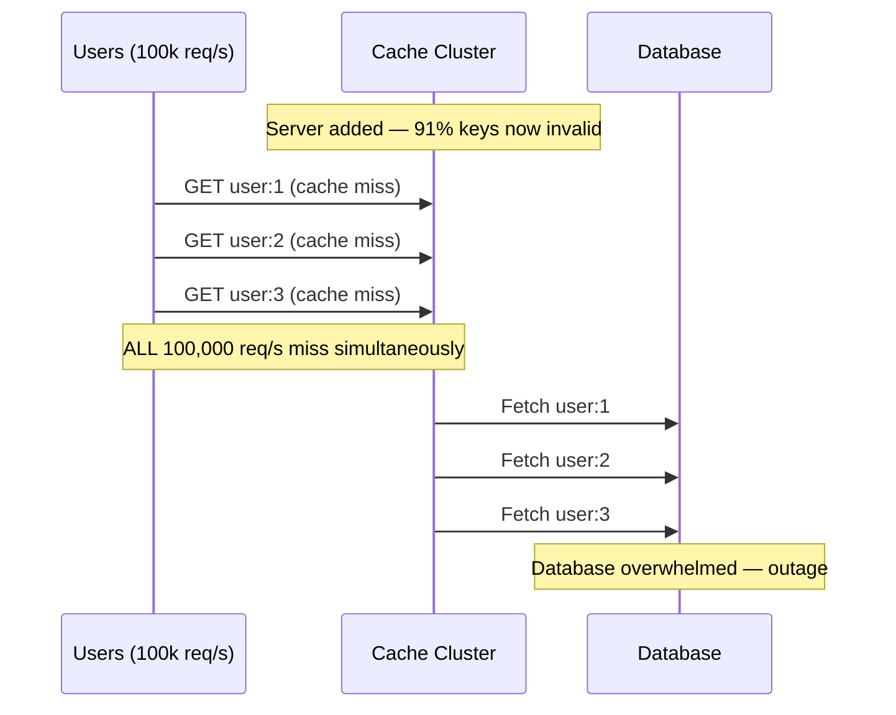

This is called a **thundering herd** or **cache stampede**. It has caused real outages at companies you use every day — Instagram, Twitter, and Facebook have all publicly documented cache stampede incidents.

Think of it this way: during the IPL final, Hotstar (now JioStar) is serving 50 million concurrent streams. They cache video segment metadata aggressively. If they had to add 2 new cache servers and used naive hashing, 50% of all cache entries would be invalidated simultaneously. Every single client would hit the origin servers at once. That is a system-ending event.

**This is the exact problem consistent hashing was invented to solve.**

---

## Part 2 — The Ring: The Core Idea

### Analogy: The Clock Face That Goes to 4 Billion

Think of a clock. Numbers 1 through 12, arranged in a circle, wrapping around. Now imagine this clock has not 12 positions but **2^32 positions** — about 4.3 billion — going from 0 to 4,294,967,295. And when you go past the last position, you wrap back to 0.

This is the **consistent hash ring** (also called the hash ring, the ring continuum, or the token ring).

Here is the key insight — samjho aise:

1. Use a hash function to place your **servers** at positions on this ring
2. Use the same hash function to place your **keys** at positions on this ring
3. A key belongs to the **first server you encounter walking clockwise** from the key's position

That is it. That is the entire idea.

### Visualizing the Ring

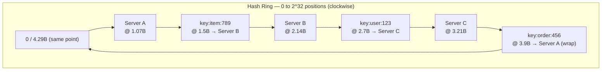

Walking clockwise from each key's position:
- `item:789` (position 1.5B) → walks clockwise → hits **Server B** at 2.14B
- `user:123` (position 2.7B) → walks clockwise → hits **Server C** at 3.21B
- `order:456` (position 3.9B) → walks clockwise → wraps around → hits **Server A** at 1.07B

### Adding a Server — Only Neighbors Are Affected

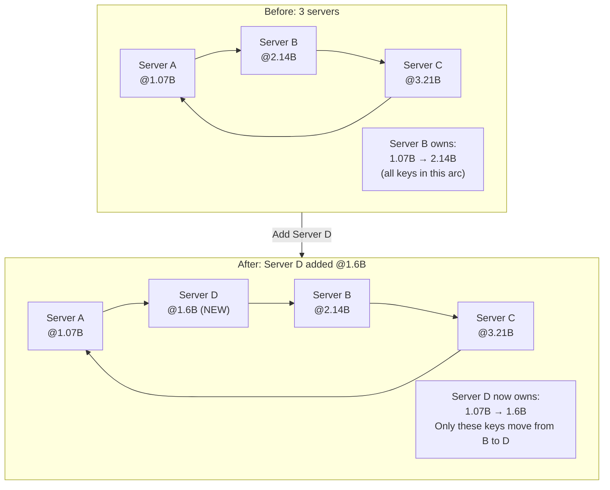

When Server D joins at position 1.6B:
- Keys between 1.07B and 1.6B were owned by Server B
- They move to Server D
- Everything else — every other key on every other arc — stays exactly where it is
- Approximately 1/N of all keys move (where N is the new total number of servers)

### Removing a Server — Only That Server's Keys Redistribute

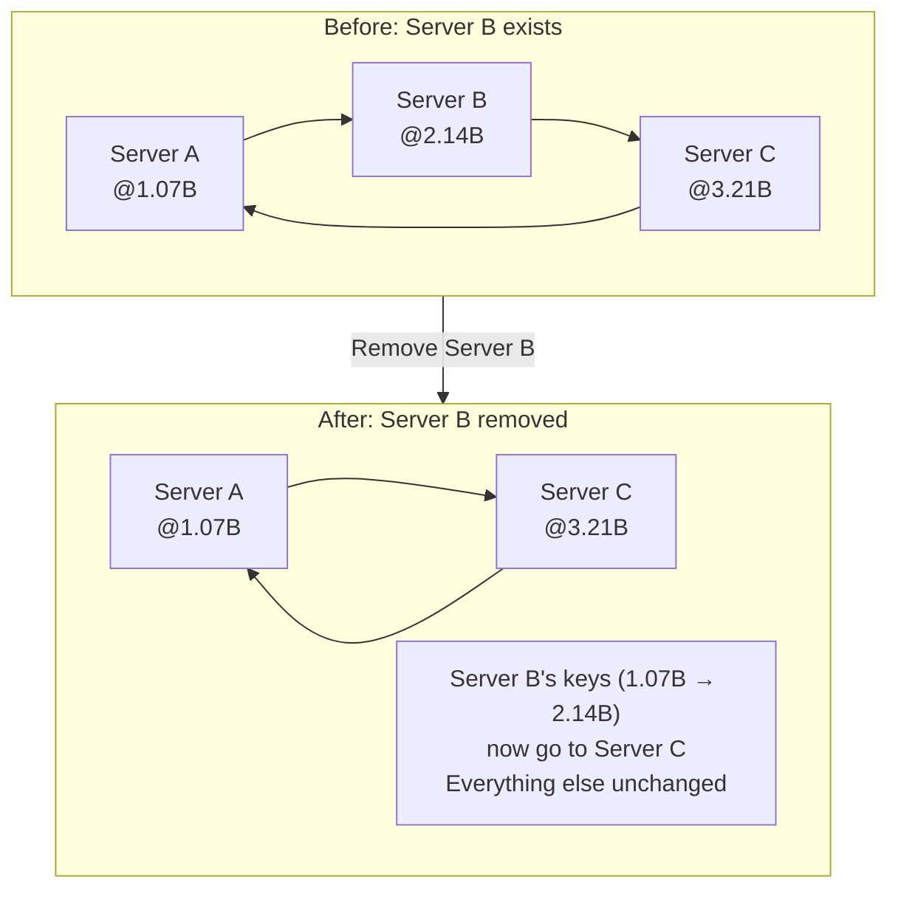

When Server B fails or is decommissioned:
- Only keys in Server B's arc need a new home (they go to Server C, the next clockwise node)
- Every other server keeps exactly its current keys
- Zero disruption beyond what is absolutely necessary

### The Maths That Makes This Elegant

```
When adding the N-th server:
  Keys that move = (Total keys) / N
  = exactly 1/N fraction

This is the THEORETICAL MINIMUM.
No algorithm can do better without violating some other property.
```

| Cluster Change | Naive Hashing | Consistent Hashing |
|---|---|---|
| 3 → 4 servers | 75% move | 25% move (1/4) |
| 10 → 11 servers | 91% move | 9% move (1/11) |
| 100 → 101 servers | ~99% move | ~1% move (1/101) |
| Remove 1 of 10 servers | ~90% move | ~11% move (1/9) |
| Remove 1 of 100 servers | ~99% move | ~1% move (1/99) |

---

## Part 3 — Virtual Nodes: Making It Production-Ready

### The Problem With a Naive Ring

Basic consistent hashing sounds great in theory. But in practice, placing each server at just one point on the ring causes two serious problems:

**Problem 1: Uneven distribution**

Hash functions are random. If you randomly place 3 servers on a 4.3 billion position ring, one server might cover 60% of the ring, another 30%, and the last 10%. That 60% server is overloaded; the 10% server is wasting capacity.

**Problem 2: Can't express heterogeneous capacity**

In the real world, not all servers are equal. You might have a beefy 128GB RAM machine and two standard 32GB machines. You want the beefy machine to handle more data — but a single point on the ring does not let you express that.

**Problem 3: Failed node impact is uneven**

If the server covering 60% of the ring fails, 60% of all keys suddenly need to move to one neighbor. That neighbor gets a massive spike. If the 10% server fails, barely anything changes. This makes capacity planning impossible.

### Analogy: Multiple Franchise Locations

Samjho aise — think of a Zomato dark kitchen chain. Instead of having one big kitchen for each brand, they have many small "virtual" outlets spread across the city. Biryani by Kilo might have 20 outlets spread across Delhi. Faasos might have 25. Even though there are only two brands (two physical companies), their locations are interspersed throughout the city, so every area of Delhi is near at least one of them. Adding a new brand means they open maybe 15-20 small locations scattered across the city, not one giant kitchen in a corner.

Virtual nodes work exactly this way.

### How Virtual Nodes Work

Instead of placing each server at **1** position on the ring, you place each server at **150-200** positions, using different hash inputs:

```python
# Physical server "server-A" gets 150 virtual positions on the ring
for i in range(150):
    vnode_key = f"server-A:vnode:{i}"
    position = hash(vnode_key) % RING_SIZE
    ring[position] = "server-A"
```

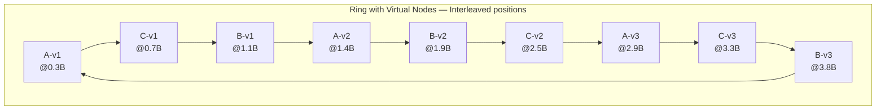

Now the ring has many interleaved positions for each server. The **law of large numbers** ensures that with enough virtual nodes, each server covers roughly equal portions of the ring.

With 150 vnodes per server you typically see under 5% variance in key distribution. With 300 vnodes, under 2%.

### Weighted Capacity With Virtual Nodes

```python
# Different servers get different numbers of vnodes proportional to their capacity
server_config = {
    "small-server":  100,   # 32GB RAM
    "medium-server": 200,   # 64GB RAM
    "large-server":  400,   # 128GB RAM — 4x the small server
}

for server, vnode_count in server_config.items():
    for i in range(vnode_count):
        position = hash(f"{server}:{i}") % RING_SIZE
        ring[position] = server

# Result: large-server handles ~57% of keys, medium handles ~28%, small handles ~14%
# Proportional to their capacity
```

### What Vnodes Do for Failure Recovery

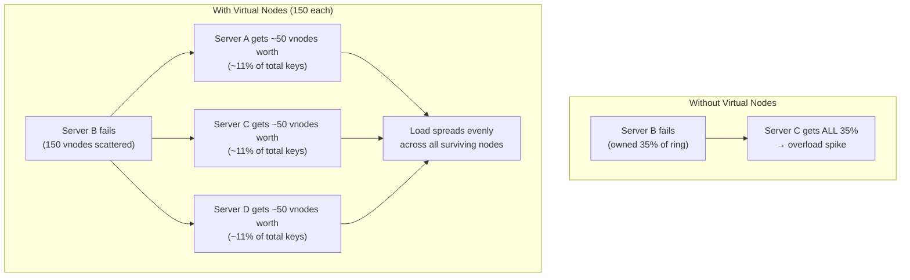

With vnodes, when a server fails, its small scattered chunks are picked up by many different neighbors. No single server takes a disproportionate hit. This is critical for maintaining SLAs during failures.

| Property | Without Vnodes | With Vnodes (150 each) |
|---|---|---|
| Load balance | Poor — luck dependent | Excellent — law of large numbers |
| Node addition impact | One large contiguous range moves | Many small chunks spread evenly |
| Weighted capacity | Not possible | Done via vnode count |
| Failure impact | One neighbor gets all orphaned keys | Spread evenly across all survivors |
| Rebalancing speed | One big transfer | Many parallel small transfers |
| Implementation | Simpler | Slightly more complex |

---

## Part 4 — Full Working Implementation

### Python Implementation

```python
import hashlib
import bisect
from typing import Optional

class ConsistentHashRing:
    """
    Production-quality consistent hash ring with virtual node support.

    How to use:
        ring = ConsistentHashRing(vnodes=150)
        ring.add_server("cache-1")
        ring.add_server("cache-2")
        ring.add_server("cache-3")

        server = ring.get_server("user:12345")
        # Returns same server every time for same key
    """

    def __init__(self, vnodes: int = 150):
        self.vnodes = vnodes
        self.ring: dict[int, str] = {}         # position -> server name
        self.sorted_keys: list[int] = []        # sorted list of all positions

    def _hash(self, key: str) -> int:
        """
        Use MD5 for uniform distribution across the 128-bit space.
        In production, prefer MurmurHash3 (faster, equally uniform).
        """
        return int(hashlib.md5(key.encode()).hexdigest(), 16)

    def add_server(self, server: str, weight: int = 1) -> None:
        """
        Add a server with optional weight (weight=2 means 2x the vnodes).
        Higher weight = handles more traffic.
        """
        actual_vnodes = self.vnodes * weight
        for i in range(actual_vnodes):
            position = self._hash(f"{server}:vnode:{i}")
            self.ring[position] = server
            bisect.insort(self.sorted_keys, position)

    def remove_server(self, server: str, weight: int = 1) -> None:
        """Remove a server and all its virtual nodes."""
        actual_vnodes = self.vnodes * weight
        for i in range(actual_vnodes):
            position = self._hash(f"{server}:vnode:{i}")
            if position in self.ring:
                del self.ring[position]
                idx = bisect.bisect_left(self.sorted_keys, position)
                self.sorted_keys.pop(idx)

    def get_server(self, key: str) -> Optional[str]:
        """
        Find which server owns this key.
        O(log N) via binary search on the sorted positions list.
        """
        if not self.ring:
            return None

        position = self._hash(key)

        # Binary search: find first server position >= key position
        idx = bisect.bisect(self.sorted_keys, position)

        # If we're past the last server, wrap around to the first
        if idx == len(self.sorted_keys):
            idx = 0

        return self.ring[self.sorted_keys[idx]]

    def get_replicas(self, key: str, n: int) -> list[str]:
        """
        Get n distinct servers for replication (like Cassandra's replication factor).
        Returns the key's primary server plus n-1 clockwise neighbors.
        """
        if not self.ring or n > len(set(self.ring.values())):
            return []

        position = self._hash(key)
        idx = bisect.bisect(self.sorted_keys, position) % len(self.sorted_keys)

        servers = []
        seen = set()
        while len(servers) < n:
            server = self.ring[self.sorted_keys[idx % len(self.sorted_keys)]]
            if server not in seen:
                servers.append(server)
                seen.add(server)
            idx += 1

        return servers

    def get_distribution(self, num_keys: int = 10_000) -> dict[str, int]:
        """Simulate distribution of num_keys across the ring."""
        dist: dict[str, int] = {}
        for i in range(num_keys):
            s = self.get_server(f"key:{i}")
            dist[s] = dist.get(s, 0) + 1
        return dist


# --- Demo run ---
if __name__ == "__main__":
    ring = ConsistentHashRing(vnodes=150)

    ring.add_server("cache-1")
    ring.add_server("cache-2")
    ring.add_server("cache-3")

    # Distribution check
    dist = ring.get_distribution(10_000)
    print("Distribution (10,000 keys, 3 servers):")
    for s, count in sorted(dist.items()):
        bar = "#" * (count // 50)
        pct = count / 100
        print(f"  {s}: {count:,} keys ({pct:.1f}%)  {bar}")

    # Replication
    replicas = ring.get_replicas("user:42", n=2)
    print(f"\nReplicas for 'user:42': {replicas}")

    # Measure keys moved when adding a server
    before = {f"key:{i}": ring.get_server(f"key:{i}") for i in range(10_000)}
    ring.add_server("cache-4")
    moved = sum(1 for k in before if ring.get_server(k) != before[k])
    print(f"\nKeys moved after adding cache-4: {moved:,}/10,000 ({moved/100:.1f}%)")
    print(f"Expected ~25% (1 in 4 servers)")
```

**Sample output:**
```
Distribution (10,000 keys, 3 servers):
  cache-1: 3,312 keys (33.1%)  ##################################################################
  cache-2: 3,401 keys (34.0%)  ####################################################################
  cache-3: 3,287 keys (32.9%)  #################################################################

Replicas for 'user:42': ['cache-2', 'cache-3']

Keys moved after adding cache-4: 2,489/10,000 (24.9%)
Expected ~25% (1 in 4 servers)
```

### Java Implementation (TreeMap)

In Java, the standard approach uses `TreeMap<Integer, String>` — a red-black tree that keeps keys sorted and supports `ceilingKey()` (find the smallest key >= given value):

```java
import java.security.MessageDigest;
import java.util.SortedMap;
import java.util.TreeMap;

public class ConsistentHashRing {
    private final TreeMap<Long, String> ring = new TreeMap<>();
    private final int vnodes;

    public ConsistentHashRing(int vnodes) {
        this.vnodes = vnodes;
    }

    private long hash(String key) {
        try {
            MessageDigest md = MessageDigest.getInstance("MD5");
            byte[] digest = md.digest(key.getBytes());
            // Use first 8 bytes as a long
            long h = 0;
            for (int i = 0; i < 8; i++) {
                h = (h << 8) | (digest[i] & 0xff);
            }
            return h;
        } catch (Exception e) {
            throw new RuntimeException(e);
        }
    }

    public void addServer(String server) {
        for (int i = 0; i < vnodes; i++) {
            long position = hash(server + ":vnode:" + i);
            ring.put(position, server);
        }
    }

    public void removeServer(String server) {
        for (int i = 0; i < vnodes; i++) {
            long position = hash(server + ":vnode:" + i);
            ring.remove(position);
        }
    }

    public String getServer(String key) {
        if (ring.isEmpty()) return null;

        long position = hash(key);

        // Find the first entry with key >= position (clockwise lookup)
        SortedMap<Long, String> tailMap = ring.tailMap(position);

        // If nothing is at or after our position, wrap around to the first entry
        Long target = tailMap.isEmpty() ? ring.firstKey() : tailMap.firstKey();

        return ring.get(target);
    }

    public static void main(String[] args) {
        ConsistentHashRing ring = new ConsistentHashRing(150);
        ring.addServer("server-A");
        ring.addServer("server-B");
        ring.addServer("server-C");

        System.out.println(ring.getServer("user:12345"));  // Deterministic result
        System.out.println(ring.getServer("order:99999")); // Deterministic result
    }
}
```

`TreeMap.ceilingKey()` is O(log N) — same complexity as the Python bisect approach. This is the standard Java interview answer.

---

## Part 5 — How Real Systems Use This

### Apache Cassandra — The Gold Standard Example

Cassandra is basically consistent hashing made into a database. Understanding Cassandra's architecture *is* understanding consistent hashing in depth.

**The token ring:**

Every row in Cassandra has a **partition key** (the first part of the primary key). Cassandra hashes the partition key using Murmur3 to get a **token** — a position on the ring. The node responsible for that token range stores the data.

```
cassandra.yaml:
  partitioner: org.apache.cassandra.dht.Murmur3Partitioner
  # Token range: -2^63 to +2^63 (signed 64-bit integers, not 0 to 2^32)
```

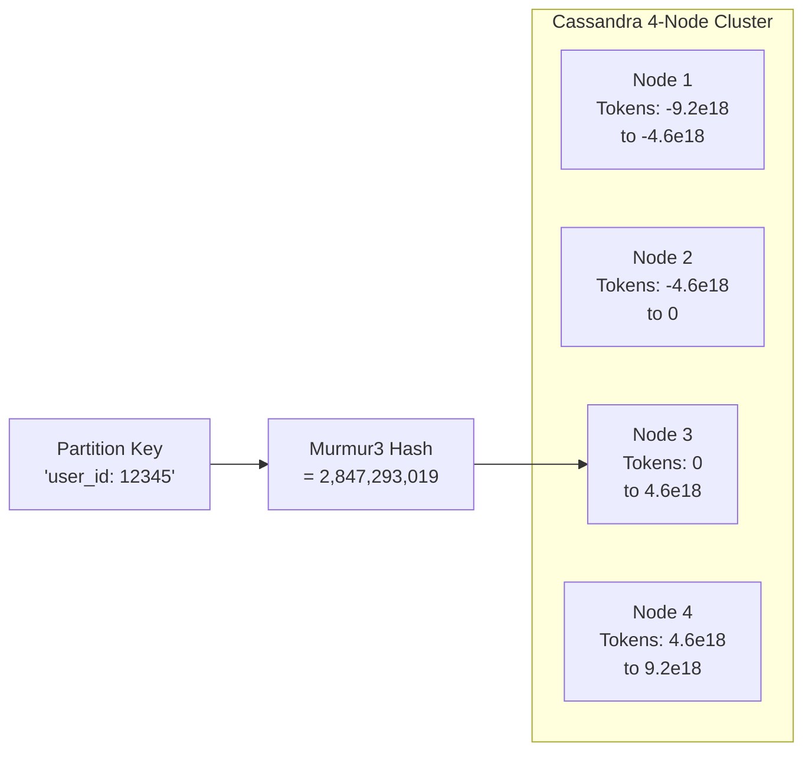

**Vnodes in Cassandra:**

By default since Cassandra 2.0, each node gets **256 virtual tokens** (`num_tokens: 256` in cassandra.yaml). This means when a new node joins, it does not take one big contiguous range from one neighbor. Instead, it takes 256 small slices from all existing nodes, resulting in automatic load balancing.

```
# Without vnodes (manual tokens):
Node 1: tokens = [-9.2e18]
Node 2: tokens = [-4.6e18]
Node 3: tokens = [0]
Node 4: tokens = [4.6e18]
# Each node owns exactly 25% — but only if hash distribution is perfect

# With vnodes (num_tokens: 256):
Node 1: tokens = [-9.1e18, -8.9e18, -8.5e18, ..., (256 positions total)]
Node 2: tokens = [-9.0e18, -8.7e18, -8.3e18, ..., (256 positions total)]
# Each node owns 256 small slices, interleaved across the full range
```

**Replication with the ring:**

Cassandra's replication factor (RF=3) is implemented directly on the ring. For a given key, data is stored on the primary node PLUS the next 2 clockwise physical nodes. This is why the ring model makes replication naturally elegant.

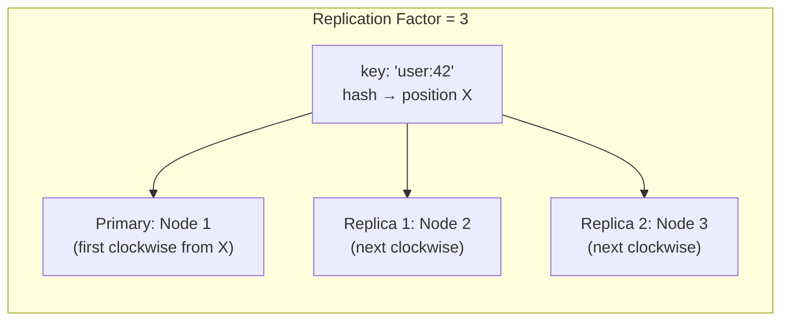

**Real production insight:** If you ever see a Cassandra "hot partition" problem (one node getting way more traffic than others), it is usually because the partition key has low cardinality — like using `country_code` as a partition key means 1.4 billion people's data could go to one node. The fix is to choose high-cardinality partition keys (like `user_id`, `order_id`).

### Amazon DynamoDB

DynamoDB is arguably the most famous user of consistent hashing concepts at scale. AWS has never published the exact implementation details, but the 2007 Dynamo paper (which DynamoDB is based on) describes consistent hashing with virtual nodes in detail.

**How it works in practice:**

When you create a DynamoDB table with a partition key, every write computes `MD5(partition_key_value)` and uses that to route the data to a storage partition. You never see this — it is completely managed.

```
Table: orders
Partition Key: order_id (high cardinality — billions of unique values)

Write: {order_id: "ORD-8827493", amount: 499, ...}
  → DynamoDB: MD5("ORD-8827493") = 0x7f3a9c...
  → Maps to Storage Partition #847
  → Stored on physical nodes responsible for that partition
```

**Why partition key choice matters:**

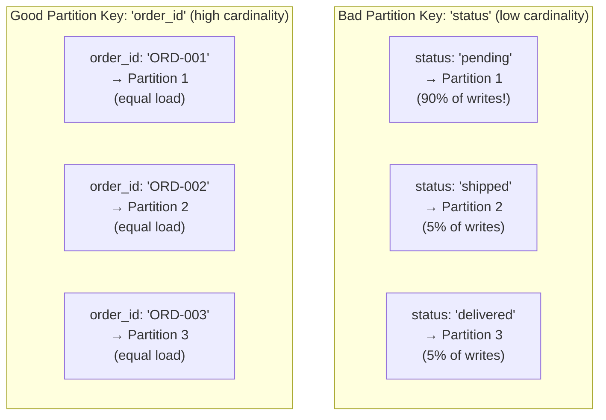

The lesson from DynamoDB: consistent hashing distributes keys uniformly — but only if your keys themselves are uniformly distributed. If you use a date like `2024-01-15` as a partition key, all traffic for that day hits one partition (a "hot partition"). DynamoDB will throttle you and your application breaks.

This is why DynamoDB best practices always emphasize **high-cardinality partition keys**.

**Adaptive capacity:** Modern DynamoDB has "adaptive capacity" — it can automatically isolate hot items to dedicated partitions. But this is a band-aid. The real fix is good partition key design from the start.

### Redis Cluster — Hash Slots (A Clever Variation)

Redis Cluster does not use a pure consistent hash ring. Instead it uses a fixed set of **16,384 hash slots**:

```
HASH_SLOT = CRC16(key) mod 16,384
```

Why 16,384? Redis's creator Salvatore Sanfilippo explained it's a design choice that balances:
- Enough slots to distribute across 1,000+ nodes
- Small enough that the slot assignment table fits in 2KB (16,384 bits)
- Gossip protocol can propagate slot assignments efficiently

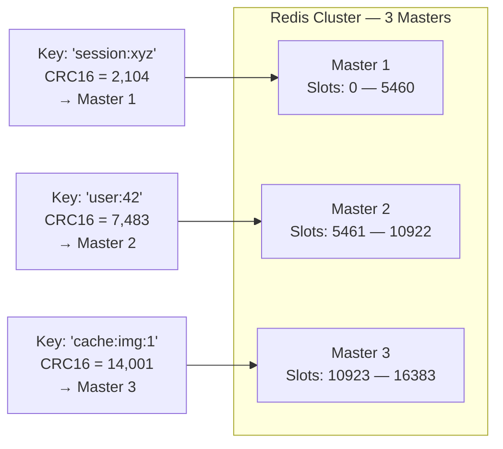

**Key operations during cluster changes:**

```
# Add a 4th master:
CLUSTER ADDSLOTS — then manually (or via redis-cli --cluster rebalance):
Master 4 gets slots 0-1365 from Master 1
Master 4 gets slots 5461-6826 from Master 2
Master 4 gets slots 10923-12287 from Master 3

# Only those slot ranges' keys need to migrate
# Everything else stays put
```

This is conceptually equivalent to consistent hashing — when a node is added, only a fraction (1/N) of data moves. The difference is that Redis makes the partitioning explicit (16,384 discrete slots) rather than continuous (a hash ring).

**Hash tags:** Redis supports grouping keys into the same slot using curly braces:
```
user:{42}:profile    → CRC16("42") → same slot
user:{42}:settings   → CRC16("42") → same slot
user:{42}:orders     → CRC16("42") → same slot
```

This lets you do multi-key operations (MGET, transactions) on related keys that are guaranteed to be on the same node.

### CDN Consistent Hashing — Cache-Everything, All the Time

CDNs like Akamai, Cloudflare, Fastly, and AWS CloudFront use consistent hashing internally to route requests within a Point of Presence (PoP).

**The problem they solve:**

A CDN PoP (say, the Mumbai data center) might have 50 cache servers. When a request comes in for `https://cdn.netflix.com/movie-123/segment-456.ts`, the PoP needs to decide which of its 50 servers should handle it. The requirement is that the SAME URL should ALWAYS go to the SAME cache server — because that server will have the cached segment. If it routes to a random server each time, every server needs to store every piece of content (wasteful), or there will be constant cache misses.

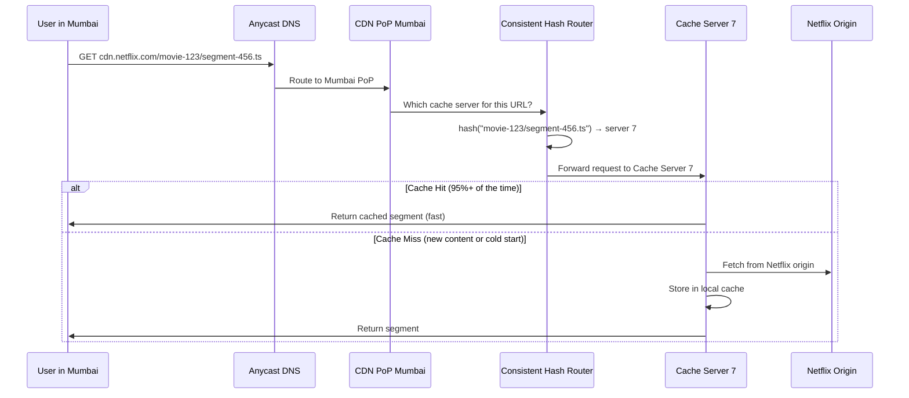

**Why not round-robin?** Round-robin sends each request to a different server. User 1 might hit server 3, User 2 hits server 7, User 3 hits server 3 again (different request for the same content). Server 3 might cache the content, server 7 might not. Cache hit rate becomes a function of luck. For popular content (an Avengers trailer, an IPL live stream), this means the origin server serves millions of requests that should have been cache hits.

**The consistent hashing solution:** Same URL always goes to the same cache server within the PoP. If server 7 has the segment cached, every user wanting that segment hits server 7 and gets a cache hit. Netflix can serve 100 million concurrent streams with a tiny origin server fleet because CDN cache hit rates are 95%+.

**When a cache server fails:** Only the content cached on that failed server needs to be re-fetched from origin. All other content stays on its designated servers. Traffic is only disrupted for ~1/50th of URLs (in a 50-server PoP).

**Real Cloudflare insight:** Cloudflare processes over 45 million HTTP requests per second. They could not do this without consistent cache routing. Their engineers have written about using consistent hashing internally for exactly this purpose.

---

## Part 6 — Rendezvous Hashing (Highest Random Weight)

### The Basic Idea

Rendezvous hashing is an alternative approach that achieves the same guarantee — minimal key movement when servers change — but uses a completely different mechanism. No ring, no sorted data structure needed.

For each (key, server) pair, compute a score using `hash(key + server_name)`. The server with the **highest score** for a given key wins.

```python
import hashlib

def get_server_rendezvous(key: str, servers: list[str]) -> str:
    """
    For each key, score every server. Highest score wins.
    Same key always produces same winner (deterministic).
    When a server is added/removed, only keys that scored that server
    highest need to find a new winner.
    """
    def score(server: str) -> int:
        combined = f"{key}:{server}"
        return int(hashlib.md5(combined.encode()).hexdigest(), 16)

    return max(servers, key=score)


# Weighted rendezvous hashing
import math

def get_server_weighted_rendezvous(key: str, servers: dict[str, float]) -> str:
    """
    servers: {"server-A": 1.0, "server-B": 2.0} — weight proportional to capacity
    """
    def weighted_score(server: str, weight: float) -> float:
        h = int(hashlib.md5(f"{key}:{server}".encode()).hexdigest(), 16)
        # Normalize hash to [0, 1], then apply weight
        normalized = h / (2**128)
        # This formula ensures weighted distribution: -weight / ln(random)
        return -weight / math.log(normalized)

    return max(servers.keys(), key=lambda s: weighted_score(s, servers[s]))
```

### Why It Gives Minimal Key Movement

When you remove Server B from the pool:
- All keys where Server B had the highest score need a new winner
- But Server B had the highest score for ~1/N of all keys (by design of a good hash)
- So ~1/N keys move — same guarantee as consistent hashing

When you add Server D:
- For each key, recalculate scores including Server D
- Server D wins for ~1/(N+1) of all keys
- Those keys move from their previous winners to Server D
- ~1/(N+1) of keys move — again, same guarantee

### Head-to-Head Comparison

| Property | Consistent Hashing (Ring) | Rendezvous Hashing (HRW) |
|---|---|---|
| Data structure needed | Sorted ring + binary search tree | None — just a list of servers |
| Lookup time | O(log N) per lookup | O(N) per lookup — must score all servers |
| Keys moved on change | ~1/N — same | ~1/N — same |
| Implementation complexity | Medium (ring management, vnodes) | Very simple — 5 lines of code |
| Memory usage | O(N x vnodes) | O(N) |
| Load balance | Good with vnodes | Naturally excellent |
| Weighted nodes | Via vnode count (coarse) | Via mathematical weighting (precise) |
| Lookup cost at scale | Great — O(log N) regardless | Poor — O(N) per request |
| Best use case | Large server counts (100+) | Small server counts (10-20) |
| Used by | Cassandra, DynamoDB, CDNs | Varnish cache, some load balancers |

**When to use rendezvous hashing:**
- You have 10-20 servers and simplicity matters
- You cannot tolerate the ring management overhead
- You need precise weight control
- Read performance is not the bottleneck (O(N) is acceptable for your scale)

**When to use consistent hashing:**
- You have many servers (50+)
- Lookup latency matters — O(log N) vs O(N) is significant at scale
- You already need vnodes for distribution balance
- You are building a database or cache cluster (standard choice)

---

## Part 7 — Common Pitfalls and Gotchas

### 1. Hot Key Problem (Not Fixed by Consistent Hashing)

Consistent hashing distributes **keys** evenly across nodes. But it does not distribute **load** evenly if some keys are accessed far more than others.

```
Example: Instagram celebrity post
  Key: "post:celebrity_id:likes" → Server B
  Requests: 50 million per hour → ALL go to Server B
  Server B: dead

Consistent hashing cannot help here — it is a single-key problem,
not a distribution problem.
```

**Solutions for hot keys:**
- Application-level sharding: `post:{user_id}:{shard_id}:likes` where shard_id rotates
- Read replicas specifically for hot keys
- In-memory local caching with short TTLs before hitting distributed cache
- Write-behind batching (accumulate increments, flush periodically)

### 2. Too Few Virtual Nodes = Bad Distribution

With only 10 vnodes per server, the law of large numbers hasn't kicked in yet. You can easily get 50% / 30% / 20% distribution instead of 33% / 33% / 33%.

```
vnodes per server → typical variance in key distribution:
  1    → 40-60% variance (terrible)
  10   → 15-25% variance (bad)
  50   → 5-10% variance (acceptable)
  150  → 2-5% variance (good)
  300  → 1-2% variance (excellent)
  500+ → <1% variance (diminishing returns)
```

Cassandra's default of 256 vnodes is well-calibrated. Redis Cluster's 16,384 slots effectively gives thousands of vnodes per node.

### 3. Non-Uniform Keys Break the Assumption

Consistent hashing assumes keys hash uniformly across the ring. But if your keys are sequential integers (timestamps, auto-increment IDs), they cluster rather than spread.

```python
# Problem: sequential IDs cluster
keys = ["order:1", "order:2", "order:3", ...]
# hash("order:1"), hash("order:2"), etc. might cluster on the ring
# One server gets all recent orders

# Fix: add a random component or use the raw ID (not prefixed string)
# Better partition key design: composite key with user_id
keys = ["user:42:order:1", "user:99:order:1", "user:17:order:1"]
```

### 4. Hash Function Choice Matters

| Hash Function | Speed | Distribution | Used in |
|---|---|---|---|
| MD5 | Slow | Excellent | Python demos, older systems |
| SHA-1 | Slow | Excellent | Avoid — too slow |
| MurmurHash3 | Fast | Excellent | Cassandra, most modern systems |
| xxHash | Very fast | Excellent | High-throughput systems |
| CRC32 | Fast | Mediocre | Redis Cluster (CRC16) |
| Python's `hash()` | Very fast | Poor (salted per-process!) | Never for distributed use |

**Critical warning:** Python's built-in `hash()` is salted differently on each process startup (since Python 3.3). `hash("user:42")` returns different values in different Python processes. For distributed systems, always use a deterministic hash function like MD5, MurmurHash3, or xxHash.

### 5. The "Consistent" in Consistent Hashing is Misleading

The word "consistent" here does NOT mean:
- ACID consistency (transaction guarantees)
- CAP theorem consistency (all nodes see the same data at the same time)
- Strong consistency (linearizability)

It means **consistent assignment** — the same key consistently maps to the same server, for a given set of servers. Yeh ek common interview trap hai. If an interviewer asks "does consistent hashing provide strong consistency?" the answer is a confident "no — the term refers to consistent key-to-server assignment, not data consistency guarantees."

### 6. Cascading Failures Without Replication

If you use consistent hashing for caching without replication and a server fails, every key that server owned is now a cache miss. If that server owned 10% of keys and you have 1 million requests/sec, that is 100,000 cache misses/sec suddenly hitting your database — potentially causing a cascade.

**Solution:** Always combine consistent hashing with replication (store each key on the next 2-3 clockwise nodes as well). Cassandra does this automatically via the replication factor.

---

## Part 8 — Putting It All Together: Architecture Patterns

### Pattern 1 — Distributed Cache with Consistent Hashing

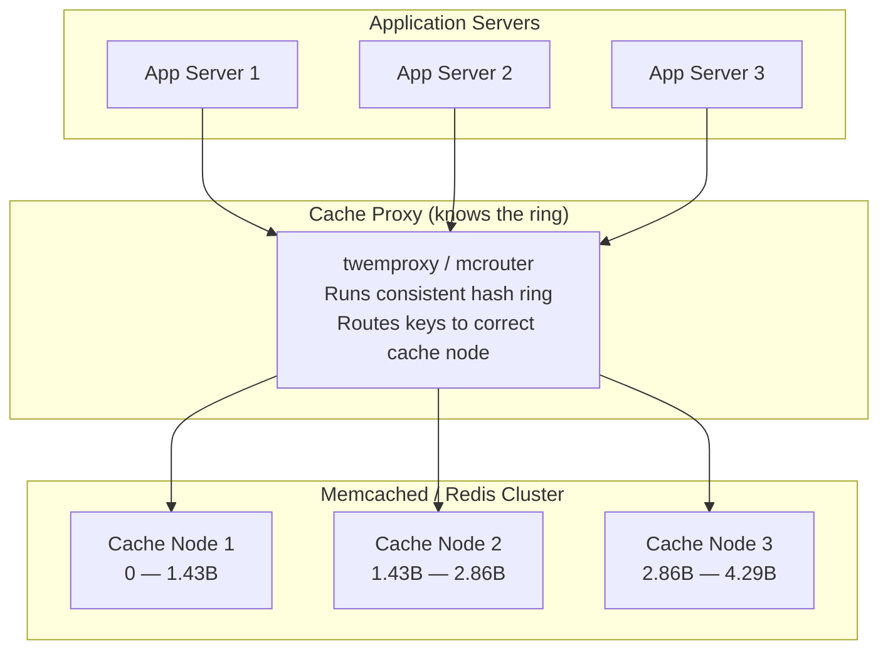

### Pattern 2 — Database Sharding

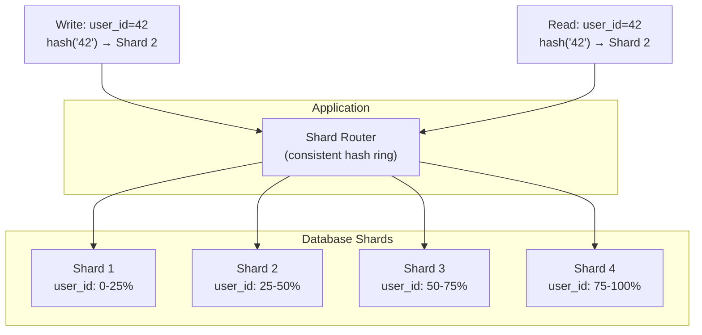

### Pattern 3 — WebSocket Server Routing (Discord-style)

Discord famously uses consistent hashing to route WebSocket connections. Each user's WebSocket connection needs to always go to the same gateway server — because that server maintains the stateful connection. When gateway servers are added for scaling or a server crashes, consistent hashing ensures minimal connection disruption.

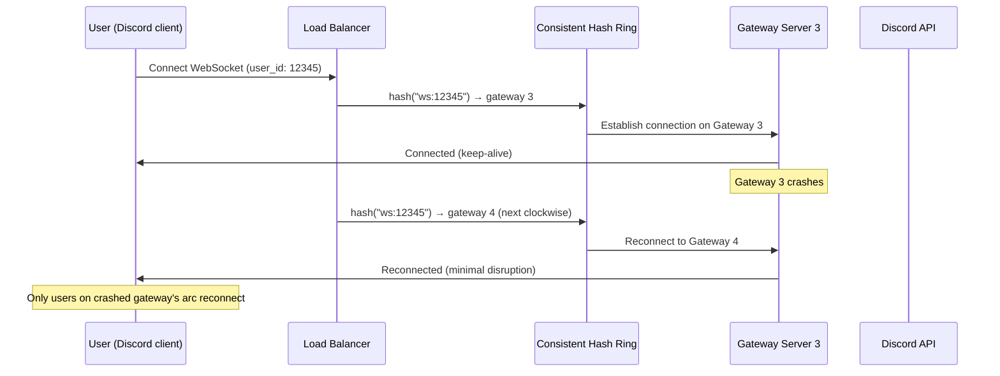

### Pattern 4 — CDN Request Routing Within a PoP

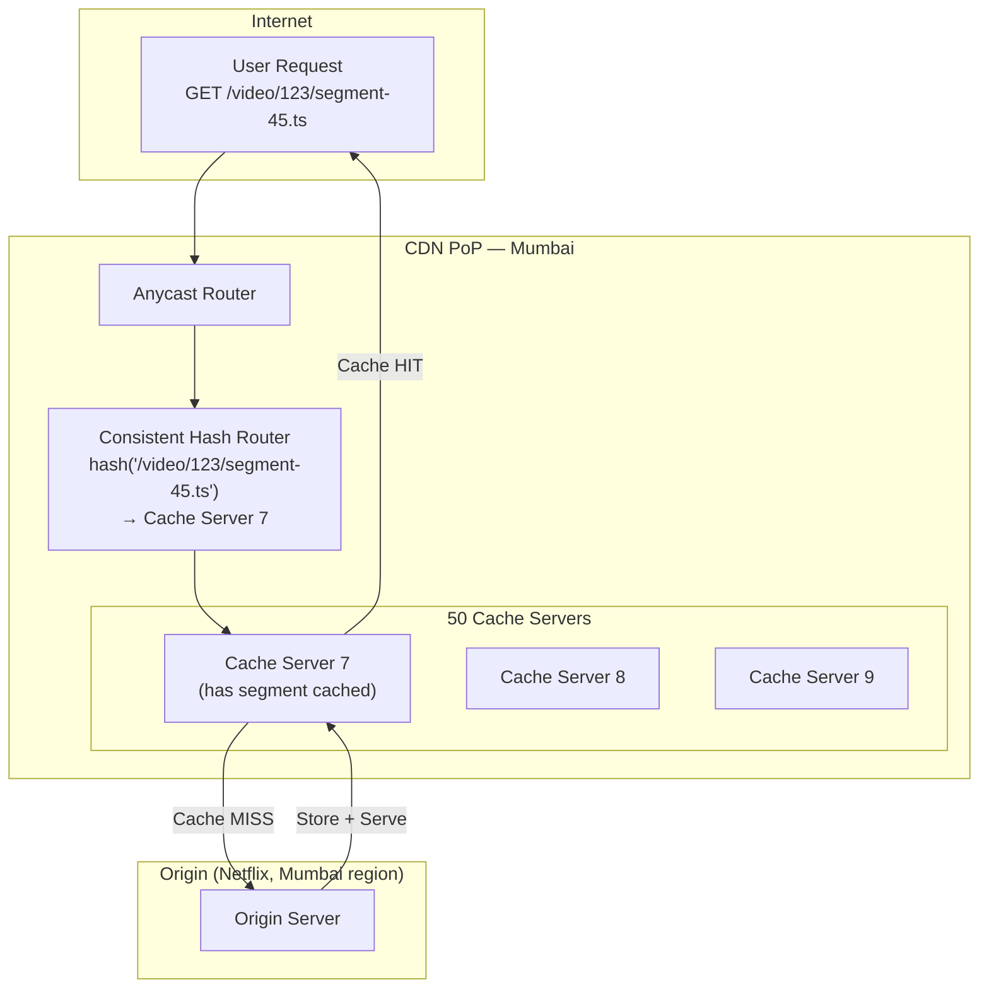

---

## Part 9 — Common Interview Questions

These are the questions interviewers actually ask. Understand these deeply — not to memorize, but because they test the depth of your understanding.

---

**Q1: "Why can't we just use modulo hashing for distributed caching? What's wrong with it?"**

The key insight they want: when N changes, almost all keys remap. Going from 10 to 11 servers causes 91% of keys to map to different servers. In a cache, this means 91% cache miss rate, flooding the database. Consistent hashing limits this to 1/N keys.

---

**Q2: "Explain how consistent hashing works. Walk me through adding a new server."**

Walk them through:
1. Hash ring from 0 to 2^32
2. Servers placed at ring positions by hashing their names/IPs
3. Keys routed to first server clockwise
4. Adding server D at position X: only keys between the predecessor server's position and X move to D
5. Approximately 1/N total keys move
6. Without vnodes: risk of uneven arc sizes. With vnodes (150-256 per server): near-even distribution

---

**Q3: "What are virtual nodes? Why do we need them?"**

Three reasons:
1. **Distribution:** Single points land randomly; with many virtual nodes, law of large numbers gives ~even distribution
2. **Weighted capacity:** More vnodes = handles more load. Express heterogeneous hardware
3. **Failure handling:** When a server fails, its many scattered vnodes' keys spread across ALL surviving servers rather than all hitting one neighbor

---

**Q4: "How does Cassandra use consistent hashing?"**

- Murmur3 partitioner hashes partition keys to tokens (-2^63 to +2^63)
- 256 vnodes per node by default (num_tokens: 256 in cassandra.yaml)
- Replication factor copies data to next N-1 clockwise physical nodes
- When a node joins, it gets 256 small ranges from across the cluster
- nodetool status shows each node's token ranges and load

---

**Q5: "How does Redis Cluster differ from consistent hashing?"**

Redis uses 16,384 fixed hash slots (CRC16 mod 16384) rather than a continuous ring. Slots are assigned to nodes explicitly. This is conceptually equivalent — when nodes are added/removed, only the affected slots' keys migrate (~1/N). The fixed slot count makes the assignment table very small (16,384 bits = 2KB) and easy to gossip across the cluster.

---

**Q6: "What is rendezvous hashing? When would you use it over consistent hashing?"**

Rendezvous: for each key, score every server with `hash(key + server_name)`. Highest score wins. Same ~1/N key movement guarantee, but O(N) lookup vs O(log N) for consistent hashing. Use rendezvous for small clusters (under 20 servers) where simplicity matters. Use consistent hashing for large clusters where O(N) lookup would be too slow.

---

**Q7: "What does 'consistent' mean in consistent hashing?"**

Trap question! "Consistent" means **consistent assignment** — the same key always maps to the same server for a given set of servers. It does NOT mean CAP-theorem consistency, ACID consistency, or strong consistency. The name is historically confusing. Always clarify this in interviews.

---

**Q8: "What problems does consistent hashing NOT solve?"**

- Hot keys: one key getting millions of requests still hits one server
- Data skew: if your partition keys are not high-cardinality, load is still uneven
- Strong consistency: this is about placement, not replication guarantees
- Cross-shard transactions: you still need two-phase commit or saga patterns
- The actual hashing guarantees assume keys distribute uniformly — non-uniform keys break this

---

**Q9: "How would you implement consistent hashing in Java?"**

`TreeMap<Long, String>` — positions as keys, server names as values. `treeMap.tailMap(position).firstKey()` gives the first server clockwise (with wrap-around to `treeMap.firstKey()` if tailMap is empty). Add server: insert vnodes via `treeMap.put()`. Remove: delete vnodes via `treeMap.remove()`. Lookup: O(log N). Mention why TreeMap works: it's a sorted red-black tree with efficient range queries.

---

**Q10: "Design a distributed cache like Memcached. How do you handle server failures?"**

1. Consistent hash ring with all Memcached nodes as servers
2. When a node fails, ring routes its keys to the next clockwise node (automatic failover)
3. With vnodes, the failed node's load spreads across all surviving nodes
4. Consider replication: store each key on the primary + 1-2 next clockwise nodes for redundancy
5. Use a proxy layer (like twemproxy or mcrouter) to run the ring logic, so app servers stay stateless
6. For cache stampede protection: mutex locks or probabilistic early expiration on cache misses

---

## Key Takeaways

1. **Naive modulo hashing is a production hazard.** Adding or removing one server causes the majority of keys to remap, creating a thundering herd on your database. At scale (IPL streaming, Instagram post going viral), this means outage.

2. **The ring is the insight.** Arranging hash space as a circle means each server owns a contiguous arc. Changes only affect adjacent arcs. The rest of the system is completely undisturbed.

3. **Virtual nodes make it production-ready.** One point per server → terrible distribution. 150-256 vnodes per server → near-perfect distribution via law of large numbers. Plus: express capacity differences, spread failure impact across the whole cluster.

4. **The math is tight.** Adding the N-th server moves exactly 1/N of keys — the theoretical minimum. No algorithm can do better without violating the assignment consistency property.

5. **The big three use it differently but share the core idea:**
   - Cassandra: continuous Murmur3 ring, 256 vnodes, built-in replication
   - DynamoDB: fully managed ring, partition key design is your only lever
   - Redis Cluster: 16,384 discrete slots instead of continuous ring, explicit slot assignment

6. **CDNs need it for cache efficiency.** Same URL → same cache server within a PoP → 95%+ cache hit rates → origin servers serve a tiny fraction of total traffic.

7. **Rendezvous hashing is the simpler sibling.** Same 1/N guarantee, no ring data structure, but O(N) lookup. Use for small clusters or when implementation simplicity trumps lookup performance.

8. **The word "consistent" is misleading.** It means consistent key-to-server assignment — not ACID consistency, not CAP consistency. This trips up candidates in interviews regularly.

9. **Consistent hashing solves placement, not hotness.** A celebrity's post getting 50M likes still hits one server. Consistent hashing cannot help with a hot-key problem — that requires application-level sharding, read replicas, or local caching.

10. **Implementation is O(log N).** The sorted data structure (TreeMap in Java, bisect in Python, SortedSet in Redis) makes lookups fast even with millions of keys being assigned per second.

---

> **What to explore next:** CAP Theorem — why distributed systems must make trade-offs between Consistency, Availability, and Partition Tolerance, and how consistent hashing fits into the larger picture of distributed data stores.
